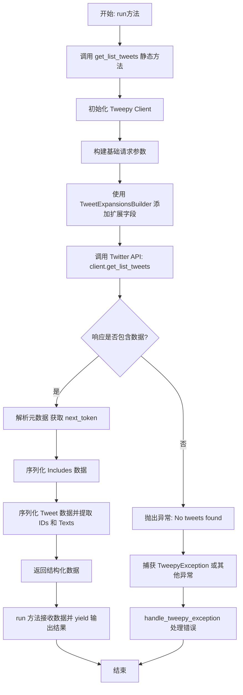
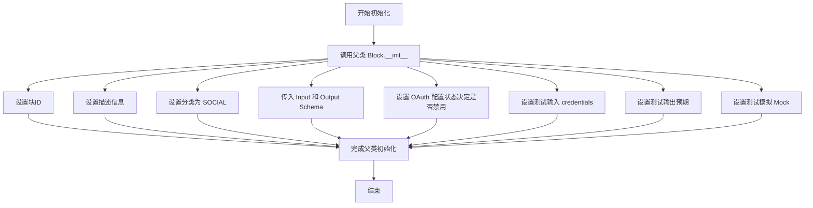
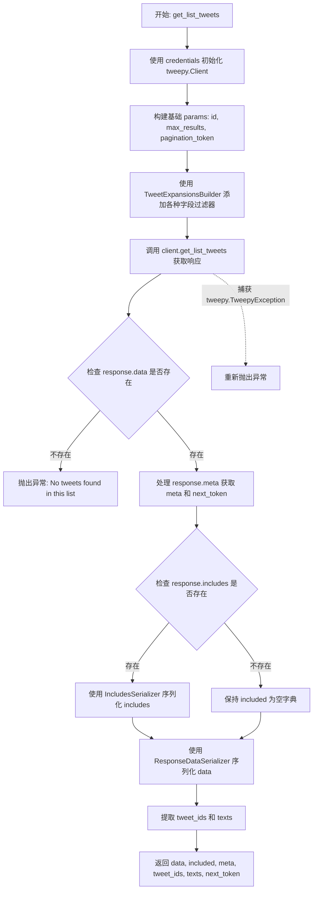
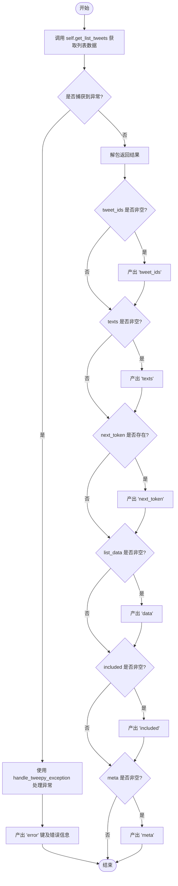

# `AutoGPT\autogpt_platform\backend\backend\blocks\twitter\lists\list_tweets_lookup.py` 详细设计文档

该代码实现了一个Twitter列表推文获取模块，通过Tweepy客户端与Twitter API交互，支持根据列表ID、分页令牌和字段扩展参数检索推文列表，并提供了完整的数据序列化、错误处理和异步输出功能。

## 整体流程



## 类结构

```
TwitterGetListTweetsBlock (Block)
├── Input (TweetExpansionInputs)
│   ├── credentials: TwitterCredentialsInput
│   ├── list_id: str
│   ├── max_results: int | None
│   └── pagination_token: str | None
├── Output (BlockSchemaOutput)
│   ├── tweet_ids: list[str]
│   ├── texts: list[str]
│   ├── next_token: str
│   ├── data: list[dict]
│   ├── included: dict
│   └── meta: dict
├── __init__
├── get_list_tweets (staticmethod)
└── run (async)
```

## 全局变量及字段


### `TwitterGetListTweetsBlock.Input.credentials`
    
Twitter authentication credentials information

类型：`TwitterCredentialsInput`
    


### `TwitterGetListTweetsBlock.Input.list_id`
    
The ID of the List whose Tweets you would like to retrieve

类型：`str`
    


### `TwitterGetListTweetsBlock.Input.max_results`
    
Maximum number of results per page (1-100)

类型：`int | None`
    


### `TwitterGetListTweetsBlock.Input.pagination_token`
    
Token for paginating through results

类型：`str | None`
    


### `TwitterGetListTweetsBlock.Output.tweet_ids`
    
List of tweet IDs

类型：`list[str]`
    


### `TwitterGetListTweetsBlock.Output.texts`
    
List of tweet texts

类型：`list[str]`
    


### `TwitterGetListTweetsBlock.Output.next_token`
    
Token for next page of results

类型：`str`
    


### `TwitterGetListTweetsBlock.Output.data`
    
Complete list tweets data

类型：`list[dict]`
    


### `TwitterGetListTweetsBlock.Output.included`
    
Additional data requested via expansions

类型：`dict`
    


### `TwitterGetListTweetsBlock.Output.meta`
    
Response metadata including pagination tokens

类型：`dict`
    
    

## 全局函数及方法


### `TwitterGetListTweetsBlock.__init__`

初始化 `TwitterGetListTweetsBlock` 实例，配置块的元数据、输入输出模型、测试数据以及根据环境变量设定的启用状态。

参数：

-  `self`：`TwitterGetListTweetsBlock`，类的实例引用

返回值：`None`，无返回值

#### 流程图



#### 带注释源码

```python
def __init__(self):
    # 调用父类 Block 的构造函数，传入配置参数
    super().__init__(
        # 块的唯一标识符
        id="6657edb0-a62f-11ef-8c10-0326d832467d",
        # 块的功能描述
        description="This block retrieves tweets from a specified Twitter list.",
        # 块所属的分类，这里归为社交媒体类
        categories={BlockCategory.SOCIAL},
        # 定义块的输入数据结构模型
        input_schema=TwitterGetListTweetsBlock.Input,
        # 定义块的输出数据结构模型
        output_schema=TwitterGetListTweetsBlock.Output,
        # 根据 Twitter OAuth 是否配置来决定是否禁用该块
        disabled=not TWITTER_OAUTH_IS_CONFIGURED,
        # 定义测试用的输入参数，包括 list_id, credentials 等
        test_input={
            "list_id": "84839422",
            "max_results": 1,
            "pagination_token": None,
            "credentials": TEST_CREDENTIALS_INPUT,
            "expansions": None,
            "media_fields": None,
            "place_fields": None,
            "poll_fields": None,
            "tweet_fields": None,
            "user_fields": None,
        },
        # 传入测试用的凭证对象
        test_credentials=TEST_CREDENTIALS,
        # 定义预期的测试输出结果，用于验证功能
        test_output=[
            ("tweet_ids", ["1234567890"]),
            ("texts", ["Test tweet"]),
            ("data", [{"id": "1234567890", "text": "Test tweet"}]),
        ],
        # 定义模拟函数，用于在测试环境中模拟 API 调用行为，避免真实请求
        test_mock={
            "get_list_tweets": lambda *args, **kwargs: (
                [{"id": "1234567890", "text": "Test tweet"}],
                {},
                {},
                ["1234567890"],
                ["Test tweet"],
                None,
            )
        },
    )
```


### `TwitterGetListTweetsBlock.get_list_tweets`

该方法是一个静态方法，主要负责通过 Tweepy 客户端从指定的 Twitter 列表中获取推文。它构建请求参数，调用 API，处理响应数据（包括元数据、扩展信息和推文内容），并对数据进行序列化处理，最后返回结构化的结果或抛出异常。

参数：

-  `credentials`：`TwitterCredentials`，包含用于访问 Twitter API 的认证凭据（如 bearer token）。
-  `list_id`：`str`，要获取推文的 Twitter 列表的 ID。
-  `max_results`：`int | None`，每页返回的最大结果数（通常在 1-100 之间）。
-  `pagination_token`：`str | None`，用于分页检索结果的令牌。
-  `expansions`：`ExpansionFilter | None`，用于请求扩展数据对象（如用户、媒体等）的字段过滤器。
-  `media_fields`：`TweetMediaFieldsFilter | None`，指定返回的媒体对象字段。
-  `place_fields`：`TweetPlaceFieldsFilter | None`，指定返回的地点对象字段。
-  `poll_fields`：`TweetPollFieldsFilter | None`，指定返回的投票对象字段。
-  `tweet_fields`：`TweetFieldsFilter | None`，指定返回的推文对象字段。
-  `user_fields`：`TweetUserFieldsFilter | None`，指定返回的用户对象字段。

返回值：`tuple`，包含以下六个元素的元组：
1. `data` (list[dict]): 序列化后的推文列表数据。
2. `included` (dict): 序列化后的扩展数据（如用户、媒体等）。
3. `meta` (dict): 响应的元数据，通常包含分页信息。
4. `tweet_ids` (list[str]): 推文 ID 列表。
5. `texts` (list[str]): 推文文本内容列表。
6. `next_token` (str | None): 下一页的分页令牌。

#### 流程图



#### 带注释源码

```python
    @staticmethod
    def get_list_tweets(
        credentials: TwitterCredentials,
        list_id: str,
        max_results: int | None,
        pagination_token: str | None,
        expansions: ExpansionFilter | None,
        media_fields: TweetMediaFieldsFilter | None,
        place_fields: TweetPlaceFieldsFilter | None,
        poll_fields: TweetPollFieldsFilter | None,
        tweet_fields: TweetFieldsFilter | None,
        user_fields: TweetUserFieldsFilter | None,
    ):
        try:
            # 1. 使用传入的凭据初始化 Tweepy 客户端，这里使用 bearer_token
            client = tweepy.Client(
                bearer_token=credentials.access_token.get_secret_value()
            )

            # 2. 准备基础请求参数，处理分页 token 的空字符串情况
            params = {
                "id": list_id,
                "max_results": max_results,
                "pagination_token": (
                    None if pagination_token == "" else pagination_token
                ),
                "user_auth": False,
            }

            # 3. 使用构建器模式添加扩展字段和各类字段过滤器
            params = (
                TweetExpansionsBuilder(params)
                .add_expansions(expansions)
                .add_media_fields(media_fields)
                .add_place_fields(place_fields)
                .add_poll_fields(poll_fields)
                .add_tweet_fields(tweet_fields)
                .add_user_fields(user_fields)
                .build()
            )

            # 4. 调用 Twitter API 获取列表推文
            response = cast(Response, client.get_list_tweets(**params))

            # 初始化返回变量
            meta = {}
            included = {}
            tweet_ids = []
            texts = []
            next_token = None

            # 5. 处理元数据，提取下一页的 token
            if response.meta:
                meta = response.meta
                next_token = meta.get("next_token")

            # 6. 处理附加数据，进行序列化
            if response.includes:
                included = IncludesSerializer.serialize(response.includes)

            # 7. 处理推文数据主体
            if response.data:
                data = ResponseDataSerializer.serialize_list(response.data)
                # 提取 ID 和文本列表
                tweet_ids = [str(item.id) for item in response.data]
                texts = [item.text for item in response.data]

                # 8. 返回包含所有处理结果的元组
                return data, included, meta, tweet_ids, texts, next_token

            # 如果没有数据，抛出异常
            raise Exception("No tweets found in this list")

        # 捕获 Tweepy 异常并重新抛出，由上层处理
        except tweepy.TweepyException:
            raise
```


### `TwitterGetListTweetsBlock.run`

异步执行获取指定 Twitter 列表推文的逻辑，处理输入数据、调用底层获取方法，并产出处理后的结果或错误信息。

参数：

-  `input_data`：`Input`，包含列表 ID、分页令牌、最大结果数及各类扩展字段过滤器的输入数据对象。
-  `credentials`：`TwitterCredentials`，Twitter API 认证凭据对象，包含访问令牌用于授权。
-  `**kwargs`：`dict`，额外的关键字参数（当前方法未直接使用，用于接口兼容）。

返回值：`BlockOutput`，一个异步生成器，逐步产出推文 ID、文本、分页令牌、完整数据、附加信息或错误详情。

#### 流程图



#### 带注释源码

```python
    async def run(
        self,
        input_data: Input,
        *,
        credentials: TwitterCredentials,
        **kwargs,
    ) -> BlockOutput:
        try:
            # 调用静态方法 self.get_list_tweets，传入凭证和输入数据中的各个字段
            # 解包返回的元组，获取列表数据、附加信息、元数据、推文ID列表、文本列表和下一页令牌
            list_data, included, meta, tweet_ids, texts, next_token = (
                self.get_list_tweets(
                    credentials,
                    input_data.list_id,
                    input_data.max_results,
                    input_data.pagination_token,
                    input_data.expansions,
                    input_data.media_fields,
                    input_data.place_fields,
                    input_data.poll_fields,
                    input_data.tweet_fields,
                    input_data.user_fields,
                )
            )

            # 根据数据是否存在，产出对应的结果键值对
            if tweet_ids:
                yield "tweet_ids", tweet_ids
            if texts:
                yield "texts", texts
            if next_token:
                yield "next_token", next_token
            if list_data:
                yield "data", list_data
            if included:
                yield "included", included
            if meta:
                yield "meta", meta

        except Exception as e:
            # 捕获执行过程中的异常，使用 handle_tweepy_exception 处理后产出错误信息
            yield "error", handle_tweepy_exception(e)
```


## 关键组件


### TwitterGetListTweetsBlock
负责定义输入输出模式、管理认证并从指定 Twitter 列表异步获取推文的核心逻辑块。

### TweetExpansionsBuilder
用于聚合各种字段过滤器（如媒体、用户、推文字段）和扩展请求，以构建 API 查询参数字典的组件。

### ResponseDataSerializer
将原始 Twitter API 推文数据对象列表转换为标准化字典列表格式的序列化组件。

### IncludesSerializer
将与推文关联的扩展资源（如用户、媒体、地点）的原始 Twitter API 响应转换为字典格式的序列化组件。

### Tweepy Client
与 Twitter API v2 进行交互的外部客户端，处理实际的网络请求和基于不记名令牌的认证。

### TwitterCredentials
封装访问令牌等安全信息的认证组件，用于验证 Twitter API 的请求。

### Error Handling
捕获并转换 Tweepy 库异常为标准化错误输出信息的组件。


## 问题及建议


### 已知问题

-   **异步阻塞问题**：`run` 方法被定义为 `async`，但在其内部调用的 `get_list_tweets` 方法使用了同步的 `tweepy.Client`。这会阻塞事件循环，导致在处理大量并发请求或等待 I/O 时性能显著下降。
-   **空结果异常处理不当**：在 `get_list_tweets` 方法中，当列表中暂时没有推文（`response.data` 为空）时，代码会抛出 `Exception("No tweets found in this list")`。这种将“合法的空数据”视为“错误”的处理方式，会导致调用方必须处理异常，且在 `run` 方法的输出中会产生 `error` 字段，使得下游流程难以区分是“查询失败”还是“查询成功但无数据”。
-   **默认参数处理逻辑冗余**：`Input` 类中 `pagination_token` 的默认值被设为空字符串 `""`，而在 `get_list_tweets` 方法中又需要显式判断 `if pagination_token == ""` 并将其转换为 `None`。这种处理方式增加了不必要的运行时判断，且容易导致类型混淆。

### 优化建议

-   **采用异步客户端**：将 `tweepy.Client` 替换为 `tweepy.AsyncClient`，并将 `get_list_tweets` 修改为异步方法（`async def`），在 `run` 方法中使用 `await` 调用。这将解决阻塞问题，充分利用 Python 的异步特性。
-   **规范化空结果响应**：移除当 `response.data` 为空时抛出异常的逻辑。相反，应当返回空的列表（如 `data=[]`, `tweet_ids=[]`）和相应的元数据。这样符合 API 集成的常规契约，即“空结果”也是一种有效的成功响应。
-   **优化输入 Schema 设计**：将 `Input.pagination_token` 的默认值直接设置为 `None`，并移除 `get_list_tweets` 中关于空字符串转 `None` 的逻辑。这样可以保持类型的一致性（`str | None`），简化代码逻辑。
-   **增强日志与可观测性**：在捕获 `tweepy.TweepyException` 或其他异常时，建议添加结构化的日志记录（如记录 `list_id`、`max_results` 等关键参数），以便在生产环境中快速定位问题，而不仅仅是依赖 `handle_tweepy_exception` 返回的错误信息。


## 其它


### 设计目标与约束

1. **模块化与集成性**：该代码被设计为一个独立的 Block 组件（继承自 `Block`），旨在集成到无代码/低代码工作流平台中。它必须遵循特定的输入/输出接口契约（`Input` 和 `Output` 类），以便在可视化编辑器中被调用和链接。
2. **安全性**：通过 `TwitterCredentialsInput` 和 `TwitterCredentials` 封装 OAuth 访问令牌，确保敏感信息（如 Access Token）不会直接暴露在代码逻辑中，而是通过受管理的凭据系统传递。
3. **灵活性与扩展性**：利用 `TweetExpansionsBuilder` 和一系列 Filter 类（如 `ExpansionFilter`, `TweetMediaFieldsFilter`），允许用户动态配置 API 请求参数（扩展字段、媒体字段等），无需修改代码即可适应不同的数据获取需求。
4. **异步非阻塞**：作为工作流的一部分，`run` 方法被设计为异步生成器（`async def`），以支持高并发场景下的非阻塞执行，避免长时间等待网络 I/O 阻塞主线程。
5. **约束限制**：
   - **API 限制**：受到 Twitter API V2 的严格限制，特别是 `max_results` 参数在 1 到 100 之间（代码中虽未强制校验逻辑，但描述中已注明，且受限于 API 端）。
   - **依赖库版本**：强依赖于 `tweepy` 库的行为及其对 Twitter API V2 的实现细节，例如 `Response` 对象的结构。
   - **分页机制**：仅支持基于 `pagination_token` 的向前分页，不支持反向分页。

### 错误处理与异常设计

1. **分层异常捕获**：
   - **底层捕获**：在 `get_list_tweets` 静态方法中，使用 `try-except` 块捕获 `tweepy.TweepyException`。发生此类异常时，直接重新抛出，交由上层处理，保留原始堆栈信息以便调试。
   - **顶层捕获**：在 `run` 方法中，捕获所有通用的 `Exception`。
2. **异常转换与标准化**：
   - 引入 `handle_tweepy_exception` 函数（来自 `tweepy_exceptions` 模块），将底层库抛出的技术性异常（如 HTTP 404, 429, 500 等）转换为平台可识别的错误消息格式。
3. **输出策略**：
   - 当发生错误时，通过 `yield "error", handle_tweepy_exception(e)` 生成特定的错误输出键。这遵循了平台的 Block 执行约定，即即使发生错误，流程也应优雅地失败并返回错误信息，而不是直接崩溃，允许下游 Block 根据错误信息进行分支判断或重试。
4. **空数据检查**：
   - 代码逻辑中包含显式的空数据检查，如果 API 返回的 `response.data` 为空，抛出 `Exception("No tweets found in this list")`，这被视为一种业务逻辑层面的异常处理，防止后续处理出现空指针错误。

### 数据流与状态机

1. **数据流向**：
   - **输入阶段**：外部调用者提供 `Input` 数据（包含 `list_id`, `max_results`, `expansions` 等）和 `credentials`。
   - **构建阶段**：`get_list_tweets` 方法接收输入，初始化 `tweepy.Client`，并利用 `TweetExpansionsBuilder` 将各种过滤器（`expansions`, `media_fields` 等）构建成符合 Twitter API 规范的 `params` 字典。
   - **交互阶段**：调用 `client.get_list_tweets(**params)` 发起 HTTP 请求，获取 `tweepy.Response` 对象。
   - **序列化阶段**：响应对象经过 `ResponseDataSerializer`（处理推文数据列表）和 `IncludesSerializer`（处理扩展关联数据，如用户、媒体）的处理，将复杂的嵌套对象转换为标准的 Python 字典或列表。
   - **输出阶段**：`run` 方法接收处理后的数据，根据内容是否存在，使用 `yield` 逐步生成 `tweet_ids`, `texts`, `data`, `included`, `meta` 等输出键值对。
2. **状态管理**：
   - **无状态设计**：该 Block 本身不维护内部状态，每次执行 `run` 都是独立的，不依赖前一次执行的上下文。
   - **分页状态**：分页状态通过输入参数 `pagination_token` 传入，并通过输出参数 `next_token` 传出。这意味着状态管理由外部调用者（工作流引擎或用户）维护，Block 仅负责单次数据的获取和下一页指针的返回。

### 外部依赖与接口契约

1. **外部依赖库**：
   - `tweepy`：核心依赖，用于处理 Twitter API 的认证、请求构建、HTTP 通信和响应解析。特别是 `tweepy.Client` 类。
2. **内部依赖模块**：
   - `backend.blocks.twitter._auth`：提供认证相关的输入类型定义和凭据管理（`TwitterCredentials`）。
   - `backend.blocks.twitter._builders`：提供 `TweetExpansionsBuilder`，负责将用户的输入转换为 API 请求参数。
   - `backend.blocks.twitter._serializer`：提供 `IncludesSerializer` 和 `ResponseDataSerializer`，负责将 Twitter API 的响应对象序列化为通用数据结构。
   - `backend.blocks.twitter.tweepy_exceptions`：提供异常处理逻辑 `handle_tweepy_exception`。
   - `backend.data.block` & `backend.data.model`：提供基类 `Block`、`BlockOutput`、`SchemaField` 等基础设施类型定义。
3. **接口契约**：
   - **Twitter API V2 契约**：该 Block 严格对应 Twitter API 的 `GET /2/lists/:id/tweets` 端点。输入参数必须符合该端点的定义（例如 `id`, `max_results`, `pagination_token` 等），返回数据的结构也受限于该 API 的响应结构。
   - **Block 输入契约**：必须包含 `credentials` (认证)、`list_id` (目标资源 ID)、可选的 `max_results` 和 `pagination_token`，以及一系列扩展字段过滤器。
   - **Block 输出契约**：必须输出 `tweet_ids` (列表)、`texts` (列表)、`data` (原始数据列表)、`included` (扩展数据字典)、`meta` (元数据字典) 以及用于分页的 `next_token`。在错误情况下，输出 `error` 字符串。


    