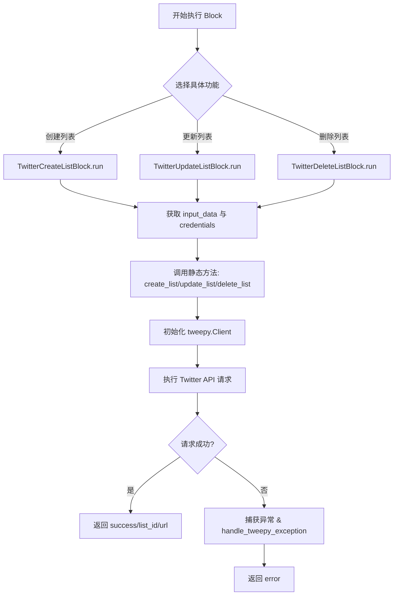
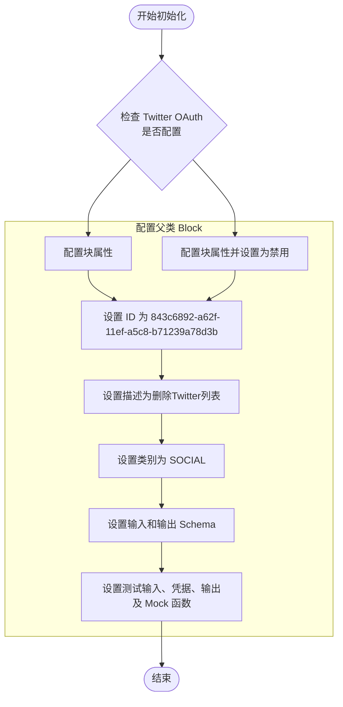
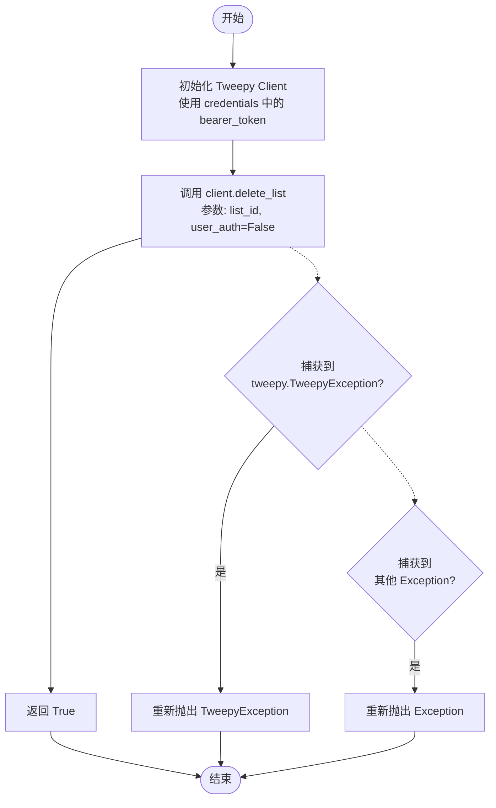
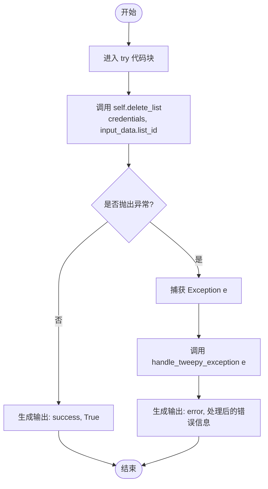
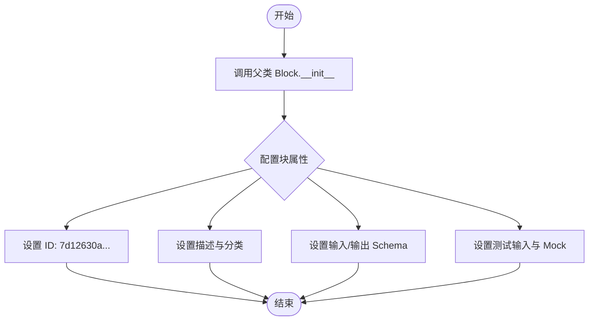
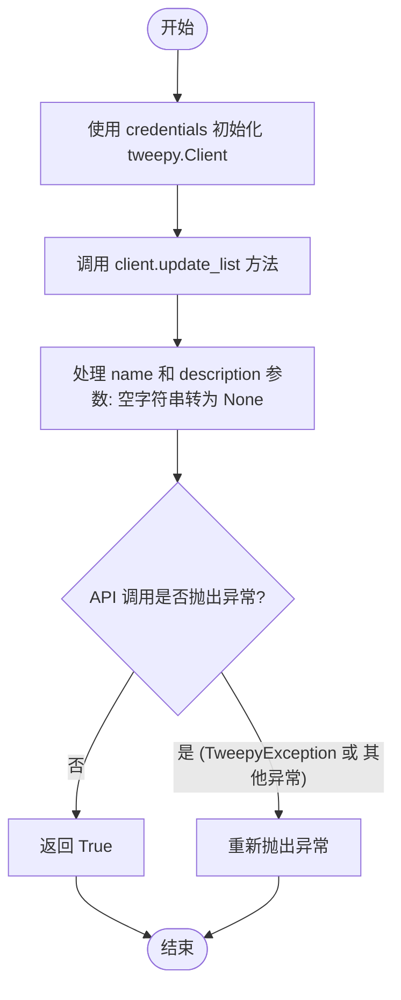
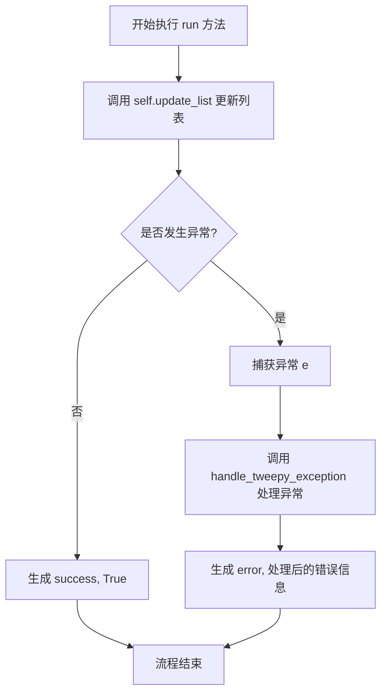
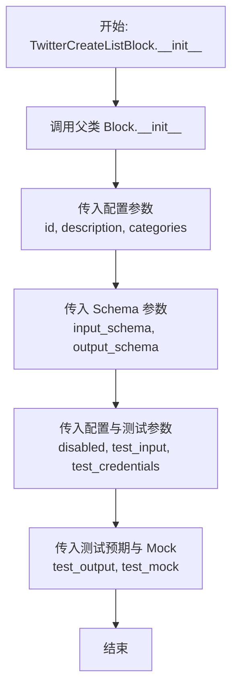
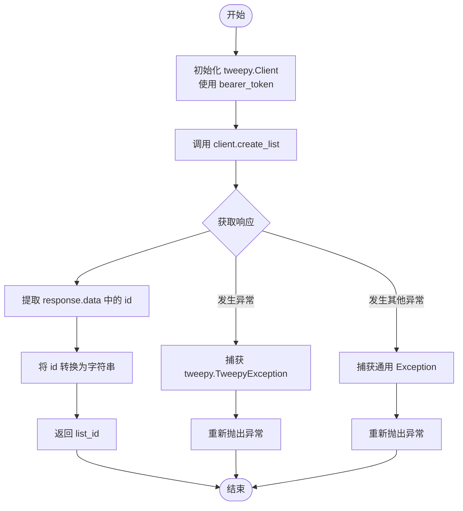
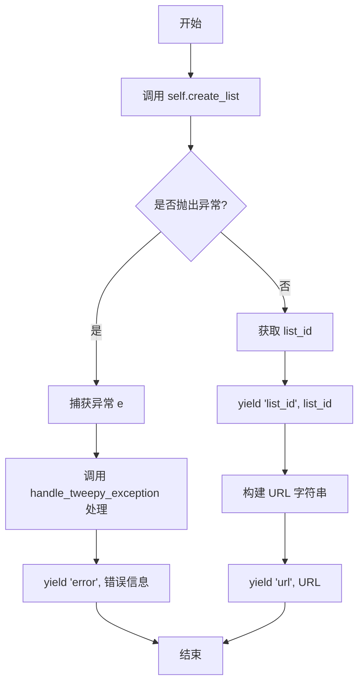

# `AutoGPT\autogpt_platform\backend\backend\blocks\twitter\lists\manage_lists.py` 详细设计文档

该文件定义了三个继承自 Block 基类的 Python 类，用于分别实现 Twitter 列表的创建、更新和删除功能；它们通过 tweepy 库与 Twitter API 交互，处理用户认证凭证，并封装了具体的业务逻辑和异常处理。

## 整体流程



## 类结构

```
Block (外部基类)
├── TwitterDeleteListBlock
│   ├── Input (输入 Schema)
│   └── Output (输出 Schema)
├── TwitterUpdateListBlock
│   ├── Input (输入 Schema)
│   └── Output (输出 Schema)
└── TwitterCreateListBlock
    ├── Input (输入 Schema)
    └── Output (输出 Schema)
```

## 全局变量及字段


### `TwitterDeleteListBlock.Input`
    
定义删除 Twitter 列表的输入模式，包含凭证和列表 ID。

类型：`BlockSchemaInput`
    


### `TwitterDeleteListBlock.Output`
    
定义删除 Twitter 列表的输出模式，包含操作是否成功的标识。

类型：`BlockSchemaOutput`
    


### `TwitterUpdateListBlock.Input`
    
定义更新 Twitter 列表的输入模式，包含凭证、列表 ID 以及新的名称和描述。

类型：`BlockSchemaInput`
    


### `TwitterUpdateListBlock.Output`
    
定义更新 Twitter 列表的输出模式，包含操作是否成功的标识。

类型：`BlockSchemaOutput`
    


### `TwitterCreateListBlock.Input`
    
定义创建 Twitter 列表的输入模式，包含凭证、名称、描述以及是否为私有的设置。

类型：`BlockSchemaInput`
    


### `TwitterCreateListBlock.Output`
    
定义创建 Twitter 列表的输出模式，包含新创建列表的 ID 和 URL。

类型：`BlockSchemaOutput`
    
    

## 全局函数及方法


### `TwitterDeleteListBlock.__init__`

初始化Twitter删除列表块，配置其唯一标识、描述、类别、输入输出架构、OAuth配置状态以及用于测试目的的模拟数据。

参数：

*   无

返回值：`None`，无返回值。

#### 流程图



#### 带注释源码

```python
def __init__(self):
    # 调用父类 Block 的初始化方法，配置该块的元数据和运行时行为
    super().__init__(
        id="843c6892-a62f-11ef-a5c8-b71239a78d3b",  # 块的唯一标识符
        description="This block deletes a specified Twitter List owned by the authenticated user.",  # 块的功能描述
        categories={BlockCategory.SOCIAL},  # 块所属类别（社交媒体）
        input_schema=TwitterDeleteListBlock.Input,  # 定义输入数据的结构
        output_schema=TwitterDeleteListBlock.Output,  # 定义输出数据的结构
        disabled=not TWITTER_OAUTH_IS_CONFIGURED,  # 如果Twitter OAuth未配置，则禁用该块
        test_input={"list_id": "1234567890", "credentials": TEST_CREDENTIALS_INPUT},  # 测试用的输入数据
        test_credentials=TEST_CREDENTIALS,  # 测试用的凭据
        test_output=[("success", True)],  # 预期的测试输出结果
        test_mock={"delete_list": lambda *args, **kwargs: True},  # 测试时的模拟函数，避免真实API调用
    )
```


### `TwitterDeleteListBlock.delete_list`

该方法使用提供的认证凭证，通过 Twitter API 删除认证用户拥有的指定 List。

参数：

- `credentials`：`TwitterCredentials`，包含访问令牌（Bearer Token）的 Twitter 认证凭证对象。
- `list_id`：`str`，待删除的 Twitter List 的唯一标识符。

返回值：`bool`，如果列表删除成功返回 True。

#### 流程图



#### 带注释源码

```python
    @staticmethod
    def delete_list(credentials: TwitterCredentials, list_id: str):
        try:
            # 使用凭证中的 bearer_token 初始化 Tweepy Client
            client = tweepy.Client(
                bearer_token=credentials.access_token.get_secret_value()
            )

            # 调用 Twitter API 删除指定 ID 的 List
            # user_auth=False 表示使用应用级认证（Bearer Token）
            client.delete_list(id=list_id, user_auth=False)
            # 返回 True 表示操作执行成功
            return True

        except tweepy.TweepyException:
            # 捕获 Tweepy 特有的异常并重新抛出，供上层处理
            raise
        except Exception:
            # 捕获其他通用异常并重新抛出
            raise
```


### `TwitterDeleteListBlock.run`

执行删除经过身份验证的用户拥有的 Twitter 列表的核心逻辑。该方法调用底层静态方法与 Twitter API 交互，并处理操作成功或失败后的响应输出。

参数：

- `input_data`：`Input`，包含 `credentials`（认证信息）和 `list_id`（要删除的列表ID）的输入数据对象。
- `credentials`：`TwitterCredentials`，用于 Twitter API 认证的凭证对象。
- `**kwargs`：`**kwargs`，额外的关键字参数，用于扩展或传递上下文信息。

返回值：`BlockOutput`，一个异步生成器，产生包含操作结果（如 "success" 或 "error"）的键值对。

#### 流程图



#### 带注释源码

```python
async def run(
    self,
    input_data: Input,
    *,
    credentials: TwitterCredentials,
    **kwargs,
) -> BlockOutput:
    try:
        # 调用静态方法 delete_list 执行实际的删除操作
        # 传入认证凭证和从输入数据中获取的列表 ID
        success = self.delete_list(credentials, input_data.list_id)
        
        # 如果删除成功，产出 "success" 状态
        yield "success", success

    except Exception as e:
        # 捕获执行过程中发生的任何异常
        # 调用 handle_tweepy_exception 将异常转换为用户友好的错误信息
        yield "error", handle_tweepy_exception(e)
```


### `TwitterUpdateListBlock.__init__`

初始化Twitter列表更新块，配置其唯一标识、描述、输入输出模式、分类及测试相关参数。

参数：

- `self`：`TwitterUpdateListBlock`，类的实例对象本身。

返回值：`None`，无返回值。

#### 流程图



#### 带注释源码

```python
    def __init__(self):
        # 调用父类 Block 的初始化方法，传入一系列配置参数
        super().__init__(
            # 定义该块的唯一标识符 (UUID)
            id="7d12630a-a62f-11ef-90c9-8f5a996612c3",
            # 提供该块的功能描述，用于UI展示或文档说明
            description="This block updates a specified Twitter List owned by the authenticated user.",
            # 指定该块所属的分类，这里归为社交媒体 (SOCIAL) 类
            categories={BlockCategory.SOCIAL},
            # 绑定输入数据的结构定义类，指定了凭证、列表ID、名称和描述等字段
            input_schema=TwitterUpdateListBlock.Input,
            # 绑定输出数据的结构定义类，指定了成功与否的状态字段
            output_schema=TwitterUpdateListBlock.Output,
            # 根据全局配置决定是否禁用该块（如果Twitter OAuth未配置则禁用）
            disabled=not TWITTER_OAUTH_IS_CONFIGURED,
            # 定义用于单元测试的模拟输入数据
            test_input={
                "list_id": "1234567890",
                "name": "Updated List Name",
                "description": "Updated List Description",
                "private": True,
                "credentials": TEST_CREDENTIALS_INPUT,
            },
            # 指定测试时使用的凭证对象
            test_credentials=TEST_CREDENTIALS,
            # 定义预期的测试输出结果
            test_output=[("success", True)],
            # 定义测试模拟对象，key对应实际调用的方法名，value为模拟的Lambda函数
            # 这里模拟 update_list 方法直接返回 True，避免真实API调用
            test_mock={"update_list": lambda *args, **kwargs: True},
        )
```


### `TwitterUpdateListBlock.update_list`

更新认证用户拥有的指定 Twitter List 的元数据（如名称和描述）。

参数：

- `credentials`：`TwitterCredentials`，用于身份验证的 Twitter 凭证对象，包含访问令牌。
- `list_id`：`str`，需要更新的 Twitter List 的 ID。
- `name`：`str | None`，List 的新名称。如果传入空字符串，则会被转换为 None。
- `description`：`str | None`，List 的新描述。如果传入空字符串，则会被转换为 None。

返回值：`bool`，如果更新成功则返回 True。

#### 流程图



#### 带注释源码

```python
    @staticmethod
    def update_list(
        credentials: TwitterCredentials,
        list_id: str,
        name: str | None,
        description: str | None,
    ):
        try:
            # 使用凭证中的访问令牌初始化 Tweepy 客户端
            client = tweepy.Client(
                bearer_token=credentials.access_token.get_secret_value()
            )

            # 调用 Twitter API 更新列表
            # 逻辑处理：如果传入的 name 或 description 为空字符串，则传 None 给 API（通常表示不修改该字段或清空，视 API 具体定义而定）
            client.update_list(
                id=list_id,
                name=None if name == "" else name,
                description=None if description == "" else description,
                user_auth=False, # 使用 App-only auth (Bearer Token)
            )
            # 如果没有异常抛出，则认为操作成功
            return True

        except tweepy.TweepyException:
            # 捕获 Tweepy 特定异常并重新抛出，由上层 run 方法处理
            raise
        except Exception:
            # 捕获其他通用异常并重新抛出
            raise
```


### `TwitterUpdateListBlock.run`

执行更新 Twitter 列表的异步逻辑，处理输入数据、调用底层更新方法并捕获异常以生成相应的成功或错误结果。

参数：

- `input_data`：`Input`，包含待更新列表的详细信息（如列表ID、新名称、新描述）的输入数据对象。
- `credentials`：`TwitterCredentials`，用于认证 Twitter API 请求的凭证对象。
- `**kwargs`：`**kwargs`，传递给运行时的额外关键字参数。

返回值：`BlockOutput`，一个生成器，产生包含操作状态（"success" 或 "error"）及对应值的元组。

#### 流程图



#### 带注释源码

```python
    async def run(
        self,
        input_data: Input,
        *,
        credentials: TwitterCredentials,
        **kwargs,
    ) -> BlockOutput:
        try:
            # 调用静态方法 update_list 执行实际的列表更新逻辑
            # 传入凭证、列表ID、名称和描述
            success = self.update_list(
                credentials, input_data.list_id, input_data.name, input_data.description
            )
            # 如果更新成功，生成 success 字段和 True 值
            yield "success", success

        except Exception as e:
            # 如果在更新过程中捕获到任何异常
            # 调用 handle_tweepy_exception 处理特定的 Tweepy 或通用异常
            # 生成 error 字段和错误信息
            yield "error", handle_tweepy_exception(e)
```


### `TwitterCreateListBlock.__init__`

初始化 Twitter 列表创建块，配置其唯一标识符、描述、类别、输入输出数据 Schema 以及测试环境所需的模拟数据和凭据。

参数：

- `self`：`TwitterCreateListBlock`，当前类实例

返回值：`None`，Python 构造函数无返回值

#### 流程图



#### 带注释源码

```python
def __init__(self):
    # 调用父类 Block 的初始化方法，配置块的基本属性和行为
    super().__init__(
        # 块的唯一标识符
        id="724148ba-a62f-11ef-89ba-5349b813ef5f",
        # 块的功能描述
        description="This block creates a new Twitter List for the authenticated user.",
        # 块所属的分类（社交类）
        categories={BlockCategory.SOCIAL},
        # 定义输入数据的 Schema 结构
        input_schema=TwitterCreateListBlock.Input,
        # 定义输出数据的 Schema 结构
        output_schema=TwitterCreateListBlock.Output,
        # 根据 Twitter OAuth 是否配置来决定是否禁用该块
        disabled=not TWITTER_OAUTH_IS_CONFIGURED,
        # 定义用于测试的输入数据样例
        test_input={
            "name": "New List Name",
            "description": "New List Description",
            "private": True,
            "credentials": TEST_CREDENTIALS_INPUT,
        },
        # 定义用于测试的认证凭据
        test_credentials=TEST_CREDENTIALS,
        # 定义预期的测试输出结果
        test_output=[
            ("list_id", "1234567890"),
            ("url", "https://twitter.com/i/lists/1234567890"),
        ],
        # 定义测试时用于模拟真实 API 调用的 Mock 函数
        test_mock={"create_list": lambda *args, **kwargs: ("1234567890")},
    )
```


### `TwitterCreateListBlock.create_list`

创建一个由认证用户拥有的新的 Twitter List，并返回新建列表的 ID。

参数：

-  `credentials`：`TwitterCredentials`，Twitter API 的认证凭据对象，包含访问令牌。
-  `name`：`str`，要创建的列表的名称。
-  `description`：`str | None`，列表的描述信息，如果为空字符串则视为 None。
-  `private`：`bool`，指定列表是否为私有。

返回值：`str`，成功创建的 Twitter List 的 ID 字符串。

#### 流程图



#### 带注释源码

```python
    @staticmethod
    def create_list(
        credentials: TwitterCredentials,
        name: str,
        description: str | None,
        private: bool,
    ):
        try:
            # 使用凭据中的访问令牌初始化 Tweepy 客户端
            client = tweepy.Client(
                bearer_token=credentials.access_token.get_secret_value()
            )

            # 调用 API 创建列表
            # 逻辑处理：如果 name 或 description 为空字符串，则传入 None
            response = cast(
                Response,
                client.create_list(
                    name=None if name == "" else name,
                    description=None if description == "" else description,
                    private=private,
                    user_auth=False,
                ),
            )

            # 从响应对象中提取列表 ID 并转换为字符串返回
            list_id = str(response.data["id"])

            return list_id

        except tweepy.TweepyException:
            # 捕获 Tweepy 特定的 API 异常并向上抛出
            raise
        except Exception:
            # 捕获其他通用异常并向上抛出
            raise
```


### `TwitterCreateListBlock.run`

该方法是 `TwitterCreateListBlock` 的核心执行入口，负责协调整个 Twitter List 的创建流程。它接收输入数据（如列表名称、描述、隐私设置）和认证凭据，调用内部静态方法与 Twitter API 交互，处理成功或异常情况，并通过生成器返回创建结果（列表 ID 和 URL）或错误信息。

参数：

-   `input_data`：`Input`，包含创建列表所需的输入字段，具体包括 `name`（列表名称）、`description`（描述）和 `private`（是否私有）。
-   `credentials`：`TwitterCredentials`，用于身份验证的 Twitter 凭证对象，包含访问令牌等敏感信息。
-   `**kwargs`：`any`，扩展用的关键字参数，用于接收未显式声明的额外参数。

返回值：`BlockOutput`，一个异步生成器，用于按顺序产出执行结果。成功时产出 `list_id` 和 `url`；失败时产出 `error`。

#### 流程图



#### 带注释源码

```python
    async def run(
        self,
        input_data: Input,
        *,
        credentials: TwitterCredentials,
        **kwargs,
    ) -> BlockOutput:
        try:
            # 调用静态方法执行实际的 Twitter API 请求创建列表
            # 传入凭据、名称、描述和私有属性
            list_id = self.create_list(
                credentials, input_data.name, input_data.description, input_data.private
            )
            # 产出创建成功后的列表 ID
            yield "list_id", list_id
            # 产出构建好的列表 URL
            yield "url", f"https://twitter.com/i/lists/{list_id}"

        except Exception as e:
            # 捕获任何执行过程中的异常
            # 调用异常处理函数将其转换为标准化的错误信息
            # 并产出 'error' 键
            yield "error", handle_tweepy_exception(e)
```


## 关键组件


### Tweepy 客户端集成 (Twitter API Wrapper)
基于 OAuth 2.0 Bearer Token 认证机制，利用 `tweepy.Client` 与 Twitter API v2 进行交互，执行列表的创建、删除及更新等核心网络请求。

### 认证与授权模块
通过 `TwitterCredentials` 组件统一管理安全凭证，确保在执行操作前已获取具备 `list.write` 和 `offline.access` 权限的有效令牌。

### 块执行引擎接口
继承自 `Block` 基类的架构规范，强制要求子类定义 `Input`/`Output` 数据模式及异步 `run` 方法，以实现与工作流系统的无缝集成。

### 异常处理包装器
集中式错误处理逻辑，通过 `handle_tweepy_exception` 捕获 `TweepyException` 及其他运行时异常，并将其转换为标准化的错误输出反馈给工作流。

### 数据模式定义系统
利用 `BlockSchemaInput` 和 `BlockSchemaOutput` 严格定义块的数据契约，包括输入参数（如列表 ID、名称）的校验规则及输出结果的格式化结构。


## 问题及建议


### 已知问题

-   **测试输入与 Schema 定义不一致**：在 `TwitterUpdateListBlock` 中，测试输入字典 (`test_input`) 包含了 `private` 字段，但在该类的 `Input` Schema 定义中并未声明此字段。这会导致测试逻辑与实际运行时的 Schema 校验不匹配。
-   **冗余的异常捕获**：在 `delete_list`、`update_list` 和 `create_list` 等静态方法中，使用了 `try...except tweepy.TweepyException: raise` 这样的结构。这仅是重新抛出异常而未做任何额外处理（如日志记录或转换），属于冗余代码，增加了不必要的嵌套层级。
-   **硬编码的 URL 构造**：在 `TwitterCreateListBlock` 的 `run` 方法中，列表 URL 是通过硬编码字符串拼接生成的 (`f"https://twitter.com/i/lists/{list_id}"`)。这依赖于 Twitter (X) 当前的 URL 结构，一旦平台更改域名或路由规则，该功能将失效。
-   **客户端重复实例化**：每个静态方法（如 `delete_list`）内部都单独实例化了一个 `tweepy.Client`。虽然对于单个 Block 执行影响较小，但在大规模并发或频繁调用的场景下，这种重复创建客户端对象的方式资源利用率较低。

### 优化建议

-   **移除静态方法中的冗余 Try-Catch**：建议删除 `delete_list` 等方法中的 `try...except` 块，让异常直接抛出。外层的 `run` 方法已经有统一的异常处理逻辑 (`handle_tweepy_exception`)，这样可以简化代码逻辑并保持单一职责。
-   **修正 Schema 定义**：检查 `TwitterUpdateListBlock` 的业务需求，如果支持更新列表的私有属性，应在 `Input` 类中补充 `private` 字段；如果不支持，应从 `test_input` 中移除该字段以保持一致性。
-   **提取常量或配置**：将硬编码的 Twitter 基础 URL（如 `https://twitter.com`）提取为模块级常量或配置项，以便于统一维护。同时，检查 API 响应中是否已包含完整 URL，优先使用 API 返回的官方数据而非自行拼接。
-   **引入日志记录**：建议在静态方法的关键操作前后（例如调用 API 前）添加日志记录（如 `logging.info`），记录操作类型和目标 ID，以便于在生产环境中进行问题追踪和调试。
-   **客户端复用或依赖注入**：考虑重构 `tweepy.Client` 的创建逻辑，例如通过依赖注入的方式传入客户端，或者在类初始化时利用凭证创建客户端实例，避免在每次方法调用时重复创建。


## 其它


### 设计目标与约束

1. **设计目标**：
    - 提供模块化、可复用的代码块，用于在自动化工作流中管理 Twitter Lists（列表）。
    - 封装 Twitter API v2 的复杂性，为上层逻辑提供简单的输入输出接口。
    - 确保所有操作（创建、更新、删除）都遵循统一的 `Block` 执行规范。

2. **设计约束**：
    - **API 版本**：必须使用 Twitter API v2（通过 `tweepy.Client` 实现）。
    - **认证模式**：强制使用 Bearer Token 认证模式（`user_auth=False`），不依赖用户上下文认证，仅依赖 Access Token。
    - **权限范围**：执行操作前必须配置 OAuth 且凭证必须包含 `list.write` 和 `offline.access` 权限。
    - **框架依赖**：所有类必须继承自 `backend.data.block.Block`，并实现标准的 `Input` 和 `Output` Schema。

### 错误处理与异常设计

1. **异常捕获策略**：
    - `run` 方法作为顶层入口，捕获所有底层抛出的 `Exception`。
    - 静态方法（如 `delete_list`）负责具体的 API 调用，捕获特定的 `tweepy.TweepyException` 并重新抛出，交由 `run` 方法统一处理。

2. **错误转换与输出**：
    - 所有的异常（无论是网络错误、API 错误还是未知错误）都通过 `handle_tweepy_exception` 函数处理，转化为标准化的错误信息字符串。
    - 错误不通过异常机制抛出给调用者，而是通过 `yield` 生成一个 `"error"` 键以及对应的错误消息。这种设计允许工作流在遇到错误时继续执行或进行分支处理，而不是中断整个流程。

3. **容错机制**：
    - 在 `TwitterUpdateListBlock` 中，对空字符串输入进行了防御性处理（将空字符串转为 `None`），以符合 Twitter API 对可选参数的处理逻辑，避免因无效输入导致的 API 错误。

### 外部依赖与接口契约

1. **外部库依赖**：
    - **tweepy**：用于与 Twitter API 交互的核心库。代码依赖 `tweepy.Client` 类及其 `delete_list`, `update_list`, `create_list` 方法。
    - **typing**：用于类型提示，特别是 `cast` 方法用于处理 API 响应的类型断言。

2. **接口契约**：
    - **输入契约**：
        - `credentials`：必须提供有效的 `TwitterCredentials` 对象，其中 `access_token` 必须是非空的 SecretStr。
        - `list_id`：字符串类型，必须是 Twitter 系统内存在的 List ID。
    - **输出契约**：
        - 成功时：根据操作类型返回 `success` (bool)、`list_id` (str) 或 `url` (str)。
        - 失败时：总是返回 `"error"` (str)。
    - **API 契约**：依赖 Twitter API v2 返回特定的 JSON 结构。例如，`create_list` 操作期望响应中包含 `data` 字段且该字段下有 `id` 键。

### 安全设计

1. **凭证管理**：
    - 使用 `TwitterCredentialsField` 和 `TwitterCredentialsInput` 来管理敏感信息。
    - 在使用 Token 时，显式调用 `credentials.access_token.get_secret_value()`，确保秘密字符串在日志或调试输出中不被意外泄露。

2. **权限控制**：
    - 通过类初始化时的 `TwitterCredentialsField` 显式声明了所需的最小权限范围 (`list.write`, `offline.access`)，确保只有获得授权的 Token 才能执行这些块。

3. **输入验证**：
    - 依赖 Schema 定义进行基础的数据类型验证。
    - 在逻辑层面对可能引起 API 意外行为的输入（如空字符串）进行清洗和转换。

### 数据流与状态管理

1. **数据流**：
    - **输入阶段**：工作流引擎传入 `input_data` 和 `credentials`。
    - **处理阶段**：
        1. `run` 方法解析输入数据。
        2. 调用静态辅助方法（如 `create_list`）。
        3. 静态方法实例化 `tweepy.Client`，构建请求参数，发送 HTTP 请求。
        4. 接收 API 响应，提取关键数据（如 List ID）。
    - **输出阶段**：通过 Python Generator (`yield`) 机制，将处理结果异步逐个返回给工作流引擎。

2. **状态管理**：
    - **无状态设计**：这些 Block 是无状态的。每次调用 `run` 都会创建新的 `tweepy.Client` 实例，不依赖或修改类的内部实例变量（除了通过父类初始化的配置元数据）。
    - **生命周期**：对象的生命周期仅限于单次执行周期。执行完毕后，所有局部变量（包括 HTTP 客户端）即被销毁，无资源残留风险。

    