# `.\AutoGPT\autogpt_platform\backend\backend\blocks\twitter\lists\pinned_lists.py` 详细设计文档

This file contains classes for interacting with Twitter's API to unpin, pin, and retrieve pinned lists.

## 整体流程

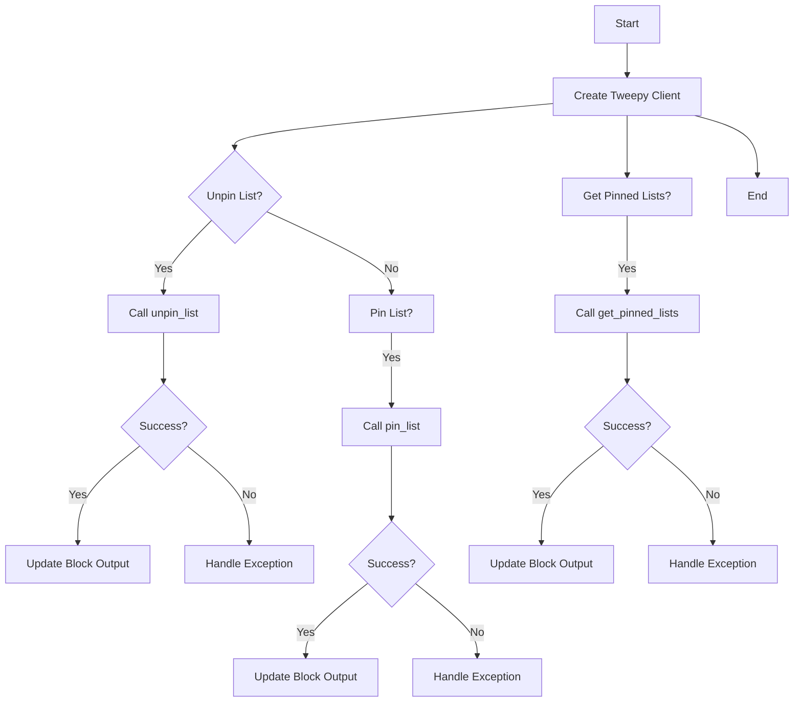

## 类结构

```
TwitterUnpinListBlock (Twitter Blocks)
├── TwitterPinListBlock (Twitter Blocks)
└── TwitterGetPinnedListsBlock (Twitter Blocks)
```

## 全局变量及字段


### `TEST_CREDENTIALS`
    
Test credentials for Twitter API access.

类型：`TwitterCredentials`
    


### `TEST_CREDENTIALS_INPUT`
    
Test input for Twitter credentials.

类型：`TwitterCredentialsInput`
    


### `TWITTER_OAUTH_IS_CONFIGURED`
    
Flag indicating if Twitter OAuth is configured.

类型：`bool`
    


### `ListExpansionInputs`
    
Input type for list expansion requests.

类型：`type`
    


### `ListExpansionsFilter`
    
Filter type for list expansion requests.

类型：`type`
    


### `ListFieldsFilter`
    
Filter type for list fields in list expansion requests.

类型：`type`
    


### `TweetUserFieldsFilter`
    
Filter type for user fields in list expansion requests.

类型：`type`
    


### `IncludesSerializer`
    
Serializer for includes in Twitter API responses.

类型：`type`
    


### `ResponseDataSerializer`
    
Serializer for response data in Twitter API responses.

类型：`type`
    


### `Block`
    
Base class for blocks.

类型：`type`
    


### `BlockCategory`
    
Category type for blocks.

类型：`type`
    


### `BlockOutput`
    
Output type for blocks.

类型：`type`
    


### `BlockSchemaInput`
    
Schema input type for blocks.

类型：`type`
    


### `BlockSchemaOutput`
    
Schema output type for blocks.

类型：`type`
    


### `SchemaField`
    
Field type for schema definitions.

类型：`type`
    


### `TwitterCredentials`
    
Type for Twitter credentials.

类型：`type`
    


### `TwitterCredentialsField`
    
Field type for Twitter credentials.

类型：`type`
    


### `TwitterCredentialsInput`
    
Input type for Twitter credentials.

类型：`type`
    


### `ListExpansionsBuilder`
    
Builder for list expansion requests.

类型：`type`
    


### `Response`
    
Type for Twitter API responses.

类型：`type`
    


### `TweepyException`
    
Exception type for Tweepy library.

类型：`type`
    


### `Exception`
    
Base exception type.

类型：`type`
    


### `handle_tweepy_exception`
    
Function to handle Tweepy exceptions.

类型：`function`
    


### `tweepy.Client`
    
Tweepy client for Twitter API access.

类型：`type`
    


### `tweepy.unpin_list`
    
Tweepy function to unpin a list.

类型：`function`
    


### `tweepy.pin_list`
    
Tweepy function to pin a list.

类型：`function`
    


### `tweepy.get_pinned_lists`
    
Tweepy function to get pinned lists.

类型：`function`
    


### `cast`
    
Type casting function from typing module.

类型：`function`
    


### `TwitterUnpinListBlock.id`
    
Unique identifier for the block.

类型：`str`
    


### `TwitterUnpinListBlock.description`
    
Description of the block.

类型：`str`
    


### `TwitterUnpinListBlock.categories`
    
Categories to which the block belongs.

类型：`set`
    


### `TwitterUnpinListBlock.input_schema`
    
Input schema for the block.

类型：`type`
    


### `TwitterUnpinListBlock.output_schema`
    
Output schema for the block.

类型：`type`
    


### `TwitterUnpinListBlock.disabled`
    
Flag indicating if the block is disabled.

类型：`bool`
    


### `TwitterUnpinListBlock.test_input`
    
Test input data for the block.

类型：`dict`
    


### `TwitterUnpinListBlock.test_credentials`
    
Test credentials for the block.

类型：`TwitterCredentials`
    


### `TwitterUnpinListBlock.test_output`
    
Test output data for the block.

类型：`list`
    


### `TwitterUnpinListBlock.test_mock`
    
Test mock data for the block.

类型：`dict`
    


### `TwitterPinListBlock.id`
    
Unique identifier for the block.

类型：`str`
    


### `TwitterPinListBlock.description`
    
Description of the block.

类型：`str`
    


### `TwitterPinListBlock.categories`
    
Categories to which the block belongs.

类型：`set`
    


### `TwitterPinListBlock.input_schema`
    
Input schema for the block.

类型：`type`
    


### `TwitterPinListBlock.output_schema`
    
Output schema for the block.

类型：`type`
    


### `TwitterPinListBlock.disabled`
    
Flag indicating if the block is disabled.

类型：`bool`
    


### `TwitterPinListBlock.test_input`
    
Test input data for the block.

类型：`dict`
    


### `TwitterPinListBlock.test_credentials`
    
Test credentials for the block.

类型：`TwitterCredentials`
    


### `TwitterPinListBlock.test_output`
    
Test output data for the block.

类型：`list`
    


### `TwitterPinListBlock.test_mock`
    
Test mock data for the block.

类型：`dict`
    


### `TwitterGetPinnedListsBlock.id`
    
Unique identifier for the block.

类型：`str`
    


### `TwitterGetPinnedListsBlock.description`
    
Description of the block.

类型：`str`
    


### `TwitterGetPinnedListsBlock.categories`
    
Categories to which the block belongs.

类型：`set`
    


### `TwitterGetPinnedListsBlock.input_schema`
    
Input schema for the block.

类型：`type`
    


### `TwitterGetPinnedListsBlock.output_schema`
    
Output schema for the block.

类型：`type`
    


### `TwitterGetPinnedListsBlock.disabled`
    
Flag indicating if the block is disabled.

类型：`bool`
    


### `TwitterGetPinnedListsBlock.test_input`
    
Test input data for the block.

类型：`dict`
    


### `TwitterGetPinnedListsBlock.test_credentials`
    
Test credentials for the block.

类型：`TwitterCredentials`
    


### `TwitterGetPinnedListsBlock.test_output`
    
Test output data for the block.

类型：`list`
    


### `TwitterGetPinnedListsBlock.test_mock`
    
Test mock data for the block.

类型：`dict`
    
    

## 全局函数及方法


### handle_tweepy_exception

This function handles exceptions raised by the Tweepy library.

参数：

- `e`：`Exception`，The exception to be handled.

返回值：`str`，A string describing the exception.

#### 流程图

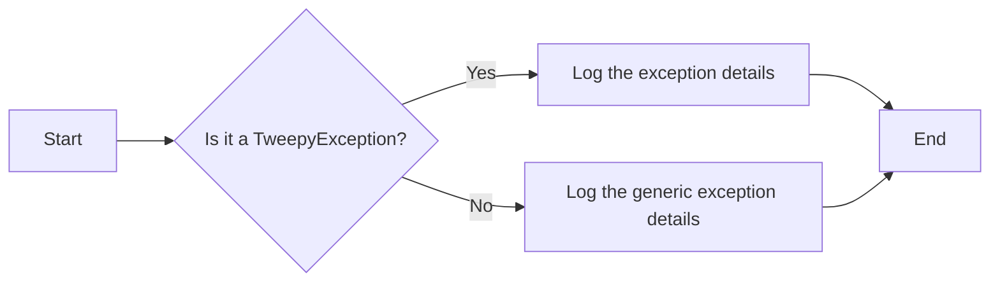

#### 带注释源码

```python
def handle_tweepy_exception(e: Exception) -> str:
    """
    Handles exceptions raised by the Tweepy library.

    :param e: The exception to be handled.
    :return: A string describing the exception.
    """
    if isinstance(e, tweepy.TweepyException):
        return f"TweepyException: {e}"
    else:
        return f"Exception: {e}"
``` 


### `TwitterGetPinnedListsBlock.get_pinned_lists`

This method retrieves the Lists pinned by the authenticated user.

参数：

- `credentials`：`TwitterCredentials`，The Twitter credentials used to authenticate the request.
- `expansions`：`ListExpansionsFilter | None`，Optional filter to include additional data in the response.
- `user_fields`：`TweetUserFieldsFilter | None`，Optional filter to include additional user fields in the response.
- `list_fields`：`ListFieldsFilter | None`，Optional filter to include additional list fields in the response.

返回值：`tuple`，A tuple containing the serialized response data, included data, metadata, list IDs, and list names.

#### 流程图

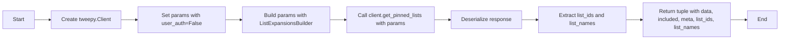

#### 带注释源码

```python
    @staticmethod
    def get_pinned_lists(
        credentials: TwitterCredentials,
        expansions: ListExpansionsFilter | None,
        user_fields: TweetUserFieldsFilter | None,
        list_fields: ListFieldsFilter | None,
    ):
        try:
            client = tweepy.Client(
                bearer_token=credentials.access_token.get_secret_value()
            )

            params = {"user_auth": False}

            params = (
                ListExpansionsBuilder(params)
                .add_expansions(expansions)
                .add_user_fields(user_fields)
                .add_list_fields(list_fields)
                .build()
            )

            response = cast(Response, client.get_pinned_lists(**params))

            meta = {}
            included = {}
            list_ids = []
            list_names = []

            if response.meta:
                meta = response.meta

            if response.includes:
                included = IncludesSerializer.serialize(response.includes)

            if response.data:
                data = ResponseDataSerializer.serialize_list(response.data)
                list_ids = [str(item.id) for item in response.data]
                list_names = [item.name for item in response.data]
                return data, included, meta, list_ids, list_names

            raise Exception("Lists not found")

        except tweepy.TweepyException:
            raise
``` 


### `TwitterGetPinnedListsBlock.get_pinned_lists`

This method retrieves the Lists pinned by the authenticated user.

参数：

- `credentials`：`TwitterCredentials`，The Twitter credentials required to authenticate the request.
- `expansions`：`ListExpansionsFilter | None`，Optional filter to include additional data in the response.
- `user_fields`：`TweetUserFieldsFilter | None`，Optional filter to include additional user fields in the response.
- `list_fields`：`ListFieldsFilter | None`，Optional filter to include additional list fields in the response.

返回值：`tuple`，A tuple containing the serialized data, included data, metadata, list IDs, and list names.

#### 流程图

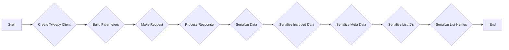

#### 带注释源码

```python
    @staticmethod
    def get_pinned_lists(
        credentials: TwitterCredentials,
        expansions: ListExpansionsFilter | None,
        user_fields: TweetUserFieldsFilter | None,
        list_fields: ListFieldsFilter | None,
    ):
        try:
            client = tweepy.Client(
                bearer_token=credentials.access_token.get_secret_value()
            )

            params = {"user_auth": False}

            params = (
                ListExpansionsBuilder(params)
                .add_expansions(expansions)
                .add_user_fields(user_fields)
                .add_list_fields(list_fields)
                .build()
            )

            response = cast(Response, client.get_pinned_lists(**params))

            meta = {}
            included = {}
            list_ids = []
            list_names = []

            if response.meta:
                meta = response.meta

            if response.includes:
                included = IncludesSerializer.serialize(response.includes)

            if response.data:
                data = ResponseDataSerializer.serialize_list(response.data)
                list_ids = [str(item.id) for item in response.data]
                list_names = [item.name for item in response.data]
                return data, included, meta, list_ids, list_names

            raise Exception("Lists not found")

        except tweepy.TweepyException:
            raise
``` 


### ResponseDataSerializer

This method serializes the response data from the Twitter API.

参数：

- `response_data`: `list[dict]`，The data returned from the Twitter API response.

返回值：`list[dict]`，Serialized data containing the necessary fields.

#### 流程图

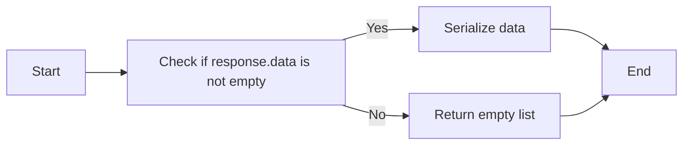

#### 带注释源码

```python
class ResponseDataSerializer:
    @staticmethod
    def serialize(response_data: list[dict]) -> list[dict]:
        """
        Serializes the response data from the Twitter API.

        :param response_data: list[dict] - The data returned from the Twitter API response.
        :return: list[dict] - Serialized data containing the necessary fields.
        """
        if response_data:
            data = []
            for item in response_data:
                # Assuming the necessary fields are 'id' and 'name'
                data.append({
                    "id": str(item["id"]),
                    "name": item["name"],
                })
            return data
        else:
            return []
``` 


### `TwitterUnpinListBlock.__init__`

This method initializes the `TwitterUnpinListBlock` class, setting up its properties and configurations.

参数：

- `id`: `str`，The unique identifier for the block.
- `description`: `str`，A description of the block's functionality.
- `categories`: `set`，A set of categories that the block belongs to.
- `input_schema`: `Input`，The schema for the input data of the block.
- `output_schema`: `Output`，The schema for the output data of the block.
- `disabled`: `bool`，Whether the block is disabled or not.
- `test_input`: `dict`，The test input data for the block.
- `test_credentials`: `TwitterCredentials`，The test credentials for the block.
- `test_output`: `list`，The expected test output data for the block.
- `test_mock`: `dict`，Mock functions for testing.

返回值：`None`，This method does not return any value.

#### 流程图

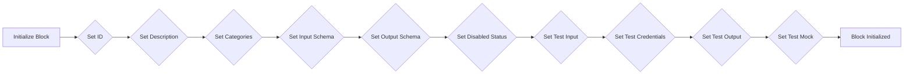

#### 带注释源码

```python
def __init__(self):
    super().__init__(
        id="a099c034-a62f-11ef-9622-47d0ceb73555",
        description="This block allows the authenticated user to unpin a specified List.",
        categories={BlockCategory.SOCIAL},
        input_schema=TwitterUnpinListBlock.Input,
        output_schema=TwitterUnpinListBlock.Output,
        disabled=not TWITTER_OAUTH_IS_CONFIGURED,
        test_input={"list_id": "123456789", "credentials": TEST_CREDENTIALS_INPUT},
        test_credentials=TEST_CREDENTIALS,
        test_output=[("success", True)],
        test_mock={"unpin_list": lambda *args, **kwargs: True},
    )
```


### TwitterUnpinListBlock.unpin_list

This method unpins a specified List using the provided Twitter credentials.

参数：

- `credentials`：`TwitterCredentials`，Twitter credentials object containing access token.
- `list_id`：`str`，The ID of the List to unpin.

返回值：`bool`，Whether the unpin was successful.

#### 流程图

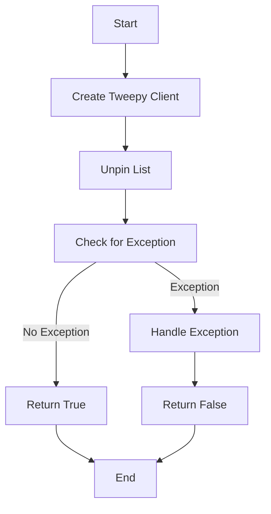

#### 带注释源码

```python
@staticmethod
def unpin_list(credentials: TwitterCredentials, list_id: str):
    try:
        client = tweepy.Client(
            bearer_token=credentials.access_token.get_secret_value()
        )

        client.unpin_list(list_id=list_id, user_auth=False)

        return True

    except tweepy.TweepyException:
        raise
    except Exception:
        raise
```


### TwitterUnpinListBlock.run

This method is responsible for unpinning a specified List using the provided credentials.

参数：

- `input_data`：`Input`，The input data for the block, containing the list ID and credentials.
- `credentials`：`TwitterCredentials`，The credentials required to authenticate with Twitter API.
- `**kwargs`：`Any`，Additional keyword arguments that may be passed to the method.

返回值：`BlockOutput`，The output of the block, indicating whether the unpin operation was successful.

#### 流程图

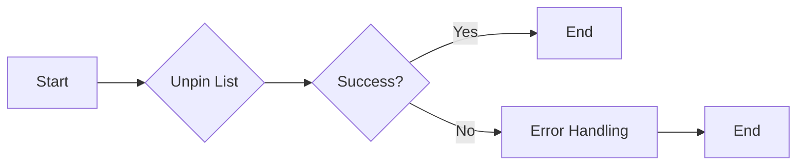

#### 带注释源码

```python
async def run(
    self,
    input_data: Input,
    *,
    credentials: TwitterCredentials,
    **kwargs,
) -> BlockOutput:
    try:
        success = self.unpin_list(credentials, input_data.list_id)
        yield "success", success

    except Exception as e:
        yield "error", handle_tweepy_exception(e)
```


### TwitterPinListBlock.__init__

This method initializes the `TwitterPinListBlock` class, setting up its properties and configurations.

参数：

- `self`：`TwitterPinListBlock` 类的实例

返回值：无

#### 流程图

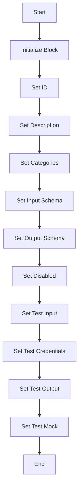

#### 带注释源码

```python
def __init__(self):
    super().__init__(
        id="8ec16e48-a62f-11ef-9f35-f3d6de43a802",
        description="This block allows the authenticated user to pin a specified List.",
        categories={BlockCategory.SOCIAL},
        input_schema=TwitterPinListBlock.Input,
        output_schema=TwitterPinListBlock.Output,
        disabled=not TWITTER_OAUTH_IS_CONFIGURED,
        test_input={"list_id": "123456789", "credentials": TEST_CREDENTIALS_INPUT},
        test_credentials=TEST_CREDENTIALS,
        test_output=[("success", True)],
        test_mock={"pin_list": lambda *args, **kwargs: True},
    )
```


### TwitterPinListBlock.pin_list

This method allows the authenticated user to pin a specified List.

参数：

- `credentials`：`TwitterCredentials`，The Twitter credentials required to authenticate the request.
- `list_id`：`str`，The ID of the List to pin.

返回值：`bool`，Whether the pin was successful.

#### 流程图

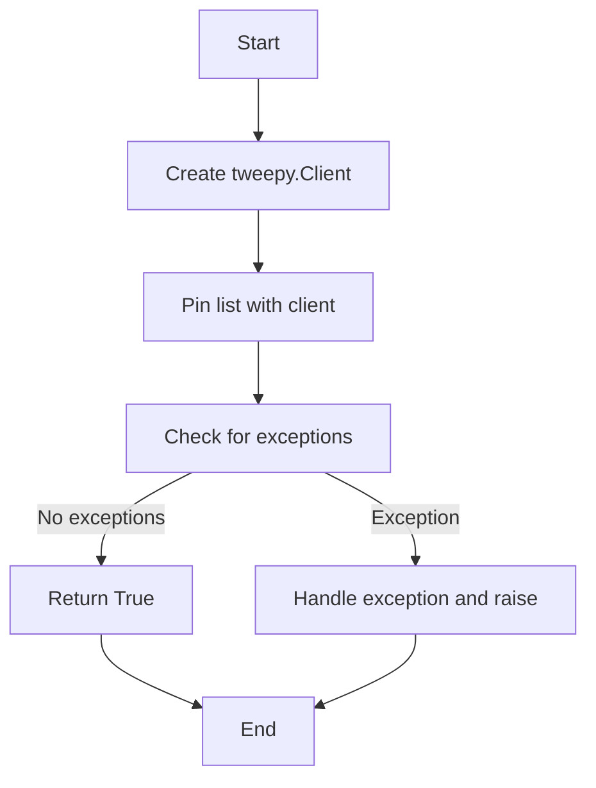

#### 带注释源码

```python
@staticmethod
def pin_list(credentials: TwitterCredentials, list_id: str):
    try:
        client = tweepy.Client(
            bearer_token=credentials.access_token.get_secret_value()
        )

        client.pin_list(list_id=list_id, user_auth=False)

        return True

    except tweepy.TweepyException:
        raise
    except Exception:
        raise
```


### TwitterGetPinnedListsBlock.run

This method runs the TwitterGetPinnedListsBlock, which retrieves the Lists pinned by the authenticated user.

参数：

- `input_data`：`Input`，The input data for the block, which includes the necessary credentials and any additional parameters for the request.
- `credentials`：`TwitterCredentials`，The Twitter credentials required to authenticate the request.

返回值：`BlockOutput`，A dictionary containing the output of the block, which includes the list IDs, list names, response data, included data, and metadata.

#### 流程图

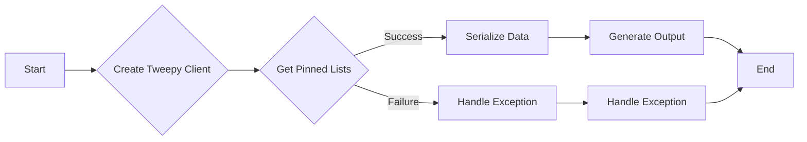

#### 带注释源码

```python
async def run(
    self,
    input_data: Input,
    *,
    credentials: TwitterCredentials,
    **kwargs,
) -> BlockOutput:
    try:
        list_data, included, meta, list_ids, list_names = self.get_pinned_lists(
            credentials,
            input_data.expansions,
            input_data.user_fields,
            input_data.list_fields,
        )

        if list_ids:
            yield "list_ids", list_ids
        if list_names:
            yield "list_names", list_names
        if list_data:
            yield "data", list_data
        if included:
            yield "included", included
        if meta:
            yield "meta", meta

    except Exception as e:
        yield "error", handle_tweepy_exception(e)
```


### TwitterGetPinnedListsBlock.__init__

This method initializes the `TwitterGetPinnedListsBlock` class, setting up its properties and configurations.

参数：

- `id`: `str`，The unique identifier for the block.
- `description`: `str`，A description of the block's functionality.
- `categories`: `set`，A set of categories that the block belongs to.
- `input_schema`: `BlockSchemaInput`，The schema for the input data of the block.
- `output_schema`: `BlockSchemaOutput`，The schema for the output data of the block.
- `disabled`: `bool`，A flag indicating whether the block is disabled.
- `test_input`: `dict`，The test input data for the block.
- `test_credentials`: `TwitterCredentials`，The test credentials for the block.
- `test_output`: `list`，The expected test output data for the block.
- `test_mock`: `dict`，Mock functions for testing the block.

返回值：无

#### 流程图

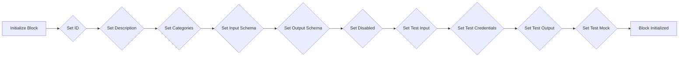

#### 带注释源码

```python
def __init__(self):
    super().__init__(
        id="97e03aae-a62f-11ef-bc53-5b89cb02888f",
        description="This block returns the Lists pinned by the authenticated user.",
        categories={BlockCategory.SOCIAL},
        input_schema=TwitterGetPinnedListsBlock.Input,
        output_schema=TwitterGetPinnedListsBlock.Output,
        disabled=not TWITTER_OAUTH_IS_CONFIGURED,
        test_input={
            "expansions": None,
            "list_fields": None,
            "user_fields": None,
            "credentials": TEST_CREDENTIALS_INPUT,
        },
        test_credentials=TEST_CREDENTIALS,
        test_output=[
            ("list_ids", ["84839422"]),
            ("list_names", ["Twitter List"]),
            ("data", [{"id": "84839422", "name": "Twitter List"}]),
        ],
        test_mock={
            "get_pinned_lists": lambda *args, **kwargs: (
                [{"id": "84839422", "name": "Twitter List"}],
                {},
                {},
                ["84839422"],
                ["Twitter List"],
            )
        },
    )
```


### TwitterGetPinnedListsBlock.get_pinned_lists

This method retrieves the Lists pinned by the authenticated user.

参数：

- `credentials`：`TwitterCredentials`，The Twitter credentials used to authenticate the request.
- `expansions`：`ListExpansionsFilter | None`，Optional filter to expand the response with additional data.
- `user_fields`：`TweetUserFieldsFilter | None`，Optional filter to include additional fields about the user.
- `list_fields`：`ListFieldsFilter | None`，Optional filter to include additional fields about the list.

返回值：`tuple`，A tuple containing the serialized response data, included data, metadata, list IDs, and list names.

#### 流程图

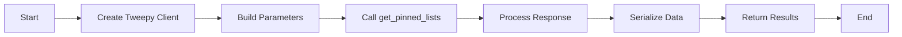

#### 带注释源码

```python
@staticmethod
def get_pinned_lists(
    credentials: TwitterCredentials,
    expansions: ListExpansionsFilter | None,
    user_fields: TweetUserFieldsFilter | None,
    list_fields: ListFieldsFilter | None,
):
    try:
        client = tweepy.Client(
            bearer_token=credentials.access_token.get_secret_value()
        )

        params = {"user_auth": False}

        params = (
            ListExpansionsBuilder(params)
            .add_expansions(expansions)
            .add_user_fields(user_fields)
            .add_list_fields(list_fields)
            .build()
        )

        response = cast(Response, client.get_pinned_lists(**params))

        meta = {}
        included = {}
        list_ids = []
        list_names = []

        if response.meta:
            meta = response.meta

        if response.includes:
            included = IncludesSerializer.serialize(response.includes)

        if response.data:
            data = ResponseDataSerializer.serialize_list(response.data)
            list_ids = [str(item.id) for item in response.data]
            list_names = [item.name for item in response.data]
            return data, included, meta, list_ids, list_names

        raise Exception("Lists not found")

    except tweepy.TweepyException:
        raise
``` 


### TwitterGetPinnedListsBlock.run

This method returns the Lists pinned by the authenticated user.

参数：

- `input_data`：`Input`，The input data for the block.
- `credentials`：`TwitterCredentials`，The credentials for accessing the Twitter API.
- `**kwargs`：`Any`，Additional keyword arguments.

返回值：`BlockOutput`，The output of the block containing the list IDs, list names, response data, included data, and metadata.

#### 流程图

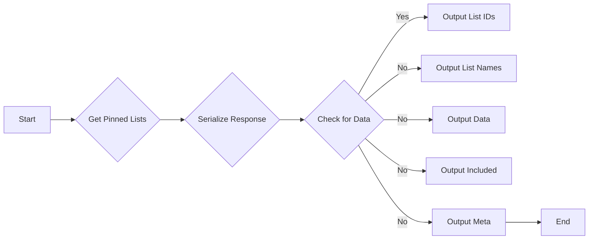

#### 带注释源码

```python
async def run(
    self,
    input_data: Input,
    *,
    credentials: TwitterCredentials,
    **kwargs,
) -> BlockOutput:
    try:
        list_data, included, meta, list_ids, list_names = self.get_pinned_lists(
            credentials,
            input_data.expansions,
            input_data.user_fields,
            input_data.list_fields,
        )

        if list_ids:
            yield "list_ids", list_ids
        if list_names:
            yield "list_names", list_names
        if list_data:
            yield "data", list_data
        if included:
            yield "included", included
        if meta:
            yield "meta", meta

    except Exception as e:
        yield "error", handle_tweepy_exception(e)
```


## 关键组件


### 张量索引与惰性加载

张量索引与惰性加载是代码中处理数据的一种方式，它允许在需要时才加载和索引数据，从而提高性能和减少内存消耗。

### 反量化支持

反量化支持是代码中实现的一种功能，它允许在量化过程中对某些操作进行反量化处理，以保持模型的精度。

### 量化策略

量化策略是代码中用于优化模型性能的一种方法，它通过减少模型中使用的数值范围来减少模型的复杂性和计算量。


## 问题及建议


### 已知问题

-   **全局变量和函数的配置**：代码中存在多个全局变量和函数，如 `TEST_CREDENTIALS`, `TEST_CREDENTIALS_INPUT`, `TWITTER_OAUTH_IS_CONFIGURED` 等，这些配置分散在多个文件中，可能导致维护困难。建议将这些配置集中在一个配置文件中，便于管理和更新。
-   **异常处理**：代码中的异常处理主要依赖于 `handle_tweepy_exception` 函数，但该函数的实现细节未在代码中展示。建议提供该函数的详细实现，确保异常能够被正确处理，并记录必要的错误信息。
-   **代码重复**：`TwitterUnpinListBlock` 和 `TwitterPinListBlock` 类中存在大量重复代码，如初始化方法和 `run` 方法。建议提取公共代码到一个单独的类或函数中，减少代码重复，提高可维护性。
-   **异步代码的使用**：`TwitterGetPinnedListsBlock` 类使用了异步方法 `run`，但其他类没有使用异步编程。建议根据需要将其他类也改为异步实现，以提高代码的执行效率。

### 优化建议

-   **配置管理**：将全局变量和函数的配置集中在一个配置文件中，使用配置管理工具进行管理，便于维护和更新。
-   **异常处理**：提供 `handle_tweepy_exception` 函数的详细实现，确保异常能够被正确处理，并记录必要的错误信息。
-   **代码重构**：提取 `TwitterUnpinListBlock` 和 `TwitterPinListBlock` 类中的公共代码到一个单独的类或函数中，减少代码重复，提高可维护性。
-   **异步编程**：根据需要将其他类也改为异步实现，以提高代码的执行效率。
-   **单元测试**：为每个类和方法编写单元测试，确保代码的正确性和稳定性。
-   **代码注释**：在代码中添加必要的注释，提高代码的可读性和可维护性。


## 其它


### 设计目标与约束

- 设计目标：
  - 实现Twitter列表的创建、取消创建和获取功能。
  - 确保所有操作都通过OAuth认证进行。
  - 提供清晰的错误处理机制。
  - 确保代码的可维护性和可扩展性。

- 约束：
  - 必须使用Tweepy库进行Twitter API的交互。
  - 输入和输出必须符合预定义的schema。
  - 代码必须遵循PEP 8编码规范。

### 错误处理与异常设计

- 错误处理：
  - 使用try-except块捕获和处理Tweepy异常。
  - 自定义异常处理函数`handle_tweepy_exception`用于处理Tweepy异常。
  - 对于非Tweepy异常，直接抛出异常。

### 数据流与状态机

- 数据流：
  - 输入数据通过schema验证后，传递给相应的处理函数。
  - 处理函数执行Twitter API调用，并返回结果。
  - 结果通过schema验证后，返回给调用者。

- 状态机：
  - 每个块（Block）可以视为一个状态机，具有输入、处理和输出状态。
  - 状态机根据输入数据执行相应的操作，并返回结果。

### 外部依赖与接口契约

- 外部依赖：
  - Tweepy库：用于与Twitter API交互。
  - Python typing模块：用于类型注解。

- 接口契约：
  - 输入和输出schema定义了数据格式和类型。
  - `TwitterCredentials`和`TwitterCredentialsInput`定义了OAuth认证信息。
  - `ListExpansionInputs`定义了列表扩展参数。
  - `ListExpansionsFilter`、`ListFieldsFilter`和`TweetUserFieldsFilter`定义了列表和用户字段过滤器。

    