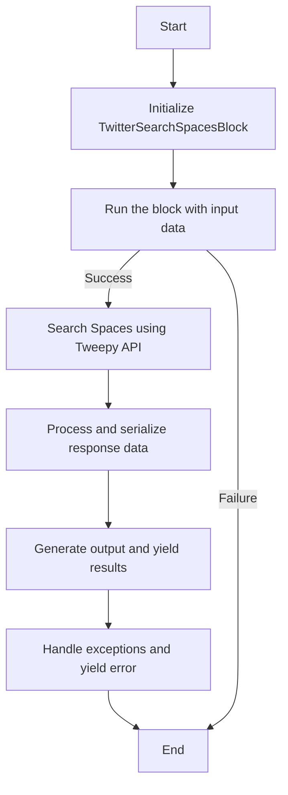
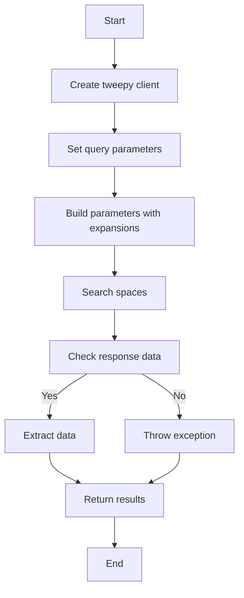
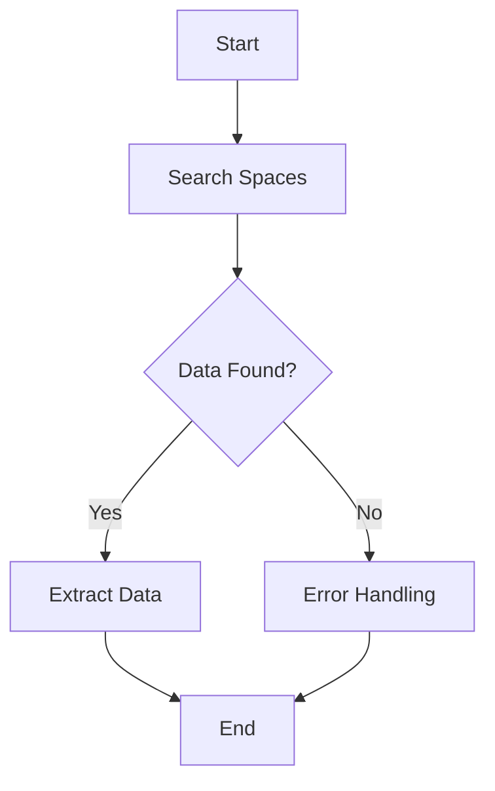
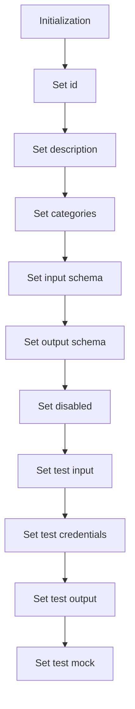
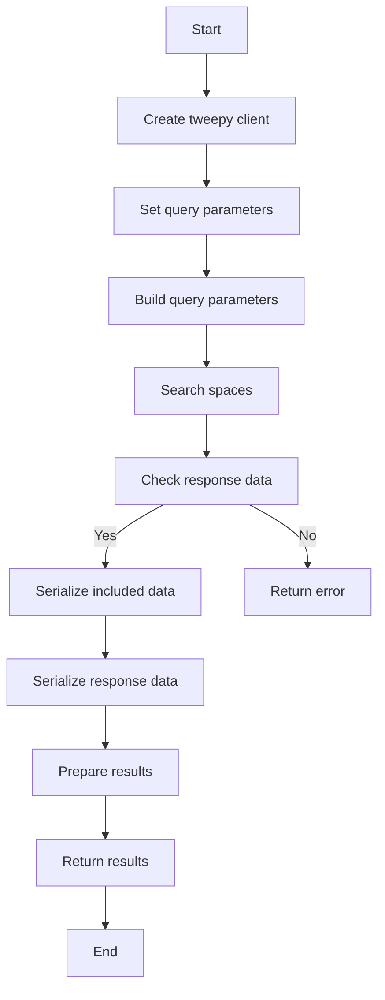
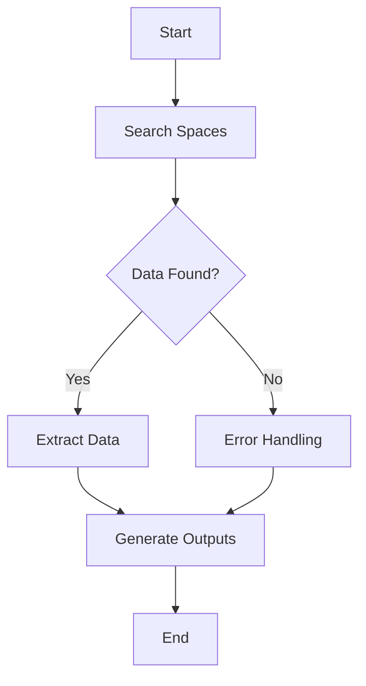

# `.\AutoGPT\autogpt_platform\backend\backend\blocks\twitter\spaces\search_spaces.py` 详细设计文档

The code defines a TwitterSearchSpacesBlock class that searches for Twitter Spaces based on specified search terms and returns relevant data.

## 整体流程



## 类结构

```
TwitterSearchSpacesBlock (Concrete Block)
├── Input (Inner Class)
│   ├── credentials (TwitterCredentialsInput)
│   ├── query (str)
│   ├── max_results (int | None)
│   └── state (SpaceStatesFilter)
├── Output (Inner Class)
│   ├── ids (list[str])
│   ├── titles (list[str])
│   ├── host_ids (list)
│   ├── next_token (str)
│   ├── data (list[dict])
│   └── includes (dict)
└── __init__ (Constructor)
```

## 全局变量及字段


### `TEST_CREDENTIALS`
    
Test Twitter credentials used for testing purposes.

类型：`TwitterCredentials`
    


### `TEST_CREDENTIALS_INPUT`
    
Test Twitter credentials input used for testing purposes.

类型：`TwitterCredentialsInput`
    


### `TWITTER_OAUTH_IS_CONFIGURED`
    
Flag indicating if Twitter OAuth is configured.

类型：`bool`
    


### `SpaceExpansionInputs`
    
Input type for Space expansion parameters.

类型：`type`
    


### `SpaceExpansionsFilter`
    
Filter type for space expansions.

类型：`type`
    


### `SpaceFieldsFilter`
    
Filter type for space fields.

类型：`type`
    


### `SpaceStatesFilter`
    
Filter type for space states (live, scheduled, or all).

类型：`type`
    


### `TweetUserFieldsFilter`
    
Filter type for tweet user fields.

类型：`type`
    


### `handle_tweepy_exception`
    
Function to handle Tweepy exceptions.

类型：`function`
    


### `Block`
    
Base class for blocks.

类型：`type`
    


### `BlockCategory`
    
Enum for block categories.

类型：`type`
    


### `BlockOutput`
    
Type for block output.

类型：`type`
    


### `BlockSchemaOutput`
    
Type for block schema output.

类型：`type`
    


### `SchemaField`
    
Type for schema fields.

类型：`type`
    


### `TwitterSearchSpacesBlock.id`
    
Unique identifier for the block.

类型：`str`
    


### `TwitterSearchSpacesBlock.description`
    
Description of the block.

类型：`str`
    


### `TwitterSearchSpacesBlock.categories`
    
Categories to which the block belongs.

类型：`set`
    


### `TwitterSearchSpacesBlock.input_schema`
    
Input schema for the block.

类型：`Input`
    


### `TwitterSearchSpacesBlock.output_schema`
    
Output schema for the block.

类型：`Output`
    


### `TwitterSearchSpacesBlock.disabled`
    
Flag indicating if the block is disabled.

类型：`bool`
    


### `TwitterSearchSpacesBlock.test_input`
    
Test input data for the block.

类型：`dict`
    


### `TwitterSearchSpacesBlock.test_credentials`
    
Test credentials for the block.

类型：`TwitterCredentials`
    


### `TwitterSearchSpacesBlock.test_output`
    
Test output data for the block.

类型：`list`
    


### `TwitterSearchSpacesBlock.test_mock`
    
Test mock data for the block.

类型：`dict`
    


### `Input.credentials`
    
Twitter credentials input.

类型：`TwitterCredentialsInput`
    


### `Input.query`
    
Search term to find in Space titles.

类型：`str`
    


### `Input.max_results`
    
Maximum number of results to return (1-100).

类型：`int | None`
    


### `Input.state`
    
Type of Spaces to return (live, scheduled, or all).

类型：`SpaceStatesFilter`
    


### `Output.ids`
    
List of space IDs.

类型：`list[str]`
    


### `Output.titles`
    
List of space titles.

类型：`list[str]`
    


### `Output.host_ids`
    
List of host IDs.

类型：`list`
    


### `Output.next_token`
    
Next token for pagination.

类型：`str`
    


### `Output.data`
    
Complete space data.

类型：`list[dict]`
    


### `Output.includes`
    
Additional data requested via expansions.

类型：`dict`
    


### `Output.meta`
    
Metadata including pagination info.

类型：`dict`
    
    

## 全局函数及方法


### `TwitterSearchSpacesBlock.search_spaces`

This function searches for Twitter Spaces based on specified search terms and returns the results.

参数：

- `credentials`：`TwitterCredentials`，Twitter credentials object containing access token.
- `query`：`str`，Search term to find in Space titles.
- `max_results`：`int | None`，Maximum number of results to return (1-100).
- `state`：`SpaceStatesFilter`，Type of Spaces to return (live, scheduled, or all).
- `expansions`：`SpaceExpansionsFilter | None`，Additional data to include in the response.
- `space_fields`：`SpaceFieldsFilter | None`，Fields to include in the Space data.
- `user_fields`：`TweetUserFieldsFilter | None`，Fields to include in the user data.

返回值：`tuple`，A tuple containing the following elements:
- `data`：`list[dict]`，Complete space data.
- `included`：`dict`，Additional data requested via expansions.
- `meta`：`dict`，Metadata including pagination info.
- `ids`：`list[str]`，List of space IDs.
- `titles`：`list[str]`，List of space titles.
- `host_ids`：`list`，List of host IDs.
- `next_token`：`str`，Next token for pagination.

#### 流程图



#### 带注释源码

```python
@staticmethod
def search_spaces(
    credentials: TwitterCredentials,
    query: str,
    max_results: int | None,
    state: SpaceStatesFilter,
    expansions: SpaceExpansionsFilter | None,
    space_fields: SpaceFieldsFilter | None,
    user_fields: TweetUserFieldsFilter | None,
):
    try:
        client = tweepy.Client(
            bearer_token=credentials.access_token.get_secret_value()
        )

        params = {"query": query, "max_results": max_results, "state": state.value}

        params = (
            SpaceExpansionsBuilder(params)
            .add_expansions(expansions)
            .add_space_fields(space_fields)
            .add_user_fields(user_fields)
            .build()
        )

        response = cast(Response, client.search_spaces(**params))

        meta = {}
        next_token = ""
        if response.meta:
            meta = response.meta
            if "next_token" in meta:
                next_token = meta["next_token"]

        included = IncludesSerializer.serialize(response.includes)
        data = ResponseDataSerializer.serialize_list(response.data)

        if response.data:
            ids = [str(space["id"]) for space in response.data if "id" in space]
            titles = [space["title"] for space in data if "title" in space]
            host_ids = [space["host_ids"] for space in data if "host_ids" in space]

            return data, included, meta, ids, titles, host_ids, next_token

        raise Exception("Spaces not found")

    except tweepy.TweepyException:
        raise
```


### `TwitterSearchSpacesBlock.run`

This method runs the search for Twitter Spaces based on the provided input data and credentials, yielding the results or errors encountered during the process.

参数：

- `input_data`：`Input`，The input data containing the search query, maximum results, state, and other parameters required for the search.
- `credentials`：`TwitterCredentials`，The Twitter credentials required to authenticate the request.
- `**kwargs`：Additional keyword arguments that may be used for future extensions.

返回值：`BlockOutput`，A generator that yields the search results or error messages.

#### 流程图



#### 带注释源码

```python
async def run(
    self,
    input_data: Input,
    *,
    credentials: TwitterCredentials,
    **kwargs,
) -> BlockOutput:
    try:
        data, included, meta, ids, titles, host_ids, next_token = (
            self.search_spaces(
                credentials,
                input_data.query,
                input_data.max_results,
                input_data.state,
                input_data.expansions,
                input_data.space_fields,
                input_data.user_fields,
            )
        )

        if ids:
            yield "ids", ids
        if titles:
            yield "titles", titles
        if host_ids:
            yield "host_ids", host_ids
        if next_token:
            yield "next_token", next_token
        if data:
            yield "data", data
        if included:
            yield "includes", included
        if meta:
            yield "meta", meta

    except Exception as e:
        yield "error", handle_tweepy_exception(e)
```


### TwitterSearchSpacesBlock.__init__

This method initializes the TwitterSearchSpacesBlock class, setting up its properties and configurations.

参数：

- `id`: `str`，The unique identifier for the block.
- `description`: `str`，A description of the block's functionality.
- `categories`: `set[BlockCategory]`，The categories to which the block belongs.
- `input_schema`: `Input`，The schema for the block's input data.
- `output_schema`: `Output`，The schema for the block's output data.
- `disabled`: `bool`，Whether the block is disabled or not.
- `test_input`: `dict`，The test input data for the block.
- `test_credentials`: `TwitterCredentials`，The test credentials for the block.
- `test_output`: `list[tuple]`，The expected test output data for the block.
- `test_mock`: `dict`，The mock data for the test.

返回值：无

#### 流程图



#### 带注释源码

```python
def __init__(self):
    super().__init__(
        id="aaefdd48-a62f-11ef-a73c-3f44df63e276",
        description="This block searches for Twitter Spaces based on specified terms.",
        categories={BlockCategory.SOCIAL},
        input_schema=TwitterSearchSpacesBlock.Input,
        output_schema=TwitterSearchSpacesBlock.Output,
        disabled=not TWITTER_OAUTH_IS_CONFIGURED,
        test_input={
            "query": "tech",
            "max_results": 1,
            "state": "live",
            "credentials": TEST_CREDENTIALS_INPUT,
            "expansions": None,
            "space_fields": None,
            "user_fields": None,
        },
        test_credentials=TEST_CREDENTIALS,
        test_output=[
            ("ids", ["1234"]),
            ("titles", ["Tech Talk"]),
            ("host_ids", ["5678"]),
            ("data", [{"id": "1234", "title": "Tech Talk", "host_ids": ["5678"]}]),
        ],
        test_mock={
            "search_spaces": lambda *args, **kwargs: (
                [{"id": "1234", "title": "Tech Talk", "host_ids": ["5678"]}],
                {},
                {},
                ["1234"],
                ["Tech Talk"],
                ["5678"],
                None,
            )
        },
    )
```


### TwitterSearchSpacesBlock.search_spaces

This function searches for Twitter Spaces based on specified search terms and returns the results.

参数：

- `credentials`：`TwitterCredentials`，Twitter credentials object containing access token.
- `query`：`str`，Search term to find in Space titles.
- `max_results`：`int | None`，Maximum number of results to return (1-100).
- `state`：`SpaceStatesFilter`，Type of Spaces to return (live, scheduled, or all).
- `expansions`：`SpaceExpansionsFilter | None`，Additional data to include in the response.
- `space_fields`：`SpaceFieldsFilter | None`，Fields to include in the Space data.
- `user_fields`：`TweetUserFieldsFilter | None`，Fields to include in the user data.

返回值：`tuple`，A tuple containing the following elements:
- `data`：`list[dict]`，Complete space data.
- `included`：`dict`，Additional data requested via expansions.
- `meta`：`dict`，Metadata including pagination info.
- `ids`：`list[str]`，List of space IDs.
- `titles`：`list[str]`，List of space titles.
- `host_ids`：`list`，List of host IDs.
- `next_token`：`str`，Next token for pagination.

#### 流程图



#### 带注释源码

```python
@staticmethod
def search_spaces(
    credentials: TwitterCredentials,
    query: str,
    max_results: int | None,
    state: SpaceStatesFilter,
    expansions: SpaceExpansionsFilter | None,
    space_fields: SpaceFieldsFilter | None,
    user_fields: TweetUserFieldsFilter | None,
):
    try:
        client = tweepy.Client(
            bearer_token=credentials.access_token.get_secret_value()
        )

        params = {"query": query, "max_results": max_results, "state": state.value}

        params = (
            SpaceExpansionsBuilder(params)
            .add_expansions(expansions)
            .add_space_fields(space_fields)
            .add_user_fields(user_fields)
            .build()
        )

        response = cast(Response, client.search_spaces(**params))

        meta = {}
        next_token = ""
        if response.meta:
            meta = response.meta
            if "next_token" in meta:
                next_token = meta["next_token"]

        included = IncludesSerializer.serialize(response.includes)
        data = ResponseDataSerializer.serialize_list(response.data)

        if response.data:
            ids = [str(space["id"]) for space in response.data if "id" in space]
            titles = [space["title"] for space in data if "title" in space]
            host_ids = [space["host_ids"] for space in data if "host_ids" in space]

            return data, included, meta, ids, titles, host_ids, next_token

        raise Exception("Spaces not found")

    except tweepy.TweepyException:
        raise
```


### TwitterSearchSpacesBlock.run

This method runs the search for Twitter Spaces based on the provided input data and credentials, yielding the results or errors encountered during the process.

参数：

- `input_data`：`Input`，The input data containing the search query, maximum results, state, and other parameters required for the search.
- `credentials`：`TwitterCredentials`，The Twitter credentials required to authenticate the request.
- `**kwargs`：Any additional keyword arguments that might be needed for future extensions.

返回值：`BlockOutput`，A generator that yields the search results or error messages.

#### 流程图



#### 带注释源码

```python
async def run(
    self,
    input_data: Input,
    *,
    credentials: TwitterCredentials,
    **kwargs,
) -> BlockOutput:
    try:
        data, included, meta, ids, titles, host_ids, next_token = (
            self.search_spaces(
                credentials,
                input_data.query,
                input_data.max_results,
                input_data.state,
                input_data.expansions,
                input_data.space_fields,
                input_data.user_fields,
            )
        )

        if ids:
            yield "ids", ids
        if titles:
            yield "titles", titles
        if host_ids:
            yield "host_ids", host_ids
        if next_token:
            yield "next_token", next_token
        if data:
            yield "data", data
        if included:
            yield "includes", included
        if meta:
            yield "meta", meta

    except Exception as e:
        yield "error", handle_tweepy_exception(e)
```


## 关键组件


### 张量索引与惰性加载

张量索引与惰性加载是代码中处理数据的一种方式，它允许在需要时才加载和索引数据，从而提高性能和资源利用率。

### 反量化支持

反量化支持是代码中实现的一种功能，它允许对量化后的模型进行反量化处理，以便在需要时恢复原始的浮点数值。

### 量化策略

量化策略是代码中用于模型压缩和加速的一种技术，它通过将模型的权重和激活值从浮点数转换为低精度整数来减少模型的存储和计算需求。


## 问题及建议


### 已知问题

-   **全局变量和函数的可见性**：`TWITTER_OAUTH_IS_CONFIGURED` 是一个全局变量，它可能应该在模块级别而不是全局级别定义，以避免潜在的命名冲突和模块间的依赖问题。
-   **异常处理**：`search_spaces` 方法中的异常处理仅捕获了 `tweepy.TweepyException`，但没有对其他可能的异常进行处理，这可能导致未捕获的异常。
-   **代码重复**：`search_spaces` 方法中存在一些代码重复，例如序列化 `response.includes` 和 `response.data`，可以考虑将这些操作封装到单独的函数中。
-   **异步函数的使用**：`run` 方法是一个异步函数，但在文档中没有明确说明它如何与同步代码交互，这可能导致混淆。

### 优化建议

-   **模块化全局变量**：将 `TWITTER_OAUTH_IS_CONFIGURED` 移动到模块级别，并确保其名称是唯一的。
-   **增强异常处理**：在 `search_spaces` 方法中添加对其他可能异常的处理，例如网络异常或API限制异常。
-   **减少代码重复**：创建辅助函数来处理 `response.includes` 和 `response.data` 的序列化，以提高代码的可读性和可维护性。
-   **文档异步函数**：在文档中明确说明 `run` 方法如何与同步代码交互，包括如何处理异步操作和结果。
-   **代码测试**：增加单元测试来覆盖异步函数和全局变量的使用，确保代码的稳定性和可靠性。
-   **性能优化**：考虑使用缓存机制来存储重复的API调用结果，以减少不必要的网络请求和API调用。
-   **错误信息**：在异常处理中提供更详细的错误信息，以便于调试和用户理解错误原因。


## 其它


### 设计目标与约束

- 设计目标：
  - 实现一个能够根据指定搜索词返回匹配的Twitter Spaces的块。
  - 支持对Spaces的搜索结果进行分页。
  - 提供详细的输出，包括Spaces的ID、标题、主持人ID等。
  - 确保代码的可维护性和可扩展性。
- 约束：
  - 代码必须遵循Twitter API的使用条款和限制。
  - 代码应避免使用外部依赖，除非必要。
  - 代码应具有良好的性能，尤其是在处理大量数据时。

### 错误处理与异常设计

- 错误处理：
  - 使用`try-except`块捕获和处理可能发生的异常。
  - 对于Twitter API的异常，使用`handle_tweepy_exception`函数进行特定的异常处理。
  - 对于其他异常，抛出通用异常，并在输出中返回错误信息。
- 异常设计：
  - 定义自定义异常类，以便于在代码中处理特定的错误情况。
  - 异常类应提供足够的信息，以便于调试和记录。

### 数据流与状态机

- 数据流：
  - 输入数据通过`run`方法传递给`search_spaces`函数。
  - `search_spaces`函数从Twitter API获取Spaces数据，并将其序列化为所需的格式。
  - 序列化后的数据通过`yield`语句返回给调用者。
- 状态机：
  - 该块没有明确的状态机，但`search_spaces`函数中的逻辑可以被视为一个状态转换过程。

### 外部依赖与接口契约

- 外部依赖：
  - `tweepy`库用于与Twitter API交互。
  - `backend`模块包含通用的数据结构和函数。
- 接口契约：
  - `TwitterSearchSpacesBlock`类定义了输入和输出契约。
  - `search_spaces`函数定义了与Twitter API交互的契约。


    