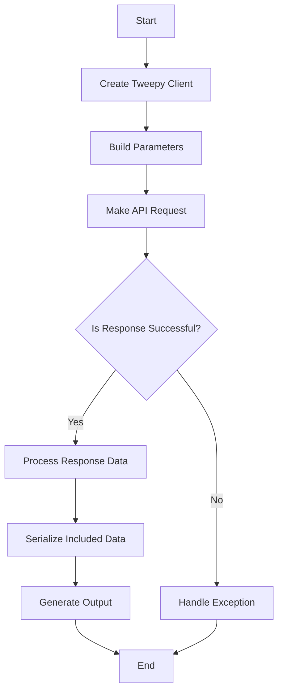
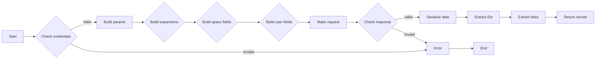
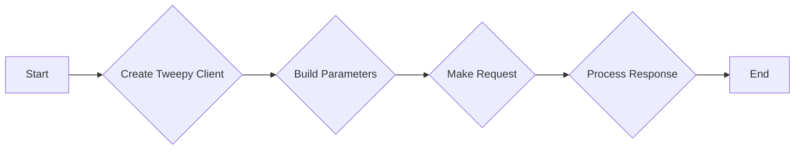
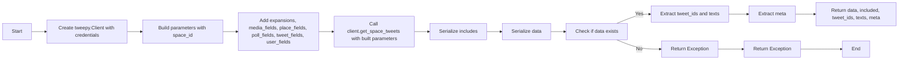
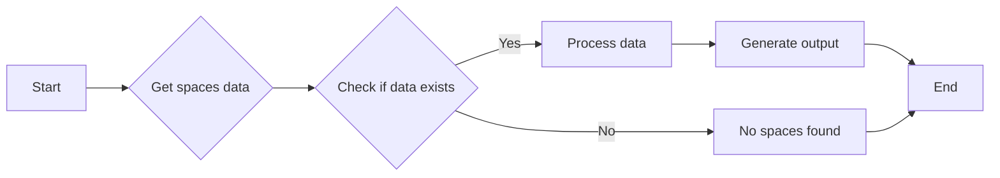
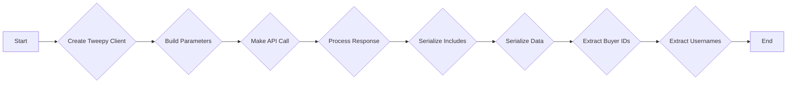
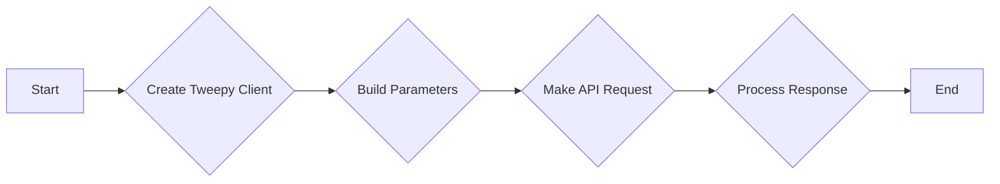

```mermaid
graph LR
A[Start] --> B[Create tweepy.Client with credentials]
B --> C[Build params with space_id]
C --> D[Add expansions to params if provided]
D --> E[Add space_fields to params if provided]
E --> F[Add user_fields to params if provided]
F --> G[Build final params]
G --> H[Call client.get_space with final params]
H --> I[Serialize includes]
I --> J[Serialize data]
J --> K[Return data and includes]
K --> L[End]
```

# `.\AutoGPT\autogpt_platform\backend\backend\blocks\twitter\spaces\spaces_lookup.py` 详细设计文档

This file contains classes and functions to interact with Twitter Spaces using the Tweepy library, including retrieving information about Spaces, Space buyers, and Space tweets.

## 整体流程



## 类结构

```
TwitterBlocks (模块)
├── SpaceList (基类)
│   ├── UserList (基类)
│   ├── TwitterGetSpacesBlock (类)
│   ├── TwitterGetSpaceByIdBlock (类)
│   ├── TwitterGetSpaceBuyersBlock (类)
│   └── TwitterGetSpaceTweetsBlock (类)
```

## 全局变量及字段


### `TEST_CREDENTIALS`
    
Test Twitter credentials for OAuth authentication.

类型：`TwitterCredentials`
    


### `TEST_CREDENTIALS_INPUT`
    
Input schema for test Twitter credentials.

类型：`TwitterCredentialsInput`
    


### `TWITTER_OAUTH_IS_CONFIGURED`
    
Flag indicating if Twitter OAuth is configured.

类型：`Literal[bool]`
    


### `TwitterCredentials`
    
Model representing Twitter credentials.

类型：`BaseModel`
    


### `TwitterCredentialsField`
    
Field for Twitter credentials with specific permissions.

类型：`SchemaField`
    


### `TwitterCredentialsInput`
    
Input model for Twitter credentials.

类型：`BaseModel`
    


### `SpaceExpansionsBuilder`
    
Builder for space expansions parameters.

类型：`Builder`
    


### `TweetExpansionsBuilder`
    
Builder for tweet expansions parameters.

类型：`Builder`
    


### `UserExpansionsBuilder`
    
Builder for user expansions parameters.

类型：`Builder`
    


### `IncludesSerializer`
    
Serializer for includes data in Twitter responses.

类型：`Serializer`
    


### `ResponseDataSerializer`
    
Serializer for response data in Twitter responses.

类型：`Serializer`
    


### `ExpansionFilter`
    
Filter for expansions in Twitter API requests.

类型：`Literal`
    


### `SpaceExpansionInputs`
    
Input model for space expansions parameters.

类型：`BaseModel`
    


### `SpaceExpansionsFilter`
    
Filter for space expansions in Twitter API requests.

类型：`Literal`
    


### `SpaceFieldsFilter`
    
Filter for space fields in Twitter API requests.

类型：`Literal`
    


### `TweetExpansionInputs`
    
Input model for tweet expansions parameters.

类型：`BaseModel`
    


### `TweetFieldsFilter`
    
Filter for tweet fields in Twitter API requests.

类型：`Literal`
    


### `TweetMediaFieldsFilter`
    
Filter for media fields in tweet data in Twitter API requests.

类型：`Literal`
    


### `TweetPlaceFieldsFilter`
    
Filter for place fields in tweet data in Twitter API requests.

类型：`Literal`
    


### `TweetPollFieldsFilter`
    
Filter for poll fields in tweet data in Twitter API requests.

类型：`Literal`
    


### `TweetUserFieldsFilter`
    
Filter for user fields in tweet data in Twitter API requests.

类型：`Literal`
    


### `UserExpansionInputs`
    
Input model for user expansions parameters.

类型：`BaseModel`
    


### `UserExpansionsFilter`
    
Filter for user expansions in Twitter API requests.

类型：`Literal`
    


### `handle_tweepy_exception`
    
Function to handle Tweepy exceptions.

类型：`function`
    


### `Block`
    
Base class for blocks in the system.

类型：`BaseModel`
    


### `BlockCategory`
    
Category for blocks in the system.

类型：`Literal`
    


### `BlockOutput`
    
Output model for blocks in the system.

类型：`BaseModel`
    


### `BlockSchemaOutput`
    
Schema output model for blocks in the system.

类型：`BaseModel`
    


### `SchemaField`
    
Field schema for inputs and outputs in blocks.

类型：`BaseModel`
    


### `{'name': 'SpaceList', 'fields': ['discriminator', 'space_ids'], 'methods': []}.discriminator`
    
Discriminator for SpaceList model.

类型：`Literal`
    


### `{'name': 'SpaceList', 'fields': ['discriminator', 'space_ids'], 'methods': []}.space_ids`
    
List of space IDs in SpaceList model.

类型：`list[str]`
    


### `{'name': 'UserList', 'fields': ['discriminator', 'user_ids'], 'methods': []}.discriminator`
    
Discriminator for UserList model.

类型：`Literal`
    


### `{'name': 'UserList', 'fields': ['discriminator', 'user_ids'], 'methods': []}.user_ids`
    
List of user IDs in UserList model.

类型：`list[str]`
    


### `TwitterGetSpacesBlock.id`
    
Unique identifier for the block.

类型：`str`
    


### `TwitterGetSpacesBlock.description`
    
Description of the block's functionality.

类型：`str`
    


### `TwitterGetSpacesBlock.categories`
    
Categories to which the block belongs.

类型：`set[BlockCategory]`
    


### `TwitterGetSpacesBlock.input_schema`
    
Input schema for the block.

类型：`BaseModel`
    


### `TwitterGetSpacesBlock.output_schema`
    
Output schema for the block.

类型：`BaseModel`
    


### `TwitterGetSpacesBlock.disabled`
    
Flag indicating if the block is disabled.

类型：`bool`
    


### `TwitterGetSpacesBlock.test_input`
    
Test input data for the block.

类型：`dict`
    


### `TwitterGetSpacesBlock.test_credentials`
    
Test credentials for the block.

类型：`TwitterCredentials`
    


### `TwitterGetSpacesBlock.test_output`
    
Test output data for the block.

类型：`list`
    


### `TwitterGetSpacesBlock.test_mock`
    
Mock data for testing the block.

类型：`dict`
    


### `TwitterGetSpaceByIdBlock.id`
    
Unique identifier for the block.

类型：`str`
    


### `TwitterGetSpaceByIdBlock.description`
    
Description of the block's functionality.

类型：`str`
    


### `TwitterGetSpaceByIdBlock.categories`
    
Categories to which the block belongs.

类型：`set[BlockCategory]`
    


### `TwitterGetSpaceByIdBlock.input_schema`
    
Input schema for the block.

类型：`BaseModel`
    


### `TwitterGetSpaceByIdBlock.output_schema`
    
Output schema for the block.

类型：`BaseModel`
    


### `TwitterGetSpaceByIdBlock.disabled`
    
Flag indicating if the block is disabled.

类型：`bool`
    


### `TwitterGetSpaceByIdBlock.test_input`
    
Test input data for the block.

类型：`dict`
    


### `TwitterGetSpaceByIdBlock.test_credentials`
    
Test credentials for the block.

类型：`TwitterCredentials`
    


### `TwitterGetSpaceByIdBlock.test_output`
    
Test output data for the block.

类型：`list`
    


### `TwitterGetSpaceByIdBlock.test_mock`
    
Mock data for testing the block.

类型：`dict`
    


### `TwitterGetSpaceBuyersBlock.id`
    
Unique identifier for the block.

类型：`str`
    


### `TwitterGetSpaceBuyersBlock.description`
    
Description of the block's functionality.

类型：`str`
    


### `TwitterGetSpaceBuyersBlock.categories`
    
Categories to which the block belongs.

类型：`set[BlockCategory]`
    


### `TwitterGetSpaceBuyersBlock.input_schema`
    
Input schema for the block.

类型：`BaseModel`
    


### `TwitterGetSpaceBuyersBlock.output_schema`
    
Output schema for the block.

类型：`BaseModel`
    


### `TwitterGetSpaceBuyersBlock.disabled`
    
Flag indicating if the block is disabled.

类型：`bool`
    


### `TwitterGetSpaceBuyersBlock.test_input`
    
Test input data for the block.

类型：`dict`
    


### `TwitterGetSpaceBuyersBlock.test_credentials`
    
Test credentials for the block.

类型：`TwitterCredentials`
    


### `TwitterGetSpaceBuyersBlock.test_output`
    
Test output data for the block.

类型：`list`
    


### `TwitterGetSpaceBuyersBlock.test_mock`
    
Mock data for testing the block.

类型：`dict`
    


### `TwitterGetSpaceTweetsBlock.id`
    
Unique identifier for the block.

类型：`str`
    


### `TwitterGetSpaceTweetsBlock.description`
    
Description of the block's functionality.

类型：`str`
    


### `TwitterGetSpaceTweetsBlock.categories`
    
Categories to which the block belongs.

类型：`set[BlockCategory]`
    


### `TwitterGetSpaceTweetsBlock.input_schema`
    
Input schema for the block.

类型：`BaseModel`
    


### `TwitterGetSpaceTweetsBlock.output_schema`
    
Output schema for the block.

类型：`BaseModel`
    


### `TwitterGetSpaceTweetsBlock.disabled`
    
Flag indicating if the block is disabled.

类型：`bool`
    


### `TwitterGetSpaceTweetsBlock.test_input`
    
Test input data for the block.

类型：`dict`
    


### `TwitterGetSpaceTweetsBlock.test_credentials`
    
Test credentials for the block.

类型：`TwitterCredentials`
    


### `TwitterGetSpaceTweetsBlock.test_output`
    
Test output data for the block.

类型：`list`
    


### `TwitterGetSpaceTweetsBlock.test_mock`
    
Mock data for testing the block.

类型：`dict`
    
    

## 全局函数及方法


### `TwitterGetSpacesBlock.get_spaces`

This method retrieves information about multiple Twitter Spaces specified by Space IDs or creator user IDs.

参数：

- `credentials`：`TwitterCredentials`，Twitter credentials required to authenticate the request.
- `identifier`：`Union[SpaceList, UserList]`，Indicates whether to lookup spaces by their IDs or by creator user IDs.
- `expansions`：`SpaceExpansionsFilter | None`，Additional data to include in the response via expansions.
- `space_fields`：`SpaceFieldsFilter | None`，Fields to include in the space data.
- `user_fields`：`TweetUserFieldsFilter | None`，Fields to include in the user data.

返回值：`tuple`，Returns a tuple containing the following elements:
- `data`：`list[dict]`，Complete space data.
- `included`：`dict`，Additional data requested via expansions.
- `ids`：`list[str]`，List of space IDs.
- `titles`：`list[str]`，List of space titles.

#### 流程图



#### 带注释源码

```python
@staticmethod
def get_spaces(
    credentials: TwitterCredentials,
    identifier: Union[SpaceList, UserList],
    expansions: SpaceExpansionsFilter | None,
    space_fields: SpaceFieldsFilter | None,
    user_fields: TweetUserFieldsFilter | None,
):
    try:
        client = tweepy.Client(
            bearer_token=credentials.access_token.get_secret_value()
        )

        params = {
            "ids": (
                identifier.space_ids if isinstance(identifier, SpaceList) else None
            ),
            "user_ids": (
                identifier.user_ids if isinstance(identifier, UserList) else None
            ),
        }

        params = (
            SpaceExpansionsBuilder(params)
            .add_expansions(expansions)
            .add_space_fields(space_fields)
            .add_user_fields(user_fields)
            .build()
        )

        response = cast(Response, client.get_spaces(**params))

        ids = []
        titles = []

        included = IncludesSerializer.serialize(response.includes)

        if response.data:
            data = ResponseDataSerializer.serialize_list(response.data)
            ids = [space["id"] for space in data if "id" in space]
            titles = [space["title"] for space in data if "title" in space]

            return data, included, ids, titles

        raise Exception("No spaces found")

    except tweepy.TweepyException:
        raise
``` 


### `TwitterGetSpaceByIdBlock.get_space`

Retrieves information about a single Twitter Space specified by Space ID.

参数：

- `credentials`：`TwitterCredentials`，Twitter credentials required to access the Twitter API.
- `space_id`：`str`，Space ID to lookup.
- `expansions`：`SpaceExpansionsFilter | None`，Expansions to include in the response.
- `space_fields`：`SpaceFieldsFilter | None`，Fields to include in the space data.
- `user_fields`：`TweetUserFieldsFilter | None`，Fields to include in the user data.

返回值：`dict`，Complete space data.

#### 流程图



#### 带注释源码

```python
@staticmethod
def get_space(
    credentials: TwitterCredentials,
    space_id: str,
    expansions: SpaceExpansionsFilter | None,
    space_fields: SpaceFieldsFilter | None,
    user_fields: TweetUserFieldsFilter | None,
):
    try:
        client = tweepy.Client(
            bearer_token=credentials.access_token.get_secret_value()
        )

        params = {
            "id": space_id,
        }

        params = (
            SpaceExpansionsBuilder(params)
            .add_expansions(expansions)
            .add_space_fields(space_fields)
            .add_user_fields(user_fields)
            .build()
        )

        response = cast(Response, client.get_space(**params))

        includes = {}
        if response.includes:
            for key, value in response.includes.items():
                if isinstance(value, list):
                    includes[key] = [
                        item.data if hasattr(item, "data") else item
                        for item in value
                    ]
                else:
                    includes[key] = value.data if hasattr(value, "data") else value

        data = {}
        if response.data:
            for key, value in response.data.items():
                if isinstance(value, list):
                    data[key] = [
                        item.data if hasattr(item, "data") else item
                        for item in value
                    ]
                else:
                    data[key] = value.data if hasattr(value, "data") else value

            return data, includes

        raise Exception("Space not found")

    except tweepy.TweepyException:
        raise
``` 


### TwitterGetSpaceBuyersBlock.get_space_buyers

This method retrieves a list of users who purchased tickets to a specified Twitter Space.

参数：

- `credentials`：`TwitterCredentials`，Twitter credentials required to authenticate the request.
- `space_id`：`str`，The ID of the Twitter Space for which to retrieve the list of buyers.
- `expansions`：`UserExpansionsFilter | None`，Optional filter to specify the expansions to include in the response.
- `user_fields`：`TweetUserFieldsFilter | None`，Optional filter to specify the user fields to include in the response.

返回值：`tuple`，A tuple containing the following elements:
- `data`：`list[dict]`，A list of dictionaries containing the complete space buyers data.
- `included`：`dict`，Additional data requested via expansions.
- `buyer_ids`：`list[str]`，A list of buyer IDs.
- `usernames`：`list[str]`，A list of buyer usernames.

#### 流程图



#### 带注释源码

```python
@staticmethod
def get_space_buyers(
    credentials: TwitterCredentials,
    space_id: str,
    expansions: UserExpansionsFilter | None,
    user_fields: TweetUserFieldsFilter | None,
):
    try:
        client = tweepy.Client(
            bearer_token=credentials.access_token.get_secret_value()
        )

        params = {
            "id": space_id,
        }

        params = (
            UserExpansionsBuilder(params)
            .add_expansions(expansions)
            .add_user_fields(user_fields)
            .build()
        )

        response = cast(Response, client.get_space_buyers(**params))

        included = IncludesSerializer.serialize(response.includes)

        if response.data:
            data = ResponseDataSerializer.serialize_list(response.data)
            buyer_ids = [buyer["id"] for buyer in data]
            usernames = [buyer["username"] for buyer in data]

            return data, included, buyer_ids, usernames

        raise Exception("No buyers found for this Space")

    except tweepy.TweepyException:
        raise
```


### `TwitterGetSpaceTweetsBlock.get_space_tweets`

Retrieves a list of tweets shared in the requested Twitter Space.

参数：

- `credentials`：`TwitterCredentials`，Twitter credentials required to access the Twitter API.
- `space_id`：`str`，Space ID to lookup tweets for.
- `expansions`：`ExpansionFilter | None`，Expansions to include in the response.
- `media_fields`：`TweetMediaFieldsFilter | None`，Media fields to include in the response.
- `place_fields`：`TweetPlaceFieldsFilter | None`，Place fields to include in the response.
- `poll_fields`：`TweetPollFieldsFilter | None`，Poll fields to include in the response.
- `tweet_fields`：`TweetFieldsFilter | None`，Tweet fields to include in the response.
- `user_fields`：`TweetUserFieldsFilter | None`，User fields to include in the response.

返回值：`list[dict]`，Complete space tweets data.

#### 流程图



#### 带注释源码

```python
def get_space_tweets(
    credentials: TwitterCredentials,
    space_id: str,
    expansions: ExpansionFilter | None,
    media_fields: TweetMediaFieldsFilter | None,
    place_fields: TweetPlaceFieldsFilter | None,
    poll_fields: TweetPollFieldsFilter | None,
    tweet_fields: TweetFieldsFilter | None,
    user_fields: TweetUserFieldsFilter | None,
):
    try:
        client = tweepy.Client(
            bearer_token=credentials.access_token.get_secret_value()
        )

        params = {
            "id": space_id,
        }

        params = (
            TweetExpansionsBuilder(params)
            .add_expansions(expansions)
            .add_media_fields(media_fields)
            .add_place_fields(place_fields)
            .add_poll_fields(poll_fields)
            .add_tweet_fields(tweet_fields)
            .add_user_fields(user_fields)
            .build()
        )

        response = cast(Response, client.get_space_tweets(**params))

        included = IncludesSerializer.serialize(response.includes)

        if response.data:
            data = ResponseDataSerializer.serialize_list(response.data)
            tweet_ids = [str(tweet["id"]) for tweet in data]
            texts = [tweet["text"] for tweet in data]

            meta = response.meta or {}

            return data, included, tweet_ids, texts, meta

        raise Exception("No tweets found for this Space")

    except tweepy.TweepyException:
        raise
``` 


### `TwitterGetSpacesBlock.run`

Retrieves information about multiple Twitter Spaces specified by Space IDs or creator user IDs.

参数：

- `input_data`：`Input`，The input data for the block.
- `credentials`：`TwitterCredentials`，The Twitter credentials to use for the request.
- `**kwargs`：`Any`，Additional keyword arguments.

返回值：`BlockOutput`，The output data from the block.

#### 流程图



#### 带注释源码

```python
async def run(
    self,
    input_data: Input,
    *,
    credentials: TwitterCredentials,
    **kwargs,
) -> BlockOutput:
    try:
        data, included, ids, titles = self.get_spaces(
            credentials,
            input_data.identifier,
            input_data.expansions,
            input_data.space_fields,
            input_data.user_fields,
        )

        if ids:
            yield "ids", ids
        if titles:
            yield "titles", titles

        if data:
            yield "data", data
        if included:
            yield "includes", included

    except Exception as e:
        yield "error", handle_tweepy_exception(e)
``` 


### TwitterGetSpacesBlock.get_spaces

This method retrieves information about multiple Twitter Spaces specified by Space IDs or creator user IDs.

参数：

- `credentials`：`TwitterCredentials`，Twitter credentials required to authenticate the request.
- `identifier`：`Union[SpaceList, UserList]`，Indicates whether to lookup spaces by their IDs or by creator user IDs.
- `expansions`：`SpaceExpansionsFilter | None`，Additional data to include in the response.
- `space_fields`：`SpaceFieldsFilter | None`，Fields to include in the space data.
- `user_fields`：`TweetUserFieldsFilter | None`，Fields to include in the user data.

返回值：`tuple`，Returns a tuple containing the following elements:
- `data`：`list[dict]`，Complete space data.
- `included`：`dict`，Additional data requested via expansions.
- `ids`：`list[str]`，List of space IDs.
- `titles`：`list[str]`，List of space titles.

#### 流程图


#### 带注释源码

```python
@staticmethod
def get_spaces(
    credentials: TwitterCredentials,
    identifier: Union[SpaceList, UserList],
    expansions: SpaceExpansionsFilter | None,
    space_fields: SpaceFieldsFilter | None,
    user_fields: TweetUserFieldsFilter | None,
):
    try:
        client = tweepy.Client(
            bearer_token=credentials.access_token.get_secret_value()
        )

        params = {
            "ids": (
                identifier.space_ids if isinstance(identifier, SpaceList) else None
            ),
            "user_ids": (
                identifier.user_ids if isinstance(identifier, UserList) else None
            ),
        }

        params = (
            SpaceExpansionsBuilder(params)
            .add_expansions(expansions)
            .add_space_fields(space_fields)
            .add_user_fields(user_fields)
            .build()
        )

        response = cast(Response, client.get_spaces(**params))

        ids = []
        titles = []

        included = IncludesSerializer.serialize(response.includes)

        if response.data:
            data = ResponseDataSerializer.serialize_list(response.data)
            ids = [space["id"] for space in data if "id" in space]
            titles = [space["title"] for space in data if "title" in space]

            return data, included, ids, titles

        raise Exception("No spaces found")

    except tweepy.TweepyException:
        raise
``` 


### TwitterGetSpaceByIdBlock.get_space

This method retrieves information about a single Twitter Space specified by Space ID.

参数：

- `credentials`：`TwitterCredentials`，Twitter credentials required to authenticate the request.
- `space_id`：`str`，Space ID to lookup.
- `expansions`：`SpaceExpansionsFilter | None`，Expansions to include in the response.
- `space_fields`：`SpaceFieldsFilter | None`，Fields to include in the space data.
- `user_fields`：`TweetUserFieldsFilter | None`，Fields to include in the user data.

返回值：`dict`，Complete space data.

#### 流程图


#### 带注释源码

```python
@staticmethod
def get_space(
    credentials: TwitterCredentials,
    space_id: str,
    expansions: SpaceExpansionsFilter | None,
    space_fields: SpaceFieldsFilter | None,
    user_fields: TweetUserFieldsFilter | None,
):
    try:
        client = tweepy.Client(
            bearer_token=credentials.access_token.get_secret_value()
        )

        params = {
            "id": space_id,
        }

        params = (
            SpaceExpansionsBuilder(params)
            .add_expansions(expansions)
            .add_space_fields(space_fields)
            .add_user_fields(user_fields)
            .build()
        )

        response = cast(Response, client.get_space(**params))

        includes = {}
        if response.includes:
            for key, value in response.includes.items():
                if isinstance(value, list):
                    includes[key] = [
                        item.data if hasattr(item, "data") else item
                        for item in value
                    ]
                else:
                    includes[key] = value.data if hasattr(value, "data") else value

        data = {}
        if response.data:
            for key, value in response.data.items():
                if isinstance(value, list):
                    data[key] = [
                        item.data if hasattr(item, "data") else item
                        for item in value
                    ]
                else:
                    data[key] = value.data if hasattr(value, "data") else value

            return data, includes

        raise Exception("Space not found")

    except tweepy.TweepyException:
        raise
``` 


### TwitterGetSpaceBuyersBlock.get_space_buyers

Retrieves a list of users who purchased a ticket to the requested Twitter Space.

参数：

- `credentials`：`TwitterCredentials`，Twitter credentials required to access the Twitter API.
- `space_id`：`str`，Space ID to lookup buyers for.
- `expansions`：`UserExpansionsFilter | None`，Expansions to include in the response.
- `user_fields`：`TweetUserFieldsFilter | None`，User fields to include in the response.

返回值：`tuple`，(data: list[dict], included: dict, buyer_ids: list[str], usernames: list[str])

#### 流程图



#### 带注释源码

```python
@staticmethod
def get_space_buyers(
    credentials: TwitterCredentials,
    space_id: str,
    expansions: UserExpansionsFilter | None,
    user_fields: TweetUserFieldsFilter | None,
):
    try:
        client = tweepy.Client(
            bearer_token=credentials.access_token.get_secret_value()
        )

        params = {
            "id": space_id,
        }

        params = (
            UserExpansionsBuilder(params)
            .add_expansions(expansions)
            .add_user_fields(user_fields)
            .build()
        )

        response = cast(Response, client.get_space_buyers(**params))

        included = IncludesSerializer.serialize(response.includes)

        if response.data:
            data = ResponseDataSerializer.serialize_list(response.data)
            buyer_ids = [buyer["id"] for buyer in data]
            usernames = [buyer["username"] for buyer in data]

            return data, included, buyer_ids, usernames

        raise Exception("No buyers found for this Space")

    except tweepy.TweepyException:
        raise
``` 


### TwitterGetSpaceTweetsBlock.get_space_tweets

Retrieves a list of Tweets shared in the requested Twitter Space.

参数：

- `credentials`：`TwitterCredentials`，Twitter credentials required to access the Twitter API.
- `space_id`：`str`，The ID of the Twitter Space to retrieve tweets for.
- `expansions`：`ExpansionFilter | None`，Optional parameter to specify additional data to include in the response.
- `media_fields`：`TweetMediaFieldsFilter | None`，Optional parameter to specify additional media fields to include in the response.
- `place_fields`：`TweetPlaceFieldsFilter | None`，Optional parameter to specify additional place fields to include in the response.
- `poll_fields`：`TweetPollFieldsFilter | None`，Optional parameter to specify additional poll fields to include in the response.
- `tweet_fields`：`TweetFieldsFilter | None`，Optional parameter to specify additional tweet fields to include in the response.
- `user_fields`：`TweetUserFieldsFilter | None`，Optional parameter to specify additional user fields to include in the response.

返回值：`list[dict]`，A list of dictionaries containing the retrieved tweets.

#### 流程图



#### 带注释源码

```python
@staticmethod
def get_space_tweets(
    credentials: TwitterCredentials,
    space_id: str,
    expansions: ExpansionFilter | None,
    media_fields: TweetMediaFieldsFilter | None,
    place_fields: TweetPlaceFieldsFilter | None,
    poll_fields: TweetPollFieldsFilter | None,
    tweet_fields: TweetFieldsFilter | None,
    user_fields: TweetUserFieldsFilter | None,
):
    try:
        client = tweepy.Client(
            bearer_token=credentials.access_token.get_secret_value()
        )

        params = {
            "id": space_id,
        }

        params = (
            TweetExpansionsBuilder(params)
            .add_expansions(expansions)
            .add_media_fields(media_fields)
            .add_place_fields(place_fields)
            .add_poll_fields(poll_fields)
            .add_tweet_fields(tweet_fields)
            .add_user_fields(user_fields)
            .build()
        )

        response = cast(Response, client.get_space_tweets(**params))

        included = IncludesSerializer.serialize(response.includes)

        if response.data:
            data = ResponseDataSerializer.serialize_list(response.data)
            tweet_ids = [str(tweet["id"]) for tweet in data]
            texts = [tweet["text"] for tweet in data]

            meta = response.meta or {}

            return data, included, tweet_ids, texts, meta

        raise Exception("No tweets found for this Space")

    except tweepy.TweepyException:
        raise
``` 


## 关键组件


### 张量索引与惰性加载

张量索引与惰性加载是代码中用于高效处理和访问大型数据集的关键组件。它们允许在需要时才加载数据，从而减少内存消耗并提高性能。

### 反量化支持

反量化支持是代码中用于处理和转换量化数据的关键组件。它允许将量化数据转换回原始数据格式，以便进行进一步处理和分析。

### 量化策略

量化策略是代码中用于优化数据存储和计算效率的关键组件。它通过减少数据精度来减少内存和计算资源的使用，同时保持足够的准确性。


## 问题及建议


### 已知问题

-   **代码重复性**：多个类（如 `TwitterGetSpacesBlock`、`TwitterGetSpaceByIdBlock`、`TwitterGetSpaceBuyersBlock` 和 `TwitterGetSpaceTweetsBlock`）具有相似的逻辑和结构，这可能导致维护成本增加和代码重复。
-   **异常处理**：异常处理主要集中在捕获 `tweepy.TweepyException`，但没有针对特定错误类型的细化处理，这可能导致错误信息不够具体。
-   **代码注释**：代码中缺少详细的注释，这可能会影响其他开发者理解代码逻辑。

### 优化建议

-   **代码重构**：考虑将重复的逻辑提取到单独的函数或类中，以减少代码重复并提高可维护性。
-   **细化异常处理**：根据不同的错误类型提供更具体的异常处理逻辑，以便更好地诊断和解决问题。
-   **增加代码注释**：在关键代码段和复杂逻辑处添加注释，以提高代码的可读性和可维护性。
-   **单元测试**：为每个类和方法编写单元测试，以确保代码质量和功能正确性。
-   **性能优化**：考虑对网络请求进行缓存，以减少不必要的网络请求和等待时间。
-   **文档化**：为代码和类提供详细的文档说明，包括参数、返回值和异常处理。


## 其它


### 设计目标与约束

- 设计目标：
  - 提供一个模块化、可扩展的Twitter Spaces信息检索系统。
  - 支持通过Space ID或用户ID检索Spaces信息。
  - 支持通过Spaces检索购买者列表和共享的推文。
  - 确保代码的可读性和可维护性。
- 约束：
  - 必须使用Twitter API进行数据检索。
  - 限制请求频率以避免API限制。
  - 确保所有敏感信息（如API密钥）安全存储。

### 错误处理与异常设计

- 错误处理：
  - 使用try-except块捕获tweepy.TweepyException异常。
  - 使用handle_tweepy_exception函数处理Twitter API返回的错误。
  - 在Block的run方法中捕获所有异常，并返回错误信息。
- 异常设计：
  - 定义自定义异常类，如TwitterAPIException，以处理特定的API错误。
  - 使用异常链来传递错误信息。

### 数据流与状态机

- 数据流：
  - 输入数据通过Block的run方法传递。
  - 输出数据通过yield语句返回。
  - 数据流从输入到输出，中间经过API调用和数据序列化。
- 状态机：
  - 每个Block可以被视为一个状态机，具有不同的状态（如空闲、运行、错误）。
  - 状态机根据输入数据和API响应进行状态转换。

### 外部依赖与接口契约

- 外部依赖：
  - tweepy：用于与Twitter API交互。
  - pydantic：用于数据验证和序列化。
  - async：用于异步操作。
- 接口契约：
  - Block类定义了输入和输出契约。
  - Input和Output类定义了数据结构。
  - handle_tweepy_exception函数定义了错误处理契约。
  - API调用定义了与Twitter API的交互契约。


    