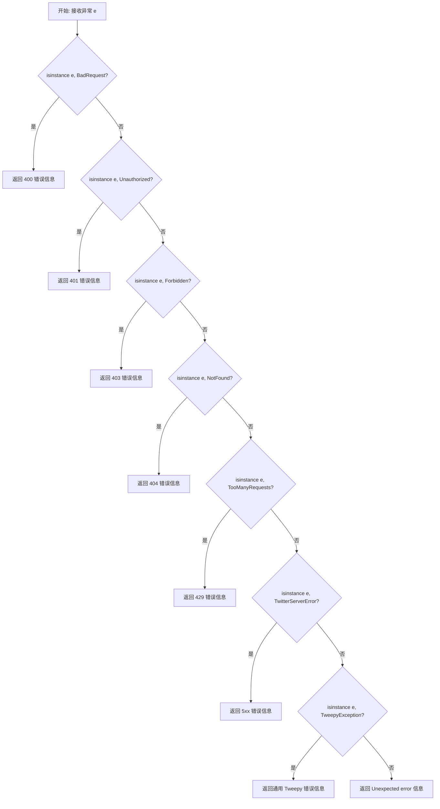
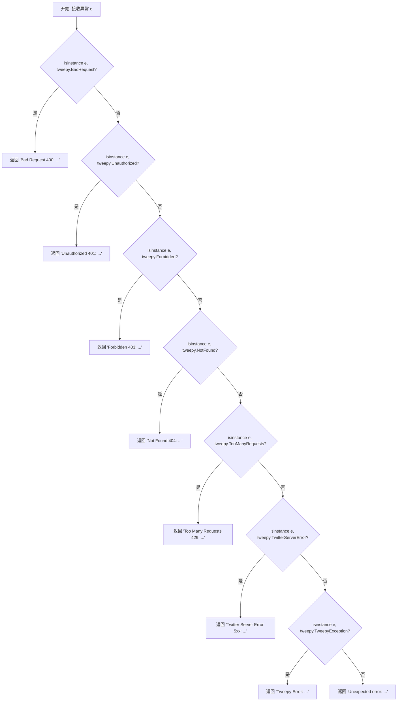

# `AutoGPT\autogpt_platform\backend\backend\blocks\twitter\tweepy_exceptions.py` 详细设计文档

该代码定义了一个全局函数 `handle_tweepy_exception`，专门用于捕获和处理 Tweepy 库抛出的各类 HTTP 异常，将具体的异常类型（如 400, 401, 403, 404, 429, 5xx 等）转换为易于理解的字符串描述信息，以便于日志记录或向用户反馈。

## 整体流程



## 类结构

```
<无类定义 (仅包含全局函数)>
```

## 全局变量及字段


    

## 全局函数及方法


### `handle_tweepy_exception`

该函数用于捕获并处理 `tweepy` 库抛出的各类异常（以及其它通用异常），将其转换为包含对应 HTTP 状态码含义的可读字符串，以便于日志记录或向用户展示。

参数：

-  `e`：`Exception`，需要被处理和转换的异常对象。

返回值：`str`，包含错误类型、HTTP 状态码及原始错误信息的格式化字符串。

#### 流程图



#### 带注释源码

```python
import tweepy


def handle_tweepy_exception(e: Exception) -> str:
    # 检查是否为 400 错误（请求语法错误或无法满足）
    if isinstance(e, tweepy.BadRequest):
        return f"Bad Request (400): {str(e)}"
    # 检查是否为 401 错误（认证失败或无效令牌）
    elif isinstance(e, tweepy.Unauthorized):
        return f"Unauthorized (401): {str(e)}"
    # 检查是否为 403 错误（服务器理解请求但拒绝执行）
    elif isinstance(e, tweepy.Forbidden):
        return f"Forbidden (403): {str(e)}"
    # 检查是否为 404 错误（资源未找到）
    elif isinstance(e, tweepy.NotFound):
        return f"Not Found (404): {str(e)}"
    # 检查是否为 429 错误（请求过多，触发速率限制）
    elif isinstance(e, tweepy.TooManyRequests):
        return f"Too Many Requests (429): {str(e)}"
    # 检查是否为 5xx 错误（Twitter 服务器内部错误）
    elif isinstance(e, tweepy.TwitterServerError):
        return f"Twitter Server Error (5xx): {str(e)}"
    # 检查是否为其它通用的 Tweepy 异常
    elif isinstance(e, tweepy.TweepyException):
        return f"Tweepy Error: {str(e)}"
    # 处理非 Tweepy 类型的未知异常
    else:
        return f"Unexpected error: {str(e)}"
```


## 关键组件


### Tweepy 异常捕获与分类逻辑

负责接收 Exception 对象，并通过 isinstance 检查将其识别为特定的 Tweepy 异常子类的核心逻辑单元。

### HTTP 状态码映射转换

将特定的 Tweepy 异常类型（如 BadRequest、Unauthorized）映射并转换为对应的 HTTP 状态码（如 400、401）及描述信息的机制。

### 兜底错误响应生成

当捕获到通用的 TweepyException 或非预期的异常类型时，提供默认错误信息以防止程序崩溃的安全机制。


## 问题及建议


### 已知问题

-   使用长链的 `if-elif` 结构进行类型匹配，代码冗余且可读性较差，随着异常类型增加，维护难度会线性增加。
-   HTTP 状态码（如 400, 401）和错误提示文案硬编码在函数逻辑中，不利于后续的文案修改或国际化（i18n）支持。
-   函数仅返回格式化后的字符串，丢失了原始异常对象及结构化信息（如错误分类码），调用方若需针对特定错误（如 429 触发重试）进行编程处理，需要额外解析字符串，不够健壮。
-   函数内部缺乏日志记录机制，仅依靠返回值传递错误，若调用方忽略返回值，可能导致异常上下文信息完全丢失。

### 优化建议

-   使用字典映射（将异常类映射到状态码和消息模板）重构判断逻辑，或利用 Python 3.10+ 的 `match-case` 结构模式匹配，以提升代码简洁度和查找效率。
-   将返回值类型由简单的 `str` 替换为结构化对象（如 `DataClass`、`NamedTuple` 或 `dict`），包含 `code`（状态码）、`message`（描述）、`original_exception`（原始异常）等字段，便于上层逻辑进行精确控制。
-   引入日志模块（如 `logging`），在捕获异常时记录详细的堆栈信息（Traceback），确保错误信息的可追踪性，同时对外返回用户友好的提示。
-   将错误码和消息模板提取为模块级别的常量或配置文件，解耦业务逻辑与文案展示，提升可维护性。


## 其它


### 设计目标与约束

**设计目标**：
1. **标准化错误输出**：将底层 `tweepy` 库抛出的各种异常类型转换为统一、用户可读的字符串格式，便于上层应用（如日志系统、UI显示）处理。
2. **信息完整性**：在转换错误时，确保保留原始异常的错误详情，以便开发人员进行调试和根因分析。
3. **错误分类明确**：将 Twitter API 的不同 HTTP 状态码（400, 401, 403, 404, 429, 5xx）映射到具体的业务场景描述中。

**约束条件**：
1. **强外部依赖**：代码强依赖于 `tweepy` 库的内部异常类定义。如果 `tweepy` 库发生重大版本更新并修改了异常类结构，本模块需要同步维护。
2. **输入范围**：虽然函数接受任意 `Exception` 类型，但最佳实践是仅在处理 Twitter API 相关请求时调用此函数。
3. **无状态性**：函数设计为无状态纯函数，不依赖外部上下文，不涉及 I/O 操作，确保在并发环境下的线程安全性。

### 外部依赖与接口契约

**外部依赖**：
1. **tweepy**：Python 第三方库，用于访问 Twitter API。代码依赖其提供的 `BadRequest`, `Unauthorized`, `Forbidden`, `NotFound`, `TooManyRequests`, `TwitterServerError`, `TweepyException` 等异常类。

**接口契约**：
1. **函数签名**：`def handle_tweepy_exception(e: Exception) -> str`
2. **输入参数契约**：
   - 参数 `e`：必须是一个 `Exception` 的实例。传入 `None` 或非 Exception 对象会导致代码运行时错误。
3. **输出返回契约**：
   - 返回值类型：`str`。
   - 返回格式：遵循 `{Status Description} (Code): {Original Error Message}` 的格式。
   - 异常安全性：本函数本身不抛出任何异常，始终保证返回一个字符串。
4. **副作用**：本函数无副作用，不修改输入对象 `e` 的状态，不写入文件或数据库，不打印日志。

### 错误处理与异常设计策略

**设计策略**：
本模块采用**异常转换模式**，而非传统的异常捕获与恢复模式。

1. **类型识别映射**：利用 Python 的 `isinstance` 机制，将宽泛的异常捕获转化为具体的类型判断。这种策略比单纯解析错误消息字符串更健壮，因为它依赖于对象类型而非文本内容。
2. **降级兜底机制**：`else` 分支提供了一个安全网。对于非预期的异常类型（例如 `tweepy` 库新增了异常类但代码未及时更新），函数会返回 "Unexpected error"，防止程序因未知异常处理逻辑缺失而崩溃。
3. **静默处理原则**：该函数负责“翻译”错误，而非“吞没”或“抛出”错误。调用者需根据返回的字符串内容决定后续逻辑（如重试、记录日志或通知用户）。

### 数据流与状态机

**数据流**：
由于该模块是无状态的纯函数，不存在复杂的状态机转换。其数据流转过程如下：
1. **输入节点**：异常对象 `e` 进入函数。
2. **分支判断节点**：数据流进入一系列串行的 `if-elif` 判断节点。每个节点检查对象是否属于特定的 `tweepy` 异常类型。
3. **格式化节点**：
   - 若匹配成功：提取对应的 HTTP 状态码描述和原始异常信息 `str(e)`，进行字符串拼接。
   - 若全不匹配：进入默认分支，提取原始异常信息并标记为 "Unexpected error"。
4. **输出节点**：返回最终的格式化字符串，数据流结束。

**状态说明**：
- 函数内部无持久化状态。
- 每次调用都是独立的，不存在前次调用对后次调用的影响。

    