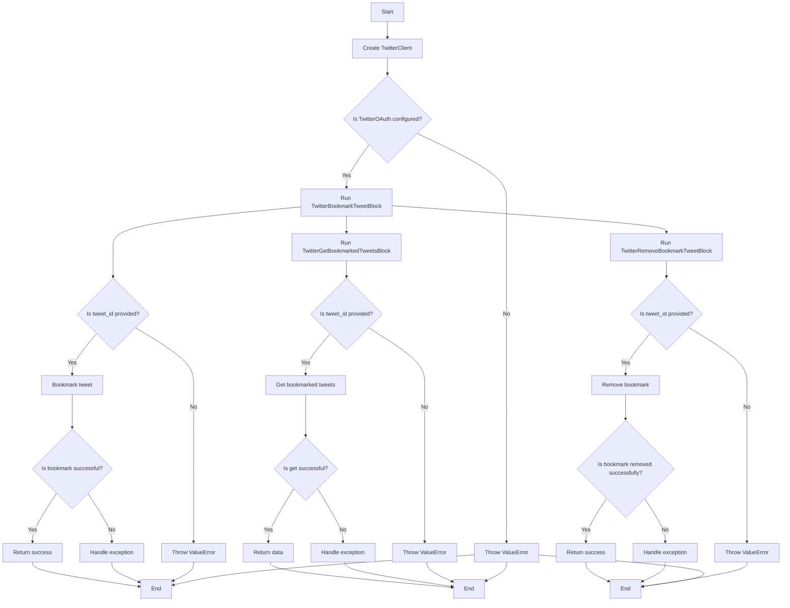
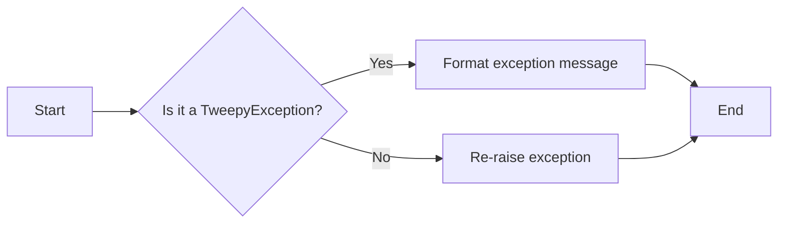
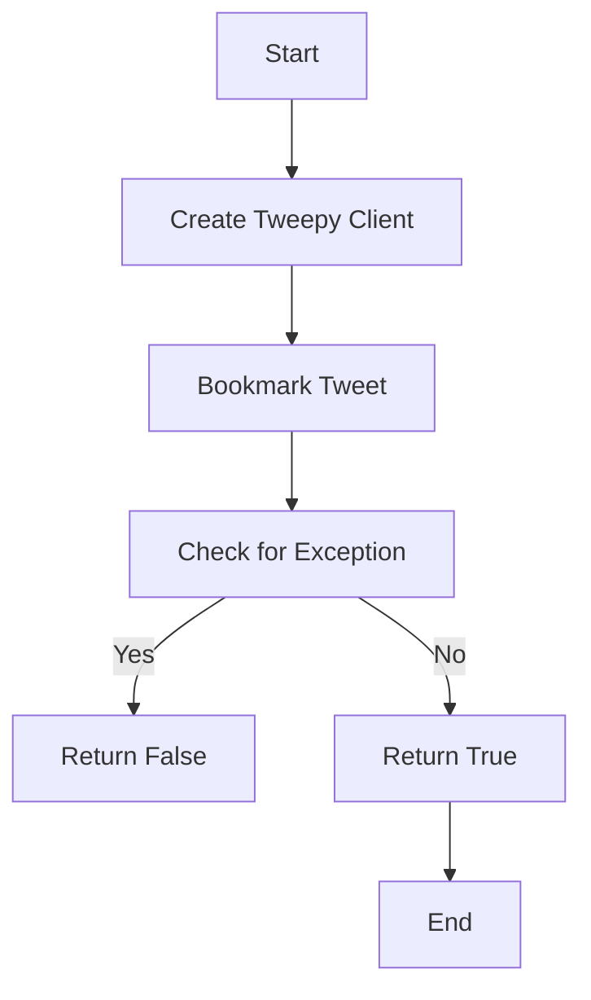
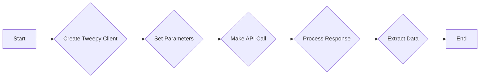
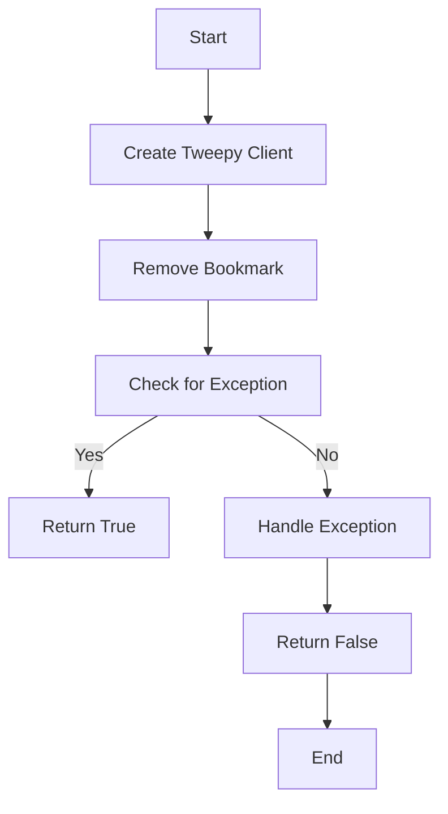
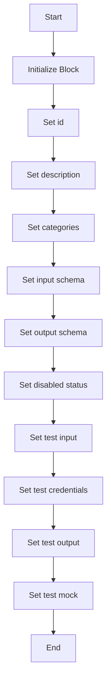
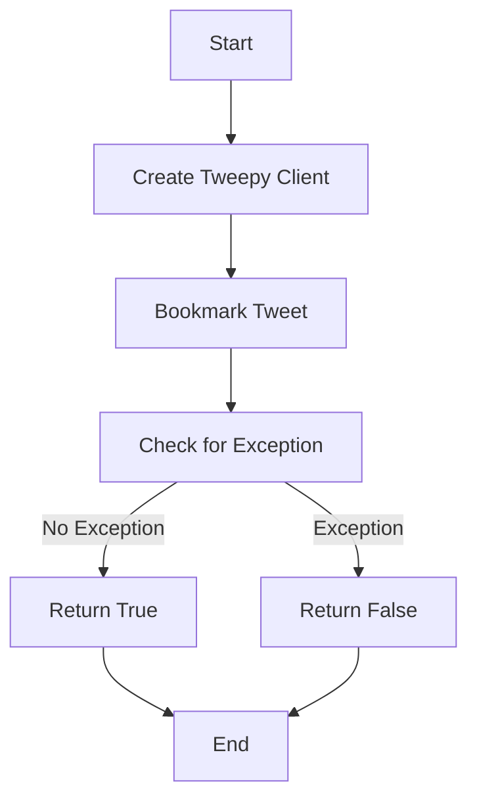
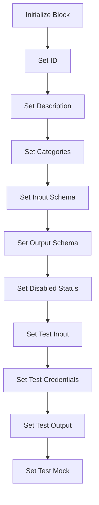
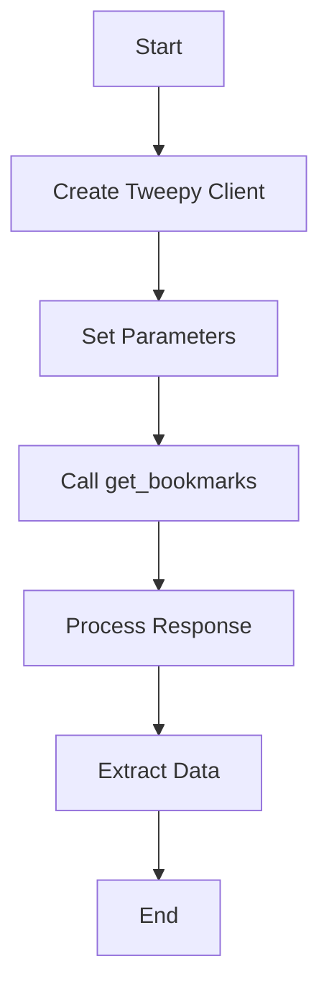
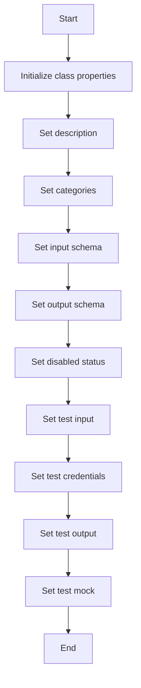

# `.\AutoGPT\autogpt_platform\backend\backend\blocks\twitter\tweets\bookmark.py` 详细设计文档

This file contains classes for interacting with Twitter API to bookmark, get, and remove bookmarked tweets.

## 整体流程



## 类结构

```
TwitterBookmarkTweetBlock (Block)
├── Input (BlockSchemaInput)
│   ├── credentials (TwitterCredentialsInput)
│   └── tweet_id (str)
└── Output (BlockSchemaOutput)
    └── success (bool)
TwitterGetBookmarkedTweetsBlock (Block)
├── Input (TweetExpansionInputs)
│   ├── credentials (TwitterCredentialsInput)
│   ├── max_results (int | None)
│   └── pagination_token (str | None)
└── Output (BlockSchemaOutput)
    ├── id (list[str])
    ├── text (list[str])
    ├── userId (list[str])
    └── userName (list[str])
TwitterRemoveBookmarkTweetBlock (Block)
├── Input (BlockSchemaInput)
│   ├── credentials (TwitterCredentialsInput)
│   └── tweet_id (str)
└── Output (BlockSchemaOutput)
    ├── success (bool)
    └── error (str)
```

## 全局变量及字段


### `TEST_CREDENTIALS`
    
Test credentials for Twitter API access

类型：`TwitterCredentials`
    


### `TEST_CREDENTIALS_INPUT`
    
Test input for Twitter credentials

类型：`TwitterCredentialsInput`
    


### `TWITTER_OAUTH_IS_CONFIGURED`
    
Flag indicating if Twitter OAuth is configured

类型：`bool`
    


### `TwitterBookmarkTweetBlock.id`
    
Unique identifier for the block

类型：`str`
    


### `TwitterBookmarkTweetBlock.description`
    
Description of the block's functionality

类型：`str`
    


### `TwitterBookmarkTweetBlock.categories`
    
Categories to which the block belongs

类型：`set[BlockCategory]`
    


### `TwitterBookmarkTweetBlock.input_schema`
    
Input schema for the block

类型：`Input`
    


### `TwitterBookmarkTweetBlock.output_schema`
    
Output schema for the block

类型：`Output`
    


### `TwitterBookmarkTweetBlock.disabled`
    
Flag indicating if the block is disabled

类型：`bool`
    


### `TwitterBookmarkTweetBlock.test_input`
    
Test input data for the block

类型：`dict`
    


### `TwitterBookmarkTweetBlock.test_credentials`
    
Test credentials for the block

类型：`TwitterCredentials`
    


### `TwitterBookmarkTweetBlock.test_output`
    
Test output data for the block

类型：`list[tuple]`
    


### `TwitterBookmarkTweetBlock.test_mock`
    
Test mock data for the block

类型：`dict`
    


### `TwitterGetBookmarkedTweetsBlock.id`
    
Unique identifier for the block

类型：`str`
    


### `TwitterGetBookmarkedTweetsBlock.description`
    
Description of the block's functionality

类型：`str`
    


### `TwitterGetBookmarkedTweetsBlock.categories`
    
Categories to which the block belongs

类型：`set[BlockCategory]`
    


### `TwitterGetBookmarkedTweetsBlock.input_schema`
    
Input schema for the block

类型：`TweetExpansionInputs`
    


### `TwitterGetBookmarkedTweetsBlock.output_schema`
    
Output schema for the block

类型：`Output`
    


### `TwitterGetBookmarkedTweetsBlock.disabled`
    
Flag indicating if the block is disabled

类型：`bool`
    


### `TwitterGetBookmarkedTweetsBlock.test_input`
    
Test input data for the block

类型：`dict`
    


### `TwitterGetBookmarkedTweetsBlock.test_credentials`
    
Test credentials for the block

类型：`TwitterCredentials`
    


### `TwitterGetBookmarkedTweetsBlock.test_output`
    
Test output data for the block

类型：`list[tuple]`
    


### `TwitterGetBookmarkedTweetsBlock.test_mock`
    
Test mock data for the block

类型：`dict`
    


### `TwitterRemoveBookmarkTweetBlock.id`
    
Unique identifier for the block

类型：`str`
    


### `TwitterRemoveBookmarkTweetBlock.description`
    
Description of the block's functionality

类型：`str`
    


### `TwitterRemoveBookmarkTweetBlock.categories`
    
Categories to which the block belongs

类型：`set[BlockCategory]`
    


### `TwitterRemoveBookmarkTweetBlock.input_schema`
    
Input schema for the block

类型：`BlockSchemaInput`
    


### `TwitterRemoveBookmarkTweetBlock.output_schema`
    
Output schema for the block

类型：`BlockSchemaOutput`
    


### `TwitterRemoveBookmarkTweetBlock.disabled`
    
Flag indicating if the block is disabled

类型：`bool`
    


### `TwitterRemoveBookmarkTweetBlock.test_input`
    
Test input data for the block

类型：`dict`
    


### `TwitterRemoveBookmarkTweetBlock.test_credentials`
    
Test credentials for the block

类型：`TwitterCredentials`
    


### `TwitterRemoveBookmarkTweetBlock.test_output`
    
Test output data for the block

类型：`list[tuple]`
    


### `TwitterRemoveBookmarkTweetBlock.test_mock`
    
Test mock data for the block

类型：`dict`
    
    

## 全局函数及方法


### `handle_tweepy_exception`

This function handles exceptions raised by the Tweepy library, providing a standardized way to handle these exceptions.

参数：

- `e`：`Exception`，The exception object that was raised.

返回值：`str`，A string describing the exception.

#### 流程图



#### 带注释源码

```python
def handle_tweepy_exception(e: Exception) -> str:
    """
    Handles exceptions raised by the Tweepy library, providing a standardized way to handle these exceptions.

    :param e: The exception object that was raised.
    :return: A string describing the exception.
    """
    if isinstance(e, tweepy.TweepyException):
        return f"An error occurred with Tweepy: {e}"
    else:
        raise e
``` 


### TwitterBookmarkTweetBlock.bookmark_tweet

This method bookmarks a tweet on Twitter using the provided credentials.

参数：

- `credentials`：`TwitterCredentials`，Twitter credentials object containing access token.
- `tweet_id`：`str`，ID of the tweet to bookmark.

返回值：`bool`，Whether the bookmark was successful.

#### 流程图



#### 带注释源码

```python
@staticmethod
def bookmark_tweet(
    credentials: TwitterCredentials,
    tweet_id: str,
):
    try:
        client = tweepy.Client(
            bearer_token=credentials.access_token.get_secret_value()
        )

        client.bookmark(tweet_id)

        return True

    except tweepy.TweepyException:
        raise
```


### TwitterGetBookmarkedTweetsBlock.get_bookmarked_tweets

Retrieve all your bookmarked tweets from Twitter.

参数：

- `credentials`：`TwitterCredentials`，Twitter credentials object containing access token.
- `max_results`：`int | None`，Maximum number of results to return (1-100).
- `pagination_token`：`str | None`，Token for pagination.
- `expansions`：`ExpansionFilter | None`，Expansions to include in the response.
- `media_fields`：`TweetMediaFieldsFilter | None`，Media fields to include in the response.
- `place_fields`：`TweetPlaceFieldsFilter | None`，Place fields to include in the response.
- `poll_fields`：`TweetPollFieldsFilter | None`，Poll fields to include in the response.
- `tweet_fields`：`TweetFieldsFilter | None`，Tweet fields to include in the response.
- `user_fields`：`TweetUserFieldsFilter | None`，User fields to include in the response.

返回值：`tuple`，Returns a tuple containing the following elements:
- `tweet_ids`：`list[str]`，List of tweet IDs.
- `tweet_texts`：`list[str]`，List of tweet texts.
- `user_ids`：`list[str]`，List of user IDs.
- `user_names`：`list[str]`，List of user names.
- `data`：`list[dict]`，Complete tweet data.
- `included`：`dict`，Additional data that you have requested via Expansions field.
- `meta`：`dict`，Metadata such as pagination info or result counts.
- `next_token`：`str`，Next token for pagination.

#### 流程图



#### 带注释源码

```python
@staticmethod
def get_bookmarked_tweets(
    credentials: TwitterCredentials,
    max_results: int | None,
    pagination_token: str | None,
    expansions: ExpansionFilter | None,
    media_fields: TweetMediaFieldsFilter | None,
    place_fields: TweetPlaceFieldsFilter | None,
    poll_fields: TweetPollFieldsFilter | None,
    tweet_fields: TweetFieldsFilter | None,
    user_fields: TweetUserFieldsFilter | None,
):
    try:
        client = tweepy.Client(
            bearer_token=credentials.access_token.get_secret_value()
        )

        params = {
            "max_results": max_results,
            "pagination_token": (
                None if pagination_token == "" else pagination_token
            ),
        }

        params = (
            TweetExpansionsBuilder(params)
            .add_expansions(expansions)
            .add_media_fields(media_fields)
            .add_place_fields(place_fields)
            .add_poll_fields(poll_fields)
            .add_tweet_fields(tweet_fields)
            .add_user_fields(user_fields)
            .build()
        )

        response = cast(
            Response,
            client.get_bookmarks(**params),
        )

        meta = {}
        tweet_ids = []
        tweet_texts = []
        user_ids = []
        user_names = []
        next_token = None

        if response.meta:
            meta = response.meta
            next_token = meta.get("next_token")

        included = IncludesSerializer.serialize(response.includes)
        data = ResponseDataSerializer.serialize_list(response.data)

        if response.data:
            tweet_ids = [str(tweet.id) for tweet in response.data]
            tweet_texts = [tweet.text for tweet in response.data]

            if "users" in included:
                for user in included["users"]:
                    user_ids.append(str(user["id"]))
                    user_names.append(user["username"])

            return (
                tweet_ids,
                tweet_texts,
                user_ids,
                user_names,
                data,
                included,
                meta,
                next_token,
            )

        raise Exception("No bookmarked tweets found")

    except tweepy.TweepyException:
        raise
``` 


### TwitterRemoveBookmarkTweetBlock.remove_bookmark_tweet

Removes a bookmark from a tweet on Twitter.

参数：

- `credentials`：`TwitterCredentials`，Twitter credentials object containing access token and secret.
- `tweet_id`：`str`，ID of the tweet to remove bookmark from.

返回值：`bool`，Whether the bookmark was successfully removed.

#### 流程图



#### 带注释源码

```python
def remove_bookmark_tweet(
    credentials: TwitterCredentials,
    tweet_id: str,
):
    try:
        client = tweepy.Client(
            bearer_token=credentials.access_token.get_secret_value()
        )

        client.remove_bookmark(tweet_id)

        return True

    except tweepy.TweepyException:
        raise
```


### TwitterBookmarkTweetBlock.__init__

This method initializes the `TwitterBookmarkTweetBlock` class, setting up its properties and configurations.

参数：

- `id`: `str`，The unique identifier for the block.
- `description`: `str`，A description of the block's functionality.
- `categories`: `set`，A set of categories that the block belongs to.
- `input_schema`: `BlockSchemaInput`，The schema for the input data of the block.
- `output_schema`: `BlockSchemaOutput`，The schema for the output data of the block.
- `disabled`: `bool`，Whether the block is disabled or not.
- `test_input`: `dict`，The test input data for the block.
- `test_credentials`: `TwitterCredentials`，The test credentials for the block.
- `test_output`: `list`，The expected test output data for the block.
- `test_mock`: `dict`，Mock functions for testing the block.

返回值：`None`，This method does not return any value.

#### 流程图



#### 带注释源码

```python
def __init__(self):
    super().__init__(
        id="f33d67be-a62f-11ef-a797-ff83ec29ee8e",
        description="This block bookmarks a tweet on Twitter.",
        categories={BlockCategory.SOCIAL},
        input_schema=TwitterBookmarkTweetBlock.Input,
        output_schema=TwitterBookmarkTweetBlock.Output,
        disabled=not TWITTER_OAUTH_IS_CONFIGURED,
        test_input={
            "tweet_id": "1234567890",
            "credentials": TEST_CREDENTIALS_INPUT,
        },
        test_credentials=TEST_CREDENTIALS,
        test_output=[
            ("success", True),
        ],
        test_mock={"bookmark_tweet": lambda *args, **kwargs: True},
    )
```


### TwitterBookmarkTweetBlock.bookmark_tweet

Bookmarks a tweet on Twitter using the provided credentials.

参数：

- `credentials`：`TwitterCredentials`，Twitter credentials object containing access token.
- `tweet_id`：`str`，ID of the tweet to bookmark.

返回值：`bool`，True if the bookmark was successful, False otherwise.

#### 流程图



#### 带注释源码

```python
@staticmethod
def bookmark_tweet(
    credentials: TwitterCredentials,
    tweet_id: str,
):
    try:
        client = tweepy.Client(
            bearer_token=credentials.access_token.get_secret_value()
        )

        client.bookmark(tweet_id)

        return True

    except tweepy.TweepyException:
        raise
```


### TwitterGetBookmarkedTweetsBlock.__init__

This method initializes the `TwitterGetBookmarkedTweetsBlock` class, setting up its configuration and schema for retrieving bookmarked tweets from Twitter.

参数：

- `id`：`str`，The unique identifier for the block.
- `description`：`str`，A description of the block's functionality.
- `categories`：`set`，A set of categories that the block belongs to.
- `input_schema`：`Input`，The schema for the block's input data.
- `output_schema`：`Output`，The schema for the block's output data.
- `disabled`：`bool`，Whether the block is disabled or not.
- `test_input`：`dict`，The test input data for the block.
- `test_credentials`：`TwitterCredentials`，The test credentials for the block.
- `test_output`：`list`，The expected test output data for the block.
- `test_mock`：`dict`，Mock functions for testing the block.

返回值：无

#### 流程图



#### 带注释源码

```python
def __init__(self):
    super().__init__(
        id="ed26783e-a62f-11ef-9a21-c77c57dd8a1f",
        description="This block retrieves bookmarked tweets from Twitter.",
        categories={BlockCategory.SOCIAL},
        input_schema=TwitterGetBookmarkedTweetsBlock.Input,
        output_schema=TwitterGetBookmarkedTweetsBlock.Output,
        disabled=not TWITTER_OAUTH_IS_CONFIGURED,
        test_input={
            "max_results": 2,
            "pagination_token": None,
            "expansions": None,
            "media_fields": None,
            "place_fields": None,
            "poll_fields": None,
            "tweet_fields": None,
            "user_fields": None,
            "credentials": TEST_CREDENTIALS_INPUT,
        },
        test_credentials=TEST_CREDENTIALS,
        test_output=[
            ("id", ["1234567890"]),
            ("text", ["Test tweet"]),
            ("userId", ["12345"]),
            ("userName", ["testuser"]),
            ("data", [{"id": "1234567890", "text": "Test tweet"}]),
        ],
        test_mock={
            "get_bookmarked_tweets": lambda *args, **kwargs: (
                ["1234567890"],
                ["Test tweet"],
                ["12345"],
                ["testuser"],
                [{"id": "1234567890", "text": "Test tweet"}],
                {},
                {},
                None,
            )
        },
    )
```


### TwitterGetBookmarkedTweetsBlock.get_bookmarked_tweets

Retrieve all bookmarked tweets from Twitter.

参数：

- `credentials`：`TwitterCredentials`，Twitter credentials object containing access token.
- `max_results`：`int | None`，Maximum number of results to return (1-100).
- `pagination_token`：`str | None`，Token for pagination.
- `expansions`：`ExpansionFilter | None`，Expansions to include in the response.
- `media_fields`：`TweetMediaFieldsFilter | None`，Media fields to include in the response.
- `place_fields`：`TweetPlaceFieldsFilter | None`，Place fields to include in the response.
- `poll_fields`：`TweetPollFieldsFilter | None`，Poll fields to include in the response.
- `tweet_fields`：`TweetFieldsFilter | None`，Tweet fields to include in the response.
- `user_fields`：`TweetUserFieldsFilter | None`，User fields to include in the response.

返回值：`(list[str], list[str], list[str], list[str], list[dict], dict, dict, str)`，A tuple containing tweet IDs, tweet texts, user IDs, user names, complete tweet data, included data, metadata, and next token for pagination.

#### 流程图



#### 带注释源码

```python
def get_bookmarked_tweets(
    credentials: TwitterCredentials,
    max_results: int | None,
    pagination_token: str | None,
    expansions: ExpansionFilter | None,
    media_fields: TweetMediaFieldsFilter | None,
    place_fields: TweetPlaceFieldsFilter | None,
    poll_fields: TweetPollFieldsFilter | None,
    tweet_fields: TweetFieldsFilter | None,
    user_fields: TweetUserFieldsFilter | None,
):
    try:
        client = tweepy.Client(
            bearer_token=credentials.access_token.get_secret_value()
        )

        params = {
            "max_results": max_results,
            "pagination_token": (
                None if pagination_token == "" else pagination_token
            ),
        }

        params = (
            TweetExpansionsBuilder(params)
            .add_expansions(expansions)
            .add_media_fields(media_fields)
            .add_place_fields(place_fields)
            .add_poll_fields(poll_fields)
            .add_tweet_fields(tweet_fields)
            .add_user_fields(user_fields)
            .build()
        )

        response = cast(
            Response,
            client.get_bookmarks(**params),
        )

        meta = {}
        tweet_ids = []
        tweet_texts = []
        user_ids = []
        user_names = []
        next_token = None

        if response.meta:
            meta = response.meta
            next_token = meta.get("next_token")

        included = IncludesSerializer.serialize(response.includes)
        data = ResponseDataSerializer.serialize_list(response.data)

        if response.data:
            tweet_ids = [str(tweet.id) for tweet in response.data]
            tweet_texts = [tweet.text for tweet in response.data]

            if "users" in included:
                for user in included["users"]:
                    user_ids.append(str(user["id"]))
                    user_names.append(user["username"])

            return (
                tweet_ids,
                tweet_texts,
                user_ids,
                user_names,
                data,
                included,
                meta,
                next_token,
            )

        raise Exception("No bookmarked tweets found")

    except tweepy.TweepyException:
        raise
``` 


### TwitterRemoveBookmarkTweetBlock.__init__

This method initializes the `TwitterRemoveBookmarkTweetBlock` class, setting up its properties and configurations.

参数：

- `self`：`TwitterRemoveBookmarkTweetBlock` 类的实例

返回值：无

#### 流程图



#### 带注释源码

```python
def __init__(self):
    super().__init__(
        id="e4100684-a62f-11ef-9be9-770cb41a2616",
        description="This block removes a bookmark from a tweet on Twitter.",
        categories={BlockCategory.SOCIAL},
        input_schema=TwitterRemoveBookmarkTweetBlock.Input,
        output_schema=TwitterRemoveBookmarkTweetBlock.Output,
        disabled=not TWITTER_OAUTH_IS_CONFIGURED,
        test_input={
            "tweet_id": "1234567890",
            "credentials": TEST_CREDENTIALS_INPUT,
        },
        test_credentials=TEST_CREDENTIALS,
        test_output=[
            ("success", True),
        ],
        test_mock={"remove_bookmark_tweet": lambda *args, **kwargs: True},
    )
```


### TwitterRemoveBookmarkTweetBlock.run

This method removes a bookmark from a tweet on Twitter.

参数：

- `input_data`：`Input`，The input data for the block, containing the tweet ID and credentials.
- `credentials`：`TwitterCredentials`，The credentials required to authenticate with Twitter.

返回值：`BlockOutput`，The output of the block, indicating whether the bookmark was successfully removed.

#### 流程图

```mermaid
graph TD
    A[Start] --> B[Initialize tweepy.Client with credentials]
    B --> C[Call client.remove_bookmark(tweet_id)]
    C -->|Success| D[Return True]
    C -->|Exception| E[Handle TweepyException]
    E --> F[Return False]
    F --> G[End]
```

#### 带注释源码

```python
async def run(
    self,
    input_data: Input,
    *,
    credentials: TwitterCredentials,
    **kwargs,
) -> BlockOutput:
    try:
        success = self.remove_bookmark_tweet(credentials, input_data.tweet_id)
        yield "success", success
    except Exception as e:
        yield "error", handle_tweepy_exception(e)
``` 


## 关键组件


### 张量索引与惰性加载

张量索引与惰性加载是代码中处理数据的一种方式，它允许在需要时才加载和索引数据，从而提高性能和减少内存消耗。

### 反量化支持

反量化支持是代码中实现的一种功能，它允许对量化后的数据进行反量化处理，以便恢复原始数据。

### 量化策略

量化策略是代码中用于优化数据表示和存储的一种方法，它通过减少数据精度来减少内存占用，同时保持足够的精度以避免信息损失。


## 问题及建议


### 已知问题

-   **全局变量配置**：全局变量 `TWITTER_OAUTH_IS_CONFIGURED` 用于控制块的启用状态，但该变量的配置方式未在代码中明确展示。如果配置不正确，可能导致块无法正常工作。
-   **异常处理**：代码中使用了 `handle_tweepy_exception` 函数来处理 `tweepy.TweepyException`，但未处理其他可能的异常。这可能导致未预期的错误信息或行为。
-   **代码重复**：`TwitterBookmarkTweetBlock` 和 `TwitterRemoveBookmarkTweetBlock` 类中的 `remove_bookmark_tweet` 和 `bookmark_tweet` 方法存在大量重复代码。可以考虑提取公共逻辑以减少代码重复。
-   **测试覆盖率**：代码中包含了一些测试用例，但可能没有覆盖所有边缘情况和异常情况。建议增加测试用例以确保代码的健壮性。

### 优化建议

-   **全局变量配置**：在代码中明确展示全局变量 `TWITTER_OAUTH_IS_CONFIGURED` 的配置方式，确保其正确性。
-   **异常处理**：增加对其他可能异常的处理，例如网络问题、认证问题等，并确保错误信息对用户友好。
-   **代码重构**：提取 `TwitterBookmarkTweetBlock` 和 `TwitterRemoveBookmarkTweetBlock` 类中的公共逻辑到一个单独的函数或类中，以减少代码重复并提高可维护性。
-   **测试覆盖率**：增加测试用例，特别是针对边缘情况和异常情况，以确保代码在各种情况下都能正常工作。
-   **代码注释**：增加必要的代码注释，以提高代码的可读性和可维护性。
-   **性能优化**：考虑对代码进行性能优化，例如减少不必要的网络请求、优化数据处理逻辑等。


## 其它


### 设计目标与约束

- 设计目标：
  - 实现Twitter相关操作的自动化处理，包括书签、获取书签和移除书签。
  - 提供一个用户友好的接口，方便用户进行Twitter相关操作。
  - 确保代码的健壮性和错误处理能力，以应对可能的异常情况。

- 约束条件：
  - 必须使用Twitter API进行操作。
  - 需要处理OAuth认证和授权。
  - 代码应遵循Python 3.x的语法和规范。

### 错误处理与异常设计

- 错误处理：
  - 使用`try-except`块捕获和处理可能的异常。
  - 使用`tweepy.TweepyException`捕获Twitter API相关的异常。
  - 使用自定义的异常处理函数`handle_tweepy_exception`来处理和格式化异常信息。

### 数据流与状态机

- 数据流：
  - 输入数据通过`Input`类字段传递给相应的处理函数。
  - 处理函数执行操作并返回结果或异常。
  - 输出结果通过`BlockOutput`类字段返回给用户。

- 状态机：
  - 每个块（如`TwitterBookmarkTweetBlock`）有自己的状态和生命周期。
  - 状态包括初始化、运行、完成和异常。

### 外部依赖与接口契约

- 外部依赖：
  - `tweepy`库用于与Twitter API交互。
  - `backend`模块包含通用的数据结构和功能。

- 接口契约：
  - `Block`类定义了块的接口，包括输入、输出和运行方法。
  - `TwitterCredentials`类定义了Twitter认证信息。
  - `TweetExpansionsBuilder`类用于构建Twitter API请求的参数。


    