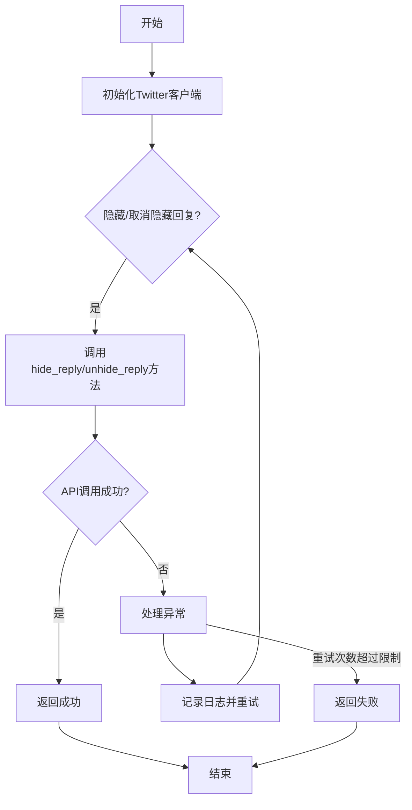
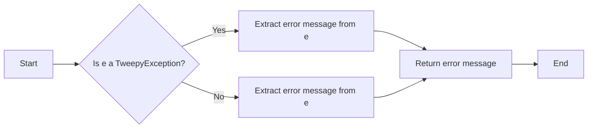
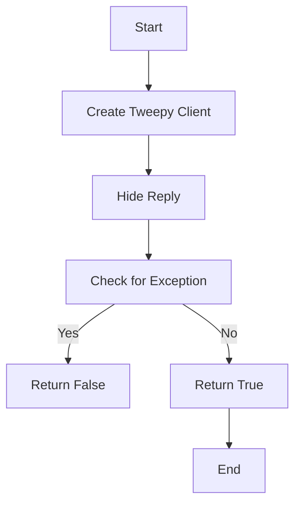
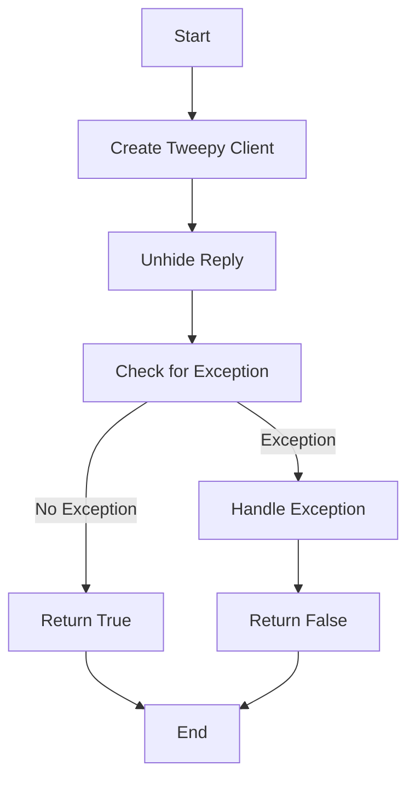
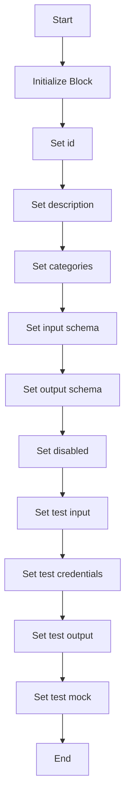
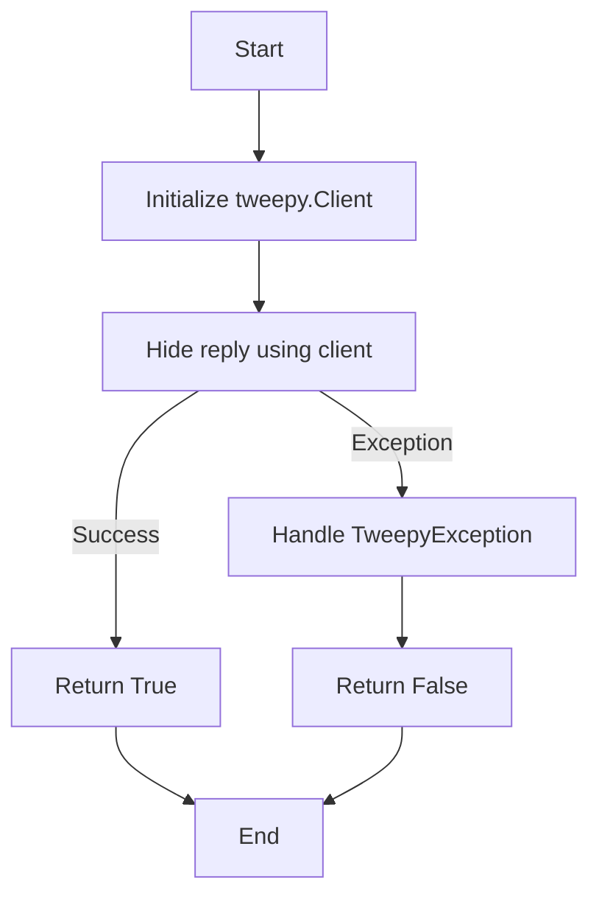
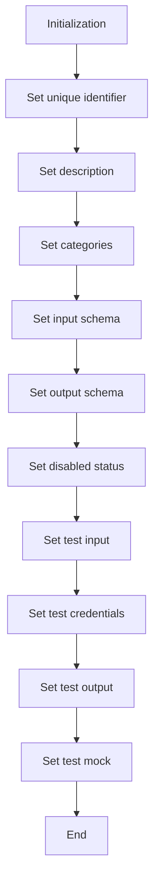
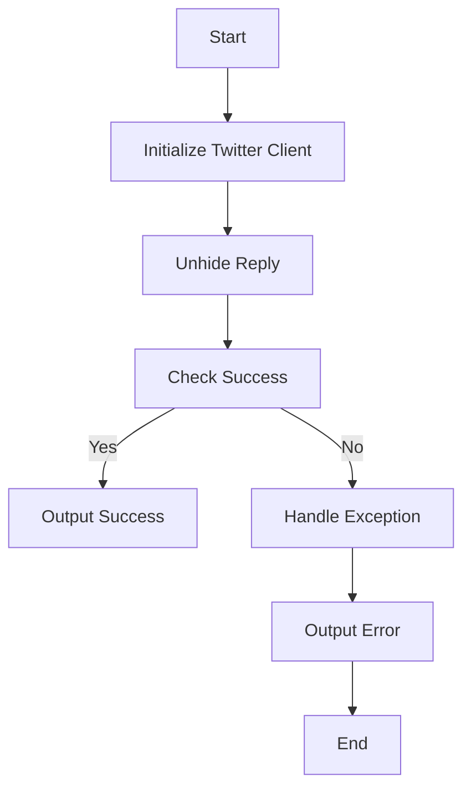

# `.\AutoGPT\autogpt_platform\backend\backend\blocks\twitter\tweets\hide.py` 详细设计文档

This code defines two Twitter-related blocks: TwitterHideReplyBlock and TwitterUnhideReplyBlock, which are used to hide and unhide replies to tweets, respectively. These blocks interact with the Twitter API using the tweepy library.

## 整体流程



## 类结构

```
TwitterHideReplyBlock (Twitter相关块)
├── Input (输入)
│   ├── credentials (TwitterCredentialsInput)
│   └── tweet_id (str)
└── Output (输出)
    └── success (bool)
TwitterUnhideReplyBlock (Twitter相关块)
├── Input (输入)
│   ├── credentials (TwitterCredentialsInput)
│   └── tweet_id (str)
└── Output (输出)
    └── success (bool)
```

## 全局变量及字段


### `TEST_CREDENTIALS`
    
Test credentials for Twitter API access

类型：`TwitterCredentials`
    


### `TEST_CREDENTIALS_INPUT`
    
Test input for Twitter credentials

类型：`TwitterCredentialsInput`
    


### `TWITTER_OAUTH_IS_CONFIGURED`
    
Flag indicating if Twitter OAuth is configured

类型：`bool`
    


### `TwitterHideReplyBlock.id`
    
Unique identifier for the block

类型：`str`
    


### `TwitterHideReplyBlock.description`
    
Description of the block's functionality

类型：`str`
    


### `TwitterHideReplyBlock.categories`
    
Categories to which the block belongs

类型：`set`
    


### `TwitterHideReplyBlock.input_schema`
    
Input schema for the block

类型：`Input`
    


### `TwitterHideReplyBlock.output_schema`
    
Output schema for the block

类型：`Output`
    


### `TwitterHideReplyBlock.disabled`
    
Flag indicating if the block is disabled

类型：`bool`
    


### `TwitterHideReplyBlock.test_input`
    
Test input data for the block

类型：`dict`
    


### `TwitterHideReplyBlock.test_credentials`
    
Test credentials for the block

类型：`TwitterCredentials`
    


### `TwitterHideReplyBlock.test_output`
    
Test output data for the block

类型：`list`
    


### `TwitterHideReplyBlock.test_mock`
    
Mock data for testing the block

类型：`dict`
    


### `TwitterUnhideReplyBlock.id`
    
Unique identifier for the block

类型：`str`
    


### `TwitterUnhideReplyBlock.description`
    
Description of the block's functionality

类型：`str`
    


### `TwitterUnhideReplyBlock.categories`
    
Categories to which the block belongs

类型：`set`
    


### `TwitterUnhideReplyBlock.input_schema`
    
Input schema for the block

类型：`Input`
    


### `TwitterUnhideReplyBlock.output_schema`
    
Output schema for the block

类型：`Output`
    


### `TwitterUnhideReplyBlock.disabled`
    
Flag indicating if the block is disabled

类型：`bool`
    


### `TwitterUnhideReplyBlock.test_input`
    
Test input data for the block

类型：`dict`
    


### `TwitterUnhideReplyBlock.test_credentials`
    
Test credentials for the block

类型：`TwitterCredentials`
    


### `TwitterUnhideReplyBlock.test_output`
    
Test output data for the block

类型：`list`
    


### `TwitterUnhideReplyBlock.test_mock`
    
Mock data for testing the block

类型：`dict`
    
    

## 全局函数及方法


### handle_tweepy_exception

This function handles exceptions raised by the Tweepy library.

参数：

- `e`：`Exception`，The exception to be handled.

返回值：`str`，A human-readable error message.

#### 流程图



#### 带注释源码

```python
def handle_tweepy_exception(e):
    if isinstance(e, tweepy.TweepyException):
        return f"An error occurred with Tweepy: {e}"
    else:
        return f"An unexpected error occurred: {e}"
```


### TwitterHideReplyBlock.hide_reply

Hides a reply to a tweet using the provided Twitter credentials.

参数：

- `credentials`：`TwitterCredentials`，Twitter credentials object containing access token.
- `tweet_id`：`str`，ID of the tweet reply to hide.

返回值：`bool`，Whether the operation was successful.

#### 流程图



#### 带注释源码

```python
@staticmethod
def hide_reply(
    credentials: TwitterCredentials,
    tweet_id: str,
):
    try:
        client = tweepy.Client(
            bearer_token=credentials.access_token.get_secret_value()
        )

        client.hide_reply(id=tweet_id, user_auth=False)

        return True

    except tweepy.TweepyException:
        raise
``` 


### TwitterUnhideReplyBlock.unhide_reply

Unhides a reply to a tweet.

参数：

- `credentials`：`TwitterCredentials`，Twitter credentials object containing access token and secret.
- `tweet_id`：`str`，ID of the tweet reply to unhide.

返回值：`bool`，Whether the operation was successful.

#### 流程图



#### 带注释源码

```python
@staticmethod
    def unhide_reply(
        credentials: TwitterCredentials,
        tweet_id: str,
    ):
        try:
            client = tweepy.Client(
                bearer_token=credentials.access_token.get_secret_value()
            )

            client.unhide_reply(id=tweet_id, user_auth=False)

            return True

        except tweepy.TweepyException:
            raise
``` 


### `TwitterHideReplyBlock.__init__`

This method initializes the `TwitterHideReplyBlock` class, setting up its properties and configurations.

参数：

- `id`: `str`，The unique identifier for the block.
- `description`: `str`，A description of the block's functionality.
- `categories`: `set`，A set of categories that the block belongs to.
- `input_schema`: `Input`，The schema for the input data of the block.
- `output_schema`: `Output`，The schema for the output data of the block.
- `disabled`: `bool`，Whether the block is disabled or not.
- `test_input`: `dict`，The test input data for the block.
- `test_credentials`: `TwitterCredentials`，The test credentials for the block.
- `test_output`: `list`，The expected test output data for the block.
- `test_mock`: `dict`，Mock functions for testing.

返回值：`None`，This method does not return any value.

#### 流程图



#### 带注释源码

```python
def __init__(self):
    super().__init__(
        id="07d58b3e-a630-11ef-a030-93701d1a465e",
        description="This block hides a reply to a tweet.",
        categories={BlockCategory.SOCIAL},
        input_schema=TwitterHideReplyBlock.Input,
        output_schema=TwitterHideReplyBlock.Output,
        disabled=not TWITTER_OAUTH_IS_CONFIGURED,
        test_input={
            "tweet_id": "1234567890",
            "credentials": TEST_CREDENTIALS_INPUT,
        },
        test_credentials=TEST_CREDENTIALS,
        test_output=[
            ("success", True),
        ],
        test_mock={"hide_reply": lambda *args, **kwargs: True},
    )
```


### TwitterHideReplyBlock.run

This method runs the TwitterHideReplyBlock, which is responsible for hiding a reply to a tweet.

参数：

- `input_data`：`Input`，The input data for the block, containing the tweet ID and credentials.
- `credentials`：`TwitterCredentials`，The Twitter credentials required to perform the operation.

返回值：`BlockOutput`，The output of the block, indicating whether the operation was successful.

#### 流程图



#### 带注释源码

```python
async def run(
    self,
    input_data: Input,
    *,
    credentials: TwitterCredentials,
    **kwargs,
) -> BlockOutput:
    try:
        success = self.hide_reply(
            credentials,
            input_data.tweet_id,
        )
        yield "success", success
    except Exception as e:
        yield "error", handle_tweepy_exception(e)
```


### TwitterUnhideReplyBlock.__init__

This method initializes the `TwitterUnhideReplyBlock` class, setting up its properties and configurations.

参数：

- `id`: `str`，The unique identifier for the block.
- `description`: `str`，A description of the block's functionality.
- `categories`: `set`，A set of categories that the block belongs to.
- `input_schema`: `Input`，The schema for the input data of the block.
- `output_schema`: `Output`，The schema for the output data of the block.
- `disabled`: `bool`，Whether the block is disabled or not.
- `test_input`: `dict`，The test input data for the block.
- `test_credentials`: `TwitterCredentials`，The test credentials for the block.
- `test_output`: `list`，The expected test output data for the block.
- `test_mock`: `dict`，Mock functions for testing.

返回值：`None`，This method does not return any value.

#### 流程图



#### 带注释源码

```python
def __init__(self):
    super().__init__(
        id="fcf9e4e4-a62f-11ef-9d85-57d3d06b616a",
        description="This block unhides a reply to a tweet.",
        categories={BlockCategory.SOCIAL},
        input_schema=TwitterUnhideReplyBlock.Input,
        output_schema=TwitterUnhideReplyBlock.Output,
        disabled=not TWITTER_OAUTH_IS_CONFIGURED,
        test_input={
            "tweet_id": "1234567890",
            "credentials": TEST_CREDENTIALS_INPUT,
        },
        test_credentials=TEST_CREDENTIALS,
        test_output=[
            ("success", True),
        ],
        test_mock={"unhide_reply": lambda *args, **kwargs: True},
    )
```


### TwitterUnhideReplyBlock.run

This method is responsible for unhiding a reply to a tweet using the provided credentials.

参数：

- `input_data`：`Input`，The input data containing the necessary information to unhide a reply.
- `credentials`：`TwitterCredentials`，The credentials required to authenticate with Twitter API.

返回值：`BlockOutput`，The output indicating the success of the operation.

#### 流程图



#### 带注释源码

```python
async def run(
    self,
    input_data: Input,
    *,
    credentials: TwitterCredentials,
    **kwargs,
) -> BlockOutput:
    try:
        success = self.unhide_reply(
            credentials,
            input_data.tweet_id,
        )
        yield "success", success
    except Exception as e:
        yield "error", handle_tweepy_exception(e)
``` 


## 关键组件


### 张量索引与惰性加载

张量索引与惰性加载是处理大规模数据集时常用的技术，它允许在需要时才加载数据的一部分，从而减少内存消耗和提高处理速度。

### 反量化支持

反量化支持是指系统能够处理和转换不同量级的数值，这对于处理具有不同精度要求的计算任务非常重要。

### 量化策略

量化策略是指将高精度数值转换为低精度数值的方法，以减少计算资源消耗和提高执行效率。


## 问题及建议


### 已知问题

-   **全局变量依赖**: `TWITTER_OAUTH_IS_CONFIGURED` 是一个全局变量，它可能需要在多个地方进行维护和更新，这可能导致代码难以维护。
-   **异常处理**: 异常处理主要集中在 `handle_tweepy_exception` 函数上，但没有明确说明如何处理其他类型的异常，这可能导致未预期的错误行为。
-   **异步方法**: `run` 方法是异步的，但 `hide_reply` 和 `unhide_reply` 方法不是。这可能导致在异步环境中出现竞态条件或死锁。
-   **代码重复**: `TwitterHideReplyBlock` 和 `TwitterUnhideReplyBlock` 类有大量重复代码，可以考虑使用继承或模板方法模式来减少重复。

### 优化建议

-   **全局变量管理**: 考虑将 `TWITTER_OAUTH_IS_CONFIGURED` 的管理移至配置文件或环境变量中，以便集中管理。
-   **增强异常处理**: 在 `run` 方法中增加对其他异常类型的处理，确保所有可能的错误都能被妥善处理。
-   **同步与异步一致性**: 将 `hide_reply` 和 `unhide_reply` 方法改为异步，以保持与 `run` 方法的异步一致性。
-   **减少代码重复**: 通过继承或模板方法模式，减少 `TwitterHideReplyBlock` 和 `TwitterUnhideReplyBlock` 类之间的代码重复。
-   **单元测试**: 增加单元测试来覆盖所有的方法和异常情况，确保代码的稳定性和可靠性。
-   **文档和注释**: 为代码添加更详细的文档和注释，以提高代码的可读性和可维护性。


## 其它


### 设计目标与约束

- 设计目标：
  - 实现对Twitter回复的隐藏和取消隐藏功能。
  - 确保操作符合Twitter API的使用规范。
  - 提供一个模块化的设计，便于扩展和维护。
- 约束：
  - 必须使用Twitter API进行操作。
  - 需要用户授权，并获取相应的访问权限。
  - 操作需要处理可能的异常和错误。

### 错误处理与异常设计

- 错误处理：
  - 使用`try-except`块捕获`tweepy.TweepyException`异常。
  - 通过`handle_tweepy_exception`函数处理异常，并返回相应的错误信息。
- 异常设计：
  - 定义自定义异常类，以便于在代码中捕获和处理特定的异常情况。

### 数据流与状态机

- 数据流：
  - 输入数据通过`run`方法传递给`hide_reply`或`unhide_reply`方法。
  - 输出结果通过`yield`语句返回。
- 状态机：
  - 没有明确的状态机，但操作流程是线性的，从输入处理到输出。

### 外部依赖与接口契约

- 外部依赖：
  - `tweepy`库用于与Twitter API交互。
  - `backend.data.block`模块用于处理数据块。
- 接口契约：
  - `TwitterCredentials`和`TwitterCredentialsInput`用于管理Twitter认证信息。
  - `Block`和`BlockSchemaInput`/`BlockSchemaOutput`用于定义数据块的结构和输入输出。


    