# `AutoGPT\autogpt_platform\backend\backend\blocks\twitter\tweets\like.py` 详细设计文档

该代码实现了一组用于与 Twitter API v2 点赞功能交互的异步 Block，封装了点赞推文、取消点赞推文、检索点赞特定推文的用户以及检索用户点赞的推文等功能，利用 tweepy 库进行 API 通信，并通过 Block 基类进行统一的输入输出处理。

## 整体流程

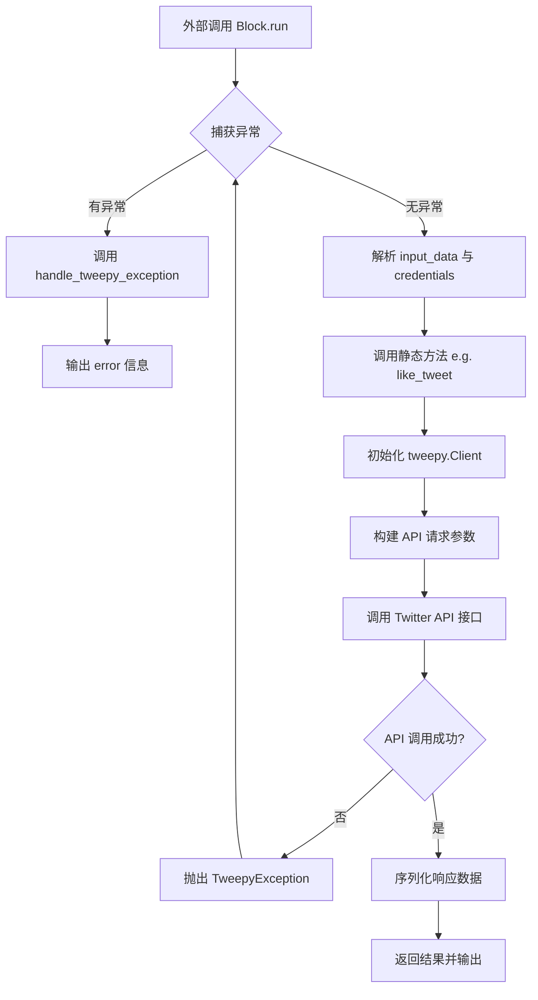

## 类结构

```
Block (抽象基类)
├── TwitterLikeTweetBlock
│   ├── Input
│   └── Output
├── TwitterGetLikingUsersBlock
│   ├── Input
│   └── Output
├── TwitterGetLikedTweetsBlock
│   ├── Input
│   └── Output
└── TwitterUnlikeTweetBlock
    ├── Input
    └── Output
```

## 全局变量及字段


### `TwitterLikeTweetBlock.Input.credentials`
    
Twitter API authentication credentials

类型：`TwitterCredentialsInput`
    


### `TwitterLikeTweetBlock.Input.tweet_id`
    
ID of the tweet to like

类型：`str`
    


### `TwitterLikeTweetBlock.Output.success`
    
Whether the operation was successful

类型：`bool`
    


### `TwitterGetLikingUsersBlock.Input.credentials`
    
Twitter API authentication credentials

类型：`TwitterCredentialsInput`
    


### `TwitterGetLikingUsersBlock.Input.tweet_id`
    
ID of the tweet to get liking users for

类型：`str`
    


### `TwitterGetLikingUsersBlock.Input.max_results`
    
Maximum number of results to return (1-100)

类型：`int | None`
    


### `TwitterGetLikingUsersBlock.Input.pagination_token`
    
Token for getting next/previous page of results

类型：`str | None`
    


### `TwitterGetLikingUsersBlock.Output.id`
    
All User IDs who liked the tweet

类型：`list[str]`
    


### `TwitterGetLikingUsersBlock.Output.username`
    
All User usernames who liked the tweet

类型：`list[str]`
    


### `TwitterGetLikingUsersBlock.Output.next_token`
    
Next token for pagination

类型：`str`
    


### `TwitterGetLikingUsersBlock.Output.data`
    
Complete Tweet data

类型：`list[dict]`
    


### `TwitterGetLikingUsersBlock.Output.included`
    
Additional data that you have requested (Optional) via Expansions field

类型：`dict`
    


### `TwitterGetLikingUsersBlock.Output.meta`
    
Provides metadata such as pagination info (next_token) or result counts

类型：`dict`
    


### `TwitterGetLikedTweetsBlock.Input.credentials`
    
Twitter API authentication credentials

类型：`TwitterCredentialsInput`
    


### `TwitterGetLikedTweetsBlock.Input.user_id`
    
ID of the user to get liked tweets for

类型：`str`
    


### `TwitterGetLikedTweetsBlock.Input.max_results`
    
Maximum number of results to return (5-100)

类型：`int | None`
    


### `TwitterGetLikedTweetsBlock.Input.pagination_token`
    
Token for getting next/previous page of results

类型：`str | None`
    


### `TwitterGetLikedTweetsBlock.Output.ids`
    
All Tweet IDs

类型：`list[str]`
    


### `TwitterGetLikedTweetsBlock.Output.texts`
    
All Tweet texts

类型：`list[str]`
    


### `TwitterGetLikedTweetsBlock.Output.userIds`
    
List of user ids that authored the tweets

类型：`list[str]`
    


### `TwitterGetLikedTweetsBlock.Output.userNames`
    
List of user names that authored the tweets

类型：`list[str]`
    


### `TwitterGetLikedTweetsBlock.Output.next_token`
    
Next token for pagination

类型：`str`
    


### `TwitterGetLikedTweetsBlock.Output.data`
    
Complete Tweet data

类型：`list[dict]`
    


### `TwitterGetLikedTweetsBlock.Output.included`
    
Additional data that you have requested (Optional) via Expansions field

类型：`dict`
    


### `TwitterGetLikedTweetsBlock.Output.meta`
    
Provides metadata such as pagination info (next_token) or result counts

类型：`dict`
    


### `TwitterUnlikeTweetBlock.Input.credentials`
    
Twitter API authentication credentials

类型：`TwitterCredentialsInput`
    


### `TwitterUnlikeTweetBlock.Input.tweet_id`
    
ID of the tweet to unlike

类型：`str`
    


### `TwitterUnlikeTweetBlock.Output.success`
    
Whether the operation was successful

类型：`bool`
    
    

## 全局函数及方法


### `TwitterLikeTweetBlock.__init__`

该方法是 `TwitterLikeTweetBlock` 类的构造函数，负责初始化块的基本元数据、输入输出模式、分类、测试配置以及根据 OAuth 配置状态设定启用/禁用状态。

参数：

-   `self`：`TwitterLikeTweetBlock`，表示当前类实例自身。

返回值：`None`，构造函数不返回任何值。

#### 流程图

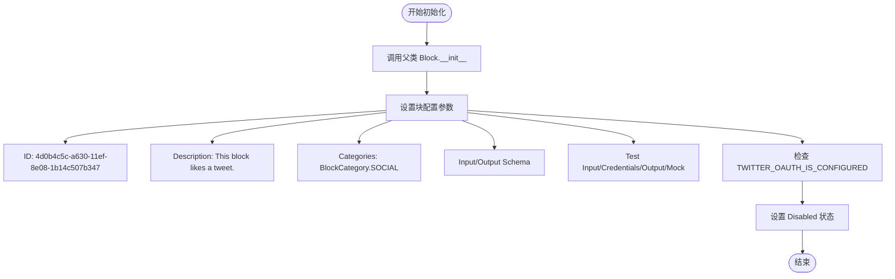

#### 带注释源码

```python
def __init__(self):
    # 调用父类 Block 的初始化方法，配置块的各项属性
    super().__init__(
        # 块的唯一标识符
        id="4d0b4c5c-a630-11ef-8e08-1b14c507b347",
        # 块的功能描述
        description="This block likes a tweet.",
        # 块所属的分类（社交媒体）
        categories={BlockCategory.SOCIAL},
        # 定义输入数据的 Schema，使用内部类 Input
        input_schema=TwitterLikeTweetBlock.Input,
        # 定义输出数据的 Schema，使用内部类 Output
        output_schema=TwitterLikeTweetBlock.Output,
        # 如果 Twitter OAuth 未配置，则禁用该块
        disabled=not TWITTER_OAUTH_IS_CONFIGURED,
        # 定义用于测试的输入数据
        test_input={
            "tweet_id": "1234567890",
            "credentials": TEST_CREDENTIALS_INPUT,
        },
        # 定义用于测试的凭证对象
        test_credentials=TEST_CREDENTIALS,
        # 定义预期的测试输出结果
        test_output=[
            ("success", True),
        ],
        # 定义测试时的 Mock 行为，模拟 like_tweet 方法返回 True
        test_mock={"like_tweet": lambda *args, **kwargs: True},
    )
```


### `TwitterLikeTweetBlock.like_tweet`

该方法封装了调用 Twitter API 对指定推文进行“点赞”操作的逻辑。它利用提供的凭证初始化 Tweepy 客户端，通过 Bearer Token 进行认证并执行点赞请求。

参数：

-  `credentials`：`TwitterCredentials`，包含访问令牌（access token）的 Twitter 凭证对象，用于 API 身份验证。
-  `tweet_id`：`str`，需要点赞的目标推文的唯一标识符。

返回值：`bool`，如果点赞操作成功则返回 `True`。

#### 流程图

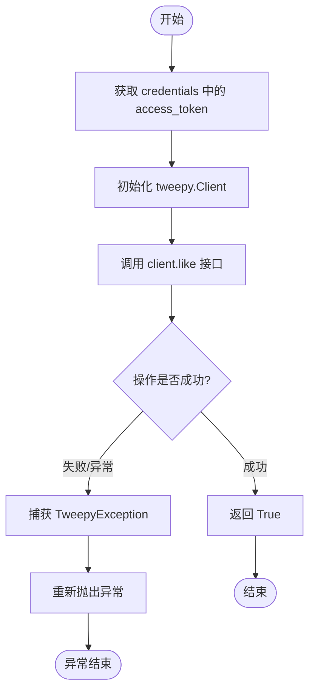

#### 带注释源码

```python
    @staticmethod
    def like_tweet(
        credentials: TwitterCredentials,
        tweet_id: str,
    ):
        try:
            # 使用凭证中的 access_token 初始化 Tweepy 客户端
            # get_secret_value() 用于安全地获取敏感字符串
            client = tweepy.Client(
                bearer_token=credentials.access_token.get_secret_value()
            )

            # 调用 Twitter API 的 like 方法
            # user_auth=False 表示使用应用级认证或仅 Bearer Token，不需要用户上下文
            client.like(tweet_id=tweet_id, user_auth=False)

            # 如果 API 调用没有抛出异常，则认为操作成功，返回 True
            return True

        except tweepy.TweepyException:
            # 捕获 Tweepy 库特有的异常并重新抛出
            # 交由上层调用者（如 run 方法）进行统一处理和转换
            raise
```


### `TwitterLikeTweetBlock.run`

执行点赞推文的逻辑，处理执行结果或捕获并转换异常信息。

参数：

-  `input_data`：`TwitterLikeTweetBlock.Input`，包含推文ID等输入数据
-  `credentials`：`TwitterCredentials`，用于认证的Twitter凭证对象
-  `**kwargs`：`dict`，其他扩展参数

返回值：`BlockOutput`，一个生成器，逐步产生包含操作结果（成功或错误）的键值对元组

#### 流程图

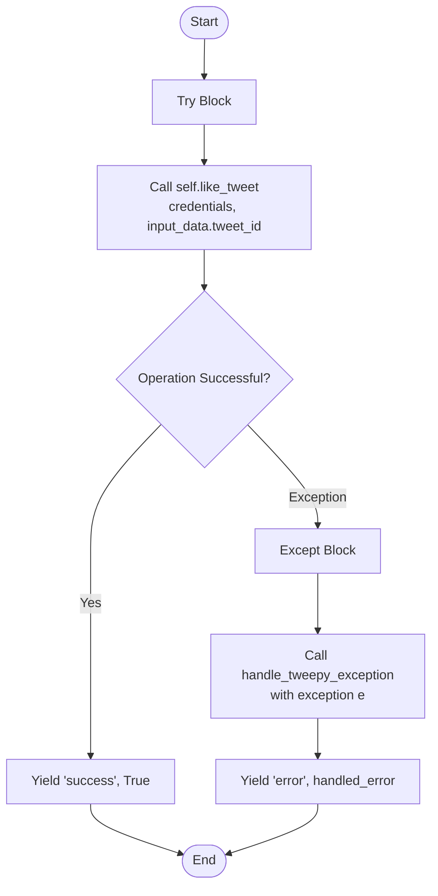

#### 带注释源码

```python
async def run(
    self,
    input_data: Input,
    *,
    credentials: TwitterCredentials,
    **kwargs,
) -> BlockOutput:
    try:
        # 调用静态方法 like_tweet 尝试执行点赞操作
        success = self.like_tweet(
            credentials,
            input_data.tweet_id,
        )
        # 如果操作成功，输出 success 字段和 True
        yield "success", success
    except Exception as e:
        # 如果捕获到异常，使用 handle_tweepy_exception 处理异常信息
        # 输出 error 字段和处理后的错误消息
        yield "error", handle_tweepy_exception(e)
```


### `TwitterGetLikingUsersBlock.__init__`

该方法用于初始化 `TwitterGetLikingUsersBlock` 类实例，通过调用父类的初始化方法，配置该块的唯一标识、描述、分类、输入/输出模式、测试数据以及测试模拟行为。

参数：

-   `self`：`TwitterGetLikingUsersBlock`，表示类的实例本身。

返回值：`None`，初始化方法通常不返回任何值。

#### 流程图

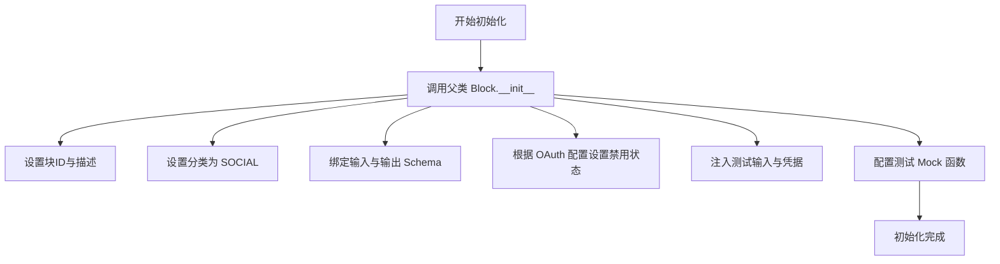

#### 带注释源码

```python
    def __init__(self):
        # 调用父类 Block 的初始化方法，传入块的元数据和配置
        super().__init__(
            # 块的唯一标识符
            id="34275000-a630-11ef-b01e-5f00d9077c08",
            # 块的功能描述
            description="This block gets information about users who liked a tweet.",
            # 将块归类为社交媒体类别
            categories={BlockCategory.SOCIAL},
            # 指定输入数据的结构定义
            input_schema=TwitterGetLikingUsersBlock.Input,
            # 指定输出数据的结构定义
            output_schema=TwitterGetLikingUsersBlock.Output,
            # 如果 Twitter OAuth 未配置，则禁用该块
            disabled=not TWITTER_OAUTH_IS_CONFIGURED,
            # 定义用于测试的模拟输入数据
            test_input={
                "tweet_id": "1234567890",
                "max_results": 1,
                "pagination_token": None,
                "credentials": TEST_CREDENTIALS_INPUT,
                "expansions": None,
                "tweet_fields": None,
                "user_fields": None,
            },
            # 指定测试用的凭据对象
            test_credentials=TEST_CREDENTIALS,
            # 定义预期的测试输出结果
            test_output=[
                ("id", ["1234567890"]),
                ("username", ["testuser"]),
                ("data", [{"id": "1234567890", "username": "testuser"}]),
            ],
            # 配置测试模拟，定义 get_liking_users 方法的模拟返回行为
            test_mock={
                "get_liking_users": lambda *args, **kwargs: (
                    ["1234567890"],
                    ["testuser"],
                    [{"id": "1234567890", "username": "testuser"}],
                    {},
                    {},
                    None,
                )
            },
        )
```


### `TwitterGetLikingUsersBlock.get_liking_users`

该方法通过 `tweepy` 客户端根据推文 ID 和相关查询参数，获取点赞该推文的用户信息，并对响应数据进行处理和序列化，最终返回用户 ID 列表、用户名列表、完整数据、扩展信息、元数据以及分页令牌。

参数：

- `credentials`：`TwitterCredentials`，Twitter API 认证凭据，包含访问令牌。
- `tweet_id`：`str`，目标推文的 ID，用于查询点赞该推文的用户。
- `max_results`：`int | None`，返回结果的最大数量限制。
- `pagination_token`：`str | None`，用于分页查询的令牌，用于获取下一页或上一页结果。
- `expansions`：`UserExpansionsFilter | None`，扩展字段过滤器，用于指定需要返回的额外扩展数据。
- `tweet_fields`：`TweetFieldsFilter | None`，推文字段过滤器，指定返回的推文相关属性。
- `user_fields`：`TweetUserFieldsFilter | None`，用户字段过滤器，指定返回的用户相关属性。

返回值：`tuple[list[str], list[str], list[dict], dict, dict, str | None]`，包含点赞用户的 ID 列表、用户名列表、序列化后的完整数据列表、序列化后的附加扩展信息、元数据字典以及下一页分页令牌的元组。

#### 流程图

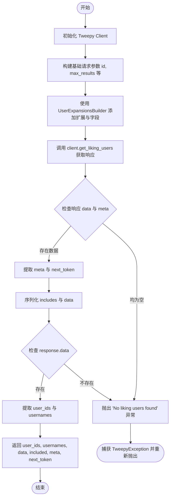

#### 带注释源码

```python
    @staticmethod
    def get_liking_users(
        credentials: TwitterCredentials,
        tweet_id: str,
        max_results: int | None,
        pagination_token: str | None,
        expansions: UserExpansionsFilter | None,
        tweet_fields: TweetFieldsFilter | None,
        user_fields: TweetUserFieldsFilter | None,
    ):
        try:
            # 使用 bearer token 初始化 Tweepy 客户端
            client = tweepy.Client(
                bearer_token=credentials.access_token.get_secret_value()
            )

            # 构建基础请求参数
            params = {
                "id": tweet_id,
                "max_results": max_results,
                "pagination_token": (
                    None if pagination_token == "" else pagination_token
                ),
                "user_auth": False,
            }

            # 使用 Builder 模式添加扩展、推文字段和用户字段
            params = (
                UserExpansionsBuilder(params)
                .add_expansions(expansions)
                .add_tweet_fields(tweet_fields)
                .add_user_fields(user_fields)
                .build()
            )

            # 调用 Twitter API 获取点赞用户数据
            response = cast(Response, client.get_liking_users(**params))

            # 检查响应是否既没有数据也没有元数据，如果是则抛出异常
            if not response.data and not response.meta:
                raise Exception("No liking users found")

            meta = {}
            user_ids = []
            usernames = []
            next_token = None

            # 处理元数据，提取分页令牌
            if response.meta:
                meta = response.meta
                next_token = meta.get("next_token")

            # 序列化附加数据 (includes) 和主数据 (data)
            included = IncludesSerializer.serialize(response.includes)
            data = ResponseDataSerializer.serialize_list(response.data)

            # 如果响应中包含用户数据，提取 ID 和用户名
            if response.data:
                user_ids = [str(user.id) for user in response.data]
                usernames = [user.username for user in response.data]

                return user_ids, usernames, data, included, meta, next_token

            # 如果没有用户数据，抛出异常（虽然前面有检查，这里作为兜底）
            raise Exception("No liking users found")

        except tweepy.TweepyException:
            raise
```


### `TwitterGetLikingUsersBlock.run`

执行获取指定推文的点赞用户信息的主流程，负责调用底层逻辑处理数据，并将结果分发给输出端口。

参数：

-  `input_data`：`TwitterGetLikingUsersBlock.Input`，包含推文ID、分页参数、扩展字段及认证信息的输入数据结构。
-  `credentials`：`TwitterCredentials`，Twitter API 认证凭证，用于授权访问。
-  `**kwargs`：`dict`，额外的关键字参数，由框架传递。

返回值：`BlockOutput`，异步生成器，产生键值对形式的输出数据，如 `("id", ids)`、`("username", usernames)` 或 `("error", error_message)`。

#### 流程图

```mermaid
flowchart TD
    Start([开始]) --> GetInput[获取 input_data 和 credentials]
    GetInput --> TryBlock{尝试执行获取逻辑}
    
    TryBlock --> CallMethod[调用 self.get_liking_users<br/>获取点赞用户数据]
    CallMethod --> CheckSuccess{获取是否成功?}
    
    CheckSuccess -- 是 --> UnpackResult[解包结果: ids, usernames, data, included, meta, next_token]
    UnpackResult --> CheckIds{ids 是否存在?}
    CheckIds -- 是 --> YieldId[Yield "id", ids]
    CheckIds -- 否 --> CheckUsernames
    
    YieldId --> CheckUsernames{usernames 是否存在?}
    CheckUsernames -- 是 --> YieldUsername[Yield "username", usernames]
    CheckUsernames -- 否 --> CheckToken
    
    YieldUsername --> CheckToken{next_token 是否存在?}
    CheckToken -- 是 --> YieldToken[Yield "next_token", next_token]
    CheckToken -- 否 --> CheckData
    
    YieldToken --> CheckData{data 是否存在?}
    CheckData -- 是 --> YieldData[Yield "data", data]
    CheckData -- 否 --> CheckIncluded
    
    YieldData --> CheckIncluded{included 是否存在?}
    CheckIncluded -- 是 --> YieldIncluded[Yield "included", included]
    CheckIncluded -- 否 --> CheckMeta
    
    YieldIncluded --> CheckMeta{meta 是否存在?}
    CheckMeta -- 是 --> YieldMeta[Yield "meta", meta]
    CheckMeta -- 否 --> End([结束])
    
    YieldMeta --> End
    
    CheckSuccess -- 否/异常 --> CatchException[捕获 Exception]
    CatchException --> HandleError[调用 handle_tweepy_exception 处理异常]
    HandleError --> YieldError[Yield "error", error_message]
    YieldError --> End
```

#### 带注释源码

```python
    async def run(
        self,
        input_data: Input,
        *,
        credentials: TwitterCredentials,
        **kwargs,
    ) -> BlockOutput:
        try:
            # 调用静态方法 get_liking_users 获取数据
            # 传入凭证、推文ID、最大结果数、分页Token及各类扩展字段
            ids, usernames, data, included, meta, next_token = self.get_liking_users(
                credentials,
                input_data.tweet_id,
                input_data.max_results,
                input_data.pagination_token,
                input_data.expansions,
                input_data.tweet_fields,
                input_data.user_fields,
            )
            
            # 如果用户ID列表存在，则输出 id
            if ids:
                yield "id", ids
            
            # 如果用户名列表存在，则输出 username
            if usernames:
                yield "username", usernames
                
            # 如果下一页Token存在，则输出 next_token
            if next_token:
                yield "next_token", next_token
                
            # 如果完整数据列表存在，则输出 data
            if data:
                yield "data", data
                
            # 如果扩展附加数据存在，则输出 included
            if included:
                yield "included", included
                
            # 如果元数据存在，则输出 meta
            if meta:
                yield "meta", meta
                
        except Exception as e:
            # 捕获异常并使用 handle_tweepy_exception 进行处理
            # 输出错误信息到 error 端口
            yield "error", handle_tweepy_exception(e)
```


### `TwitterGetLikedTweetsBlock.__init__`

该方法用于初始化 `TwitterGetLikedTweetsBlock` 实例，通过设置唯一的块ID、描述、分类、输入输出Schema、OAuth配置状态以及测试用的输入、凭证、输出和模拟函数，来定义该块的基本行为和元数据。

参数：

- `self`：`TwitterGetLikedTweetsBlock`，表示类的实例本身。

返回值：`None`，无返回值。

#### 流程图

```mermaid
graph TD
    A[开始: TwitterGetLikedTweetsBlock.__init__] --> B[检查全局配置 TWITTER_OAUTH_IS_CONFIGURED]
    B --> C[定义测试输入 test_input]
    C --> D[定义测试凭证 test_credentials]
    D --> E[定义测试输出 test_output]
    E --> F[定义模拟函数 test_mock]
    F --> G[调用 super().__init__]
    G --> H[传入参数: id, description, categories, input_schema, output_schema, disabled, test_input, test_credentials, test_output, test_mock]
    H --> I[结束: 实例初始化完成]
```

#### 带注释源码

```python
def __init__(self):
    # 调用父类 Block 的构造函数初始化块的基本属性
    super().__init__(
        # 块的唯一标识符 (UUID)
        id="292e7c78-a630-11ef-9f40-df5dffaca106",
        # 块的功能描述
        description="This block gets information about tweets liked by a user.",
        # 块所属的分类（社交媒体类）
        categories={BlockCategory.SOCIAL},
        # 指定输入数据的 Schema，继承自 TwitterGetLikedTweetsBlock.Input
        input_schema=TwitterGetLikedTweetsBlock.Input,
        # 指定输出数据的 Schema，继承自 TwitterGetLikedTweetsBlock.Output
        output_schema=TwitterGetLikedTweetsBlock.Output,
        # 如果 Twitter OAuth 未配置，则禁用该块
        disabled=not TWITTER_OAUTH_IS_CONFIGURED,
        # 定义用于测试的输入参数样本
        test_input={
            "user_id": "1234567890",
            "max_results": 2,
            "pagination_token": None,
            "credentials": TEST_CREDENTIALS_INPUT,
            "expansions": None,
            "media_fields": None,
            "place_fields": None,
            "poll_fields": None,
            "tweet_fields": None,
            "user_fields": None,
        },
        # 定义用于测试的凭证对象
        test_credentials=TEST_CREDENTIALS,
        # 定义预期的测试输出结果
        test_output=[
            ("ids", ["12345", "67890"]),
            ("texts", ["Tweet 1", "Tweet 2"]),
            ("userIds", ["67890", "67891"]),
            ("userNames", ["testuser1", "testuser2"]),
            (
                "data",
                [
                    {"id": "12345", "text": "Tweet 1"},
                    {"id": "67890", "text": "Tweet 2"},
                ],
            ),
        ],
        # 定义测试时的模拟函数，用于在单元测试中替代真实的 API 调用
        # 这里模拟 get_liked_tweets 方法返回一个包含 7 个元素的元组
        test_mock={
            "get_liked_tweets": lambda *args, **kwargs: (
                ["12345", "67890"],
                ["Tweet 1", "Tweet 2"],
                ["67890", "67891"],
                ["testuser1", "testuser2"],
                [
                    {"id": "12345", "text": "Tweet 1"},
                    {"id": "67890", "text": "Tweet 2"},
                ],
                {},
                {},
                None,
            )
        },
    )
```


### `TwitterGetLikedTweetsBlock.get_liked_tweets`

该静态方法负责通过 Twitter API 获取指定用户点赞过的推文列表，支持分页查询、字段扩展及多种数据过滤器，并返回解析后的结构化数据。

参数：

-   `credentials`：`TwitterCredentials`，Twitter API 认证凭据，用于初始化客户端。
-   `user_id`：`str`，目标用户的 ID，指定要查询哪个用户的点赞推文。
-   `max_results`：`int | None`，单次请求返回的最大结果数。
-   `pagination_token`：`str | None`，用于分页浏览的令牌。
-   `expansions`：`ExpansionFilter | None`，扩展对象，用于指定需要包含在响应中的关联资源（如作者信息）。
-   `media_fields`：`TweetMediaFieldsFilter | None`，媒体字段过滤器，指定返回哪些媒体相关属性。
-   `place_fields`：`TweetPlaceFieldsFilter | None`，地点字段过滤器，指定返回哪些地点相关属性。
-   `poll_fields`：`TweetPollFieldsFilter | None`，投票字段过滤器，指定返回哪些投票相关属性。
-   `tweet_fields`：`TweetFieldsFilter | None`，推文字段过滤器，指定返回哪些推文属性。
-   `user_fields`：`TweetUserFieldsFilter | None`，用户字段过滤器，指定返回哪些用户属性。

返回值：`tuple[list[str], list[str], list[str], list[str], list[dict], dict, dict, str | None]`，包含推文 ID 列表、推文文本列表、推文作者 ID 列表、推文作者用户名列表、完整推文数据字典列表、附加包含数据字典、元数据字典以及下一页分页令牌的元组。

#### 流程图

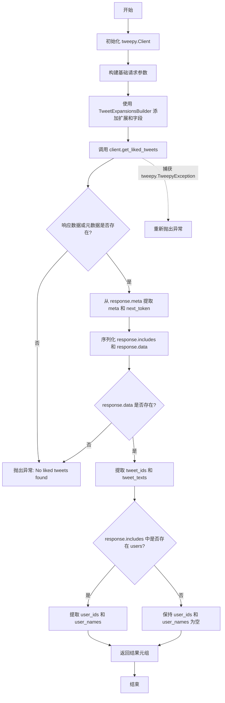

#### 带注释源码

```python
    @staticmethod
    def get_liked_tweets(
        credentials: TwitterCredentials,
        user_id: str,
        max_results: int | None,
        pagination_token: str | None,
        expansions: ExpansionFilter | None,
        media_fields: TweetMediaFieldsFilter | None,
        place_fields: TweetPlaceFieldsFilter | None,
        poll_fields: TweetPollFieldsFilter | None,
        tweet_fields: TweetFieldsFilter | None,
        user_fields: TweetUserFieldsFilter | None,
    ):
        try:
            # 1. 初始化 Tweepy 客户端，使用凭证中的 bearer_token
            client = tweepy.Client(
                bearer_token=credentials.access_token.get_secret_value()
            )

            # 2. 构建基础请求参数字典
            params = {
                "id": user_id,
                "max_results": max_results,
                "pagination_token": (
                    None if pagination_token == "" else pagination_token
                ),
                "user_auth": False,
            }

            # 3. 使用构建器模式添加各种扩展和字段配置到参数中
            params = (
                TweetExpansionsBuilder(params)
                .add_expansions(expansions)
                .add_media_fields(media_fields)
                .add_place_fields(place_fields)
                .add_poll_fields(poll_fields)
                .add_tweet_fields(tweet_fields)
                .add_user_fields(user_fields)
                .build()
            )

            # 4. 调用 Twitter API 获取用户点赞的推文
            response = cast(Response, client.get_liked_tweets(**params))

            # 5. 检查响应是否为空，若无数据也无元数据则抛出异常
            if not response.data and not response.meta:
                raise Exception("No liked tweets found")

            # 初始化结果变量
            meta = {}
            tweet_ids = []
            tweet_texts = []
            user_ids = []
            user_names = []
            next_token = None

            # 6. 处理元数据，提取分页信息
            if response.meta:
                meta = response.meta
                next_token = meta.get("next_token")

            # 7. 序列化附加数据（includes）和主要数据（data）
            included = IncludesSerializer.serialize(response.includes)
            data = ResponseDataSerializer.serialize_list(response.data)

            # 8. 如果存在推文数据，提取关键信息
            if response.data:
                tweet_ids = [str(tweet.id) for tweet in response.data]
                tweet_texts = [tweet.text for tweet in response.data]

                # 9. 检查附加数据中是否包含用户信息，若包含则提取作者ID和用户名
                if "users" in response.includes:
                    user_ids = [str(user["id"]) for user in response.includes["users"]]
                    user_names = [
                        user["username"] for user in response.includes["users"]
                    ]

                # 10. 返回包含所有提取信息的元组
                return (
                    tweet_ids,
                    tweet_texts,
                    user_ids,
                    user_names,
                    data,
                    included,
                    meta,
                    next_token,
                )

            # 如果数据不存在，抛出异常
            raise Exception("No liked tweets found")

        # 11. 捕获 Tweepy 异常并重新抛出，交由上层处理
        except tweepy.TweepyException:
            raise
```


### `TwitterGetLikedTweetsBlock.run`

执行获取指定用户喜欢的推文的逻辑，处理输入参数、调用 API 接口、捕获异常并输出结果。

参数：

- `input_data`：`Input`，包含用户ID、分页参数及各种字段扩展选项的输入数据。
- `credentials`：`TwitterCredentials`，用于认证的 Twitter API 凭证。
- `**kwargs`：`dict`，其他额外的关键字参数。

返回值：`BlockOutput`，异步生成器，逐步产生键值对结果（如推文ID列表、文本列表、错误信息等）。

#### 流程图

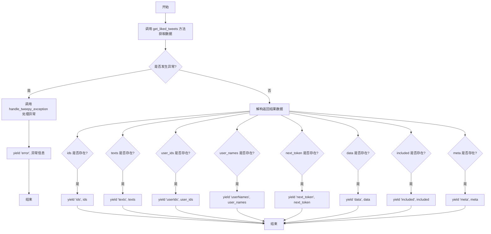

#### 带注释源码

```python
async def run(
    self,
    input_data: Input,
    *,
    credentials: TwitterCredentials,
    **kwargs,
) -> BlockOutput:
    try:
        # 调用静态方法 get_liked_tweets 获取用户喜欢的推文数据
        # 传入凭证、用户ID、最大结果数、分页Token及各类扩展字段
        ids, texts, user_ids, user_names, data, included, meta, next_token = (
            self.get_liked_tweets(
                credentials,
                input_data.user_id,
                input_data.max_results,
                input_data.pagination_token,
                input_data.expansions,
                input_data.media_fields,
                input_data.place_fields,
                input_data.poll_fields,
                input_data.tweet_fields,
                input_data.user_fields,
            )
        )
        # 如果获取到推文ID，产出 'ids'
        if ids:
            yield "ids", ids
        # 如果获取到推文文本，产出 'texts'
        if texts:
            yield "texts", texts
        # 如果获取到作者用户ID，产出 'userIds'
        if user_ids:
            yield "userIds", user_ids
        # 如果获取到作者用户名，产出 'userNames'
        if user_names:
            yield "userNames", user_names
        # 如果存在下一页分页Token，产出 'next_token'
        if next_token:
            yield "next_token", next_token
        # 如果存在完整数据，产出 'data'
        if data:
            yield "data", data
        # 如果存在扩展数据（如媒体、用户等），产出 'included'
        if included:
            yield "included", included
        # 如果存在元数据，产出 'meta'
        if meta:
            yield "meta", meta
    except Exception as e:
        # 捕获异常，处理 Twitter API 异常并产出 'error'
        yield "error", handle_tweepy_exception(e)
```


### `TwitterUnlikeTweetBlock.__init__`

初始化 `TwitterUnlikeTweetBlock` 类的实例，配置该块的元数据、输入输出架构、分类、测试用例以及是否禁用等属性，并通过调用父类 `Block` 的构造函数完成注册。

参数：

-  `self`：`TwitterUnlikeTweetBlock`，类实例本身。

返回值：`None`，无返回值。

#### 流程图

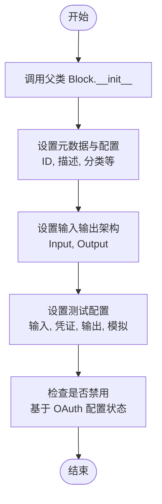

#### 带注释源码

```python
def __init__(self):
    # 调用父类 Block 的初始化方法，传入配置参数
    super().__init__(
        # 块的唯一标识符 UUID
        id="1ed5eab8-a630-11ef-8e21-cbbbc80cbb85",
        # 块的功能描述
        description="This block unlikes a tweet.",
        # 块所属的分类，此处为社交类别
        categories={BlockCategory.SOCIAL},
        # 定义输入数据的 Schema，引用内部类 Input
        input_schema=TwitterUnlikeTweetBlock.Input,
        # 定义输出数据的 Schema，引用内部类 Output
        output_schema=TwitterUnlikeTweetBlock.Output,
        # 根据 Twitter OAuth 是否配置来决定是否禁用该块
        disabled=not TWITTER_OAUTH_IS_CONFIGURED,
        # 定义测试输入数据，包含推文 ID 和测试凭证
        test_input={
            "tweet_id": "1234567890",
            "credentials": TEST_CREDENTIALS_INPUT,
        },
        # 定义测试使用的凭证
        test_credentials=TEST_CREDENTIALS,
        # 定义预期的测试输出结果
        test_output=[
            ("success", True),
        ],
        # 定义测试模拟函数，模拟 unlike_tweet 方法返回 True
        test_mock={"unlike_tweet": lambda *args, **kwargs: True},
    )
```


### `TwitterUnlikeTweetBlock.unlike_tweet`

该方法是一个静态方法，用于通过 Twitter API 取消对指定推文的点赞操作。它初始化 Tweepy 客户端，使用提供的凭证（Bearer Token）进行身份验证，并执行取消点赞请求。

参数：

-  `credentials`：`TwitterCredentials`，包含访问令牌（access_token）的 Twitter API 凭证对象，用于身份验证。
-  `tweet_id`：`str`，需要取消点赞的推文的唯一标识符。

返回值：`bool`，如果操作成功返回 True。

#### 流程图

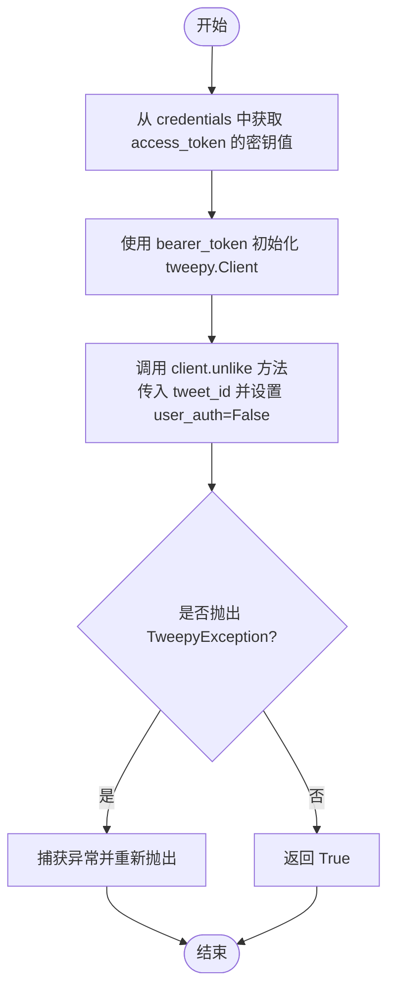

#### 带注释源码

```python
    @staticmethod
    def unlike_tweet(
        credentials: TwitterCredentials,  # Twitter API 凭证，包含认证所需的 Token
        tweet_id: str,                    # 目标推文的 ID
    ):
        try:
            # 使用凭证中的 bearer_token 初始化 Tweepy 客户端
            # get_secret_value() 用于安全地获取敏感字符串
            client = tweepy.Client(
                bearer_token=credentials.access_token.get_secret_value()
            )

            # 调用 Twitter API v2 的 unlike 接口
            # user_auth=False 表示使用 App-only 认证方式（Bearer Token）
            client.unlike(tweet_id=tweet_id, user_auth=False)

            # 如果 API 调用没有抛出异常，则视为操作成功，返回 True
            return True

        # 捕获 Tweepy 库抛出的特定异常，并将其向上抛出以便上层逻辑处理错误
        except tweepy.TweepyException:
            raise
```


### `TwitterUnlikeTweetBlock.run`

异步执行取消点赞推文的逻辑。该方法接收输入数据和凭证，调用内部静态方法与 Twitter API 交互，并生成成功状态或错误信息。

参数：

- `self`：`TwitterUnlikeTweetBlock`，类的实例
- `input_data`：`Input`，包含推文 ID 等输入数据的对象
- `credentials`：`TwitterCredentials`，Twitter API 认证凭证
- `**kwargs`：`dict`，额外的关键字参数

返回值：`BlockOutput`，异步生成器，产生包含操作结果（如 "success"）或错误信息（如 "error"）的键值对元组。

#### 流程图

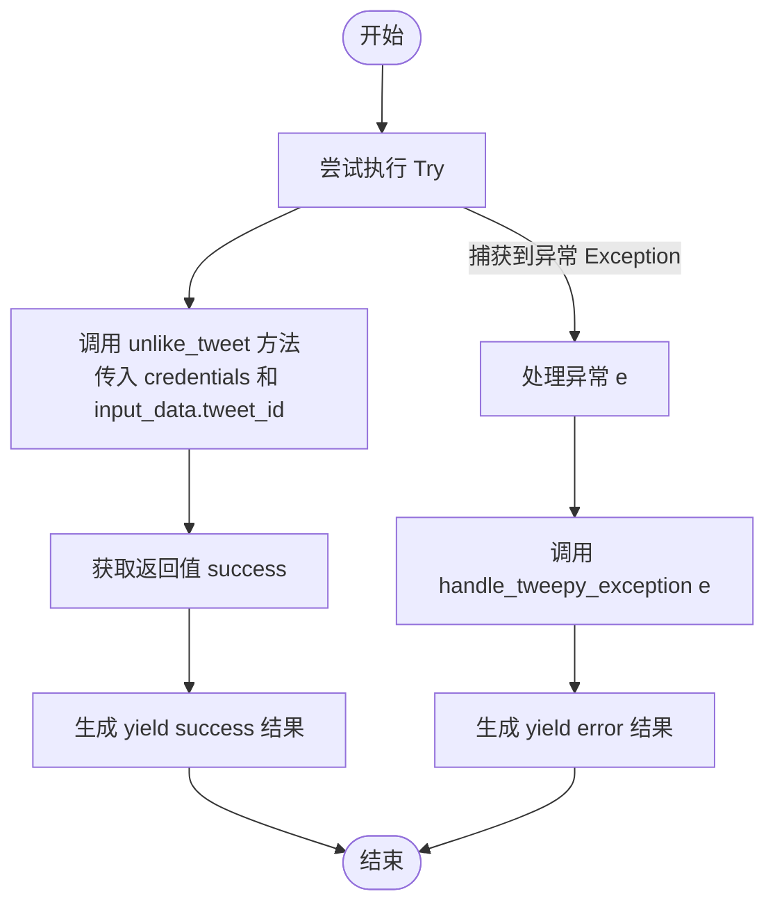

#### 带注释源码

```python
async def run(
    self,
    input_data: Input,
    *,
    credentials: TwitterCredentials,
    **kwargs,
) -> BlockOutput:
    try:
        # 调用静态方法执行实际的取消点赞操作，传入凭证和推文ID
        success = self.unlike_tweet(
            credentials,
            input_data.tweet_id,
        )
        # 如果操作成功，生成 "success" 键和对应的布尔值
        yield "success", success
    except Exception as e:
        # 如果捕获到异常，使用 handle_tweepy_exception 处理异常信息
        # 并生成 "error" 键和错误详情
        yield "error", handle_tweepy_exception(e)
```


## 关键组件


### TwitterLikeTweetBlock
该组件封装了认证逻辑，并通过调用 Twitter API 对指定 ID 的推特执行点赞操作。

### TwitterGetLikingUsersBlock
该组件通过调用 Twitter API 获取点赞了指定推特的用户列表，支持分页查询、字段扩展以及复杂的响应数据序列化。

### TwitterGetLikedTweetsBlock
该组件通过调用 Twitter API 获取指定用户点赞过的推特列表，支持分页查询、字段扩展以及包含关联媒体、地点和用户数据的完整响应序列化。

### TwitterUnlikeTweetBlock
该组件封装了认证逻辑，并通过调用 Twitter API 对指定 ID 的推特执行取消点赞操作。


## 问题及建议


### 已知问题

-   认证逻辑错误：`TwitterLikeTweetBlock` 和 `TwitterUnlikeTweetBlock` 使用 `bearer_token`（即 App-only 认证模式）并设置 `user_auth=False` 来执行需要用户上下文的点赞/取消点赞操作。根据 Twitter API v2 规范，此类写操作必须使用 OAuth 2.0 用户授权令牌（User Access Token），当前实现极可能导致 API 返回 403 Forbidden 错误。
-   异常处理不当：`TwitterGetLikingUsersBlock` 和 `TwitterGetLikedTweetsBlock` 在查询结果为空时抛出 `Exception("No liking users found")`。在数据获取类操作中，无数据应视为正常的业务逻辑（返回空列表），将其作为异常处理破坏了正常的控制流，增加了调用方的复杂度。
-   冗余的异常捕获：静态方法中的 `except tweepy.TweepyException: raise` 仅捕获并立即重新抛出异常，未进行任何日志记录、上下文添加或处理，这属于无效代码，增加了嵌套层级而无实际价值。
-   返回值解包脆弱：静态方法通过返回长元组（如 `return user_ids, usernames, data, included, meta, next_token`）来传递数据，并在 `run` 方法中按位置解包。这种“幻数”式的解包方式高度依赖于顺序，一旦返回结构变更或中间某项为 None，极易导致难以排查的错误。

### 优化建议

-   客户端实例复用：避免在每个静态方法内部重复实例化 `tweepy.Client`。建议在 Block 初始化时创建客户端实例，或者通过依赖注入的方式管理客户端生命周期，以减少连接建立的开销和资源消耗。
-   引入数据模型：使用 Pydantic 模型或 Dataclass 封装静态方法的返回值，替代原始的元组返回。这将明确字段的语义和类型，提升代码的可读性与维护性，并利用类型检查工具提前发现潜在错误。
-   提取公共逻辑：`TwitterGetLikingUsersBlock` 和 `TwitterGetLikedTweetsBlock` 中包含大量重复的响应处理代码（如 `ResponseDataSerializer` 调用、分页 Token 提取、Metadata 处理）。建议将其提取为基类辅助方法或独立的工具函数，遵循 DRY（Don't Repeat Yourself）原则。
-   优化空结果处理：移除针对空结果集的异常抛出逻辑，改为返回空列表（`[]`）和空的 Meta 信息，使 API 行为更符合 Python 惯用风格和 RESTful 设计原则。
-   清理无效代码：移除静态方法中仅包含 `raise` 的 `except` 块，让异常自然传播到 `run` 方法中的统一异常处理器，简化代码结构。


## 其它


### 设计目标与约束

**设计目标：**
1.  **模块化封装**：将 Twitter API v2 中与“点赞”相关的操作（点赞推文、取消点赞、获取点赞用户、获取用户点赞列表）封装为独立的、可复用的 Block 组件。
2.  **数据灵活性**：支持通过 Expansions 和 Fields 参数动态获取扩展数据（如用户信息、媒体信息等），以满足不同复杂度的业务需求。
3.  **统一接口**：所有 Block 均遵循 `backend.data.block` 定义的标准输入输出接口，便于在低代码平台或工作流中统一调度。

**设计约束：**
1.  **依赖约束**：功能严重依赖于第三方库 `tweepy` 以及 Twitter API v2 的可用性和稳定性。
2.  **配置约束**：模块的功能启用受全局变量 `TWITTER_OAUTH_IS_CONFIGURED` 控制，若未配置 Twitter OAuth，所有 Block 将被禁用。
3.  **认证约束**：所有操作必须具备特定的 OAuth 权限作用域（如 `tweet.read`, `like.write` 等），否则调用将失败。
4.  **异步模型约束**：尽管 `run` 方法被定义为异步，但底层的 `tweepy` 客户端调用是同步阻塞的，这在高并发场景下可能成为性能瓶颈。

### 错误处理与异常设计

**异常处理策略：**
1.  **统一捕获与转换**：所有对外部 API 的调用均包裹在 `try-except` 块中，专门捕获 `tweepy.TweepyException`。
2.  **错误传播**：静态方法（如 `like_tweet`）捕获到 Twitter 特定异常后直接 `raise`，交由上层的 `run` 方法处理。
3.  **标准化输出**：在 `run` 方法中，捕获所有异常并通过 `handle_tweepy_exception` 函数将其转换为用户友好的错误消息格式。
4.  **错误输出流**：错误信息不抛出至系统顶层，而是通过 `yield "error", error_message` 的方式作为 Block 的输出流的一部分，确保工作流的下游可以感知并处理错误而不中断整个流程。

**异常场景覆盖：**
*   **认证失败**：无效的 Token 或权限不足。
*   **资源未找到**：指定的 Tweet ID 或 User ID 不存在。
*   **速率限制**：超出 Twitter API 的调用频次限制。
*   **网络故障**：连接超时或服务不可用。

### 外部依赖与接口契约

**外部库依赖：**
*   **tweepy**: 核心 HTTP 客户端，用于与 Twitter API 交互。
*   **typing**: Python 类型提示支持。

**内部模块依赖：**
*   `backend.blocks.twitter._auth`: 提供凭证输入定义、测试凭证及配置状态检查。
*   `backend.blocks.twitter._builders`: 构建复杂的查询参数（Expansions, Fields）。
*   `backend.blocks.twitter._serializer`: 序列化 API 响应数据。
*   `backend.blocks.twitter._types`: 定义各类过滤器类型。
*   `backend.blocks.twitter.tweepy_exceptions`: 处理 Tweepy 异常映射。
*   `backend.data.block`: 定义 Block 基类及输入输出 Schema 基类。

**接口契约（Twitter API v2）：**
*   **Like Tweet**: `POST /2/{tweet_id}/likers`
*   **Unlike Tweet**: `DELETE /2/{tweet_id}/likers`
*   **Get Liking Users**: `GET /2/{tweet_id}/liking_users` (支持分页 `pagination_token`, 限制 `max_results`)
*   **Get Liked Tweets**: `GET /2/users/{id}/liked_tweets` (支持分页 `pagination_token`, 限制 `max_results`)

**认证契约：**
*   使用 Bearer Token (App-only 或 User Context)，通过 `TwitterCredentials` 中的 `access_token` 获取。

### 数据流与状态机

**数据流：**
1.  **输入阶段**：通过 `Input` Schema 接收用户参数（Tweet ID, User ID, 分页 Token 等）及凭证。
2.  **预处理阶段**：
    *   验证凭证有效性。
    *   使用 `TweetExpansionsBuilder` 或 `UserExpansionsBuilder` 将用户输入的扩展字段构建为 API 查询参数字典。
3.  **执行阶段**：
    *   初始化 `tweepy.Client`。
    *   发起同步 HTTP 请求调用 Twitter API。
4.  **后处理阶段**：
    *   检查响应数据（`response.data` 和 `response.meta`）是否存在，若不存在则抛出异常。
    *   使用 `IncludesSerializer` 和 `ResponseDataSerializer` 将原始响应对象转换为字典或列表结构。
    *   提取元数据（如 `next_token` 用于分页）。
5.  **输出阶段**：通过 `BlockOutput` 生成器逐个 Yield 处理后的数据字段（如 `id`, `username`, `data` 等）。

**状态机：**
*   本模块中的各个 Block 均为**无状态**组件。它们不维护任何内部状态，每次调用都是独立的请求-响应循环。分页状态（`next_token`）由调用方维护并在下一次调用时作为参数传入。

### 安全性与合规性

**凭证管理：**
*   使用 `get_secret_value()` 方法访问 `access_token`，确保敏感信息在日志或调试过程中不被明文打印。
*   凭证通过专门的 `TwitterCredentialsField` 传递，与普通业务数据隔离。

**权限控制：**
*   每个 Block 显式声明了其所需的 Twitter OAuth 权限范围（Scopes），遵循最小权限原则。例如，仅读取数据的 Block 不会请求 `like.write` 权限。

**数据隐私：**
*   代码本身不持久化存储用户数据，仅作为数据传输管道。数据的存储和隐私保护依赖于下游的 Block 或数据库实现。

    