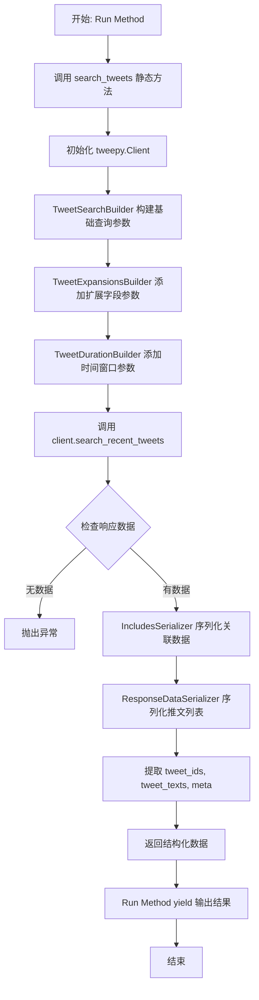
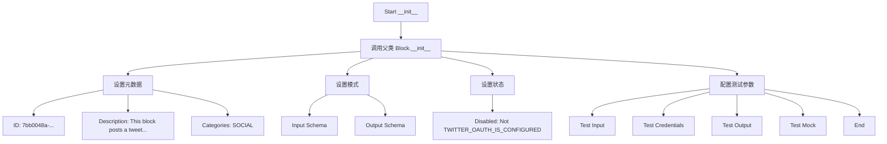
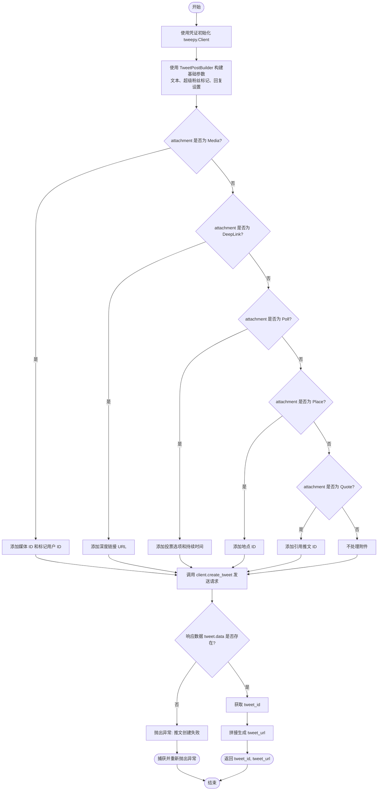
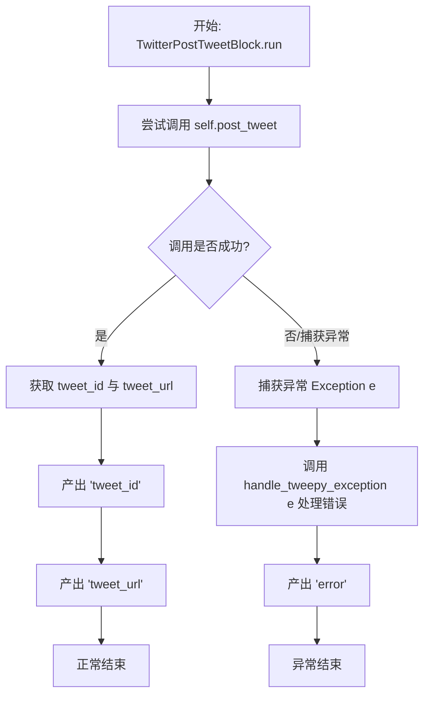
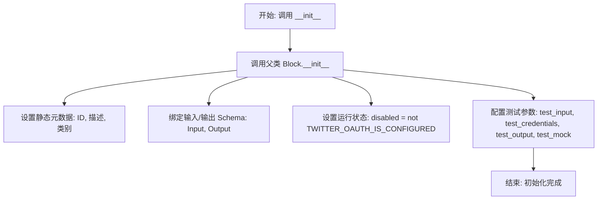
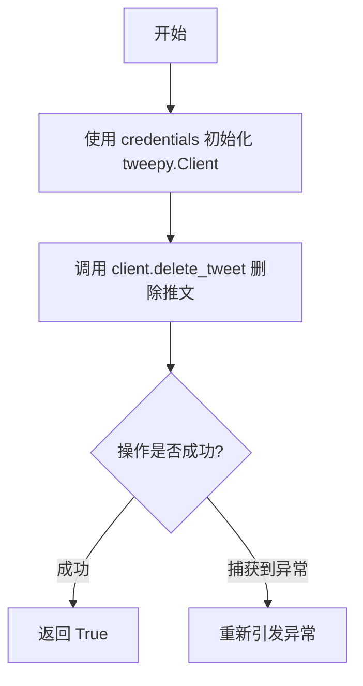
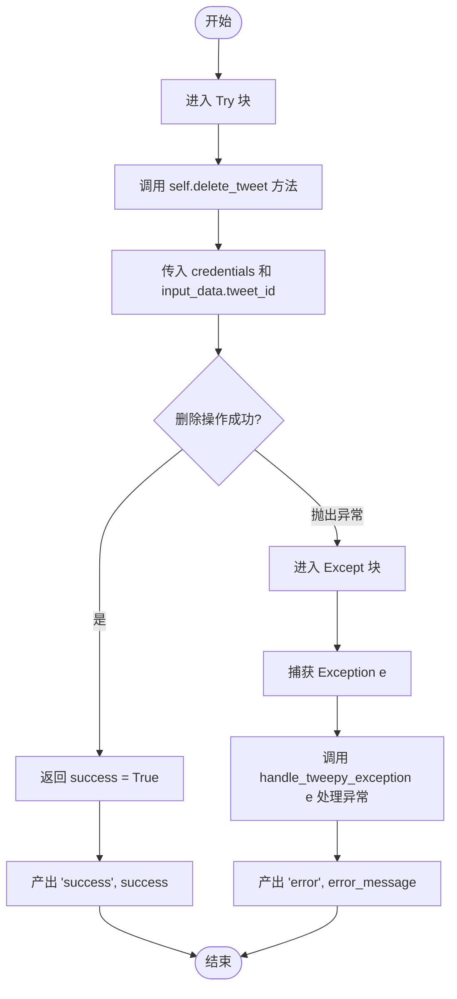
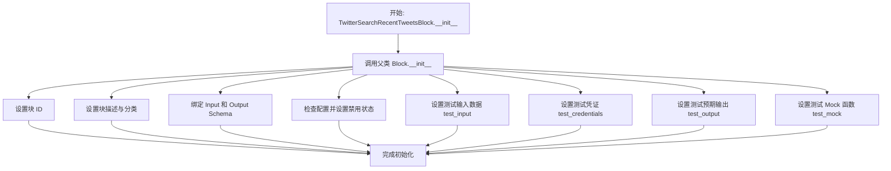
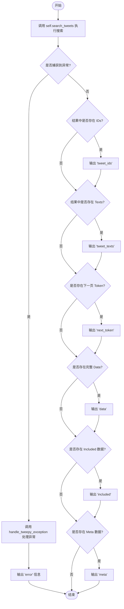

# `AutoGPT\autogpt_platform\backend\backend\blocks\twitter\tweets\manage.py` 详细设计文档

该代码定义了一系列用于与 Twitter API 交互的自动化 Block，包括推文发布、推文删除及最近推文搜索功能。它利用 tweepy 客户端进行 API 调用，结合 Pydantic 模型进行数据验证和序列化，并通过自定义的构建器和过滤器处理复杂的请求参数与响应数据。

## 整体流程



## 类结构

```
BaseModel (Pydantic 数据模型)
├── Media
├── DeepLink
├── Poll
├── Place
└── Quote
Block (框架基础类)
├── TwitterPostTweetBlock
│   ├── Input (嵌套类)
│   └── Output (嵌套类)
├── TwitterDeleteTweetBlock
│   ├── Input (嵌套类)
│   └── Output (嵌套类)
└── TwitterSearchRecentTweetsBlock
    ├── Input (嵌套类)
    └── Output (嵌套类)
```

## 全局变量及字段


### `Media.discriminator`
    
用于区分媒体附件类型的鉴别器字段

类型：`Literal["media"]`
    


### `Media.media_ids`
    
要附加到推文的媒体对象ID列表

类型：`Optional[List[str]]`
    


### `Media.media_tagged_user_ids`
    
要在媒体中标记的用户ID列表

类型：`Optional[List[str]]`
    


### `DeepLink.discriminator`
    
用于区分深度链接附件类型的鉴别器字段

类型：`Literal["deep_link"]`
    


### `DeepLink.direct_message_deep_link`
    
直接消息深度链接URL

类型：`Optional[str]`
    


### `Poll.discriminator`
    
用于区分轮询附件类型的鉴别器字段

类型：`Literal["poll"]`
    


### `Poll.poll_options`
    
推文轮询的选项列表

类型：`Optional[List[str]]`
    


### `Poll.poll_duration_minutes`
    
轮询持续的分钟数

类型：`Optional[int]`
    


### `Place.discriminator`
    
用于区分地点附件类型的鉴别器字段

类型：`Literal["place"]`
    


### `Place.place_id`
    
地点对象的ID

类型：`Optional[str]`
    


### `Quote.discriminator`
    
用于区分引用推文附件类型的鉴别器字段

类型：`Literal["quote"]`
    


### `Quote.quote_tweet_id`
    
要引用或转推的推文ID

类型：`Optional[str]`
    


### `TwitterPostTweetBlock.Input`
    
定义发布推文所需输入字段的模式

类型：`BlockSchemaInput`
    


### `TwitterPostTweetBlock.Output`
    
定义发布推文返回输出字段的模式

类型：`BlockSchemaOutput`
    


### `TwitterPostTweetBlock.Input.credentials`
    
用于向Twitter API进行身份验证的凭据

类型：`TwitterCredentialsInput`
    


### `TwitterPostTweetBlock.Input.tweet_text`
    
要发布的推文文本

类型：`str | None`
    


### `TwitterPostTweetBlock.Input.for_super_followers_only`
    
专门为超级关注者发布的推文

类型：`bool`
    


### `TwitterPostTweetBlock.Input.attachment`
    
附加推文数据（媒体、深度链接、轮询、地点或引用）

类型：`Union[Media, DeepLink, Poll, Place, Quote] | None`
    


### `TwitterPostTweetBlock.Input.exclude_reply_user_ids`
    
要从回复推文线索中排除的用户ID

类型：`Optional[List[str]]`
    


### `TwitterPostTweetBlock.Input.in_reply_to_tweet_id`
    
正在回复的推文ID

类型：`Optional[str]`
    


### `TwitterPostTweetBlock.Input.reply_settings`
    
谁可以回复推文（mentionedUsers 或 following）

类型：`TweetReplySettingsFilter`
    


### `TwitterPostTweetBlock.Output.tweet_id`
    
所创建推文的ID

类型：`str`
    


### `TwitterPostTweetBlock.Output.tweet_url`
    
推文的URL

类型：`str`
    


### `TwitterPostTweetBlock.Output.error`
    
如果推文发布失败，则为错误消息

类型：`str`
    


### `TwitterDeleteTweetBlock.Input`
    
定义删除推文所需输入字段的模式

类型：`BlockSchemaInput`
    


### `TwitterDeleteTweetBlock.Output`
    
定义删除推文返回输出字段的模式

类型：`BlockSchemaOutput`
    


### `TwitterDeleteTweetBlock.Input.credentials`
    
用于向Twitter API进行身份验证的凭据

类型：`TwitterCredentialsInput`
    


### `TwitterDeleteTweetBlock.Input.tweet_id`
    
要删除的推文ID

类型：`str`
    


### `TwitterDeleteTweetBlock.Output.success`
    
推文是否成功删除

类型：`bool`
    


### `TwitterDeleteTweetBlock.Output.error`
    
如果推文删除失败，则为错误消息

类型：`str`
    


### `TwitterSearchRecentTweetsBlock.Input`
    
定义搜索推文所需输入字段的模式

类型：`TweetExpansionInputs, TweetTimeWindowInputs`
    


### `TwitterSearchRecentTweetsBlock.Output`
    
定义搜索推文返回输出字段的模式

类型：`BlockSchemaOutput`
    


### `TwitterSearchRecentTweetsBlock.Input.credentials`
    
用于向Twitter API进行身份验证的凭据

类型：`TwitterCredentialsInput`
    


### `TwitterSearchRecentTweetsBlock.Input.query`
    
搜索查询（最多1024个字符）

类型：`str`
    


### `TwitterSearchRecentTweetsBlock.Input.max_results`
    
每页最多结果数（10-500）

类型：`int`
    


### `TwitterSearchRecentTweetsBlock.Input.pagination`
    
用于分页的令牌

类型：`str | None`
    


### `TwitterSearchRecentTweetsBlock.Output.tweet_ids`
    
所有推文ID

类型：`list[str]`
    


### `TwitterSearchRecentTweetsBlock.Output.tweet_texts`
    
所有推文文本

类型：`list[str]`
    


### `TwitterSearchRecentTweetsBlock.Output.next_token`
    
用于分页的下一个令牌

类型：`str`
    


### `TwitterSearchRecentTweetsBlock.Output.data`
    
完整的推文数据

类型：`list[dict]`
    


### `TwitterSearchRecentTweetsBlock.Output.included`
    
通过Expansions字段请求的附加数据

类型：`dict`
    


### `TwitterSearchRecentTweetsBlock.Output.meta`
    
提供元数据，例如分页信息或结果计数

类型：`dict`
    
    

## 全局函数及方法


### `TwitterPostTweetBlock.__init__`

该方法用于初始化 `TwitterPostTweetBlock` 类，配置块的基本元数据（如ID、描述、分类）、输入输出模式、测试凭据、测试输入输出以及模拟执行逻辑，并检查 Twitter OAuth 配置状态。

参数：

- `self`：`TwitterPostTweetBlock`，表示类实例本身。

返回值：`None`，无返回值。

#### 流程图



#### 带注释源码

```python
    def __init__(self):
        # 调用父类 Block 的初始化方法，传入配置参数
        super().__init__(
            # 定义块的唯一标识符
            id="7bb0048a-a630-11ef-aeb8-abc0dadb9b12",
            # 描述块的功能
            description="This block posts a tweet on Twitter.",
            # 将块归类为 SOCIAL（社交）类别
            categories={BlockCategory.SOCIAL},
            # 指定输入数据的结构模式，使用内部定义的 Input 类
            input_schema=TwitterPostTweetBlock.Input,
            # 指定输出数据的结构模式，使用内部定义的 Output 类
            output_schema=TwitterPostTweetBlock.Output,
            # 如果 Twitter OAuth 未配置，则禁用该块
            disabled=not TWITTER_OAUTH_IS_CONFIGURED,
            # 定义用于测试的输入数据样本
            test_input={
                "tweet_text": "This is a test tweet.",
                "credentials": TEST_CREDENTIALS_INPUT,
                "attachment": {
                    "discriminator": "deep_link",
                    "direct_message_deep_link": "https://twitter.com/messages/compose",
                },
                "for_super_followers_only": False,
                "exclude_reply_user_ids": [],
                "in_reply_to_tweet_id": "",
            },
            # 指定测试时使用的凭据
            test_credentials=TEST_CREDENTIALS,
            # 定义预期的测试输出结果
            test_output=[
                ("tweet_id", "1234567890"),
                ("tweet_url", "https://twitter.com/user/status/1234567890"),
            ],
            # 配置模拟执行逻辑，避免测试时真实调用 Twitter API
            # 这里模拟 post_tweet 方法返回固定的 ID 和 URL
            test_mock={
                "post_tweet": lambda *args, **kwargs: (
                    "1234567890",
                    "https://twitter.com/user/status/1234567890",
                )
            },
        )
```


### `TwitterPostTweetBlock.post_tweet`

该方法负责通过 Twitter API 发布推文，支持文本内容、超级粉丝设置、回复设置以及多种类型的附件（媒体、深度链接、投票、地点或引用推文）。

参数：

- `credentials`：`TwitterCredentials`，用于认证的 Twitter 凭证对象，包含访问令牌。
- `input_txt`：`str | None`，要发布的推文文本内容。
- `attachment`：`Union[Media, DeepLink, Poll, Place, Quote] | None`，推文的附加数据对象，可以是媒体、深度链接、投票、地点或引用推文。
- `for_super_followers_only`：`bool`，标记该推文是否仅对超级粉丝可见。
- `exclude_reply_user_ids`：`Optional[List[str]]`，在回复推文时需要排除的用户 ID 列表。
- `in_reply_to_tweet_id`：`Optional[str]`，所回复的原始推文 ID。
- `reply_settings`：`TweetReplySettingsFilter`，设置谁可以回复该推文（例如：提及的用户、关注者等）。

返回值：`tuple[str, str]`，包含新创建推文的 ID (str) 和推文 URL (str) 的元组。

#### 流程图



#### 带注释源码

```python
def post_tweet(
    self,
    credentials: TwitterCredentials,
    input_txt: str | None,
    attachment: Union[Media, DeepLink, Poll, Place, Quote] | None,
    for_super_followers_only: bool,
    exclude_reply_user_ids: Optional[List[str]],
    in_reply_to_tweet_id: Optional[str],
    reply_settings: TweetReplySettingsFilter,
):
    try:
        # 1. 初始化 Tweepy 客户端，使用 Bearer Token 进行认证
        client = tweepy.Client(
            bearer_token=credentials.access_token.get_secret_value()
        )

        # 2. 使用构建器模式组装基础请求参数
        params = (
            TweetPostBuilder()
            .add_text(input_txt)
            .add_super_followers(for_super_followers_only)
            .add_reply_settings(
                exclude_reply_user_ids or [],
                in_reply_to_tweet_id or "",
                reply_settings,
            )
        )

        # 3. 根据 attachment 的具体类型，添加相应的附件参数
        if isinstance(attachment, Media):
            params.add_media(
                attachment.media_ids or [], attachment.media_tagged_user_ids or []
            )
        elif isinstance(attachment, DeepLink):
            params.add_deep_link(attachment.direct_message_deep_link or "")
        elif isinstance(attachment, Poll):
            params.add_poll_options(attachment.poll_options or [])
            params.add_poll_duration(attachment.poll_duration_minutes or 0)
        elif isinstance(attachment, Place):
            params.add_place(attachment.place_id or "")
        elif isinstance(attachment, Quote):
            params.add_quote(attachment.quote_tweet_id or "")

        # 4. 调用 Twitter API 创建推文
        tweet = cast(Response, client.create_tweet(**params.build()))

        # 5. 检查响应数据，确保推文创建成功
        if not tweet.data:
            raise Exception("Failed to create tweet")

        # 6. 提取推文 ID 并生成推文 URL
        tweet_id = tweet.data["id"]
        tweet_url = f"https://twitter.com/user/status/{tweet_id}"
        return str(tweet_id), tweet_url

    # 捕获 Tweepy 特定异常和通用异常，并向上抛出供上层处理
    except tweepy.TweepyException:
        raise
    except Exception:
        raise
```


### `TwitterPostTweetBlock.run`

执行 Twitter 推文发布的主要异步方法，负责协调输入参数处理、调用底层 API 发布逻辑，并将成功结果或错误信息以生成器的形式输出。

参数：

- `input_data`：`Input`，包含推文文本、附件（媒体、链接、投票等）、回复设置及超级粉丝限定等配置的输入数据模型。
- `credentials`：`TwitterCredentials`，包含访问令牌等认证信息的 Twitter 凭据对象。
- `**kwargs`：`dict`，额外的关键字参数，通常由框架传递。

返回值：`BlockOutput`，一个异步生成器，成功时产出 `tweet_id` 和 `tweet_url`，失败时产出 `error`。

#### 流程图



#### 带注释源码

```python
    async def run(
        self,
        input_data: Input,
        *,
        credentials: TwitterCredentials,
        **kwargs,
    ) -> BlockOutput:
        try:
            # 调用内部方法 post_tweet 执行实际的 API 请求
            # 传入解构后的 input_data 属性，包括文本、附件、回复设置等
            tweet_id, tweet_url = self.post_tweet(
                credentials,
                input_data.tweet_text,
                input_data.attachment,
                input_data.for_super_followers_only,
                input_data.exclude_reply_user_ids,
                input_data.in_reply_to_tweet_id,
                input_data.reply_settings,
            )
            # 成功发布后，产出推文的唯一 ID
            yield "tweet_id", tweet_id
            # 产出推文的完整 URL
            yield "tweet_url", tweet_url

        except Exception as e:
            # 捕获执行过程中的任何异常
            # 使用专门的异常处理函数转换错误信息，并产出 'error' 键
            yield "error", handle_tweepy_exception(e)
```


### `TwitterDeleteTweetBlock.__init__`

该方法是 `TwitterDeleteTweetBlock` 类的构造函数，负责初始化块的基本元数据、输入输出模式、类别分类以及测试相关的配置（如测试输入、模拟输出等），并调用父类 `Block` 的构造函数完成注册。

参数：

- `self`：`TwitterDeleteTweetBlock`，类的实例本身。

返回值：`None`，无返回值。

#### 流程图



#### 带注释源码

```python
def __init__(self):
    # 调用父类 Block 的构造函数，传入块的各种配置参数
    super().__init__(
        # 定义该块在系统中的唯一标识符
        id="761babf0-a630-11ef-a03d-abceb082f58f",
        # 描述该块的功能：删除 Twitter 上的推文
        description="This block deletes a tweet on Twitter.",
        # 将该块归类为 SOCIAL（社交）类别
        categories={BlockCategory.SOCIAL},
        # 指定输入数据的结构定义类，包含 credentials 和 tweet_id
        input_schema=TwitterDeleteTweetBlock.Input,
        # 指定输出数据的结构定义类，包含 success 和 error
        output_schema=TwitterDeleteTweetBlock.Output,
        # 根据全局变量决定是否禁用该块，如果 OAuth 未配置则禁用
        disabled=not TWITTER_OAUTH_IS_CONFIGURED,
        # 定义用于测试/文档展示的输入数据示例
        test_input={
            "tweet_id": "1234567890",
            "credentials": TEST_CREDENTIALS_INPUT,
        },
        # 指定测试时使用的凭证对象
        test_credentials=TEST_CREDENTIALS,
        # 定义测试时预期的输出结果
        test_output=[("success", True)],
        # 定义测试时的模拟行为，避免实际调用 API，直接返回 True
        test_mock={"delete_tweet": lambda *args, **kwargs: True},
    )
```


### `TwitterDeleteTweetBlock.delete_tweet`

删除指定ID的推文。

参数：

-  `credentials`：`TwitterCredentials`，用于验证请求的Twitter API凭证对象。
-  `tweet_id`：`str`，要删除的推文的唯一标识符。

返回值：`bool`，如果推文删除成功则返回 True，否则抛出异常。

#### 流程图



#### 带注释源码

```python
    @staticmethod
    def delete_tweet(credentials: TwitterCredentials, tweet_id: str):
        try:
            # 使用凭证中的访问令牌初始化 Tweepy 客户端
            client = tweepy.Client(
                bearer_token=credentials.access_token.get_secret_value()
            )
            # 调用 API 删除指定 ID 的推文，user_auth=False 表示使用 App-only 认证或 Bearer Token
            client.delete_tweet(id=tweet_id, user_auth=False)
            # 如果未抛出异常，返回 True 表示删除成功
            return True
        except tweepy.TweepyException:
            # 捕获 Tweepy 特定的异常并重新抛出，由上层处理
            raise
        except Exception:
            # 捕获其他通用异常并重新抛出
            raise
```


### `TwitterDeleteTweetBlock.run`

执行删除推文的主要逻辑，接收输入数据和认证凭据，调用Twitter API删除指定推文，并返回操作结果或错误信息。

参数：

-  `input_data`：`Input`，包含输入数据的模式对象，其中包含待删除的推文ID（tweet_id）。
-  `credentials`：`TwitterCredentials`，Twitter 认证凭据对象，包含访问令牌等用于 API 请求的授权信息。
-  `**kwargs`：`dict`，扩展的关键字参数，用于传递额外的上下文或平台特定参数。

返回值：`BlockOutput`，异步生成器，产生包含输出字段名称和对应值的元组（例如 `("success", True)` 或 `("error", "message")`）。

#### 流程图



#### 带注释源码

```python
    async def run(
        self,
        input_data: Input,
        *,
        credentials: TwitterCredentials,
        **kwargs,
    ) -> BlockOutput:
        try:
            # 调用静态方法 delete_tweet 执行删除操作
            # 传入认证凭据和从输入数据中获取的推文ID
            success = self.delete_tweet(
                credentials,
                input_data.tweet_id,
            )
            # 如果成功，产出 "success" 字段和布尔值 True
            yield "success", success

        except Exception as e:
            # 如果过程中发生异常，捕获异常并处理
            # 使用 handle_tweepy_exception 将异常转换为用户友好的错误信息
            yield "error", handle_tweepy_exception(e)
```


### `TwitterSearchRecentTweetsBlock.__init__`

该方法是 `TwitterSearchRecentTweetsBlock` 类的构造函数，负责初始化块的元数据、输入输出 Schema、分类信息以及用于测试的配置数据（包括模拟输入、凭证、输出和 Mock 函数）。它通过调用父类 `Block` 的构造函数来完成这些设置。

参数：

-  `self`：`TwitterSearchRecentTweetsBlock`，类的实例本身，指代当前正在初始化的对象。

返回值：`None`，构造函数不返回任何值，仅完成对象的初始化。

#### 流程图



#### 带注释源码

```python
    def __init__(self):
        # 调用父类 Block 的构造函数，传入配置参数以定义该块的行为和属性
        super().__init__(
            # 块的唯一标识符
            id="53e5cf8e-a630-11ef-ba85-df6d666fa5d5",
            # 块的功能描述文本
            description="This block searches all public Tweets in Twitter history.",
            # 将块归类为社交媒体类别
            categories={BlockCategory.SOCIAL},
            # 定义输入数据的结构验证 Schema
            input_schema=TwitterSearchRecentTweetsBlock.Input,
            # 定义输出数据的结构验证 Schema
            output_schema=TwitterSearchRecentTweetsBlock.Output,
            # 根据全局 OAuth 配置状态决定是否禁用该块
            disabled=not TWITTER_OAUTH_IS_CONFIGURED,
            # 定义用于单元测试或示例运行的输入数据
            test_input={
                "query": "from:twitterapi #twitterapi",
                "credentials": TEST_CREDENTIALS_INPUT,
                "max_results": 2,
                "start_time": "2024-12-14T18:30:00.000Z",
                "end_time": "2024-12-17T18:30:00.000Z",
                "since_id": None,
                "until_id": None,
                "sort_order": None,
                "pagination": None,
                "expansions": None,
                "media_fields": None,
                "place_fields": None,
                "poll_fields": None,
                "tweet_fields": None,
                "user_fields": None,
            },
            # 指定测试使用的凭证对象
            test_credentials=TEST_CREDENTIALS,
            # 定义执行测试时期望得到的输出结果列表
            test_output=[
                ("tweet_ids", ["1373001119480344583", "1372627771717869568"]),
                (
                    "tweet_texts",
                    [
                        "Looking to get started with the Twitter API but new to APIs in general?",
                        "Thanks to everyone who joined and made today a great session!",
                    ],
                ),
                (
                    "data",
                    [
                        {
                            "id": "1373001119480344583",
                            "text": "Looking to get started with the Twitter API but new to APIs in general?",
                        },
                        {
                            "id": "1372627771717869568",
                            "text": "Thanks to everyone who joined and made today a great session!",
                        },
                    ],
                ),
            ],
            # 定义 Mock 函数，用于在测试环境中模拟 'search_tweets' 方法的执行行为，避免真实 API 调用
            test_mock={
                "search_tweets": lambda *args, **kwargs: (
                    ["1373001119480344583", "1372627771717869568"],
                    [
                        "Looking to get started with the Twitter API but new to APIs in general?",
                        "Thanks to everyone who joined and made today a great session!",
                    ],
                    [
                        {
                            "id": "1373001119480344583",
                            "text": "Looking to get started with the Twitter API but new to APIs in general?",
                        },
                        {
                            "id": "1372627771717869568",
                            "text": "Thanks to everyone who joined and made today a great session!",
                        },
                    ],
                    {},
                    {},
                    None,
                )
            },
        )
```


### `TwitterSearchRecentTweetsBlock.search_tweets`

该方法是一个静态方法，负责使用 Twitter API (通过 `tweepy` 库) 搜索最近的推文。它构建查询参数，处理时间窗口、字段扩展和分页，并将原始 API 响应序列化为结构化的数据格式，返回推文 ID、文本、完整数据、附加信息（如用户或媒体信息）、元数据以及分页令牌。

参数：

-   `credentials`: `TwitterCredentials`，Twitter API 的认证凭证对象，包含用于访问 API 的令牌。
-   `query`: `str`，搜索查询字符串，用于匹配推文内容。
-   `max_results`: `int`，每页返回的最大结果数量（通常在 10 到 100 之间，视 API 版本而定）。
-   `start_time`: `datetime | None`，搜索的起始时间（UTC），用于过滤该时间之后发布的推文。
-   `end_time`: `datetime | None`，搜索的结束时间（UTC），用于过滤该时间之前发布的推文。
-   `since_id`: `str | None`，返回 ID 大于此 ID 的推文，常用于增量同步。
-   `until_id`: `str | None`，返回 ID 小于此 ID 的推文。
-   `sort_order`: `str | None`，指定结果的排序顺序（例如 relevancy 或 recency）。
-   `pagination`: `str | None`，用于获取下一页结果的分页令牌。
-   `expansions`: `ExpansionFilter | None`，扩展对象，用于请求与推文相关的附加数据（如作者信息、附加媒体等）。
-   `media_fields`: `TweetMediaFieldsFilter | None`，媒体字段过滤器，指定返回媒体对象的哪些字段。
-   `place_fields`: `TweetPlaceFieldsFilter | None`，地点字段过滤器，指定返回地点对象的哪些字段。
-   `poll_fields`: `TweetPollFieldsFilter | None`，投票字段过滤器，指定返回投票对象的哪些字段。
-   `tweet_fields`: `TweetFieldsFilter | None`，推文字段过滤器，指定返回推文对象的哪些字段。
-   `user_fields`: `TweetUserFieldsFilter | None`，用户字段过滤器，指定返回用户对象的哪些字段。

返回值：`tuple[list[str], list[str], list[dict], dict, dict, str | None]`，包含以下内容的元组：推文 ID 列表、推文文本列表、序列化后的完整推文数据列表、序列化后的附加扩展数据（如用户、媒体）、元数据（包含结果计数等）、以及下一页的分页令牌。

#### 流程图

```mermaid
flowchart TD
    A[开始: search_tweets] --> B[初始化 tweepy.Client]
    B --> C[构建基础查询参数<br>TweetSearchBuilder]
    C --> D[构建扩展参数<br>TweetExpansionsBuilder]
    D --> E[构建时间窗口参数<br>TweetDurationBuilder]
    E --> F[调用 client.search_recent_tweets]
    F --> G{响应是否有效?<br>data 或 meta 存在?}
    G -- 否 --> H[抛出异常: No tweets found]
    G -- 是 --> I[从 response.meta 提取 next_token]
    I --> J[序列化 response.includes -> included]
    J --> K[序列化 response.data -> data]
    K --> L{response.data 是否存在?}
    L -- 否 --> H
    L -- 是 --> M[提取 tweet_ids 和 tweet_texts]
    M --> N[返回元组 (ids, texts, data, included, meta, next_token)]
    N --> O[结束]
    
    style H fill:#f99,stroke:#333,stroke-width:2px
```

#### 带注释源码

```python
    @staticmethod
    def search_tweets(
        credentials: TwitterCredentials,
        query: str,
        max_results: int,
        start_time: datetime | None,
        end_time: datetime | None,
        since_id: str | None,
        until_id: str | None,
        sort_order: str | None,
        pagination: str | None,
        expansions: ExpansionFilter | None,
        media_fields: TweetMediaFieldsFilter | None,
        place_fields: TweetPlaceFieldsFilter | None,
        poll_fields: TweetPollFieldsFilter | None,
        tweet_fields: TweetFieldsFilter | None,
        user_fields: TweetUserFieldsFilter | None,
    ):
        try:
            # 1. 初始化 Tweepy 客户端，使用凭证中的 bearer token
            client = tweepy.Client(
                bearer_token=credentials.access_token.get_secret_value()
            )

            # 2. 构建基础搜索参数 (查询和分页)
            # TweetSearchBuilder 负责处理 query, max_results 和 pagination token
            params = (
                TweetSearchBuilder()
                .add_query(query)
                .add_pagination(max_results, pagination)
                .build()
            )

            # 3. 构建扩展参数 (请求额外的关联数据，如用户、媒体等)
            # TweetExpansionsBuilder 在现有 params 基础上添加 expansions 和各类字段过滤器
            params = (
                TweetExpansionsBuilder(params)
                .add_expansions(expansions)
                .add_media_fields(media_fields)
                .add_place_fields(place_fields)
                .add_poll_fields(poll_fields)
                .add_tweet_fields(tweet_fields)
                .add_user_fields(user_fields)
                .build()
            )

            # 4. 构建时间窗口参数 (过滤特定时间段或 ID 范围的推文)
            # TweetDurationBuilder 添加时间范围、ID 范围和排序顺序
            params = (
                TweetDurationBuilder(params)
                .add_start_time(start_time)
                .add_end_time(end_time)
                .add_since_id(since_id)
                .add_until_id(until_id)
                .add_sort_order(sort_order)
                .build()
            )

            # 5. 执行 API 搜索请求
            response = cast(Response, client.search_recent_tweets(**params))

            # 6. 验证响应数据
            # 如果既没有数据也没有元数据，认为未找到推文
            if not response.data and not response.meta:
                raise Exception("No tweets found")

            # 初始化结果变量
            meta = {}
            tweet_ids = []
            tweet_texts = []
            next_token = None

            # 7. 处理元数据，提取下一页分页令牌
            if response.meta:
                meta = response.meta
                next_token = meta.get("next_token")

            # 8. 序列化附加数据 和推文数据
            # 使用自定义的 Serializer 将复杂对象转换为字典
            included = IncludesSerializer.serialize(response.includes)
            data = ResponseDataSerializer.serialize_list(response.data)

            # 9. 提取常用的推文 ID 和文本列表
            if response.data:
                tweet_ids = [str(tweet.id) for tweet in response.data]
                tweet_texts = [tweet.text for tweet in response.data]

                return tweet_ids, tweet_texts, data, included, meta, next_token

            # 如果此时 response.data 为空 (虽然有 meta)，依然抛出异常
            raise Exception("No tweets found")

        # 捕获 Tweepy 特定异常并重新抛出，由上层处理
        except tweepy.TweepyException:
            raise
```


### `TwitterSearchRecentTweetsBlock.run`

该方法是 `TwitterSearchRecentTweetsBlock` 的核心执行逻辑，负责协调输入参数的提取、调用底层搜索接口、处理返回结果以及捕获异常。它将用户的搜索请求转发给 Twitter API，并将原始响应转换为标准化的输出格式（如推文 ID 列表、文本列表、完整数据对象等）。

参数：

-  `input_data`：`TwitterSearchRecentTweetsBlock.Input`，包含搜索查询、时间范围、分页参数、扩展字段及各种过滤条件的输入数据对象。
-  `credentials`：`TwitterCredentials`，用于认证和授权访问 Twitter API 的凭证对象。
-  `**kwargs`：`dict`，额外的关键字参数，用于扩展或传递上下文信息。

返回值：`BlockOutput` (AsyncGenerator)，一个异步生成器，逐步产生包含搜索结果（如 `tweet_ids`、`tweet_texts`、`data` 等）或错误信息（`error`）的键值对。

#### 流程图



#### 带注释源码

```python
    async def run(
        self,
        input_data: Input,
        *,
        credentials: TwitterCredentials,
        **kwargs,
    ) -> BlockOutput:
        try:
            # 调用静态方法 search_tweets 执行实际的 Twitter API 搜索请求
            # 传入凭证以及从 input_data 中提取的各种查询参数（如 query, max_results 等）
            ids, texts, data, included, meta, next_token = self.search_tweets(
                credentials,
                input_data.query,
                input_data.max_results,
                input_data.start_time,
                input_data.end_time,
                input_data.since_id,
                input_data.until_id,
                input_data.sort_order,
                input_data.pagination,
                input_data.expansions,
                input_data.media_fields,
                input_data.place_fields,
                input_data.poll_fields,
                input_data.tweet_fields,
                input_data.user_fields,
            )
            
            # 如果返回了推文 ID 列表，则输出 'tweet_ids'
            if ids:
                yield "tweet_ids", ids
            # 如果返回了推文文本列表，则输出 'tweet_texts'
            if texts:
                yield "tweet_texts", texts
            # 如果存在用于获取下一页结果的 Token，则输出 'next_token'
            if next_token:
                yield "next_token", next_token
            # 如果存在完整的推文数据字典列表，则输出 'data'
            if data:
                yield "data", data
            # 如果存在包含媒体、用户等扩展信息的字典，则输出 'included'
            if included:
                yield "included", included
            # 如果存在包含元数据（如结果计数）的字典，则输出 'meta'
            if meta:
                yield "meta", meta

        except Exception as e:
            # 捕获搜索过程中发生的任何异常
            # 调用 handle_tweepy_exception 将异常转换为用户友好的错误信息并输出
            yield "error", handle_tweepy_exception(e)
```


## 关键组件


### 附件数据模型
定义推文附件（媒体、深度链接、民意调查等）结构的 Pydantic 模型，使用判别器支持类型安全的联合类型输入。
### Twitter 功能块
封装推文发布、删除及搜索业务逻辑的核心类，继承自 Block 基类并定义了输入输出模式。
### API 参数构建器
通过构建器模式流式组装复杂 Twitter API 请求参数的辅助类，用于处理文本、附件、过滤条件等配置。
### 响应序列化器
将 Twitter API 原始响应对象转换为标准化字典格式的工具，用于处理数据扩展和结构化输出。


## 问题及建议


### 已知问题

-   **异步阻塞问题**：代码中 `TwitterPostTweetBlock`, `TwitterDeleteTweetBlock`, 和 `TwitterSearchRecentTweetsBlock` 的 `run` 方法被定义为 `async def`，但在其内部调用的 `tweepy.Client` 相关方法（如 `create_tweet`, `delete_tweet`, `search_recent_tweets`）都是同步阻塞调用。这会阻塞事件循环，降低高并发场景下的系统吞吐量。
-   **推文链接生成逻辑错误**：在 `TwitterPostTweetBlock` 的 `post_tweet` 方法中，推文 URL 被硬编码为 `f"https://twitter.com/user/status/{tweet_id}"`。这里的 `user` 是占位符，并不代表实际的用户名，导致生成的链接无法正确指向特定用户的推文。
-   **空搜索结果被视为异常**：在 `TwitterSearchRecentTweetsBlock` 的 `search_tweets` 方法中，当搜索结果为空（没有找到推文）时，代码抛出 `Exception("No tweets found")`。实际上，搜索无结果是一个正常的业务逻辑状态，不应作为异常处理，这增加了调用方的错误处理复杂度。
-   **冗余的异常捕获**：在 `post_tweet` 和 `delete_tweet` 等方法中，使用了 `except Exception: raise` 的模式捕获异常后立即重新抛出。这种写法没有任何实际意义，只会丢失部分堆栈上下文信息，并增加了代码冗余。

### 优化建议

-   **使用异步客户端**：将 `tweepy.Client` 替换为 `tweepy.AsyncClient`，利用 `await client.create_tweet(...)` 等异步调用，以匹配 `async run` 方法的异步上下文，避免阻塞事件循环。
-   **修复推文链接生成**：由于 `create_tweet` API 默认不返回用户信息，建议将 `tweet_url` 改为通用格式 `https://twitter.com/i/status/{tweet_id}`（该链接会自动重定向到正确的用户页面），或者在请求时通过 Expansions 参数获取 `author_id` 并进一步获取用户名来构建标准链接。
-   **优化空结果处理逻辑**：修改 `search_tweets` 方法，当没有搜索到推文时，返回空列表（`[]`）和空的元数据，而不是抛出异常。调用方可以通过检查 `tweet_ids` 是否为空来判断是否有结果。
-   **重构附件处理逻辑**：对于 `post_tweet` 中的 `attachment` 参数处理，建议使用 Python 3.10+ 的 `match/case` 语句或利用 Polymorphism（多态）来替代冗长的 `if-elif` 链式 `isinstance` 检查，提高代码的可读性和扩展性。
-   **简化方法参数传递**：`search_tweets` 方法拥有过多的参数（15个），建议引入一个配置对象（例如 `SearchQueryConfig`）或直接传递 `input_data` 对象，以简化函数签名并提高代码维护性。
-   **统一异常处理**：移除内部方法中无意义的 `except...raise` 代码块，仅保留外层 `run` 方法中对 `tweepy.TweepyException` 的捕获和转换处理。


## 其它


### 设计目标与约束

本代码旨在为自动化工作流系统提供模块化、可复用的 Twitter API v2 交互组件。主要设计目标包括封装底层 API 调用复杂性，提供统一的输入输出接口，以及支持推文的发布、删除和搜索功能。设计约束包括：必须在运行时提供有效的 Twitter OAuth 凭证（特别是具有特定权限如 `tweet.write` 或 `tweet.read` 的 Bearer Token）；所有输入数据必须符合 Pydantic 定义的模型规范；若后端未配置 Twitter OAuth，这些 Block 将自动禁用以防止运行时错误。

### 外部依赖与接口契约

外部依赖主要分为三类：
1.  **第三方库**：核心依赖 `tweepy` 用于与 Twitter API 进行 HTTP 通信，依赖 `pydantic` 进行数据模型验证和序列化，以及 Python 标准库 `datetime` 处理时间参数。
2.  **内部模块**：依赖 `backend.blocks.twitter._auth` 进行凭证管理，`backend.blocks.twitter._builders` 构建请求参数，`backend.blocks.twitter._serializer` 处理复杂的响应数据，以及 `backend.data.block` 提供基础 Block 类定义。
3.  **接口契约**：代码遵循严格的契约，`run` 方法接收符合 `BlockSchemaInput` 的数据，并必须生成符合 `BlockSchemaOutput` 的键值对。与 Twitter API 的交互遵循 Twitter API v2 的 JSON 请求与响应结构，例如期望 `client.create_tweet` 返回包含 `data` 字段的 `Response` 对象。

### 错误处理与异常设计

采用统一的异常捕获与转换策略。所有涉及外部 API 调用的核心逻辑（如 `post_tweet`, `delete_tweet`, `search_tweets`）均包裹在 `try-except` 块中。系统专门捕获 `tweepy.TweepyException` 和通用 `Exception`。捕获到的异常不会直接抛出给工作流引擎，而是通过 `handle_tweepy_exception` 辅助函数处理，将其转换为用户可读的字符串信息。最终，错误信息通过 `yield "error", message` 的方式输出，确保单个 Block 的失败不会导致整个工作流崩溃，而是作为该 Block 的一个输出结果传递，实现了故障隔离。

### 数据流与状态机

数据流遵循单向管道模式，不维护内部状态机，每次执行均为无状态操作：
1.  **输入阶段**：异步 `run` 方法接收经过 Pydantic 验证的输入数据（凭证、推文内容、查询参数等）。
2.  **构建阶段**：输入数据被传递给特定的 Builder 类（如 `TweetPostBuilder`, `TweetSearchBuilder`），这些类负责将业务逻辑对象转换为符合 Twitter API 规范的字典参数。
3.  **执行阶段**：使用 `tweepy.Client` 发起同步阻塞式 HTTP 请求到 Twitter 服务器。
4.  **处理阶段**：接收原始响应，对于复杂搜索结果，使用 `IncludesSerializer` 和 `ResponseDataSerializer` 进行标准化格式化；对于简单操作，直接提取 ID 或 URL。
5.  **输出阶段**：处理后的数据通过 Python 生成器（`yield`）逐个字段返回给调用方，实现了流式的数据输出。

### 并发模型

代码在接口层采用异步编程模型（`async def run`），旨在配合非阻塞的工作流执行引擎。然而，由于底层依赖的 `tweepy` 库主要提供同步 API，因此实际的 I/O 操作（网络请求）是同步阻塞的。这意味着在执行 `client.create_tweet` 或 `client.search_recent_tweets` 时，事件循环会被阻塞，直到网络请求完成。这种设计适用于 Twitter API 调用延迟相对较短且对极高并发要求不高的场景，但在高负载下可能会影响整体吞吐量。

    