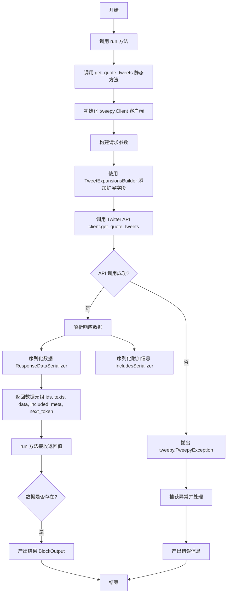
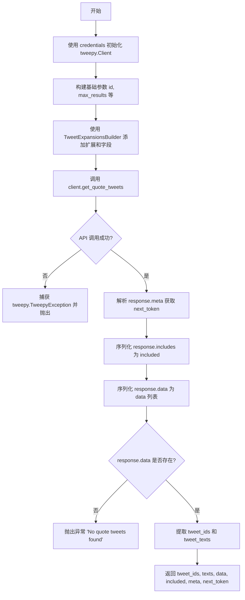
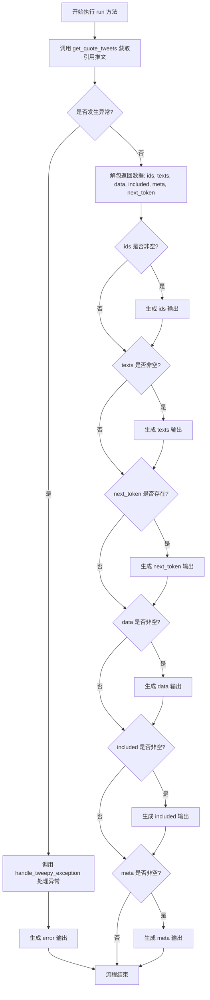
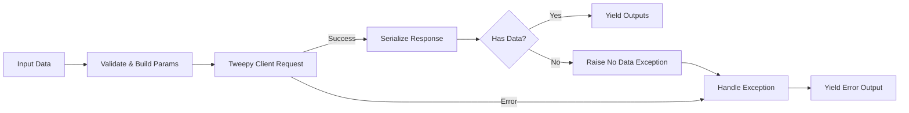

# `AutoGPT\autogpt_platform\backend\backend\blocks\twitter\tweets\quote.py` 详细设计文档

该代码实现了一个自定义的 Twitter 功能块，用于获取指定推文的引用推文列表。它封装了与 Twitter API 的交互逻辑，处理用户认证、请求参数构建（包括分页和扩展字段）、API 调用、数据序列化以及错误处理，最终返回包含推文 ID、文本内容及元数据的结构化输出。

## 整体流程



## 类结构

```
Block (外部依赖基类)
└── TwitterGetQuoteTweetsBlock
    ├── Input (内部类)
    └── Output (内部类)
```

## 全局变量及字段


### `TwitterGetQuoteTweetsBlock.Input.credentials`
    
Twitter API credentials for authentication

类型：`TwitterCredentialsInput`
    


### `TwitterGetQuoteTweetsBlock.Input.tweet_id`
    
ID of the tweet to get quotes for

类型：`str`
    


### `TwitterGetQuoteTweetsBlock.Input.max_results`
    
Number of results to return (max 100)

类型：`int | None`
    


### `TwitterGetQuoteTweetsBlock.Input.exclude`
    
Types of tweets to exclude

类型：`TweetExcludesFilter | None`
    


### `TwitterGetQuoteTweetsBlock.Input.pagination_token`
    
Token for pagination

类型：`str | None`
    


### `TwitterGetQuoteTweetsBlock.Output.ids`
    
All Tweet IDs

类型：`list`
    


### `TwitterGetQuoteTweetsBlock.Output.texts`
    
All Tweet texts

类型：`list`
    


### `TwitterGetQuoteTweetsBlock.Output.next_token`
    
Next token for pagination

类型：`str`
    


### `TwitterGetQuoteTweetsBlock.Output.data`
    
Complete Tweet data

类型：`list[dict]`
    


### `TwitterGetQuoteTweetsBlock.Output.included`
    
Additional data that you have requested via Expansions field

类型：`dict`
    


### `TwitterGetQuoteTweetsBlock.Output.meta`
    
Provides metadata such as pagination info or result counts

类型：`dict`
    
    

## 全局函数及方法


### `TwitterGetQuoteTweetsBlock.__init__`

初始化 TwitterGetQuoteTweetsBlock 实例，通过指定唯一标识符、描述、类别、输入/输出 schema、测试配置以及根据 OAuth 配置状态决定是否禁用该块。

参数：

-  `id`：`str`，块的唯一标识符。
-  `description`：`str`，块的功能描述。
-  `categories`：`set[BlockCategory]`，块所属的类别集合。
-  `input_schema`：`type`，定义输入数据结构的 Schema 类。
-  `output_schema`：`type`，定义输出数据结构的 Schema 类。
-  `disabled`：`bool`，指示块是否被禁用（取决于 Twitter OAuth 是否配置）。
-  `test_input`：`dict`，用于测试的模拟输入数据。
-  `test_credentials`：`TwitterCredentials`，用于测试的模拟凭据。
-  `test_output`：`list[tuple]`，用于验证的模拟输出数据。
-  `test_mock`：`dict`，用于模拟 API 调用的函数字典。

返回值：`None`，该方法为构造函数，无返回值。

#### 流程图

```mermaid
graph TD
    A[Start: __init__] --> B[Call super().__init__]
    B --> C[Set id: 9fbdd208...]
    B --> D[Set description]
    B --> E[Set categories: SOCIAL]
    B --> F[Set input_schema: Input]
    B --> G[Set output_schema: Output]
    B --> H{Check TWITTER_OAUTH_IS_CONFIGURED}
    H -- False --> I[Set disabled: True]
    H -- True --> J[Set disabled: False]
    B --> K[Set test_input dictionary]
    B --> L[Set test_credentials]
    B --> M[Set test_output list]
    B --> N[Set test_mock dictionary]
    N --> O[End: Initialization Complete]
```

#### 带注释源码

```python
def __init__(self):
    # 调用父类 Block 的初始化方法，配置块的基本元数据和行为
    super().__init__(
        # 设置块的唯一 UUID
        id="9fbdd208-a630-11ef-9b97-ab7a3a695ca3",
        # 设置块的描述文本，解释其功能
        description="This block gets quote tweets for a specific tweet.",
        # 将块归类为社交类
        categories={BlockCategory.SOCIAL},
        # 指定输入数据的 Schema 定义为内部类 Input
        input_schema=TwitterGetQuoteTweetsBlock.Input,
        # 指定输出数据的 Schema 定义为内部类 Output
        output_schema=TwitterGetQuoteTweetsBlock.Output,
        # 根据全局变量 Twitter OAuth 是否配置来决定是否禁用该块
        disabled=not TWITTER_OAUTH_IS_CONFIGURED,
        # 配置用于单元测试或示例的输入数据
        test_input={
            "tweet_id": "1234567890",
            "max_results": 2,
            "pagination_token": None,
            "credentials": TEST_CREDENTIALS_INPUT,
        },
        # 配置用于测试的凭据对象
        test_credentials=TEST_CREDENTIALS,
        # 配置预期的测试输出结果，用于验证逻辑
        test_output=[
            ("ids", ["12345", "67890"]),
            ("texts", ["Tweet 1", "Tweet 2"]),
            (
                "data",
                [
                    {"id": "12345", "text": "Tweet 1"},
                    {"id": "67890", "text": "Tweet 2"},
                ],
            ),
        ],
        # 配置测试模拟函数，当测试运行时，代替实际的 API 调用
        # 这里模拟了 get_quote_tweets 方法的返回值
        test_mock={
            "get_quote_tweets": lambda *args, **kwargs: (
                ["12345", "67890"],
                ["Tweet 1", "Tweet 2"],
                [
                    {"id": "12345", "text": "Tweet 1"},
                    {"id": "67890", "text": "Tweet 2"},
                ],
                {},
                {},
                None,
            )
        },
    )
```


### `TwitterGetQuoteTweetsBlock.get_quote_tweets`

该方法负责通过 Twitter API 获取指定推文的引用推文（Quote Tweets）。它构建请求参数（包括分页、排除类型和扩展字段），调用 API，并对响应数据进行序列化和提取，最后返回处理后的推文列表及相关元数据。

参数：

-  `credentials`：`TwitterCredentials`，包含访问令牌等认证信息的凭证对象。
-  `tweet_id`：`str`，需要获取引用推文的目标推文 ID。
-  `max_results`：`int | None`，返回结果的最大数量。
-  `exclude`：`TweetExcludesFilter | None`，指定需要排除的推文类型（如转推等）。
-  `pagination_token`：`str | None`，用于分页的令牌。
-  `expansions`：`ExpansionFilter | None`，请求扩展的对象字段。
-  `media_fields`：`TweetMediaFieldsFilter | None`，请求返回的媒体字段列表。
-  `place_fields`：`TweetPlaceFieldsFilter | None`，请求返回的地标字段列表。
-  `poll_fields`：`TweetPollFieldsFilter | None`，请求返回的投票字段列表。
-  `tweet_fields`：`TweetFieldsFilter | None`，请求返回的推文字段列表。
-  `user_fields`：`TweetUserFieldsFilter | None`，请求返回的用户字段列表。

返回值：`tuple[list[str], list[str], list[dict], dict, dict, str | None]`，包含引用推文 ID 列表、引用推文文本列表、完整数据列表、附加数据、元数据（如分页信息）以及下一页令牌的元组。

#### 流程图



#### 带注释源码

```python
    @staticmethod
    def get_quote_tweets(
        credentials: TwitterCredentials,
        tweet_id: str,
        max_results: int | None,
        exclude: TweetExcludesFilter | None,
        pagination_token: str | None,
        expansions: ExpansionFilter | None,
        media_fields: TweetMediaFieldsFilter | None,
        place_fields: TweetPlaceFieldsFilter | None,
        poll_fields: TweetPollFieldsFilter | None,
        tweet_fields: TweetFieldsFilter | None,
        user_fields: TweetUserFieldsFilter | None,
    ):
        try:
            # 使用不记名令牌（Bearer Token）初始化 Tweepy 客户端
            client = tweepy.Client(
                bearer_token=credentials.access_token.get_secret_value()
            )

            # 构建基础请求参数字典
            params = {
                "id": tweet_id,
                "max_results": max_results,
                # 处理分页令牌，空字符串转为 None
                "pagination_token": (
                    None if pagination_token == "" else pagination_token
                ),
                # 处理排除过滤器，空枚举转为 None
                "exclude": None if exclude == TweetExcludesFilter() else exclude,
                # 设置不使用用户认证（OAuth 2.0 Bearer Token 模式）
                "user_auth": False,
            }

            # 使用构建器模式添加各种扩展字段和过滤器
            params = (
                TweetExpansionsBuilder(params)
                .add_expansions(expansions)
                .add_media_fields(media_fields)
                .add_place_fields(place_fields)
                .add_poll_fields(poll_fields)
                .add_tweet_fields(tweet_fields)
                .add_user_fields(user_fields)
                .build()
            )

            # 调用 Tweepy 客户端获取引用推文
            response = cast(Response, client.get_quote_tweets(**params))

            # 初始化返回变量
            meta = {}
            tweet_ids = []
            tweet_texts = []
            next_token = None

            # 提取元数据中的分页令牌
            if response.meta:
                meta = response.meta
                next_token = meta.get("next_token")

            # 序列化附加数据和主要数据
            included = IncludesSerializer.serialize(response.includes)
            data = ResponseDataSerializer.serialize_list(response.data)

            # 如果响应中包含数据
            if response.data:
                # 提取所有推文 ID 和文本
                tweet_ids = [str(tweet.id) for tweet in response.data]
                tweet_texts = [tweet.text for tweet in response.data]

                # 返回提取的数据
                return tweet_ids, tweet_texts, data, included, meta, next_token

            # 如果没有找到引用推文，抛出异常
            raise Exception("No quote tweets found")

        except tweepy.TweepyException:
            # 捕获 Tweepy 特有异常并重新抛出，由上层处理
            raise
```


### `TwitterGetQuoteTweetsBlock.run`

该方法是 `TwitterGetQuoteTweetsBlock` 的核心执行入口，负责协调整个获取引用推文的流程。它接收包含配置参数的输入数据和认证凭据，调用静态方法获取原始数据，处理异常，并将解析后的数据（如 ID 列表、文本内容、分页令牌等）通过生成器逐步输出。

参数：

- `input_data`：`Input`，包含运行所需的所有输入参数，如推文 ID、最大结果数、排除类型、分页令牌及各种扩展字段设置。
- `credentials`：`TwitterCredentials`，Twitter API 认证凭据对象，包含用于请求的访问令牌。
- `**kwargs`：`dict`，额外的关键字参数，用于扩展或传递未显式定义的上下文信息。

返回值：`BlockOutput`，一个异步生成器，用于产生包含结果键（如 "ids", "texts", "data", "error"）及其对应值的元组。

#### 流程图



#### 带注释源码

```python
    async def run(
        self,
        input_data: Input,
        *,
        credentials: TwitterCredentials,
        **kwargs,
    ) -> BlockOutput:
        try:
            # 调用静态方法 get_quote_tweets，传入凭证和从 input_data 中提取的各类参数
            # 该方法负责与 Twitter API 交互并返回解析后的数据组件
            ids, texts, data, included, meta, next_token = self.get_quote_tweets(
                credentials,
                input_data.tweet_id,
                input_data.max_results,
                input_data.exclude,
                input_data.pagination_token,
                input_data.expansions,
                input_data.media_fields,
                input_data.place_fields,
                input_data.poll_fields,
                input_data.tweet_fields,
                input_data.user_fields,
            )
            
            # 根据数据是否存在，逐步生成输出
            # 这种方式允许调用方尽早获取可用数据
            if ids:
                yield "ids", ids
            if texts:
                yield "texts", texts
            if next_token:
                yield "next_token", next_token
            if data:
                yield "data", data
            if included:
                yield "included", included
            if meta:
                yield "meta", meta

        except Exception as e:
            # 捕获处理过程中发生的任何异常
            # 使用专用的异常处理函数转换错误信息，并输出 "error" 键
            yield "error", handle_tweepy_exception(e)
```


## 关键组件


### TwitterGetQuoteTweetsBlock

The main execution block responsible for orchestrating the retrieval of quote tweets from the Twitter API based on a specific tweet ID.

### Input Schema

Defines the structured input parameters required for the operation, including authentication credentials, tweet ID, pagination settings, and various field filters.

### Output Schema

Defines the structure of the response data, providing both high-level lists (IDs, texts) and detailed raw data, along with metadata for pagination.

### TweetExpansionsBuilder

A utility component responsible for dynamically constructing the API query parameters by chaining different expansion and field filter options.

### Data Serialization Components

Utilizes IncludesSerializer and ResponseDataSerializer to transform raw Tweepy response objects into structured, serializable dictionary formats.

### Twitter Credentials

Handles the management and validation of OAuth access tokens required to authenticate and authorize requests to the Twitter API.

### Exception Handling Strategy

Integrates with a dedicated exception handler to catch and standardize Tweepy API errors into consistent error outputs for the block.


## 问题及建议


### 已知问题

-   **空结果被误判为异常**：在 `get_quote_tweets` 方法中，当 Twitter API 返回空结果（即没有引用推文）时，代码抛出 `Exception("No quote tweets found")`。这种设计将正常的业务场景（无数据）错误地处理为异常流程，导致用户必须处理错误状态才能继续执行，实际上应该返回空列表或空结构。
-   **输出 Schema 不稳定**：在 `run` 方法中，使用了 `if ids:` 等条件判断来决定是否 `yield` 输出键。这意味着当数据为空时，输出字典中将缺失这些键（如 `ids`, `texts`, `data`）。这违反了静态 Schema 定义的原则，增加了下游节点处理数据时的复杂度（因为它们必须检查键是否存在）。
-   **硬编码的异常信息**：异常消息 "No quote tweets found" 是硬编码的字符串，不利于国际化或统一的错误代码管理。

### 优化建议

-   **统一返回值结构**：修改 `get_quote_tweets` 方法，当未找到推文时不抛出异常，而是返回空的列表、None 和空的 meta 数据。同时，修改 `run` 方法，确保无论是否有数据，都输出 Schema 中定义的所有键（例如空列表赋值给 `ids`，`None` 赋值给 `next_token`），保证输出结构的一致性。
-   **重构方法签名（减少参数数量）**：`get_quote_tweets` 静态方法接收了约 11 个参数，这属于“长参数列表”代码异味，降低了可读性和可维护性。建议引入一个配置对象（Pydantic 模型或数据类）来封装除凭证和 ID 之外的所有查询参数，或者直接传递 `Input` 对象的部分字段。
-   **细化异常处理策略**：将 Tweepy 的网络/认证异常与业务逻辑异常区分开。目前代码捕获所有 `Exception` 并通过 `handle_tweepy_exception` 处理，建议明确区分可重试的错误（如网络超时）和不可重试的错误（如 404 Not Found），以便上层调用者实施更灵活的重试策略。


## 其它


### 设计目标与约束

**设计目标：**
提供一个可重用的 Block 组件，用于通过 Twitter API v2 获取指定推文（Tweet ID）的引用推文。设计旨在兼顾易用性与灵活性，既支持普通用户快速获取推文 ID 和文本列表，也支持高级用户通过扩展字段获取完整的媒体、用户、地点等附加数据。

**设计约束：**
1.  **API 限制**：受 Twitter API 约束，单次请求返回的最大结果数（`max_results`）上限为 100。
2.  **认证依赖**：该 Block 必须在配置了有效的 Twitter OAuth 2.0 Bearer Token 环境下运行，且需要具备 `tweet.read` 和 `users.read` 权限。
3.  **异常处理约束**：若 API 调用成功但未找到引用推文（即结果集为空），系统会抛出异常并将其作为错误输出，而不是返回空列表。
4.  **无状态设计**：Block 自身不维护分页状态，调用者需手动处理 `next_token` 以进行分页遍历。

### 错误处理与异常设计

**异常处理策略：**
采用集中式异常捕获与转换机制，确保底层库抛出的异常能够被转换为系统统一的错误格式输出。

1.  **底层库异常（`tweepy.TweepyException`）：**
    *   在 `get_quote_tweets` 方法中捕获，并直接向上抛出。
    *   在 `run` 方法中捕获，通过 `handle_tweepy_exception` 函数将其转换为用户友好的错误消息或错误代码，并通过 `yield "error", ...` 输出。

2.  **业务逻辑异常（无数据）：**
    *   当 Twitter API 返回成功，但 `response.data` 为空时，代码显式抛出 `Exception("No quote tweets found")`。该异常随后被 `run` 方法的通用捕获块处理，作为错误输出传递给下游。

3.  **参数验证：**
    *   依赖 `backend.data.model` 的 Schema 机制进行输入参数的基础类型验证。
    *   对于 `pagination_token`，若为空字符串则视为 `None` 处理，避免传递无效值给 API。

### 数据流与状态机

**数据流：**
1.  **输入阶段**：外部系统注入 `input_data`（包含推文 ID、分页令牌、扩展参数等）和 `credentials`（OAuth 令牌）。
2.  **构建阶段**：`get_quote_tweets` 方法使用 `TweetExpansionsBuilder` 将分散的输入参数（如 `media_fields`, `user_fields`）组装成符合 Twitter API 规范的字典参数。
3.  **交互阶段**：`tweepy.Client` 使用 Bearer Token 发起异步 HTTP 请求（代码中为同步调用，但在异步上下文中运行）。
4.  **序列化阶段**：获取响应后，使用 `IncludesSerializer` 和 `ResponseDataSerializer` 将 Twitter API 的复杂对象模型（`Response`, `Data`）转换为标准的 Python 字典和列表。
5.  **输出阶段**：`run` 方法将处理后的数据解构，并通过 Python Generator (`yield`) 逐个输出字段（`ids`, `texts`, `data`, `next_token` 等）。

**状态机：**
该 Block 是无状态组件。其生命周期仅限于单次 `run` 调用，不保留任何会话信息。分页状态（`next_token`）由外部调用方维护和传入。



### 外部依赖与接口契约

**外部依赖库：**
1.  **`tweepy`**：Python 的 Twitter API 客户端库，用于处理底层 HTTP 请求和认证逻辑。

**内部依赖模块：**
1.  `backend.blocks.twitter._auth`：提供凭证输入模型和验证逻辑。
2.  `backend.blocks.twitter._builders`：提供 `TweetExpansionsBuilder` 用于构建复杂的 API 查询参数。
3.  `backend.blocks.twitter._serializer`：提供序列化器，将 API 响应对象转换为通用字典结构。
4.  `backend.data.block`：基础 Block 类定义。

**接口契约：**
*   **Twitter API v2 Endpoint**: `GET /2/tweets/:id/quote_tweets`
*   **认证方式**: OAuth 2.0 Bearer Token (App-Only 或 User Context 皆可，代码中使用 `bearer_token`)。
*   **输入契约**: 必须提供有效的 `tweet_id`。`max_results` 必须在 API 允许范围内（通常 5-100）。
*   **输出契约**: 返回一个生成器，产生键值对。成功的输出包含 `data`（列表）、`includes`（字典）、`meta`（字典）；失败的输出包含 `error`（字符串/对象）。

### 安全性与性能考量

**安全性：**
1.  **凭证管理**：使用 `TwitterCredentials` 类型封装敏感信息，通过 `get_secret_value()` 方法安全地访问 Access Token，避免日志打印时泄露明文。
2.  **权限最小化**：在输入定义中明确声明了所需的最小权限范围 `["tweet.read", "users.read", "offline.access"]`。

**性能考量：**
1.  **网络延迟**：`get_quote_tweets` 是 I/O 密集型操作，执行时间主要取决于 Twitter API 的响应速度。
2.  **数据序列化**：使用自定义的序列化器而非 JSON 库直接转换，以确保对象结构的准确性，避免不必要的递归或转换开销。
3.  **生成器输出**：`run` 方法使用 `yield` 逐个输出字段，允许在所有数据处理完成前就开始传递部分结果，降低内存峰值压力。

    