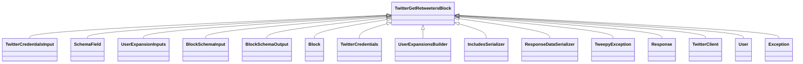

# `.\AutoGPT\autogpt_platform\backend\backend\blocks\twitter\tweets\retweet.py` 详细设计文档

This code defines a set of Twitter-related blocks for a data processing framework, including retweeting, removing retweets, and retrieving information about retweeters.

## 整体流程


## 类结构

```
TwitterRetweetBlock
├── TwitterRemoveRetweetBlock
└── TwitterGetRetweetersBlock
```

## 全局变量及字段


### `TEST_CREDENTIALS`
    
Test Twitter credentials used for testing purposes.

类型：`TwitterCredentials`
    


### `TEST_CREDENTIALS_INPUT`
    
Test Twitter credentials input used for testing purposes.

类型：`TwitterCredentialsInput`
    


### `TWITTER_OAUTH_IS_CONFIGURED`
    
Flag indicating if Twitter OAuth is configured.

类型：`bool`
    


### `TwitterCredentials`
    
Class representing Twitter credentials.

类型：`class`
    


### `TwitterCredentialsField`
    
Class representing a field in Twitter credentials.

类型：`class`
    


### `TwitterCredentialsInput`
    
Class representing input for Twitter credentials.

类型：`class`
    


### `UserExpansionsBuilder`
    
Class for building user expansions parameters.

类型：`class`
    


### `IncludesSerializer`
    
Class for serializing includes in Twitter responses.

类型：`class`
    


### `ResponseDataSerializer`
    
Class for serializing response data in Twitter responses.

类型：`class`
    


### `TweetFieldsFilter`
    
Class representing tweet fields filter.

类型：`class`
    


### `TweetUserFieldsFilter`
    
Class representing tweet user fields filter.

类型：`class`
    


### `UserExpansionInputs`
    
Class representing user expansion inputs.

类型：`class`
    


### `UserExpansionsFilter`
    
Class representing user expansions filter.

类型：`class`
    


### `Block`
    
Base class for blocks.

类型：`class`
    


### `BlockCategory`
    
Class representing block categories.

类型：`class`
    


### `BlockOutput`
    
Class representing block output.

类型：`class`
    


### `BlockSchemaInput`
    
Class representing block schema input.

类型：`class`
    


### `BlockSchemaOutput`
    
Class representing block schema output.

类型：`class`
    


### `SchemaField`
    
Class representing schema field.

类型：`class`
    


### `tweepy`
    
Tweepy module for interacting with Twitter API.

类型：`module`
    


### `Response`
    
Class representing a response from the Twitter API.

类型：`class`
    


### `TwitterRetweetBlock.id`
    
Unique identifier for the TwitterRetweetBlock.

类型：`str`
    


### `TwitterRetweetBlock.description`
    
Description of the TwitterRetweetBlock.

类型：`str`
    


### `TwitterRetweetBlock.categories`
    
Categories to which the TwitterRetweetBlock belongs.

类型：`set`
    


### `TwitterRetweetBlock.input_schema`
    
Input schema for the TwitterRetweetBlock.

类型：`BlockSchemaInput`
    


### `TwitterRetweetBlock.output_schema`
    
Output schema for the TwitterRetweetBlock.

类型：`BlockSchemaOutput`
    


### `TwitterRetweetBlock.disabled`
    
Flag indicating if the TwitterRetweetBlock is disabled.

类型：`bool`
    


### `TwitterRetweetBlock.test_input`
    
Test input data for the TwitterRetweetBlock.

类型：`dict`
    


### `TwitterRetweetBlock.test_credentials`
    
Test credentials for the TwitterRetweetBlock.

类型：`TwitterCredentials`
    


### `TwitterRetweetBlock.test_output`
    
Test output data for the TwitterRetweetBlock.

类型：`list`
    


### `TwitterRetweetBlock.test_mock`
    
Test mock data for the TwitterRetweetBlock.

类型：`dict`
    


### `TwitterRemoveRetweetBlock.id`
    
Unique identifier for the TwitterRemoveRetweetBlock.

类型：`str`
    


### `TwitterRemoveRetweetBlock.description`
    
Description of the TwitterRemoveRetweetBlock.

类型：`str`
    


### `TwitterRemoveRetweetBlock.categories`
    
Categories to which the TwitterRemoveRetweetBlock belongs.

类型：`set`
    


### `TwitterRemoveRetweetBlock.input_schema`
    
Input schema for the TwitterRemoveRetweetBlock.

类型：`BlockSchemaInput`
    


### `TwitterRemoveRetweetBlock.output_schema`
    
Output schema for the TwitterRemoveRetweetBlock.

类型：`BlockSchemaOutput`
    


### `TwitterRemoveRetweetBlock.disabled`
    
Flag indicating if the TwitterRemoveRetweetBlock is disabled.

类型：`bool`
    


### `TwitterRemoveRetweetBlock.test_input`
    
Test input data for the TwitterRemoveRetweetBlock.

类型：`dict`
    


### `TwitterRemoveRetweetBlock.test_credentials`
    
Test credentials for the TwitterRemoveRetweetBlock.

类型：`TwitterCredentials`
    


### `TwitterRemoveRetweetBlock.test_output`
    
Test output data for the TwitterRemoveRetweetBlock.

类型：`list`
    


### `TwitterRemoveRetweetBlock.test_mock`
    
Test mock data for the TwitterRemoveRetweetBlock.

类型：`dict`
    


### `TwitterGetRetweetersBlock.id`
    
Unique identifier for the TwitterGetRetweetersBlock.

类型：`str`
    


### `TwitterGetRetweetersBlock.description`
    
Description of the TwitterGetRetweetersBlock.

类型：`str`
    


### `TwitterGetRetweetersBlock.categories`
    
Categories to which the TwitterGetRetweetersBlock belongs.

类型：`set`
    


### `TwitterGetRetweetersBlock.input_schema`
    
Input schema for the TwitterGetRetweetersBlock.

类型：`UserExpansionInputs`
    


### `TwitterGetRetweetersBlock.output_schema`
    
Output schema for the TwitterGetRetweetersBlock.

类型：`BlockSchemaOutput`
    


### `TwitterGetRetweetersBlock.disabled`
    
Flag indicating if the TwitterGetRetweetersBlock is disabled.

类型：`bool`
    


### `TwitterGetRetweetersBlock.test_input`
    
Test input data for the TwitterGetRetweetersBlock.

类型：`dict`
    


### `TwitterGetRetweetersBlock.test_credentials`
    
Test credentials for the TwitterGetRetweetersBlock.

类型：`TwitterCredentials`
    


### `TwitterGetRetweetersBlock.test_output`
    
Test output data for the TwitterGetRetweetersBlock.

类型：`list`
    


### `TwitterGetRetweetersBlock.test_mock`
    
Test mock data for the TwitterGetRetweetersBlock.

类型：`dict`
    
    

## 全局函数及方法


### `handle_tweepy_exception`

This function handles exceptions raised by the Tweepy library.

参数：

- `e`：`Exception`，The exception to be handled.

返回值：`str`，A string describing the exception.

#### 流程图


#### 带注释源码

```python
def handle_tweepy_exception(e: Exception) -> str:
    """
    Handles exceptions raised by the Tweepy library.

    :param e: The exception to be handled.
    :return: A string describing the exception.
    """
    if isinstance(e, tweepy.TweepyException):
        return str(e)
    else:
        return str(e)
``` 


### TwitterRetweetBlock.retweet

Retweets a tweet on Twitter.

参数：

- `credentials`：`TwitterCredentials`，Twitter credentials object containing access token and secret.
- `tweet_id`：`str`，ID of the tweet to retweet.

返回值：`bool`，Whether the retweet was successful.

#### 流程图


#### 带注释源码

```python
@staticmethod
def retweet(
    credentials: TwitterCredentials,
    tweet_id: str,
):
    try:
        client = tweepy.Client(
            bearer_token=credentials.access_token.get_secret_value()
        )

        client.retweet(
            tweet_id=tweet_id,
            user_auth=False,
        )

        return True

    except tweepy.TweepyException:
        raise
```


### TwitterRemoveRetweetBlock.remove_retweet

Removes a retweet on Twitter.

参数：

- `credentials`：`TwitterCredentials`，Twitter credentials object containing access token and secret.
- `tweet_id`：`str`，ID of the tweet to remove retweet.

返回值：`bool`，Whether the retweet was successfully removed.

#### 流程图


#### 带注释源码

```python
@staticmethod
    def remove_retweet(
        credentials: TwitterCredentials,
        tweet_id: str,
    ):
        try:
            client = tweepy.Client(
                bearer_token=credentials.access_token.get_secret_value()
            )

            client.unretweet(
                source_tweet_id=tweet_id,
                user_auth=False,
            )

            return True

        except tweepy.TweepyException:
            raise
```


### TwitterGetRetweetersBlock.get_retweeters

This method retrieves information about who has retweeted a given tweet on Twitter.

参数：

- `credentials`：`TwitterCredentials`，Twitter credentials object containing access token and secret.
- `tweet_id`：`str`，ID of the tweet to get retweeters for.
- `max_results`：`int | None`，Maximum number of results per page (1-100).
- `pagination_token`：`str | None`，Token for pagination.
- `expansions`：`UserExpansionsFilter | None`，Expansions to include in the response.
- `tweet_fields`：`TweetFieldsFilter | None`，Fields to include in the tweet.
- `user_fields`：`TweetUserFieldsFilter | None`，Fields to include in the user.

返回值：`tuple`，Returns a tuple containing the following elements:
- `data`：`list[dict]`，Complete Tweet data.
- `included`：`dict`，Additional data that you have requested via Expansions field.
- `meta`：`dict`，Provides metadata such as pagination info or result counts.
- `ids`：`list`，List of user ids who retweeted.
- `names`：`list`，List of user names who retweeted.
- `usernames`：`list`，List of user usernames who retweeted.
- `next_token`：`str`，Token for next page of results.

#### 流程图


#### 带注释源码

```python
@staticmethod
def get_retweeters(
    credentials: TwitterCredentials,
    tweet_id: str,
    max_results: int | None,
    pagination_token: str | None,
    expansions: UserExpansionsFilter | None,
    tweet_fields: TweetFieldsFilter | None,
    user_fields: TweetUserFieldsFilter | None,
):
    try:
        client = tweepy.Client(
            bearer_token=credentials.access_token.get_secret_value()
        )

        params = {
            "id": tweet_id,
            "max_results": max_results,
            "pagination_token": (
                None if pagination_token == "" else pagination_token
            ),
            "user_auth": False,
        }

        params = (
            UserExpansionsBuilder(params)
            .add_expansions(expansions)
            .add_tweet_fields(tweet_fields)
            .add_user_fields(user_fields)
            .build()
        )

        response = cast(Response, client.get_retweeters(**params))

        meta = {}
        ids = []
        names = []
        usernames = []
        next_token = None

        if response.meta:
            meta = response.meta
            next_token = meta.get("next_token")

        included = IncludesSerializer.serialize(response.includes)
        data = ResponseDataSerializer.serialize_list(response.data)

        if response.data:
            ids = [str(user.id) for user in response.data]
            names = [user.name for user in response.data]
            usernames = [user.username for user in response.data]
            return data, included, meta, ids, names, usernames, next_token

        raise Exception("No retweeters found")

    except tweepy.TweepyException:
        raise
```


### `TwitterRetweetBlock.__init__`

This method initializes the `TwitterRetweetBlock` class, setting up its properties and configurations.

参数：

- `id`: `str`，The unique identifier for the block.
- `description`: `str`，A description of the block's functionality.
- `categories`: `set`，A set of categories that the block belongs to.
- `input_schema`: `Input`，The schema for the input data of the block.
- `output_schema`: `Output`，The schema for the output data of the block.
- `disabled`: `bool`，Whether the block is disabled or not.
- `test_input`: `dict`，The test input data for the block.
- `test_credentials`: `TwitterCredentials`，The test credentials for the block.
- `test_output`: `list`，The expected test output data for the block.
- `test_mock`: `dict`，Mock functions for testing.

返回值：`None`，This method does not return any value.

#### 流程图


#### 带注释源码

```python
def __init__(self):
    super().__init__(
        id="bd7b8d3a-a630-11ef-be96-6f4aa4c3c4f4",
        description="This block retweets a tweet on Twitter.",
        categories={BlockCategory.SOCIAL},
        input_schema=TwitterRetweetBlock.Input,
        output_schema=TwitterRetweetBlock.Output,
        disabled=not TWITTER_OAUTH_IS_CONFIGURED,
        test_input={
            "tweet_id": "1234567890",
            "credentials": TEST_CREDENTIALS_INPUT,
        },
        test_credentials=TEST_CREDENTIALS,
        test_output=[
            ("success", True),
        ],
        test_mock={"retweet": lambda *args, **kwargs: True},
    )
```


### TwitterRetweetBlock.run

Retweets a tweet on Twitter.

参数：

- `input_data`：`Input`，The input data for the block.
- `credentials`：`TwitterCredentials`，The Twitter credentials to use for the operation.

返回值：`BlockOutput`，The output of the block, containing the success status.

#### 流程图


#### 带注释源码

```python
async def run(
    self,
    input_data: Input,
    *,
    credentials: TwitterCredentials,
    **kwargs,
) -> BlockOutput:
    try:
        success = self.retweet(
            credentials,
            input_data.tweet_id,
        )
        yield "success", success
    except Exception as e:
        yield "error", handle_tweepy_exception(e)
```


### TwitterRemoveRetweetBlock.__init__

This method initializes the `TwitterRemoveRetweetBlock` class, setting up its properties and configurations.

参数：

- `self`：`None`，表示方法自身，用于访问类的属性和方法。

返回值：`None`，该方法不返回任何值。

#### 流程图


#### 带注释源码

```python
def __init__(self):
    super().__init__(
        id="b6e663f0-a630-11ef-a7f0-8b9b0c542ff8",
        description="This block removes a retweet on Twitter.",
        categories={BlockCategory.SOCIAL},
        input_schema=TwitterRemoveRetweetBlock.Input,
        output_schema=TwitterRemoveRetweetBlock.Output,
        disabled=not TWITTER_OAUTH_IS_CONFIGURED,
        test_input={
            "tweet_id": "1234567890",
            "credentials": TEST_CREDENTIALS_INPUT,
        },
        test_credentials=TEST_CREDENTIALS,
        test_output=[
            ("success", True),
        ],
        test_mock={"remove_retweet": lambda *args, **kwargs: True},
    )
```


### TwitterRemoveRetweetBlock.run

Removes a retweet on Twitter.

参数：

- `input_data`：`Input`，The input data for the block.
- `credentials`：`TwitterCredentials`，The Twitter credentials to use for the operation.

返回值：`BlockOutput`，The output of the block, indicating whether the retweet was successfully removed.

#### 流程图


#### 带注释源码

```python
async def run(
    self,
    input_data: Input,
    *,
    credentials: TwitterCredentials,
    **kwargs,
) -> BlockOutput:
    try:
        success = self.remove_retweet(
            credentials,
            input_data.tweet_id,
        )
        yield "success", success
    except Exception as e:
        yield "error", handle_tweepy_exception(e)
```


### TwitterGetRetweetersBlock.__init__

This method initializes the `TwitterGetRetweetersBlock` class, setting up its properties and configurations.

参数：

- `id`: `str`，The unique identifier for the block.
- `description`: `str`，A description of the block's functionality.
- `categories`: `set`，A set of categories that the block belongs to.
- `input_schema`: `Input`，The schema for the input data of the block.
- `output_schema`: `Output`，The schema for the output data of the block.
- `disabled`: `bool`，Whether the block is disabled or not.
- `test_input`: `dict`，The test input data for the block.
- `test_credentials`: `TwitterCredentials`，The test credentials for the block.
- `test_output`: `list`，The expected test output data for the block.
- `test_mock`: `dict`，Mock functions for testing.

返回值：无

#### 流程图



#### 带注释源码

```python
def __init__(self):
    super().__init__(
        id="ad7aa6fa-a630-11ef-a6b0-e7ca640aa030",
        description="This block gets information about who has retweeted a tweet.",
        categories={BlockCategory.SOCIAL},
        input_schema=TwitterGetRetweetersBlock.Input,
        output_schema=TwitterGetRetweetersBlock.Output,
        disabled=not TWITTER_OAUTH_IS_CONFIGURED,
        test_input={
            "tweet_id": "1234567890",
            "credentials": TEST_CREDENTIALS_INPUT,
            "max_results": 1,
            "pagination_token": "",
            "expansions": None,
            "media_fields": None,
            "place_fields": None,
            "poll_fields": None,
            "tweet_fields": None,
            "user_fields": None,
        },
        test_credentials=TEST_CREDENTIALS,
        test_output=[
            ("ids", ["12345"]),
            ("names", ["Test User"]),
            ("usernames", ["testuser"]),
            (
                "data",
                [{"id": "12345", "name": "Test User", "username": "testuser"}],
            ),
        ],
        test_mock={
            "get_retweeters": lambda *args, **kwargs: (
                [{"id": "12345", "name": "Test User", "username": "testuser"}],
                {},
                {},
                ["12345"],
                ["Test User"],
                ["testuser"],
                None,
            )
        },
    )
```


### TwitterGetRetweetersBlock.get_retweeters

This method retrieves information about who has retweeted a given tweet on Twitter.

参数：

- `credentials`：`TwitterCredentials`，Twitter credentials object containing access token and secret.
- `tweet_id`：`str`，ID of the tweet to get retweeters for.
- `max_results`：`int | None`，Maximum number of results per page (1-100).
- `pagination_token`：`str | None`，Token for pagination.
- `expansions`：`UserExpansionsFilter | None`，Expansions to include in the response.
- `tweet_fields`：`TweetFieldsFilter | None`，Fields to include in the tweet.
- `user_fields`：`TweetUserFieldsFilter | None`，Fields to include in the user.

返回值：`tuple`，Returns a tuple containing the following elements:
- `data`：`list[dict]`，Complete Tweet data.
- `included`：`dict`，Additional data that you have requested via Expansions field.
- `meta`：`dict`，Provides metadata such as pagination info or result counts.
- `ids`：`list`，List of user ids who retweeted.
- `names`：`list`，List of user names who retweeted.
- `usernames`：`list`，List of user usernames who retweeted.
- `next_token`：`str`，Token for next page of results.

#### 流程图


#### 带注释源码

```python
def get_retweeters(
    credentials: TwitterCredentials,
    tweet_id: str,
    max_results: int | None,
    pagination_token: str | None,
    expansions: UserExpansionsFilter | None,
    tweet_fields: TweetFieldsFilter | None,
    user_fields: TweetUserFieldsFilter | None,
):
    try:
        client = tweepy.Client(
            bearer_token=credentials.access_token.get_secret_value()
        )

        params = {
            "id": tweet_id,
            "max_results": max_results,
            "pagination_token": (
                None if pagination_token == "" else pagination_token
            ),
            "user_auth": False,
        }

        params = (
            UserExpansionsBuilder(params)
            .add_expansions(expansions)
            .add_tweet_fields(tweet_fields)
            .add_user_fields(user_fields)
            .build()
        )

        response = cast(Response, client.get_retweeters(**params))

        meta = {}
        ids = []
        names = []
        usernames = []
        next_token = None

        if response.meta:
            meta = response.meta
            next_token = meta.get("next_token")

        included = IncludesSerializer.serialize(response.includes)
        data = ResponseDataSerializer.serialize_list(response.data)

        if response.data:
            ids = [str(user.id) for user in response.data]
            names = [user.name for user in response.data]
            usernames = [user.username for user in response.data]
            return data, included, meta, ids, names, usernames, next_token

        raise Exception("No retweeters found")

    except tweepy.TweepyException:
        raise
``` 


## 关键组件


### 张量索引与惰性加载

张量索引与惰性加载是处理大规模数据集时常用的技术，用于提高数据访问效率和减少内存消耗。

### 反量化支持

反量化支持是指系统对量化操作的反向操作的支持，允许在量化过程中进行反向传播和优化。

### 量化策略

量化策略是指将浮点数数据转换为低精度表示（如整数）的策略，以提高计算效率并减少内存使用。


## 问题及建议


### 已知问题

-   **全局变量依赖**: `TWITTER_OAUTH_IS_CONFIGURED` 是一个全局变量，它控制着 `TwitterRetweetBlock` 和 `TwitterRemoveRetweetBlock` 的启用状态。如果这个变量在运行时发生变化，可能会导致这些块在启用和禁用之间切换，这可能会引起不可预测的行为。
-   **异常处理**: 在 `run` 方法中，所有异常都被捕获并传递给 `handle_tweepy_exception` 函数。这可能隐藏了其他类型的异常，使得调试变得更加困难。
-   **代码重复**: `TwitterRetweetBlock` 和 `TwitterRemoveRetweetBlock` 类有大量的代码重复，特别是在初始化方法和 `run` 方法中。这可以通过提取公共逻辑到一个单独的方法或类中来减少。
-   **异步代码**: `TwitterGetRetweetersBlock` 使用异步代码，但是没有使用 `async` 关键字来定义 `get_retweeters` 方法。这可能导致 `run` 方法中的错误，因为它期望一个同步方法。

### 优化建议

-   **全局变量管理**: 考虑将 `TWITTER_OAUTH_IS_CONFIGURED` 的检查移到 `run` 方法中，这样每个块都可以独立地检查其配置状态。
-   **改进异常处理**: 在捕获异常之前，先检查异常类型是否为 `tweepy.TweepyException`，如果不是，则记录或抛出原始异常。
-   **减少代码重复**: 通过提取公共逻辑到一个单独的方法或类中，可以减少 `TwitterRetweetBlock` 和 `TwitterRemoveRetweetBlock` 之间的代码重复。
-   **使用 `async` 关键字**: 确保 `get_retweeters` 方法使用 `async` 关键字定义，以匹配 `run` 方法的异步行为。
-   **单元测试**: 为这些块编写单元测试，以确保它们按预期工作，并且可以轻松地识别和修复未来的更改。
-   **文档**: 更新文档，以反映代码中的任何更改，并确保所有代码都有适当的注释，以便其他开发者可以理解其功能。


## 其它


### 设计目标与约束

- 设计目标：
  - 实现Twitter相关操作的自动化处理，包括转发、取消转发和获取转发者信息。
  - 提供一个模块化的架构，便于扩展和维护。
  - 确保操作的安全性，通过OAuth认证机制访问Twitter API。
- 约束：
  - 必须使用Twitter API提供的功能进行操作。
  - 遵循Twitter API的使用限制，如请求频率限制。
  - 确保所有操作都符合Twitter的使用条款。

### 错误处理与异常设计

- 错误处理：
  - 使用`try-except`块捕获`tweepy.TweepyException`异常。
  - 使用自定义的`handle_tweepy_exception`函数处理异常，返回错误信息。
- 异常设计：
  - 定义自定义异常类，如`TwitterAPIException`，用于处理Twitter API相关的错误。
  - 在`run`方法中捕获所有异常，并使用`handle_tweepy_exception`函数处理。

### 数据流与状态机

- 数据流：
  - 输入数据通过`Input`类字段传递到`run`方法。
  - `run`方法处理数据，并生成输出数据。
  - 输出数据通过`BlockOutput`类字段返回。
- 状态机：
  - 每个操作（转发、取消转发、获取转发者信息）都对应一个状态机，处理请求和响应。

### 外部依赖与接口契约

- 外部依赖：
  - `tweepy`库：用于与Twitter API交互。
  - `backend.data.block`模块：用于定义块和模型。
- 接口契约：
  - `TwitterCredentials`：定义Twitter OAuth认证信息。
  - `Block`：定义块的基本接口。
  - `BlockSchemaInput`和`BlockSchemaOutput`：定义输入和输出模式。
  - `UserExpansionsBuilder`：用于构建Twitter API请求参数。


    