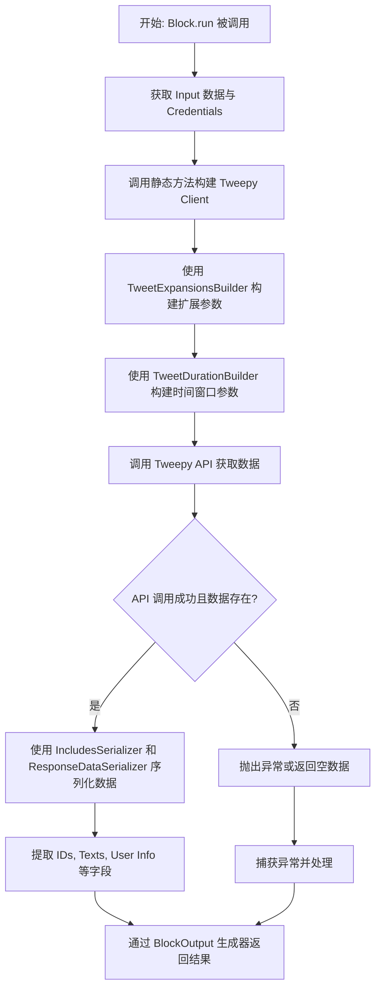
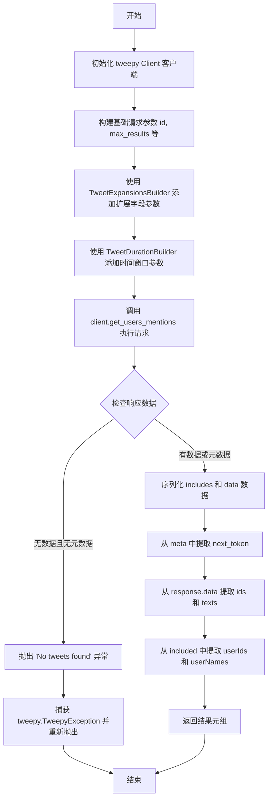
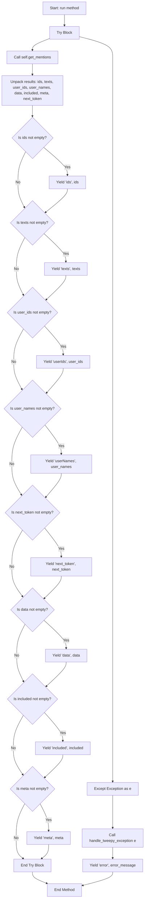
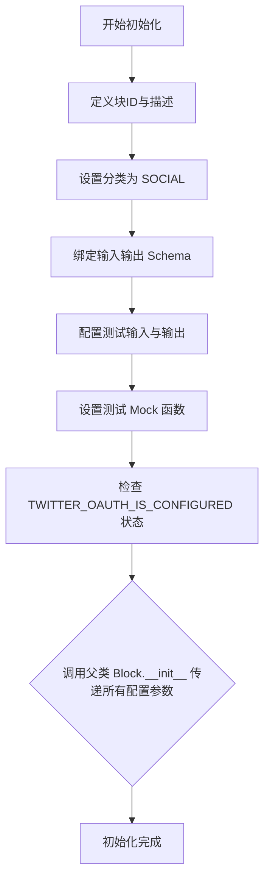
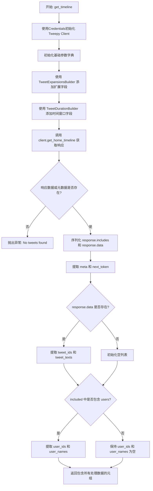
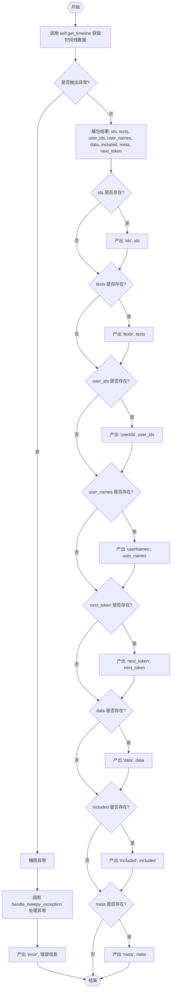
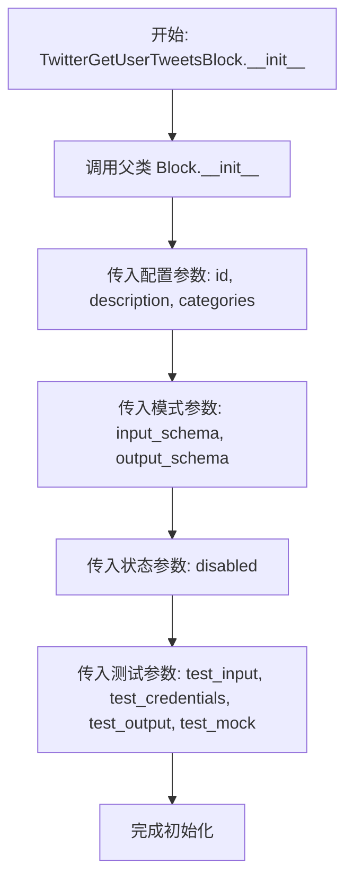
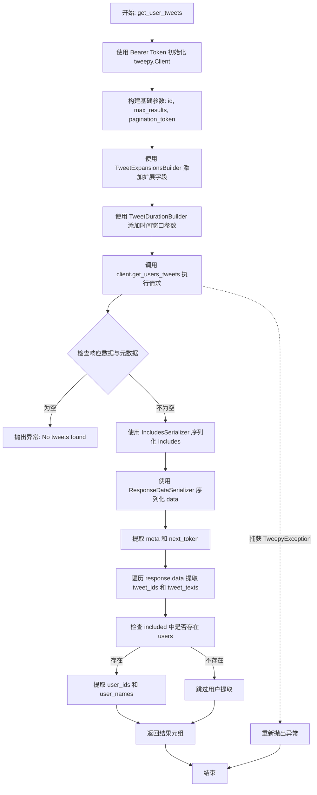
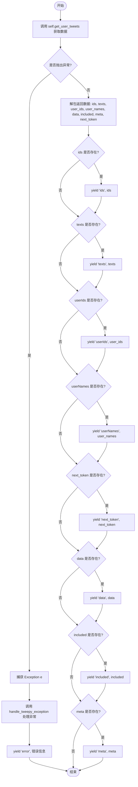

# `AutoGPT\autogpt_platform\backend\backend\blocks\twitter\tweets\timeline.py` 详细设计文档

该代码定义了三个用于集成 Twitter API v2 的数据块，分别用于获取指定用户的提及推文、获取认证用户的主页时间线以及获取指定用户的推文列表，通过 Tweepy 库实现认证、请求构建、数据序列化及错误处理。

## 整体流程



## 类结构

```
Block (基类)
├── TwitterGetUserMentionsBlock
│   ├── Input (内部类)
│   └── Output (内部类)
├── TwitterGetHomeTimelineBlock
│   ├── Input (内部类)
│   └── Output (内部类)
└── TwitterGetUserTweetsBlock
    ├── Input (内部类)
    └── Output (内部类)
```

## 全局变量及字段


### `TwitterGetUserMentionsBlock.Input.credentials`
    
Twitter authentication credentials configuration.

类型：`TwitterCredentialsInput`
    


### `TwitterGetUserMentionsBlock.Input.user_id`
    
Unique identifier of the user for whom to return Tweets mentioning the user.

类型：`str`
    


### `TwitterGetUserMentionsBlock.Input.max_results`
    
Number of tweets to retrieve (5-100).

类型：`int | None`
    


### `TwitterGetUserMentionsBlock.Input.pagination_token`
    
Token for pagination.

类型：`str | None`
    


### `TwitterGetUserMentionsBlock.Output.ids`
    
List of Tweet IDs.

类型：`list[str]`
    


### `TwitterGetUserMentionsBlock.Output.texts`
    
All Tweet texts.

类型：`list[str]`
    


### `TwitterGetUserMentionsBlock.Output.userIds`
    
List of user ids that mentioned the user.

类型：`list[str]`
    


### `TwitterGetUserMentionsBlock.Output.userNames`
    
List of user names that mentioned the user.

类型：`list[str]`
    


### `TwitterGetUserMentionsBlock.Output.next_token`
    
Next token for pagination.

类型：`str`
    


### `TwitterGetUserMentionsBlock.Output.data`
    
Complete Tweet data.

类型：`list[dict]`
    


### `TwitterGetUserMentionsBlock.Output.included`
    
Additional data that you have requested (Optional) via Expansions field.

类型：`dict`
    


### `TwitterGetUserMentionsBlock.Output.meta`
    
Provides metadata such as pagination info (next_token) or result counts.

类型：`dict`
    


### `TwitterGetHomeTimelineBlock.Input.credentials`
    
Twitter authentication credentials configuration.

类型：`TwitterCredentialsInput`
    


### `TwitterGetHomeTimelineBlock.Input.max_results`
    
Number of tweets to retrieve (5-100).

类型：`int | None`
    


### `TwitterGetHomeTimelineBlock.Input.pagination_token`
    
Token for pagination.

类型：`str | None`
    


### `TwitterGetHomeTimelineBlock.Output.ids`
    
List of Tweet IDs.

类型：`list[str]`
    


### `TwitterGetHomeTimelineBlock.Output.texts`
    
All Tweet texts.

类型：`list[str]`
    


### `TwitterGetHomeTimelineBlock.Output.userIds`
    
List of user ids that authored the tweets.

类型：`list[str]`
    


### `TwitterGetHomeTimelineBlock.Output.userNames`
    
List of user names that authored the tweets.

类型：`list[str]`
    


### `TwitterGetHomeTimelineBlock.Output.next_token`
    
Next token for pagination.

类型：`str`
    


### `TwitterGetHomeTimelineBlock.Output.data`
    
Complete Tweet data.

类型：`list[dict]`
    


### `TwitterGetHomeTimelineBlock.Output.included`
    
Additional data that you have requested (Optional) via Expansions field.

类型：`dict`
    


### `TwitterGetHomeTimelineBlock.Output.meta`
    
Provides metadata such as pagination info (next_token) or result counts.

类型：`dict`
    


### `TwitterGetUserTweetsBlock.Input.credentials`
    
Twitter authentication credentials configuration.

类型：`TwitterCredentialsInput`
    


### `TwitterGetUserTweetsBlock.Input.user_id`
    
Unique identifier of the Twitter account (user ID) for whom to return results.

类型：`str`
    


### `TwitterGetUserTweetsBlock.Input.max_results`
    
Number of tweets to retrieve (5-100).

类型：`int | None`
    


### `TwitterGetUserTweetsBlock.Input.pagination_token`
    
Token for pagination.

类型：`str | None`
    


### `TwitterGetUserTweetsBlock.Output.ids`
    
List of Tweet IDs.

类型：`list[str]`
    


### `TwitterGetUserTweetsBlock.Output.texts`
    
All Tweet texts.

类型：`list[str]`
    


### `TwitterGetUserTweetsBlock.Output.userIds`
    
List of user ids that authored the tweets.

类型：`list[str]`
    


### `TwitterGetUserTweetsBlock.Output.userNames`
    
List of user names that authored the tweets.

类型：`list[str]`
    


### `TwitterGetUserTweetsBlock.Output.next_token`
    
Next token for pagination.

类型：`str`
    


### `TwitterGetUserTweetsBlock.Output.data`
    
Complete Tweet data.

类型：`list[dict]`
    


### `TwitterGetUserTweetsBlock.Output.included`
    
Additional data that you have requested (Optional) via Expansions field.

类型：`dict`
    


### `TwitterGetUserTweetsBlock.Output.meta`
    
Provides metadata such as pagination info (next_token) or result counts.

类型：`dict`
    
    

## 全局函数及方法


### `TwitterGetUserMentionsBlock.__init__`

该方法是 `TwitterGetUserMentionsBlock` 类的构造函数，用于初始化获取 Twitter 用户提及数据块。它定义了块的唯一标识符、描述、分类、输入输出模式、启用状态以及用于测试的各种配置数据。

参数：

-  `self`：`TwitterGetUserMentionsBlock`，类的实例本身。

返回值：`None`，构造函数不返回任何值。

#### 流程图

```mermaid
graph TD
    A[Start __init__] --> B[Define Block ID]
    B --> C[Define Block Description]
    C --> D[Define Block Category]
    D --> E[Assign Input Schema Class]
    E --> F[Assign Output Schema Class]
    F --> G{Check OAuth Config}
    G -- Not Configured --> H[Set disabled=True]
    G -- Configured --> I[Set disabled=False]
    H --> J[Define Test Input Dictionary]
    I --> J
    J --> K[Define Test Credentials]
    K --> L[Define Test Output List]
    L --> M[Define Test Mock Dictionary]
    M --> N[Call super().__init__ with all arguments]
    N --> O[End]
```

#### 带注释源码

```python
def __init__(self):
    # 调用父类 Block 的构造函数，配置块的基本属性和行为
    super().__init__(
        # 块的唯一标识符
        id="e01c890c-a630-11ef-9e20-37da24888bd0",
        # 块的功能描述
        description="This block retrieves Tweets mentioning a specific user.",
        # 将块归类为社交媒体类别
        categories={BlockCategory.SOCIAL},
        # 指定输入数据的 Schema 为内部定义的 Input 类
        input_schema=TwitterGetUserMentionsBlock.Input,
        # 指定输出数据的 Schema 为内部定义的 Output 类
        output_schema=TwitterGetUserMentionsBlock.Output,
        # 根据全局 Twitter OAuth 配置状态决定是否禁用该块
        disabled=not TWITTER_OAUTH_IS_CONFIGURED,
        # 定义用于测试的输入参数集合
        test_input={
            "user_id": "12345",
            "credentials": TEST_CREDENTIALS_INPUT,
            "max_results": 2,
            "start_time": "2024-12-14T18:30:00.000Z",
            "end_time": "2024-12-17T18:30:00.000Z",
            "since_id": "",
            "until_id": "",
            "sort_order": None,
            "pagination_token": None,
            "expansions": None,
            "media_fields": None,
            "place_fields": None,
            "poll_fields": None,
            "tweet_fields": None,
            "user_fields": None,
        },
        # 指定测试用的凭证对象
        test_credentials=TEST_CREDENTIALS,
        # 定义预期的测试输出结果
        test_output=[
            ("ids", ["1373001119480344583", "1372627771717869568"]),
            ("texts", ["Test mention 1", "Test mention 2"]),
            ("userIds", ["67890", "67891"]),
            ("userNames", ["testuser1", "testuser2"]),
            (
                "data",
                [
                    {"id": "1373001119480344583", "text": "Test mention 1"},
                    {"id": "1372627771717869568", "text": "Test mention 2"},
                ],
            ),
        ],
        # 定义 Mock 函数，用于在测试环境中模拟 API 响应，避免真实网络请求
        test_mock={
            "get_mentions": lambda *args, **kwargs: (
                ["1373001119480344583", "1372627771717869568"],
                ["Test mention 1", "Test mention 2"],
                ["67890", "67891"],
                ["testuser1", "testuser2"],
                [
                    {"id": "1373001119480344583", "text": "Test mention 1"},
                    {"id": "1372627771717869568", "text": "Test mention 2"},
                ],
                {},
                {},
                None,
            )
        },
    )
```


### `TwitterGetUserMentionsBlock.get_mentions`

该方法是用于获取提及特定用户（由 `user_id` 指定）的推文列表的静态方法。它利用 Twitter API 的 v2 客户端（通过 `tweepy`）进行请求，支持通过多种参数（如时间窗口、分页、扩展字段等）进行过滤和定制。方法处理原始 API 响应，将其序列化并提取为易于使用的格式（如 ID 列表、文本列表等），最后返回包含各类数据的元组。

参数：

-  `credentials`：`TwitterCredentials`，Twitter API 的认证凭据对象，包含用于请求的访问令牌。
-  `user_id`：`str`，目标用户的唯一标识符，用于查询提及该用户的推文。
-  `max_results`：`int | None`，单次检索返回的推文数量限制。
-  `start_time`：`datetime | None`，检索的起始时间（UTC），用于过滤旧推文。
-  `end_time`：`datetime | None`，检索的结束时间（UTC），用于过滤新推文。
-  `since_id`：`str | None`，返回 ID 大于此 ID 的推文。
-  `until_id`：`str | None`，返回 ID 小于此 ID 的推文。
-  `sort_order`：`str | None`，指定推文的排序顺序（例如 `relevancy` 或 `recency`）。
-  `pagination`：`str | None`，用于获取下一页结果的分页令牌。
-  `expansions`：`ExpansionFilter | None`，扩展字段过滤器，用于请求额外的关联数据（如作者信息等）。
-  `media_fields`：`TweetMediaFieldsFilter | None`，指定返回的媒体附件字段。
-  `place_fields`：`TweetPlaceFieldsFilter | None`，指定返回的地标字段。
-  `poll_fields`：`TweetPollFieldsFilter | None`，指定返回的投票字段。
-  `tweet_fields`：`TweetFieldsFilter | None`，指定返回的推文字段。
-  `user_fields`：`TweetUserFieldsFilter | None`，指定返回的用户字段。

返回值：`tuple`，一个包含 8 个元素的元组，分别为：推文 ID 列表、推文文本列表、提及用户 ID 列表、提及用户名列表、完整推文数据列表、扩展数据字典、元数据字典以及下一页分页令牌。

#### 流程图



#### 带注释源码

```python
    @staticmethod
    def get_mentions(
        credentials: TwitterCredentials,
        user_id: str,
        max_results: int | None,
        start_time: datetime | None,
        end_time: datetime | None,
        since_id: str | None,
        until_id: str | None,
        sort_order: str | None,
        pagination: str | None,
        expansions: ExpansionFilter | None,
        media_fields: TweetMediaFieldsFilter | None,
        place_fields: TweetPlaceFieldsFilter | None,
        poll_fields: TweetPollFieldsFilter | None,
        tweet_fields: TweetFieldsFilter | None,
        user_fields: TweetUserFieldsFilter | None,
    ):
        try:
            # 1. 使用 Bearer Token 初始化 Tweepy 客户端
            client = tweepy.Client(
                bearer_token=credentials.access_token.get_secret_value()
            )

            # 2. 准备基础请求参数
            params = {
                "id": user_id,
                "max_results": max_results,
                # 处理分页 token，空字符串转为 None
                "pagination_token": None if pagination == "" else pagination,
                "user_auth": False,
            }

            # 3. 使用构建器模式添加 Expansions（扩展字段）和各类 Field 参数
            params = (
                TweetExpansionsBuilder(params)
                .add_expansions(expansions)
                .add_media_fields(media_fields)
                .add_place_fields(place_fields)
                .add_poll_fields(poll_fields)
                .add_tweet_fields(tweet_fields)
                .add_user_fields(user_fields)
                .build()
            )

            # 4. 使用构建器模式添加时间窗口相关参数
            params = (
                TweetDurationBuilder(params)
                .add_start_time(start_time)
                .add_end_time(end_time)
                .add_since_id(since_id)
                .add_until_id(until_id)
                .add_sort_order(sort_order)
                .build()
            )

            # 5. 调用 Twitter API 获取用户提及推文
            response = cast(
                Response,
                client.get_users_mentions(**params),
            )

            # 6. 校验响应：如果既没有数据也没有元数据，认为未找到推文
            if not response.data and not response.meta:
                raise Exception("No tweets found")

            # 7. 序列化响应数据
            # 序列化附加数据（如用户对象、媒体对象等）
            included = IncludesSerializer.serialize(response.includes)
            # 序列化推文主数据列表
            data = ResponseDataSerializer.serialize_list(response.data)
            # 获取元数据，若为空则默认为空字典
            meta = response.meta or {}
            # 从元数据中提取下一页的 Token
            next_token = meta.get("next_token", "")

            # 初始化返回结果列表
            tweet_ids = []
            tweet_texts = []
            user_ids = []
            user_names = []

            # 8. 提取推文 ID 和文本
            if response.data:
                tweet_ids = [str(tweet.id) for tweet in response.data]
                tweet_texts = [tweet.text for tweet in response.data]

            # 9. 从 included 数据中提取用户 ID 和用户名
            if "users" in included:
                user_ids = [str(user["id"]) for user in included["users"]]
                user_names = [user["username"] for user in included["users"]]

            # 10. 返回格式化后的元组结果
            return (
                tweet_ids,
                tweet_texts,
                user_ids,
                user_names,
                data,
                included,
                meta,
                next_token,
            )

        # 11. 捕获 Tweepy 异常并向上抛出，由上层统一处理
        except tweepy.TweepyException:
            raise
```


### `TwitterGetUserMentionsBlock.run`

该方法是 `TwitterGetUserMentionsBlock` 的核心执行入口，负责协调调用底层逻辑获取提及指定用户的推文数据，并将结果以异步生成器的形式逐步产出。

参数：

- `input_data`: `Input`，包含用户ID、时间窗口、分页令牌、最大结果数及各种字段扩展配置的输入数据对象。
- `credentials`: `TwitterCredentials`，用于访问 Twitter API 的认证凭据对象。
- `**kwargs`: `dict`，接收任意额外的关键字参数（当前未直接使用）。

返回值：`BlockOutput` (AsyncGenerator)，一个异步生成器，产出包含推文 ID、文本、提及用户信息、原始数据、元数据或错误信息的键值对。

#### 流程图



#### 带注释源码

```python
    async def run(
        self,
        input_data: Input,
        *,
        credentials: TwitterCredentials,
        **kwargs,
    ) -> BlockOutput:
        try:
            # 调用静态方法 get_mentions 获取提及数据
            # 传入 credentials 和 input_data 中的所有相关字段
            ids, texts, user_ids, user_names, data, included, meta, next_token = (
                self.get_mentions(
                    credentials,
                    input_data.user_id,
                    input_data.max_results,
                    input_data.start_time,
                    input_data.end_time,
                    input_data.since_id,
                    input_data.until_id,
                    input_data.sort_order,
                    input_data.pagination_token,
                    input_data.expansions,
                    input_data.media_fields,
                    input_data.place_fields,
                    input_data.poll_fields,
                    input_data.tweet_fields,
                    input_data.user_fields,
                )
            )
            # 只有当 ids 列表非空时才产出 'ids'
            if ids:
                yield "ids", ids
            # 只有当 texts 列表非空时才产出 'texts'
            if texts:
                yield "texts", texts
            # 只有当 user_ids 列表非空时才产出 'userIds'
            if user_ids:
                yield "userIds", user_ids
            # 只有当 user_names 列表非空时才产出 'userNames'
            if user_names:
                yield "userNames", user_names
            # 只有当 next_token 非空时才产出 'next_token'（用于分页）
            if next_token:
                yield "next_token", next_token
            # 只有当 data 列表非空时才产出 'data'（完整推文数据）
            if data:
                yield "data", data
            # 只有当 included 字典非空时才产出 'included'（扩展数据）
            if included:
                yield "included", included
            # 只有当 meta 字典非空时才产出 'meta'（元数据）
            if meta:
                yield "meta", meta

        except Exception as e:
            # 捕获所有异常，使用 handle_tweepy_exception 处理后产出 'error'
            yield "error", handle_tweepy_exception(e)
```


### `TwitterGetHomeTimelineBlock.__init__`

初始化 `TwitterGetHomeTimelineBlock` 实例，配置其元数据（如 ID、描述）、输入输出模式、测试用例以及是否基于 OAuth 配置启用该块。

参数：

-   `self`：`TwitterGetHomeTimelineBlock`，类实例本身。

返回值：`None`，无返回值。

#### 流程图



#### 带注释源码

```python
def __init__(self):
    # 调用父类 Block 的构造函数以初始化块的基本属性和行为
    super().__init__(
        # 定义该块的唯一标识符
        id="d222a070-a630-11ef-a18a-3f52f76c6962",
        # 简要描述该块的功能
        description="This block retrieves the authenticated user's home timeline.",
        # 将块归类为社交媒体类别
        categories={BlockCategory.SOCIAL},
        # 指定输入数据的 Schema 类，用于验证和结构化输入
        input_schema=TwitterGetHomeTimelineBlock.Input,
        # 指定输出数据的 Schema 类，用于验证和结构化输出
        output_schema=TwitterGetHomeTimelineBlock.Output,
        # 根据 Twitter OAuth 是否已配置来决定是否禁用该块
        disabled=not TWITTER_OAUTH_IS_CONFIGURED,
        # 定义用于单元测试或示例运行的输入参数
        test_input={
            "credentials": TEST_CREDENTIALS_INPUT,
            "max_results": 2,
            "start_time": "2024-12-14T18:30:00.000Z",
            "end_time": "2024-12-17T18:30:00.000Z",
            "since_id": None,
            "until_id": None,
            "sort_order": None,
            "pagination_token": None,
        },
        # 提供测试用的凭证对象
        test_credentials=TEST_CREDENTIALS,
        # 预期的测试输出结果，用于验证逻辑
        test_output=[
            ("ids", ["1373001119480344583", "1372627771717869568"]),
            ("texts", ["Test tweet 1", "Test tweet 2"]),
            ("userIds", ["67890", "67891"]),
            ("userNames", ["testuser1", "testuser2"]),
            (
                "data",
                [
                    {"id": "1373001119480344583", "text": "Test tweet 1"},
                    {"id": "1372627771717869568", "text": "Test tweet 2"},
                ],
            ),
        ],
        # 定义 Mock 函数，用于在测试环境中模拟 API 调用返回数据，避免真实网络请求
        test_mock={
            "get_timeline": lambda *args, **kwargs: (
                ["1373001119480344583", "1372627771717869568"],
                ["Test tweet 1", "Test tweet 2"],
                ["67890", "67891"],
                ["testuser1", "testuser2"],
                [
                    {"id": "1373001119480344583", "text": "Test tweet 1"},
                    {"id": "1372627771717869568", "text": "Test tweet 2"},
                ],
                {},
                {},
                None,
            )
        },
    )
```


### `TwitterGetHomeTimelineBlock.get_timeline`

该方法是TwitterGetHomeTimelineBlock的核心静态方法，用于通过Tweepy客户端获取认证用户的主页时间线（包含用户及其关注者的推文和转推），并根据提供的参数（如时间窗口、分页、字段扩展等）构建请求，最终返回处理后的推文数据、作者信息及元数据。

参数：

- `credentials`：`TwitterCredentials`，Twitter API的认证凭证对象，包含访问令牌。
- `max_results`：`int | None`，要检索的推文数量限制。
- `start_time`：`datetime | None`，筛选推文的起始时间（UTC）。
- `end_time`：`datetime | None`，筛选推文的结束时间（UTC）。
- `since_id`：`str | None`，返回ID大于此值的推文（用于获取更新）。
- `until_id`：`str | None`，返回ID小于此值的推文（用于分页或历史查询）。
- `sort_order`：`str | None`，指定推文的排序顺序（如按相关性或时间）。
- `pagination`：`str | None`，用于获取下一页结果的分页令牌。
- `expansions`：`ExpansionFilter | None`，请求扩展数据的字段过滤器。
- `media_fields`：`TweetMediaFieldsFilter | None`，请求返回的媒体字段列表。
- `place_fields`：`TweetPlaceFieldsFilter | None`，请求返回的地点字段列表。
- `poll_fields`：`TweetPollFieldsFilter | None`，请求返回的民调字段列表。
- `tweet_fields`：`TweetFieldsFilter | None`，请求返回的推文字段列表。
- `user_fields`：`TweetUserFieldsFilter | None`，请求返回的用户字段列表。

返回值：`tuple`，包含一个包含推文ID列表、推文文本列表、用户ID列表、用户名列表、完整数据列表、附加数据字典、元数据字典和下一页分页令牌的元组。

#### 流程图



#### 带注释源码

```python
    @staticmethod
    def get_timeline(
        credentials: TwitterCredentials,
        max_results: int | None,
        start_time: datetime | None,
        end_time: datetime | None,
        since_id: str | None,
        until_id: str | None,
        sort_order: str | None,
        pagination: str | None,
        expansions: ExpansionFilter | None,
        media_fields: TweetMediaFieldsFilter | None,
        place_fields: TweetPlaceFieldsFilter | None,
        poll_fields: TweetPollFieldsFilter | None,
        tweet_fields: TweetFieldsFilter | None,
        user_fields: TweetUserFieldsFilter | None,
    ):
        try:
            # 1. 使用凭证中的 bearer token 初始化 Tweepy 客户端
            client = tweepy.Client(
                bearer_token=credentials.access_token.get_secret_value()
            )

            # 2. 构建基础请求参数
            params = {
                "max_results": max_results,
                "pagination_token": None if pagination == "" else pagination,
                "user_auth": False,
            }

            # 3. 使用构建器添加扩展字段（如媒体、用户、推文字段等）到 params
            params = (
                TweetExpansionsBuilder(params)
                .add_expansions(expansions)
                .add_media_fields(media_fields)
                .add_place_fields(place_fields)
                .add_poll_fields(poll_fields)
                .add_tweet_fields(tweet_fields)
                .add_user_fields(user_fields)
                .build()
            )

            # 4. 使用构建器添加时间窗口相关参数（开始时间、结束时间、ID范围等）到 params
            params = (
                TweetDurationBuilder(params)
                .add_start_time(start_time)
                .add_end_time(end_time)
                .add_since_id(since_id)
                .add_until_id(until_id)
                .add_sort_order(sort_order)
                .build()
            )

            # 5. 调用 Twitter API 获取主页时间线
            response = cast(
                Response,
                client.get_home_timeline(**params),
            )

            # 6. 检查响应是否包含数据，如果既没有数据也没有元数据则抛出异常
            if not response.data and not response.meta:
                raise Exception("No tweets found")

            # 7. 序列化响应中的附加信息（Includes）和主数据
            included = IncludesSerializer.serialize(response.includes)
            data = ResponseDataSerializer.serialize_list(response.data)
            meta = response.meta or {}
            next_token = meta.get("next_token", "")

            # 初始化返回列表
            tweet_ids = []
            tweet_texts = []
            user_ids = []
            user_names = []

            # 8. 如果响应包含推文数据，提取ID和文本
            if response.data:
                tweet_ids = [str(tweet.id) for tweet in response.data]
                tweet_texts = [tweet.text for tweet in response.data]

            # 9. 如果附加信息中包含用户数据，提取用户ID和用户名
            if "users" in included:
                user_ids = [str(user["id"]) for user in included["users"]]
                user_names = [user["username"] for user in included["users"]]

            # 10. 返回提取的所有结果
            return (
                tweet_ids,
                tweet_texts,
                user_ids,
                user_names,
                data,
                included,
                meta,
                next_token,
            )

        except tweepy.TweepyException:
            raise
```


### `TwitterGetHomeTimelineBlock.run`

该方法负责执行获取Twitter用户主页时间线的核心逻辑。它接收输入数据和凭证，调用静态方法获取推文数据，处理并产出解析后的结果或捕获的错误信息。

参数：

-  `input_data`：`TwitterGetHomeTimelineBlock.Input`，包含检索配置（如最大结果数、分页令牌、时间范围等）的输入数据对象。
-  `credentials`：`TwitterCredentials`，包含访问令牌等信息的Twitter认证凭证对象。
-  `**kwargs`：`dict`，额外的关键字参数。

返回值：`BlockOutput`，一个异步生成器，逐步产出键值对，包含处理后的推文数据（如ID列表、文本列表、原始数据等）或错误信息。

#### 流程图



#### 带注释源码

```python
    async def run(
        self,
        input_data: Input,
        *,
        credentials: TwitterCredentials,
        **kwargs,
    ) -> BlockOutput:
        try:
            # 调用静态方法 get_timeline 获取并解析 Twitter 数据
            # 传入凭证以及从 input_data 中提取的各种查询参数
            ids, texts, user_ids, user_names, data, included, meta, next_token = (
                self.get_timeline(
                    credentials,
                    input_data.max_results,
                    input_data.start_time,
                    input_data.end_time,
                    input_data.since_id,
                    input_data.until_id,
                    input_data.sort_order,
                    input_data.pagination_token,
                    input_data.expansions,
                    input_data.media_fields,
                    input_data.place_fields,
                    input_data.poll_fields,
                    input_data.tweet_fields,
                    input_data.user_fields,
                )
            )
            # 检查各个数据字段是否存在，如果存在则产出对应的键值对
            if ids:
                yield "ids", ids
            if texts:
                yield "texts", texts
            if user_ids:
                yield "userIds", user_ids
            if user_names:
                yield "userNames", user_names
            if next_token:
                yield "next_token", next_token
            if data:
                yield "data", data
            if included:
                yield "included", included
            if meta:
                yield "meta", meta

        except Exception as e:
            # 捕获异常，使用 handle_tweepy_exception 进行处理并产出错误信息
            yield "error", handle_tweepy_exception(e)
```


### `TwitterGetUserTweetsBlock.__init__`

该方法用于初始化 `TwitterGetUserTweetsBlock` 类实例，通过调用父类 `Block` 的构造函数，设置该块的唯一标识、描述、分类、输入/输出模式、OAuth配置状态以及用于测试的输入、凭据、输出和模拟数据。

参数：

- `self`：`TwitterGetUserTweetsBlock`，表示类实例本身。

返回值：`None`，该方法主要用于初始化对象状态，无返回值。

#### 流程图



#### 带注释源码

```python
def __init__(self):
    # 调用父类 Block 的构造函数以完成核心初始化
    super().__init__(
        # 设置块的唯一标识符 (UUID)
        id="c44c3ef2-a630-11ef-9ff7-eb7b5ea3a5cb",
        # 设置块的描述信息
        description="This block retrieves Tweets composed by a single user.",
        # 设置块所属的分类，这里为社交媒体 (SOCIAL)
        categories={BlockCategory.SOCIAL},
        # 定义输入数据的模式，继承自内部类 Input
        input_schema=TwitterGetUserTweetsBlock.Input,
        # 定义输出数据的模式，继承自内部类 Output
        output_schema=TwitterGetUserTweetsBlock.Output,
        # 根据 Twitter OAuth 是否已配置来决定是否禁用该块
        disabled=not TWITTER_OAUTH_IS_CONFIGURED,
        # 定义用于测试的输入数据样本
        test_input={
            "user_id": "12345",
            "credentials": TEST_CREDENTIALS_INPUT,
            "max_results": 2,
            "start_time": "2024-12-14T18:30:00.000Z",
            "end_time": "2024-12-17T18:30:00.000Z",
            "since_id": None,
            "until_id": None,
            "sort_order": None,
            "pagination_token": None,
            "expansions": None,
            "media_fields": None,
            "place_fields": None,
            "poll_fields": None,
            "tweet_fields": None,
            "user_fields": None,
        },
        # 定义用于测试的凭据对象
        test_credentials=TEST_CREDENTIALS,
        # 定义预期的测试输出结果
        test_output=[
            ("ids", ["1373001119480344583", "1372627771717869568"]),
            ("texts", ["Test tweet 1", "Test tweet 2"]),
            ("userIds", ["67890", "67891"]),
            ("userNames", ["testuser1", "testuser2"]),
            (
                "data",
                [
                    {"id": "1373001119480344583", "text": "Test tweet 1"},
                    {"id": "1372627771717869568", "text": "Test tweet 2"},
                ],
            ),
        ],
        # 定义模拟函数，用于在测试环境中模拟 get_user_tweets 的行为
        test_mock={
            "get_user_tweets": lambda *args, **kwargs: (
                ["1373001119480344583", "1372627771717869568"],
                ["Test tweet 1", "Test tweet 2"],
                ["67890", "67891"],
                ["testuser1", "testuser2"],
                [
                    {"id": "1373001119480344583", "text": "Test tweet 1"},
                    {"id": "1372627771717869568", "text": "Test tweet 2"},
                ],
                {},
                {},
                None,
            )
        },
    )
```


### `TwitterGetUserTweetsBlock.get_user_tweets`

通过 Twitter API 检索指定用户发布的推文，处理参数构建、API 请求及数据序列化。

参数：

- `credentials`：`TwitterCredentials`，包含访问令牌的 Twitter API 凭证对象
- `user_id`：`str`，要检索推文的用户的唯一标识符
- `max_results`：`int | None`，要检索的推文数量（5-100）
- `start_time`：`datetime | None`，推文时间范围的开始时间（UTC）
- `end_time`：`datetime | None`，推文时间范围的结束时间（UTC）
- `since_id`：`str | None`，返回 ID 大于此 ID 的推文（即更新的推文）
- `until_id`：`str | None`，返回 ID 小于此 ID 的推文（即更旧的推文）
- `sort_order`：`str | None`，结果的排序顺序（如相关度或时间倒序）
- `pagination`：`str | None`，用于分页浏览结果的令牌
- `expansions`：`ExpansionFilter | None`，用于请求额外数据对象的扩展字段
- `media_fields`：`TweetMediaFieldsFilter | None`，媒体对象的字段过滤器
- `place_fields`：`TweetPlaceFieldsFilter | None`，地点对象的字段过滤器
- `poll_fields`：`TweetPollFieldsFilter | None`，投票对象的字段过滤器
- `tweet_fields`：`TweetFieldsFilter | None`，推文对象的字段过滤器
- `user_fields`：`TweetUserFieldsFilter | None`，用户对象的字段过滤器

返回值：`tuple[list[str], list[str], list[str], list[str], list[dict], dict, dict, str]`，包含推文 ID 列表、推文文本列表、作者 ID 列表、作者名称列表、完整推文数据、附加数据、元数据和下一页分页令牌的元组。

#### 流程图



#### 带注释源码

```python
    @staticmethod
    def get_user_tweets(
        credentials: TwitterCredentials,
        user_id: str,
        max_results: int | None,
        start_time: datetime | None,
        end_time: datetime | None,
        since_id: str | None,
        until_id: str | None,
        sort_order: str | None,
        pagination: str | None,
        expansions: ExpansionFilter | None,
        media_fields: TweetMediaFieldsFilter | None,
        place_fields: TweetPlaceFieldsFilter | None,
        poll_fields: TweetPollFieldsFilter | None,
        tweet_fields: TweetFieldsFilter | None,
        user_fields: TweetUserFieldsFilter | None,
    ):
        try:
            # 1. 初始化 Tweepy 客户端
            client = tweepy.Client(
                bearer_token=credentials.access_token.get_secret_value()
            )

            # 2. 构建基础请求参数
            params = {
                "id": user_id,
                "max_results": max_results,
                "pagination_token": None if pagination == "" else pagination,
                "user_auth": False,
            }

            # 3. 使用构建器模式添加扩展字段 (如媒体、用户字段等)
            params = (
                TweetExpansionsBuilder(params)
                .add_expansions(expansions)
                .add_media_fields(media_fields)
                .add_place_fields(place_fields)
                .add_poll_fields(poll_fields)
                .add_tweet_fields(tweet_fields)
                .add_user_fields(user_fields)
                .build()
            )

            # 4. 使用构建器模式添加时间窗口参数
            params = (
                TweetDurationBuilder(params)
                .add_start_time(start_time)
                .add_end_time(end_time)
                .add_since_id(since_id)
                .add_until_id(until_id)
                .add_sort_order(sort_order)
                .build()
            )

            # 5. 发起 API 请求获取用户推文
            response = cast(
                Response,
                client.get_users_tweets(**params),
            )

            # 6. 校验响应是否为空
            if not response.data and not response.meta:
                raise Exception("No tweets found")

            # 7. 序列化响应数据 (includes 和 data)
            included = IncludesSerializer.serialize(response.includes)
            data = ResponseDataSerializer.serialize_list(response.data)
            meta = response.meta or {}
            next_token = meta.get("next_token", "")

            # 8. 初始化结果列表
            tweet_ids = []
            tweet_texts = []
            user_ids = []
            user_names = []

            # 9. 提取推文 ID 和文本
            if response.data:
                tweet_ids = [str(tweet.id) for tweet in response.data]
                tweet_texts = [tweet.text for tweet in response.data]

            # 10. 提取用户 ID 和用户名 (如果包含在 includes 中)
            if "users" in included:
                user_ids = [str(user["id"]) for user in included["users"]]
                user_names = [user["username"] for user in included["users"]]

            # 11. 返回包含所有提取数据的元组
            return (
                tweet_ids,
                tweet_texts,
                user_ids,
                user_names,
                data,
                included,
                meta,
                next_token,
            )

        # 12. 捕获并重新抛出 Tweepy 异常，由上层处理
        except tweepy.TweepyException:
            raise
```


### `TwitterGetUserTweetsBlock.run`

执行获取指定用户推文的主要逻辑，负责协调整个流程，包括参数传递、调用静态方法获取数据、处理结果输出以及捕获和转换异常。

参数：

-  `input_data`：`Input`，包含用户ID、分页参数、时间窗口过滤器和字段扩展配置的输入数据对象。
-  `credentials`：`TwitterCredentials`，用于访问Twitter API的认证凭证对象。
-  `**kwargs`：`dict`，额外的关键字参数（未在方法体中显式使用，但作为扩展接口保留）。

返回值：`BlockOutput`，一个异步生成器，逐步产生包含推文ID、文本、用户信息、元数据或错误信息的键值对。

#### 流程图



#### 带注释源码

```python
async def run(
    self,
    input_data: Input,
    *,
    credentials: TwitterCredentials,
    **kwargs,
) -> BlockOutput:
    try:
        # 调用静态方法 get_user_tweets 获取并解析 Twitter 数据
        # 传入凭证和从 input_data 中提取的各种查询参数（如用户ID、时间范围、分页等）
        ids, texts, user_ids, user_names, data, included, meta, next_token = (
            self.get_user_tweets(
                credentials,
                input_data.user_id,
                input_data.max_results,
                input_data.start_time,
                input_data.end_time,
                input_data.since_id,
                input_data.until_id,
                input_data.sort_order,
                input_data.pagination_token,
                input_data.expansions,
                input_data.media_fields,
                input_data.place_fields,
                input_data.poll_fields,
                input_data.tweet_fields,
                input_data.user_fields,
            )
        )
        
        # 按顺序检查并产出数据
        # 如果数据存在则产出对应的键值对，避免产出空值
        if ids:
            yield "ids", ids
        if texts:
            yield "texts", texts
        if user_ids:
            yield "userIds", user_ids
        if user_names:
            yield "userNames", user_names
        if next_token:
            yield "next_token", next_token
        if data:
            yield "data", data
        if included:
            yield "included", included
        if meta:
            yield "meta", meta

    except Exception as e:
        # 捕获处理过程中的任何异常
        # 使用 handle_tweepy_exception 将异常转换为用户友好的错误信息
        yield "error", handle_tweepy_exception(e)
```


## 关键组件


### Twitter API Integration Blocks
封装了使用 Tweepy 客户端获取特定推文类型（提及、主页时间线、用户推文）的逻辑。

### Authentication Management
处理 Twitter OAuth 凭据的检索与验证，以实现安全的 API 访问。

### Dynamic Query Construction
利用构建器模式根据用户输入动态构建复杂的 API 请求参数（如扩展字段和时间窗口）。

### Response Data Serialization
将原始的 Tweepy 响应对象转换为标准化的字典格式，以便于下游处理。

### Exception Handling Wrapper
集中捕获和处理 Tweepy 特定的异常，以优雅地管理 API 错误。


## 问题及建议


### 已知问题

-   **严重的代码重复**：`TwitterGetUserMentionsBlock`、`TwitterGetHomeTimelineBlock` 和 `TwitterGetUserTweetsBlock` 三个类的 `run` 方法以及静态辅助方法（如 `get_mentions`）存在约 90% 的相同代码（参数构建、序列化逻辑、结果提取），导致维护成本极高，修改一处需要同步修改多处。
-   **异步阻塞问题**：`run` 方法被定义为 `async`，但在内部调用了同步的 `tweepy.Client` 进行网络请求。这会阻塞事件循环，破坏应用的并发性能，导致处理其他请求的能力下降。
-   **冗余的异常捕获**：在静态方法（如 `get_mentions`）中，`try...except tweepy.TweepyException: raise` 代码块除了重新抛出异常外没有任何处理逻辑。这种写法不仅增加了无用的代码嵌套，还会改变堆栈跟踪信息，不利于调试。
-   **不当的空结果处理**：当 API 返回成功但没有数据时（`not response.data and not response.meta`），代码抛出通用的 `Exception("No tweets found")`。对于查询类操作，"无结果"通常是正常的业务状态而非异常，强行抛出异常会干扰正常的错误处理流程。

### 优化建议

-   **引入抽象基类或 Mixin**：创建一个 `BaseTwitterTimelineBlock` 基类，将公共的参数构建（`TweetExpansionsBuilder` 和 `TweetDurationBuilder` 的调用）、API 响应解析（`IncludesSerializer` 使用）以及数据提取逻辑封装到基类中。子类只需提供特定的 API 调用方法和特定的输入参数（如 `user_id`）。
-   **使用异步 HTTP 客户端**：将同步的 `tweepy.Client` 替换为 `tweepy.AsyncClient`，并将 API 调用改为 `await client.get_...`，以充分利用 Python 的异步特性，避免阻塞事件循环。
-   **优化数据结构**：静态辅助方法返回了包含 8 个元素的元组，这在代码中难以维护。建议定义一个 `namedtuple` 或 `dataclass` 来封装返回结果（例如 `TimelineResult`），提高代码的可读性和类型安全性。
-   **调整空结果策略**：移除对空结果抛出异常的逻辑。如果 `response.data` 为空，应返回空的列表和相应的空元数据，由 `run` 方法产出空结果，而不是将其视为错误。
-   **增强输入验证**：虽然 Schema 定义了 `max_results` 的范围，但在代码执行前增加显式的参数验证（如确保 `max_results` 在 5 到 100 之间），可以在进入 API 调用前就拦截无效输入，减少无效的网络请求。


## 其它


### 设计目标与约束

**设计目标：**
1.  **模块化与封装**：为 Twitter API v2 的核心数据检索功能（用户提及、主页时间线、用户推文）提供标准化的模块封装，隐藏底层 HTTP 请求和认证细节。
2.  **灵活的数据获取**：支持通过参数配置时间窗口、分页、字段扩展和过滤条件，满足不同粒度的数据抓取需求。
3.  **统一的接口契约**：确保所有 Block 遵循相同的输入输出模式，便于集成到低代码平台或自动化工作流中。

**设计约束：**
1.  **API 限制**：受 Twitter API v2 限制，单次请求返回的推文数量 (`max_results`) 必须在 5 到 100 之间。
2.  **认证要求**：必须配置有效的 Twitter OAuth 2.0 Bearer Token，且需具备 `tweet.read`, `users.read` 等权限，否则 Block 无法运行。
3.  **外部库依赖**：强依赖 `tweepy` 库进行网络请求，依赖内部模块 `backend.blocks.twitter._builders` 和 `_serializer` 进行参数构建和序列化。

### 错误处理与异常设计

**错误处理策略：**
1.  **分层捕获**：在静态方法（如 `get_mentions`）中捕获底层 `tweepy.TweepyException`，并不直接处理，而是向上层抛出。
2.  **统一转换**：在 `run` 方法中捕获所有异常，并通过 `handle_tweepy_exception` 工具函数将标准异常或 Tweepy 异常转换为用户友好的错误消息。
3.  **错误输出通道**：当发生错误时，通过 `yield "error", ...` 机制输出错误信息，确保即使流程中断，调用方也能获取到具体的失败原因，而不是直接导致进程崩溃。

**异常类型覆盖：**
*   **网络错误**：连接超时、DNS 解析失败等。
*   **认证/授权错误**：Token 无效、权限不足（401, 403）。
*   **资源未找到**：用户 ID 不存在（404）。
*   **请求参数错误**：时间格式错误、参数超出范围（400）。
*   **速率限制**：超过 Twitter API 调用频率限制（429）。

### 外部依赖与接口契约

**外部依赖：**
1.  **Twitter API v2**：
    *   端点：`GET /2/users/:id/mentions`, `GET /2/users/:id/tweets`, `GET /2/home_timeline`。
    *   数据格式：JSON。
2.  **Tweepy 库**：作为 Python 客户端与 Twitter API 进行交互。
3.  **内部依赖**：
    *   `backend.blocks.twitter._auth`：提供凭证验证和输入定义。
    *   `backend.blocks.twitter._builders`：构建 API 请求参数（TweetExpansionsBuilder, TweetDurationBuilder）。
    *   `backend.blocks.twitter._serializer`：解析 Twitter API 响应数据。

**接口契约：**
1.  **输入契约**：
    *   必须包含有效的 `credentials` 对象。
    *   `user_id`, `start_time`, `end_time` 等参数需符合 Twitter API 定义的类型和格式（如 ISO 8601 时间格式）。
2.  **输出契约**：
    *   总是产生键值对流输出。
    *   成功时包含 `ids`, `texts`, `data`, `meta` 等键。
    *   失败时包含 `error` 键。
    *   支持分页，通过 `next_token` 字段维持会话状态以便后续请求。

### 数据流与状态机

**数据流：**
1.  **输入阶段**：`Block.run` 接收 `input_data` 和 `credentials`。
2.  **参数构建**：静态方法接收输入，使用 `TweetExpansionsBuilder` 和 `TweetDurationBuilder` 将高级别的输入转换为 Twitter API 所需的低级别参数字典。
3.  **API 交互**：使用构建好的参数实例化 `tweepy.Client` 并发起同步/异步请求。
4.  **数据序列化**：接收原始 `Response` 对象，使用 `IncludesSerializer` 和 `ResponseDataSerializer` 将其转换为 Python 字典和列表结构。
5.  **提取与产出**：从序列化数据中提取常用字段（如 ID, 文本），并通过生成器逐个产出键值对。

**状态机：**
该模块主要表现为无状态函数调用，但在逻辑上包含以下状态转换：
*   **Ready**：Block 初始化完成，等待输入。
*   **Processing**：参数构建中 -> API 请求中 -> 数据解析中。
*   **Completed**：数据成功产出，流结束。
*   **Error**：捕获到异常，产出错误信息，流结束。

分页逻辑由外部调用者维护，通过将本次输出的 `next_token` 作为下一次输入的 `pagination_token` 来实现状态流转。

### 安全性考虑

1.  **凭证管理**：
    *   访问令牌通过 `credentials.access_token.get_secret_value()` 获取，避免在日志或非安全上下文中泄露明文 Token。
    *   凭证输入字段被标记为敏感类型，通常在 UI 中会以掩码形式显示。
2.  **注入防护**：
    *   使用 `tweepy` 官方库进行参数化查询，避免手动拼接 URL 字符串，有效防止 SQL 注入或 HTTP 参数注入类风险。
3.  **最小权限原则**：
    *   代码明确声明了所需的最小权限范围 (`tweet.read`, `users.read`)，避免请求不必要的写入或删除权限。

### 性能与扩展性

**性能考量：**
*   **网络延迟**：每次 Block 执行都会产生 HTTP 网络开销，耗时不可忽略。
*   **数据量控制**：通过 `max_results` 限制单次数据拉取量，防止内存溢出或处理超时。
*   **序列化开销**：对大量推文对象进行字典转换和列表推导式处理可能消耗一定的 CPU 资源。

**扩展性建议：**
*   **批量操作**：当前设计基于单用户查询。如果需要批量查询多个用户，需要在此 Block 外部进行循环调用或设计新的批量 Block。
*   **重试机制**：当前代码未内置重试逻辑。对于网络波动或 5xx 错误，建议在框架层面或通过添加装饰器引入指数退避重试机制，以提高容错率。
*   **缓存策略**：对于重复请求相同时间窗口的数据，可考虑引入本地缓存层以减少 API 调用次数。


    