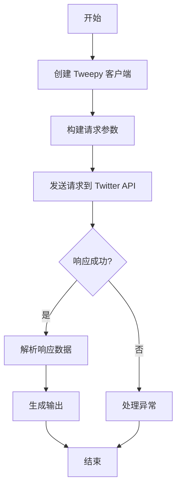
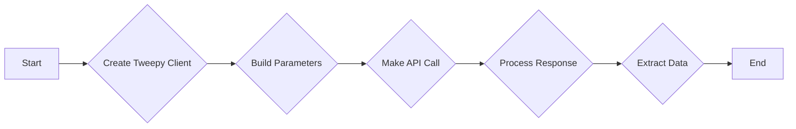
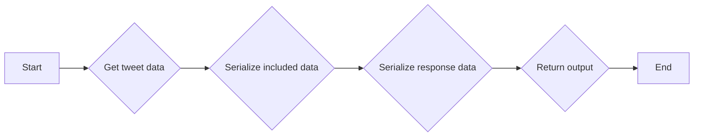
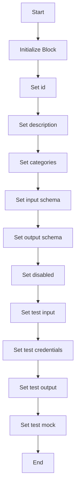
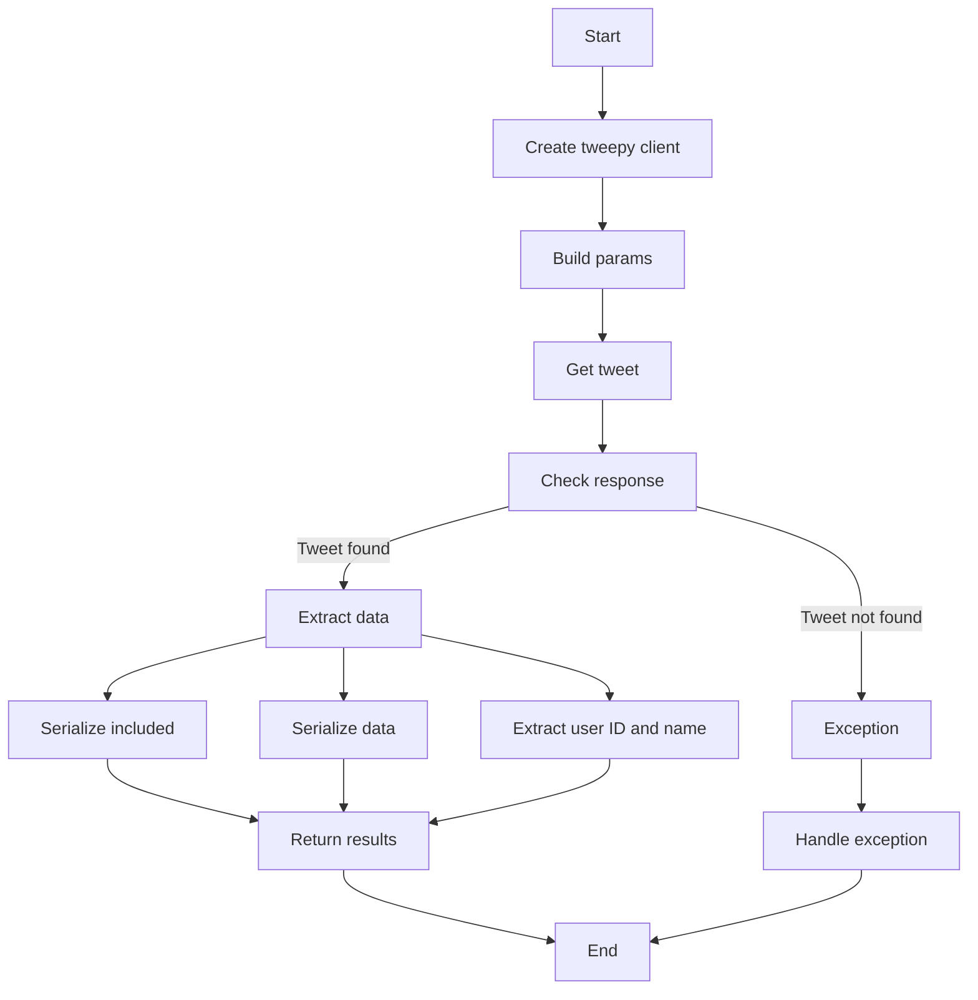
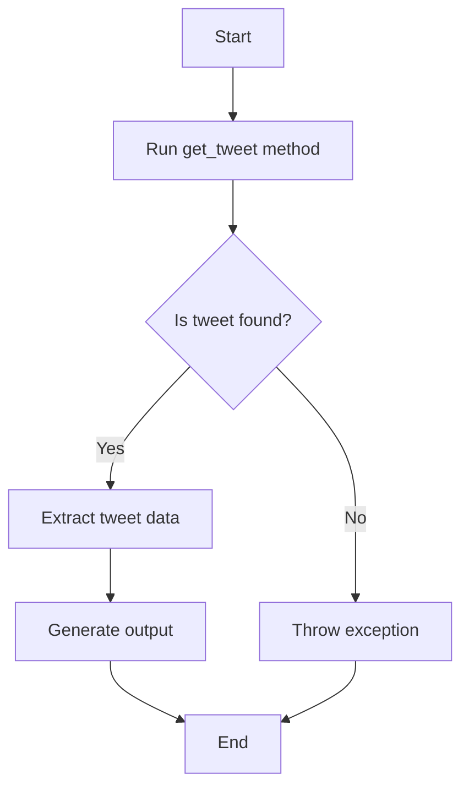

# `.\AutoGPT\autogpt_platform\backend\backend\blocks\twitter\tweets\tweet_lookup.py` 详细设计文档

This file contains the implementation of a TwitterGetTweetBlock class that retrieves information about a single Tweet specified by the requested ID using the Twitter API.

## 整体流程



## 类结构

```
TwitterGetTweetBlock (具体类)
├── Input (内部类)
│   ├── credentials (TwitterCredentialsInput)
│   └── tweet_id (str)
├── Output (内部类)
│   ├── id (str)
│   ├── text (str)
│   ├── userId (str)
│   ├── userName (str)
│   ├── data (dict)
│   └── included (dict)
└── meta (dict)
```

## 全局变量及字段


### `TEST_CREDENTIALS`
    
Test Twitter credentials used for testing purposes.

类型：`TwitterCredentials`
    


### `TEST_CREDENTIALS_INPUT`
    
Test Twitter credentials input schema used for testing purposes.

类型：`TwitterCredentialsInput`
    


### `TWITTER_OAUTH_IS_CONFIGURED`
    
Flag indicating if Twitter OAuth is configured.

类型：`bool`
    


### `TwitterCredentials`
    
Class representing Twitter credentials.

类型：`class`
    


### `TwitterCredentialsField`
    
Class representing a field in Twitter credentials.

类型：`class`
    


### `TwitterCredentialsInput`
    
Class representing input for Twitter credentials.

类型：`class`
    


### `TweetExpansionsBuilder`
    
Class for building tweet expansions parameters.

类型：`class`
    


### `IncludesSerializer`
    
Class for serializing includes data from Twitter API responses.

类型：`class`
    


### `ResponseDataSerializer`
    
Class for serializing response data from Twitter API responses.

类型：`class`
    


### `ExpansionFilter`
    
Class representing an expansion filter for tweets.

类型：`class`
    


### `TweetExpansionInputs`
    
Class representing inputs for tweet expansions.

类型：`class`
    


### `TweetFieldsFilter`
    
Class representing a filter for tweet fields.

类型：`class`
    


### `TweetMediaFieldsFilter`
    
Class representing a filter for media fields in tweets.

类型：`class`
    


### `TweetPlaceFieldsFilter`
    
Class representing a filter for place fields in tweets.

类型：`class`
    


### `TweetPollFieldsFilter`
    
Class representing a filter for poll fields in tweets.

类型：`class`
    


### `TweetUserFieldsFilter`
    
Class representing a filter for user fields in tweets.

类型：`class`
    


### `handle_tweepy_exception`
    
Function to handle Tweepy exceptions.

类型：`function`
    


### `Block`
    
Base class for blocks.

类型：`class`
    


### `BlockCategory`
    
Class representing block categories.

类型：`class`
    


### `BlockOutput`
    
Class representing block output.

类型：`class`
    


### `BlockSchemaOutput`
    
Class representing block schema output.

类型：`class`
    


### `SchemaField`
    
Class representing a schema field.

类型：`class`
    


### `TwitterGetTweetBlock.id`
    
Unique identifier for the TwitterGetTweetBlock.

类型：`str`
    


### `TwitterGetTweetBlock.description`
    
Description of the TwitterGetTweetBlock.

类型：`str`
    


### `TwitterGetTweetBlock.categories`
    
Categories to which the TwitterGetTweetBlock belongs.

类型：`set`
    


### `TwitterGetTweetBlock.input_schema`
    
Input schema for the TwitterGetTweetBlock.

类型：`class`
    


### `TwitterGetTweetBlock.output_schema`
    
Output schema for the TwitterGetTweetBlock.

类型：`class`
    


### `TwitterGetTweetBlock.disabled`
    
Flag indicating if the TwitterGetTweetBlock is disabled.

类型：`bool`
    


### `TwitterGetTweetBlock.test_input`
    
Test input data for the TwitterGetTweetBlock.

类型：`dict`
    


### `TwitterGetTweetBlock.test_credentials`
    
Test credentials for the TwitterGetTweetBlock.

类型：`TwitterCredentials`
    


### `TwitterGetTweetBlock.test_output`
    
Test output data for the TwitterGetTweetBlock.

类型：`list`
    


### `TwitterGetTweetBlock.test_mock`
    
Test mock data for the TwitterGetTweetBlock.

类型：`dict`
    


### `Input.credentials`
    
Twitter credentials input.

类型：`TwitterCredentialsInput`
    


### `Input.tweet_id`
    
Unique identifier of the tweet to request.

类型：`str`
    


### `Output.id`
    
Tweet ID.

类型：`str`
    


### `Output.text`
    
Tweet text.

类型：`str`
    


### `Output.userId`
    
ID of the tweet author.

类型：`str`
    


### `Output.userName`
    
Username of the tweet author.

类型：`str`
    


### `Output.data`
    
Tweet data.

类型：`dict`
    


### `Output.included`
    
Additional data requested via expansions.

类型：`dict`
    


### `Output.meta`
    
Metadata about the tweet.

类型：`dict`
    
    

## 全局函数及方法


### `TwitterGetTweetBlock.get_tweet`

Retrieves information about a single Tweet specified by the requested ID.

参数：

- `credentials`：`TwitterCredentials`，Twitter credentials object containing access token.
- `tweet_id`：`str`，Unique identifier of the Tweet to request.
- `expansions`：`ExpansionFilter | None`，Optional. Specifies the expansions to include in the response.
- `media_fields`：`TweetMediaFieldsFilter | None`，Optional. Specifies the media fields to include in the response.
- `place_fields`：`TweetPlaceFieldsFilter | None`，Optional. Specifies the place fields to include in the response.
- `poll_fields`：`TweetPollFieldsFilter | None`，Optional. Specifies the poll fields to include in the response.
- `tweet_fields`：`TweetFieldsFilter | None`，Optional. Specifies the tweet fields to include in the response.
- `user_fields`：`TweetUserFieldsFilter | None`，Optional. Specifies the user fields to include in the response.

返回值：`dict`，Tweet data, included data, metadata, user ID, and user name.

#### 流程图



#### 带注释源码

```python
@staticmethod
def get_tweet(
    credentials: TwitterCredentials,
    tweet_id: str,
    expansions: ExpansionFilter | None,
    media_fields: TweetMediaFieldsFilter | None,
    place_fields: TweetPlaceFieldsFilter | None,
    poll_fields: TweetPollFieldsFilter | None,
    tweet_fields: TweetFieldsFilter | None,
    user_fields: TweetUserFieldsFilter | None,
):
    try:
        client = tweepy.Client(
            bearer_token=credentials.access_token.get_secret_value()
        )
        params = {"id": tweet_id, "user_auth": False}

        # Adding expansions to params If required by the user
        params = (
            TweetExpansionsBuilder(params)
            .add_expansions(expansions)
            .add_media_fields(media_fields)
            .add_place_fields(place_fields)
            .add_poll_fields(poll_fields)
            .add_tweet_fields(tweet_fields)
            .add_user_fields(user_fields)
            .build()
        )

        response = cast(Response, client.get_tweet(**params))

        meta = {}
        user_id = ""
        user_name = ""

        if response.meta:
            meta = response.meta

        included = IncludesSerializer.serialize(response.includes)
        data = ResponseDataSerializer.serialize_dict(response.data)

        if included and "users" in included:
            user_id = str(included["users"][0]["id"])
            user_name = included["users"][0]["username"]

        if response.data:
            return data, included, meta, user_id, user_name

        raise Exception("Tweet not found")

    except tweepy.TweepyException:
        raise
```


### `TwitterGetTweetBlock.run`

Retrieves information about a single Tweet specified by the requested ID.

参数：

- `input_data`：`Input`，The input data for the block, containing the necessary information to fetch the tweet.
- `credentials`：`TwitterCredentials`，The Twitter credentials required to authenticate the request.
- `**kwargs`：`Any`，Additional keyword arguments that may be passed to the method.

返回值：`BlockOutput`，The output of the block, containing the fetched tweet information.

#### 流程图



#### 带注释源码

```python
async def run(
    self,
    input_data: Input,
    *,
    credentials: TwitterCredentials,
    **kwargs,
) -> BlockOutput:
    try:
        tweet_data, included, meta, user_id, user_name = self.get_tweet(
            credentials,
            input_data.tweet_id,
            input_data.expansions,
            input_data.media_fields,
            input_data.place_fields,
            input_data.poll_fields,
            input_data.tweet_fields,
            input_data.user_fields,
        )

        yield "id", str(tweet_data["id"])
        yield "text", tweet_data["text"]
        if user_id:
            yield "userId", user_id
        if user_name:
            yield "userName", user_name
        yield "data", tweet_data
        if included:
            yield "included", included
        if meta:
            yield "meta", meta

    except Exception as e:
        yield "error", handle_tweepy_exception(e)
```


### `TwitterGetTweetBlock.__init__`

This method initializes the `TwitterGetTweetBlock` class, setting up its properties and configurations.

参数：

- `id`: `str`，Unique identifier for the block.
- `description`: `str`，Description of the block's functionality.
- `categories`: `set`，Categories to which the block belongs.
- `input_schema`: `Input`，Schema for the block's input.
- `output_schema`: `Output`，Schema for the block's output.
- `disabled`: `bool`，Indicates if the block is disabled.
- `test_input`: `dict`，Test input data for the block.
- `test_credentials`: `TwitterCredentials`，Test credentials for the block.
- `test_output`: `list`，Test output data for the block.
- `test_mock`: `dict`，Mock data for testing the block.

返回值：`None`，This method does not return any value.

#### 流程图



#### 带注释源码

```python
def __init__(self):
    super().__init__(
        id="f5155c3a-a630-11ef-9cc1-a309988b4d92",
        description="This block retrieves information about a specific Tweet.",
        categories={BlockCategory.SOCIAL},
        input_schema=TwitterGetTweetBlock.Input,
        output_schema=TwitterGetTweetBlock.Output,
        disabled=not TWITTER_OAUTH_IS_CONFIGURED,
        test_input={
            "tweet_id": "1460323737035677698",
            "credentials": TEST_CREDENTIALS_INPUT,
            "expansions": None,
            "media_fields": None,
            "place_fields": None,
            "poll_fields": None,
            "tweet_fields": None,
            "user_fields": None,
        },
        test_credentials=TEST_CREDENTIALS,
        test_output=[
            ("id", "1460323737035677698"),
            ("text", "Test tweet content"),
            ("userId", "12345"),
            ("userName", "testuser"),
            ("data", {"id": "1460323737035677698", "text": "Test tweet content"}),
            ("included", {"users": [{"id": "12345", "username": "testuser"}]}),
            ("meta", {"result_count": 1}),
        ],
        test_mock={
            "get_tweet": lambda *args, **kwargs: (
                {"id": "1460323737035677698", "text": "Test tweet content"},
                {"users": [{"id": "12345", "username": "testuser"}]},
                {"result_count": 1},
                "12345",
                "testuser",
            )
        },
    )
```


### TwitterGetTweetBlock.get_tweet

This method retrieves information about a single Tweet specified by the requested ID using the Twitter API.

参数：

- `credentials`：`TwitterCredentials`，Twitter API credentials containing access token.
- `tweet_id`：`str`，Unique identifier of the Tweet to request.
- `expansions`：`ExpansionFilter | None`，Optional. Specifies the fields to expand in the response.
- `media_fields`：`TweetMediaFieldsFilter | None`，Optional. Specifies the fields to include in the media objects.
- `place_fields`：`TweetPlaceFieldsFilter | None`，Optional. Specifies the fields to include in the place objects.
- `poll_fields`：`TweetPollFieldsFilter | None`，Optional. Specifies the fields to include in the poll objects.
- `tweet_fields`：`TweetFieldsFilter | None`，Optional. Specifies the fields to include in the tweet objects.
- `user_fields`：`TweetUserFieldsFilter | None`，Optional. Specifies the fields to include in the user objects.

返回值：`dict`，Tweet data, included data, metadata, user ID, and user name.

#### 流程图



#### 带注释源码

```python
@staticmethod
def get_tweet(
    credentials: TwitterCredentials,
    tweet_id: str,
    expansions: ExpansionFilter | None,
    media_fields: TweetMediaFieldsFilter | None,
    place_fields: TweetPlaceFieldsFilter | None,
    poll_fields: TweetPollFieldsFilter | None,
    tweet_fields: TweetFieldsFilter | None,
    user_fields: TweetUserFieldsFilter | None,
):
    try:
        client = tweepy.Client(
            bearer_token=credentials.access_token.get_secret_value()
        )
        params = {"id": tweet_id, "user_auth": False}

        # Adding expansions to params If required by the user
        params = (
            TweetExpansionsBuilder(params)
            .add_expansions(expansions)
            .add_media_fields(media_fields)
            .add_place_fields(place_fields)
            .add_poll_fields(poll_fields)
            .add_tweet_fields(tweet_fields)
            .add_user_fields(user_fields)
            .build()
        )

        response = cast(Response, client.get_tweet(**params))

        meta = {}
        user_id = ""
        user_name = ""

        if response.meta:
            meta = response.meta

        included = IncludesSerializer.serialize(response.includes)
        data = ResponseDataSerializer.serialize_dict(response.data)

        if included and "users" in included:
            user_id = str(included["users"][0]["id"])
            user_name = included["users"][0]["username"]

        if response.data:
            return data, included, meta, user_id, user_name

        raise Exception("Tweet not found")

    except tweepy.TweepyException:
        raise
```


### TwitterGetTweetBlock.run

Retrieves information about a single Tweet specified by the requested ID.

参数：

- `input_data`：`Input`，The input data for the block, containing the tweet ID and other optional parameters.
- `credentials`：`TwitterCredentials`，The Twitter credentials required to authenticate the request.

返回值：`BlockOutput`，The output of the block, containing the tweet data, user information, and metadata.

#### 流程图



#### 带注释源码

```python
async def run(
    self,
    input_data: Input,
    *,
    credentials: TwitterCredentials,
    **kwargs,
) -> BlockOutput:
    try:
        tweet_data, included, meta, user_id, user_name = self.get_tweet(
            credentials,
            input_data.tweet_id,
            input_data.expansions,
            input_data.media_fields,
            input_data.place_fields,
            input_data.poll_fields,
            input_data.tweet_fields,
            input_data.user_fields,
        )

        yield "id", str(tweet_data["id"])
        yield "text", tweet_data["text"]
        if user_id:
            yield "userId", user_id
        if user_name:
            yield "userName", user_name
        yield "data", tweet_data
        if included:
            yield "included", included
        if meta:
            yield "meta", meta

    except Exception as e:
        yield "error", handle_tweepy_exception(e)
```


## 关键组件


### 张量索引与惰性加载

张量索引与惰性加载是代码中处理数据的一种方式，它允许在需要时才加载和索引数据，从而提高性能和减少内存消耗。

### 反量化支持

反量化支持是代码中实现的一种功能，它允许在量化过程中将量化后的数据转换回原始数据格式，以便进行进一步的处理和分析。

### 量化策略

量化策略是代码中用于优化模型性能的一种方法，它通过减少模型中使用的数值精度来减少模型大小和计算需求，同时保持模型性能。

## 问题及建议


### 已知问题

-   **全局变量依赖**: `TWITTER_OAUTH_IS_CONFIGURED` 是一个全局变量，它控制着 `TwitterGetTweetBlock` 和 `TwitterGetTweetsBlock` 类的启用状态。这个全局变量的值可能需要在多个地方设置，导致维护困难。
-   **异常处理**: `handle_tweepy_exception` 函数被用来处理 `tweepy.TweepyException`，但是它没有提供足够的信息来帮助调试。建议记录更详细的错误信息。
-   **代码重复**: `get_tweet` 和 `get_tweets` 方法在处理响应和序列化数据方面有大量重复代码。可以考虑将这些逻辑抽象到一个单独的函数中，以减少代码重复。
-   **异步方法**: `run` 方法被声明为异步方法，但是没有使用 `async` 关键字。这可能导致异步代码无法正确执行。

### 优化建议

-   **全局变量管理**: 考虑将 `TWITTER_OAUTH_IS_CONFIGURED` 的管理逻辑移到一个单独的配置类中，以减少全局变量的使用。
-   **异常信息**: 在 `handle_tweepy_exception` 函数中添加更多的错误信息，例如异常类型和堆栈跟踪，以便于调试。
-   **代码重构**: 将 `get_tweet` 和 `get_tweets` 方法中的重复代码抽象到一个单独的函数中，以提高代码的可维护性和可读性。
-   **异步代码**: 确保异步方法 `run` 使用 `async` 关键字，并处理异步操作，例如网络请求。
-   **单元测试**: 为 `get_tweet`、`get_tweets` 和 `handle_tweepy_exception` 方法编写单元测试，以确保它们按预期工作。
-   **文档**: 为代码添加更详细的文档注释，包括每个方法和函数的参数、返回值和异常处理。


## 其它


### 设计目标与约束

- 设计目标：
  - 提供一个模块化的Twitter数据获取解决方案。
  - 支持获取单个或多个推文的详细信息。
  - 支持Twitter API的认证和授权。
  - 提供错误处理和异常管理机制。
  - 确保代码的可维护性和可扩展性。

- 约束条件：
  - 必须使用Twitter API进行数据获取。
  - 代码必须遵循Twitter API的使用条款。
  - 代码必须处理Twitter API可能抛出的异常。
  - 代码必须支持异步执行以优化性能。

### 错误处理与异常设计

- 错误处理：
  - 使用`try-except`块捕获和处理可能发生的异常。
  - 使用自定义异常处理函数`handle_tweepy_exception`来处理`tweepy.TweepyException`。
  - 将异常信息转换为用户友好的错误消息。

### 数据流与状态机

- 数据流：
  - 输入数据通过`run`方法传递给`get_tweet`或`get_tweets`方法。
  - `get_tweet`和`get_tweets`方法从Twitter API获取数据。
  - 获取的数据通过`yield`语句返回给调用者。

- 状态机：
  - 无状态机设计，因为每个方法都是独立执行的。

### 外部依赖与接口契约

- 外部依赖：
  - `tweepy`库用于与Twitter API交互。
  - `backend.data.block`模块用于定义块和输出。

- 接口契约：
  - `TwitterGetTweetBlock`和`TwitterGetTweetsBlock`类定义了输入和输出契约。
  - `Input`和`Output`类定义了输入和输出数据的结构。
  - `handle_tweepy_exception`函数定义了异常处理契约。

    