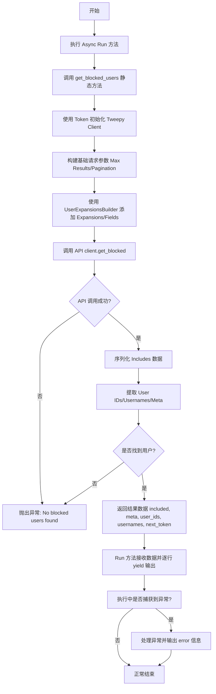
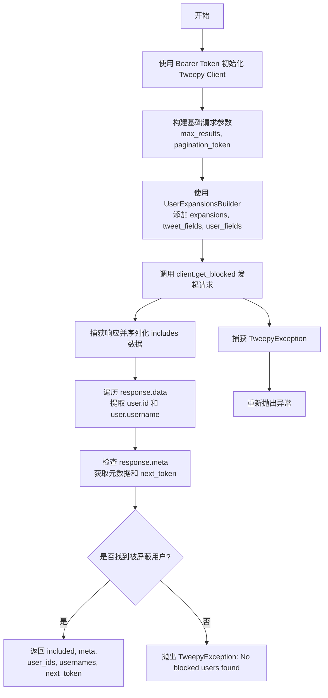
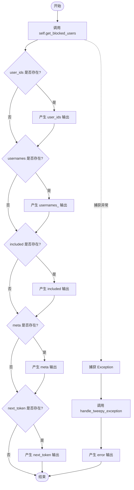

# `AutoGPT\autogpt_platform\backend\backend\blocks\twitter\users\blocks.py` 详细设计文档

该代码定义了一个 TwitterGetBlockedUsersBlock 类，用于通过 Tweepy 客户端获取当前认证用户屏蔽的用户列表，支持分页、字段扩展，并处理认证与数据序列化。

## 整体流程



## 类结构

```
Block
└── TwitterGetBlockedUsersBlock
    ├── Input (继承自 UserExpansionInputs)
    └── Output (继承自 BlockSchemaOutput)
```

## 全局变量及字段


### `TwitterGetBlockedUsersBlock.Input.credentials`
    
Twitter API credentials with required permissions (users.read, offline.access, block.read)

类型：`TwitterCredentialsInput`
    


### `TwitterGetBlockedUsersBlock.Input.max_results`
    
Maximum number of results to return (1-1000, default 100)

类型：`int | None`
    


### `TwitterGetBlockedUsersBlock.Input.pagination_token`
    
Token for retrieving next/previous page of results

类型：`str | None`
    


### `TwitterGetBlockedUsersBlock.Output.user_ids`
    
List of blocked user IDs

类型：`list[str]`
    


### `TwitterGetBlockedUsersBlock.Output.usernames_`
    
List of blocked usernames

类型：`list[str]`
    


### `TwitterGetBlockedUsersBlock.Output.included`
    
Additional data requested via expansions

类型：`dict`
    


### `TwitterGetBlockedUsersBlock.Output.meta`
    
Metadata including pagination info

类型：`dict`
    


### `TwitterGetBlockedUsersBlock.Output.next_token`
    
Next token for pagination

类型：`str`
    
    

## 全局函数及方法


### `TwitterGetBlockedUsersBlock.__init__`

初始化 Twitter 获取被屏蔽用户块的实例，配置其元数据、输入输出模式、测试用例以及模拟行为。

参数：

-  `self`：`TwitterGetBlockedUsersBlock`，类的实例对象本身

返回值：`None`，Python 构造函数不返回任何值

#### 流程图

```mermaid
graph TD
    A[Start: __init__] --> B[Call super().__init__]
    B --> C[Configure Basic Metadata]
    C --> C1[Set ID: 05f409e8-a631-11ef-ae89-93de863ee30d]
    C --> C2[Set Description: Retrieves blocked users]
    C --> C3[Set Category: SOCIAL]
    B --> D[Configure Schemas]
    D --> D1[Input Schema: TwitterGetBlockedUsersBlock.Input]
    D --> D2[Output Schema: TwitterGetBlockedUsersBlock.Output]
    B --> E[Configure State & Tests]
    E --> E1[Check OAuth Config to set disabled status]
    E --> E2[Define test_input defaults]
    E --> E3[Define test_output expectations]
    E --> E4[Define test_mock for get_blocked_users]
    E & D & C --> F[End: Block Initialized]
```

#### 带注释源码

```python
def __init__(self):
    # 调用父类 Block 的构造函数，传递块的配置参数
    super().__init__(
        # 块的唯一标识符
        id="05f409e8-a631-11ef-ae89-93de863ee30d",
        # 块的功能描述
        description="This block retrieves a list of users blocked by the authenticating user.",
        # 将块归类为社交媒体类别
        categories={BlockCategory.SOCIAL},
        # 定义输入数据的 Schema，继承自内部类 Input
        input_schema=TwitterGetBlockedUsersBlock.Input,
        # 定义输出数据的 Schema，继承自内部类 Output
        output_schema=TwitterGetBlockedUsersBlock.Output,
        # 根据 Twitter OAuth 是否配置来决定是否禁用该块
        disabled=not TWITTER_OAUTH_IS_CONFIGURED,
        # 定义用于测试的输入参数默认值
        test_input={
            "max_results": 10,
            "pagination_token": "",
            "credentials": TEST_CREDENTIALS_INPUT,
            "expansions": None,
            "tweet_fields": None,
            "user_fields": None,
        },
        # 定义测试用的凭证对象
        test_credentials=TEST_CREDENTIALS,
        # 定义预期的测试输出结果
        test_output=[
            ("user_ids", ["12345", "67890"]),
            ("usernames_", ["testuser1", "testuser2"]),
        ],
        # 定义测试时的 Mock 行为，模拟 get_blocked_users 方法返回固定的元组数据
        test_mock={
            "get_blocked_users": lambda *args, **kwargs: (
                {},  # included
                {},  # meta
                ["12345", "67890"],  # user_ids
                ["testuser1", "testuser2"],  # usernames
                None,  # next_token
            )
        },
    )
```


### `TwitterGetBlockedUsersBlock.get_blocked_users`

该方法是一个静态方法，负责通过 Tweepy 客户端调用 Twitter API 获取当前认证用户屏蔽的用户列表。它处理认证、参数构建、API 请求调用、响应数据的解析（包括 ID、用户名和扩展数据）以及分页令牌的提取。

参数：

-   `credentials`：`TwitterCredentials`，Twitter 认证凭证，包含用于 API 访问的 Access Token。
-   `max_results`：`int | None`，指定返回结果的最大数量（通常在 1-1000 之间）。
-   `pagination_token`：`str | None`，用于检索结果下一页或上一页的分页令牌。
-   `expansions`：`UserExpansionsFilter | None`，扩展字段过滤器，用于请求额外的关联数据。
-   `tweet_fields`：`TweetFieldsFilter | None`，推文字段过滤器，指定返回哪些推文相关字段。
-   `user_fields`：`TweetUserFieldsFilter | None`，用户字段过滤器，指定返回哪些用户相关字段。

返回值：`tuple[dict, dict, list[str], list[str], str | None]`，返回一个包含五个元素的元组：扩展数据 (`included`)、元数据 (`meta`)、被屏蔽用户 ID 列表 (`user_ids`)、被屏蔽用户名列表 (`usernames`) 以及下一页分页令牌 (`next_token`)。

#### 流程图



#### 带注释源码

```python
    @staticmethod
    def get_blocked_users(
        credentials: TwitterCredentials,
        max_results: int | None,
        pagination_token: str | None,
        expansions: UserExpansionsFilter | None,
        tweet_fields: TweetFieldsFilter | None,
        user_fields: TweetUserFieldsFilter | None,
    ):
        try:
            # 1. 初始化 Tweepy 客户端，使用不记名令牌（Bearer Token）进行应用级或用户级认证
            client = tweepy.Client(
                bearer_token=credentials.access_token.get_secret_value()
            )

            # 2. 构建基础请求参数
            params = {
                "max_results": max_results,
                # 处理分页令牌：如果是空字符串则转为 None
                "pagination_token": (
                    None if pagination_token == "" else pagination_token
                ),
                # 指定不使用用户上下文认证（即使用 OAuth 2.0 Bearer Token）
                "user_auth": False,
            }

            # 3. 使用 Builder 模式向参数中添加扩展字段、推文字段和用户字段
            params = (
                UserExpansionsBuilder(params)
                .add_expansions(expansions)
                .add_tweet_fields(tweet_fields)
                .add_user_fields(user_fields)
                .build()
            )

            # 4. 发起 API 请求获取被屏蔽用户列表
            response = cast(Response, client.get_blocked(**params))

            # 5. 初始化返回数据变量
            meta = {}
            user_ids = []
            usernames = []
            next_token = None

            # 6. 序列化响应中的额外扩展数据（如推文引用等）
            included = IncludesSerializer.serialize(response.includes)

            # 7. 如果响应数据存在，遍历用户列表提取 ID 和用户名
            if response.data:
                for user in response.data:
                    user_ids.append(str(user.id))
                    usernames.append(user.username)

            # 8. 处理响应元数据，提取分页信息
            if response.meta:
                meta = response.meta
                if "next_token" in meta:
                    next_token = meta["next_token"]

            # 9. 如果成功获取到用户，返回结果元组
            if user_ids and usernames:
                return included, meta, user_ids, usernames, next_token
            else:
                # 如果没有找到数据，抛出异常
                raise tweepy.TweepyException("No blocked users found")

        except tweepy.TweepyException:
            # 捕获并重新抛出 Tweepy 异常，供上层处理
            raise
```


### `TwitterGetBlockedUsersBlock.run`

执行获取被屏蔽用户的异步逻辑，调用静态方法与 Twitter API 交互，并将结果数据分块输出，同时处理可能发生的异常。

参数：

- `input_data`：`Input`，包含查询参数（如最大结果数、分页令牌、扩展字段等）的输入数据对象。
- `credentials`：`TwitterCredentials`，用于认证的 Twitter 凭证对象，包含访问令牌等信息。
- `**kwargs`：`dict`，额外的关键字参数，当前未使用。

返回值：`BlockOutput`，一个异步生成器，按顺序产生包含 user_ids、usernames_、included、meta、next_token 或 error 的键值对元组。

#### 流程图



#### 带注释源码

```python
    async def run(
        self,
        input_data: Input,
        *,
        credentials: TwitterCredentials,
        **kwargs,
    ) -> BlockOutput:
        try:
            # 调用静态方法 get_blocked_users 获取数据
            # 该方法负责与 Twitter API 交互并返回解析后的数据
            included, meta, user_ids, usernames, next_token = self.get_blocked_users(
                credentials,
                input_data.max_results,
                input_data.pagination_token,
                input_data.expansions,
                input_data.tweet_fields,
                input_data.user_fields,
            )
            
            # 检查并输出用户 ID 列表
            if user_ids:
                yield "user_ids", user_ids
            
            # 检查并输出用户名列表
            if usernames:
                yield "usernames_", usernames
            
            # 检查并输出扩展附加数据（如推文信息等）
            if included:
                yield "included", included
            
            # 检查并输出元数据（如分页信息等）
            if meta:
                yield "meta", meta
            
            # 检查并输出下一页的令牌
            if next_token:
                yield "next_token", next_token
                
        except Exception as e:
            # 捕获任何异常，通过 handle_tweepy_exception 进行标准化处理后输出错误信息
            yield "error", handle_tweepy_exception(e)
```


## 关键组件


### Input Schema
定义块的输入结构，包含 Twitter 凭据、分页参数以及用于扩展数据的字段过滤器。

### Output Schema
定义块的输出结构，封装了拉黑用户的 ID、用户名、元数据和序列化的包含数据。

### Request Parameter Builder
使用 UserExpansionsBuilder 组件，动态构建包含扩展、推文字段和用户字段的 API 请求参数。

### Response Data Serializer
使用 IncludesSerializer 组件，将 Twitter API 响应中的额外扩展数据（如媒体、推文等）解析并序列化。

### Core Business Logic
静态方法 get_blocked_users，负责初始化 Tweepy 客户端、执行 API 调用以及解析原始响应数据。

### Async Execution Orchestrator
异步方法 run，负责协调整个块的执行流程，包括调用业务逻辑、生成输出结果和处理异常。


## 问题及建议


### 已知问题

-   **阻塞异步事件循环**: `run` 方法定义为 `async`，但内部调用的 `get_blocked_users` 方法使用了同步的 `tweepy.Client` 进行网络 I/O 操作。在异步架构中，同步阻塞会挂起整个事件循环，严重降低并发性能。
-   **空结果被视为异常**: 代码逻辑中，当没有找到被拉黑的用户（`response.data` 为空）时，显式抛出了 `tweepy.TweepyException`。在许多业务场景下，“用户未拉黑任何人”是正常状态而非错误，强制抛出异常会导致错误日志噪音，并使调用方难以区分业务无数据和系统故障。
-   **冗余的异常处理**: 在 `get_blocked_users` 方法中，`except tweepy.TweepyException: raise` 语句捕获异常后仅仅重新抛出，未进行任何日志记录、清理或转换操作，这是无效的代码。

### 优化建议

-   **使用异步客户端**: 将 `tweepy.Client` 替换为 `tweepy.asynchronous.AsyncClient`，并将 `get_blocked_users` 改为 `async` 方法。通过 `await` 调用 API，实现真正的非阻塞 I/O，提升系统吞吐量。
-   **修正空数据处理逻辑**: 移除当结果为空时抛出异常的逻辑。当 API 返回无数据时，应返回空的列表和元数据字典，保持输出接口的一致性，由业务上游判断空结果是否需要处理。
-   **清理无效代码**: 移除 `get_blocked_users` 中仅做重抛动作的 `try-except` 块，简化代码逻辑，让异常自然传播到 `run` 方法中的统一错误处理器。
-   **增加日志与监控**: 在 API 请求开始、成功获取数据及捕获异常时增加日志记录（如使用 `logging` 模块），以便于在生产环境中追踪调用链路和排查问题。


## 其它


### 设计目标与约束

**设计目标：**
提供一个标准化的、可复用的 Block 组件，用于获取当前认证用户的屏蔽用户列表。该组件旨在集成到更大的自动化工作流中，支持通过扩展字段获取额外的关联数据，并支持分页查询以处理大量数据。

**设计约束：**
1. **认证依赖**：组件的可用性严格依赖于 Twitter OAuth 的配置状态（`TWITTER_OAUTH_IS_CONFIGURED`），若未配置则自动禁用。
2. **参数限制**：`max_results` 参数需遵循 Twitter API 的限制（1-1000），默认值为 10 以平衡性能与数据量。
3. **异步执行**：主执行方法 `run` 设计为异步方法（`async`），以适应高并发的 I/O 密集型应用场景，防止阻塞主线程。

### 错误处理与异常设计

**异常处理策略：**
1. **底层异常捕获与转换**：在 `get_blocked_users` 静态方法中，捕获 `tweepy.TweepyException`。如果 API 调用成功但未找到被屏蔽的用户（即返回列表为空），显式抛出 `TweepyException("No blocked users found")`，确保业务逻辑的异常不被静默忽略。
2. **顶层异常统一处理**：在 `run` 方法中使用 `try-except` 块捕获所有异常（`Exception`），并通过 `handle_tweepy_exception` 函数将底层异常转换为标准化的错误信息。
3. **错误输出机制**：遵循 Block 的设计模式，通过 `yield "error", error_message` 的方式将错误信息作为输出流的一部分返回，而不是直接抛出异常中断流程，允许下游 Block 根据错误信息执行降级或重试逻辑。

### 数据流与状态机

**数据流：**
1. **输入阶段**：接收凭证、分页令牌、最大结果数及扩展字段配置。
2. **处理阶段**：
   - 验证凭证并初始化 `tweepy.Client`。
   - 使用 Builder 模式构建 API 请求参数（包含 Expansions 和 Fields）。
   - 调用 Twitter API `get_blocked` 获取原始响应。
   - 使用 `IncludesSerializer` 序列化附加数据，提取用户 ID、用户名及元数据。
3. **输出阶段**：通过 Python 生成器逐步产出 `user_ids`、`usernames_`、`included`、`meta` 和 `next_token`。

**状态管理（分页状态）：**
- 本身不维护内部持久化状态，采用无状态设计。
- 分页状态由 `pagination_token`（输入）和 `next_token`（输出）显式传递。调用者负责保存 `next_token` 并在请求下一页时将其作为 `pagination_token` 传入，从而实现跨请求的分页浏览。

### 外部依赖与接口契约

**外部依赖：**
1. **库依赖**：
   - `tweepy`：官方 Twitter API v2 的 Python 客户端库，用于处理网络请求和认证。
   - 内部模块：`backend.blocks.twitter._auth`（认证管理）、`_builders`（参数构建）、`_serializer`（响应序列化）等。
2. **服务依赖**：
   - **Twitter API (GET /2/users/me/blocking)**：依赖外部 Twitter 服务的可用性和速率限制策略。

**接口契约：**
1. **输入契约**：
   - 必须包含有效的 `TwitterCredentials`，且需具备 `users.read`、`offline.access` 和 `block.read` 权限。
   - 分页令牌必须为先前请求返回的有效字符串，否则可能返回空结果或错误。
2. **输出契约**：
   - 成功时：保证 `user_ids` 和 `usernames_` 列表长度一致；`meta` 包含 Twitter 返回的原始元数据；`next_token` 在有更多数据时存在。
   - 失败时：输出 `error` 键，包含符合 `handle_tweepy_exception` 定义的错误描述字符串。

    