# `.\AutoGPT\autogpt_platform\backend\backend\blocks\twitter\users\follows.py` 详细设计文档

This file contains Python classes for interacting with Twitter API, including unfollowing, following, and retrieving followers and following users.

## 整体流程

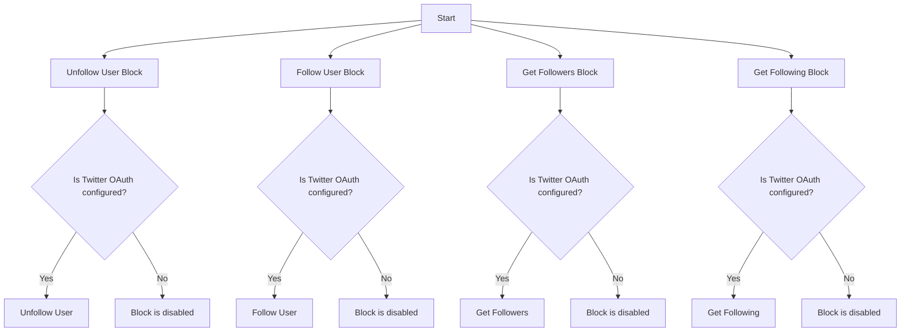

## 类结构

```
TwitterUnfollowUserBlock (Concrete Block)
├── Input
│   ├── credentials
│   └── target_user_id
└── Output
    └── success
TwitterFollowUserBlock (Concrete Block)
├── Input
│   ├── credentials
│   └── target_user_id
└── Output
    └── success
TwitterGetFollowersBlock (Concrete Block)
├── Input
│   ├── credentials
│   ├── target_user_id
│   ├── max_results
│   ├── pagination_token
│   └── expansions
└── Output
    ├── ids
    ├── usernames
    ├── next_token
    ├── data
    ├── includes
    └── meta
TwitterGetFollowingBlock (Concrete Block)
├── Input
│   ├── credentials
│   ├── target_user_id
│   ├── max_results
│   ├── pagination_token
│   └── expansions
└── Output
    ├── ids
    ├── usernames
    ├── next_token
    ├── data
    ├── includes
    └── meta
```

## 全局变量及字段


### `TEST_CREDENTIALS`
    
Test Twitter credentials used for testing purposes.

类型：`TwitterCredentials`
    


### `TEST_CREDENTIALS_INPUT`
    
Test input for Twitter credentials used for testing purposes.

类型：`TwitterCredentialsInput`
    


### `TWITTER_OAUTH_IS_CONFIGURED`
    
Flag indicating whether Twitter OAuth is configured for the application.

类型：`bool`
    


### `TwitterUnfollowUserBlock.id`
    
Unique identifier for the TwitterUnfollowUserBlock class.

类型：`str`
    


### `TwitterUnfollowUserBlock.description`
    
Description of the TwitterUnfollowUserBlock class.

类型：`str`
    


### `TwitterUnfollowUserBlock.categories`
    
Categories to which the TwitterUnfollowUserBlock class belongs.

类型：`set[BlockCategory]`
    


### `TwitterUnfollowUserBlock.input_schema`
    
Input schema for the TwitterUnfollowUserBlock class.

类型：`Input`
    


### `TwitterUnfollowUserBlock.output_schema`
    
Output schema for the TwitterUnfollowUserBlock class.

类型：`Output`
    


### `TwitterUnfollowUserBlock.disabled`
    
Flag indicating whether the TwitterUnfollowUserBlock class is disabled.

类型：`bool`
    


### `TwitterUnfollowUserBlock.test_input`
    
Test input data for the TwitterUnfollowUserBlock class.

类型：`dict`
    


### `TwitterUnfollowUserBlock.test_credentials`
    
Test credentials for the TwitterUnfollowUserBlock class.

类型：`TwitterCredentials`
    


### `TwitterUnfollowUserBlock.test_output`
    
Test output data for the TwitterUnfollowUserBlock class.

类型：`list[tuple]`
    


### `TwitterUnfollowUserBlock.test_mock`
    
Test mock data for the TwitterUnfollowUserBlock class.

类型：`dict`
    


### `TwitterFollowUserBlock.id`
    
Unique identifier for the TwitterFollowUserBlock class.

类型：`str`
    


### `TwitterFollowUserBlock.description`
    
Description of the TwitterFollowUserBlock class.

类型：`str`
    


### `TwitterFollowUserBlock.categories`
    
Categories to which the TwitterFollowUserBlock class belongs.

类型：`set[BlockCategory]`
    


### `TwitterFollowUserBlock.input_schema`
    
Input schema for the TwitterFollowUserBlock class.

类型：`Input`
    


### `TwitterFollowUserBlock.output_schema`
    
Output schema for the TwitterFollowUserBlock class.

类型：`Output`
    


### `TwitterFollowUserBlock.disabled`
    
Flag indicating whether the TwitterFollowUserBlock class is disabled.

类型：`bool`
    


### `TwitterFollowUserBlock.test_input`
    
Test input data for the TwitterFollowUserBlock class.

类型：`dict`
    


### `TwitterFollowUserBlock.test_credentials`
    
Test credentials for the TwitterFollowUserBlock class.

类型：`TwitterCredentials`
    


### `TwitterFollowUserBlock.test_output`
    
Test output data for the TwitterFollowUserBlock class.

类型：`list[tuple]`
    


### `TwitterFollowUserBlock.test_mock`
    
Test mock data for the TwitterFollowUserBlock class.

类型：`dict`
    


### `TwitterGetFollowersBlock.id`
    
Unique identifier for the TwitterGetFollowersBlock class.

类型：`str`
    


### `TwitterGetFollowersBlock.description`
    
Description of the TwitterGetFollowersBlock class.

类型：`str`
    


### `TwitterGetFollowersBlock.categories`
    
Categories to which the TwitterGetFollowersBlock class belongs.

类型：`set[BlockCategory]`
    


### `TwitterGetFollowersBlock.input_schema`
    
Input schema for the TwitterGetFollowersBlock class.

类型：`UserExpansionInputs`
    


### `TwitterGetFollowersBlock.output_schema`
    
Output schema for the TwitterGetFollowersBlock class.

类型：`Output`
    


### `TwitterGetFollowersBlock.disabled`
    
Flag indicating whether the TwitterGetFollowersBlock class is disabled.

类型：`bool`
    


### `TwitterGetFollowersBlock.test_input`
    
Test input data for the TwitterGetFollowersBlock class.

类型：`dict`
    


### `TwitterGetFollowersBlock.test_credentials`
    
Test credentials for the TwitterGetFollowersBlock class.

类型：`TwitterCredentials`
    


### `TwitterGetFollowersBlock.test_output`
    
Test output data for the TwitterGetFollowersBlock class.

类型：`list[tuple]`
    


### `TwitterGetFollowersBlock.test_mock`
    
Test mock data for the TwitterGetFollowersBlock class.

类型：`dict`
    


### `TwitterGetFollowingBlock.id`
    
Unique identifier for the TwitterGetFollowingBlock class.

类型：`str`
    


### `TwitterGetFollowingBlock.description`
    
Description of the TwitterGetFollowingBlock class.

类型：`str`
    


### `TwitterGetFollowingBlock.categories`
    
Categories to which the TwitterGetFollowingBlock class belongs.

类型：`set[BlockCategory]`
    


### `TwitterGetFollowingBlock.input_schema`
    
Input schema for the TwitterGetFollowingBlock class.

类型：`UserExpansionInputs`
    


### `TwitterGetFollowingBlock.output_schema`
    
Output schema for the TwitterGetFollowingBlock class.

类型：`Output`
    


### `TwitterGetFollowingBlock.disabled`
    
Flag indicating whether the TwitterGetFollowingBlock class is disabled.

类型：`bool`
    


### `TwitterGetFollowingBlock.test_input`
    
Test input data for the TwitterGetFollowingBlock class.

类型：`dict`
    


### `TwitterGetFollowingBlock.test_credentials`
    
Test credentials for the TwitterGetFollowingBlock class.

类型：`TwitterCredentials`
    


### `TwitterGetFollowingBlock.test_output`
    
Test output data for the TwitterGetFollowingBlock class.

类型：`list[tuple]`
    


### `TwitterGetFollowingBlock.test_mock`
    
Test mock data for the TwitterGetFollowingBlock class.

类型：`dict`
    
    

## 全局函数及方法


### `handle_tweepy_exception`

This function handles exceptions raised by the Tweepy library, which is used for interacting with the Twitter API.

参数：

- `e`：`Exception`，The exception object that was raised.

返回值：`str`，A string describing the exception.

#### 流程图

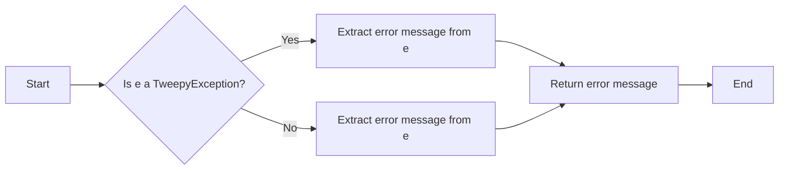

#### 带注释源码

```python
def handle_tweepy_exception(e: Exception) -> str:
    """
    Handles exceptions raised by the Tweepy library.

    :param e: The exception object that was raised.
    :return: A string describing the exception.
    """
    if isinstance(e, tweepy.TweepyException):
        return str(e)
    else:
        return str(e)
```


### UserExpansionsBuilder

This class is used to build the parameters for Twitter API requests that require expansions.

参数：

- `params`: `dict`，The initial parameters for the API request.
- `expansions`: `UserExpansionsFilter | None`，The expansions to include in the API request.
- `tweet_fields`: `TweetFieldsFilter | None`，The tweet fields to include in the API request.
- `user_fields`: `TweetUserFieldsFilter | None`，The user fields to include in the API request.

返回值：`dict`，The built parameters with expansions, tweet fields, and user fields included.

#### 流程图

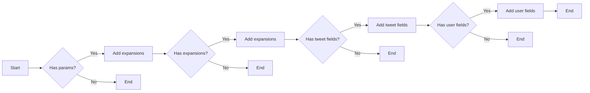

#### 带注释源码

```python
class UserExpansionsBuilder:
    def __init__(self, params: dict):
        self.params = params

    def add_expansions(self, expansions: UserExpansionsFilter | None) -> 'UserExpansionsBuilder':
        if expansions:
            self.params['expansions'] = expansions
        return self

    def add_tweet_fields(self, tweet_fields: TweetFieldsFilter | None) -> 'UserExpansionsBuilder':
        if tweet_fields:
            self.params['tweet_fields'] = tweet_fields
        return self

    def add_user_fields(self, user_fields: TweetUserFieldsFilter | None) -> 'UserExpansionsBuilder':
        if user_fields:
            self.params['user_fields'] = user_fields
        return self

    def build(self) -> dict:
        return self.params
```


### `TwitterGetFollowersBlock.get_followers`

Retrieves a list of followers for a specified Twitter user ID.

参数：

- `credentials`：`TwitterCredentials`，Twitter credentials object containing access token and secret.
- `target_user_id`：`str`，The user ID whose followers you would like to retrieve.
- `max_results`：`int | None`，Maximum number of results to return (1-1000, default 100).
- `pagination_token`：`str | None`，Token for retrieving next/previous page of results.
- `expansions`：`UserExpansionsFilter | None`，Additional data to include in the response.
- `tweet_fields`：`TweetFieldsFilter | None`，Fields to include in the returned tweets.
- `user_fields`：`TweetUserFieldsFilter | None`，Fields to include in the returned users.

返回值：`tuple`，A tuple containing the following elements:
- `follower_ids`：`list[str]`，List of follower user IDs.
- `follower_usernames`：`list[str]`，List of follower usernames.
- `data`：`list[dict]`，Complete user data for followers.
- `includes`：`dict`，Additional data requested via expansions.
- `meta`：`dict`，Metadata including pagination info.
- `next_token`：`str | None`，Next token for pagination.

#### 流程图

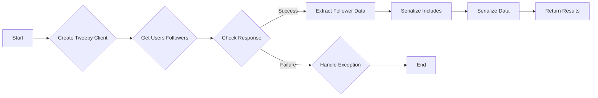

#### 带注释源码

```python
def get_followers(
    credentials: TwitterCredentials,
    target_user_id: str,
    max_results: int | None,
    pagination_token: str | None,
    expansions: UserExpansionsFilter | None,
    tweet_fields: TweetFieldsFilter | None,
    user_fields: TweetUserFieldsFilter | None,
):
    try:
        client = tweepy.Client(
            bearer_token=credentials.access_token.get_secret_value()
        )

        params = {
            "id": target_user_id,
            "max_results": max_results,
            "pagination_token": (
                None if pagination_token == "" else pagination_token
            ),
            "user_auth": False,
        }

        params = (
            UserExpansionsBuilder(params)
            .add_expansions(expansions)
            .add_tweet_fields(tweet_fields)
            .add_user_fields(user_fields)
            .build()
        )

        response = cast(Response, client.get_users_followers(**params))

        meta = {}
        follower_ids = []
        follower_usernames = []
        next_token = None

        if response.meta:
            meta = response.meta
            next_token = meta.get("next_token")

        included = IncludesSerializer.serialize(response.includes)
        data = ResponseDataSerializer.serialize_list(response.data)

        if response.data:
            follower_ids = [str(user.id) for user in response.data]
            follower_usernames = [user.username for user in response.data]

            return (
                follower_ids,
                follower_usernames,
                data,
                included,
                meta,
                next_token,
            )

        raise Exception("Followers not found")

    except tweepy.TweepyException:
        raise
``` 


### ResponseDataSerializer

This method serializes the data from a Twitter API response into a structured format.

参数：

- `data`: `list[dict]`，The data to be serialized from the Twitter API response.
- ...

返回值：`list[dict]`，The serialized data in a structured format.

#### 流程图

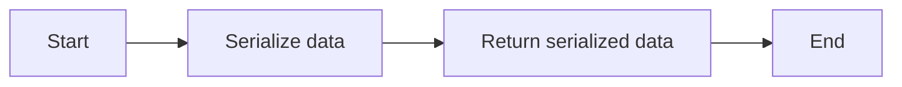

#### 带注释源码

```python
class ResponseDataSerializer:
    @staticmethod
    def serialize_list(data):
        """
        Serializes a list of data from the Twitter API response into a structured format.

        :param data: list[dict], The data to be serialized from the Twitter API response.
        :return: list[dict], The serialized data in a structured format.
        """
        # Assuming the data is already in the correct format, this method would serialize it further if needed.
        # For the purpose of this example, we'll just return the data as is.
        return data
```


### `TwitterUnfollowUserBlock.__init__`

This method initializes the `TwitterUnfollowUserBlock` class, setting up its properties and configurations.

参数：

- `id`: `str`，The unique identifier for the block.
- `description`: `str`，A description of the block's functionality.
- `categories`: `set`，A set of categories that the block belongs to.
- `input_schema`: `BlockSchemaInput`，The schema for the input data of the block.
- `output_schema`: `BlockSchemaOutput`，The schema for the output data of the block.
- `disabled`: `bool`，Whether the block is disabled or not.
- `test_input`: `dict`，The test input data for the block.
- `test_credentials`: `TwitterCredentials`，The test credentials for the block.
- `test_output`: `list`，The expected test output data for the block.
- `test_mock`: `dict`，Mock functions for testing the block.

返回值：`None`，This method does not return any value.

#### 流程图

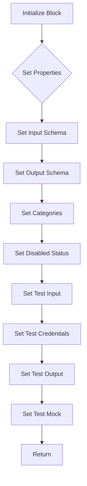

#### 带注释源码

```python
def __init__(self):
    super().__init__(
        id="37e386a4-a631-11ef-b7bd-b78204b35fa4",
        description="This block unfollows a specified Twitter user.",
        categories={BlockCategory.SOCIAL},
        input_schema=TwitterUnfollowUserBlock.Input,
        output_schema=TwitterUnfollowUserBlock.Output,
        disabled=not TWITTER_OAUTH_IS_CONFIGURED,
        test_input={
            "target_user_id": "12345",
            "credentials": TEST_CREDENTIALS_INPUT,
        },
        test_credentials=TEST_CREDENTIALS,
        test_output=[
            ("success", True),
        ],
        test_mock={"unfollow_user": lambda *args, **kwargs: True},
    )
```


### TwitterUnfollowUserBlock.unfollow_user

This method is responsible for unfollowing a specified Twitter user using the provided credentials.

参数：

- `credentials`：`TwitterCredentials`，The credentials required to authenticate with the Twitter API.
- `target_user_id`：`str`，The user ID of the user that you would like to unfollow.

返回值：`bool`，Whether the unfollow action was successful.

#### 流程图

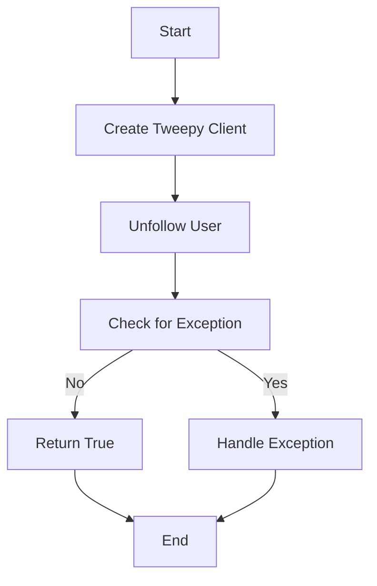

#### 带注释源码

```python
@staticmethod
def unfollow_user(credentials: TwitterCredentials, target_user_id: str):
    try:
        client = tweepy.Client(
            bearer_token=credentials.access_token.get_secret_value()
        )

        client.unfollow_user(target_user_id=target_user_id, user_auth=False)

        return True

    except tweepy.TweepyException:
        raise
```


### TwitterUnfollowUserBlock.run

This method is responsible for unfollowing a specified Twitter user using the provided credentials.

参数：

- `input_data`：`Input`，The input data for the block, containing the target user ID and credentials.
- `credentials`：`TwitterCredentials`，The credentials required to authenticate with Twitter API.

返回值：`BlockOutput`，The output of the block, indicating whether the unfollow action was successful.

#### 流程图

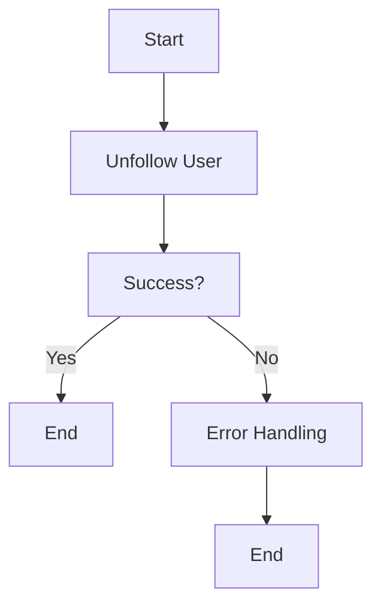

#### 带注释源码

```python
async def run(
    self,
    input_data: Input,
    *,
    credentials: TwitterCredentials,
    **kwargs,
) -> BlockOutput:
    try:
        success = self.unfollow_user(credentials, input_data.target_user_id)
        yield "success", success

    except Exception as e:
        yield "error", handle_tweepy_exception(e)
```


### TwitterFollowUserBlock.__init__

This method initializes the `TwitterFollowUserBlock` class, setting up its properties and configurations.

参数：

- `id`: `str`，The unique identifier for the block.
- `description`: `str`，A description of the block's functionality.
- `categories`: `set`，A set of categories that the block belongs to.
- `input_schema`: `BlockSchemaInput`，The schema for the input data of the block.
- `output_schema`: `BlockSchemaOutput`，The schema for the output data of the block.
- `disabled`: `bool`，Whether the block is disabled or not.
- `test_input`: `dict`，The test input data for the block.
- `test_credentials`: `TwitterCredentials`，The test credentials for the block.
- `test_output`: `list`，The expected test output data for the block.
- `test_mock`: `dict`，Mock functions for testing.

返回值：`None`，This method does not return any value.

#### 流程图

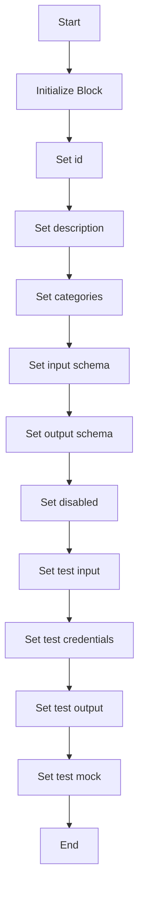

#### 带注释源码

```python
def __init__(self):
    super().__init__(
        id="1aae6a5e-a631-11ef-a090-435900c6d429",
        description="This block follows a specified Twitter user.",
        categories={BlockCategory.SOCIAL},
        input_schema=TwitterFollowUserBlock.Input,
        output_schema=TwitterFollowUserBlock.Output,
        disabled=not TWITTER_OAUTH_IS_CONFIGURED,
        test_input={
            "target_user_id": "12345",
            "credentials": TEST_CREDENTIALS_INPUT,
        },
        test_credentials=TEST_CREDENTIALS,
        test_output=[("success", True)],
        test_mock={"follow_user": lambda *args, **kwargs: True},
    )
```


### TwitterFollowUserBlock.follow_user

This method allows a user to follow another user specified by target user ID. If the target user does not have public Tweets, this endpoint will send a follow request. The request succeeds with no action when the authenticated user sends a request to a user they're already following, or if they're sending a follower request to a user that does not have public Tweets.

参数：

- `credentials`：`TwitterCredentials`，Twitter credentials object containing access token for authentication.
- `target_user_id`：`str`，The user ID of the user that you would like to follow.

返回值：`bool`，Whether the follow action was successful.

#### 流程图

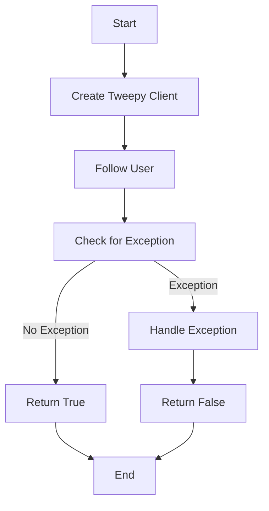

#### 带注释源码

```python
@staticmethod
def follow_user(credentials: TwitterCredentials, target_user_id: str):
    try:
        client = tweepy.Client(
            bearer_token=credentials.access_token.get_secret_value()
        )

        client.follow_user(target_user_id=target_user_id, user_auth=False)

        return True

    except tweepy.TweepyException:
        raise
```


### TwitterFollowUserBlock.run

This method allows a user to follow another user specified by target user ID on Twitter.

参数：

- `input_data`：`Input`，The input data for the block, containing the credentials and target user ID.
- `credentials`：`TwitterCredentials`，The Twitter credentials required to authenticate the request.
- `**kwargs`：`Any`，Additional keyword arguments that may be passed to the method.

返回值：`BlockOutput`，The output of the block, indicating whether the follow action was successful.

#### 流程图

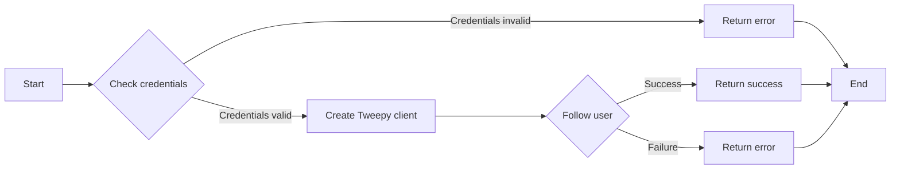

#### 带注释源码

```python
async def run(
    self,
    input_data: Input,
    *,
    credentials: TwitterCredentials,
    **kwargs,
) -> BlockOutput:
    try:
        success = self.follow_user(credentials, input_data.target_user_id)
        yield "success", success

    except Exception as e:
        yield "error", handle_tweepy_exception(e)
```


### TwitterGetFollowersBlock.__init__

This method initializes the `TwitterGetFollowersBlock` class, setting up its properties and configurations.

参数：

- `id`: `str`，The unique identifier for the block.
- `description`: `str`，A description of the block's functionality.
- `categories`: `set`，A set of categories that the block belongs to.
- `input_schema`: `BlockSchemaInput`，The schema for the input data of the block.
- `output_schema`: `BlockSchemaOutput`，The schema for the output data of the block.
- `disabled`: `bool`，Whether the block is disabled or not.
- `test_input`: `dict`，The test input data for the block.
- `test_credentials`: `TwitterCredentials`，The test credentials for the block.
- `test_output`: `list`，The expected test output data for the block.
- `test_mock`: `dict`，Mock functions for testing the block.

返回值：无

#### 流程图

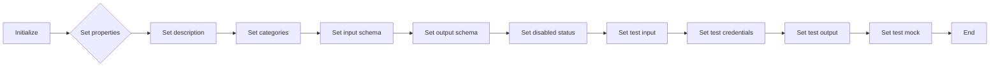

#### 带注释源码

```python
def __init__(self):
    super().__init__(
        id="30f66410-a631-11ef-8fe7-d7f888b4f43c",
        description="This block retrieves followers of a specified Twitter user.",
        categories={BlockCategory.SOCIAL},
        input_schema=TwitterGetFollowersBlock.Input,
        output_schema=TwitterGetFollowersBlock.Output,
        disabled=not TWITTER_OAUTH_IS_CONFIGURED,
        test_input={
            "target_user_id": "12345",
            "max_results": 1,
            "pagination_token": "",
            "expansions": None,
            "tweet_fields": None,
            "user_fields": None,
            "credentials": TEST_CREDENTIALS_INPUT,
        },
        test_credentials=TEST_CREDENTIALS,
        test_output=[
            ("ids", ["1234567890"]),
            ("usernames", ["testuser"]),
            ("data", [{"id": "1234567890", "username": "testuser"}]),
        ],
        test_mock={
            "get_followers": lambda *args, **kwargs: (
                ["1234567890"],
                ["testuser"],
                [{"id": "1234567890", "username": "testuser"}],
                {},
                {},
                None,
            )
        },
    )
```


### TwitterGetFollowersBlock.get_followers

Retrieves a list of followers for a specified Twitter user ID.

参数：

- `credentials`：`TwitterCredentials`，Twitter credentials object containing access token.
- `target_user_id`：`str`，The user ID whose followers you would like to retrieve.
- `max_results`：`int | None`，Maximum number of results to return (1-1000, default 100).
- `pagination_token`：`str | None`，Token for retrieving next/previous page of results.
- `expansions`：`UserExpansionsFilter | None`，Additional data to include in the response.
- `tweet_fields`：`TweetFieldsFilter | None`，Fields to include in the returned tweets.
- `user_fields`：`TweetUserFieldsFilter | None`，Fields to include in the returned users.

返回值：`tuple`，A tuple containing the following elements:
- `list[str]`，List of follower user IDs.
- `list[str]`，List of follower usernames.
- `list[dict]`，Complete user data for followers.
- `dict`，Additional data requested via expansions.
- `dict`，Metadata including pagination info.
- `str | None`，Next token for pagination.

#### 流程图

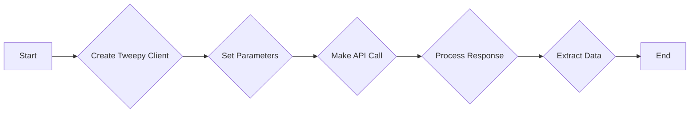

#### 带注释源码

```python
@staticmethod
def get_followers(
    credentials: TwitterCredentials,
    target_user_id: str,
    max_results: int | None,
    pagination_token: str | None,
    expansions: UserExpansionsFilter | None,
    tweet_fields: TweetFieldsFilter | None,
    user_fields: TweetUserFieldsFilter | None,
):
    try:
        client = tweepy.Client(
            bearer_token=credentials.access_token.get_secret_value()
        )

        params = {
            "id": target_user_id,
            "max_results": max_results,
            "pagination_token": (
                None if pagination_token == "" else pagination_token
            ),
            "user_auth": False,
        }

        params = (
            UserExpansionsBuilder(params)
            .add_expansions(expansions)
            .add_tweet_fields(tweet_fields)
            .add_user_fields(user_fields)
            .build()
        )

        response = cast(Response, client.get_users_followers(**params))

        meta = {}
        follower_ids = []
        follower_usernames = []
        next_token = None

        if response.meta:
            meta = response.meta
            next_token = meta.get("next_token")

        included = IncludesSerializer.serialize(response.includes)
        data = ResponseDataSerializer.serialize_list(response.data)

        if response.data:
            follower_ids = [str(user.id) for user in response.data]
            follower_usernames = [user.username for user in response.data]

            return (
                follower_ids,
                follower_usernames,
                data,
                included,
                meta,
                next_token,
            )

        raise Exception("Followers not found")

    except tweepy.TweepyException:
        raise
```


### TwitterGetFollowersBlock.run

Retrieves a list of followers for a specified Twitter user ID.

参数：

- `input_data`：`Input`，The input data for the block.
- `credentials`：`TwitterCredentials`，The Twitter credentials used to authenticate the request.

返回值：`BlockOutput`，The output data from the block.

#### 流程图

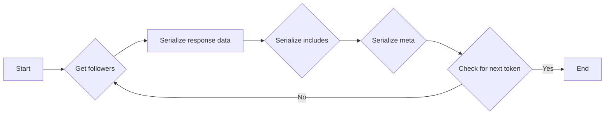

#### 带注释源码

```python
async def run(
    self,
    input_data: Input,
    *,
    credentials: TwitterCredentials,
    **kwargs,
) -> BlockOutput:
    try:
        ids, usernames, data, includes, meta, next_token = self.get_followers(
            credentials,
            input_data.target_user_id,
            input_data.max_results,
            input_data.pagination_token,
            input_data.expansions,
            input_data.tweet_fields,
            input_data.user_fields,
        )
        if ids:
            yield "ids", ids
        if usernames:
            yield "usernames", usernames
        if next_token:
            yield "next_token", next_token
        if data:
            yield "data", data
        if includes:
            yield "includes", includes
        if meta:
            yield "meta", meta
    except Exception as e:
        yield "error", handle_tweepy_exception(e)
```


### TwitterGetFollowingBlock.__init__

This method initializes the `TwitterGetFollowingBlock` class, setting up its properties and configurations.

参数：

- `id`: `str`，The unique identifier for the block.
- `description`: `str`，A description of the block's functionality.
- `categories`: `set`，A set of categories that the block belongs to.
- `input_schema`: `BlockSchemaInput`，The schema for the input data of the block.
- `output_schema`: `BlockSchemaOutput`，The schema for the output data of the block.
- `disabled`: `bool`，Whether the block is disabled or not.
- `test_input`: `dict`，The test input data for the block.
- `test_credentials`: `TwitterCredentials`，The test credentials for the block.
- `test_output`: `list`，The expected test output data for the block.
- `test_mock`: `dict`，Mock functions for testing the block.

返回值：无

#### 流程图

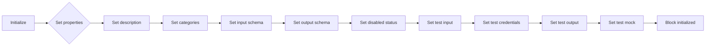

#### 带注释源码

```python
def __init__(self):
    super().__init__(
        id="264a399c-a631-11ef-a97d-bfde4ca91173",
        description="This block retrieves the users that a specified Twitter user is following.",
        categories={BlockCategory.SOCIAL},
        input_schema=TwitterGetFollowingBlock.Input,
        output_schema=TwitterGetFollowingBlock.Output,
        disabled=not TWITTER_OAUTH_IS_CONFIGURED,
        test_input={
            "target_user_id": "12345",
            "max_results": 1,
            "pagination_token": None,
            "expansions": None,
            "tweet_fields": None,
            "user_fields": None,
            "credentials": TEST_CREDENTIALS_INPUT,
        },
        test_credentials=TEST_CREDENTIALS,
        test_output=[
            ("ids", ["1234567890"]),
            ("usernames", ["testuser"]),
            ("data", [{"id": "1234567890", "username": "testuser"}]),
        ],
        test_mock={
            "get_following": lambda *args, **kwargs: (
                ["1234567890"],
                ["testuser"],
                [{"id": "1234567890", "username": "testuser"}],
                {},
                {},
                None,
            )
        },
    )
```


### TwitterGetFollowingBlock.get_following

Retrieves a list of users that a specified Twitter user ID is following.

参数：

- `credentials`：`TwitterCredentials`，Twitter credentials object containing access token and secret.
- `target_user_id`：`str`，The user ID whose following you would like to retrieve.
- `max_results`：`int | None`，Maximum number of results to return (1-1000, default 100).
- `pagination_token`：`str | None`，Token for retrieving next/previous page of results.
- `expansions`：`UserExpansionsFilter | None`，Additional data to include in the response.
- `tweet_fields`：`TweetFieldsFilter | None`，Fields to include in the returned tweets.
- `user_fields`：`TweetUserFieldsFilter | None`，Fields to include in the returned users.

返回值：`tuple`，A tuple containing the following elements:
- `ids`：`list[str]`，List of following user IDs.
- `usernames`：`list[str]`，List of following usernames.
- `data`：`list[dict]`，Complete user data for following.
- `includes`：`dict`，Additional data requested via expansions.
- `meta`：`dict`，Metadata including pagination info.
- `next_token`：`str`，Next token for pagination.

#### 流程图

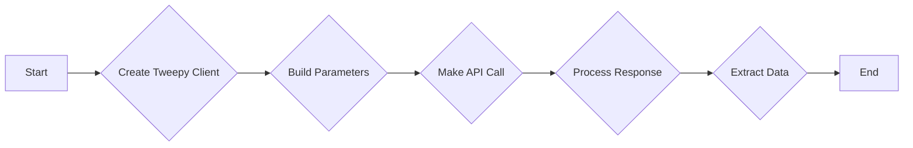

#### 带注释源码

```python
    @staticmethod
    def get_following(
        credentials: TwitterCredentials,
        target_user_id: str,
        max_results: int | None,
        pagination_token: str | None,
        expansions: UserExpansionsFilter | None,
        tweet_fields: TweetFieldsFilter | None,
        user_fields: TweetUserFieldsFilter | None,
    ):
        try:
            client = tweepy.Client(
                bearer_token=credentials.access_token.get_secret_value()
            )

            params = {
                "id": target_user_id,
                "max_results": max_results,
                "pagination_token": (
                    None if pagination_token == "" else pagination_token
                ),
                "user_auth": False,
            }

            params = (
                UserExpansionsBuilder(params)
                .add_expansions(expansions)
                .add_tweet_fields(tweet_fields)
                .add_user_fields(user_fields)
                .build()
            )

            response = cast(Response, client.get_users_following(**params))

            meta = {}
            following_ids = []
            following_usernames = []
            next_token = None

            if response.meta:
                meta = response.meta
                next_token = meta.get("next_token")

            included = IncludesSerializer.serialize(response.includes)
            data = ResponseDataSerializer.serialize_list(response.data)

            if response.data:
                following_ids = [str(user.id) for user in response.data]
                following_usernames = [user.username for user in response.data]

                return (
                    following_ids,
                    following_usernames,
                    data,
                    included,
                    meta,
                    next_token,
                )

            raise Exception("Following not found")

        except tweepy.TweepyException:
            raise
```


### TwitterGetFollowingBlock.run

Retrieves a list of users that a specified Twitter user ID is following.

参数：

- `input_data`：`Input`，The input data for the block, containing the user ID and other parameters for fetching the following users.
- `credentials`：`TwitterCredentials`，The Twitter credentials required to authenticate the request.

返回值：`BlockOutput`，The output of the block, containing the user IDs, usernames, and other metadata of the users that the specified Twitter user ID is following.

#### 流程图

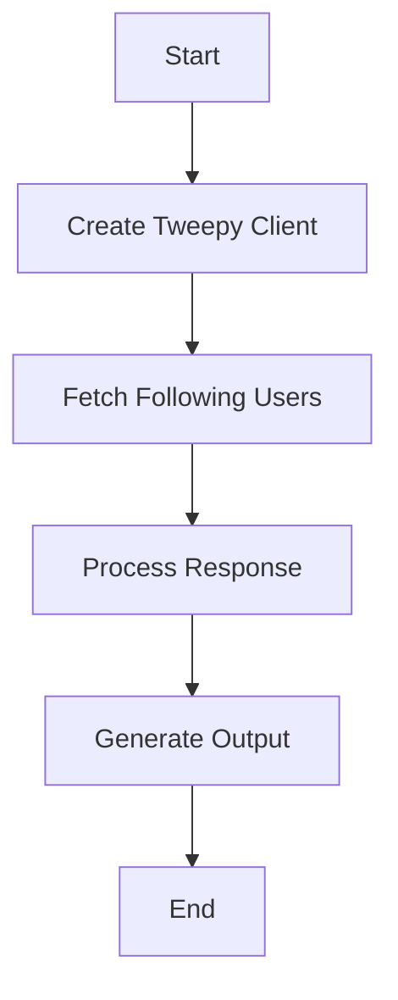

#### 带注释源码

```python
async def run(
    self,
    input_data: Input,
    *,
    credentials: TwitterCredentials,
    **kwargs,
) -> BlockOutput:
    try:
        ids, usernames, data, includes, meta, next_token = self.get_following(
            credentials,
            input_data.target_user_id,
            input_data.max_results,
            input_data.pagination_token,
            input_data.expansions,
            input_data.tweet_fields,
            input_data.user_fields,
        )
        if ids:
            yield "ids", ids
        if usernames:
            yield "usernames", usernames
        if next_token:
            yield "next_token", next_token
        if data:
            yield "data", data
        if includes:
            yield "includes", includes
        if meta:
            yield "meta", meta
    except Exception as e:
        yield "error", handle_tweepy_exception(e)
```


## 关键组件


### 张量索引与惰性加载

张量索引与惰性加载是代码中处理数据结构的核心组件，用于高效地访问和操作大型数据集，同时减少内存消耗。

### 反量化支持

反量化支持是代码中用于处理量化数据的核心组件，它允许在量化过程中进行逆量化操作，以便恢复原始数据。

### 量化策略

量化策略是代码中用于优化数据表示和处理的组件，它通过减少数据精度来减少内存和计算需求，同时保持可接受的精度损失。


## 问题及建议


### 已知问题

-   **全局变量和函数的可见性**：代码中存在一些全局变量和函数，如 `TWITTER_OAUTH_IS_CONFIGURED` 和 `handle_tweepy_exception`，这些在类外部定义，可能会引起命名冲突或难以维护。
-   **异常处理**：代码中的异常处理主要集中在捕获 `tweepy.TweepyException`，但没有对其他可能的异常进行捕获和处理，可能导致程序崩溃。
-   **代码重复**：`TwitterGetFollowersBlock` 和 `TwitterGetFollowingBlock` 类有大量相似代码，可以考虑提取公共逻辑以减少重复。
-   **异步函数的使用**：`run` 方法使用了异步函数，但没有明确说明是否所有调用者都支持异步操作，这可能导致兼容性问题。

### 优化建议

-   **封装全局变量和函数**：将全局变量和函数封装在类内部或模块内部，以减少命名冲突和增强代码的可维护性。
-   **增强异常处理**：增加对其他可能异常的捕获和处理，确保程序的健壮性。
-   **减少代码重复**：通过提取公共逻辑或使用继承来减少代码重复，提高代码的可维护性。
-   **明确异步函数的使用**：在文档中明确指出 `run` 方法是异步的，并确保所有调用者都支持异步操作。
-   **代码注释和文档**：增加代码注释和文档，以帮助其他开发者理解代码的功能和结构。
-   **单元测试**：编写单元测试来验证代码的功能，确保代码的正确性和稳定性。
-   **性能优化**：分析代码的性能瓶颈，并进行相应的优化，以提高程序的执行效率。
-   **安全性考虑**：确保代码的安全性，例如处理敏感信息（如访问令牌）时使用加密和安全的存储方式。


## 其它


### 设计目标与约束

- 设计目标：
  - 实现Twitter用户关注、取消关注和获取关注者/被关注者列表的功能。
  - 提供一个模块化的架构，便于扩展和维护。
  - 确保代码的可读性和可维护性。
  - 遵循Twitter API的使用规范和限制。

- 约束：
  - 必须使用Twitter API进行操作。
  - 需要处理Twitter API可能抛出的异常。
  - 输入参数需要经过验证。
  - 代码需要支持异步执行。

### 错误处理与异常设计

- 错误处理：
  - 使用try-except块捕获并处理可能发生的异常。
  - 对于Twitter API抛出的异常，使用自定义的异常处理函数`handle_tweepy_exception`进行处理。
  - 将异常信息转换为用户友好的错误消息。

### 数据流与状态机

- 数据流：
  - 用户输入目标用户ID和凭证。
  - 根据用户操作（关注、取消关注或获取列表），调用相应的API。
  - 返回操作结果或错误信息。

- 状态机：
  - 每个操作（关注、取消关注或获取列表）对应一个状态。
  - 状态转换由用户输入和API响应触发。

### 外部依赖与接口契约

- 外部依赖：
  - `tweepy`：用于与Twitter API交互。
  - `backend.data.block`：用于定义数据块和输入/输出模式。

- 接口契约：
  - `TwitterCredentials`：定义Twitter凭证的结构。
  - `Block`：定义数据块的基本接口。
  - `Input`和`Output`：定义输入和输出模式的结构。
  - `UserExpansionInputs`：定义用户扩展输入的结构。
  - `TweetFieldsFilter`和`TweetUserFieldsFilter`：定义tweet和用户字段过滤器。
  - `UserExpansionsFilter`：定义用户扩展过滤器。

    