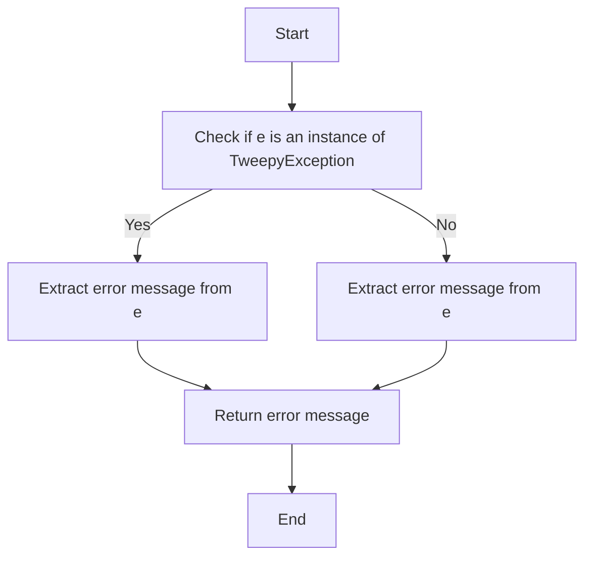
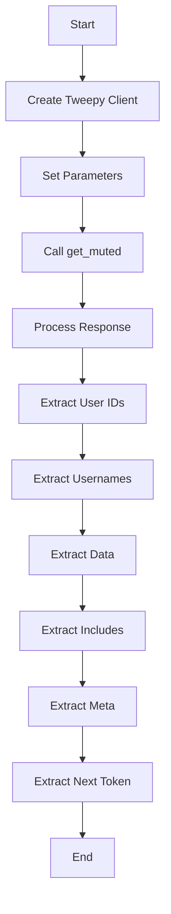
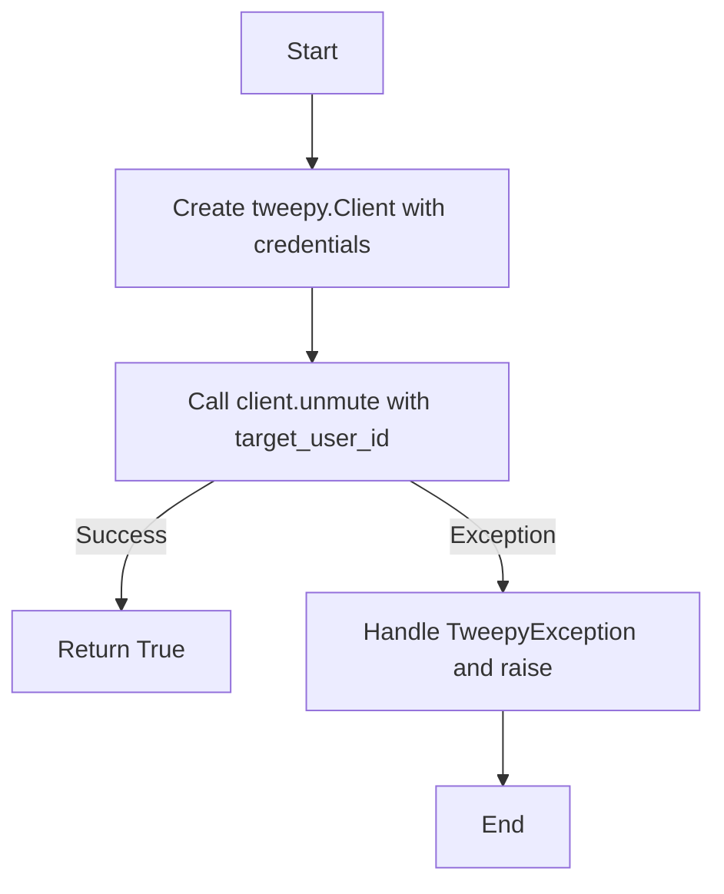
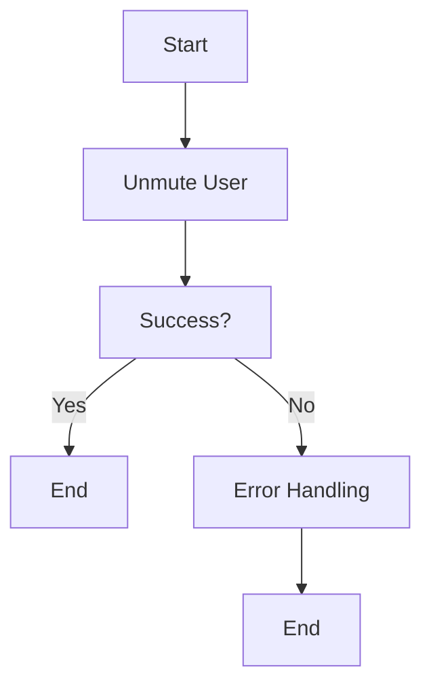
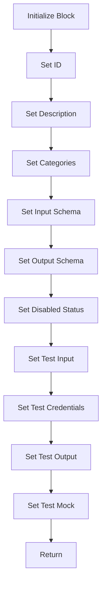
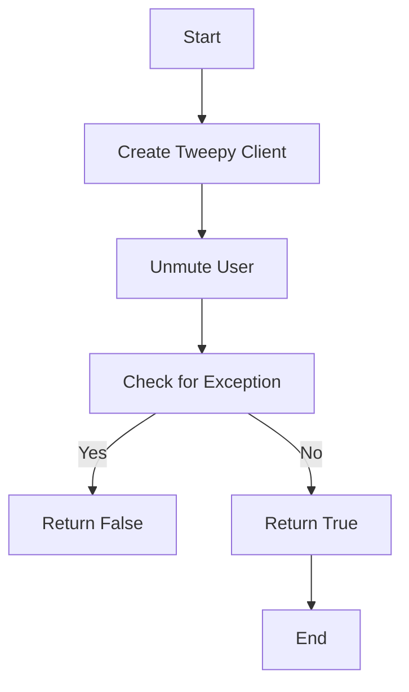
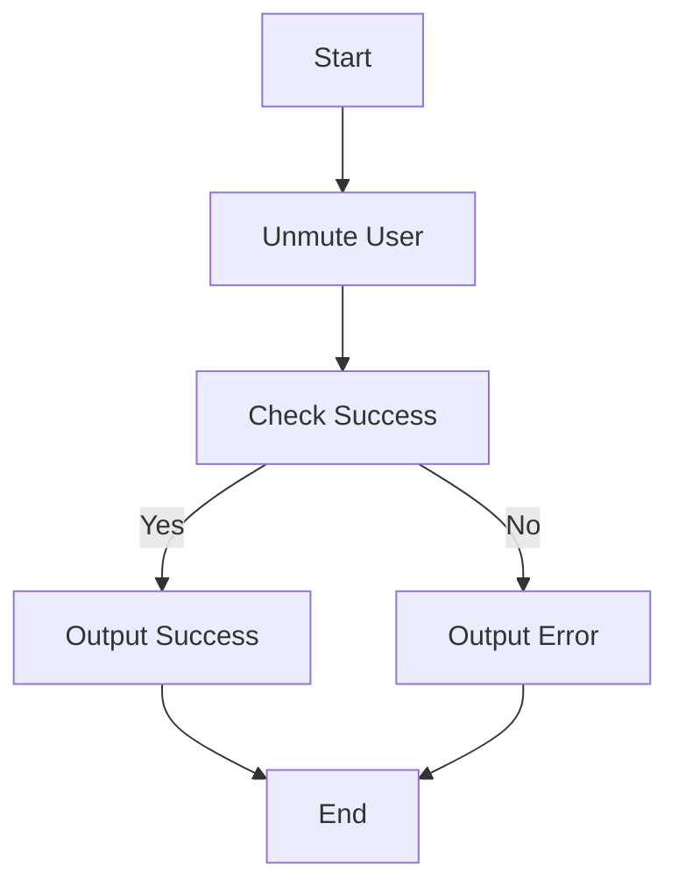
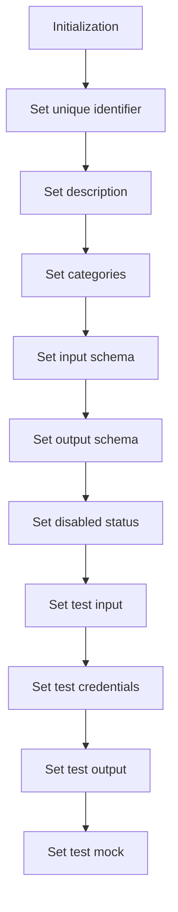
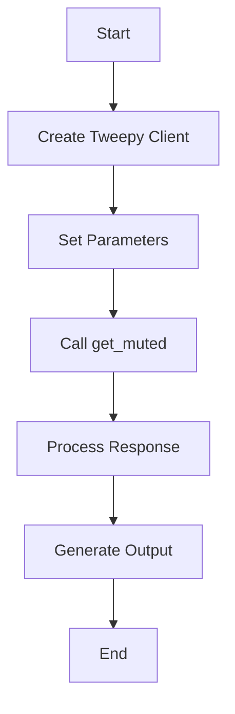
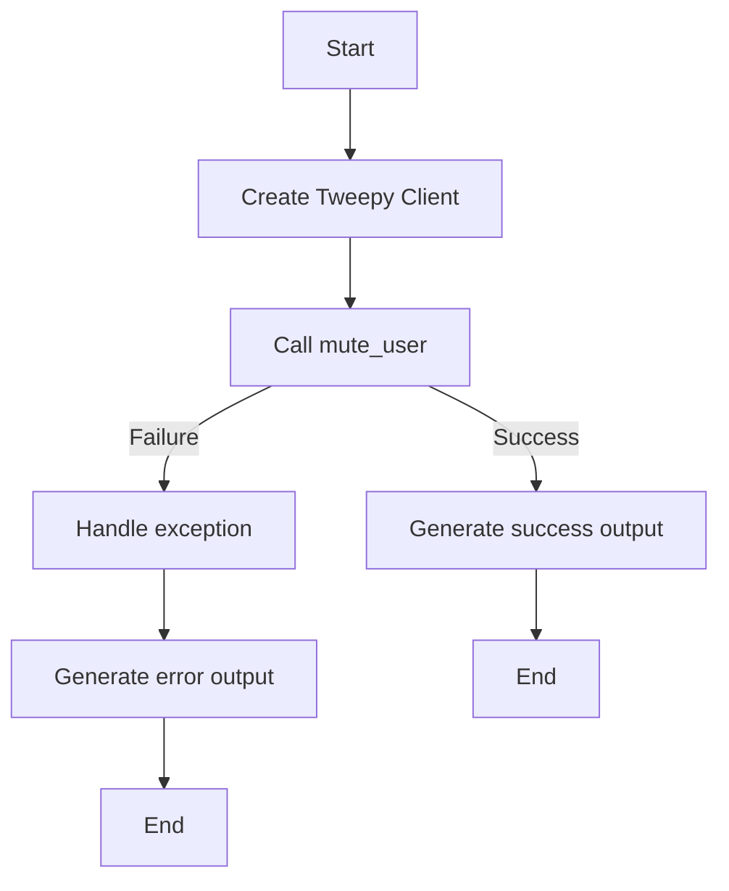

# `.\AutoGPT\autogpt_platform\backend\backend\blocks\twitter\users\mutes.py` 详细设计文档

This file contains Python classes for interacting with Twitter API, including muting and unmuting users, and retrieving a list of muted users.

## 整体流程

```mermaid
graph TD
    A[Start] --> B[Create Twitter Client]
    B --> C{Unmute User?}
    C -- Yes --> D[Call unmute_user]
    C -- No --> E{Mute User?}
    E -- Yes --> F[Call mute_user]
    E -- No --> G[Get Muted Users?}
    G -- Yes --> H[Call get_muted_users]
    G -- No --> I[End]
    D --> J{Success?}
    J -- Yes --> K[End]
    J -- No --> L[Handle Exception]
    F --> M{Success?}
    M -- Yes --> N[End]
    M -- No --> O[Handle Exception]
    H --> P{Success?}
    P -- Yes --> Q[End]
    P -- No --> R[Handle Exception]
```

## 类结构

```
TwitterUnmuteUserBlock (Concrete Block)
├── Input
│   ├── credentials
│   └── target_user_id
└── Output
    └── success
TwitterGetMutedUsersBlock (Concrete Block)
├── Input
│   ├── credentials
│   ├── max_results
│   ├── pagination_token
│   └── expansions
│       └── user_fields
│       └── tweet_fields
└── Output
    ├── ids
    ├── usernames
    ├── next_token
    └── data
TwitterMuteUserBlock (Concrete Block)
├── Input
│   ├── credentials
│   └── target_user_id
└── Output
    └── success
```

## 全局变量及字段


### `TEST_CREDENTIALS`
    
Test Twitter credentials used for testing purposes.

类型：`TwitterCredentials`
    


### `TEST_CREDENTIALS_INPUT`
    
Test input for Twitter credentials used for testing purposes.

类型：`TwitterCredentialsInput`
    


### `TWITTER_OAUTH_IS_CONFIGURED`
    
Flag indicating whether Twitter OAuth is configured.

类型：`bool`
    


### `TwitterCredentials`
    
Class representing Twitter credentials.

类型：`class`
    


### `TwitterCredentialsField`
    
Class representing a field in Twitter credentials.

类型：`class`
    


### `TwitterCredentialsInput`
    
Class representing input for Twitter credentials.

类型：`class`
    


### `UserExpansionsBuilder`
    
Class for building user expansions parameters.

类型：`class`
    


### `IncludesSerializer`
    
Class for serializing includes in Twitter responses.

类型：`class`
    


### `ResponseDataSerializer`
    
Class for serializing response data in Twitter responses.

类型：`class`
    


### `TweetFieldsFilter`
    
Class representing tweet fields filter.

类型：`class`
    


### `TweetUserFieldsFilter`
    
Class representing user fields filter for tweets.

类型：`class`
    


### `UserExpansionInputs`
    
Class representing inputs for user expansions.

类型：`class`
    


### `UserExpansionsFilter`
    
Class representing user expansions filter.

类型：`class`
    


### `Block`
    
Base class for blocks.

类型：`class`
    


### `BlockCategory`
    
Class representing block categories.

类型：`class`
    


### `BlockOutput`
    
Class representing block output.

类型：`class`
    


### `BlockSchemaInput`
    
Class representing block schema input.

类型：`class`
    


### `BlockSchemaOutput`
    
Class representing block schema output.

类型：`class`
    


### `SchemaField`
    
Class representing schema field.

类型：`class`
    


### `tweepy`
    
Tweepy module for interacting with Twitter API.

类型：`module`
    


### `Response`
    
Class representing a response from the Twitter API.

类型：`class`
    


### `TwitterUnmuteUserBlock.id`
    
Unique identifier for the block.

类型：`str`
    


### `TwitterUnmuteUserBlock.description`
    
Description of the block.

类型：`str`
    


### `TwitterUnmuteUserBlock.categories`
    
Categories to which the block belongs.

类型：`set`
    


### `TwitterUnmuteUserBlock.input_schema`
    
Input schema for the block.

类型：`BlockSchemaInput`
    


### `TwitterUnmuteUserBlock.output_schema`
    
Output schema for the block.

类型：`BlockSchemaOutput`
    


### `TwitterUnmuteUserBlock.disabled`
    
Flag indicating whether the block is disabled.

类型：`bool`
    


### `TwitterUnmuteUserBlock.test_input`
    
Test input data for the block.

类型：`dict`
    


### `TwitterUnmuteUserBlock.test_credentials`
    
Test credentials for the block.

类型：`TwitterCredentials`
    


### `TwitterUnmuteUserBlock.test_output`
    
Test output data for the block.

类型：`list`
    


### `TwitterUnmuteUserBlock.test_mock`
    
Test mock data for the block.

类型：`dict`
    


### `TwitterGetMutedUsersBlock.id`
    
Unique identifier for the block.

类型：`str`
    


### `TwitterGetMutedUsersBlock.description`
    
Description of the block.

类型：`str`
    


### `TwitterGetMutedUsersBlock.categories`
    
Categories to which the block belongs.

类型：`set`
    


### `TwitterGetMutedUsersBlock.input_schema`
    
Input schema for the block.

类型：`UserExpansionInputs`
    


### `TwitterGetMutedUsersBlock.output_schema`
    
Output schema for the block.

类型：`BlockSchemaOutput`
    


### `TwitterGetMutedUsersBlock.disabled`
    
Flag indicating whether the block is disabled.

类型：`bool`
    


### `TwitterGetMutedUsersBlock.test_input`
    
Test input data for the block.

类型：`dict`
    


### `TwitterGetMutedUsersBlock.test_credentials`
    
Test credentials for the block.

类型：`TwitterCredentials`
    


### `TwitterGetMutedUsersBlock.test_output`
    
Test output data for the block.

类型：`list`
    


### `TwitterGetMutedUsersBlock.test_mock`
    
Test mock data for the block.

类型：`dict`
    


### `TwitterMuteUserBlock.id`
    
Unique identifier for the block.

类型：`str`
    


### `TwitterMuteUserBlock.description`
    
Description of the block.

类型：`str`
    


### `TwitterMuteUserBlock.categories`
    
Categories to which the block belongs.

类型：`set`
    


### `TwitterMuteUserBlock.input_schema`
    
Input schema for the block.

类型：`BlockSchemaInput`
    


### `TwitterMuteUserBlock.output_schema`
    
Output schema for the block.

类型：`BlockSchemaOutput`
    


### `TwitterMuteUserBlock.disabled`
    
Flag indicating whether the block is disabled.

类型：`bool`
    


### `TwitterMuteUserBlock.test_input`
    
Test input data for the block.

类型：`dict`
    


### `TwitterMuteUserBlock.test_credentials`
    
Test credentials for the block.

类型：`TwitterCredentials`
    


### `TwitterMuteUserBlock.test_output`
    
Test output data for the block.

类型：`list`
    


### `TwitterMuteUserBlock.test_mock`
    
Test mock data for the block.

类型：`dict`
    
    

## 全局函数及方法


### `handle_tweepy_exception`

This function handles exceptions raised by the Tweepy library.

参数：

- `e`：`Exception`，The exception that occurred.

返回值：`str`，A string describing the exception.

#### 流程图



#### 带注释源码

```python
def handle_tweepy_exception(e: Exception) -> str:
    """
    Handles exceptions raised by the Tweepy library.

    :param e: The exception that occurred.
    :return: A string describing the exception.
    """
    if isinstance(e, tweepy.TweepyException):
        return str(e)
    else:
        return str(e)
``` 


### `TwitterUnmuteUserBlock.unmute_user`

Unmutes a specified Twitter user.

参数：

- `credentials`：`TwitterCredentials`，Twitter credentials object containing access token.
- `target_user_id`：`str`，The user ID of the user that you would like to unmute.

返回值：`bool`，Whether the unmute action was successful.

#### 流程图


#### 带注释源码

```python
@staticmethod
def unmute_user(credentials: TwitterCredentials, target_user_id: str):
    try:
        client = tweepy.Client(
            bearer_token=credentials.access_token.get_secret_value()
        )

        client.unmute(target_user_id=target_user_id, user_auth=False)

        return True

    except tweepy.TweepyException:
        raise
```


### `TwitterGetMutedUsersBlock.get_muted_users`

This method retrieves a list of users who are muted by the authenticating user.

参数：

- `credentials`：`TwitterCredentials`，The Twitter credentials required to authenticate the request.
- `max_results`：`int | None`，The maximum number of results to be returned per page (1-1000). Default is 100.
- `pagination_token`：`str | None`，Token to request next/previous page of results.
- `expansions`：`UserExpansionsFilter | None`，Additional data to include in the response.
- `tweet_fields`：`TweetFieldsFilter | None`，Fields to include in the response for each tweet.
- `user_fields`：`TweetUserFieldsFilter | None`，Fields to include in the response for each user.

返回值：`tuple`，A tuple containing the following elements:
- `user_ids`：`list[str]`，List of muted user IDs.
- `usernames`：`list[str]`，List of muted usernames.
- `data`：`list[dict]`，Complete user data for muted users.
- `includes`：`dict`，Additional data requested via expansions.
- `meta`：`dict`，Metadata including pagination info.
- `next_token`：`str`，Next token for pagination.

#### 流程图



#### 带注释源码

```python
    @staticmethod
    def get_muted_users(
        credentials: TwitterCredentials,
        max_results: int | None,
        pagination_token: str | None,
        expansions: UserExpansionsFilter | None,
        tweet_fields: TweetFieldsFilter | None,
        user_fields: TweetUserFieldsFilter | None,
    ):
        try:
            client = tweepy.Client(
                bearer_token=credentials.access_token.get_secret_value()
            )

            params = {
                "max_results": max_results,
                "pagination_token": (
                    None if pagination_token == "" else pagination_token
                ),
                "user_auth": False,
            }

            params = (
                UserExpansionsBuilder(params)
                .add_expansions(expansions)
                .add_tweet_fields(tweet_fields)
                .add_user_fields(user_fields)
                .build()
            )

            response = cast(Response, client.get_muted(**params))

            meta = {}
            user_ids = []
            usernames = []
            next_token = None

            if response.meta:
                meta = response.meta
                next_token = meta.get("next_token")

            included = IncludesSerializer.serialize(response.includes)
            data = ResponseDataSerializer.serialize_list(response.data)

            if response.data:
                user_ids = [str(item.id) for item in response.data]
                usernames = [item.username for item in response.data]

                return user_ids, usernames, data, included, meta, next_token

            raise Exception("Muted users not found")

        except tweepy.TweepyException:
            raise
``` 


### unmute_user

Unmutes a specified Twitter user.

参数：

- `credentials`：`TwitterCredentials`，Twitter credentials object containing access token and secret.
- `target_user_id`：`str`，The user ID of the user that you would like to unmute.

返回值：`bool`，Whether the unmute action was successful.

#### 流程图



#### 带注释源码

```python
@staticmethod
def unmute_user(credentials: TwitterCredentials, target_user_id: str):
    try:
        client = tweepy.Client(
            bearer_token=credentials.access_token.get_secret_value()
        )

        client.unmute(target_user_id=target_user_id, user_auth=False)

        return True

    except tweepy.TweepyException:
        raise
```


### `TwitterUnmuteUserBlock.run`

This method is responsible for unmuting a specified Twitter user using the provided credentials.

参数：

- `input_data`：`Input`，The input data for the block, which includes the target user ID and credentials.
- `credentials`：`TwitterCredentials`，The credentials required to authenticate with the Twitter API.
- `**kwargs`：Any additional keyword arguments.

返回值：`BlockOutput`，The output of the block, which includes a success status.

#### 流程图



#### 带注释源码

```python
async def run(
    self,
    input_data: Input,
    *,
    credentials: TwitterCredentials,
    **kwargs,
) -> BlockOutput:
    try:
        success = self.unmute_user(credentials, input_data.target_user_id)
        yield "success", success
    except Exception as e:
        yield "error", handle_tweepy_exception(e)
```


### `TwitterUnmuteUserBlock.__init__`

This method initializes the `TwitterUnmuteUserBlock` class, setting up its properties and configurations.

参数：

- `id`: `str`，The unique identifier for the block.
- `description`: `str`，A description of the block's functionality.
- `categories`: `set`，A set of categories that the block belongs to.
- `input_schema`: `Input`，The schema for the input data of the block.
- `output_schema`: `Output`，The schema for the output data of the block.
- `disabled`: `bool`，Whether the block is disabled or not.
- `test_input`: `dict`，The test input data for the block.
- `test_credentials`: `TwitterCredentials`，The test credentials for the block.
- `test_output`: `list`，The expected test output data for the block.
- `test_mock`: `dict`，Mock functions for testing.

返回值：`None`，This method does not return any value.

#### 流程图



#### 带注释源码

```python
def __init__(self):
    super().__init__(
        id="40458504-a631-11ef-940b-eff92be55422",
        description="This block unmutes a specified Twitter user.",
        categories={BlockCategory.SOCIAL},
        input_schema=TwitterUnmuteUserBlock.Input,
        output_schema=TwitterUnmuteUserBlock.Output,
        disabled=not TWITTER_OAUTH_IS_CONFIGURED,
        test_input={
            "target_user_id": "12345",
            "credentials": TEST_CREDENTIALS_INPUT,
        },
        test_credentials=TEST_CREDENTIALS,
        test_output=[
            ("success", True),
        ],
        test_mock={"unmute_user": lambda *args, **kwargs: True},
    )
```


### TwitterUnmuteUserBlock.unmute_user

This method unmutes a specified Twitter user using the provided credentials.

参数：

- `credentials`：`TwitterCredentials`，The credentials required to authenticate with the Twitter API.
- `target_user_id`：`str`，The user ID of the user that you would like to unmute.

返回值：`bool`，Whether the unmute action was successful.

#### 流程图



#### 带注释源码

```python
@staticmethod
def unmute_user(credentials: TwitterCredentials, target_user_id: str):
    try:
        client = tweepy.Client(
            bearer_token=credentials.access_token.get_secret_value()
        )

        client.unmute(target_user_id=target_user_id, user_auth=False)

        return True

    except tweepy.TweepyException:
        raise
```


### TwitterUnmuteUserBlock.run

This method is responsible for unmuting a specified Twitter user using the provided credentials.

参数：

- `input_data`：`Input`，The input data for the block, which includes the target user ID and credentials.
- `credentials`：`TwitterCredentials`，The credentials required to authenticate with the Twitter API.
- `**kwargs`：`Any`，Additional keyword arguments that may be passed to the method.

返回值：`BlockOutput`，The output of the block, indicating whether the unmute action was successful.

#### 流程图



#### 带注释源码

```python
async def run(
    self,
    input_data: Input,
    *,
    credentials: TwitterCredentials,
    **kwargs,
) -> BlockOutput:
    try:
        success = self.unmute_user(credentials, input_data.target_user_id)
        yield "success", success

    except Exception as e:
        yield "error", handle_tweepy_exception(e)
```


### TwitterGetMutedUsersBlock.__init__

This method initializes the `TwitterGetMutedUsersBlock` class, setting up its properties and configurations.

参数：

- `id`: `str`，The unique identifier for the block.
- `description`: `str`，A description of the block's functionality.
- `categories`: `set`，A set of categories that the block belongs to.
- `input_schema`: `Input`，The schema for the input data of the block.
- `output_schema`: `Output`，The schema for the output data of the block.
- `disabled`: `bool`，Whether the block is disabled or not.
- `test_input`: `dict`，The test input data for the block.
- `test_credentials`: `TwitterCredentials`，The test credentials for the block.
- `test_output`: `list`，The expected test output data for the block.
- `test_mock`: `dict`，Mock functions for testing the block.

返回值：无

#### 流程图



#### 带注释源码

```python
def __init__(self):
    super().__init__(
        id="475024da-a631-11ef-9ccd-f724b8b03cda",
        description="This block gets a list of users muted by the authenticating user.",
        categories={BlockCategory.SOCIAL},
        input_schema=TwitterGetMutedUsersBlock.Input,
        output_schema=TwitterGetMutedUsersBlock.Output,
        disabled=not TWITTER_OAUTH_IS_CONFIGURED,
        test_input={
            "max_results": 2,
            "pagination_token": "",
            "credentials": TEST_CREDENTIALS_INPUT,
            "expansions": None,
            "tweet_fields": None,
            "user_fields": None,
        },
        test_credentials=TEST_CREDENTIALS,
        test_output=[
            ("ids", ["12345", "67890"]),
            ("usernames", ["testuser1", "testuser2"]),
            (
                "data",
                [
                    {"id": "12345", "username": "testuser1"},
                    {"id": "67890", "username": "testuser2"},
                ],
            ),
        ],
        test_mock={
            "get_muted_users": lambda *args, **kwargs: (
                ["12345", "67890"],
                ["testuser1", "testuser2"],
                [
                    {"id": "12345", "username": "testuser1"},
                    {"id": "67890", "username": "testuser2"},
                ],
                {},
                {},
                None,
            )
        },
    )
```


### TwitterGetMutedUsersBlock.get_muted_users

This method retrieves a list of users who are muted by the authenticating user.

参数：

- `credentials`：`TwitterCredentials`，The Twitter credentials required to authenticate the request.
- `max_results`：`int | None`，The maximum number of results to be returned per page (1-1000). Default is 100.
- `pagination_token`：`str | None`，Token to request next/previous page of results.
- `expansions`：`UserExpansionsFilter | None`，Additional data to include in the response.
- `tweet_fields`：`TweetFieldsFilter | None`，Fields to include in the response for each tweet.
- `user_fields`：`TweetUserFieldsFilter | None`，Fields to include in the response for each user.

返回值：`tuple`，A tuple containing the following elements:
- `user_ids`：`list[str]`，List of muted user IDs.
- `usernames`：`list[str]`，List of muted usernames.
- `data`：`list[dict]`，Complete user data for muted users.
- `includes`：`dict`，Additional data requested via expansions.
- `meta`：`dict`，Metadata including pagination info.
- `next_token`：`str`，Next token for pagination.

#### 流程图


#### 带注释源码

```python
@staticmethod
def get_muted_users(
    credentials: TwitterCredentials,
    max_results: int | None,
    pagination_token: str | None,
    expansions: UserExpansionsFilter | None,
    tweet_fields: TweetFieldsFilter | None,
    user_fields: TweetUserFieldsFilter | None,
):
    try:
        client = tweepy.Client(
            bearer_token=credentials.access_token.get_secret_value()
        )

        params = {
            "max_results": max_results,
            "pagination_token": (
                None if pagination_token == "" else pagination_token
            ),
            "user_auth": False,
        }

        params = (
            UserExpansionsBuilder(params)
            .add_expansions(expansions)
            .add_tweet_fields(tweet_fields)
            .add_user_fields(user_fields)
            .build()
        )

        response = cast(Response, client.get_muted(**params))

        meta = {}
        user_ids = []
        usernames = []
        next_token = None

        if response.meta:
            meta = response.meta
            next_token = meta.get("next_token")

        included = IncludesSerializer.serialize(response.includes)
        data = ResponseDataSerializer.serialize_list(response.data)

        if response.data:
            user_ids = [str(item.id) for item in response.data]
            usernames = [item.username for item in response.data]

            return user_ids, usernames, data, included, meta, next_token

        raise Exception("Muted users not found")

    except tweepy.TweepyException:
        raise
```


### TwitterGetMutedUsersBlock.run

This method retrieves a list of users who are muted by the authenticating user.

参数：

- `input_data`：`Input`，The input data for the block, which includes credentials, max_results, pagination_token, expansions, tweet_fields, and user_fields.
- `credentials`：`TwitterCredentials`，The Twitter credentials used to authenticate the request.

返回值：`BlockOutput`，The output of the block, which includes ids, usernames, next_token, data, includes, and meta.

#### 流程图



#### 带注释源码

```python
async def run(
    self,
    input_data: Input,
    *,
    credentials: TwitterCredentials,
    **kwargs,
) -> BlockOutput:
    try:
        ids, usernames, data, includes, meta, next_token = self.get_muted_users(
            credentials,
            input_data.max_results,
            input_data.pagination_token,
            input_data.expansions,
            input_data.tweet_fields,
            input_data.user_fields,
        )
        if ids:
            yield "ids", ids
        if usernames:
            yield "usernames", usernames
        if next_token:
            yield "next_token", next_token
        if data:
            yield "data", data
        if includes:
            yield "includes", includes
        if meta:
            yield "meta", meta
    except Exception as e:
        yield "error", handle_tweepy_exception(e)
```


### `TwitterMuteUserBlock.__init__`

This method initializes the `TwitterMuteUserBlock` class, setting up its properties and configurations.

参数：

- `id`: `str`，The unique identifier for the block.
- `description`: `str`，A description of the block's functionality.
- `categories`: `set`，A set of categories that the block belongs to.
- `input_schema`: `BlockSchemaInput`，The schema for the input data of the block.
- `output_schema`: `BlockSchemaOutput`，The schema for the output data of the block.
- `disabled`: `bool`，Whether the block is disabled or not.
- `test_input`: `dict`，The test input data for the block.
- `test_credentials`: `TwitterCredentials`，The test credentials for the block.
- `test_output`: `list`，The expected test output data for the block.
- `test_mock`: `dict`，Mock functions for testing.

返回值：`None`，This method does not return any value.

#### 流程图


#### 带注释源码

```python
def __init__(self):
    super().__init__(
        id="4d1919d0-a631-11ef-90ab-3b73af9ce8f1",
        description="This block mutes a specified Twitter user.",
        categories={BlockCategory.SOCIAL},
        input_schema=TwitterMuteUserBlock.Input,
        output_schema=TwitterMuteUserBlock.Output,
        disabled=not TWITTER_OAUTH_IS_CONFIGURED,
        test_input={
            "target_user_id": "12345",
            "credentials": TEST_CREDENTIALS_INPUT,
        },
        test_credentials=TEST_CREDENTIALS,
        test_output=[
            ("success", True),
        ],
        test_mock={"mute_user": lambda *args, **kwargs: True},
    )
```


### `TwitterMuteUserBlock.mute_user`

This method allows a user to mute another user specified by target user ID.

参数：

- `credentials`：`TwitterCredentials`，Twitter credentials object containing access token and secret.
- `target_user_id`：`str`，The user ID of the user that you would like to mute.

返回值：`bool`，Whether the mute action was successful.

#### 流程图


#### 带注释源码

```python
@staticmethod
def mute_user(credentials: TwitterCredentials, target_user_id: str):
    try:
        client = tweepy.Client(
            bearer_token=credentials.access_token.get_secret_value()
        )

        client.mute(target_user_id=target_user_id, user_auth=False)

        return True

    except tweepy.TweepyException:
        raise
```


### TwitterMuteUserBlock.run

This method is responsible for muting a specified Twitter user using the provided credentials.

参数：

- `input_data`：`Input`，The input data containing the credentials and target user ID.
- `credentials`：`TwitterCredentials`，The credentials required to authenticate with Twitter API.

返回值：`BlockOutput`，The output indicating the success of the mute action.

#### 流程图



#### 带注释源码

```python
async def run(
    self,
    input_data: Input,
    *,
    credentials: TwitterCredentials,
    **kwargs,
) -> BlockOutput:
    try:
        success = self.mute_user(credentials, input_data.target_user_id)
        yield "success", success
    except Exception as e:
        yield "error", handle_tweepy_exception(e)
```


## 关键组件


### 张量索引与惰性加载

张量索引与惰性加载是代码中处理数据的一种方式，它允许在需要时才加载和索引数据，从而提高性能和内存效率。

### 反量化支持

反量化支持是代码中实现的一种功能，它允许在量化过程中将量化后的数据转换回原始数据格式，以便进行进一步处理。

### 量化策略

量化策略是代码中用于优化模型性能的一种方法，它通过减少模型中使用的数值精度来减少模型大小和计算需求。


## 问题及建议


### 已知问题

-   **全局变量和函数的复用性低**：代码中存在多个全局变量和函数，如`TEST_CREDENTIALS`, `TEST_CREDENTIALS_INPUT`, `TWITTER_OAUTH_IS_CONFIGURED`等，这些变量和函数在多个类中重复使用，缺乏封装和复用性。
-   **异常处理过于简单**：在`run`方法中，异常处理仅调用`handle_tweepy_exception`函数，没有对不同的异常进行区分处理，可能导致一些非`tweepy.TweepyException`的异常未被妥善处理。
-   **代码注释不足**：代码中部分方法缺少详细的注释，难以理解其功能和实现逻辑。

### 优化建议

-   **封装全局变量和函数**：将全局变量和函数封装到相应的类或模块中，提高代码的复用性和可维护性。
-   **细化异常处理**：根据不同的异常类型进行区分处理，例如，对于`tweepy.TweepyException`以外的异常，可以记录日志或返回更具体的错误信息。
-   **增加代码注释**：在关键代码段和复杂逻辑处添加注释，提高代码的可读性和可维护性。
-   **使用异步编程**：考虑到`run`方法中存在异步操作，可以考虑将整个代码改为异步编程，提高代码的执行效率。
-   **优化代码结构**：将代码按照功能模块进行划分，提高代码的可读性和可维护性。
-   **使用单元测试**：编写单元测试，确保代码的正确性和稳定性。
-   **考虑代码安全性**：对用户输入进行验证和过滤，防止恶意输入导致的安全问题。
-   **优化性能**：对代码进行性能分析，找出性能瓶颈并进行优化。
-   **遵循编码规范**：遵循统一的编码规范，提高代码的可读性和可维护性。


## 其它


### 设计目标与约束

- 设计目标：
  - 实现Twitter用户静音和取消静音功能。
  - 提供一个模块化的架构，便于扩展和维护。
  - 确保代码的可读性和可维护性。
  - 遵循Twitter API的使用规范和限制。

- 约束：
  - 必须使用Twitter API进行操作。
  - 需要有效的Twitter OAuth凭证。
  - 限制对Twitter API的调用频率，以避免被限制或封禁。

### 错误处理与异常设计

- 错误处理：
  - 使用`try-except`块捕获`tweepy.TweepyException`异常。
  - 使用自定义的`handle_tweepy_exception`函数处理异常，并返回相应的错误信息。

- 异常设计：
  - 定义自定义异常类，如`TwitterAPIException`，以处理特定的API错误。
  - 异常信息应包含错误代码、错误消息和可能的解决方案。

### 数据流与状态机

- 数据流：
  - 输入数据通过`BlockSchemaInput`类进行验证和解析。
  - 输出数据通过`BlockSchemaOutput`类进行序列化和验证。

- 状态机：
  - 每个块的状态由其输入和输出数据以及执行结果决定。
  - 状态机负责处理数据流和执行逻辑。

### 外部依赖与接口契约

- 外部依赖：
  - `tweepy`库用于与Twitter API交互。
  - `typing`库用于类型注解。

- 接口契约：
  - `TwitterCredentials`类定义了Twitter OAuth凭证的结构。
  - `Block`类定义了数据块的基本结构和方法。
  - `Input`和`Output`类定义了输入和输出数据的结构。


    