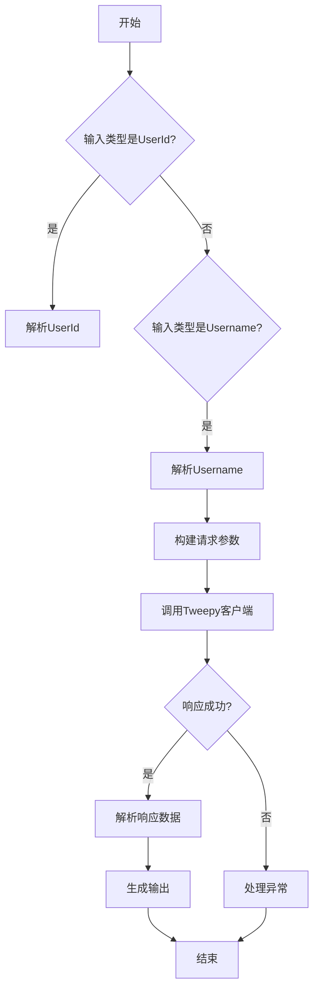
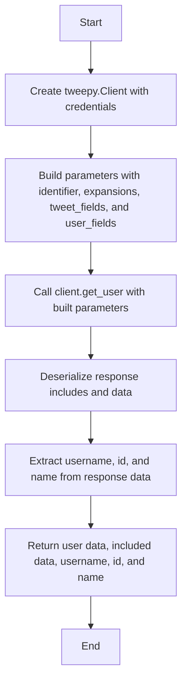
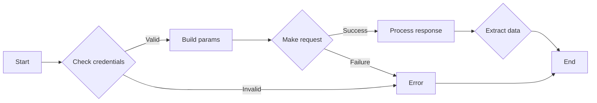
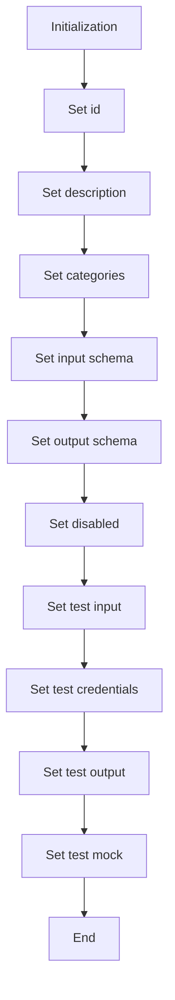
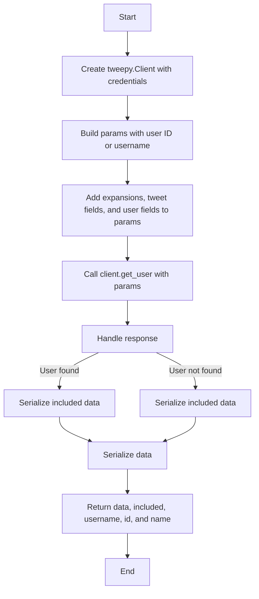

# `.\AutoGPT\autogpt_platform\backend\backend\blocks\twitter\users\user_lookup.py` 详细设计文档

This file contains the implementation of a Twitter user information retrieval system using the Tweepy library. It provides functionality to fetch user information by either user ID or username.

## 整体流程



## 类结构

```
UserId (数据模型)
├── Username (数据模型)
├── TwitterGetUserBlock (Block类)
│   ├── Input (数据模型)
│   ├── Output (数据模型)
│   └── __init__ (初始化方法)
│       ├── super().__init__
│       └── 设置属性
└── get_user (静态方法)
    ├── 创建Tweepy客户端
    ├── 构建请求参数
    ├── 发送请求
    └── 处理响应
```

## 全局变量及字段


### `TEST_CREDENTIALS`
    
Test Twitter credentials used for testing purposes.

类型：`TwitterCredentials`
    


### `TEST_CREDENTIALS_INPUT`
    
Test input for Twitter credentials used for testing purposes.

类型：`TwitterCredentialsInput`
    


### `TWITTER_OAUTH_IS_CONFIGURED`
    
Flag indicating if Twitter OAuth is configured.

类型：`bool`
    


### `TwitterCredentials`
    
Class representing Twitter credentials.

类型：`class`
    


### `TwitterCredentialsField`
    
Class representing a field in Twitter credentials.

类型：`class`
    


### `TwitterCredentialsInput`
    
Class representing input for Twitter credentials.

类型：`class`
    


### `UserExpansionsBuilder`
    
Class for building user expansions parameters.

类型：`class`
    


### `IncludesSerializer`
    
Class for serializing includes in Twitter API responses.

类型：`class`
    


### `ResponseDataSerializer`
    
Class for serializing response data in Twitter API responses.

类型：`class`
    


### `TweetFieldsFilter`
    
Class representing tweet fields filter in Twitter API requests.

类型：`class`
    


### `TweetUserFieldsFilter`
    
Class representing user fields filter in Twitter API requests.

类型：`class`
    


### `UserExpansionInputs`
    
Class representing inputs for user expansions in Twitter API requests.

类型：`class`
    


### `UserExpansionsFilter`
    
Class representing user expansions filter in Twitter API requests.

类型：`class`
    


### `handle_tweepy_exception`
    
Function to handle Tweepy exceptions.

类型：`function`
    


### `Block`
    
Base class for blocks.

类型：`class`
    


### `BlockCategory`
    
Class representing block categories.

类型：`class`
    


### `BlockOutput`
    
Class representing block output.

类型：`class`
    


### `BlockSchemaOutput`
    
Class representing block schema output.

类型：`class`
    


### `SchemaField`
    
Class representing schema fields.

类型：`class`
    


### `UserId`
    
Class representing a user ID.

类型：`class`
    


### `Username`
    
Class representing a Twitter username.

类型：`class`
    


### `TwitterGetUserBlock`
    
Class representing a block to get information about a single Twitter user.

类型：`class`
    


### `UserIdList`
    
Class representing a list of user IDs.

类型：`class`
    


### `UsernameList`
    
Class representing a list of Twitter usernames/handles.

类型：`class`
    


### `TwitterGetUsersBlock`
    
Class representing a block to get information about multiple Twitter users.

类型：`class`
    


### `UserId.UserId.discriminator`
    
Discriminator for the UserId class.

类型：`Literal['user_id']`
    


### `UserId.UserId.user_id`
    
User ID of the user to lookup.

类型：`str`
    


### `Username.Username.discriminator`
    
Discriminator for the Username class.

类型：`Literal['username']`
    


### `Username.Username.username`
    
Twitter username (handle) of the user.

类型：`str`
    


### `TwitterGetUserBlock.TwitterGetUserBlock.id`
    
Unique identifier for the block.

类型：`str`
    


### `TwitterGetUserBlock.TwitterGetUserBlock.description`
    
Description of the block.

类型：`str`
    


### `TwitterGetUserBlock.TwitterGetUserBlock.categories`
    
Categories to which the block belongs.

类型：`set`
    


### `TwitterGetUserBlock.TwitterGetUserBlock.input_schema`
    
Input schema for the block.

类型：`class`
    


### `TwitterGetUserBlock.TwitterGetUserBlock.output_schema`
    
Output schema for the block.

类型：`class`
    


### `TwitterGetUserBlock.TwitterGetUserBlock.disabled`
    
Flag indicating if the block is disabled.

类型：`bool`
    


### `TwitterGetUserBlock.TwitterGetUserBlock.test_input`
    
Test input for the block.

类型：`dict`
    


### `TwitterGetUserBlock.TwitterGetUserBlock.test_credentials`
    
Test credentials for the block.

类型：`TwitterCredentials`
    


### `TwitterGetUserBlock.TwitterGetUserBlock.test_output`
    
Test output for the block.

类型：`list`
    


### `TwitterGetUserBlock.TwitterGetUserBlock.test_mock`
    
Test mock for the block.

类型：`dict`
    


### `TwitterGetUsersBlock.TwitterGetUsersBlock.id`
    
Unique identifier for the block.

类型：`str`
    


### `TwitterGetUsersBlock.TwitterGetUsersBlock.description`
    
Description of the block.

类型：`str`
    


### `TwitterGetUsersBlock.TwitterGetUsersBlock.categories`
    
Categories to which the block belongs.

类型：`set`
    


### `TwitterGetUsersBlock.TwitterGetUsersBlock.input_schema`
    
Input schema for the block.

类型：`class`
    


### `TwitterGetUsersBlock.TwitterGetUsersBlock.output_schema`
    
Output schema for the block.

类型：`class`
    


### `TwitterGetUsersBlock.TwitterGetUsersBlock.disabled`
    
Flag indicating if the block is disabled.

类型：`bool`
    


### `TwitterGetUsersBlock.TwitterGetUsersBlock.test_input`
    
Test input for the block.

类型：`dict`
    


### `TwitterGetUsersBlock.TwitterGetUsersBlock.test_credentials`
    
Test credentials for the block.

类型：`TwitterCredentials`
    


### `TwitterGetUsersBlock.TwitterGetUsersBlock.test_output`
    
Test output for the block.

类型：`list`
    


### `TwitterGetUsersBlock.TwitterGetUsersBlock.test_mock`
    
Test mock for the block.

类型：`dict`
    
    

## 全局函数及方法


### `TwitterGetUserBlock.get_user`

Retrieves information about a single Twitter user specified by ID or username.

参数：

- `credentials`：`TwitterCredentials`，Twitter credentials required to authenticate the request.
- `identifier`：`Union[UserId, Username]`，The identifier of the user to lookup, either by their unique Twitter ID or by their username.
- `expansions`：`UserExpansionsFilter | None`，Additional data to include in the user's information.
- `tweet_fields`：`TweetFieldsFilter | None`，Fields to include in the user's tweets.
- `user_fields`：`TweetUserFieldsFilter | None`，Fields to include in the user's information.

返回值：`tuple`，A tuple containing the user data, included data, username, user ID, and user name.

#### 流程图



#### 带注释源码

```python
@staticmethod
def get_user(
    credentials: TwitterCredentials,
    identifier: Union[UserId, Username],
    expansions: UserExpansionsFilter | None,
    tweet_fields: TweetFieldsFilter | None,
    user_fields: TweetUserFieldsFilter | None,
):
    try:
        client = tweepy.Client(
            bearer_token=credentials.access_token.get_secret_value()
        )

        params = {
            "id": identifier.user_id if isinstance(identifier, UserId) else None,
            "username": (
                identifier.username if isinstance(identifier, Username) else None
            ),
            "user_auth": False,
        }

        params = (
            UserExpansionsBuilder(params)
            .add_expansions(expansions)
            .add_tweet_fields(tweet_fields)
            .add_user_fields(user_fields)
            .build()
        )

        response = cast(Response, client.get_user(**params))

        included = IncludesSerializer.serialize(response.includes)
        data = ResponseDataSerializer.serialize_dict(response.data)

        if response.data:
            username = response.data.username
            id = str(response.data.id)
            name = response.data.name

            return data, included, username, id, name
        else:
            raise tweepy.TweepyException("User not found")

    except tweepy.TweepyException:
        raise
```


### `TwitterGetUserBlock.run`

Retrieves information about a single Twitter user specified by ID or username.

参数：

- `input_data`：`Input`，The input data for the block, containing the identifier and credentials.
- `credentials`：`TwitterCredentials`，The Twitter credentials required to authenticate the request.

返回值：`BlockOutput`，The output data from the block, including user information and any errors.

#### 流程图



#### 带注释源码

```python
async def run(
    self,
    input_data: Input,
    *,
    credentials: TwitterCredentials,
    **kwargs,
) -> BlockOutput:
    try:
        data, included, username, id, name = self.get_user(
            credentials,
            input_data.identifier,
            input_data.expansions,
            input_data.tweet_fields,
            input_data.user_fields,
        )
        if id:
            yield "id", id
        if username:
            yield "username_", username
        if name:
            yield "name_", name
        if data:
            yield "data", data
        if included:
            yield "included", included
    except Exception as e:
        yield "error", handle_tweepy_exception(e)
```


### `TwitterGetUserBlock.__init__`

This method initializes the `TwitterGetUserBlock` class, setting up its properties and configurations.

参数：

- `id`: `str`，The unique identifier for the block.
- `description`: `str`，A brief description of the block's functionality.
- `categories`: `set`，The categories to which the block belongs.
- `input_schema`: `Input`，The schema for the block's input data.
- `output_schema`: `Output`，The schema for the block's output data.
- `disabled`: `bool`，Whether the block is disabled or not.
- `test_input`: `dict`，The test input data for the block.
- `test_credentials`: `TwitterCredentials`，The test credentials for the block.
- `test_output`: `list`，The expected test output data for the block.
- `test_mock`: `dict`，The mock data for the block's test methods.

返回值：`None`，This method does not return any value.

#### 流程图



#### 带注释源码

```python
def __init__(self):
    super().__init__(
        id="5446db8e-a631-11ef-812a-cf315d373ee9",
        description="This block retrieves information about a specified Twitter user.",
        categories={BlockCategory.SOCIAL},
        input_schema=TwitterGetUserBlock.Input,
        output_schema=TwitterGetUserBlock.Output,
        disabled=not TWITTER_OAUTH_IS_CONFIGURED,
        test_input={
            "identifier": {"discriminator": "username", "username": "twitter"},
            "credentials": TEST_CREDENTIALS_INPUT,
            "expansions": None,
            "tweet_fields": None,
            "user_fields": None,
        },
        test_credentials=TEST_CREDENTIALS,
        test_output=[
            ("id", "783214"),
            ("username_", "twitter"),
            ("name_", "Twitter"),
            (
                "data",
                {
                    "user": {
                        "id": "783214",
                        "username": "twitter",
                        "name": "Twitter",
                    }
                },
            ),
        ],
        test_mock={
            "get_user": lambda *args, **kwargs: (
                {
                    "user": {
                        "id": "783214",
                        "username": "twitter",
                        "name": "Twitter",
                    }
                },
                {},
                "twitter",
                "783214",
                "Twitter",
            )
        },
    )
```


### TwitterGetUserBlock.get_user

This method retrieves information about a single Twitter user specified by ID or username.

参数：

- `credentials`：`TwitterCredentials`，Twitter credentials object containing access token and secret.
- `identifier`：`Union[UserId, Username]`，Identifier object containing user ID or username.
- `expansions`：`UserExpansionsFilter | None`，Optional filter for additional user data.
- `tweet_fields`：`TweetFieldsFilter | None`，Optional filter for tweet data.
- `user_fields`：`TweetUserFieldsFilter | None`，Optional filter for user data.

返回值：`tuple`，A tuple containing the following elements:
- `data`：`dict`，Complete user data.
- `included`：`dict`，Additional data requested via expansions.
- `username`：`str`，User username.
- `id`：`str`，User ID.
- `name`：`str`，User name.

#### 流程图



#### 带注释源码

```python
@staticmethod
    def get_user(
        credentials: TwitterCredentials,
        identifier: Union[UserId, Username],
        expansions: UserExpansionsFilter | None,
        tweet_fields: TweetFieldsFilter | None,
        user_fields: TweetUserFieldsFilter | None,
    ):
        try:
            client = tweepy.Client(
                bearer_token=credentials.access_token.get_secret_value()
            )

            params = {
                "id": identifier.user_id if isinstance(identifier, UserId) else None,
                "username": (
                    identifier.username if isinstance(identifier, Username) else None
                ),
                "user_auth": False,
            }

            params = (
                UserExpansionsBuilder(params)
                .add_expansions(expansions)
                .add_tweet_fields(tweet_fields)
                .add_user_fields(user_fields)
                .build()
            )

            response = cast(Response, client.get_user(**params))

            username = ""
            id = ""
            name = ""

            included = IncludesSerializer.serialize(response.includes)
            data = ResponseDataSerializer.serialize_dict(response.data)

            if response.data:
                username = response.data.username
                id = str(response.data.id)
                name = response.data.name

            if username and id:
                return data, included, username, id, name
            else:
                raise tweepy.TweepyException("User not found")

        except tweepy.TweepyException:
            raise
``` 


## 关键组件


### 张量索引与惰性加载

张量索引与惰性加载是代码中用于高效处理和访问大型数据集的关键组件。它允许在需要时才加载数据，从而减少内存消耗并提高性能。

### 反量化支持

反量化支持是代码中用于处理和转换量化数据的关键组件。它允许将量化数据转换回原始数据格式，以便进行进一步处理和分析。

### 量化策略

量化策略是代码中用于优化数据存储和计算效率的关键组件。它通过减少数据精度来减少内存和计算资源的使用，同时保持足够的准确性。


## 问题及建议


### 已知问题

-   **代码重复性**：`TwitterGetUserBlock` 和 `TwitterGetUsersBlock` 类中存在大量重复代码，特别是在 `get_user` 和 `get_users` 方法中。这可能导致维护成本增加，并且在未来修改时容易出错。
-   **异常处理**：异常处理主要集中在捕获 `tweepy.TweepyException`，但没有对其他可能的异常进行捕获和处理，例如网络异常或认证问题。
-   **参数验证**：代码中没有对输入参数进行详细的验证，例如用户ID或用户名的格式和长度。
-   **异步执行**：`run` 方法使用了 `async def`，但并没有使用 `await` 关键字，这可能是一个错误。

### 优化建议

-   **代码重构**：将重复的代码提取到单独的函数中，减少代码重复，并提高可维护性。
-   **增强异常处理**：增加对其他可能的异常的捕获和处理，例如网络异常或认证问题，并给出更具体的错误信息。
-   **参数验证**：在 `run` 方法中增加对输入参数的验证，确保输入参数符合预期格式和长度。
-   **异步执行**：如果 `run` 方法确实需要异步执行，确保使用 `await` 关键字等待异步操作完成。
-   **单元测试**：编写单元测试来覆盖关键功能，确保代码的正确性和稳定性。
-   **文档**：增加代码注释和文档，以便其他开发者更好地理解代码的功能和结构。


## 其它


### 设计目标与约束

- 设计目标：实现一个能够从Twitter获取用户信息的模块，支持单个用户和多个用户的查询。
- 约束：
  - 必须使用Twitter API进行数据获取。
  - 需要处理Twitter API可能抛出的异常。
  - 输入数据需要通过Pydantic模型进行验证。
  - 输出数据需要符合预定义的输出格式。

### 错误处理与异常设计

- 错误处理：使用`try-except`块捕获`tweepy.TweepyException`异常，并使用`handle_tweepy_exception`函数处理。
- 异常设计：定义了自定义异常处理函数，以提供更具体的错误信息。

### 数据流与状态机

- 数据流：用户输入通过Pydantic模型验证后，传递给Twitter API，然后返回结果。
- 状态机：没有明确的状态机，但数据流是线性的，从输入到输出。

### 外部依赖与接口契约

- 外部依赖：`tweepy`库用于与Twitter API交互。
- 接口契约：定义了输入和输出模型的契约，确保数据的一致性和正确性。

### 安全性与隐私

- 安全性：使用Twitter OAuth认证，确保API调用安全。
- 隐私：不存储或泄露用户数据。

### 测试与验证

- 测试：使用单元测试和集成测试验证代码的正确性和稳定性。
- 验证：通过预定义的测试输入和输出验证功能。

### 性能与可扩展性

- 性能：优化API调用和数据处理，确保高效运行。
- 可扩展性：设计允许轻松添加新的功能或支持更多的Twitter API功能。

### 维护与更新

- 维护：定期更新代码以适应Twitter API的变化。
- 更新：遵循最佳实践，确保代码质量和可维护性。


    