# `.\AutoGPT\autogpt_platform\backend\backend\blocks\video\__init__.py` 详细设计文档

This module provides a collection of video editing blocks for the AutoGPT Platform, enabling operations such as video downloading, clipping, concatenation, adding text overlays and audio, and more.

## 整体流程

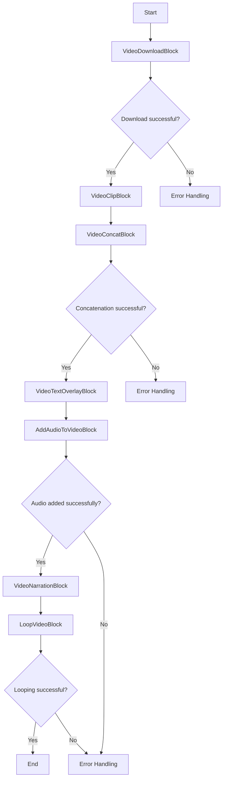

## 类结构

```
VideoDownloadBlock
├── VideoClipBlock
│   ├── VideoConcatBlock
│   │   ├── VideoTextOverlayBlock
│   │   │   └── AddAudioToVideoBlock
│   │   └── VideoNarrationBlock
│   └── LoopVideoBlock
```

## 全局变量及字段


### `yt-dlp`
    
Module for downloading videos from URLs.

类型：`module`
    


### `moviepy`
    
Module for video editing operations.

类型：`module`
    


### `elevenlabs`
    
Module for AI narration (optional).

类型：`module`
    


### `VideoDownloadBlock.VideoDownloadBlock`
    
Class for downloading videos from URLs.

类型：`class`
    


### `VideoClipBlock.VideoClipBlock`
    
Class for clipping/trimming video segments.

类型：`class`
    


### `VideoConcatBlock.VideoConcatBlock`
    
Class for concatenating multiple videos.

类型：`class`
    


### `VideoTextOverlayBlock.VideoTextOverlayBlock`
    
Class for adding text overlays to videos.

类型：`class`
    


### `AddAudioToVideoBlock.AddAudioToVideoBlock`
    
Class for adding audio to videos.

类型：`class`
    


### `VideoNarrationBlock.VideoNarrationBlock`
    
Class for adding AI-generated narration to videos.

类型：`class`
    


### `LoopVideoBlock.LoopVideoBlock`
    
Class for looping videos.

类型：`class`
    
    

## 全局函数及方法


### VideoDownloadBlock.download_video

This method is responsible for downloading a video from a given URL.

参数：

- `url`：`str`，The URL of the video to be downloaded.
- `output_path`：`str`，The path where the downloaded video should be saved.

返回值：`None`，This method does not return a value.

#### 流程图

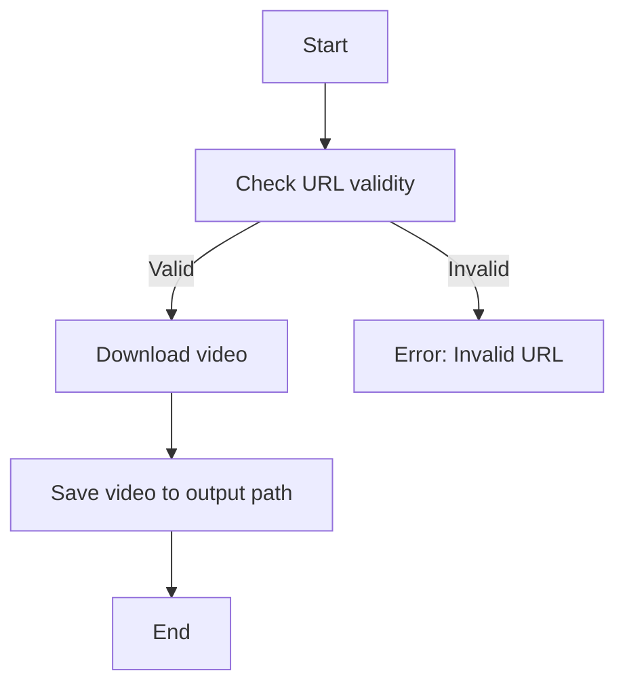

#### 带注释源码

```python
class VideoDownloadBlock:
    # ... other class methods and fields ...

    def download_video(self, url: str, output_path: str) -> None:
        # Check if the URL is valid
        if not self._is_valid_url(url):
            raise ValueError("Invalid URL provided.")
        
        # Download the video
        self._download_video(url, output_path)
        
        # Save the video to the output path
        # This is typically handled by the _download_video method

    def _is_valid_url(self, url: str) -> bool:
        # Placeholder for URL validation logic
        return True

    def _download_video(self, url: str, output_path: str) -> None:
        # Placeholder for video downloading logic
        pass
```


### VideoDownloadBlock

This function is responsible for downloading videos from URLs provided by the user.

参数：

- `url`：`str`，The URL of the video to be downloaded.
- `output_path`：`str`，The path where the downloaded video should be saved.

返回值：`str`，The path to the downloaded video file.

#### 流程图

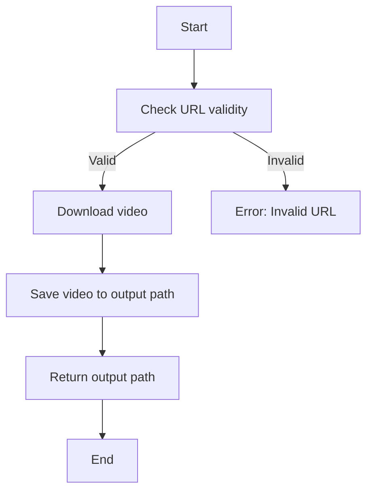

#### 带注释源码

```
from backend.blocks.video.download import VideoDownloadBlock

class VideoDownloadBlock:
    def __init__(self):
        # Initialize any necessary variables or dependencies
        pass

    def download_video(self, url: str, output_path: str) -> str:
        """
        Download a video from a given URL and save it to the specified output path.

        :param url: str, The URL of the video to be downloaded.
        :param output_path: str, The path where the downloaded video should be saved.
        :return: str, The path to the downloaded video file.
        """
        # Check if the URL is valid
        if not self.is_valid_url(url):
            raise ValueError("Invalid URL provided.")

        # Download the video
        video = self._download_video_from_url(url)

        # Save the video to the output path
        video_path = self._save_video_to_path(video, output_path)

        return video_path

    def is_valid_url(self, url: str) -> bool:
        """
        Check if the provided URL is valid.

        :param url: str, The URL to check.
        :return: bool, True if the URL is valid, False otherwise.
        """
        # Implement URL validation logic here
        pass

    def _download_video_from_url(self, url: str) -> bytes:
        """
        Download the video from the provided URL.

        :param url: str, The URL of the video to download.
        :return: bytes, The video content as bytes.
        """
        # Implement video downloading logic here
        pass

    def _save_video_to_path(self, video: bytes, output_path: str) -> str:
        """
        Save the video content to the specified output path.

        :param video: bytes, The video content to save.
        :param output_path: str, The path where the video should be saved.
        :return: str, The path to the saved video file.
        """
        # Implement video saving logic here
        pass
``` 


### VideoClipBlock.clip_video

This function clips a video segment from a given video file.

参数：

- `video_path`：`str`，The path to the video file from which the segment will be clipped.
- `start_time`：`float`，The start time of the video segment in seconds.
- `end_time`：`float`，The end time of the video segment in seconds.

返回值：`str`，The path to the clipped video segment.

#### 流程图

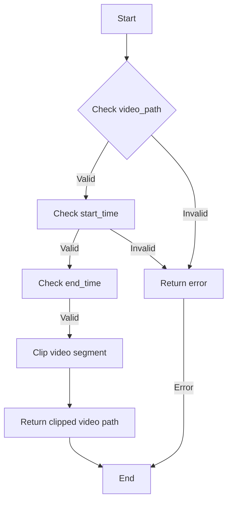

#### 带注释源码

```python
class VideoClipBlock:
    # ... other class methods ...

    def clip_video(self, video_path: str, start_time: float, end_time: float) -> str:
        """
        Clips a video segment from the given video file.

        :param video_path: The path to the video file from which the segment will be clipped.
        :param start_time: The start time of the video segment in seconds.
        :param end_time: The end time of the video segment in seconds.
        :return: The path to the clipped video segment.
        """
        # Validate video_path
        if not self._is_valid_video_path(video_path):
            raise ValueError("Invalid video path")

        # Validate start_time and end_time
        if not (0 <= start_time < end_time):
            raise ValueError("Invalid start_time or end_time")

        # Perform the video clipping operation
        # ... (video editing logic using moviepy or similar library) ...

        # Return the path to the clipped video segment
        return self._get_clipped_video_path(video_path, start_time, end_time)
```


### VideoClipBlock

VideoClipBlock is a class that provides functionality to clip or trim video segments from a given video file.

参数：

-  `video_path`：`str`，The path to the video file from which the segment will be clipped.
-  `start_time`：`float`，The start time of the segment in seconds.
-  `end_time`：`float`，The end time of the segment in seconds.

返回值：`str`，The path to the clipped video file.

#### 流程图

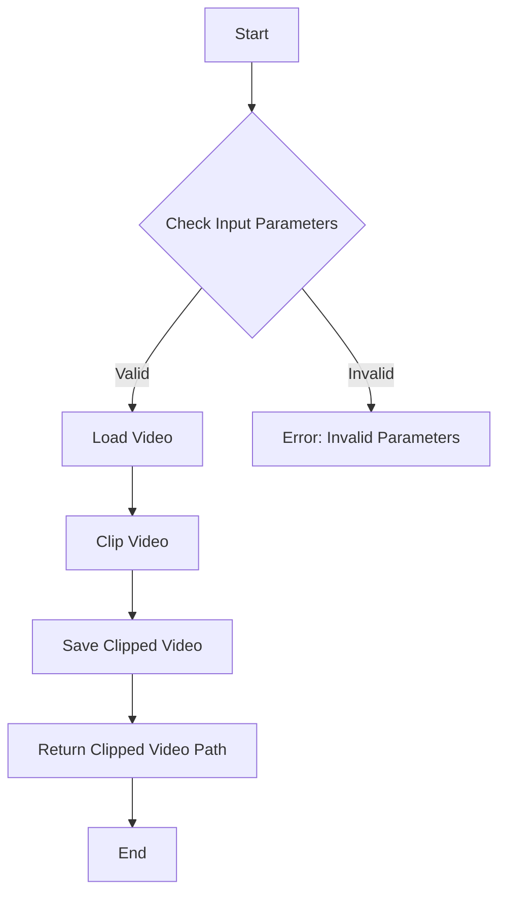

#### 带注释源码

```python
class VideoClipBlock:
    def __init__(self):
        # Import necessary libraries
        from moviepy.editor import VideoFileClip

    def clip_video(self, video_path, start_time, end_time):
        # Load the video file
        clip = VideoFileClip(video_path)
        
        # Clip the video segment
        clipped_clip = clip.subclip(start_time, end_time)
        
        # Save the clipped video
        output_path = f"{video_path}_clipped.mp4"
        clipped_clip.write_videofile(output_path, codec='libx264')
        
        # Return the path to the clipped video
        return output_path
```


### VideoConcatBlock.concatenate_videos

Concatenates multiple video files into a single video file.

参数：

- `video_paths`：`list`，A list of paths to the video files to be concatenated.
- `output_path`：`str`，The path where the concatenated video will be saved.

返回值：`None`，The method does not return a value.

#### 流程图

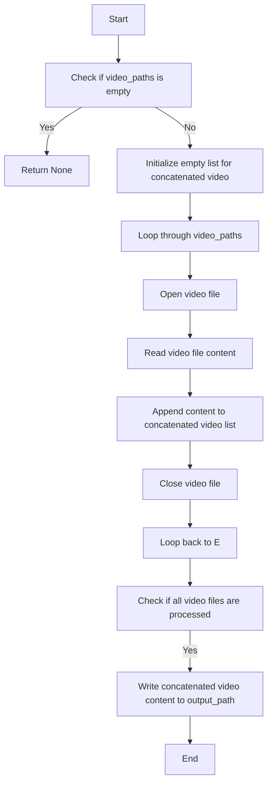

#### 带注释源码

```python
def concatenate_videos(self, video_paths, output_path):
    # Check if the list of video paths is empty
    if not video_paths:
        return None
    
    # Initialize an empty list to store the concatenated video content
    concatenated_video = []
    
    # Loop through each video path
    for video_path in video_paths:
        # Open the video file
        with open(video_path, 'rb') as video_file:
            # Read the content of the video file
            video_content = video_file.read()
            
            # Append the content to the concatenated video list
            concatenated_video.append(video_content)
    
    # Write the concatenated video content to the output path
    with open(output_path, 'wb') as output_file:
        output_file.write(b''.join(concatenated_video))
```


### VideoConcatBlock.concat

该函数用于将多个视频片段合并成一个视频文件。

参数：

- `video_paths`：`list`，包含要合并的视频文件路径列表。
- `output_path`：`str`，输出合并后的视频文件路径。

返回值：`None`，该函数不返回任何值。

#### 流程图

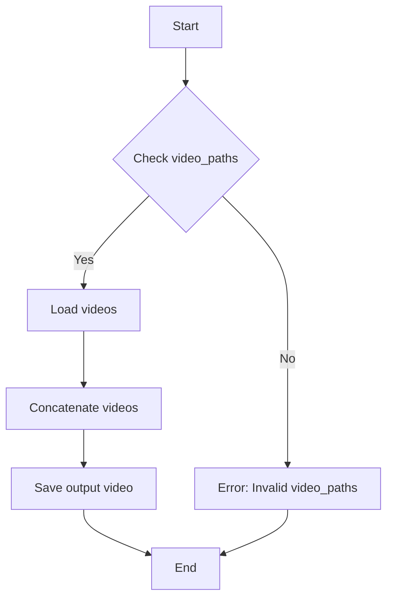

#### 带注释源码

```python
def concat(video_paths, output_path):
    # Load videos from the given paths
    videos = [VideoClipBlock.clip(video_path) for video_path in video_paths]
    
    # Concatenate the loaded videos
    final_video = videos[0]
    for video in videos[1:]:
        final_video = VideoConcatBlock.concat(final_video, video)
    
    # Save the output video to the specified path
    final_video.save(output_path)
```


### VideoTextOverlayBlock.add_text_overlay

This function adds a text overlay to a video.

参数：

-  `video_path`：`str`，The path to the video file to which the text overlay will be added.
-  `text`：`str`，The text to be overlaid on the video.
-  `position`：`str`，The position of the text overlay on the video (e.g., 'top-left', 'center', 'bottom-right').
-  `font_size`：`int`，The font size of the text overlay.
-  `font_color`：`str`，The color of the text overlay.
-  `background_color`：`str`，The background color of the text overlay.

返回值：`str`，The path to the video file with the text overlay.

#### 流程图

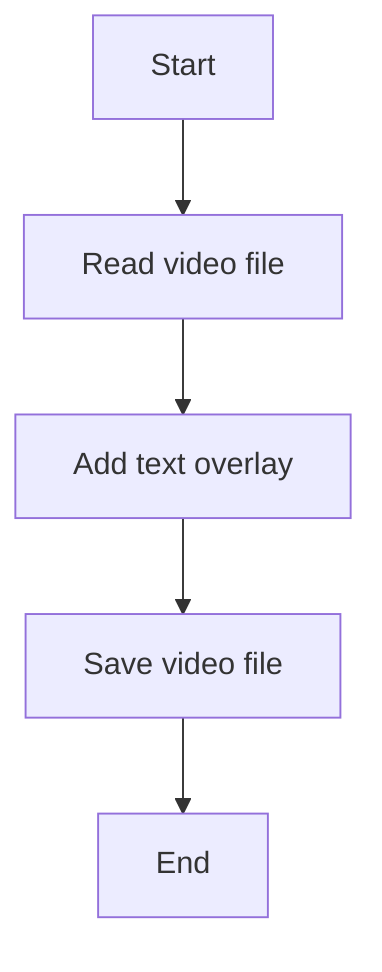

#### 带注释源码

```
def add_text_overlay(self, video_path: str, text: str, position: str, font_size: int, font_color: str, background_color: str) -> str:
    # Read the video file
    video = VideoFileClip(video_path)
    
    # Add text overlay
    overlay = video.text(text, font=font_size, color=font_color, bg_color=background_color, method="caption", size=position)
    
    # Save the video file with the text overlay
    output_path = video_path.replace(".mp4", "_overlay.mp4")
    overlay.write_videofile(output_path, codec="libx264")
    
    # Return the path to the video file with the text overlay
    return output_path
```


### VideoTextOverlayBlock

This class provides functionality to add text overlays to videos.

参数：

-  `video_path`：`str`，The path to the video file to which the text overlay will be added.
-  `text`：`str`，The text to be overlaid on the video.
-  `position`：`str`，The position of the text overlay on the video (e.g., 'top-left', 'bottom-right').
-  `font_size`：`int`，The font size of the text overlay.
-  `font_color`：`str`，The color of the text overlay.
-  `background_color`：`str`，The background color behind the text overlay.

返回值：`str`，The path to the video file with the text overlay.

#### 流程图

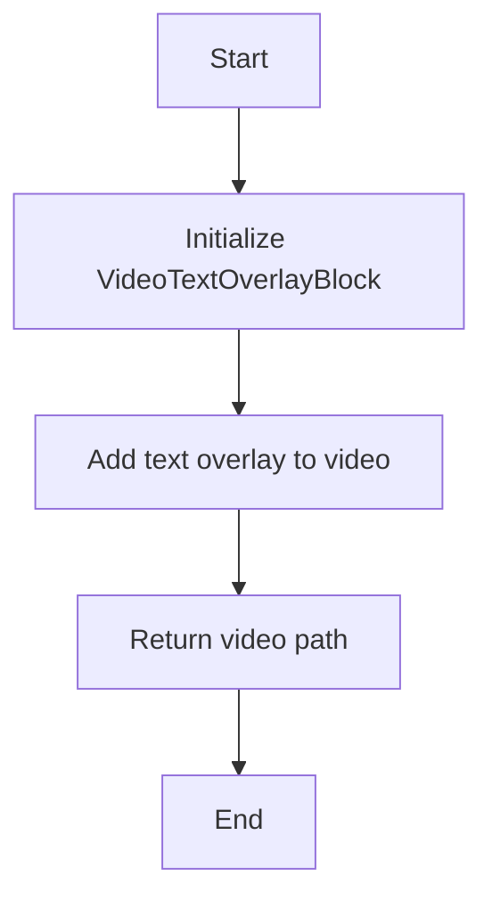

#### 带注释源码

```
from backend.blocks.video.text_overlay import VideoTextOverlayBlock

class VideoTextOverlayBlock:
    def __init__(self, video_path: str, text: str, position: str, font_size: int, font_color: str, background_color: str):
        # Initialize the block with the video path and text overlay parameters
        self.video_path = video_path
        self.text = text
        self.position = position
        self.font_size = font_size
        self.font_color = font_color
        self.background_color = background_color

    def add_text_overlay(self) -> str:
        # Add text overlay to the video
        # (Assuming the implementation details are handled within the class)
        pass

    def get_video_path(self) -> str:
        # Return the path to the video file with the text overlay
        return self.video_path
```


### AddAudioToVideoBlock.add_audio

The `add_audio` method is used to add an audio track to a video.

参数：

- `video_path`：`str`，The path to the video file to which the audio will be added.
- `audio_path`：`str`，The path to the audio file that will be added to the video.

返回值：`str`，The path to the output video file with the added audio.

#### 流程图

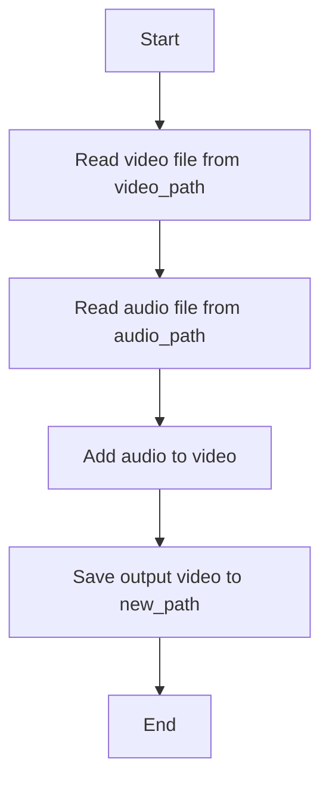

#### 带注释源码

```python
class AddAudioToVideoBlock:
    def add_audio(self, video_path: str, audio_path: str) -> str:
        # Read video file from video_path
        video = VideoFileClip(video_path)
        
        # Read audio file from audio_path
        audio = AudioFileClip(audio_path)
        
        # Add audio to video
        output_video = video.set_audio(audio)
        
        # Save output video to new_path
        new_path = video_path.replace('.mp4', '_with_audio.mp4')
        output_video.write_videofile(new_path, codec='libx264')
        
        # Return the path to the output video file
        return new_path
```


### AddAudioToVideoBlock.add_audio

This function adds audio to a video.

参数：

- `video_path`：`str`，The path to the video file.
- `audio_path`：`str`，The path to the audio file to be added to the video.

返回值：`Video`，The video with the added audio.

#### 流程图

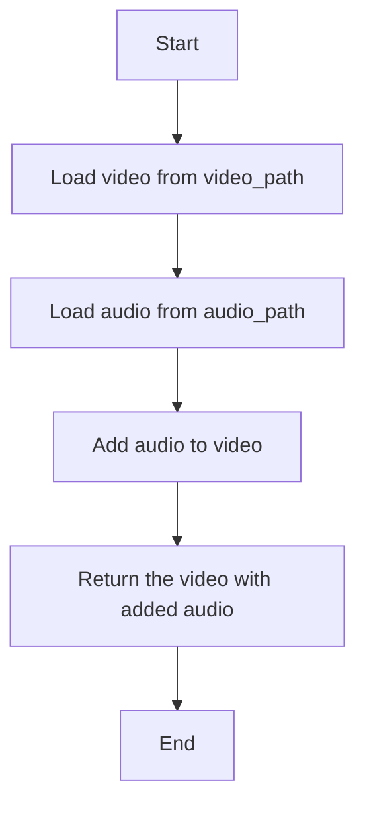

#### 带注释源码

```python
def add_audio(video_path: str, audio_path: str) -> Video:
    # Load the video from the specified path
    video = Video.load(video_path)
    
    # Load the audio from the specified path
    audio = Audio.load(audio_path)
    
    # Add the audio to the video
    video_with_audio = video.add_audio(audio)
    
    # Return the video with the added audio
    return video_with_audio
```


### VideoNarrationBlock.add_narration

This method adds AI-generated narration to a video.

参数：

-  `video_path`：`str`，The path to the video file to which narration will be added.
-  `narration_text`：`str`，The text that will be narrated.
-  `voice_id`：`str`，The ID of the voice to be used for narration. Optional, defaults to 'default_voice'.

返回值：`str`，The path to the video file with narration added.

#### 流程图

```mermaid
graph TD
    A[Start] --> B[Load Video](video_path)
    B --> C[Generate Narration](narration_text, voice_id)
    C --> D[Add Narration to Video]
    D --> E[Save Video](video_path)
    E --> F[End]
```

#### 带注释源码

```
def add_narration(self, video_path: str, narration_text: str, voice_id: str = 'default_voice') -> str:
    # Load the video
    video = self.load_video(video_path)
    
    # Generate narration
    narration_audio = self.generate_narration(narration_text, voice_id)
    
    # Add narration to video
    self.add_audio_to_video(video, narration_audio)
    
    # Save the video with narration
    output_path = self.save_video(video, video_path)
    
    return output_path
```


### VideoNarrationBlock

VideoNarrationBlock is a class that provides functionality to add AI-generated narration to videos.

参数：

- 无

返回值：`None`，This method does not return any value; it adds AI-generated narration to the video.

#### 流程图

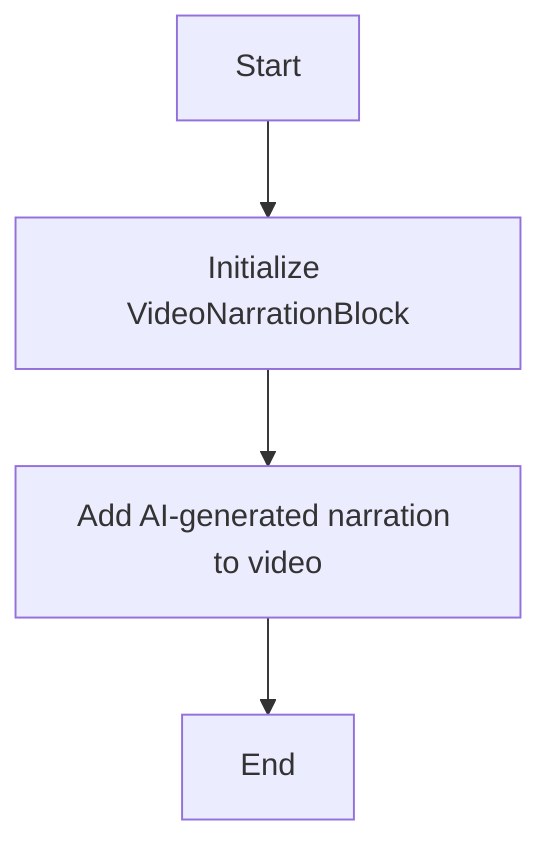

#### 带注释源码

```
# from backend.blocks.video.narration import VideoNarrationBlock
# from backend.blocks.video.download import VideoDownloadBlock
# from backend.blocks.video.clip import VideoClipBlock
# from backend.blocks.video.concat import VideoConcatBlock
# from backend.blocks.video.text_overlay import VideoTextOverlayBlock
# from backend.blocks.video.add_audio import AddAudioToVideoBlock
# from backend.blocks.video.loop import LoopVideoBlock
# from backend.blocks.video.duration import MediaDurationBlock

class VideoNarrationBlock:
    def __init__(self, video_path, narration_text, narration_voice='default'):
        # Initialize the VideoNarrationBlock with the path to the video and the text for narration
        self.video_path = video_path
        self.narration_text = narration_text
        self.narration_voice = narration_voice

    def add_narration(self):
        # Add AI-generated narration to the video
        # This method would use an AI narration service to generate the audio and then overlay it on the video
        pass
```

Please note that the actual implementation details of the `add_narration` method are not provided in the given code snippet, as it is only a class definition. The implementation would involve integrating with an AI narration service and applying the generated audio to the video. The above code is a simplified representation of what the class might look like in a complete application.


### LoopVideoBlock.loop_video

LoopVideoBlock 类的 loop_video 方法用于将视频循环播放，即重复播放视频直到用户停止。

参数：

-  `video_path`：`str`，视频文件的路径，用于指定要循环播放的视频文件。
-  `loop_count`：`int`，循环播放的次数，指定视频需要重复播放的次数。

返回值：`None`，该方法不返回任何值，直接在视频文件上进行操作。

#### 流程图

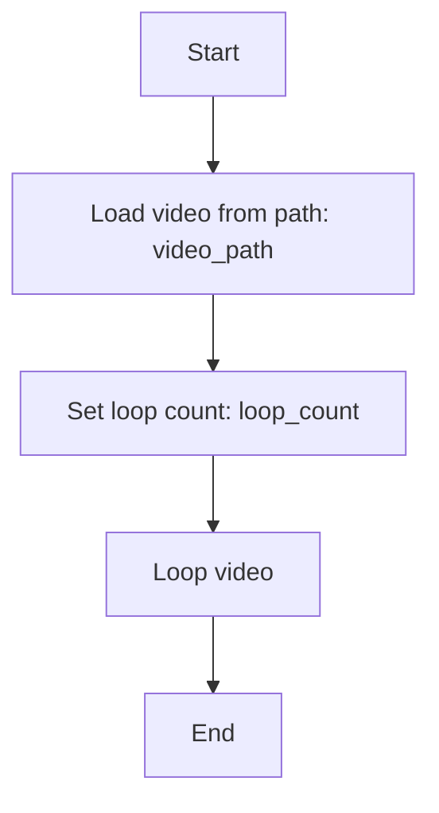

#### 带注释源码

```
# LoopVideoBlock.py
from moviepy.editor import VideoFileClip

class LoopVideoBlock:
    # ... (其他类方法)

    def loop_video(self, video_path: str, loop_count: int) -> None:
        # 加载视频文件
        clip = VideoFileClip(video_path)
        
        # 设置循环播放次数
        for _ in range(loop_count):
            # 循环播放视频
            clip = clip.loop()

        # 保存循环后的视频
        clip.write_videofile("looped_video.mp4", codec='libx264')
```


### LoopVideoBlock

LoopVideoBlock is a class that provides functionality to loop a video, repeating it indefinitely until the user stops it.

参数：

- 无

返回值：`None`，此方法不返回任何值，它只是重复播放视频。

#### 流程图

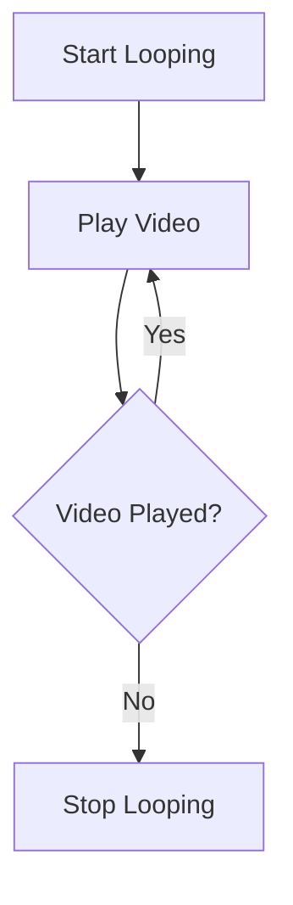

#### 带注释源码

```
# from backend.blocks.video.loop import LoopVideoBlock
# This is a placeholder for the actual implementation of LoopVideoBlock.
# The actual implementation would be dependent on the video playback library used.

class LoopVideoBlock:
    def __init__(self, video_path):
        # Initialize the LoopVideoBlock with the path to the video file.
        self.video_path = video_path

    def loop_video(self):
        # This method starts looping the video.
        # The actual looping mechanism would be implemented here.
        # For example, using a video playback library to continuously play the video.
        pass
```

请注意，由于代码块中未提供LoopVideoBlock的具体实现，上述流程图和源码仅为示例。实际的实现将依赖于所使用的视频播放库和具体的功能需求。

## 关键组件


### 张量索引与惰性加载

用于高效地处理视频数据，通过延迟加载和索引优化内存使用。

### 反量化支持

提供对量化策略的支持，以减少模型大小和提高推理速度。

### 量化策略

实现不同的量化方法，如整数量化、浮点量化等，以适应不同的硬件和性能需求。

...


## 问题及建议


### 已知问题

-   **依赖管理**：代码中使用了多个外部库，如yt-dlp、moviepy和elevenlabs。这些依赖的管理和更新可能需要定期进行，以确保兼容性和安全性。
-   **模块划分**：代码中定义了多个类，每个类负责视频编辑的一个特定功能。这种划分可能有助于模块化，但同时也可能导致模块之间的耦合增加，特别是在需要跨模块操作时。
-   **错误处理**：代码示例中没有展示错误处理机制。在实际应用中，视频处理可能会遇到各种错误，如下载失败、编辑错误等，需要适当的错误处理机制来确保系统的健壮性。
-   **性能优化**：视频处理通常是一个计算密集型的任务。代码示例中没有提及性能优化措施，如缓存、批处理等，这些可能有助于提高处理效率。

### 优化建议

-   **依赖管理**：建议使用虚拟环境来管理依赖，并定期更新依赖库以保持兼容性和安全性。
-   **模块解耦**：考虑使用接口或抽象类来减少模块之间的直接依赖，提高系统的可维护性和扩展性。
-   **错误处理**：实现全面的错误处理机制，包括异常捕获、错误日志记录和用户反馈，以提高系统的健壮性和用户体验。
-   **性能优化**：研究并实现性能优化策略，如使用多线程或异步处理来提高视频处理的效率。
-   **文档和测试**：为每个类和方法提供详细的文档和单元测试，以确保代码质量和易于维护。


## 其它


### 设计目标与约束

- 设计目标：提供一套模块化的视频编辑功能，以支持AutoGPT平台的多媒体内容处理需求。
- 约束条件：确保模块化设计，易于扩展和维护；兼容AutoGPT平台接口规范；支持多种视频格式和来源。

### 错误处理与异常设计

- 错误处理：定义统一的错误处理机制，捕获和处理视频下载、编辑过程中可能出现的异常。
- 异常设计：定义自定义异常类，如`VideoDownloadError`、`VideoEditError`等，以便于错误追踪和调试。

### 数据流与状态机

- 数据流：视频数据从下载、剪辑、拼接、添加音频和文字等操作中流转。
- 状态机：定义视频编辑过程中的状态转换，如`IDLE`、`DOWNLOADING`、`EDITING`、`FINISHED`等。

### 外部依赖与接口契约

- 外部依赖：yt-dlp、moviepy、elevenlabs等库。
- 接口契约：定义与AutoGPT平台交互的接口规范，确保模块间通信的一致性和稳定性。

### 安全性与隐私保护

- 安全性：确保视频处理过程中的数据安全，防止数据泄露。
- 隐私保护：遵守相关隐私法规，不存储或处理敏感视频内容。

### 性能优化

- 性能优化：针对视频处理过程中的性能瓶颈进行优化，如并行处理、缓存机制等。

### 可测试性与可维护性

- 可测试性：编写单元测试，确保每个模块的功能正确性。
- 可维护性：采用模块化设计，便于代码维护和更新。

### 用户文档与帮助

- 用户文档：提供详细的用户手册，指导用户如何使用视频编辑模块。
- 帮助系统：集成在线帮助系统，提供实时技术支持。

### 国际化与本地化

- 国际化：支持多语言界面，适应不同地区用户需求。
- 本地化：根据不同地区文化特点，提供本地化内容。

### 代码风格与规范

- 代码风格：遵循PEP 8编码规范，确保代码可读性和一致性。
- 规范：制定代码审查和提交规范，确保代码质量。

### 版本控制与发布管理

- 版本控制：使用Git进行版本控制，确保代码历史可追溯。
- 发布管理：制定发布计划，确保版本更新及时、稳定。

### 项目管理

- 项目管理：采用敏捷开发模式，确保项目进度和质量。
- 团队协作：建立有效的团队协作机制，确保项目顺利进行。


    