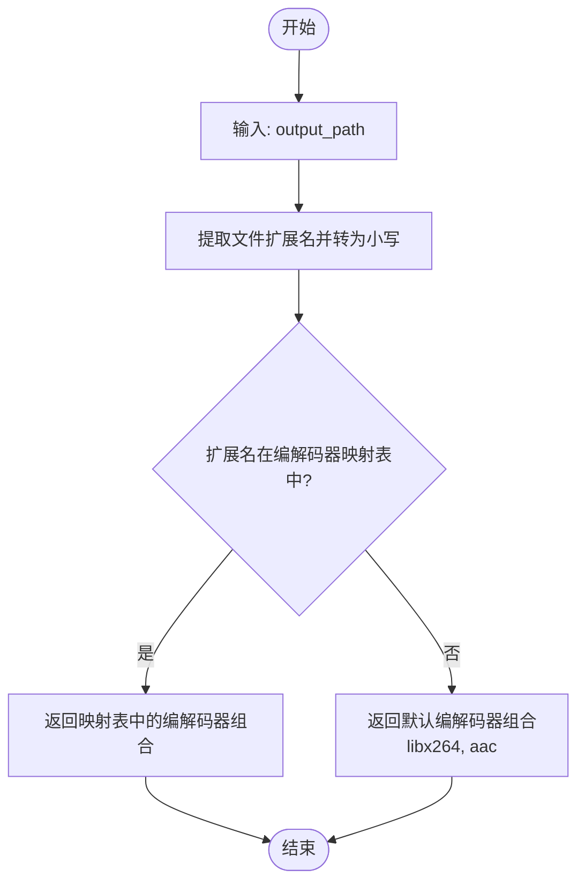
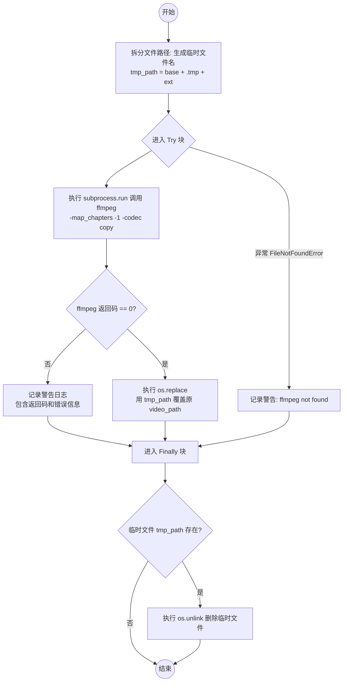

# `AutoGPT\autogpt_platform\backend\backend\blocks\video\_utils.py` 详细设计文档

该文件为视频处理模块提供了一组共享实用工具，主要包括通过正则剥离文件名中的节点执行ID和操作标签以恢复原始文件名、根据文件扩展名映射FFmpeg编解码器参数、以及利用subprocess调用ffmpeg在原位移除视频文件章节元数据以解决特定库兼容性问题的功能。

## 整体流程

```mermaid
graph TD
    A[开始] --> B[模块加载: 定义正则与日志]
    B --> C{调用功能}
    C -->|extract_source_name| D[解析文件路径 stem]
    D --> E{匹配 Block Prefix?}
    E -- 是 --> F[替换前缀]
    F --> E
    E -- 否 --> G{匹配 UUID Prefix?}
    G -- 是 --> H[替换UUID前缀]
    G -- 否 --> I[长度检查与截断]
    H --> I
    I --> J[返回清理后的文件名]

    C -->|get_video_codecs| K[获取文件扩展名]
    K --> L[查找 codec_map 字典]
    L --> M[返回 (video_codec, audio_codec)]

    C -->|strip_chapters_inplace| N[构建临时文件路径]
    N --> O[执行 ffmpeg subprocess]
    O --> P{Returncode == 0?}
    P -- 否 --> Q[记录警告日志]
    P -- 是 --> R[os.replace 替换原文件]
    Q --> S[清理临时文件]
    R --> S
    S --> T[结束]
```

## 类结构

```
video_utils.py (Module)
├── Global Variables
│   ├── _VIDEO_OPS
│   ├── _BLOCK_PREFIX_RE
│   ├── _UUID_PREFIX_RE
│   └── logger
└── Functions
    ├── extract_source_name
    ├── get_video_codecs
    └── strip_chapters_inplace
```

## 全局变量及字段


### `_VIDEO_OPS`
    
存储视频块操作标签的正则表达式字符串元组，用于构建文件名前缀匹配规则。

类型：`tuple[str]`
    


### `_BLOCK_PREFIX_RE`
    
匹配由 {node_exec_id}_{operation}_ 组成的文件名前缀的编译正则表达式对象。

类型：`re.Pattern`
    


### `_UUID_PREFIX_RE`
    
匹配仅由 {node_exec_id}_ 组成的文件名前缀（无操作关键字）的编译正则表达式对象。

类型：`re.Pattern`
    


### `logger`
    
用于输出模块运行日志和警告信息的日志记录器实例。

类型：`logging.Logger`
    


    

## 全局函数及方法


### `extract_source_name`

通过剥离由视频模块生成的前缀（包含执行ID和操作标签），从输入路径中提取原始的源文件名称。该函数能够处理由于视频处理链路多次叠加而产生的前缀积累，同时具备安全处理不含UUID的普通文件名的能力，并在剥离结果为空时提供默认名称。

参数：

-  `input_path`：`str`，需要处理的视频文件路径。
-  `max_length`：`int`，返回文件名的最大长度限制，默认为50。

返回值：`str`，剥离了生成前缀的原始文件名（根据max_length截断），如果剥离后为空则返回 "video"。

#### 流程图

```mermaid
flowchart TD
    A([开始]) --> B[获取文件名 stem]
    B --> C{匹配 {node_exec_id}_{operation}_ 前缀?}
    C -- 是 --> D[移除匹配的前缀]
    D --> C
    C -- 否 --> E{匹配 {node_exec_id}_ 前缀?}
    E -- 是 --> F[移除匹配的前缀]
    F --> G{处理后的 stem 是否为空?}
    E -- 否 --> G
    G -- 是 --> H[返回默认名称 'video']
    G -- 否 --> I[截取前 max_length 个字符]
    I --> J([返回处理后的名称])
```

#### 带注释源码

```python
def extract_source_name(input_path: str, max_length: int = 50) -> str:
    """Extract the original source filename by stripping block-generated prefixes.

    Iteratively removes {node_exec_id}_{operation}_ prefixes that accumulate
    when chaining video blocks, recovering the original human-readable name.

    Safe for plain filenames (no UUID -> no stripping).
    Falls back to "video" if everything is stripped.
    """
    # 提取文件名的主干（不包含扩展名）
    stem = Path(input_path).stem

    # 第一步：循环剥离 {node_exec_id}_{operation}_ 前缀
    # 处理视频块链式操作产生的前缀累积，直到不再匹配模式
    while _BLOCK_PREFIX_RE.match(stem):
        stem = _BLOCK_PREFIX_RE.sub("", stem, count=1)

    # 第二步：剥离单独的 {node_exec_id}_ 前缀
    # 处理例如下载块等没有特定操作标签的UUID前缀情况
    if _UUID_PREFIX_RE.match(stem):
        stem = _UUID_PREFIX_RE.sub("", stem, count=1)

    # 如果剥离后文件名为空，返回默认名称 "video"
    if not stem:
        return "video"

    # 返回截断至指定最大长度的文件名
    return stem[:max_length]
```


### `get_video_codecs`

基于输出文件扩展名获取适当的视频和音频编解码器。

参数：

-  `output_path`：`str`，用于确定扩展名的输出文件的路径

返回值：`tuple[str, str]`，包含视频编解码器名称和音频编解码器名称的元组

#### 流程图



#### 带注释源码

```python
def get_video_codecs(output_path: str) -> tuple[str, str]:
    """Get appropriate video and audio codecs based on output file extension.

    Args:
        output_path: Path to the output file (used to determine extension)

    Returns:
        Tuple of (video_codec, audio_codec)

    Codec mappings:
        - .mp4: H.264 + AAC (universal compatibility)
        - .webm: VP8 + Vorbis (web streaming)
        - .mkv: H.264 + AAC (container supports many codecs)
        - .mov: H.264 + AAC (Apple QuickTime, widely compatible)
        - .m4v: H.264 + AAC (Apple iTunes/devices)
        - .avi: MPEG-4 + MP3 (legacy Windows)
    """
    # 步骤 1: 从输出路径中提取文件扩展名，并统一转换为小写以进行匹配
    ext = os.path.splitext(output_path)[1].lower()

    # 步骤 2: 定义文件扩展名到 (视频编解码器, 音频编解码器) 的映射字典
    codec_map: dict[str, tuple[str, str]] = {
        ".mp4": ("libx264", "aac"),
        ".webm": ("libvpx", "libvorbis"),
        ".mkv": ("libx264", "aac"),
        ".mov": ("libx264", "aac"),
        ".m4v": ("libx264", "aac"),
        ".avi": ("mpeg4", "libmp3lame"),
    }

    # 步骤 3: 根据扩展名查找对应的编解码器，如果未找到则返回默认值 (H.264 + AAC)
    return codec_map.get(ext, ("libx264", "aac"))
```


### `strip_chapters_inplace`

使用 ffmpeg 命令行工具就地去除指定媒体文件中的章节元数据。此函数旨在解决 MoviePy 2.x 在解析带有嵌入章节元数据的文件时崩溃的问题。它通过 ffmpeg 的流复制功能（无重新编码）去除章节，确保处理速度极快且不损失画质，操作成功后会覆盖原文件。

参数：

- `video_path`：`str`，需要去除章节元数据的媒体文件的绝对路径。

返回值：`None`，该函数没有返回值，操作成功后会直接修改文件系统中的原文件。

#### 流程图



#### 带注释源码

```python
def strip_chapters_inplace(video_path: str) -> None:
    """Strip chapter metadata from a media file in-place using ffmpeg.

    MoviePy 2.x crashes with IndexError when parsing files with embedded
    chapter metadata (https://github.com/Zulko/moviepy/issues/2419).
    This strips chapters without re-encoding.

    Args:
        video_path: Absolute path to the media file to strip chapters from.
    """
    # 分离文件的基本名称和扩展名，用于构建临时文件路径
    base, ext = os.path.splitext(video_path)
    tmp_path = base + ".tmp" + ext
    try:
        # 调用 ffmpeg 子进程处理视频
        # -y: 覆盖输出文件而不询问
        # -i: 指定输入文件
        # -map_chapters -1: 去除所有章节元数据
        # -codec copy: 流复制模式，不重新编码，速度快且无画质损失
        result = subprocess.run(
            [
                "ffmpeg",
                "-y",
                "-i",
                video_path,
                "-map_chapters",
                "-1",
                "-codec",
                "copy",
                tmp_path,
            ],
            capture_output=True,
            text=True,
            timeout=300,
        )
        # 检查 ffmpeg 命令是否执行成功
        if result.returncode != 0:
            logger.warning(
                "ffmpeg chapter strip failed (rc=%d): %s",
                result.returncode,
                result.stderr,
            )
            return
        # 如果成功，将临时文件替换原文件
        os.replace(tmp_path, video_path)
    except FileNotFoundError:
        # 捕获 ffmpeg 未安装的情况
        logger.warning("ffmpeg not found; skipping chapter strip")
    finally:
        # 清理逻辑：确保无论成功与否，临时文件都被删除（如果存在）
        if os.path.exists(tmp_path):
            os.unlink(tmp_path)
```


## 关键组件


### Filename Sanitization Logic
Uses regular expressions to iteratively strip block execution IDs and operation tags from file paths, recovering the original human-readable source name from generated video block filenames.

### Codec Strategy Mapping
Provides a mapping mechanism that determines the appropriate video and audio codecs (e.g., H.264, AAC, VP8) based on the target file extension to ensure compatibility with various media containers.

### Metadata Repair Utility
A subprocess wrapper that utilizes ffmpeg to strip chapter metadata from media files in-place, designed to prevent crashes in downstream video processing libraries (specifically MoviePy 2.x) caused by parsing embedded chapter information.


## 问题及建议


### 已知问题

-   `strip_chapters_inplace` 函数在 `ffmpeg` 执行失败（返回码非0）时仅记录警告日志但函数正常返回，调用方无法区分处理成功与失败，可能导致后续依赖该步骤（如修复 MoviePy 崩溃）的逻辑依然报错。
-   临时文件生成逻辑较为简陋，直接在原文件名后追加 `.tmp` 后缀。在并发场景下处理同一基础路径的文件时，可能会产生文件名冲突，且进程被强制杀死时可能残留临时文件。
-   `get_video_codecs` 函数对于未知的文件扩展名（如 `.flv` 或 `.gif`）默认返回 H.264 + AAC 编码，这可能导致非 MP4 容器的处理逻辑错误。

### 优化建议

-   建议使用 Python 标准库 `tempfile` 模块（如 `NamedTemporaryFile`）来生成临时文件，利用操作系统机制避免文件名冲突，并确保资源的原子性操作和安全清理。
-   优化 `strip_chapters_inplace` 的错误处理机制，建议在 `ffmpeg` 执行失败或超时抛出具体的运行时异常或返回 `bool` 状态值，以便上层调用者能够进行容错处理。
-   在调用 `subprocess.run` 之前，使用 `shutil.which('ffmpeg')` 检查可执行文件是否存在，实现快速失败，避免无效的子进程调用尝试。
-   将全局变量 `codec_map` 使用 `types.MappingProxyType` 进行封装，将其设为只读映射，防止在运行时被意外修改，增强代码的不可变性安全性。


## 其它


### 设计目标与约束

- **设计目标**：
  - **可读性恢复**：核心目标是从视频处理链生成的文件名中剥离技术性前缀（如UUID、操作标签），恢复原始的、人类可读的文件名。
  - **兼容性保障**：根据目标容器扩展名推荐业界标准的视频与音频编解码器组合，确保生成文件在不同平台（Web、Apple、Windows）的广泛兼容性。
  - **稳定性兜底**：修复外部库（MoviePy 2.x）在处理特定元数据（章节信息）时的崩溃问题，通过预处理提升系统的鲁棒性。
- **约束条件**：
  - **外部依赖强约束**：`strip_chapters_inplace` 功能强依赖于系统环境变量 `PATH` 中存在可执行的 `ffmpeg` 二进制文件。
  - **模式匹配约束**：文件名提取逻辑假设前缀严格遵循 `{uuid}_{operation}_` 或 `{uuid}_` 的正则模式。
  - **原子性约束**：`strip_chapters_inplace` 在执行修改操作时，会在同目录下创建临时文件，要求文件系统具备写入权限及足够的剩余空间。
  - **性能约束**：`extract_source_name` 限制返回字符串的最大长度为 50 个字符。

### 错误处理与异常设计

- **优雅降级策略**：
  - `extract_source_name`：当剥离操作导致文件名为空字符串时，不抛出异常，而是返回默认占位符 `"video"`。
  - `get_video_codecs`：当遇到未知的文件扩展名时，返回通用的默认配置 (H.264 + AAC)，而不是报错。
- **异常捕获与日志记录**：
  - `strip_chapters_inplace`：
    - 使用 `try...finally` 结构确保无论操作成功与否，生成的临时文件都会被清理，防止垃圾文件残留。
    - 捕获 `FileNotFoundError` 异常，当系统中未安装 `ffmpeg` 时，记录警告日志并静默跳过操作，避免阻断主流程。
    - 检查 `subprocess.run` 的返回码，若 `ffmpeg` 执行失败（返回码非0），记录标准错误流但不向调用层抛出异常。
- **输入假设**：函数内部主要假设输入的路径字符串格式基本合法，不对路径是否存在进行深度校验（`Path(input_path).stem` 对空路径或无效字符的处理依赖于标准库）。

### 外部依赖与接口契约

- **外部依赖**：
  - **FFmpeg**：系统级命令行工具，用于多媒体流的处理。必须支持 `-map_chapters -1` 和 `-codec copy` 参数。
  - **Python 标准库**：`logging`（日志记录）、`os`（文件路径操作与临时文件管理）、`re`（正则表达式匹配）、`subprocess`（外部进程调用）、`pathlib`（面向对象路径处理）。
- **接口契约**：
  - `extract_source_name(input_path: str, max_length: int = 50) -> str`
    - **前置条件**：输入为合法的文件名字符串。
    - **后置条件**：返回去除技术前缀的文件名，长度不超过 `max_length`，且不为空字符串。
    - **副作用**：无（纯函数）。
  - `get_video_codecs(output_path: str) -> tuple[str, str]`
    - **前置条件**：输入包含文件扩展名。
    - **后置条件**：返回对应扩展名的推荐 编解码器元组。未知扩展名返回默认元组。
    - **副作用**：无（纯函数）。
  - `strip_chapters_inplace(video_path: str) -> None`
    - **前置条件**：`video_path` 指向一个存在的可读写的媒体文件，且系统已安装 FFmpeg。
    - **后置条件**：指定文件的章节元数据被移除（若 FFmpeg 可用），文件内容保持不变（无转码）。
    - **副作用**：直接修改磁盘文件，并在执行期间创建及删除临时文件。

### 数据流与状态机

- **数据流**：
  - **清洗流**：输入文件路径字符串 -> 正则迭代匹配（Pass 1: 剥离 `{uuid}_{op}_`） -> 条件匹配（Pass 2: 剥离 `{uuid}_`） -> 空值校验与默认填充 -> 长度截断 -> 输出清洗后的字符串。
  - **元数据修复流**：源文件 -> [FFmpeg 进程：输入流 -> 拷贝流并丢弃章节 -> 输出流] -> 临时文件 -> 原子替换 (`os.replace`) -> 源文件（已修复）。
- **状态管理**：
  - 本模块采用无状态设计，所有函数均为静态方法或全局函数，不维护类实例状态。
  - **文件系统状态转换**（针对 `strip_chapters_inplace`）：
    1.  `Initial`：仅存在原始文件。
    2.  `Processing`：存在原始文件和临时文件 (`.tmp`)。
    3.  `Final`：仅存在修改后的原始文件（临时文件已删除）或原始文件保持不变（错误发生时）。
- **并发与原子性**：
  - `os.replace` 操作保证了在 Unix 和 Windows 系统上的原子性（或准原子性），尽量减少文件损坏窗口期。
  - 但该模块未实现分布式锁或文件锁机制，多进程/线程同时操作同一文件可能导致竞争条件。

    