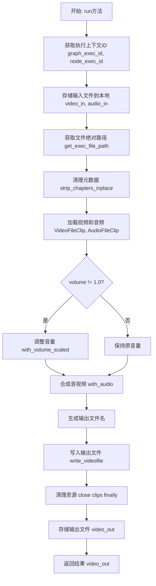
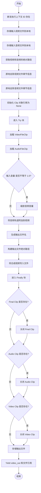

# `AutoGPT\autogpt_platform\backend\backend\blocks\video\add_audio.py` 详细设计文档

该代码实现了一个多媒体处理块，利用 MoviePy 库将外部音轨附加到现有的视频文件中，支持从 URL、数据 URI 或本地路径读取输入，允许调整音频音量，并负责处理文件的临时存储、元数据清理及最终结果的持久化输出。

## 整体流程



## 类结构

```
AddAudioToVideoBlock (Block)
├── Input (BlockSchemaInput)
│   ├── video_in (MediaFileType)
│   ├── audio_in (MediaFileType)
│   └── volume (float)
└── Output (BlockSchemaOutput)
    └── video_out (MediaFileType)
```

## 全局变量及字段


### `AddAudioToVideoBlock.Input.video_in`
    
Video input (URL, data URI, or local path).

类型：`MediaFileType`
    


### `AddAudioToVideoBlock.Input.audio_in`
    
Audio input (URL, data URI, or local path).

类型：`MediaFileType`
    


### `AddAudioToVideoBlock.Input.volume`
    
Volume scale for the newly attached audio track (1.0 = original).

类型：`float`
    


### `AddAudioToVideoBlock.Output.video_out`
    
Final video (with attached audio), as a path or data URI.

类型：`MediaFileType`
    
    

## 全局函数及方法


### `AddAudioToVideoBlock.__init__`

该方法用于初始化 `AddAudioToVideoBlock` 类的实例，配置其元数据（唯一标识符、描述、分类）以及输入输出的数据结构定义，以便注册到执行引擎中。

参数：

- `self`：`AddAudioToVideoBlock`，表示类的实例对象本身。

返回值：`None`，构造函数无返回值。

#### 流程图

```mermaid
graph TD
    A[Start: __init__] --> B[Call super().__init__]
    B --> C[Set Block ID]
    B --> D[Set Description]
    B --> E[Set Categories to MULTIMEDIA]
    B --> F[Set Input Schema to Input Class]
    B --> G[Set Output Schema to Output Class]
    C & D & E & F & G --> H[End]
```

#### 带注释源码

```python
def __init__(self):
    # 调用父类 Block 的构造函数，传递必要的元数据配置
    super().__init__(
        # 块的唯一标识符，用于在系统中区分不同的块
        id="3503748d-62b6-4425-91d6-725b064af509",
        # 块的功能描述，用于 UI 展示或文档说明
        description="Block to attach an audio file to a video file using moviepy.",
        # 将块归类为多媒体 (MULTIMEDIA) 类别
        categories={BlockCategory.MULTIMEDIA},
        # 定义输入数据的 Schema，指定输入参数的结构 (video_in, audio_in, volume)
        input_schema=AddAudioToVideoBlock.Input,
        # 定义输出数据的 Schema，指定输出参数的结构 (video_out)
        output_schema=AddAudioToVideoBlock.Output,
    )
```


### `AddAudioToVideoBlock.run`

该方法是 `AddAudioToVideoBlock` 的核心执行逻辑，主要负责接收视频和音频输入，利用 MoviePy 库处理多媒体文件，将音频轨道附加到视频文件中（支持音量调节），并将合成后的视频文件保存并返回。

参数：

- `input_data`：`Input`，包含输入视频、音频文件引用及音量设置的数据对象。
- `execution_context`：`ExecutionContext`，执行上下文对象，提供图执行ID和节点执行ID等信息，用于文件存储路径管理。
- `**kwargs`：`Any`，扩展关键字参数，用于未来兼容或传递额外上下文信息。

返回值：`BlockOutput`，异步生成器类型，产出一个包含输出键名（如 "video_out"）和合成后的视频文件引用（路径或数据URI）的元组。

#### 流程图



#### 带注释源码

```python
async def run(
    self,
    input_data: Input,
    *,
    execution_context: ExecutionContext,
    **kwargs,
) -> BlockOutput:
    # 1. 基础校验：确保执行上下文中包含必要的 ID
    assert execution_context.graph_exec_id is not None
    assert execution_context.node_exec_id is not None
    graph_exec_id = execution_context.graph_exec_id
    node_exec_id = execution_context.node_exec_id

    # 2. 文件预处理：将输入的媒体文件（URL/Data URI等）存储到本地工作目录，以便进行本地处理
    local_video_path = await store_media_file(
        file=input_data.video_in,
        execution_context=execution_context,
        return_format="for_local_processing",
    )
    local_audio_path = await store_media_file(
        file=input_data.audio_in,
        execution_context=execution_context,
        return_format="for_local_processing",
    )

    # 获取文件在本地文件系统中的绝对路径
    video_abspath = get_exec_file_path(graph_exec_id, local_video_path)
    audio_abspath = get_exec_file_path(graph_exec_id, local_audio_path)

    # 3. 媒体元数据清洗：原地去除文件中的章节信息，避免处理干扰
    strip_chapters_inplace(video_abspath)
    strip_chapters_inplace(audio_abspath)

    # 初始化剪辑对象引用，用于后续的资源清理
    video_clip = None
    audio_clip = None
    final_clip = None
    
    try:
        # 4. 加载视频和音频剪辑
        video_clip = VideoFileClip(video_abspath)
        audio_clip = AudioFileClip(audio_abspath)
        
        # 5. 音频处理：检查并应用音量缩放
        if input_data.volume != 1.0:
            audio_clip = audio_clip.with_volume_scaled(input_data.volume)

        # 6. 合成：将新的音频轨道附加到视频剪辑上
        final_clip = video_clip.with_audio(audio_clip)

        # 7. 输出准备：生成唯一的输出文件名和路径
        source = extract_source_name(local_video_path)
        output_filename = MediaFileType(f"{node_exec_id}_with_audio_{source}.mp4")
        output_abspath = get_exec_file_path(graph_exec_id, output_filename)
        
        # 8. 写入文件：使用 libx264 视频编码和 aac 音频编码渲染最终视频
        final_clip.write_videofile(
            output_abspath, codec="libx264", audio_codec="aac"
        )
    finally:
        # 9. 资源清理：确保在发生异常或正常完成后，释放 MoviePy 占用的文件句柄和内存
        if final_clip:
            final_clip.close()
        if audio_clip:
            audio_clip.close()
        if video_clip:
            video_clip.close()

    # 10. 结果存储：将生成的视频文件存储回系统，返回适用于 Block 输出的格式（如 workspace:// 或 Data URI）
    video_out = await store_media_file(
        file=output_filename,
        execution_context=execution_context,
        return_format="for_block_output",
    )

    # 11. 返回结果：产出键值对，供后续 Block 使用
    yield "video_out", video_out
```


## 关键组件


### 输入媒体存取

将输入的 MediaFileType 转换为本地文件路径以便进行处理。

### 媒体元数据剥离

在处理前从输入文件中剥离章节以避免潜在的冲突。

### 音量缩放

根据指定的系数调整附加音频轨道的音量。

### 轨道合成

将音轨合并到视频轨道上，替换任何现有的音频。

### 视频编码与持久化

将合成的视频渲染为 MP4 文件并将其存储到执行环境中。


## 问题及建议


### 已知问题

-   **阻塞异步事件循环**：`run` 方法被标记为 `async def`，但在其中调用的 `video_clip.write_videofile` 是一个同步且耗时的操作（涉及视频编码）。这会阻塞整个事件循环，导致在视频处理期间无法处理其他请求或任务，降低了系统的并发吞吐量。
-   **不必要的视频重编码**：当前的实现使用 MoviePy 的 `write_videofile` 默认行为，这通常会重新编码视频流（即便视频流的编码格式未改变）。仅仅替换音轨并不要求必须重新编码视频画面，这导致了极高的 CPU 消耗和处理时间的浪费。
-   **音频时长处理逻辑僵化**：代码直接使用 `with_audio` 附加音轨。MoviePy 的默认行为是：如果音频比视频短，剩余部分静音；如果音频比视频长，超出部分被截断。目前没有提供参数来控制这一行为（如循环音频、淡入淡出或保留原视频音轨进行混合），限制了灵活性。
-   **编解码器硬编码**：输出的视频编码（`libx264`）和音频编码（`aac`）被硬编码在代码中。如果输入视频的格式不兼容或用户希望输出其他格式（如 `webm`），该代码无法适应。

### 优化建议

-   **使用线程池执行耗时任务**：利用 `asyncio` 的 `loop.run_in_executor` 将 `write_videofile` 或其他 IO 密集型/CPU 密集型操作提交到独立的线程池中执行，从而释放主事件循环，保持系统的异步响应能力。
-   **引入流复制（Stream Copy）优化**：考虑直接使用 FFmpeg 命令行工具或其 Python 绑定（而非通过 MoviePy 的高级封装），实现 `-c:v copy` 功能。这将直接复制视频流数据而不进行重编码，仅处理音频流，可以显著降低 CPU 占用并大幅提升处理速度。
-   **增强音频处理配置**：在 `Input` 类中增加更多音频控制参数，例如 `audio_start_time`（音频开始时间）、`audio_fade_in`（淡入时长）、`audio_fade_out`（淡出时长）以及 `mix_original`（是否与原视频音轨混合），以满足更复杂的编辑需求。
-   **完善错误处理与日志**：在 `try...finally` 块中增加具体的异常捕获（如 `OSError`, `moviepy.error.IOError`），并针对不同的错误情况（如文件损坏、编码不支持）抛出更明确的异常信息，同时添加处理进度的日志记录或回调，以便监控长时间运行的任务。


## 其它


### 设计目标与约束

**设计目标：**
该模块的核心设计目标是提供一种可靠、异步的方式，将外部音频轨道与现有视频文件进行合并。它旨在处理多种输入格式（URL、Data URI、本地路径），并将结果标准化为通用的视频格式，同时支持对附加音频的音量进行线性调整。

**约束：**
1.  **编解码器限制**：输出视频被硬编码为使用 `libx264` 视频编解码器和 `aac` 音频编解码器，封装为 MP4 容器。这确保了广泛的兼容性，但限制了输出格式的灵活性。
2.  **执行环境依赖**：该代码块必须在提供有效 `ExecutionContext` 的环境中运行，具体要求 `graph_exec_id` 和 `node_exec_id` 不能为空，用于文件路径解析和隔离。
3.  **I/O 模型**：尽管核心处理逻辑是同步的，整个 `run` 方法被设计为异步，以适应基于事件循环的后端架构，但需注意 MoviePy 的写入操作是 CPU 密集型且阻塞的。
4.  **资源管理**：必须在处理完成后显式释放媒体资源（VideoFileClip, AudioFileClip），以防止内存泄漏或文件句柄占用。

### 错误处理与异常设计

1.  **资源释放机制**：
    *   使用了 `try...finally` 结构来确保无论处理过程是否成功（例如，在视频写入过程中发生错误），`video_clip`、`audio_clip` 和 `final_clip` 对象都会被调用 `.close()` 方法。这对于防止内存泄漏和文件被锁定是至关重要的。
2.  **前置断言**：
    *   使用 `assert` 语句检查 `execution_context.graph_exec_id` 和 `execution_context.node_exec_id` 是否存在。这属于防御性编程，确保在执行核心逻辑前上下文的完整性。
3.  **异常传播策略**：
    *   代码内部没有捕获 `MoviePy` 抛出的具体异常（如文件损坏、编解码器不支持、IO错误等）。这些异常会直接向上传播到调用方（通常是执行引擎）。这意味着调用方需要处理这些异常并决定是否重试或标记任务失败。

### 数据流与状态机

**数据流：**
1.  **输入阶段**：
    *   接收 `video_in` 和 `audio_in`（可以是 URL、Data URI 等）。
    *   通过 `store_media_file` 将输入数据持久化到本地执行目录，获取本地相对路径。
    *   通过 `get_exec_file_path` 将相对路径转换为绝对路径。
2.  **预处理阶段**：
    *   调用 `strip_chapters_inplace` 清除视频和音频文件中的元数据章节信息。
3.  **处理阶段**：
    *   加载视频和音频为 MoviePy 对象。
    *   如果 `volume` 参数不为 1.0，对音频对象进行音量变换。
    *   调用 `video_clip.with_audio(audio_clip)` 生成新的合成视频对象。
4.  **输出阶段**：
    *   使用 `extract_source_name` 生成输出文件名。
    *   调用 `write_videofile` 将合成视频渲染到磁盘。
    *   再次通过 `store_media_file` 将生成的本地文件注册为输出（生成 `workspace://` URI 或 Data URI）。
    *   通过生成器 `yield` 返回结果。

**状态机：**
该模块是一个无状态的处理单元，不存在内部状态转换。每次 `run` 方法的调用都是独立的，依赖于传入的 `input_data` 和 `execution_context`。

### 外部依赖与接口契约

**外部依赖：**
1.  **第三方库**：
    *   `moviepy.audio.io.AudioFileClip.AudioFileClip`：用于加载和处理音频流。
    *   `moviepy.video.io.VideoFileClip.VideoFileClip`：用于加载和处理视频流。
2.  **内部模块**：
    *   `backend.blocks.video._utils`：依赖 `extract_source_name` 生成文件名，依赖 `strip_chapters_inplace` 进行元数据清理。
    *   `backend.util.file`：依赖 `MediaFileType` 作为数据模型，`get_exec_file_path` 用于路径解析，`store_media_file` 用于文件的下载/上传和存储管理。
    *   `backend.data.*`：依赖 `Block` 基类，`BlockSchemaInput/Output` 模式，以及 `ExecutionContext` 上下文对象。

**接口契约：**
1.  **输入契约**：
    *   `Input.video_in`：必须是一个有效的媒体文件标识（URL/Data URI/Path），且必须是可被 MoviePy 识别的视频格式。
    *   `Input.audio_in`：必须是一个有效的媒体文件标识，且必须是可被 MoviePy 识别的音频格式。
    *   `Input.volume`：浮点数，1.0 代表原始音量。
2.  **输出契约**：
    *   `Output.video_out`：返回一个 `MediaFileType`，表示合并后的视频文件。该文件编码为 H.264/AAC，格式为 MP4。
3.  **执行契约**：
    *   调用方必须提供一个配置了正确 `graph_exec_id` 和 `node_exec_id` 的 `ExecutionContext`，否则将触发断言错误。

    