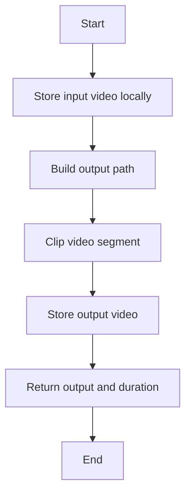
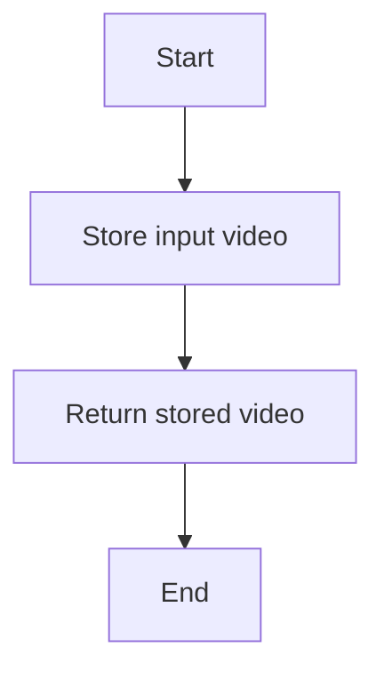
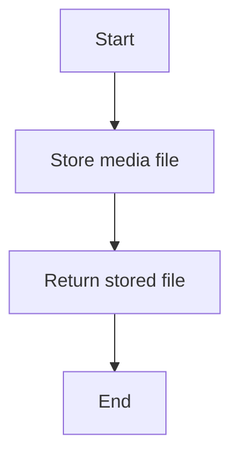
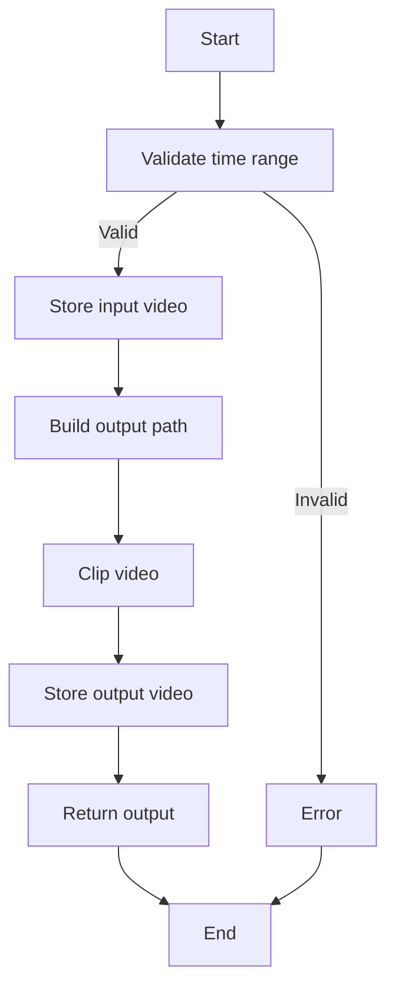
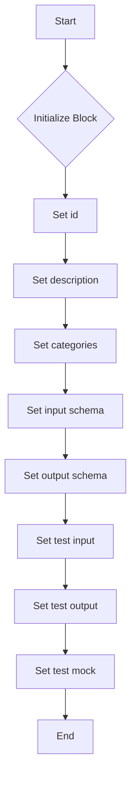

# `.\AutoGPT\autogpt_platform\backend\backend\blocks\video\clip.py` 详细设计文档

The VideoClipBlock extracts a specified time segment from a video file and stores the output in a specified format.

## 整体流程



## 类结构

```
VideoClipBlock (Concrete Block)
├── Input (BlockSchemaInput)
│   ├── video_in (MediaFileType)
│   ├── start_time (float)
│   ├── end_time (float)
│   └── output_format (Literal['mp4', 'webm', 'mkv', 'mov'])
├── Output (BlockSchemaOutput)
│   ├── video_out (MediaFileType)
│   └── duration (float)
└── _store_input_video (async method)
    ├── execution_context (ExecutionContext)
    └── file (MediaFileType)
    └── return_format (str)
    └── return (MediaFileType)
    └── _store_output_video (async method)
    ├── execution_context (ExecutionContext)
    └── file (MediaFileType)
    └── return_format (str)
    └── return (MediaFileType)
    └── _clip_video (method)
    ├── video_abspath (str)
    └── output_abspath (str)
    └── start_time (float)
    └── end_time (float)
    └── return (float)
    └── run (async method)
    ├── input_data (Input)
    └── execution_context (ExecutionContext)
    └── node_exec_id (str)
    └── **kwargs
    └── return (BlockOutput)
```

## 全局变量及字段


### `id`
    
Unique identifier for the block

类型：`str`
    


### `description`
    
Description of the block's functionality

类型：`str`
    


### `categories`
    
Set of categories the block belongs to

类型：`set`
    


### `input_schema`
    
Schema for the block's input data

类型：`BlockSchemaInput`
    


### `output_schema`
    
Schema for the block's output data

类型：`BlockSchemaOutput`
    


### `test_input`
    
Test input data for the block

类型：`dict`
    


### `test_output`
    
Test output data for the block

类型：`list`
    


### `test_mock`
    
Mock functions for testing the block

类型：`dict`
    


### `Input.video_in`
    
Input video (URL, data URI, or local path)

类型：`MediaFileType`
    


### `Input.start_time`
    
Start time in seconds

类型：`float`
    


### `Input.end_time`
    
End time in seconds

类型：`float`
    


### `Input.output_format`
    
Output format

类型：`Literal['mp4', 'webm', 'mkv', 'mov']`
    


### `Output.video_out`
    
Clipped video file (path or data URI)

类型：`MediaFileType`
    


### `Output.duration`
    
Clip duration in seconds

类型：`float`
    
    

## 全局函数及方法


### `_store_input_video`

Store input video. Extracted for testability.

参数：

- `execution_context`：`ExecutionContext`，The execution context of the block.
- `file`：`MediaFileType`，Input video (URL, data URI, or local path)

返回值：`MediaFileType`，Clipped video file (path or data URI)

#### 流程图



#### 带注释源码

```python
async def _store_input_video(
    self, execution_context: ExecutionContext, file: MediaFileType
) -> MediaFileType:
    """Store input video. Extracted for testability."""
    return await store_media_file(
        file=file,
        execution_context=execution_context,
        return_format="for_local_processing",
    )
```


### `_store_output_video`

Store output video. Extracted for testability.

参数：

- `execution_context`：`ExecutionContext`，The execution context of the block.
- `file`：`MediaFileType`，The file to be stored.

返回值：`MediaFileType`，The path or data URI of the stored file.

#### 流程图



#### 带注释源码

```python
async def _store_output_video(
    self, execution_context: ExecutionContext, file: MediaFileType
) -> MediaFileType:
    """Store output video. Extracted for testability."""
    return await store_media_file(
        file=file,
        execution_context=execution_context,
        return_format="for_block_output",
    )
```


### `_clip_video`

Extract a clip from a video file.

参数：

- `video_abspath`：`str`，The absolute path to the input video file.
- `output_abspath`：`str`，The absolute path to the output video file.
- `start_time`：`float`，The start time of the clip in seconds.
- `end_time`：`float`，The end time of the clip in seconds.

返回值：`float`，The duration of the clip in seconds.

#### 流程图

```mermaid
graph TD
    A[Start] --> B[strip_chapters_inplace(video_abspath)]
    B --> C[Create VideoFileClip(video_abspath)]
    C --> D[Create subclip(clip, start_time, end_time)]
    D --> E[Get video_codec and audio_codec]
    E --> F[Write subclip to output_abspath with codecs]
    F --> G[Return subclip.duration]
    G --> H[Close subclip]
    H --> I[Close clip]
    I --> J[End]
```

#### 带注释源码

```python
def _clip_video(
    self,
    video_abspath: str,
    output_abspath: str,
    start_time: float,
    end_time: float,
) -> float:
    """Extract a clip from a video. Extracted for testability."""
    clip = None
    subclip = None
    try:
        strip_chapters_inplace(video_abspath)
        clip = VideoFileClip(video_abspath)
        subclip = clip.subclipped(start_time, end_time)
        video_codec, audio_codec = get_video_codecs(output_abspath)
        subclip.write_videofile(
            output_abspath, codec=video_codec, audio_codec=audio_codec
        )
        return subclip.duration
    finally:
        if subclip:
            subclip.close()
        if clip:
            clip.close()
``` 


### `VideoClipBlock.run`

Extracts a time segment from a video and stores the output.

参数：

- `input_data`：`Input`，The input data for the block, containing video input, start time, end time, and output format.
- `execution_context`：`ExecutionContext`，The execution context for the block.
- `node_exec_id`：`str`，The execution ID of the node.
- `**kwargs`：`dict`，Additional keyword arguments.

返回值：`BlockOutput`，The output of the block, containing the path to the clipped video and its duration.

#### 流程图



#### 带注释源码

```python
async def run(
    self,
    input_data: Input,
    *,
    execution_context: ExecutionContext,
    node_exec_id: str,
    **kwargs,
) -> BlockOutput:
    # Validate time range
    if input_data.end_time <= input_data.start_time:
        raise BlockExecutionError(
            message=f"end_time ({input_data.end_time}) must be greater than start_time ({input_data.start_time})",
            block_name=self.name,
            block_id=str(self.id),
        )

    try:
        assert execution_context.graph_exec_id is not None

        # Store the input video locally
        local_video_path = await self._store_input_video(
            execution_context, input_data.video_in
        )
        video_abspath = get_exec_file_path(
            execution_context.graph_exec_id, local_video_path
        )

        # Build output path
        source = extract_source_name(local_video_path)
        output_filename = MediaFileType(
            f"{node_exec_id}_clip_{source}.{input_data.output_format}"
        )
        output_abspath = get_exec_file_path(
            execution_context.graph_exec_id, output_filename
        )

        duration = self._clip_video(
            video_abspath,
            output_abspath,
            input_data.start_time,
            input_data.end_time,
        )

        # Return as workspace path or data URI based on context
        video_out = await self._store_output_video(
            execution_context, output_filename
        )

        yield "video_out", video_out
        yield "duration", duration

    except BlockExecutionError:
        raise
    except Exception as e:
        raise BlockExecutionError(
            message=f"Failed to clip video: {e}",
            block_name=self.name,
            block_id=str(self.id),
        ) from e
```


### VideoClipBlock.__init__

This method initializes the `VideoClipBlock` class, setting up its properties and configurations.

参数：

- `self`：`VideoClipBlock` 类的实例，用于访问类的属性和方法。

返回值：无

#### 流程图



#### 带注释源码

```python
def __init__(self):
    super().__init__(
        id="8f539119-e580-4d86-ad41-86fbcb22abb1",
        description="Extract a time segment from a video",
        categories={BlockCategory.MULTIMEDIA},
        input_schema=self.Input,
        output_schema=self.Output,
        test_input={
            "video_in": "/tmp/test.mp4",
            "start_time": 0.0,
            "end_time": 10.0,
        },
        test_output=[("video_out", str), ("duration", float)],
        test_mock={
            "_clip_video": lambda *args: 10.0,
            "_store_input_video": lambda *args, **kwargs: "test.mp4",
            "_store_output_video": lambda *args, **kwargs: "clip_test.mp4",
        },
    )
```


### VideoClipBlock._store_input_video

Store input video. Extracted for testability.

参数：

- `execution_context`：`ExecutionContext`，The execution context of the block.
- `file`：`MediaFileType`，Input video (URL, data URI, or local path).

返回值：`MediaFileType`，Clipped video file (path or data URI)

#### 流程图


#### 带注释源码

```python
async def _store_input_video(
    self, execution_context: ExecutionContext, file: MediaFileType
) -> MediaFileType:
    """Store input video. Extracted for testability."""
    return await store_media_file(
        file=file,
        execution_context=execution_context,
        return_format="for_local_processing",
    )
```


### VideoClipBlock._store_output_video

Store output video. Extracted for testability.

参数：

- `execution_context`：`ExecutionContext`，The execution context of the block.
- `file`：`MediaFileType`，The file to be stored.

返回值：`MediaFileType`，The stored file.

#### 流程图


#### 带注释源码

```python
async def _store_output_video(
    self, execution_context: ExecutionContext, file: MediaFileType
) -> MediaFileType:
    """Store output video. Extracted for testability."""
    return await store_media_file(
        file=file,
        execution_context=execution_context,
        return_format="for_block_output",
    )
```


### VideoClipBlock._clip_video

Extract a clip from a video file.

参数：

- `video_abspath`：`str`，The absolute path to the input video file.
- `output_abspath`：`str`，The absolute path to the output video file.
- `start_time`：`float`，The start time of the clip in seconds.
- `end_time`：`float`，The end time of the clip in seconds.

返回值：`float`，The duration of the clip in seconds.

#### 流程图

```mermaid
graph TD
    A[Start] --> B[strip_chapters_inplace(video_abspath)]
    B --> C[Create VideoFileClip(video_abspath)]
    C --> D[Create subclip(clip, start_time, end_time)]
    D --> E[Get video_codec and audio_codec]
    E --> F[Write subclip to output_abspath with codecs]
    F --> G[Return subclip.duration]
    G --> H[Close subclip]
    H --> I[Close clip]
    I --> J[End]
```

#### 带注释源码

```python
def _clip_video(
    self,
    video_abspath: str,
    output_abspath: str,
    start_time: float,
    end_time: float,
) -> float:
    """Extract a clip from a video. Extracted for testability."""
    clip = None
    subclip = None
    try:
        strip_chapters_inplace(video_abspath)
        clip = VideoFileClip(video_abspath)
        subclip = clip.subclipped(start_time, end_time)
        video_codec, audio_codec = get_video_codecs(output_abspath)
        subclip.write_videofile(
            output_abspath, codec=video_codec, audio_codec=audio_codec
        )
        return subclip.duration
    finally:
        if subclip:
            subclip.close()
        if clip:
            clip.close()
``` 


### VideoClipBlock.run

Extracts a time segment from a video and stores the output.

参数：

- `input_data`：`Input`，The input data for the block, containing the video input, start time, end time, and output format.
- `execution_context`：`ExecutionContext`，The execution context for the block.
- `node_exec_id`：`str`，The execution ID of the node.
- `**kwargs`：`dict`，Additional keyword arguments.

返回值：`BlockOutput`，The output of the block, containing the video output and duration.

#### 流程图


#### 带注释源码

```python
async def run(
    self,
    input_data: Input,
    *,
    execution_context: ExecutionContext,
    node_exec_id: str,
    **kwargs,
) -> BlockOutput:
    # Validate time range
    if input_data.end_time <= input_data.start_time:
        raise BlockExecutionError(
            message=f"end_time ({input_data.end_time}) must be greater than start_time ({input_data.start_time})",
            block_name=self.name,
            block_id=str(self.id),
        )

    try:
        assert execution_context.graph_exec_id is not None

        # Store the input video locally
        local_video_path = await self._store_input_video(
            execution_context, input_data.video_in
        )
        video_abspath = get_exec_file_path(
            execution_context.graph_exec_id, local_video_path
        )

        # Build output path
        source = extract_source_name(local_video_path)
        output_filename = MediaFileType(
            f"{node_exec_id}_clip_{source}.{input_data.output_format}"
        )
        output_abspath = get_exec_file_path(
            execution_context.graph_exec_id, output_filename
        )

        duration = self._clip_video(
            video_abspath,
            output_abspath,
            input_data.start_time,
            input_data.end_time,
        )

        # Return as workspace path or data URI based on context
        video_out = await self._store_output_video(
            execution_context, output_filename
        )

        yield "video_out", video_out
        yield "duration", duration

    except BlockExecutionError:
        raise
    except Exception as e:
        raise BlockExecutionError(
            message=f"Failed to clip video: {e}",
            block_name=self.name,
            block_id=str(self.id),
        ) from e
```


## 关键组件


### 张量索引与惰性加载

张量索引与惰性加载是视频剪辑块的关键组件，它允许在处理视频时仅加载所需的部分，从而提高效率。

### 反量化支持

反量化支持是视频剪辑块的关键组件，它允许在量化过程中恢复原始数据，确保视频质量。

### 量化策略

量化策略是视频剪辑块的关键组件，它定义了如何将视频数据转换为更高效的数据表示，以减少存储和传输需求。


## 问题及建议


### 已知问题

-   **异常处理范围**: 代码中只捕获了`BlockExecutionError`和通用的`Exception`，但没有针对特定异常（如文件不存在、权限问题等）进行捕获和处理，可能导致错误信息不够具体。
-   **资源管理**: 在`_clip_video`方法中，虽然尝试关闭了`subclip`和`clip`对象，但没有显式检查这些对象是否成功关闭，可能存在资源未正确释放的情况。
-   **测试覆盖**: 代码中提供了测试输入和测试mock，但没有提供完整的单元测试或集成测试来覆盖所有可能的执行路径和异常情况。
-   **代码复用**: `_store_input_video`和`_store_output_video`方法在`run`方法中被调用，但它们的功能相对简单，可以考虑将其合并或提取到更通用的工具类中以提高代码复用性。

### 优化建议

-   **细化异常处理**: 增加对特定异常类型的捕获和处理，例如`FileNotFoundError`、`PermissionError`等，并提供更具体的错误信息。
-   **改进资源管理**: 在资源管理方面，可以使用上下文管理器或确保在`finally`块中正确关闭所有资源。
-   **增强测试覆盖**: 实施更全面的测试策略，包括单元测试、集成测试和端到端测试，以确保代码在各种情况下都能正常工作。
-   **提高代码复用性**: 将重复的代码片段提取到工具类或函数中，减少代码冗余，并提高代码的可维护性。
-   **性能优化**: 考虑到视频处理可能是一个资源密集型的操作，可以探索使用异步I/O或并行处理来提高性能。
-   **文档和注释**: 增加代码的文档和注释，特别是对于复杂的逻辑和重要的函数，以提高代码的可读性和可维护性。


## 其它


### 设计目标与约束

- 设计目标：
  - 提供一个模块化的视频剪辑功能，可以从视频文件中提取指定的时间段。
  - 确保视频剪辑过程高效且易于集成到更大的系统中。
  - 支持多种视频输出格式。
- 约束：
  - 必须使用提供的 `moviepy` 库进行视频处理。
  - 输入视频必须符合 `MediaFileType` 的规范。
  - 输出视频格式必须为 `mp4`, `webm`, `mkv`, `mov` 之一。

### 错误处理与异常设计

- 错误处理：
  - 如果输入的时间范围无效（`end_time` 不大于 `start_time`），抛出 `BlockExecutionError`。
  - 如果视频剪辑过程中发生异常，捕获异常并抛出 `BlockExecutionError`，包含错误信息和相关上下文。
- 异常设计：
  - 定义自定义异常 `BlockExecutionError`，用于处理与块执行相关的错误。

### 数据流与状态机

- 数据流：
  - 输入数据通过 `run` 方法接收，包括视频输入路径、开始时间和结束时间。
  - 输入视频存储在本地，并生成输出视频。
  - 输出视频存储在指定位置，并返回给调用者。
- 状态机：
  - 无需状态机，因为视频剪辑过程是线性的，没有复杂的状态转换。

### 外部依赖与接口契约

- 外部依赖：
  - `moviepy` 库：用于视频剪辑。
  - `backend` 模块：用于数据模型和执行上下文。
- 接口契约：
  - `Block` 类：定义了块的接口，包括输入、输出和执行方法。
  - `MediaFileType`：定义了媒体文件类型的规范。
  - `ExecutionContext`：提供了执行上下文信息。


    