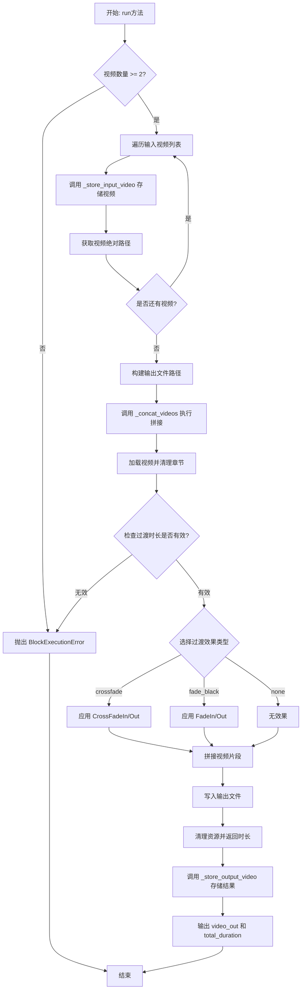
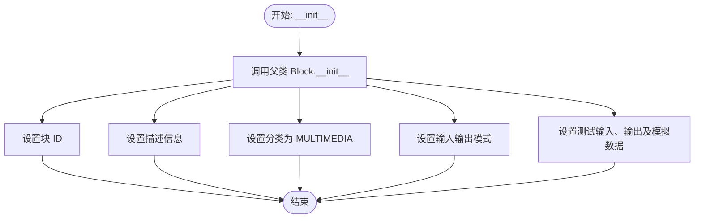
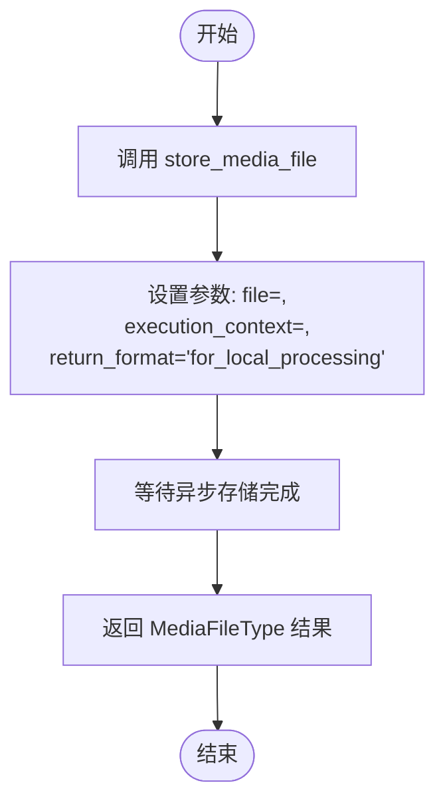
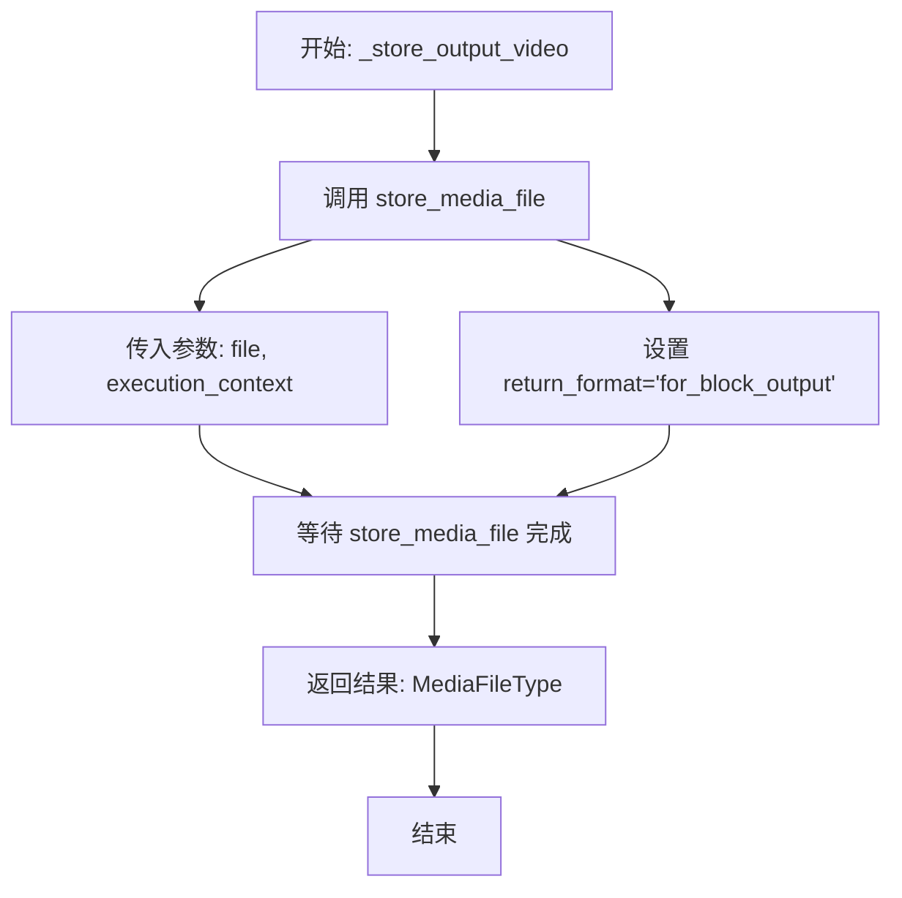
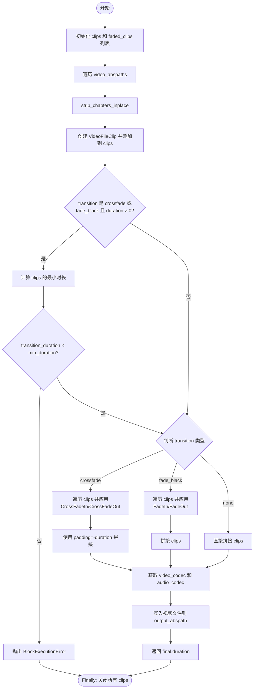
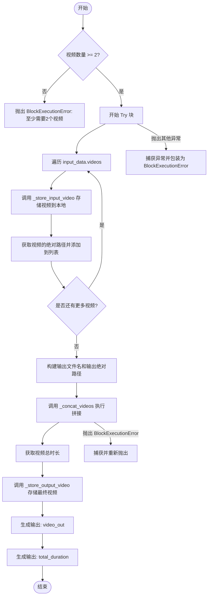

# `AutoGPT\autogpt_platform\backend\backend\blocks\video\concat.py` 详细设计文档

该代码定义了一个 VideoConcatBlock 类，用于将多个视频片段根据指定的过渡效果（无、交叉淡化、黑场过渡）拼接成一个连续的视频文件，并返回处理后的视频路径及其总时长。

## 整体流程



## 类结构

```
Block (外部基类)
└── VideoConcatBlock
    ├── Input (Schema)
    │   ├── videos
    │   ├── transition
    │   ├── transition_duration
    │   └── output_format
    └── Output (Schema)
        ├── video_out
        └── total_duration
```

## 全局变量及字段


### `VideoConcatBlock.Input.videos`
    
List of video files to concatenate (in order)

类型：`list[MediaFileType]`
    


### `VideoConcatBlock.Input.transition`
    
Transition between clips

类型：`Literal["none", "crossfade", "fade_black"]`
    


### `VideoConcatBlock.Input.transition_duration`
    
Transition duration in seconds

类型：`int`
    


### `VideoConcatBlock.Input.output_format`
    
Output format

类型：`Literal["mp4", "webm", "mkv", "mov"]`
    


### `VideoConcatBlock.Output.video_out`
    
Concatenated video file (path or data URI)

类型：`MediaFileType`
    


### `VideoConcatBlock.Output.total_duration`
    
Total duration in seconds

类型：`float`
    
    

## 全局函数及方法


### `VideoConcatBlock.__init__`

初始化视频拼接块，配置块的唯一标识符、描述、分类、输入输出模式以及测试参数。

参数：

- `self`：`VideoConcatBlock`，类实例本身。

返回值：`None`，构造函数无返回值。

#### 流程图



#### 带注释源码

```python
def __init__(self):
    # 调用父类 Block 的初始化方法，配置块的基本元数据和运行时行为
    super().__init__(
        # 块的唯一标识符 (UUID)
        id="9b0f531a-1118-487f-aeec-3fa63ea8900a",
        # 块的功能描述
        description="Merge multiple video clips into one continuous video",
        # 将块归类为多媒体类别
        categories={BlockCategory.MULTIMEDIA},
        # 定义输入数据的结构规范 (内部类 Input)
        input_schema=self.Input,
        # 定义输出数据的结构规范 (内部类 Output)
        output_schema=self.Output,
        # 定义测试用例的输入数据
        test_input={
            "videos": ["/tmp/a.mp4", "/tmp/b.mp4"],
        },
        # 定义测试用例的期望输出数据类型
        test_output=[
            ("video_out", str),
            ("total_duration", float),
        ],
        # 定义用于单元测试的模拟方法，避免实际执行视频处理
        test_mock={
            "_concat_videos": lambda *args: 20.0,
            "_store_input_video": lambda *args, **kwargs: "test.mp4",
            "_store_output_video": lambda *args, **kwargs: "concat_test.mp4",
        },
    )
```


### `VideoConcatBlock._store_input_video`

存储输入视频。提取此方法以提高可测试性。

参数：

- `execution_context`: `ExecutionContext`, 执行上下文对象，用于传递运行时信息和环境配置。
- `file`: `MediaFileType`, 待存储的输入视频文件对象。

返回值：`MediaFileType`, 存储后的媒体文件（通常为本地处理路径）。

#### 流程图



#### 带注释源码

```python
    async def _store_input_video(
        self, execution_context: ExecutionContext, file: MediaFileType
    ) -> MediaFileType:
        """Store input video. Extracted for testability."""
        # 调用工具函数存储媒体文件
        # return_format 设置为 "for_local_processing" 表示返回适合本地处理的路径格式
        return await store_media_file(
            file=file,
            execution_context=execution_context,
            return_format="for_local_processing",
        )
```


### `VideoConcatBlock._store_output_video`

使用执行上下文存储输出视频文件，并返回适合作为块输出使用的格式。

参数：

-  `execution_context`：`ExecutionContext`，执行上下文，包含执行相关的状态信息。
-  `file`：`MediaFileType`，待存储的输出视频文件。

返回值：`MediaFileType`，存储后的视频文件（路径或数据 URI）。

#### 流程图



#### 带注释源码

```python
    async def _store_output_video(
        self, execution_context: ExecutionContext, file: MediaFileType
    ) -> MediaFileType:
        """Store output video. Extracted for testability."""
        # 调用 store_media_file 工具函数处理文件存储
        # return_format 设置为 "for_block_output"，确保返回格式符合输出块的预期（通常是路径或数据 URI）
        return await store_media_file(
            file=file,
            execution_context=execution_context,
            return_format="for_block_output",
        )
```


### `VideoConcatBlock._concat_videos`

该方法负责将多个视频文件基于指定的过渡效果（如无效果、交叉淡化或黑场淡化）拼接为单一视频文件，并计算最终视频的总时长。它处理视频的加载、特效应用、拼接合并、文件写入以及资源的释放。

参数：

- `video_abspaths`：`list[str]`，待拼接的视频文件的绝对路径列表。
- `output_abspath`：`str`，输出视频文件的存储绝对路径。
- `transition`：`str`，视频片段之间的过渡效果类型，可选值为 "none"、"crossfade" 或 "fade_black"。
- `transition_duration`：`int`，过渡效果的持续时间（以秒为单位）。

返回值：`float`，拼接完成后视频的总时长（秒）。

#### 流程图



#### 带注释源码

```python
def _concat_videos(
    self,
    video_abspaths: list[str],
    output_abspath: str,
    transition: str,
    transition_duration: int,
) -> float:
    """Concatenate videos. Extracted for testability.

    Returns:
        Total duration of the concatenated video.
    """
    clips = []
    faded_clips = []
    final = None
    try:
        # 1. 加载视频剪辑
        for v in video_abspaths:
            # 移除视频中的章节信息，避免处理干扰
            strip_chapters_inplace(v)
            # 使用 MoviePy 加载视频文件
            clips.append(VideoFileClip(v))

        # 2. 验证过渡时长设置
        # 如果设置了过渡效果且时长大于0，需要检查最短视频长度
        if transition in {"crossfade", "fade_black"} and transition_duration > 0:
            min_duration = min(c.duration for c in clips)
            # 过渡时长不能超过最短视频的时长
            if transition_duration >= min_duration:
                raise BlockExecutionError(
                    message=(
                        f"transition_duration ({transition_duration}s) must be "
                        f"shorter than the shortest clip ({min_duration:.2f}s)"
                    ),
                    block_name=self.name,
                    block_id=str(self.id),
                )

        # 3. 根据过渡类型应用特效并拼接
        if transition == "crossfade":
            # 交叉淡入淡出处理
            for i, clip in enumerate(clips):
                effects = []
                # 第一个片段之后的应用淡入
                if i > 0:
                    effects.append(CrossFadeIn(transition_duration))
                # 最后一个片段之前的应用淡出
                if i < len(clips) - 1:
                    effects.append(CrossFadeOut(transition_duration))
                if effects:
                    clip = clip.with_effects(effects)
                faded_clips.append(clip)
            # 使用 compose 方法拼接，padding 为负数以实现重叠交叉
            final = concatenate_videoclips(
                faded_clips,
                method="compose",
                padding=-transition_duration,
            )
        elif transition == "fade_black":
            # 淡入淡出黑场处理
            for clip in clips:
                # 每个片段都应用淡入和淡出
                faded = clip.with_effects(
                    [FadeIn(transition_duration), FadeOut(transition_duration)]
                )
                faded_clips.append(faded)
            # 普通拼接，片段之间会有黑场过渡
            final = concatenate_videoclips(faded_clips)
        else:
            # 无过渡效果，直接拼接
            final = concatenate_videoclips(clips)

        # 4. 获取编码器并写入文件
        video_codec, audio_codec = get_video_codecs(output_abspath)
        final.write_videofile(
            output_abspath, codec=video_codec, audio_codec=audio_codec
        )

        return final.duration
    finally:
        # 5. 资源清理：关闭所有视频对象以释放文件句柄和内存
        if final:
            final.close()
        for clip in faded_clips:
            clip.close()
        for clip in clips:
            clip.close()
```


### `VideoConcatBlock.run`

该方法是视频拼接块的核心执行逻辑，负责验证输入、将视频文件存储到本地、调用底层的拼接处理函数、存储最终结果，并将输出生成为生成器流。

参数：

- `input_data`：`Input`，包含待拼接的视频列表、转场类型、转场时长以及输出格式的输入数据对象。
- `execution_context`：`ExecutionContext`，执行上下文对象，用于提供图执行ID等环境信息以便进行文件存取。
- `node_exec_id`：`str`，当前节点执行的唯一标识符，用于构建输出文件的文件名。
- `**kwargs`：`dict`，扩展的关键字参数，用于兼容未来可能的参数传递。

返回值：`BlockOutput`，一个异步生成器，产生包含输出字段名称和对应值的元组（如 `("video_out", ...)` 和 `("total_duration", ...)`）。

#### 流程图



#### 带注释源码

```python
async def run(
    self,
    input_data: Input,
    *,
    execution_context: ExecutionContext,
    node_exec_id: str,
    **kwargs,
) -> BlockOutput:
    # 校验输入：至少需要两个视频才能进行拼接
    if len(input_data.videos) < 2:
        raise BlockExecutionError(
            message="At least 2 videos are required for concatenation",
            block_name=self.name,
            block_id=str(self.id),
        )

    try:
        # 确保执行上下文中存在 graph_exec_id，用于文件路径管理
        assert execution_context.graph_exec_id is not None

        # 将所有输入视频存储到本地文件系统，并收集其绝对路径
        video_abspaths = []
        for video in input_data.videos:
            # 调用辅助方法存储单个视频文件，返回本地存储的路径标识
            local_path = await self._store_input_video(execution_context, video)
            # 根据图执行ID和本地路径构建完整的绝对路径
            video_abspaths.append(
                get_exec_file_path(execution_context.graph_exec_id, local_path)
            )

        # 准备输出文件的文件名和路径
        # 尝试从第一个视频提取源名称，如果没有则使用默认名 "video"
        source = (
            extract_source_name(video_abspaths[0]) if video_abspaths else "video"
        )
        # 构建文件名格式: {node_exec_id}_concat_{source}.{format}
        output_filename = MediaFileType(
            f"{node_exec_id}_concat_{source}.{input_data.output_format}"
        )
        # 获取输出文件的绝对存储路径
        output_abspath = get_exec_file_path(
            execution_context.graph_exec_id, output_filename
        )

        # 调用核心拼接方法处理视频文件，并返回总时长
        total_duration = self._concat_videos(
            video_abspaths,
            output_abspath,
            input_data.transition,
            input_data.transition_duration,
        )

        # 将处理好的输出视频存储起来（转换为 workspace 路径或 data URI）
        video_out = await self._store_output_video(
            execution_context, output_filename
        )

        # 生成输出结果，按照 BlockSchemaOutput 定义的字段名返回
        yield "video_out", video_out
        yield "total_duration", total_duration

    except BlockExecutionError:
        # 如果是已知的 BlockExecutionError，直接向上抛出
        raise
    except Exception as e:
        # 捕获其他未知异常，包装为 BlockExecutionError 以便上层统一处理
        raise BlockExecutionError(
            message=f"Failed to concatenate videos: {e}",
            block_name=self.name,
            block_id=str(self.id),
        ) from e
```


## 关键组件


### 视频拼接引擎

利用 `moviepy` 库根据指定的过渡类型将多个视频片段合并为单个连续视频的核心功能，包括方法选择和参数调整。

### 过渡效果策略

基于 `transition` 参数（无、叠化、黑场淡入淡出）有条件地应用视觉效果（淡入/淡出/叠化）到视频片段并相应调整拼接时间线（如叠化时的负填充）的逻辑。

### 媒体文件存储与上下文管理

处理输入/输出文件持久化的组件，负责将抽象的 `MediaFileType` 对象转换为执行上下文中的本地文件路径，并管理最终输出文件的存储格式与返回。

### 资源清理机制

在 `_concat_videos` 方法中实现的资源生命周期管理，通过 `try-finally` 结构确保所有加载的视频片段对象（`VideoFileClip`）在处理完成后被正确关闭，以防止内存泄漏或文件句柄占用。


## 问题及建议


### 已知问题

-   **阻塞异步事件循环**: `_concat_videos` 方法包含同步的 CPU 密集型操作（视频加载、特效处理、编码写入），在异步的 `run` 方法中直接调用会阻塞 Event Loop，严重降低系统的并发处理能力。
-   **内存溢出 (OOM) 风险**: 使用 `moviepy` 加载视频（`VideoFileClip`）时，往往会将大量视频数据读入内存或创建大量临时文件。当处理大分辨率、长时间或多路视频时，极易导致服务器内存耗尽而崩溃。
-   **"fade_black" 过渡效果逻辑缺陷**: 在 `fade_black` 模式下，代码仅对片段首尾分别应用 `FadeOut` 和 `FadeIn` 并直接拼接。由于没有时间间隙或中间黑场片段，视觉上这等同于一次硬切，无法实现预期的“先淡出至黑场，再从黑场淡入”的效果。
-   **类型定义缺乏灵活性**: `transition_duration` 被严格定义为 `int`（秒），但在视频剪辑场景中，精确的过渡通常需要毫秒级（浮点数）支持，当前定义限制了过渡效果的精细度。

### 优化建议

-   **采用 FFmpeg 底层拼接策略**: 强烈建议放弃使用 `moviepy` 进行全解码再编码，转而直接调用 FFmpeg 的 `concat` demuxer 协议。这种方式无需重新编码即可拼接视频（若编码一致），处理速度可提升数倍，且内存占用极低（流式处理）。
-   **使用线程池隔离计算密集型任务**: 若必须保留 `moviepy`，应使用 `asyncio.to_thread` 或 `loop.run_in_executor` 将 `_concat_videos` 的执行调度到独立的线程池中，避免阻塞主线程的异步 I/O 循环。
-   **改进 "fade_black" 逻辑实现**: 建议在两个视频片段之间插入一个全黑的 `ColorClip`，确保前一个视频淡出到黑场后，经过短暂的黑场停顿，再让后一个视频从黑场淡入。
-   **增加进度监控机制**: 视频合成通常是长耗时操作，建议利用 `write_videofile` 提供的回调参数或日志钩子，向外部输出实时的处理进度（百分比），提升用户体验和系统可观测性。
-   **优化参数类型定义**: 将 `transition_duration` 的类型从 `int` 修改为 `float`，以支持更精细的过渡时间控制。


## 其它


### 设计目标与约束

**设计目标：**
1.  **多视频合并**：核心目标是将多个视频片段按顺序无缝合并为一个单一视频文件。
2.  **过渡效果支持**：提供无过渡、交叉淡化和黑场淡入淡出三种模式，增强视频编辑的灵活性。
3.  **资源管理**：确保在视频处理过程中合理利用内存，并在操作完成后及时释放资源。
4.  **格式兼容性**：支持常见的视频输出格式（mp4, webm, mkv, mov），并根据文件扩展名自动选择合适的编码器。

**约束条件：**
1.  **输入数量限制**：输入视频列表必须包含至少 2 个视频文件，否则无法执行合并操作。
2.  **时长约束**：当启用“交叉淡化”或“黑场淡入淡出”时，过渡时长必须短于所有输入视频中时长最短的那个片段，否则会抛出异常。
3.  **计算资源依赖**：依赖于 `moviepy` 库进行视频解码与渲染，这是一个 CPU 密集型操作，且需要足够的磁盘空间用于存储中间及输出文件。
4.  **同步与异步混合**：文件存储（IO 操作）为异步执行以避免阻塞，而视频合成（计算密集型）为同步执行，需注意事件循环的阻塞风险。

### 错误处理与异常设计

**异常处理策略：**
1.  **输入验证**：
    *   在 `run` 方法入口处检查 `videos` 列表长度，若小于 2 则立即抛出 `BlockExecutionError`，明确提示需要至少 2 个视频。
    *   在 `_concat_videos` 方法中，计算所有视频的最小时长，若 `transition_duration` 大于等于最短视频时长，抛出 `BlockExecutionError` 防止渲染失败。
2.  **执行异常捕获**：
    *   在 `run` 方法的主逻辑中使用 `try-except` 块捕获通用异常。捕获到的非业务异常（如文件 IO 错误、MoviePy 内部错误）会被包装成 `BlockExecutionError`，并附带 `block_name` 和 `block_id`，以便上层追踪错误来源。
3.  **资源清理保证**：
    *   在 `_concat_videos` 方法中使用 `try-finally` 结构确保即使视频写入过程中发生崩溃，所有加载的 `VideoFileClip` 对象及其生成的特效对象（`faded_clips`, `final`）都会被正确关闭，防止内存泄漏或文件句柄占用。

### 数据流与状态机

**数据流：**
1.  **输入阶段**：接收 `Input` Schema 数据（原始视频文件列表、过渡类型、时长、格式）。
2.  **预处理与持久化**：通过 `_store_input_video` 将远程或上传的媒体文件异步存储至本地执行目录，获取绝对路径列表。
3.  **处理阶段**：
    *   加载本地视频文件为 Clip 对象。
    *   根据参数应用淡入淡出特效。
    *   调用 `concatenate_videoclips` 进行合成。
    *   调用 `write_videofile` 将合成结果写入磁盘指定路径。
4.  **后处理与输出**：通过 `_store_output_video` 将生成的视频文件按照输出要求（工作区路径或 Data URI）进行存储或转换，并计算总时长。
5.  **产出阶段**：通过生成器返回 `video_out` 和 `total_duration`。

**状态机：**
本模块主要为函数式处理流，无复杂的内部状态机，其执行状态流转如下：
*   `Idle` (初始状态) -> `Validating` (检查输入) -> `Storing` (下载输入文件) -> `Processing` (MoviePy 渲染) -> `Finalizing` (存储结果) -> `Completed` (返回结果) / `Failed` (抛出异常)。

### 外部依赖与接口契约

**外部依赖：**
1.  **MoviePy**：核心视频处理库。
    *   `moviepy.concatenate_videoclips`：用于视频拼接。
    *   `moviepy.video.fx`：`CrossFadeIn`, `CrossFadeOut`, `FadeIn`, `FadeOut` 用于实现转场特效。
    *   `moviepy.video.io.VideoFileClip`：用于读取视频文件。
2.  **内部框架模块**：
    *   `backend.data.block`：提供基类 `Block` 和 Schema 定义。
    *   `backend.util.file`：提供文件存储 (`store_media_file`) 和路径解析 (`get_exec_file_path`) 工具。
    *   `backend.blocks.video._utils`：提供章节移除 (`strip_chapters_inplace`) 和编码器获取 (`get_video_codecs`) 工具。

**接口契约：**
*   **输入契约**：
    *   `videos`：`list[MediaFileType]`，必须包含有效的文件路径或 URI，且长度 >= 2。
    *   `transition`：字符串枚举，必须是 "none", "crossfade", "fade_black" 之一。
    *   `transition_duration`：整数，必须 >= 0。
    *   `output_format`：字符串枚举，必须是 "mp4", "webm", "mkv", "mov" 之一。
*   **输出契约**：
    *   `video_out`：`MediaFileType`，返回处理后可供访问的视频路径或 URI。
    *   `total_duration`：`float`，返回合并后视频的总秒数。
    *   抛出 `BlockExecutionError` 约定：当业务逻辑验证失败或底层执行出错时，必须抛出此特定异常类型。

### 并发与性能考量

**并发模型：**
*   该块的 `run` 方法是 `async` 异步的，主要为了支持非阻塞的文件 IO 操作（`store_media_file`）。
*   视频拼接的核心逻辑 `_concat_videos` 是同步的。由于 MoviePy 大量调用底层 C 库（如 FFMPEG）并涉及 CPU 密集型计算和磁盘 IO，这部分运行时会阻塞事件循环。在高并发场景下，这可能会成为性能瓶颈，建议将此类计算密集型任务移至独立的线程池或进程中执行，以避免阻塞整个应用的事件循环。

**性能优化点：**
*   文件加载后立即调用 `strip_chapters_inplace` 清除章节元数据，避免潜在的处理冲突。
*   所有的 Clip 对象在 `finally` 块中显式关闭，虽然 Python 有 GC 机制，但对于大型视频文件，显式释放内存能更有效地防止 OOM（内存溢出）。

    