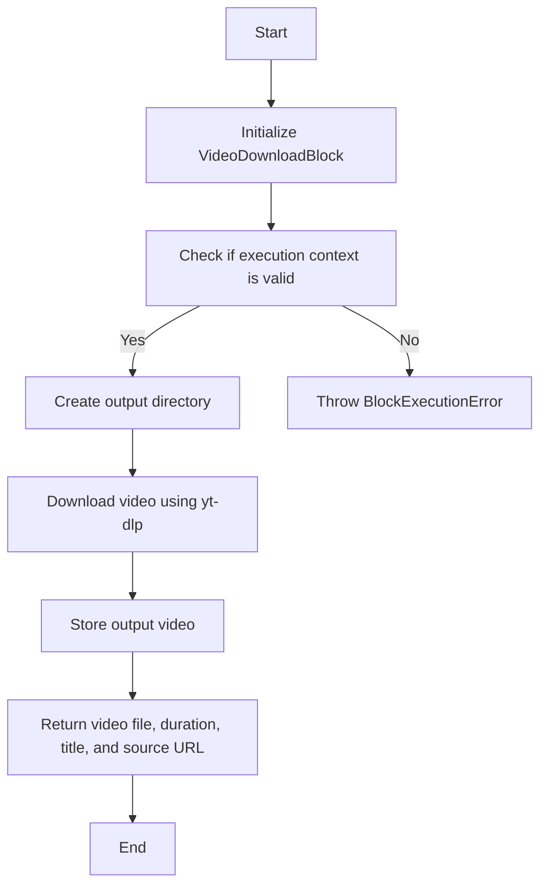
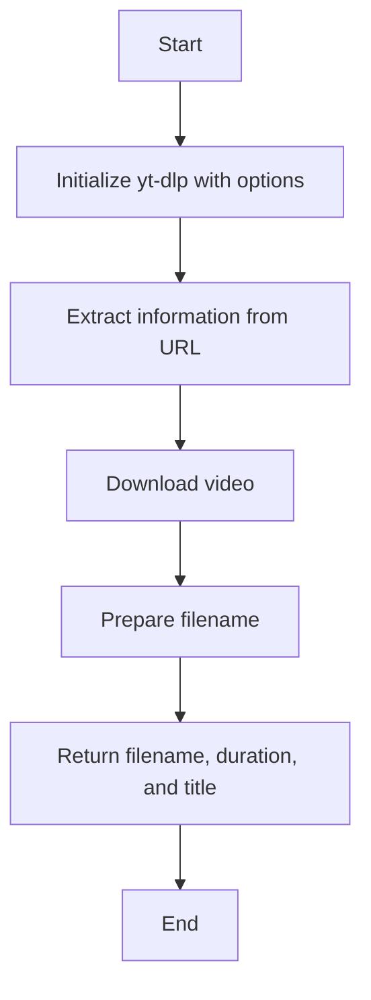
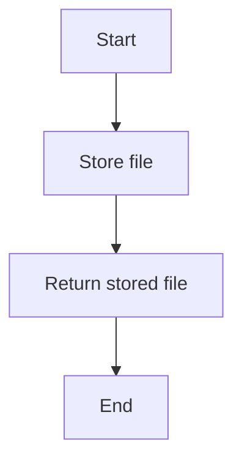
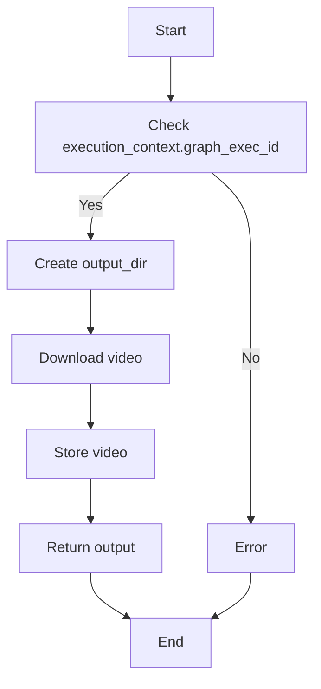
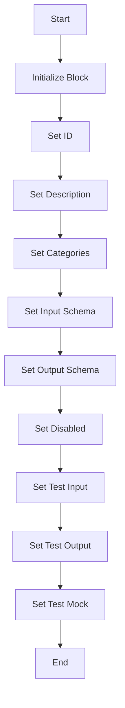
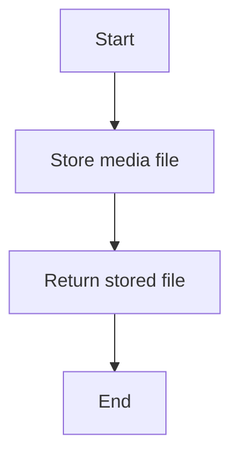
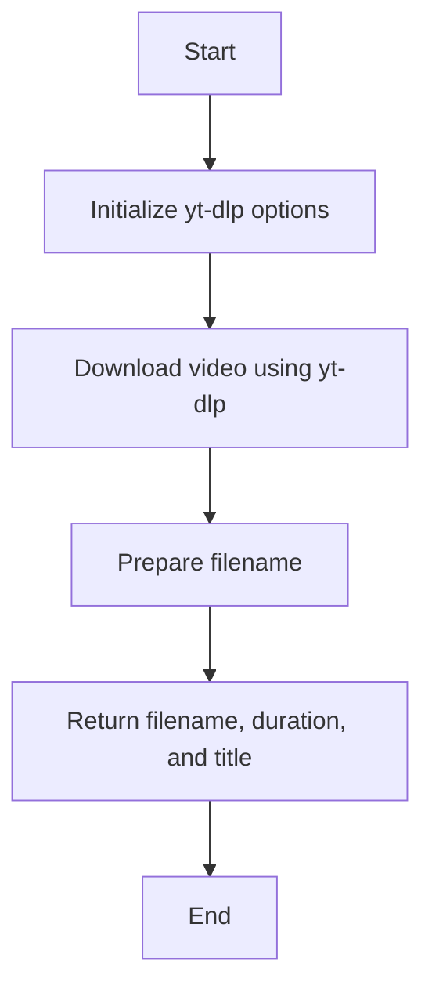
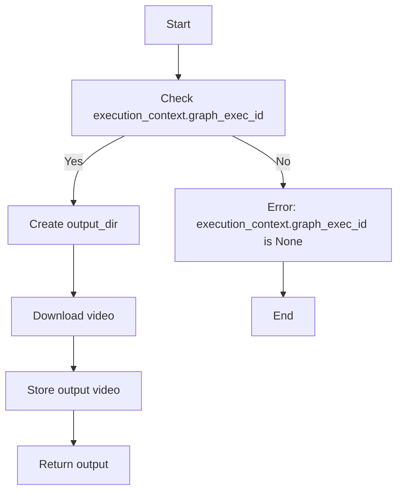

# `.\AutoGPT\autogpt_platform\backend\backend\blocks\video\download.py` 详细设计文档

The VideoDownloadBlock class is designed to download videos from various sources such as YouTube, Vimeo, and direct links using the yt-dlp library. It provides functionality to specify video quality, output format, and handles the storage of the downloaded video.

## 整体流程



## 类结构

```
VideoDownloadBlock (Block)
├── Input (BlockSchemaInput)
│   ├── url (str)
│   ├── quality (Literal)
│   └── output_format (Literal)
└── Output (BlockSchemaOutput)
    ├── video_file (MediaFileType)
    ├── duration (float)
    ├── title (str)
    └── source_url (str)
```

## 全局变量及字段


### `yt_dlp`
    
Module for downloading videos from various sources.

类型：`module`
    


### `_Params`
    
Type alias for yt-dlp's parameters.

类型：`type`
    


### `Block`
    
Base class for blocks in the system.

类型：`class`
    


### `BlockCategory`
    
Enum for block categories.

类型：`enum`
    


### `BlockOutput`
    
Class for block output schema.

类型：`class`
    


### `BlockSchemaInput`
    
Class for block input schema.

类型：`class`
    


### `BlockSchemaOutput`
    
Class for block output schema.

类型：`class`
    


### `ExecutionContext`
    
Class for execution context.

类型：`class`
    


### `SchemaField`
    
Class for schema fields.

类型：`class`
    


### `BlockExecutionError`
    
Exception class for block execution errors.

类型：`class`
    


### `MediaFileType`
    
Class for media file types.

类型：`class`
    


### `get_exec_file_path`
    
Function to get the execution file path.

类型：`function`
    


### `store_media_file`
    
Function to store media files.

类型：`function`
    


### `os`
    
Module for operating system dependent functionality.

类型：`module`
    


### `typing`
    
Module for type hints.

类型：`module`
    


### `Literal`
    
Type alias for literal types.

类型：`type`
    


### `{'name': 'VideoDownloadBlock', 'fields': ['id', 'description', 'categories', 'input_schema', 'output_schema', 'disabled', 'test_input', 'test_output', 'test_mock'], 'methods': ['__init__', '_store_output_video', '_get_format_string', '_download_video', 'run']}.id`
    
Unique identifier for the VideoDownloadBlock class.

类型：`str`
    


### `{'name': 'VideoDownloadBlock', 'fields': ['id', 'description', 'categories', 'input_schema', 'output_schema', 'disabled', 'test_input', 'test_output', 'test_mock'], 'methods': ['__init__', '_store_output_video', '_get_format_string', '_download_video', 'run']}.description`
    
Description of the VideoDownloadBlock class.

类型：`str`
    


### `{'name': 'VideoDownloadBlock', 'fields': ['id', 'description', 'categories', 'input_schema', 'output_schema', 'disabled', 'test_input', 'test_output', 'test_mock'], 'methods': ['__init__', '_store_output_video', '_get_format_string', '_download_video', 'run']}.categories`
    
Categories to which the VideoDownloadBlock belongs.

类型：`set`
    


### `{'name': 'VideoDownloadBlock', 'fields': ['id', 'description', 'categories', 'input_schema', 'output_schema', 'disabled', 'test_input', 'test_output', 'test_mock'], 'methods': ['__init__', '_store_output_video', '_get_format_string', '_download_video', 'run']}.input_schema`
    
Input schema for the VideoDownloadBlock class.

类型：`class`
    


### `{'name': 'VideoDownloadBlock', 'fields': ['id', 'description', 'categories', 'input_schema', 'output_schema', 'disabled', 'test_input', 'test_output', 'test_mock'], 'methods': ['__init__', '_store_output_video', '_get_format_string', '_download_video', 'run']}.output_schema`
    
Output schema for the VideoDownloadBlock class.

类型：`class`
    


### `{'name': 'VideoDownloadBlock', 'fields': ['id', 'description', 'categories', 'input_schema', 'output_schema', 'disabled', 'test_input', 'test_output', 'test_mock'], 'methods': ['__init__', '_store_output_video', '_get_format_string', '_download_video', 'run']}.disabled`
    
Flag indicating if the VideoDownloadBlock is disabled.

类型：`bool`
    


### `{'name': 'VideoDownloadBlock', 'fields': ['id', 'description', 'categories', 'input_schema', 'output_schema', 'disabled', 'test_input', 'test_output', 'test_mock'], 'methods': ['__init__', '_store_output_video', '_get_format_string', '_download_video', 'run']}.test_input`
    
Test input data for the VideoDownloadBlock class.

类型：`dict`
    


### `{'name': 'VideoDownloadBlock', 'fields': ['id', 'description', 'categories', 'input_schema', 'output_schema', 'disabled', 'test_input', 'test_output', 'test_mock'], 'methods': ['__init__', '_store_output_video', '_get_format_string', '_download_video', 'run']}.test_output`
    
Test output data for the VideoDownloadBlock class.

类型：`list`
    


### `{'name': 'VideoDownloadBlock', 'fields': ['id', 'description', 'categories', 'input_schema', 'output_schema', 'disabled', 'test_input', 'test_output', 'test_mock'], 'methods': ['__init__', '_store_output_video', '_get_format_string', '_download_video', 'run']}.test_mock`
    
Test mock data for the VideoDownloadBlock class.

类型：`dict`
    


### `{'name': 'Input', 'fields': ['url', 'quality', 'output_format'], 'methods': []}.url`
    
URL of the video to download.

类型：`str`
    


### `{'name': 'Input', 'fields': ['url', 'quality', 'output_format'], 'methods': []}.quality`
    
Video quality preference.

类型：`Literal`
    


### `{'name': 'Input', 'fields': ['url', 'quality', 'output_format'], 'methods': []}.output_format`
    
Output video format.

类型：`Literal`
    


### `{'name': 'Output', 'fields': ['video_file', 'duration', 'title', 'source_url'], 'methods': []}.video_file`
    
Downloaded video (path or data URI).

类型：`MediaFileType`
    


### `{'name': 'Output', 'fields': ['video_file', 'duration', 'title', 'source_url'], 'methods': []}.duration`
    
Video duration in seconds.

类型：`float`
    


### `{'name': 'Output', 'fields': ['video_file', 'duration', 'title', 'source_url'], 'methods': []}.title`
    
Video title from source.

类型：`str`
    


### `{'name': 'Output', 'fields': ['video_file', 'duration', 'title', 'source_url'], 'methods': []}.source_url`
    
Original source URL.

类型：`str`
    


### `VideoDownloadBlock.id`
    
Unique identifier for the VideoDownloadBlock instance.

类型：`str`
    


### `VideoDownloadBlock.description`
    
Description of the VideoDownloadBlock instance.

类型：`str`
    


### `VideoDownloadBlock.categories`
    
Categories to which the VideoDownloadBlock instance belongs.

类型：`set`
    


### `VideoDownloadBlock.input_schema`
    
Input schema for the VideoDownloadBlock instance.

类型：`BlockSchemaInput`
    


### `VideoDownloadBlock.output_schema`
    
Output schema for the VideoDownloadBlock instance.

类型：`BlockSchemaOutput`
    


### `VideoDownloadBlock.disabled`
    
Flag indicating if the VideoDownloadBlock instance is disabled.

类型：`bool`
    


### `VideoDownloadBlock.test_input`
    
Test input data for the VideoDownloadBlock instance.

类型：`dict`
    


### `VideoDownloadBlock.test_output`
    
Test output data for the VideoDownloadBlock instance.

类型：`list`
    


### `VideoDownloadBlock.test_mock`
    
Test mock data for the VideoDownloadBlock instance.

类型：`dict`
    
    

## 全局函数及方法

### `_download_video`

#### 描述

Download video from a given URL using yt-dlp.

#### 参数

- `url`：`str`，The URL of the video to download (YouTube, Vimeo, direct link, etc.).
- `quality`：`str`，The video quality preference.
- `output_format`：`str`，The output video format.
- `output_dir`：`str`，The directory to store the downloaded video.
- `node_exec_id`：`str`，The execution ID of the node.

#### 返回值

- `tuple[str, float, str]`，A tuple containing the filename of the downloaded video, the duration of the video in seconds, and the title of the video.

#### 流程图



#### 带注释源码

```python
def _download_video(
    self,
    url: str,
    quality: str,
    output_format: str,
    output_dir: str,
    node_exec_id: str,
) -> tuple[str, float, str]:
    """Download video. Extracted for testability."""
    output_template = os.path.join(
        output_dir, f"{node_exec_id}_%(title).50s.%(ext)s"
    )

    ydl_opts: "_Params" = {
        "format": f"{self._get_format_string(quality)}/best",
        "outtmpl": output_template,
        "merge_output_format": output_format,
        "quiet": True,
        "no_warnings": True,
    }

    with yt_dlp.YoutubeDL(ydl_opts) as ydl:
        info = ydl.extract_info(url, download=True)
        video_path = ydl.prepare_filename(info)

        # Handle format conversion in filename
        if not video_path.endswith(f".{output_format}"):
            video_path = video_path.rsplit(".", 1)[0] + f".{output_format}"

        # Return just the filename, not the full path
        filename = os.path.basename(video_path)

        return (
            filename,
            info.get("duration") or 0.0,
            info.get("title") or "Unknown",
        )
```

### `_get_format_string`

#### 描述

The `_get_format_string` method is a helper method within the `VideoDownloadBlock` class that returns a format string for yt-dlp based on the specified video quality.

#### 参数

- `quality`：`str`，The quality of the video to download. It can be one of "best", "1080p", "720p", "480p", or "audio_only".

#### 返回值

- `str`：A format string for yt-dlp that specifies the desired video quality.

#### 流程图

```mermaid
graph TD
    A[Start] --> B{Is quality "best"?}
    B -- Yes --> C[Return "bestvideo+bestaudio/best"]
    B -- No --> D{Is quality "1080p"?}
    D -- Yes --> E[Return "bestvideo[height<=1080]+bestaudio/best[height<=1080]"]
    D -- No --> F{Is quality "720p"?}
    F -- Yes --> G[Return "bestvideo[height<=720]+bestaudio/best[height<=720]"]
    F -- No --> H{Is quality "480p"?}
    H -- Yes --> I[Return "bestvideo[height<=480]+bestaudio/best[height<=480]"]
    H -- No --> J{Is quality "audio_only"?}
    J -- Yes --> K[Return "bestaudio/best"]
    J -- No --> L[Return "720p"]
    C --> M[End]
    E --> M
    G --> M
    I --> M
    K --> M
    L --> M
```

#### 带注释源码

```python
def _get_format_string(self, quality: str) -> str:
    formats = {
        "best": "bestvideo+bestaudio/best",
        "1080p": "bestvideo[height<=1080]+bestaudio/best[height<=1080]",
        "720p": "bestvideo[height<=720]+bestaudio/best[height<=720]",
        "480p": "bestvideo[height<=480]+bestaudio/best[height<=480]",
        "audio_only": "bestaudio/best",
    }
    return formats.get(quality, formats["720p"])
```

### _store_output_video

#### 描述

Store output video. Extracted for testability.

#### 参数

- `execution_context`：`ExecutionContext`，The execution context of the block.
- `file`：`MediaFileType`，The file to be stored.

#### 返回值

- `MediaFileType`，The stored file.

#### 流程图



#### 带注释源码

```python
async def _store_output_video(
    self, execution_context: ExecutionContext, file: MediaFileType
) -> MediaFileType:
    """Store output video. Extracted for testability."""
    return await store_media_file(
        file=file,
        execution_context=execution_context,
        return_format="for_block_output",
    )
```


### `VideoDownloadBlock.run`

This method is responsible for downloading a video from a given URL using yt-dlp and storing it in the appropriate output directory.

参数：

- `input_data`：`Input`，The input data containing the URL of the video to download, the desired quality, and the output format.
- `execution_context`：`ExecutionContext`，The execution context for the current block.
- `node_exec_id`：`str`，The execution ID of the node.
- `**kwargs`：Additional keyword arguments that may be required for future extensions.

返回值：`BlockOutput`，A dictionary containing the output of the block, including the path to the downloaded video, its duration, title, and source URL.

#### 流程图



#### 带注释源码

```python
async def run(
    self,
    input_data: Input,
    *,
    execution_context: ExecutionContext,
    node_exec_id: str,
    **kwargs,
) -> BlockOutput:
    try:
        assert execution_context.graph_exec_id is not None

        # Get the exec file directory
        output_dir = get_exec_file_path(execution_context.graph_exec_id, "")
        os.makedirs(output_dir, exist_ok=True)

        filename, duration, title = self._download_video(
            input_data.url,
            input_data.quality,
            input_data.output_format,
            output_dir,
            node_exec_id,
        )

        # Return as workspace path or data URI based on context
        video_out = await self._store_output_video(
            execution_context, MediaFileType(filename)
        )

        yield "video_file", video_out
        yield "duration", duration
        yield "title", title
        yield "source_url", input_data.url

    except Exception as e:
        raise BlockExecutionError(
            message=f"Failed to download video: {e}",
            block_name=self.name,
            block_id=str(self.id),
        ) from e
```


### VideoDownloadBlock.__init__

This method initializes the `VideoDownloadBlock` class, setting up its properties and configurations.

#### 参数

- `self`：`VideoDownloadBlock` 类的实例

#### 返回值

- 无返回值

#### 流程图



#### 带注释源码

```python
def __init__(self):
    super().__init__(
        id="c35daabb-cd60-493b-b9ad-51f1fe4b50c4",
        description="Download video from URL (YouTube, Vimeo, news sites, direct links)",
        categories={BlockCategory.MULTIMEDIA},
        input_schema=self.Input,
        output_schema=self.Output,
        disabled=True,  # Disable until we can sandbox yt-dlp and handle security implications
        test_input={
            "url": "https://www.youtube.com/watch?v=dQw4w9WgXcQ",
            "quality": "480p",
        },
        test_output=[
            ("video_file", str),
            ("duration", float),
            ("title", str),
            ("source_url", str),
        ],
        test_mock={
            "_download_video": lambda *args: (
                "video.mp4",
                212.0,
                "Test Video",
            ),
            "_store_output_video": lambda *args, **kwargs: "video.mp4",
        },
    )
```


### VideoDownloadBlock._store_output_video

Store output video. Extracted for testability.

参数：

- `execution_context`：`ExecutionContext`，The execution context of the block.
- `file`：`MediaFileType`，The file to be stored.

返回值：`MediaFileType`，The stored file as a workspace path or data URI.

#### 流程图



#### 带注释源码

```python
async def _store_output_video(
    self, execution_context: ExecutionContext, file: MediaFileType
) -> MediaFileType:
    """Store output video. Extracted for testability."""
    return await store_media_file(
        file=file,
        execution_context=execution_context,
        return_format="for_block_output",
    )
```


### `_get_format_string`

#### 描述

`_get_format_string` 方法用于根据给定的视频质量返回相应的格式字符串，该字符串将用于 yt-dlp 的下载选项中。

#### 参数

- `quality`：`str`，表示视频质量，可以是 "best", "1080p", "720p", "480p", 或 "audio_only"。

#### 返回值

- `str`，返回一个格式字符串，用于 yt-dlp 的下载选项。

#### 流程图

```mermaid
graph TD
    A[Start] --> B{Is quality "best"?}
    B -- Yes --> C[Return "bestvideo+bestaudio/best"]
    B -- No --> D{Is quality "1080p"?}
    D -- Yes --> E[Return "bestvideo[height<=1080]+bestaudio/best[height<=1080]"]
    D -- No --> F{Is quality "720p"?}
    F -- Yes --> G[Return "bestvideo[height<=720]+bestaudio/best[height<=720]"]
    F -- No --> H{Is quality "480p"?}
    H -- Yes --> I[Return "bestvideo[height<=480]+bestaudio/best[height<=480]"]
    H -- No --> J{Is quality "audio_only"?}
    J -- Yes --> K[Return "bestaudio/best"]
    J -- No --> L[Return "720p"]
    C --> M[End]
    E --> M
    G --> M
    I --> M
    K --> M
    L --> M
```

#### 带注释源码

```python
def _get_format_string(self, quality: str) -> str:
    formats = {
        "best": "bestvideo+bestaudio/best",
        "1080p": "bestvideo[height<=1080]+bestaudio/best[height<=1080]",
        "720p": "bestvideo[height<=720]+bestaudio/best[height<=720]",
        "480p": "bestvideo[height<=480]+bestaudio/best[height<=480]",
        "audio_only": "bestaudio/best",
    }
    return formats.get(quality, formats["720p"])
```

### `_download_video`

#### 描述

Download video from a given URL using yt-dlp, with specified quality and output format.

#### 参数

- `url`：`str`，The URL of the video to download.
- `quality`：`str`，The video quality preference.
- `output_format`：`str`，The output video format.
- `output_dir`：`str`，The directory to store the downloaded video.
- `node_exec_id`：`str`，The execution ID of the node.

#### 返回值

- `tuple[str, float, str]`，A tuple containing the filename of the downloaded video, the duration of the video in seconds, and the title of the video.

#### 流程图



#### 带注释源码

```python
def _download_video(
    self,
    url: str,
    quality: str,
    output_format: str,
    output_dir: str,
    node_exec_id: str,
) -> tuple[str, float, str]:
    """Download video. Extracted for testability."""
    output_template = os.path.join(
        output_dir, f"{node_exec_id}_%(title).50s.%(ext)s"
    )

    ydl_opts: "_Params" = {
        "format": f"{self._get_format_string(quality)}/best",
        "outtmpl": output_template,
        "merge_output_format": output_format,
        "quiet": True,
        "no_warnings": True,
    }

    with yt_dlp.YoutubeDL(ydl_opts) as ydl:
        info = ydl.extract_info(url, download=True)
        video_path = ydl.prepare_filename(info)

        # Handle format conversion in filename
        if not video_path.endswith(f".{output_format}"):
            video_path = video_path.rsplit(".", 1)[0] + f".{output_format}"

        # Return just the filename, not the full path
        filename = os.path.basename(video_path)

        return (
            filename,
            info.get("duration") or 0.0,
            info.get("title") or "Unknown",
        )
```

### VideoDownloadBlock.run

This function is responsible for downloading a video from a given URL using the yt-dlp library. It handles the video download process, including specifying the quality and output format, and then stores the downloaded video in the appropriate location.

#### 参数

- `input_data`：`Input`，The input data containing the URL of the video to download, the desired quality, and the output format.
- `execution_context`：`ExecutionContext`，The execution context for the block.
- `node_exec_id`：`str`，The execution ID of the node.

#### 返回值

- `BlockOutput`：A dictionary containing the output of the block, including the path to the downloaded video, the duration of the video, the title of the video, and the original source URL.

#### 流程图



#### 带注释源码

```python
async def run(
    self,
    input_data: Input,
    *,
    execution_context: ExecutionContext,
    node_exec_id: str,
    **kwargs,
) -> BlockOutput:
    try:
        assert execution_context.graph_exec_id is not None

        # Get the exec file directory
        output_dir = get_exec_file_path(execution_context.graph_exec_id, "")
        os.makedirs(output_dir, exist_ok=True)

        filename, duration, title = self._download_video(
            input_data.url,
            input_data.quality,
            input_data.output_format,
            output_dir,
            node_exec_id,
        )

        # Return as workspace path or data URI based on context
        video_out = await self._store_output_video(
            execution_context, MediaFileType(filename)
        )

        yield "video_file", video_out
        yield "duration", duration
        yield "title", title
        yield "source_url", input_data.url

    except Exception as e:
        raise BlockExecutionError(
            message=f"Failed to download video: {e}",
            block_name=self.name,
            block_id=str(self.id),
        ) from e
```

## 关键组件


### 张量索引与惰性加载

张量索引与惰性加载是代码中用于处理数据结构，特别是大型数据集的索引和访问策略。

### 反量化支持

反量化支持是代码中实现的一种功能，允许对量化后的模型进行反向量化，以便进行调试或进一步处理。

### 量化策略

量化策略是代码中用于优化模型性能和减少模型大小的一组方法，通过减少模型中使用的数值精度来实现。


## 问题及建议


### 已知问题

-   **依赖性风险**：代码依赖于外部库 `yt-dlp`，这可能导致安全问题和版本兼容性问题。由于 `yt-dlp` 下载视频时可能访问不受信任的内容，因此需要确保适当的沙箱化或隔离措施。
-   **异常处理**：代码中的异常处理较为简单，仅捕获了所有异常并抛出了 `BlockExecutionError`。这可能隐藏了特定类型的错误，建议对不同的异常类型进行更细致的处理。
-   **测试覆盖率**：代码中包含了一些测试用例，但可能需要更多的测试来覆盖所有边缘情况和异常情况，以确保代码的健壮性。
-   **性能问题**：视频下载可能是一个耗时的操作，代码中没有明显的性能优化措施，可能需要考虑异步处理或并发下载来提高效率。

### 优化建议

-   **沙箱化**：实现 `yt-dlp` 的沙箱化执行，以减少安全风险。
-   **错误处理**：增加对特定异常类型的处理，例如网络错误、文件系统错误等。
-   **测试**：扩展测试用例，包括不同视频源、不同质量设置、不同输出格式等。
-   **性能优化**：考虑使用异步或多线程技术来并行下载视频，以提高效率。
-   **日志记录**：增加详细的日志记录，以便于问题追踪和调试。
-   **代码复用**：将重复的代码，如格式字符串生成，提取到单独的函数中，以提高代码的可维护性。


## 其它


### 设计目标与约束

- **设计目标**:
  - 实现从各种视频URL下载视频的功能。
  - 支持多种视频质量和输出格式。
  - 确保下载过程的安全性和稳定性。
  - 提供清晰的错误处理机制。

- **约束**:
  - 代码必须使用yt-dlp库进行视频下载。
  - 下载的视频必须存储在安全的存储位置。
  - 代码必须处理可能的异常和错误，如网络问题或文件存储错误。

### 错误处理与异常设计

- **错误处理**:
  - 使用`try-except`块捕获可能发生的异常。
  - 定义自定义异常`BlockExecutionError`以提供详细的错误信息。

- **异常设计**:
  - `BlockExecutionError`: 当视频下载失败时抛出，包含错误信息和相关块信息。

### 数据流与状态机

- **数据流**:
  - 输入数据包含视频URL、质量和输出格式。
  - 输出数据包含下载的视频文件、视频时长、标题和原始URL。

- **状态机**:
  - 状态包括：初始化、下载视频、存储视频、完成或失败。

### 外部依赖与接口契约

- **外部依赖**:
  - yt-dlp库用于视频下载。
  - backend库用于数据存储和执行上下文管理。

- **接口契约**:
  - `Block`接口定义了块的输入、输出和执行方法。
  - `MediaFileType`定义了媒体文件的类型。
  - `ExecutionContext`定义了执行上下文。


    