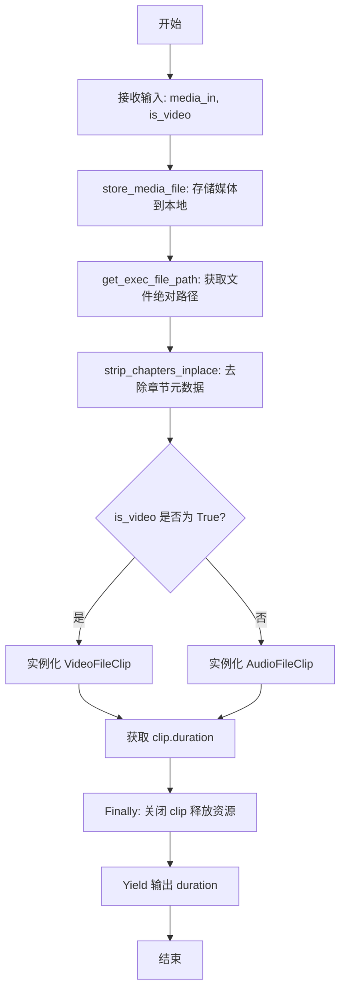
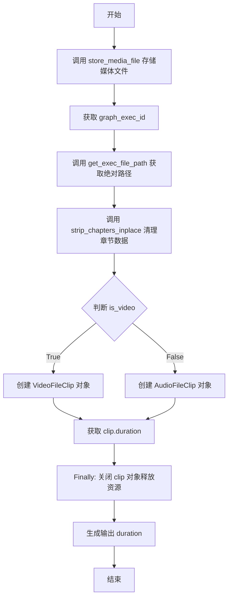

# `AutoGPT\autogpt_platform\backend\backend\blocks\video\duration.py` 详细设计文档

该代码定义了一个 `MediaDurationBlock` 类，用于计算视频或音频文件的时长；它通过接收媒体文件输入和类型标志，将文件存储到本地，使用 MoviePy 库加载媒体对象，提取并以秒为单位返回时长，同时确保资源的正确释放。

## 整体流程



## 类结构

```
Block (外部依赖)
└── MediaDurationBlock
    ├── Input (BlockSchemaInput)
    └── Output (BlockSchemaOutput)
```

## 全局变量及字段


### `MediaDurationBlock.Input.media_in`
    
Media input (URL, data URI, or local path).

类型：`MediaFileType`
    


### `MediaDurationBlock.Input.is_video`
    
Whether the media is a video (True) or audio (False).

类型：`bool`
    


### `MediaDurationBlock.Output.duration`
    
Duration of the media file (in seconds).

类型：`float`
    
    

## 全局函数及方法


### `MediaDurationBlock.__init__`

初始化媒体时长处理块，通过调用父类的初始化方法设置该块的唯一标识符、功能描述、所属分类以及输入输出的数据结构定义。

参数：
- `self`：`MediaDurationBlock`，类实例本身，用于访问类属性和方法。

返回值：`None`，初始化方法不返回任何值。

#### 流程图

```mermaid
flowchart TD
    A[Start __init__] --> B[Call super().__init__]
    B --> C[Set Block ID]
    B --> D[Set Description]
    B --> E[Set Category to MULTIMEDIA]
    B --> F[Set Input Schema]
    B --> G[Set Output Schema]
    C --> H[End Initialization]
    D --> H
    E --> H
    F --> H
    G --> H
```

#### 带注释源码

```python
def __init__(self):
    # 调用父类 Block 的初始化方法，注册该块的基本元数据
    super().__init__(
        id="d8b91fd4-da26-42d4-8ecb-8b196c6d84b6",  # 块的全局唯一标识符
        description="Block to get the duration of a media file.", # 块的功能描述文本
        categories={BlockCategory.MULTIMEDIA}, # 块所属的分类集合，此处为多媒体类
        input_schema=MediaDurationBlock.Input,  # 定义输入数据的结构模式
        output_schema=MediaDurationBlock.Output, # 定义输出数据的结构模式
    )
```


### `MediaDurationBlock.run`

该方法负责获取媒体文件（视频或音频）的时长。它首先将输入的媒体文件存储到本地，然后根据媒体类型使用 MoviePy 库加载文件并提取其持续时间（以秒为单位）。

参数：

- `input_data`：`Input`，包含输入媒体文件路径（URL、数据 URI 或本地路径）以及标识媒体类型的布尔值 `is_video`。
- `execution_context`：`ExecutionContext`，执行上下文对象，用于获取执行 ID 以解析文件路径和管理文件存储。
- `**kwargs`：`Any`，额外的关键字参数。

返回值：`BlockOutput`，生成包含媒体时长键值对（`"duration", float`）的异步生成器。

#### 流程图



#### 带注释源码

```python
async def run(
    self,
    input_data: Input,
    *,
    execution_context: ExecutionContext,
    **kwargs,
) -> BlockOutput:
    # 1) 将输入的媒体文件存储到本地，并返回用于本地处理的路径
    local_media_path = await store_media_file(
        file=input_data.media_in,
        execution_context=execution_context,
        return_format="for_local_processing",
    )
    
    # 确保执行图 ID 存在，用于后续路径解析
    assert execution_context.graph_exec_id is not None
    
    # 获取媒体文件的绝对路径
    media_abspath = get_exec_file_path(
        execution_context.graph_exec_id, local_media_path
    )

    # 2) 移除文件中的章节数据，防止 MoviePy 加载时崩溃
    strip_chapters_inplace(media_abspath)
    
    clip = None
    try:
        # 根据输入标志判断是视频还是音频，加载对应的 Clip 对象
        if input_data.is_video:
            clip = VideoFileClip(media_abspath)
        else:
            clip = AudioFileClip(media_abspath)

        # 获取媒体文件的时长（秒）
        duration = clip.duration
    finally:
        # 确保在任何情况下（包括异常）都关闭 clip 对象以释放文件资源
        if clip:
            clip.close()

    # 返回计算得到的时长
    yield "duration", duration
```


## 关键组件


### 输入模式处理

负责定义媒体的输入接口，使用 `MediaFileType` 接收多媒体输入源（URL、数据 URI 或本地路径），并利用 `is_video` 布尔值区分视频与音频处理逻辑。

### 媒体文件持久化

通过 `store_media_file` 将外部或内存中的媒体数据异步持久化到本地文件系统，并结合 `get_exec_file_path` 生成绝对路径，为后续的文件解析提供基础。

### 预处理稳定性增强

在加载媒体之前调用 `strip_chapters_inplace` 移除文件中的章节信息，这是一个关键步骤，用于防止 MoviePy 在处理包含特定元数据的文件时发生崩溃。

### 媒体加载适配

根据输入标志动态实例化 `VideoFileClip` 或 `AudioFileClip` 对象，以实现对视频和音频文件的统一时长提取接口。

### 资源生命周期管理

利用 `try/finally` 块确保媒体剪辑对象在使用完毕后被显式关闭，及时释放文件句柄和内存资源，避免资源泄漏。


## 问题及建议


### 已知问题

-   **不安全的断言使用**：代码使用 `assert execution_context.graph_exec_id is not None` 来检查关键的前置条件。在生产环境中（特别是当 Python 以优化模式 `-O` 运行时），断言语句会被忽略，导致潜在的 `None` 值传递给 `get_exec_file_path`，进而引发运行时错误。
-   **破坏性的原地文件修改**：`strip_chapters_inplace(media_abspath)` 函数直接修改了存储在磁盘上的媒体文件。如果文件存储机制涉及缓存或去重，此操作将损坏原始数据，导致同一文件在其他执行上下文中不可用或损坏，违反了数据完整性和幂等性原则。
-   **缺乏鲁棒的类型检测**：代码依赖用户输入的 `is_video` 标志来选择解析器（`VideoFileClip` 或 `AudioFileClip`）。如果用户误将视频文件标记为音频，或将音频标记为视频，程序将抛出异常，缺乏自动识别媒体类型的容错能力。

### 优化建议

-   **使用显式异常处理**：将 `assert` 语句替换为显式的条件检查和异常抛出（如 `if ... is None: raise ValueError(...)`），以确保在任何运行模式下都能正确捕获并处理缺失的 ID。
-   **避免修改原始文件**：建议避免对存储的原始文件进行原地修改。如果必须去除章节，应先将文件复制到临时目录，在临时副本上执行操作；或者确保 `store_media_file` 提供的文件路径总是指向该执行上下文独有的、可安全修改的副本。
-   **采用轻量级的元数据提取方案**：当前为了获取时长而加载完整的 `VideoFileClip` 或 `AudioFileClip` 对象，这涉及到加载解码器等重型操作，效率较低。建议直接调用 `ffprobe` 等命令行工具获取媒体时长，这将大幅减少内存占用和响应时间，特别是对于大文件。
-   **实现媒体类型自动推断**：移除 `is_video` 输入参数，改为根据文件扩展名或文件头（Magic Bytes）自动判断媒体类型，从而简化用户输入并提高系统的易用性和健壮性。


## 其它


### 设计目标与约束

设计目标是准确、高效地从指定来源（URL、数据 URI 或本地路径）读取视频或音频文件的元数据，并提取其持续时长（秒）。主要约束包括：
1.  **外部库依赖**：强依赖 `moviepy` 库进行媒体解析，因此环境必须支持该库及其底层依赖（如 FFmpeg）。
2.  **本地化处理**：为了确保 MoviePy 的稳定性，输入媒体必须先下载或转换为本地文件系统上的绝对路径进行处理，不支持纯粹的流式内存处理。
3.  **文件格式兼容性**：受限于 MoviePy 支持的编解码器和容器格式。
4.  **副作用处理**：为了保证特定文件的解析成功，必须执行 `strip_chapters_inplace` 操作，该操作会修改源文件的元数据（移除章节），具有不可逆的副作用。

### 错误处理与异常设计

当前实现采用了基本的资源保障机制，但在异常处理上存在改进空间：
1.  **资源泄漏防护**：使用了 `try...finally` 结构确保 `clip` 对象（无论是 VideoFileClip 还是 AudioFileClip）在使用后被显式关闭 (`close()`)，防止文件句柄或内存泄漏。
2.  **致命断言风险**：代码中使用 `assert execution_context.graph_exec_id is not None` 来校验上下文。在生产环境中，若 Python 以优化模式（`-O`）运行，断言会被跳过，可能导致后续逻辑出现 `NoneType` 错误。建议改为显式的异常抛出（如 `ValueError`）。
3.  **未捕获的媒体异常**：`VideoFileClip` 和 `AudioFileClip` 的构造函数以及 `duration` 属性访问可能会抛出 `IOError`、`OSError` 或 MoviePy 特定的异常（如文件损坏、编解码不支持）。当前代码未显式捕获这些异常，异常将直接向上传播至执行引擎，依赖上层处理。

### 数据流与状态机

该组件是一个无状态的数据处理单元，其数据流转遵循线性流程，不涉及复杂的状态转换，具体数据流如下：
1.  **输入阶段**：接收 `Input` Schema 数据，包含媒体源引用和媒体类型标识。
2.  **持久化阶段**：通过 `store_media_file` 将输入流/引用转换为本地磁盘上的持久化文件，并获取执行上下文相关的绝对路径。
3.  **预处理阶段**：对本地文件执行 `strip_chapters_inplace`，修改文件内容以消除潜在解析 bug。
4.  **分析阶段**：根据类型实例化 Clip 对象，读取 `duration` 属性。
5.  **输出阶段**：释放资源，生成包含浮点数时长的 `BlockOutput` 并 Yield 给下游。

### 外部依赖与接口契约

1.  **第三方库依赖**：
    *   `moviepy.audio.io.AudioFileClip.AudioFileClip`：用于解析音频文件。
    *   `moviepy.video.io.VideoFileClip.VideoFileClip`：用于解析视频文件。
2.  **内部模块依赖**：
    *   `backend.blocks.video._utils.strip_chapters_inplace`：用于媒体文件预处理，契约是修改传入路径指向的文件。
    *   `backend.util.file.store_media_file`：用于媒体文件下载/存储，契约是返回相对于执行目录的本地路径。
    *   `backend.util.file.get_exec_file_path`：用于路径拼接，契约是基于 `graph_exec_id` 构建绝对路径。
3.  **接口契约**：
    *   **输入契约 (`Input`)**：必须提供合法的 `MediaFileType` (URL/URI/Path) 和布尔值 `is_video`。
    *   **输出契约 (`Output`)**：保证产出键名为 `"duration"`，值为非负浮点数（float），代表秒数。

### 安全性与合规性

1.  **路径遍历风险**：代码依赖 `get_exec_file_path` 处理路径，需确保该函数对 `graph_exec_id` 和 `local_media_path` 进行了严格的校验，防止路径遍历攻击。
2.  **资源消耗**：由于涉及文件下载和媒体解析，建议在上层（调用方）限制输入文件的大小，防止恶意上传大文件导致磁盘空间耗尽或内存溢出（MoviePy 加载部分文件时可能占用较多内存）。
3.  **数据残留**：处理后的本地文件需要依赖系统的垃圾回收机制或特定的清理策略进行删除，否则可能导致磁盘空间逐渐被占用。

    