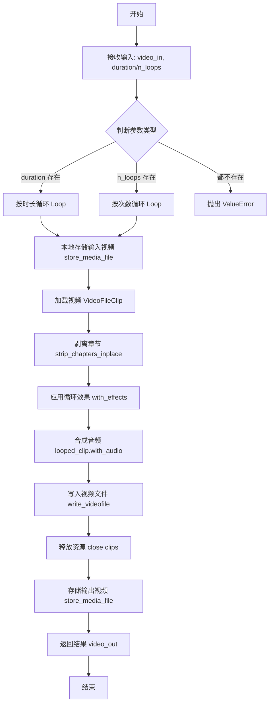
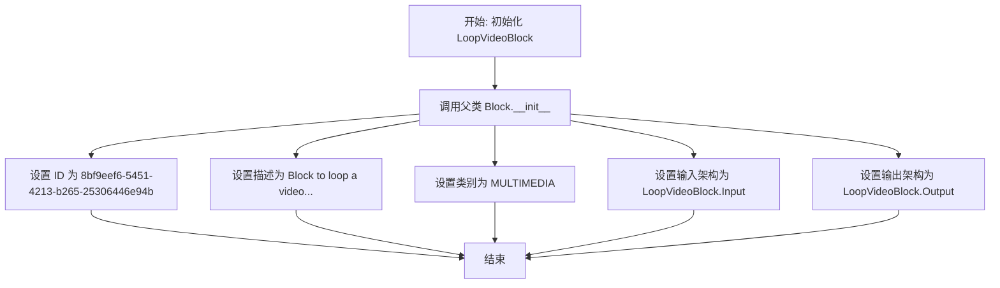
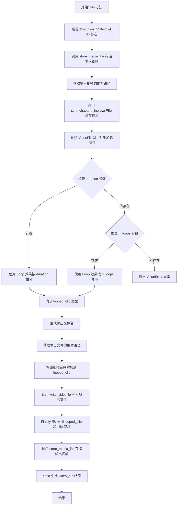

# `AutoGPT\autogpt_platform\backend\backend\blocks\video\loop.py` 详细设计文档

该代码实现了一个名为 `LoopVideoBlock` 的多媒体处理组件，用于将输入的视频按照指定的目标时长或循环次数进行重复播放（循环）处理，并将处理后的视频文件保存为相对路径或数据 URI 返回。

## 整体流程



## 类结构

```
LoopVideoBlock (Block)
├── Input (BlockSchemaInput)
│   ├── video_in: MediaFileType
│   ├── duration: Optional[float]
│   └── n_loops: Optional[int]
├── Output (BlockSchemaOutput)
│   └── video_out: MediaFileType
├── __init__
└── run
```

## 全局变量及字段


### `LoopVideoBlock.Input.video_in`
    
The input video (can be a URL, data URI, or local path).

类型：`MediaFileType`
    


### `LoopVideoBlock.Input.duration`
    
Target duration (in seconds) to loop the video to. Either duration or n_loops must be provided.

类型：`Optional[float]`
    


### `LoopVideoBlock.Input.n_loops`
    
Number of times to repeat the video. Either n_loops or duration must be provided.

类型：`Optional[int]`
    


### `LoopVideoBlock.Output.video_out`
    
Looped video returned either as a relative path or a data URI.

类型：`MediaFileType`
    
    

## 全局函数及方法


### `LoopVideoBlock.__init__`

该方法用于初始化循环视频处理块，配置其唯一标识符、描述信息、分类类别以及输入输出的数据结构定义。

参数：

-   `self`：`LoopVideoBlock`，指向类实例本身的引用。

返回值：`None`，构造函数不返回任何值。

#### 流程图



#### 带注释源码

```python
def __init__(self):
    # 调用父类 Block 的构造函数，注册块的基本元数据和架构
    super().__init__(
        id="8bf9eef6-5451-4213-b265-25306446e94b",  # 定义该处理块的全局唯一标识符
        description="Block to loop a video to a given duration or number of repeats.", # 块的功能描述文本
        categories={BlockCategory.MULTIMEDIA},  # 将块归类为多媒体类型
        input_schema=LoopVideoBlock.Input,  # 绑定内部类 Input 作为输入数据的验证架构
        output_schema=LoopVideoBlock.Output,  # 绑定内部类 Output 作为输出数据的验证架构
    )
```


### `LoopVideoBlock.run`

该方法负责接收输入视频数据，根据指定的时长或循环次数对视频进行循环处理，并将处理后的视频保存至文件系统，最终返回输出视频的路径或URI。

参数：

- `input_data`：`LoopVideoBlock.Input`，包含输入视频（video_in）以及循环控制参数（duration 或 n_loops）的输入数据对象。
- `execution_context`：`ExecutionContext`，执行上下文对象，包含图谱执行ID和节点执行ID等必要元数据。
- `**kwargs`：`Any`，额外的关键字参数，用于接口兼容性扩展。

返回值：`BlockOutput`，一个生成器，用于产生包含输出键 "video_out" 和处理后视频路径/URI 的元组。

#### 流程图



#### 带注释源码

```python
async def run(
    self,
    input_data: Input,
    *,
    execution_context: ExecutionContext,
    **kwargs,
) -> BlockOutput:
    # 确保执行上下文中包含必要的ID
    assert execution_context.graph_exec_id is not None
    assert execution_context.node_exec_id is not None
    graph_exec_id = execution_context.graph_exec_id
    node_exec_id = execution_context.node_exec_id

    # 1) 将输入视频存储到本地文件系统，准备进行本地处理
    local_video_path = await store_media_file(
        file=input_data.video_in,
        execution_context=execution_context,
        return_format="for_local_processing",
    )
    # 获取本地处理所需的绝对路径
    input_abspath = get_exec_file_path(graph_exec_id, local_video_path)

    # 2) 加载视频剪辑
    # 去除可能存在的章节元数据，防止处理冲突
    strip_chapters_inplace(input_abspath)
    clip = None
    looped_clip = None
    try:
        # 使用 moviepy 加载视频文件
        clip = VideoFileClip(input_abspath)

        # 3) 应用循环效果
        if input_data.duration:
            # 如果指定了时长，循环视频直到达到该时长
            looped_clip = clip.with_effects([Loop(duration=input_data.duration)])
        elif input_data.n_loops:
            # 如果指定了循环次数，按次数循环视频
            looped_clip = clip.with_effects([Loop(n=input_data.n_loops)])
        else:
            # 既没有指定时长也没有指定次数，抛出错误
            raise ValueError("Either 'duration' or 'n_loops' must be provided.")

        assert isinstance(looped_clip, VideoFileClip)

        # 4) 保存循环后的输出视频
        # 提取源文件名以构建新文件名
        source = extract_source_name(local_video_path)
        output_filename = MediaFileType(f"{node_exec_id}_looped_{source}.mp4")
        output_abspath = get_exec_file_path(graph_exec_id, output_filename)

        # 确保循环后的视频保留原视频的音频轨道
        looped_clip = looped_clip.with_audio(clip.audio)
        # 将视频写入磁盘，使用 H.264 编码和 AAC 音频编码
        looped_clip.write_videofile(
            output_abspath, codec="libx264", audio_codec="aac"
        )
    finally:
        # 确保在任何情况下（包括异常）都释放视频资源
        if looped_clip:
            looped_clip.close()
        if clip:
            clip.close()

    # 返回输出 - 将生成的视频文件存储并根据配置返回 workspace:// 路径或 data URI
    video_out = await store_media_file(
        file=output_filename,
        execution_context=execution_context,
        return_format="for_block_output",
    )

    # 生成最终结果
    yield "video_out", video_out
```


## 关键组件


### LoopVideoBlock

该代码的核心类，继承自 `Block`，负责定义视频循环处理的输入输出模式、参数校验逻辑，并编排从文件加载、视频循环处理到结果输出的完整执行流程。

### store_media_file

外部依赖的工具函数，用于处理多媒体文件的持久化。它将输入的视频（支持 URL、Data URI 或本地路径）存储到执行环境的本地文件系统中，并根据需求返回用于本地处理的路径或用于输出展示的 Data URI。

### VideoFileClip

来自 MoviePy 库的核心组件，用于从本地文件路径加载视频文件，创建一个可以在内存中进行读取、剪辑和应用特效的视频对象。

### Loop

来自 MoviePy 库的视频特效组件，作为 `with_effects` 方法的参数，用于根据设定的时长（`duration`）或循环次数（`n`）对视频剪辑进行循环扩展。

### ExecutionContext

执行上下文对象，包含当前图执行（`graph_exec_id`）和节点执行（`node_exec_id`）的唯一标识符，用于确保文件操作在隔离的目录空间内进行，防止并发任务间的文件冲突。

### get_exec_file_path

路径解析工具函数，结合执行上下文的 ID 和文件名，生成当前执行任务对应的绝对文件路径，用于定位输入文件和确定输出文件的存储位置。

### strip_chapters_inplace

视频预处理工具函数（隐式依赖），用于在加载视频前就地移除视频文件中的章节信息，以避免因元数据问题导致的后续处理错误。


## 问题及建议


### 已知问题

-   **音频处理逻辑错误**：代码中 `looped_clip = looped_clip.with_audio(clip.audio)` 将原始（较短）音频轨道直接覆盖到循环后（较长）的视频片段上。这会导致视频在循环播放超过原视频时长后变成静音，正确的做法是使用 MoviePy 内置的循环功能处理音频，或者手动循环音频轨道。
-   **阻塞异步事件循环**：`VideoFileClip` 的加载过程和 `looped_clip.write_videofile` 的渲染过程是同步且 CPU 密集型的 I/O 操作。在 `async def run` 方法中直接调用这些函数会阻塞整个异步事件循环，导致并发性能下降，影响其他任务的执行。
-   **不可预期的输入文件副作用**：在加载视频前调用了 `strip_chapters_inplace(input_abspath)`，该函数直接修改了输入文件。如果该输入文件被其他节点复用或需要保持原样，这种原地修改操作会导致数据不一致或错误。
-   **使用断言进行运行时校验**：代码使用 `assert execution_context.graph_exec_id is not None` 来检查必要的上下文参数。在生产环境中如果 Python 以优化模式（`-O`）运行，断言会被忽略，导致后续出现 `None` 相关的崩溃，应使用显式的条件判断和异常抛出。

### 优化建议

-   **卸载 CPU 密集型任务**：建议将 `VideoFileClip` 的初始化和 `write_videofile` 的执行放入线程池（使用 `loop.run_in_executor`）中运行，以释放主事件循环，提升系统的并发处理能力。
-   **采用 FFmpeg 直接流处理**：MoviePy 底层基于 FFmpeg，但封装较重。对于循环视频这种特定场景，直接调用 FFmpeg 命令行（如使用 `-stream_loop -1` 或 concat demuxer）可以避免将整个视频加载到内存中，显著降低内存占用并提高处理速度。
-   **修正音频逻辑**：移除手动设置音频的代码 `looped_clip.with_audio(clip.audio)`，依赖 `Loop` 特效自动处理音视频同步；如果需要手动处理，应确保音频循环次数与视频一致。
-   **增强输入验证与异常处理**：移除 `assert`，改用 `if ... is None: raise ValueError(...)`。同时，在修改文件前检查文件权限，或考虑在临时副本上操作以避免副作用。
-   **参数灵活性**：目前编解码器（`libx264`, `aac`）是硬编码的。建议将其作为可选参数暴露给用户，以便在不同场景（如需要更快的编码速度或不同的兼容性）下进行调整。


## 其它


### 设计目标与约束

1. **功能目标**：提供视频循环播放能力，允许用户根据指定的目标时长（秒）或循环次数来扩展视频内容。
2. **资源保护约束**：
   - **时长限制**：`duration` 参数被限制在 `[0.0, 3600.0]` 秒之间（即最大1小时），以防止生成过大的视频文件耗尽磁盘空间或内存。
   - **次数限制**：`n_loops` 参数被限制在 `[1, 10]` 之间，防止因过高的循环倍数导致资源耗尽。
3. **逻辑互斥约束**：输入参数 `duration` 与 `n_loops` 必须提供且仅能提供一个，若两者均未提供则触发逻辑错误。
4. **编码格式约束**：输出视频统一使用 `libx264` 视频编码和 `aac` 音频编码，以保证兼容性和质量控制。

### 错误处理与异常设计

1. **参数校验异常**：在代码逻辑中显式检查 `duration` 和 `n_loops` 是否同时为空，若条件满足抛出 `ValueError("Either 'duration' or 'n_loops' must be provided.")`。
2. **前置条件断言**：使用 `assert` 语句强制要求 `execution_context.graph_exec_id` 和 `execution_context.node_exec_id` 不为空，确保执行环境上下文完整。
3. **资源清理保证**：通过 `try...finally` 块包裹视频处理逻辑，确保无论 `write_videofile` 是否成功，`clip` 和 `looped_clip` 对象的 `close()` 方法都会被调用，防止内存泄漏或文件句柄占用。
4. **异常传播**：对于 `VideoFileClip` 加载失败或视频写入过程中发生的 `IOError` 或 `moviepy` 内部异常，未进行捕获，将向上抛出由上层执行引擎处理。

### 数据流与状态机

1. **数据流向**：
   - **输入转换**：原始输入（URL/Data URI/Local Path） -> `store_media_file` -> 本地临时文件路径。
   - **对象加载**：本地路径 -> `VideoFileClip` 对象。
   - **特效处理**：`VideoFileClip` -> `Loop` 特效 -> 循环后的 `VideoFileClip` 对象。
   - **持久化输出**：循环对象 -> `write_videofile` -> 本地输出文件。
   - **结果返回**：本地输出文件 -> `store_media_file` -> 最终输出路径/Data URI。
2. **状态管理**：
   - 该 `Block` 是无状态的，但 `run` 方法执行期间维护了视频剪辑对象的临时状态。
   - 状态流转：未加载 -> 已加载 (clip) -> 已循环 (looped_clip) -> 已释放 (closed)。

### 外部依赖与接口契约

1. **外部库依赖**：
   - **moviepy**：核心视频处理库。依赖 `moviepy.video.fx.Loop` 实现循环逻辑，依赖 `moviepy.video.io.VideoFileClip` 进行视频的读取、写入和编码处理。
2. **内部框架依赖**：
   - **Block 基类**：继承自 `backend.data.block.Block`，遵循其定义的输入输出模式。
   - **文件服务**：依赖 `backend.util.file` 中的 `store_media_file` 进行媒体文件的存储与格式转换，以及 `get_exec_file_path` 获取执行环境下的绝对路径。
   - **工具函数**：依赖 `backend.blocks.video._utils` 中的 `strip_chapters_inplace` 移除元数据章节，以及 `extract_source_name` 提取源文件名。
3. **接口契约**：
   - **执行上下文**：`ExecutionContext` 必须提供有效的 `graph_exec_id` 和 `node_exec_id`，用于构建隔离的文件存储路径和唯一的输出文件名。

    