# `.\AutoGPT\autogpt_platform\backend\backend\blocks\video\narration.py` 详细设计文档

The VideoNarrationBlock generates AI voice narration and adds it to a video using the ElevenLabs API.

## 整体流程

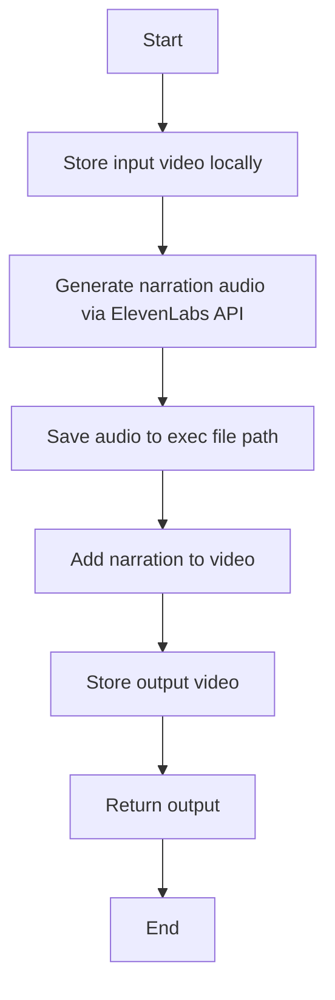

## 类结构

```
VideoNarrationBlock (Concrete Block)
├── Input (BlockSchemaInput)
│   ├── credentials (ElevenLabsCredentialsInput)
│   ├── video_in (MediaFileType)
│   ├── script (str)
│   ├── voice_id (str)
│   ├── model_id (Literal)
│   ├── mix_mode (Literal)
│   └── narration_volume (float)
│   └── original_volume (float)
├── Output (BlockSchemaOutput)
│   ├── video_out (MediaFileType)
│   └── audio_file (MediaFileType)
└── ElevenLabsCredentials (Class)
    ├── api_key (str)
    └── secret_key (str)
```

## 全局变量及字段


### `TEST_CREDENTIALS`
    
Test credentials for ElevenLabs API

类型：`ElevenLabsCredentials`
    


### `TEST_CREDENTIALS_INPUT`
    
Test input for ElevenLabs API credentials

类型：`ElevenLabsCredentialsInput`
    


### `ElevenLabsCredentials`
    
Class representing ElevenLabs API credentials

类型：`class`
    


### `ElevenLabsCredentialsInput`
    
Class representing input for ElevenLabs API credentials

类型：`class`
    


### `Block`
    
Base class for all blocks

类型：`class`
    


### `BlockCategory`
    
Enum for block categories

类型：`class`
    


### `BlockOutput`
    
Class representing block output

类型：`class`
    


### `BlockSchemaInput`
    
Class representing block input schema

类型：`class`
    


### `BlockSchemaOutput`
    
Class representing block output schema

类型：`class`
    


### `ExecutionContext`
    
Class representing execution context

类型：`class`
    


### `MediaFileType`
    
Class representing media file type

类型：`class`
    


### `get_exec_file_path`
    
Function to get execution file path

类型：`function`
    


### `store_media_file`
    
Function to store media file

类型：`function`
    


### `BlockExecutionError`
    
Exception class for block execution errors

类型：`class`
    


### `VideoNarrationBlock.id`
    
Unique identifier for the block

类型：`str`
    


### `VideoNarrationBlock.description`
    
Description of the block

类型：`str`
    


### `VideoNarrationBlock.categories`
    
Categories to which the block belongs

类型：`set`
    


### `VideoNarrationBlock.input_schema`
    
Input schema for the block

类型：`BlockSchemaInput`
    


### `VideoNarrationBlock.output_schema`
    
Output schema for the block

类型：`BlockSchemaOutput`
    


### `VideoNarrationBlock.test_input`
    
Test input data for the block

类型：`dict`
    


### `VideoNarrationBlock.test_credentials`
    
Test credentials for the block

类型：`ElevenLabsCredentials`
    


### `VideoNarrationBlock.test_output`
    
Test output data for the block

类型：`list`
    


### `VideoNarrationBlock.test_mock`
    
Test mock functions for the block

类型：`dict`
    


### `Input.credentials`
    
ElevenLabs API credentials

类型：`ElevenLabsCredentialsInput`
    


### `Input.video_in`
    
Input video

类型：`MediaFileType`
    


### `Input.script`
    
Narration script text

类型：`str`
    


### `Input.voice_id`
    
ElevenLabs voice ID

类型：`str`
    


### `Input.model_id`
    
ElevenLabs TTS model

类型：`Literal`
    


### `Input.mix_mode`
    
How to combine with original audio

类型：`Literal`
    


### `Input.narration_volume`
    
Narration volume

类型：`float`
    


### `Input.original_volume`
    
Original audio volume when mixing

类型：`float`
    


### `Output.video_out`
    
Video with narration

类型：`MediaFileType`
    


### `Output.audio_file`
    
Generated audio file

类型：`MediaFileType`
    


### `ElevenLabsCredentials.api_key`
    
API key for ElevenLabs

类型：`str`
    


### `ElevenLabsCredentials.secret_key`
    
Secret key for ElevenLabs

类型：`str`
    
    

## 全局函数及方法


### `strip_chapters_inplace`

`strip_chapters_inplace` is a utility function used to remove chapter markers from a video file.

参数：

- `video_abspath`：`str`，The absolute path to the video file from which chapters will be removed.

返回值：`None`，This function does not return a value.

#### 流程图

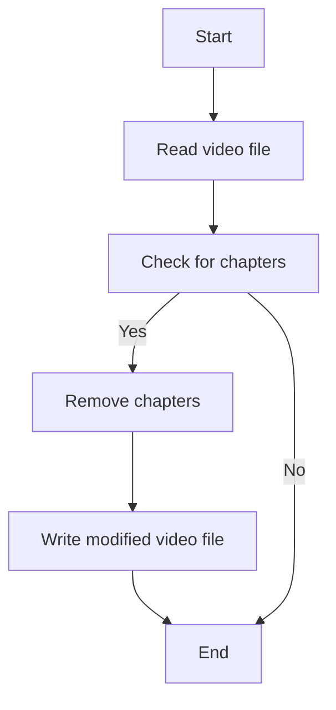

#### 带注释源码

```python
def strip_chapters_inplace(video_abspath: str) -> None:
    # This function is a placeholder for the actual implementation
    # which would involve reading the video file, checking for chapter markers,
    # and removing them if present, then writing the modified video file back to disk.
    pass
```


### `VideoNarrationBlock`

`VideoNarrationBlock` is a class that generates AI voice narration and adds it to a video.

参数：

- `execution_context`：`ExecutionContext`，The execution context for the block.
- `input_data`：`Input`，The input data for the block.
- `credentials`：`ElevenLabsCredentials`，The credentials for the ElevenLabs API.
- `node_exec_id`：`str`，The execution ID for the node.

返回值：`BlockOutput`，The output of the block.

#### 流程图

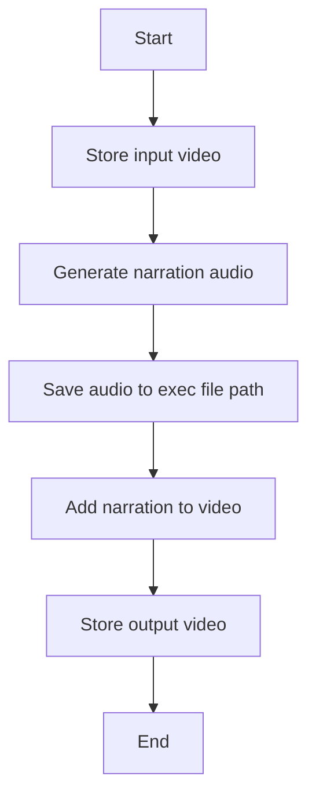

#### 带注释源码

```python
class VideoNarrationBlock(Block):
    # ... (rest of the class definition)

    async def run(
        self,
        input_data: Input,
        *,
        credentials: ElevenLabsCredentials,
        execution_context: ExecutionContext,
        node_exec_id: str,
        **kwargs,
    ) -> BlockOutput:
        try:
            # ... (rest of the run method)
        except Exception as e:
            raise BlockExecutionError(
                message=f"Failed to add narration: {e}",
                block_name=self.name,
                block_id=str(self.id),
            ) from e
```


### `_add_narration_to_video`

`_add_narration_to_video` is a method of the `VideoNarrationBlock` class that adds narration audio to a video.

参数：

- `video_abspath`：`str`，The absolute path to the video file to which narration will be added.
- `audio_abspath`：`str`，The absolute path to the narration audio file.
- `output_abspath`：`str`，The absolute path to the output video file.
- `mix_mode`：`str`，The mode to use for mixing the narration with the original audio.
- `narration_volume`：`float`，The volume of the narration audio.
- `original_volume`：`float`，The volume of the original audio when mixing.

返回值：`None`，This method does not return a value.

#### 流程图

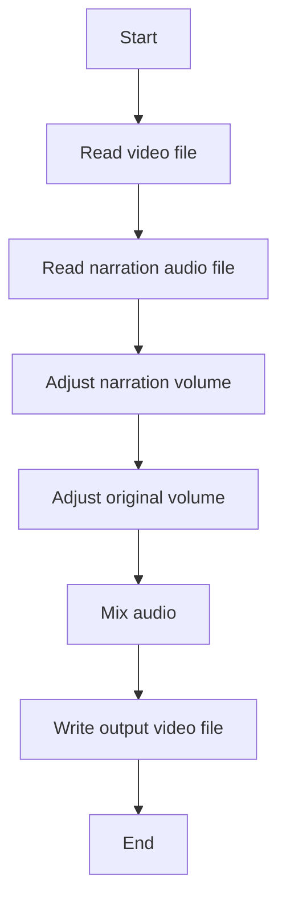

#### 带注释源码

```python
def _add_narration_to_video(
    self,
    video_abspath: str,
    audio_abspath: str,
    output_abspath: str,
    mix_mode: str,
    narration_volume: float,
    original_volume: float,
) -> None:
    # ... (rest of the method implementation)
```


### `get_video_codecs`

Extracts the video and audio codecs from a given output file path.

参数：

- `output_abspath`：`str`，The path to the output file from which to extract codecs.

返回值：`tuple`，A tuple containing the video codec and audio codec as strings.

#### 流程图

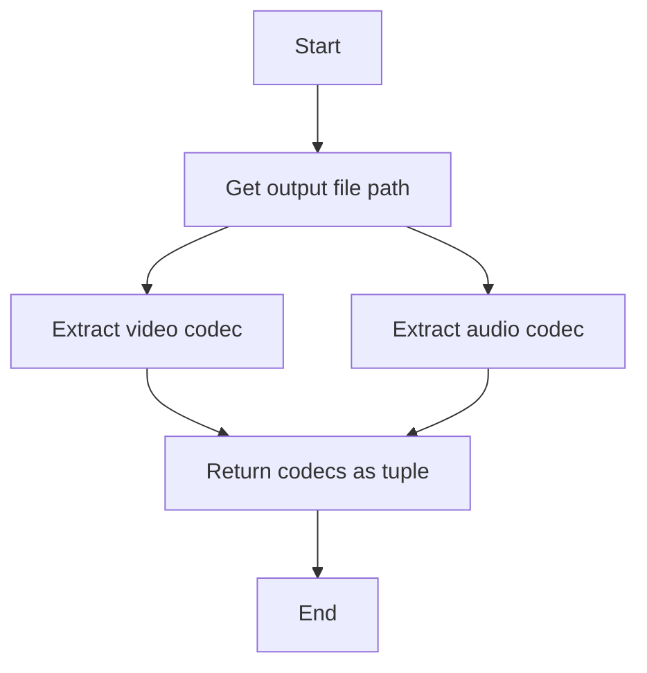

#### 带注释源码

```python
def get_video_codecs(output_abspath: str) -> tuple:
    """Extracts the video and audio codecs from a given output file path."""
    # Extract the file extension
    _, file_extension = os.path.splitext(output_abspath)

    # Determine the codec based on the file extension
    if file_extension.lower() in ['.mp4', '.mov']:
        video_codec = 'libx264'
        audio_codec = 'aac'
    elif file_extension.lower() in ['.avi']:
        video_codec = 'mpeg4'
        audio_codec = 'pcm_s16le'
    else:
        raise ValueError(f"Unsupported file extension: {file_extension}")

    return video_codec, audio_codec
```


### extract_source_name

Extracts the source name from a given file path.

参数：

- `file_path`：`str`，The file path from which to extract the source name.

返回值：`str`，The extracted source name.

#### 流程图

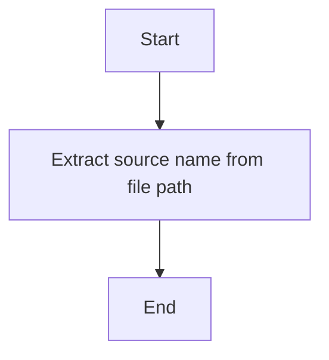

#### 带注释源码

```python
def extract_source_name(file_path: str) -> str:
    """Extracts the source name from a given file path."""
    return os.path.basename(file_path)
```


### `_generate_narration_audio`

Generate narration audio via ElevenLabs API.

参数：

- `api_key`：`str`，ElevenLabs API key for voice synthesis
- `script`：`str`，Narration script text
- `voice_id`：`str`，ElevenLabs voice ID
- `model_id`：`Literal`，ElevenLabs TTS model

返回值：`bytes`，Generated audio content

#### 流程图

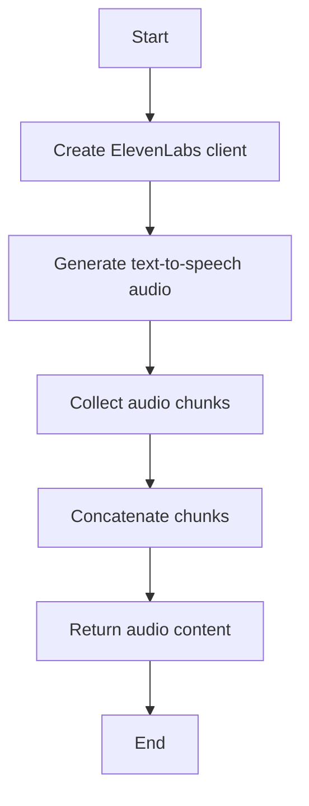

#### 带注释源码

```python
def _generate_narration_audio(
    self, api_key: str, script: str, voice_id: str, model_id: str
) -> bytes:
    """Generate narration audio via ElevenLabs API."""
    client = ElevenLabs(api_key=api_key)
    audio_generator = client.text_to_speech.convert(
        voice_id=voice_id,
        text=script,
        model_id=model_id,
    )
    # The SDK returns a generator, collect all chunks
    return b"".join(audio_generator)
```


### `_add_narration_to_video`

Add narration audio to video.

参数：

- `video_abspath`：`str`，The absolute path to the input video file.
- `audio_abspath`：`str`，The absolute path to the input audio file containing the narration.
- `output_abspath`：`str`，The absolute path to the output video file where the narration will be added.
- `mix_mode`：`str`，The mode to combine the narration with the original audio. Can be 'replace', 'mix', or 'ducking'.
- `narration_volume`：`float`，The volume of the narration audio.
- `original_volume`：`float`，The volume of the original audio when mixing.

返回值：`None`，No return value, the function modifies the video file in place.

#### 流程图

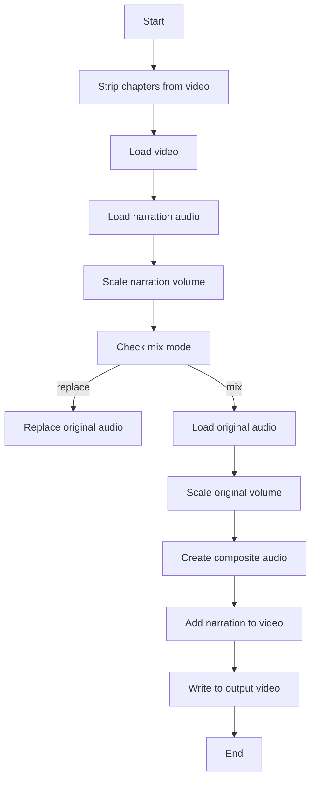

#### 带注释源码

```python
def _add_narration_to_video(
    self,
    video_abspath: str,
    audio_abspath: str,
    output_abspath: str,
    mix_mode: str,
    narration_volume: float,
    original_volume: float,
) -> None:
    video = None
    final = None
    narration_original = None
    narration_scaled = None
    original = None

    try:
        strip_chapters_inplace(video_abspath)
        video = VideoFileClip(video_abspath)
        narration_original = AudioFileClip(audio_abspath)
        narration_scaled = narration_original.with_volume_scaled(narration_volume)
        narration = narration_scaled

        if mix_mode == "replace":
            final_audio = narration
        elif mix_mode == "mix":
            if video.audio:
                original = video.audio.with_volume_scaled(original_volume)
                final_audio = CompositeAudioClip([original, narration])
            else:
                final_audio = narration
        else:  # ducking - apply stronger attenuation
            if video.audio:
                # Ducking uses a much lower volume for original audio
                ducking_volume = original_volume * 0.3
                original = video.audio.with_volume_scaled(ducking_volume)
                final_audio = CompositeAudioClip([original, narration])
            else:
                final_audio = narration

        final = video.with_audio(final_audio)
        video_codec, audio_codec = get_video_codecs(output_abspath)
        final.write_videofile(
            output_abspath, codec=video_codec, audio_codec=audio_codec
        )

    finally:
        if original:
            original.close()
        if narration_scaled:
            narration_scaled.close()
        if narration_original:
            narration_original.close()
        if final:
            final.close()
        if video:
            video.close()
```


### `_add_narration_to_video`

Add narration audio to video.

参数：

- `video_abspath`：`str`，The absolute path to the input video file.
- `audio_abspath`：`str`，The absolute path to the input audio file containing the narration.
- `output_abspath`：`str`，The absolute path to the output video file where the narration will be added.
- `mix_mode`：`str`，The mode to combine the narration with the original audio. Can be 'replace', 'mix', or 'ducking'.
- `narration_volume`：`float`，The volume of the narration audio.
- `original_volume`：`float`，The volume of the original audio when mixing.

返回值：`None`，No return value, the function modifies the video file in place.

#### 流程图


#### 带注释源码

```python
def _add_narration_to_video(
    self,
    video_abspath: str,
    audio_abspath: str,
    output_abspath: str,
    mix_mode: str,
    narration_volume: float,
    original_volume: float,
) -> None:
    video = None
    final = None
    narration_original = None
    narration_scaled = None
    original = None

    try:
        strip_chapters_inplace(video_abspath)
        video = VideoFileClip(video_abspath)
        narration_original = AudioFileClip(audio_abspath)
        narration_scaled = narration_original.with_volume_scaled(narration_volume)
        narration = narration_scaled

        if mix_mode == "replace":
            final_audio = narration
        elif mix_mode == "mix":
            if video.audio:
                original = video.audio.with_volume_scaled(original_volume)
                final_audio = CompositeAudioClip([original, narration])
            else:
                final_audio = narration
        else:  # ducking - apply stronger attenuation
            if video.audio:
                # Ducking uses a much lower volume for original audio
                ducking_volume = original_volume * 0.3
                original = video.audio.with_volume_scaled(ducking_volume)
                final_audio = CompositeAudioClip([original, narration])
            else:
                final_audio = narration

        final = video.with_audio(final_audio)
        video_codec, audio_codec = get_video_codecs(output_abspath)
        final.write_videofile(
            output_abspath, codec=video_codec, audio_codec=audio_codec
        )

    finally:
        if original:
            original.close()
        if narration_scaled:
            narration_scaled.close()
        if narration_original:
            narration_original.close()
        if final:
            final.close()
        if video:
            video.close()
```


### `_add_narration_to_video`

Add narration audio to video.

参数：

- `video_abspath`：`str`，The absolute path to the input video file.
- `audio_abspath`：`str`，The absolute path to the input audio file containing the narration.
- `output_abspath`：`str`，The absolute path to the output video file where the narration will be added.
- `mix_mode`：`str`，The mode to combine the narration with the original audio. Can be 'replace', 'mix', or 'ducking'.
- `narration_volume`：`float`，The volume of the narration audio.
- `original_volume`：`float`，The volume of the original audio when mixing.

返回值：`None`，No return value, the function modifies the video file in place.

#### 流程图

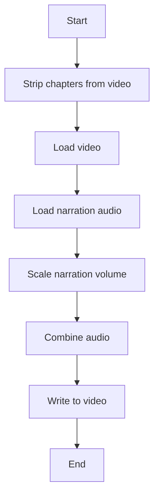

#### 带注释源码

```python
def _add_narration_to_video(
    self,
    video_abspath: str,
    audio_abspath: str,
    output_abspath: str,
    mix_mode: str,
    narration_volume: float,
    original_volume: float,
) -> None:
    video = None
    final = None
    narration_original = None
    narration_scaled = None
    original = None

    try:
        strip_chapters_inplace(video_abspath)
        video = VideoFileClip(video_abspath)
        narration_original = AudioFileClip(audio_abspath)
        narration_scaled = narration_original.with_volume_scaled(narration_volume)
        narration = narration_scaled

        if mix_mode == "replace":
            final_audio = narration
        elif mix_mode == "mix":
            if video.audio:
                original = video.audio.with_volume_scaled(original_volume)
                final_audio = CompositeAudioClip([original, narration])
            else:
                final_audio = narration
        else:  # ducking - apply stronger attenuation
            if video.audio:
                # Ducking uses a much lower volume for original audio
                ducking_volume = original_volume * 0.3
                original = video.audio.with_volume_scaled(ducking_volume)
                final_audio = CompositeAudioClip([original, narration])
            else:
                final_audio = narration

        final = video.with_audio(final_audio)
        video_codec, audio_codec = get_video_codecs(output_abspath)
        final.write_videofile(
            output_abspath, codec=video_codec, audio_codec=audio_codec
        )

    finally:
        if original:
            original.close()
        if narration_scaled:
            narration_scaled.close()
        if narration_original:
            narration_original.close()
        if final:
            final.close()
        if video:
            video.close()
```


### os.makedirs

创建所有必要的目录。

参数：

- `path`：`str`，要创建的目录路径。
- `exist_ok`：`bool`，如果目录已存在，则不抛出异常。

返回值：`None`。

#### 流程图

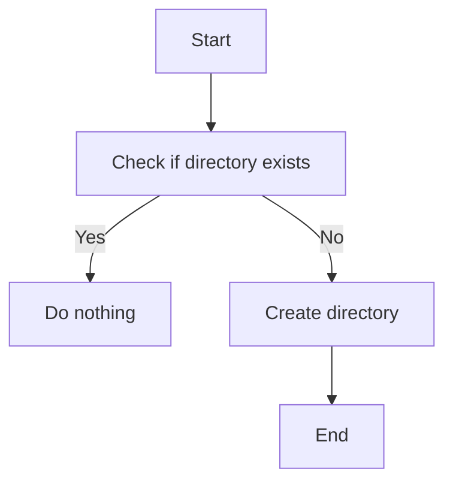

#### 带注释源码

```python
os.makedirs(os.path.dirname(audio_abspath), exist_ok=True)
```


### `_generate_narration_audio`

Generate narration audio via ElevenLabs API.

参数：

- `api_key`：`str`，ElevenLabs API key for voice synthesis
- `script`：`str`，Narration script text
- `voice_id`：`str`，ElevenLabs voice ID
- `model_id`：`Literal`，ElevenLabs TTS model

返回值：`bytes`，Generated audio content

#### 流程图


#### 带注释源码

```python
def _generate_narration_audio(
    self, api_key: str, script: str, voice_id: str, model_id: str
) -> bytes:
    """Generate narration audio via ElevenLabs API."""
    client = ElevenLabs(api_key=api_key)
    audio_generator = client.text_to_speech.convert(
        voice_id=voice_id,
        text=script,
        model_id=model_id,
    )
    # The SDK returns a generator, collect all chunks
    return b"".join(audio_generator)
```


### `_add_narration_to_video`

Add narration audio to video.

参数：

- `video_abspath`：`str`，The absolute path to the input video file.
- `audio_abspath`：`str`，The absolute path to the input audio file containing the narration.
- `output_abspath`：`str`，The absolute path to the output video file where the narration will be added.
- `mix_mode`：`str`，The mode to combine the narration with the original audio. Can be 'replace', 'mix', or 'ducking'.
- `narration_volume`：`float`，The volume of the narration audio.
- `original_volume`：`float`，The volume of the original audio when mixing.

返回值：`None`，No return value, the function modifies the video file in place.

#### 流程图


#### 带注释源码

```python
def _add_narration_to_video(
    self,
    video_abspath: str,
    audio_abspath: str,
    output_abspath: str,
    mix_mode: str,
    narration_volume: float,
    original_volume: float,
) -> None:
    video = None
    final = None
    narration_original = None
    narration_scaled = None
    original = None

    try:
        strip_chapters_inplace(video_abspath)
        video = VideoFileClip(video_abspath)
        narration_original = AudioFileClip(audio_abspath)
        narration_scaled = narration_original.with_volume_scaled(narration_volume)
        narration = narration_scaled

        if mix_mode == "replace":
            final_audio = narration
        elif mix_mode == "mix":
            if video.audio:
                original = video.audio.with_volume_scaled(original_volume)
                final_audio = CompositeAudioClip([original, narration])
            else:
                final_audio = narration
        else:  # ducking - apply stronger attenuation
            if video.audio:
                # Ducking uses a much lower volume for original audio
                ducking_volume = original_volume * 0.3
                original = video.audio.with_volume_scaled(ducking_volume)
                final_audio = CompositeAudioClip([original, narration])
            else:
                final_audio = narration

        final = video.with_audio(final_audio)
        video_codec, audio_codec = get_video_codecs(output_abspath)
        final.write_videofile(
            output_abspath, codec=video_codec, audio_codec=audio_codec
        )

    finally:
        if original:
            original.close()
        if narration_scaled:
            narration_scaled.close()
        if narration_original:
            narration_original.close()
        if final:
            final.close()
        if video:
            video.close()
```


### `_add_narration_to_video`

Add narration audio to video.

参数：

- `video_abspath`：`str`，The absolute path to the input video file.
- `audio_abspath`：`str`，The absolute path to the input audio file containing the narration.
- `output_abspath`：`str`，The absolute path to the output video file where the narration will be added.
- `mix_mode`：`str`，The mode to combine the narration with the original audio. Can be 'replace', 'mix', or 'ducking'.
- `narration_volume`：`float`，The volume of the narration audio.
- `original_volume`：`float`，The volume of the original audio when mixing.

返回值：`None`，No return value, the function modifies the video file in place.

#### 流程图

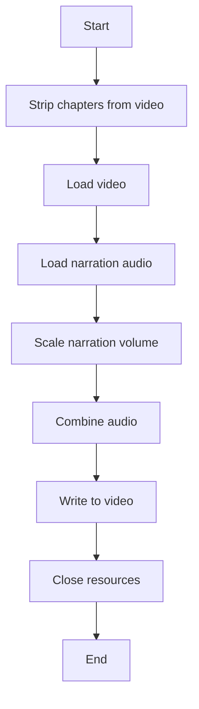

#### 带注释源码

```python
def _add_narration_to_video(
    self,
    video_abspath: str,
    audio_abspath: str,
    output_abspath: str,
    mix_mode: str,
    narration_volume: float,
    original_volume: float,
) -> None:
    video = None
    final = None
    narration_original = None
    narration_scaled = None
    original = None

    try:
        strip_chapters_inplace(video_abspath)
        video = VideoFileClip(video_abspath)
        narration_original = AudioFileClip(audio_abspath)
        narration_scaled = narration_original.with_volume_scaled(narration_volume)
        narration = narration_scaled

        if mix_mode == "replace":
            final_audio = narration
        elif mix_mode == "mix":
            if video.audio:
                original = video.audio.with_volume_scaled(original_volume)
                final_audio = CompositeAudioClip([original, narration])
            else:
                final_audio = narration
        else:  # ducking - apply stronger attenuation
            if video.audio:
                # Ducking uses a much lower volume for original audio
                ducking_volume = original_volume * 0.3
                original = video.audio.with_volume_scaled(ducking_volume)
                final_audio = CompositeAudioClip([original, narration])
            else:
                final_audio = narration

        final = video.with_audio(final_audio)
        video_codec, audio_codec = get_video_codecs(output_abspath)
        final.write_videofile(
            output_abspath, codec=video_codec, audio_codec=audio_codec
        )

    finally:
        if original:
            original.close()
        if narration_scaled:
            narration_scaled.close()
        if narration_original:
            narration_original.close()
        if final:
            final.close()
        if video:
            video.close()
```


### `_store_input_video`

Store input video. Extracted for testability.

参数：

- `execution_context`：`ExecutionContext`，The execution context of the block.
- `file`：`MediaFileType`，The input video file to be stored.

返回值：`MediaFileType`，The path or data URI of the stored video.

#### 流程图

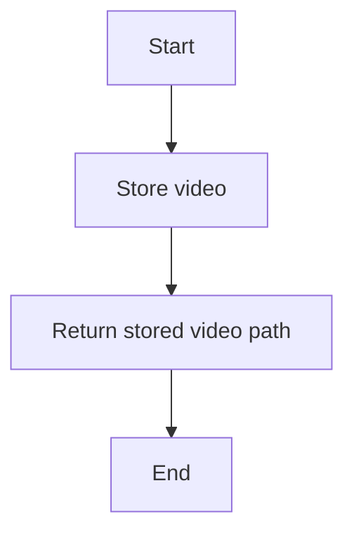

#### 带注释源码

```python
async def _store_input_video(
    self, execution_context: ExecutionContext, file: MediaFileType
) -> MediaFileType:
    """Store input video. Extracted for testability."""
    return await store_media_file(
        file=file,
        execution_context=execution_context,
        return_format="for_local_processing",
    )
```


### VideoNarrationBlock._store_output_video

Store output video. Extracted for testability.

参数：

- `execution_context`：`ExecutionContext`，The execution context of the block.
- `file`：`MediaFileType`，The file to be stored.

返回值：`MediaFileType`，The path or data URI of the stored file.

#### 流程图

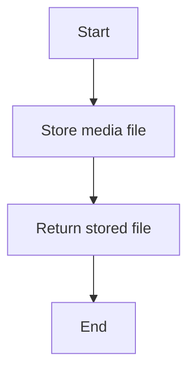

#### 带注释源码

```python
async def _store_output_video(
    self, execution_context: ExecutionContext, file: MediaFileType
) -> MediaFileType:
    """Store output video. Extracted for testability."""
    return await store_media_file(
        file=file,
        execution_context=execution_context,
        return_format="for_block_output",
    )
```


### `_generate_narration_audio`

Generate narration audio via ElevenLabs API.

参数：

- `api_key`：`str`，ElevenLabs API key for voice synthesis
- `script`：`str`，Narration script text
- `voice_id`：`str`，ElevenLabs voice ID
- `model_id`：`Literal`，ElevenLabs TTS model

返回值：`bytes`，Generated audio content

#### 流程图

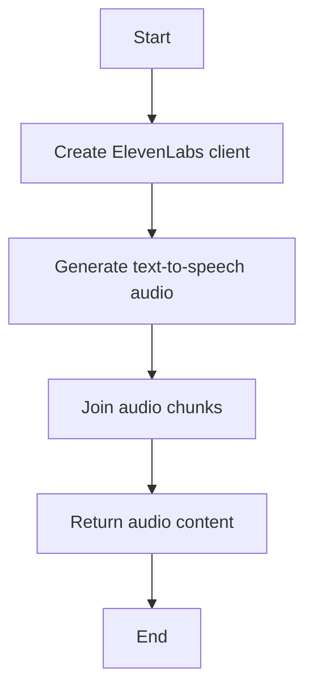

#### 带注释源码

```python
def _generate_narration_audio(
    self, api_key: str, script: str, voice_id: str, model_id: str
) -> bytes:
    """Generate narration audio via ElevenLabs API."""
    client = ElevenLabs(api_key=api_key)
    audio_generator = client.text_to_speech.convert(
        voice_id=voice_id,
        text=script,
        model_id=model_id,
    )
    # The SDK returns a generator, collect all chunks
    return b"".join(audio_generator)
```


### VideoNarrationBlock._add_narration_to_video

Add narration audio to video.

参数：

- `video_abspath`：`str`，The absolute path to the input video file.
- `audio_abspath`：`str`，The absolute path to the narration audio file.
- `output_abspath`：`str`，The absolute path to the output video file where the narration will be added.
- `mix_mode`：`str`，The mode to mix the narration with the original audio. Can be 'replace', 'mix', or 'ducking'.
- `narration_volume`：`float`，The volume of the narration audio.
- `original_volume`：`float`，The volume of the original audio when mixing.

返回值：`None`，No return value, the function modifies the output video in place.

#### 流程图

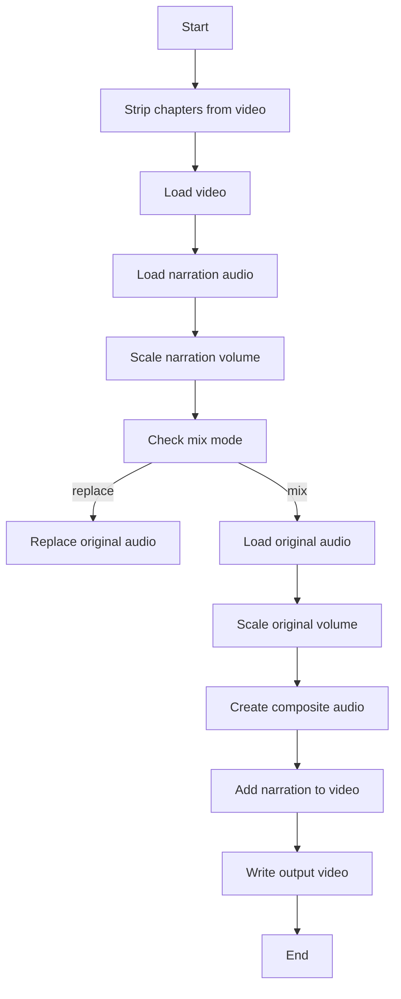

#### 带注释源码

```python
def _add_narration_to_video(
    self,
    video_abspath: str,
    audio_abspath: str,
    output_abspath: str,
    mix_mode: str,
    narration_volume: float,
    original_volume: float,
) -> None:
    video = None
    final = None
    narration_original = None
    narration_scaled = None
    original = None

    try:
        strip_chapters_inplace(video_abspath)
        video = VideoFileClip(video_abspath)
        narration_original = AudioFileClip(audio_abspath)
        narration_scaled = narration_original.with_volume_scaled(narration_volume)
        narration = narration_scaled

        if mix_mode == "replace":
            final_audio = narration
        elif mix_mode == "mix":
            if video.audio:
                original = video.audio.with_volume_scaled(original_volume)
                final_audio = CompositeAudioClip([original, narration])
            else:
                final_audio = narration
        else:  # ducking - apply stronger attenuation
            if video.audio:
                # Ducking uses a much lower volume for original audio
                ducking_volume = original_volume * 0.3
                original = video.audio.with_volume_scaled(ducking_volume)
                final_audio = CompositeAudioClip([original, narration])
            else:
                final_audio = narration

        final = video.with_audio(final_audio)
        video_codec, audio_codec = get_video_codecs(output_abspath)
        final.write_videofile(
            output_abspath, codec=video_codec, audio_codec=audio_codec
        )

    finally:
        if original:
            original.close()
        if narration_scaled:
            narration_scaled.close()
        if narration_original:
            narration_original.close()
        if final:
            final.close()
        if video:
            video.close()
```


### VideoNarrationBlock.run

This method runs the VideoNarrationBlock, which generates AI voice narration and adds it to a video.

参数：

- `input_data`：`Input`，The input data for the block, including video input, script, credentials, voice ID, model ID, mix mode, and narration volume.
- `credentials`：`ElevenLabsCredentials`，The credentials for the ElevenLabs API.
- `execution_context`：`ExecutionContext`，The execution context for the block.
- `node_exec_id`：`str`，The execution ID for the node.

返回值：`BlockOutput`，The output of the block, including the path or data URI of the video with narration and the generated audio file.

#### 流程图

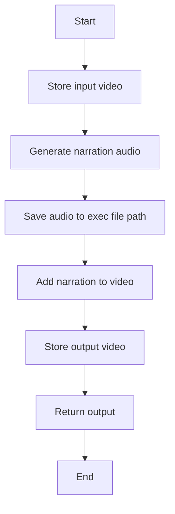

#### 带注释源码

```python
async def run(
    self,
    input_data: Input,
    *,
    credentials: ElevenLabsCredentials,
    execution_context: ExecutionContext,
    node_exec_id: str,
    **kwargs,
) -> BlockOutput:
    try:
        assert execution_context.graph_exec_id is not None

        # Store the input video locally
        local_video_path = await self._store_input_video(
            execution_context, input_data.video_in
        )
        video_abspath = get_exec_file_path(
            execution_context.graph_exec_id, local_video_path
        )

        # Generate narration audio via ElevenLabs
        audio_content = self._generate_narration_audio(
            credentials.api_key.get_secret_value(),
            input_data.script,
            input_data.voice_id,
            input_data.model_id,
        )

        # Save audio to exec file path
        audio_filename = MediaFileType(f"{node_exec_id}_narration.mp3")
        audio_abspath = get_exec_file_path(
            execution_context.graph_exec_id, audio_filename
        )
        os.makedirs(os.path.dirname(audio_abspath), exist_ok=True)
        with open(audio_abspath, "wb") as f:
            f.write(audio_content)

        # Add narration to video
        source = extract_source_name(local_video_path)
        output_filename = MediaFileType(f"{node_exec_id}_narrated_{source}.mp4")
        output_abspath = get_exec_file_path(
            execution_context.graph_exec_id, output_filename
        )

        self._add_narration_to_video(
            video_abspath,
            audio_abspath,
            output_abspath,
            input_data.mix_mode,
            input_data.narration_volume,
            input_data.original_volume,
        )

        # Return as workspace path or data URI based on context
        video_out = await self._store_output_video(
            execution_context, output_filename
        )
        audio_out = await self._store_output_video(
            execution_context, audio_filename
        )

        yield "video_out", video_out
        yield "audio_file", audio_out

    except Exception as e:
        raise BlockExecutionError(
            message=f"Failed to add narration: {e}",
            block_name=self.name,
            block_id=str(self.id),
        ) from e
```


## 关键组件


### 张量索引与惰性加载

用于高效地处理和索引大型数据集，延迟加载数据以减少内存消耗。

### 反量化支持

提供对量化策略的支持，以优化模型性能和资源使用。

### 量化策略

实现不同的量化方法，如整数量化、浮点量化等，以减少模型大小和提高推理速度。


## 问题及建议


### 已知问题

-   **全局变量和函数依赖性**：代码中使用了全局变量和函数，如`TEST_CREDENTIALS`、`TEST_CREDENTIALS_INPUT`、`ElevenLabsCredentials`、`ElevenLabsCredentialsInput`、`extract_source_name`、`get_video_codecs`、`strip_chapters_inplace`等，这些可能增加了代码的耦合性和维护难度。
-   **异常处理**：`run`方法中的异常处理较为简单，仅捕获了所有异常并抛出了`BlockExecutionError`。可能需要更详细的异常处理来提供更具体的错误信息。
-   **资源管理**：在`_add_narration_to_video`方法中，虽然使用了`try...finally`结构来关闭文件和视频对象，但在某些情况下，资源可能不会被正确释放，特别是在异常发生时。
-   **代码重复**：`_store_input_video`和`_store_output_video`方法在`run`方法中被调用，这可能导致代码重复。

### 优化建议

-   **减少全局依赖**：考虑将全局变量和函数封装在类中，以减少代码的耦合性和提高可维护性。
-   **改进异常处理**：在`run`方法中，根据不同的异常类型提供更具体的错误信息，以便于调试和错误追踪。
-   **优化资源管理**：确保在所有情况下都正确关闭文件和视频对象，特别是在异常发生时。
-   **减少代码重复**：将`_store_input_video`和`_store_output_video`方法提取为类方法或使用其他设计模式来减少代码重复。
-   **代码注释**：增加代码注释，特别是对于复杂的逻辑和算法，以提高代码的可读性。
-   **单元测试**：编写单元测试来验证代码的正确性和稳定性。
-   **性能优化**：考虑性能优化，例如在处理大量视频或音频文件时，使用异步操作或批处理技术。


## 其它


### 设计目标与约束

- 设计目标：
  - 实现一个模块，能够将AI生成的语音添加到视频中。
  - 提供一个用户友好的接口，允许用户指定语音脚本、语音ID、TTS模型等参数。
  - 确保生成的视频和音频质量符合预期。
  - 支持多种输入视频格式和输出视频格式。
- 约束：
  - 必须使用ElevenLabs API进行语音合成。
  - 必须使用moviepy库进行视频处理。
  - 必须遵循项目代码风格和命名规范。

### 错误处理与异常设计

- 错误处理：
  - 在执行过程中，如果遇到任何异常，应捕获异常并抛出`BlockExecutionError`。
  - `BlockExecutionError`应包含错误信息、块名称和块ID。
- 异常设计：
  - 对于ElevenLabs API调用失败，应捕获`ElevenLabsException`并转换为`BlockExecutionError`。
  - 对于moviepy库调用失败，应捕获`moviepy.editor.EditorError`并转换为`BlockExecutionError`。

### 数据流与状态机

- 数据流：
  - 输入视频通过`_store_input_video`方法存储在本地。
  - 通过ElevenLabs API生成语音音频。
  - 将生成的音频添加到视频中。
  - 输出的视频和音频通过`_store_output_video`方法存储。
- 状态机：
  - 状态：初始化、存储输入视频、生成语音音频、添加语音到视频、存储输出视频、完成。
  - 转换：从初始化到存储输入视频，从存储输入视频到生成语音音频，依此类推。

### 外部依赖与接口契约

- 外部依赖：
  - ElevenLabs API
  - moviepy库
  - backend.util.exceptions
  - backend.util.file
- 接口契约：
  - ElevenLabs API：提供文本到语音合成功能。
  - moviepy库：提供视频和音频处理功能。
  - backend.util.exceptions：提供异常处理功能。
  - backend.util.file：提供文件存储功能。

    