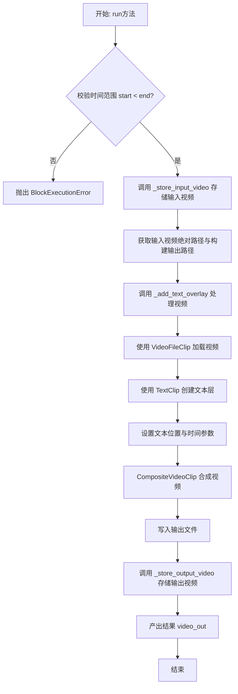
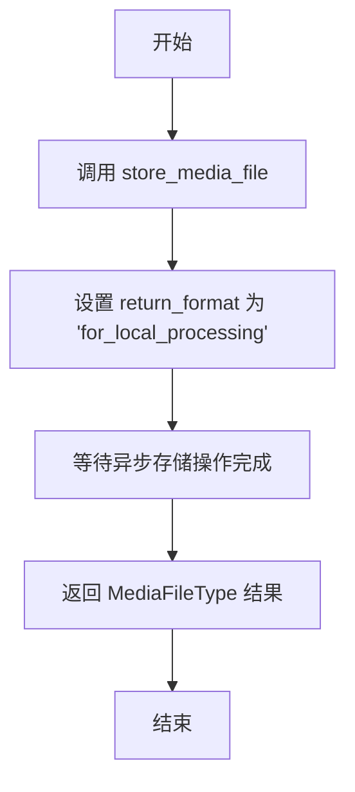
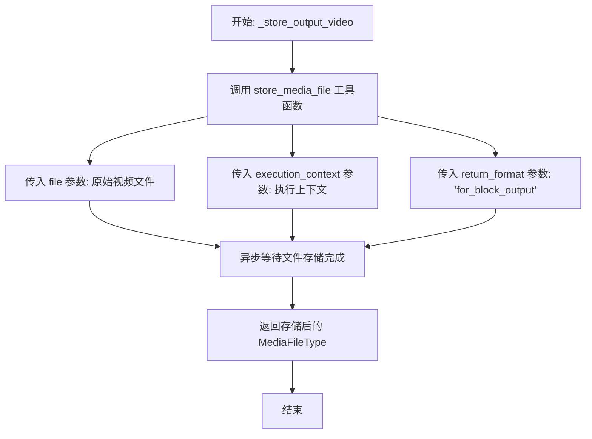
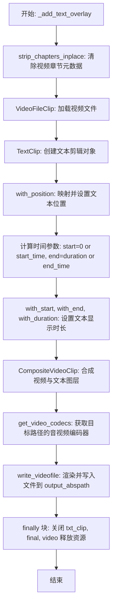
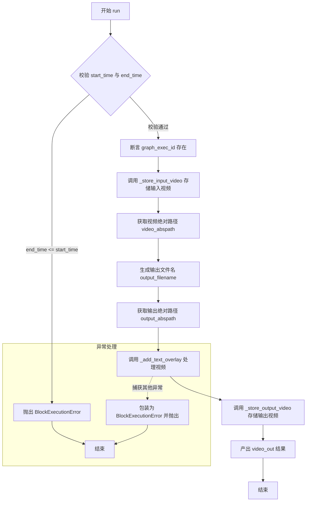

# `AutoGPT\autogpt_platform\backend\backend\blocks\video\text_overlay.py` 详细设计文档

该代码定义了一个视频文本叠加处理模块（Block），核心功能是利用MoviePy库在输入的视频文件上添加自定义文本字幕。它支持配置文本的位置、显示时间段（开始/结束时间）、字体大小、颜色及背景色，并处理视频文件的本地存储与最终输出，包含参数校验与错误处理机制。

## 整体流程



## 类结构

```
VideoTextOverlayBlock (Block)
├── Input (BlockSchemaInput)
│   ├── video_in: MediaFileType
│   ├── text: str
│   ├── position: Literal
│   ├── start_time: float | None
│   ├── end_time: float | None
│   ├── font_size: int
│   ├── font_color: str
│   └── bg_color: str | None
├── Output (BlockSchemaOutput)
│   └── video_out: MediaFileType
├── __init__
├── _store_input_video
├── _store_output_video
├── _add_text_overlay
└── run
```

## 全局变量及字段


### `VideoTextOverlayBlock.Input.video_in`
    
Input video (URL, data URI, or local path)

类型：`MediaFileType`
    


### `VideoTextOverlayBlock.Input.text`
    
Text to overlay on video

类型：`str`
    


### `VideoTextOverlayBlock.Input.position`
    
Position of text on screen

类型：`Literal["top", "center", "bottom", "top-left", "top-right", "bottom-left", "bottom-right"]`
    


### `VideoTextOverlayBlock.Input.start_time`
    
When to show text (seconds). None = entire video

类型：`float | None`
    


### `VideoTextOverlayBlock.Input.end_time`
    
When to hide text (seconds). None = until end

类型：`float | None`
    


### `VideoTextOverlayBlock.Input.font_size`
    
Font size

类型：`int`
    


### `VideoTextOverlayBlock.Input.font_color`
    
Font color (hex or name)

类型：`str`
    


### `VideoTextOverlayBlock.Input.bg_color`
    
Background color behind text (None for transparent)

类型：`str | None`
    


### `VideoTextOverlayBlock.Output.video_out`
    
Video with text overlay (path or data URI)

类型：`MediaFileType`
    
    

## 全局函数及方法


### `VideoTextOverlayBlock.__init__`

初始化视频文本叠加块实例。该方法主要调用父类 `Block` 的构造函数，配置块的唯一标识符、描述、类别、输入输出数据模式，并设置测试相关的输入、输出及模拟函数。此外，该块默认处于禁用状态，注释指出原因与 ImageMagick 安全策略有关。

参数：

- `self`：`VideoTextOverlayBlock`，类的实例本身

返回值：`None`，无返回值

#### 流程图

```mermaid
flowchart TD
    A[开始: __init__] --> B[定义块元数据<br/>ID, 描述, 类别]
    A --> C[定义数据模式<br/>Input Schema, Output Schema]
    A --> D[设置状态与测试配置<br/>disabled=True, test_input, test_output, test_mock]
    B --> E[调用 super().__init__ 传入所有配置参数]
    C --> E
    D --> E
    E --> F[结束]
```

#### 带注释源码

```python
    def __init__(self):
        super().__init__(
            # 块的唯一标识符
            id="8ef14de6-cc90-430a-8cfa-3a003be92454",
            # 块的功能描述
            description="Add text overlay/caption to video",
            # 块所属的分类：多媒体
            categories={BlockCategory.MULTIMEDIA},
            # 定义输入数据的模式结构，包含视频路径、文本、位置等字段
            input_schema=self.Input,
            # 定义输出数据的模式结构，包含处理后的视频路径
            output_schema=self.Output,
            # 设置为禁用状态，注释说明需要锁定 ImageMagick 安全策略后才能启用
            disabled=True,  # Disable until we can lockdown imagemagick security policy
            # 定义用于测试的输入数据样例
            test_input={"video_in": "/tmp/test.mp4", "text": "Hello World"},
            # 定义预期的测试输出格式
            test_output=[("video_out", str)],
            # 定义测试时的模拟函数，用于替代实际耗时的视频处理逻辑
            test_mock={
                "_add_text_overlay": lambda *args: None,
                "_store_input_video": lambda *args, **kwargs: "test.mp4",
                "_store_output_video": lambda *args, **kwargs: "overlay_test.mp4",
            },
        )
```


### `VideoTextOverlayBlock._store_input_video`

Store input video. Extracted for testability.

参数：

- `execution_context`：`ExecutionContext`，执行上下文对象，用于追踪执行过程中的相关信息
- `file`：`MediaFileType`，输入的视频文件对象，可以是 URL、数据 URI 或本地路径

返回值：`MediaFileType`，存储后的视频文件路径，格式化为适合本地处理的形式

#### 流程图



#### 带注释源码

```python
    async def _store_input_video(
        self, execution_context: ExecutionContext, file: MediaFileType
    ) -> MediaFileType:
        """Store input video. Extracted for testability."""
        # 调用通用的媒体文件存储工具函数
        # 指定 return_format 为 "for_local_processing"，意味着返回的路径适合在本地进行读写操作（如后续的 moviepy 处理）
        return await store_media_file(
            file=file,
            execution_context=execution_context,
            return_format="for_local_processing",
        )
```


### `VideoTextOverlayBlock._store_output_video`

存储输出视频文件。该方法被提取出来以便于测试，通过调用工具函数将生成的视频文件保存到适当的存储位置。

参数：

- `execution_context`：`ExecutionContext`，执行上下文对象，包含图执行ID等运行时信息
- `file`：`MediaFileType`，待存储的视频文件对象（可以是本地路径或数据URI）

返回值：`MediaFileType`，存储后的视频文件路径或数据URI，用于作为Block的输出

#### 流程图



#### 带注释源码

```python
    async def _store_output_video(
        self, execution_context: ExecutionContext, file: MediaFileType
    ) -> MediaFileType:
        """Store output video. Extracted for testability."""
        # 调用 store_media_file 函数异步存储文件
        # return_format 设置为 "for_block_output"，确保返回格式适合作为Block的最终输出
        return await store_media_file(
            file=file,
            execution_context=execution_context,
            return_format="for_block_output",
        )
```


### `VideoTextOverlayBlock._add_text_overlay`

该方法负责使用 MoviePy 库在给定的视频文件上添加文本叠加层。它加载视频，创建一个带有指定字体、颜色和背景的文本剪辑，根据参数计算文本的位置和时间范围，将文本与视频合成，并将最终结果写入指定的输出路径。

参数：

-  `video_abspath`：`str`，输入视频文件的绝对路径。
-  `output_abspath`：`str`，输出视频文件的绝对路径。
-  `text`：`str`，需要叠加在视频上的文本内容。
-  `position`：`str`，文本在屏幕上的位置（如 "top", "center", "bottom" 等）。
-  `start_time`：`float | None`，文本开始显示的时间点（秒），None 表示从头开始。
-  `end_time`：`float | None`，文本结束显示的时间点（秒），None 表示直到视频结束。
-  `font_size`：`int`，文本字体的大小。
-  `font_color`：`str`，文本的颜色（十六进制值或颜色名称）。
-  `bg_color`：`str | None`，文本背景的颜色，None 表示透明背景。

返回值：`None`，该方法执行副作用（将处理后的视频写入磁盘），不返回任何值。

#### 流程图



#### 带注释源码

```python
def _add_text_overlay(
    self,
    video_abspath: str,
    output_abspath: str,
    text: str,
    position: str,
    start_time: float | None,
    end_time: float | None,
    font_size: int,
    font_color: str,
    bg_color: str | None,
) -> None:
    """Add text overlay to video. Extracted for testability."""
    video = None
    final = None
    txt_clip = None
    try:
        # 预处理：移除视频中的章节信息，避免处理冲突
        strip_chapters_inplace(video_abspath)
        # 加载视频文件
        video = VideoFileClip(video_abspath)

        # 创建文本剪辑，设置文本内容、大小、颜色和背景
        txt_clip = TextClip(
            text=text,
            font_size=font_size,
            color=font_color,
            bg_color=bg_color,
        )

        # 位置映射：将字符串位置（如 'top-left'）转换为 MoviePy 需要的坐标元组
        pos_map = {
            "top": ("center", "top"),
            "center": ("center", "center"),
            "bottom": ("center", "bottom"),
            "top-left": ("left", "top"),
            "top-right": ("right", "top"),
            "bottom-left": ("left", "bottom"),
            "bottom-right": ("right", "bottom"),
        }

        # 应用位置设置
        txt_clip = txt_clip.with_position(pos_map[position])

        # 设置时间参数：如果没有指定开始时间，默认为0；没有指定结束时间，默认为视频总时长
        start = start_time or 0
        end = end_time or video.duration
        duration = max(0, end - start)
        # 应用开始时间、结束时间和持续时长
        txt_clip = txt_clip.with_start(start).with_end(end).with_duration(duration)

        # 将视频和文本剪辑合成为一个最终的视频剪辑
        final = CompositeVideoClip([video, txt_clip])
        
        # 根据输出文件路径获取适当的视频和音频编码器
        video_codec, audio_codec = get_video_codecs(output_abspath)
        # 将合成后的视频写入指定路径
        final.write_videofile(
            output_abspath, codec=video_codec, audio_codec=audio_codec
        )

    finally:
        # 资源清理：确保关闭所有剪辑对象，释放内存和文件句柄
        if txt_clip:
            txt_clip.close()
        if final:
            final.close()
        if video:
            video.close()
```


### `VideoTextOverlayBlock.run`

该方法是视频文字叠加块的入口点，负责协调视频处理的全流程。它接收输入参数，验证时间配置，将输入视频存储到本地，调用核心逻辑叠加文字，最后存储并返回处理后的视频文件。

参数：

- `self`：`VideoTextOverlayBlock`，类的实例
- `input_data`：`Input`，包含输入视频、叠加文本、位置、时间范围及字体样式的输入数据模型
- `execution_context`：`ExecutionContext`，执行上下文对象，包含执行ID等信息
- `node_exec_id`：`str`，当前节点执行的唯一标识符
- `**kwargs`：`Any`，额外的关键字参数

返回值：`BlockOutput`，异步生成器，产出包含输出键名和视频文件路径（或数据URI）的元组

#### 流程图



#### 带注释源码

```python
async def run(
    self,
    input_data: Input,
    *,
    execution_context: ExecutionContext,
    node_exec_id: str,
    **kwargs,
) -> BlockOutput:
    # 1. 校验时间范围：如果提供了开始和结束时间，结束时间必须大于开始时间
    if (
        input_data.start_time is not None
        and input_data.end_time is not None
        and input_data.end_time <= input_data.start_time
    ):
        raise BlockExecutionError(
            message=f"end_time ({input_data.end_time}) must be greater than start_time ({input_data.start_time})",
            block_name=self.name,
            block_id=str(self.id),
        )

    try:
        # 确保 graph_exec_id 存在，用于构建文件路径
        assert execution_context.graph_exec_id is not None

        # 2. 将输入视频文件存储到本地，并返回本地路径
        local_video_path = await self._store_input_video(
            execution_context, input_data.video_in
        )
        
        # 3. 构建输入视频的绝对路径
        video_abspath = get_exec_file_path(
            execution_context.graph_exec_id, local_video_path
        )

        # 4. 构建输出文件名（包含节点ID以唯一标识）和绝对路径
        source = extract_source_name(local_video_path)
        output_filename = MediaFileType(f"{node_exec_id}_overlay_{source}.mp4")
        output_abspath = get_exec_file_path(
            execution_context.graph_exec_id, output_filename
        )

        # 5. 调用内部方法执行视频文字叠加的合成操作
        self._add_text_overlay(
            video_abspath,
            output_abspath,
            input_data.text,
            input_data.position,
            input_data.start_time,
            input_data.end_time,
            input_data.font_size,
            input_data.font_color,
            input_data.bg_color,
        )

        # 6. 将处理后的视频存储，并根据上下文返回适合的格式（路径或Data URI）
        video_out = await self._store_output_video(
            execution_context, output_filename
        )

        # 7. 返回处理结果
        yield "video_out", video_out

    except BlockExecutionError:
        # 如果是已知的块执行错误，直接抛出
        raise
    except Exception as e:
        # 捕获其他未预期的异常，包装为 BlockExecutionError 后抛出
        raise BlockExecutionError(
            message=f"Failed to add text overlay: {e}",
            block_name=self.name,
            block_id=str(self.id),
        ) from e
```


## 关键组件


### VideoTextOverlayBlock
继承自 Block 的主类，负责封装视频文字叠加的业务逻辑，包括输入/输出定义、初始化配置以及核心执行流程的调度。

### Input Schema
定义了视频处理所需的输入数据结构，包含视频文件源、文本内容、位置、时间范围及字体样式等参数。

### Output Schema
定义了处理后的视频文件的输出数据结构，用于返回合成后的视频路径或数据 URI。

### Video File Storage
包含 `_store_input_video` 和 `_store_output_video` 方法，负责将传入的媒体文件保存到本地执行环境，并将处理后的文件存储为块输出格式。

### Video Text Overlay Logic (`_add_text_overlay`)
核心处理方法，利用 `moviepy` 库加载视频，创建文本剪辑，根据配置的时间和位置将文本叠加到视频上，并最终合成输出视频文件。

### Execution Workflow (`run`)
执行入口，负责参数校验（如时间有效性）、调用存储逻辑、触发视频处理流程以及捕获和处理执行过程中的异常。


## 问题及建议


### 已知问题

-   当前该 Block 在初始化时显式设置为 `disabled=True`，原因是 ImageMagick 的安全策略尚未锁定，导致功能不可用。
-   `run` 方法虽然是异步的，但在其内部直接调用了同步且计算密集型的 `_add_text_overlay` 方法，这会阻塞事件循环，影响系统的并发处理能力。
-   在创建 `TextClip` 时未显式指定 `font` 参数，依赖系统默认字体，这可能导致在不同操作系统或容器环境（如 Docker）中出现字体渲染不一致或报错的问题。

### 优化建议

-   使用 `asyncio.to_thread` 或 `run_in_executor` 将 `_add_text_overlay` 中的视频处理逻辑卸载到独立的线程池中运行，避免阻塞主异步事件循环。
-   在 `write_videofile` 调用中增加对编码参数的控制（如 `bitrate`, `preset`, `threads` 等），以提升视频渲染速度或优化输出文件大小。
-   增加字体选择参数（`font`），允许用户指定具体的字体文件路径或字体名称，确保跨环境渲染的一致性。
-   增加对 `start_time` 和 `end_time` 的边界检查，确保时间范围在视频实际时长 `duration` 之内，防止越界错误。
-   解决 ImageMagick 的安全策略配置问题，在确保安全的前提下移除 `disabled=True` 限制，恢复服务可用性。


## 其它


### 设计目标与约束

**设计目标**
1.  **视频文字合成**：核心目标是提供一种灵活的方式，将用户指定的文本叠加到输入视频流上。
2.  **可配置性**：允许用户自定义文本内容、显示位置、时间区间（开始/结束时间）、字体大小、字体颜色及背景颜色。
3.  **无缝集成**：作为 Block 系统的一部分，它需要能够处理多种输入格式（URL, data URI, local path），并返回符合系统预期的输出格式。

**约束条件**
1.  **功能禁用状态**：该 Block 当前在初始化时被设置为 `disabled=True`。原因在于依赖的底层库 ImageMagick 存在安全策略风险，必须锁定其安全策略后方可启用。
2.  **参数范围限制**：字体大小被严格限制在 12 到 200 之间（`ge=12, le=200`），以防止渲染失败或资源耗尽。
3.  **时间逻辑**：文本叠加的时间跨度必须合法，`end_time` 必须大于 `start_time`，且不能超出视频本身的时长（由 MoviePy 内部控制，但在代码逻辑中需做基础校验）。
4.  **同步阻塞**：尽管 `run` 方法是异步的，但核心的视频处理逻辑 `_add_text_overlay` 是同步执行的，这意味着在处理大文件时会阻塞事件循环。

### 外部依赖与接口契约

**外部依赖**
1.  **MoviePy**：核心依赖库，用于视频文件的读取 (`VideoFileClip`)、文本生成 (`TextClip`) 以及视频合成与导出 (`CompositeVideoClip`, `write_videofile`)。
2.  **Backend Internal Modules**：
    *   `backend.blocks.video._utils`：提供工具函数如章节剥离 (`strip_chapters_inplace`) 和编码器获取 (`get_video_codecs`)。
    *   `backend.util.file`：处理媒体文件的存储与路径解析 (`store_media_file`, `get_exec_file_path`)。
    *   `backend.data.model`：提供 Schema 定义支持。

**接口契约**
1.  **输入接口 (`Input` Schema)**：
    *   `video_in`: 必须是系统识别的媒体文件类型。
    *   `text`: 非空字符串。
    *   `position`: 枚举类型，必须属于预定义的 9 个位置之一。
    *   `start_time`/`end_time`: 可选浮点数，若提供则必须为非负数。
2.  **执行上下文 (`ExecutionContext`)**：
    *   必须提供有效的 `graph_exec_id`，用于构建文件存储路径。
    *   `execution_context` 需支持文件存储操作 (`store_media_file`)。
3.  **输出接口 (`Output` Schema)**：
    *   `video_out`: 返回处理后的视频文件路径或 Data URI，格式必须符合 `MediaFileType` 规范。

### 错误处理与异常设计

**异常捕获策略**
1.  **输入校验阶段**：
    *   在 `run` 方法入口处，显式检查 `start_time` 和 `end_time` 的逻辑关系。如果 `end_time <= start_time`，立即抛出 `BlockExecutionError`，中断执行并提示具体参数错误。
2.  **执行阶段**：
    *   使用 `try...except` 结构包裹核心业务逻辑。
    *   区分已知异常 (`BlockExecutionError`) 和未知异常 (`Exception`)。
    *   捕获到通用异常时，将其包装为 `BlockExecutionError`，附带上原始异常信息 (`from e`) 以及 Block 的元数据 (`block_name`, `block_id`)，以便上层系统能准确追踪错误来源。
3.  **资源清理保证**：
    *   在 `_add_text_overlay` 方法中使用 `try...finally` 结构。无论视频处理成功与否，均强制释放 `VideoFileClip`、`TextClip` 和 `CompositeVideoClip` 对象占用的内存和文件句柄，防止内存泄漏或文件锁定。

### 数据流与状态机

**数据流**
1.  **输入摄取**：接收 `Input` 数据模型，提取原始视频引用和文本配置。
2.  **本地化存储**：通过 `_store_input_video` 将输入视频（可能是远程 URL）下载并转换为本地可处理的绝对路径 (`video_abspath`)。
3.  **路径构建**：根据 `node_exec_id` 和源文件名构建唯一的输出文件路径。
4.  **流处理**：
    *   加载本地视频。
    *   依据参数生成 TextClip 对象。
    *   应用位置映射 (`pos_map`) 和时间戳裁剪。
    *   使用 `CompositeVideoClip` 合成视频与字幕。
    *   将结果写入输出路径。
5.  **输出封装**：通过 `_store_output_video` 将生成的本地文件转换为系统预期的输出格式（路径或 URI）。
6.  **结果产出**：通过生成器 (`yield`) 返回键值对 `("video_out", video_out)`。

**状态机**
该 Block 本身是无状态的，但在 `_add_text_overlay` 内部存在临时的对象生命周期状态：
*   **Idle**: 初始状态，等待加载。
*   **Loaded**: 视频已加载为 `VideoFileClip` 对象。
*   **Composed**: 文本已合成至 `CompositeVideoClip`。
*   **Written**: 文件已写入磁盘。
*   **Closed (Final)**: 所有资源通过 `finally` 块释放，回归无资源占用状态。

### 资源管理与安全性

**资源管理**
1.  **显式内存释放**：由于 MoviePy 在处理视频时可能消耗大量内存，代码严格遵循“谁创建谁释放”原则。`finally` 块中依次调用 `txt_clip.close()`, `final.close()`, `video.close()`，确保即使在渲染中途崩溃，系统资源也能被及时回收。
2.  **大文件处理**：依赖 `VideoFileClip` 的流式读取能力，但最终合成步骤 (`write_videofile`) 是计算密集型操作，当前设计未体现分块处理或进度回调，对超大视频文件存在超时风险。

**安全性考量**
1.  **ImageMagick 策略**：代码中明确指出 `disabled=True` 是为了防止 ImageMagick 的安全漏洞。这表明在设计上意识到 `TextClip` 可能被利用执行恶意代码（如通过文件路径读取服务器文件）或消耗服务器资源（SVG 解析炸弹等）。
2.  **路径安全**：依赖 `get_exec_file_path` 和 `extract_source_name` 构建沙箱化的文件路径，理论上防止了路径遍历攻击，确保读写操作限制在执行上下文指定的目录内。

    