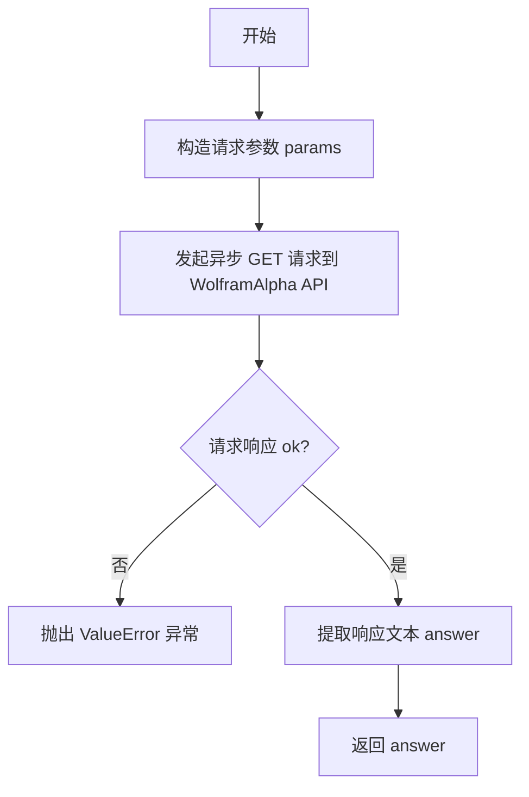

# `AutoGPT\autogpt_platform\backend\backend\blocks\wolfram\_api.py` 详细设计文档

该代码定义了一个异步函数 llm_api_call，旨在通过 API Key 凭证向 WolframAlpha LLM API 发起异步 HTTP GET 请求，以获取针对特定问题的文本答案，并在请求失败时抛出异常。

## 整体流程



## 类结构

```

```

## 全局变量及字段


    

## 全局函数及方法


### `llm_api_call`

该函数通过 WolframAlpha LLM API 获取针对输入问题的回答，使用提供的 API 凭证进行身份验证，并以异步方式处理请求。

参数：

-  `credentials`：`APIKeyCredentials`，用于身份验证的 API 密钥凭证对象。
-  `question`：`str`，发送给 LLM API 的输入问题或提示文本。

返回值：`str`，API 返回的响应文本内容；若响应体为空则返回空字符串。

#### 流程图

```mermaid
flowchart TD
    A([开始]) --> B[构建请求参数 params]
    B --> C[调用 Requests().get 发起异步请求]
    C --> D{检查响应状态 response.ok}
    D -- False (失败) --> E[抛出 ValueError 异常]
    D -- True (成功) --> F[计算 answer 值]
    F --> G{response.text 是否有值?}
    G -- 是 --> H[answer = response.text]
    G -- 否 --> I[answer = ""]
    H --> J([返回 answer])
    I --> J
```

#### 带注释源码

```python
# 从后端 SDK 导入必要的类
from backend.sdk import APIKeyCredentials, Requests

# 定义异步函数 llm_api_call，接收凭证和问题，返回字符串
async def llm_api_call(credentials: APIKeyCredentials, question: str) -> str:
    # 准备请求参数，包括从凭证中获取的 API Key 和用户输入的问题
    params = {"appid": credentials.api_key.get_secret_value(), "input": question}
    
    # 使用 Requests 工具发起异步 GET 请求到 WolframAlpha 的 LLM API 接口
    response = await Requests().get(
        "https://www.wolframalpha.com/api/v1/llm-api", params=params
    )
    
    # 检查 HTTP 响应状态，如果请求不成功（ok 为 False），则抛出包含状态码和错误信息的异常
    if not response.ok:
        raise ValueError(f"API request failed: {response.status} {response.text()}")

    # 处理响应体：如果有文本内容则使用该文本，否则默认使用空字符串
    answer = response.text() if response.text() else ""

    # 返回最终获取的答案
    return answer
```


## 关键组件


### LLM API 调用逻辑
封装了与 WolframAlpha LLM API 进行交互的核心逻辑，包括参数构建、请求发送及结果返回。

### 安全凭证提取
负责从 `APIKeyCredentials` 对象中安全地检索 API 密钥，用于请求的身份验证。

### 异步网络请求处理
使用 `Requests` 客户端执行异步 HTTP GET 请求，以非阻塞方式与外部服务通信。

### 响应校验与错误处理
检查 HTTP 响应状态码，处理请求失败情况并抛出相应异常，同时处理空响应文本。


## 问题及建议


### 已知问题

-   **硬编码 URL**: API 地址 (`https://www.wolframalpha.com/api/v1/llm-api`) 被硬编码在函数内部，缺乏灵活性，难以适应多环境部署（如开发、测试、生产环境切换）或配置变更。
-   **异常处理机制粗糙**: 代码仅使用通用的 `ValueError` 捕获所有非成功响应，未能根据 HTTP 状态码（如 401 认证失败、429 限流、500 服务端错误）区分具体的错误场景，不利于上层调用进行针对性的错误恢复或重试。
-   **缺少超时设置**: HTTP 请求未显式设置超时参数，在网络不稳定或服务端无响应时，可能导致请求无限期挂起，进而耗尽系统资源。
-   **响应体重复读取**: 代码中 `response.text()` 在异常抛出逻辑和返回赋值逻辑中各被调用一次。若底层的 `Requests` 库不支持流缓存，这可能导致无法读取到第二次数据，或引发不必要的性能开销。

### 优化建议

-   **配置化管理**: 将 API 端点 URL、超时时间等参数抽离到配置中心或环境变量中，通过配置对象传入函数，提升代码的可维护性和环境适应性。
-   **细化异常体系**: 定义特定业务领域的异常类（如 `LLMAPIError`, `AuthenticationError`, `RateLimitError`），解析 HTTP 状态码并抛出对应异常，实现错误的精细化治理。
-   **增加弹性机制**: 引入请求超时设置，并结合重试策略（如指数退避算法）处理偶发性的网络抖动或服务端 5xx 错误，提高系统的鲁棒性。
-   **完善可观测性**: 在关键路径（如请求发起、收到响应、抛出异常）加入结构化日志，记录耗时、参数摘要和状态码，便于线上问题排查与性能分析。
-   **优化响应处理**: 仅调用一次 `response.text()` 并将其结果缓存至局部变量中，避免重复读取带来的潜在风险和性能损耗。
-   **客户端生命周期管理**: `Requests()` 在每次调用时都实例化，建议将其作为依赖项注入或使用单例模式管理连接池，以减少 TCP 连接建立和销毁的开销。


## 其它


### 设计目标与约束

**设计目标：**
1. 封装 WolframAlpha LLM API 的调用逻辑，为上层业务提供简洁的异步调用接口。
2. 确保敏感信息（API Key）在传输过程中的安全处理。

**设计约束：**
1. **异步执行**：函数必须声明为 `async`，使用 `await` 进行网络请求，以避免阻塞事件循环。
2. **依赖特定 SDK**：必须使用项目内部定制的 `backend.sdk.Requests` 和 `APIKeyCredentials` 进行网络交互和凭证管理，不能直接使用第三方库如 `httpx` 或 `aiohttp`。
3. **外部服务依赖**：服务的可用性依赖于外部 `www.wolframalpha.com` 域名的网络连通性和 API 服务状态。

### 错误处理与异常设计

1. **HTTP 状态码异常**：
   - 当 API 响应的状态码非 2xx（即 `response.ok` 为 False）时，函数会抛出 `ValueError`。
   - 异常信息包含具体的 `status_code` 和响应体 `text`，便于排查网络或权限问题。

2. **网络传输异常**：
   - 底层的 `Requests().get()` 可能会抛出网络连接超时或 DNS 解析失败等异常，当前设计未捕获这些异常，由上层调用者处理。

3. **空响应处理**：
   - 如果 API 返回的响应体为空，函数不会抛出异常，而是返回空字符串 `""`，调用方需根据业务逻辑判断空字符串是否有效。

### 数据流与状态机

**数据流：**
1. **输入阶段**：接收 `APIKeyCredentials` 凭证对象和 `question` 字符串。
2. **预处理阶段**：从凭证对象中提取密钥值，结合问题内容构建请求字典 `params`。
3. **传输阶段**：通过 HTTP GET 请求将参数发送至 WolframAlpha API 端点。
4. **校验阶段**：检查响应状态码。
5. **输出阶段**：提取响应文本，若为空则默认为空字符串，最终返回给调用方。

**状态转换：**
- `Idle` (空闲) -> `Requesting` (请求中) -> `Validating` (校验中) -> `Success` (成功/返回结果) 或 `Error` (失败/抛出异常).

### 外部依赖与接口契约

**外部依赖：**
- **backend.sdk.APIKeyCredentials**：用于安全地存储和获取 API Key。
- **backend.sdk.Requests**：内部封装的 HTTP 客户端，用于发起异步请求。

**接口契约 (WolframAlpha LLM API)：**
- **端点 (URL)**：`https://www.wolframalpha.com/api/v1/llm-api`
- **方法 (Method)**：GET
- **请求参数**：
  - `appid` (string): 通过 API Key 获取的应用标识。
  - `input` (string): 用户提出的问题。
- **预期响应**：
  - 成功时：HTTP 200 OK，响应体为包含答案的文本字符串。
  - 失败时：HTTP 4xx/5xx，响应体包含错误详情。
- **超时与重试**：当前未在代码中显式定义，依赖 `backend.sdk.Requests` 的默认配置。

### 安全性设计

1. **凭证处理**：使用 `credentials.api_key.get_secret_value()` 方法获取密钥，暗示了对敏感数据的掩码处理或安全读取机制，避免在日志或内存调试中明文显示。
2. **数据传输**：使用 HTTPS 协议进行通信，确保请求参数在网络传输过程中的加密。

### 并发模型

- **异步 I/O**：该函数基于 Python 的 `asyncio` 协程模型设计。允许在等待外部 API 响应时释放控制权，使得单个线程可以并发处理多个 I/O 密集型任务，提高了高并发场景下的吞吐量。

    