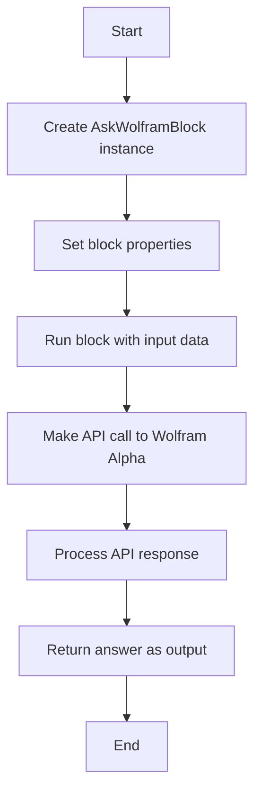
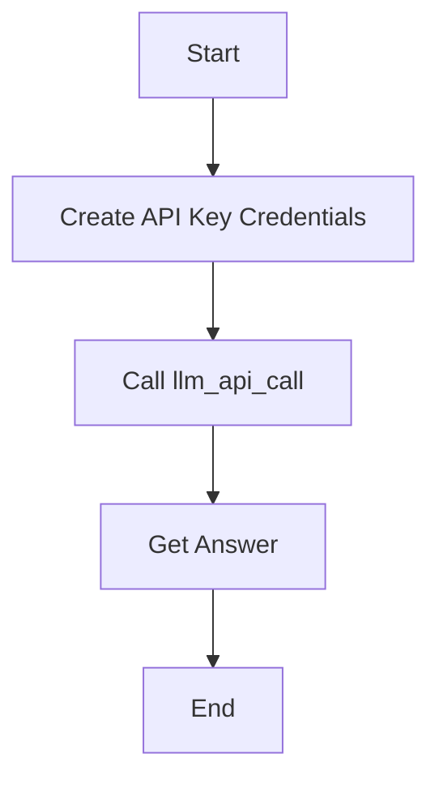
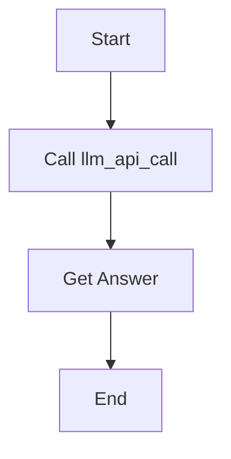
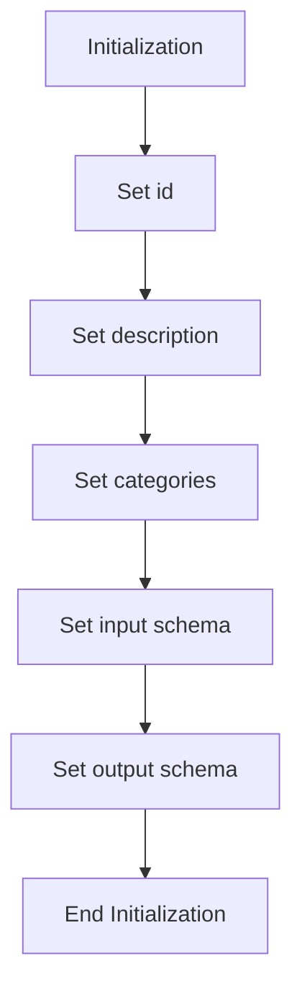
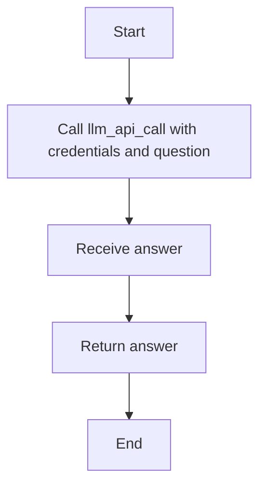

# `.\AutoGPT\autogpt_platform\backend\backend\blocks\wolfram\llm_api.py` 详细设计文档

The code defines a custom block for querying Wolfram Alpha and returning the answer to a given question.

## 整体流程



## 类结构

```
AskWolframBlock (Custom Block)
├── Input (BlockSchemaInput)
│   ├── credentials (CredentialsMetaInput)
│   └── question (str)
└── Output (BlockSchemaOutput)
    └── answer (str)
```

## 全局变量及字段


### `wolfram`
    
A Wolfram Alpha provider built with API key and base cost

类型：`ProviderBuilder`
    


### `APIKeyCredentials`
    
Credentials for API key authentication

类型：`APIKeyCredentials`
    


### `Block`
    
Base class for blocks that can be executed

类型：`Block`
    


### `BlockCategory`
    
Category of the block

类型：`BlockCategory`
    


### `BlockCostType`
    
Type of cost associated with the block

类型：`BlockCostType`
    


### `BlockOutput`
    
Output of the block

类型：`BlockOutput`
    


### `BlockSchemaInput`
    
Input schema for the block

类型：`BlockSchemaInput`
    


### `BlockSchemaOutput`
    
Output schema for the block

类型：`BlockSchemaOutput`
    


### `CredentialsMetaInput`
    
Meta input for credentials

类型：`CredentialsMetaInput`
    


### `ProviderBuilder`
    
Builder for creating providers

类型：`ProviderBuilder`
    


### `SchemaField`
    
Field in the schema

类型：`SchemaField`
    


### `llm_api_call`
    
Function to make an API call to LLM

类型：`async function`
    


### `AskWolframBlock.id`
    
Unique identifier for the block

类型：`str`
    


### `AskWolframBlock.description`
    
Description of the block

类型：`str`
    


### `AskWolframBlock.categories`
    
Categories to which the block belongs

类型：`set`
    


### `AskWolframBlock.input_schema`
    
Input schema for the block

类型：`BlockSchemaInput`
    


### `AskWolframBlock.output_schema`
    
Output schema for the block

类型：`BlockSchemaOutput`
    


### `AskWolframBlock.Input.credentials`
    
Wolfram Alpha API credentials

类型：`CredentialsMetaInput`
    


### `AskWolframBlock.Input.question`
    
The question to ask Wolfram Alpha

类型：`str`
    


### `AskWolframBlock.Output.answer`
    
The answer to the question from Wolfram Alpha

类型：`str`
    
    

## 全局函数及方法


### AskWolframBlock.run

Ask Wolfram Alpha a question and return the answer.

参数：

- `input_data`：`Input`，The input data for the block, including the question to ask.
- `credentials`：`APIKeyCredentials`，The credentials to use for the Wolfram Alpha API call.
- `**kwargs`：Any additional keyword arguments.

返回值：`BlockOutput`，The output of the block, containing the answer to the question.

#### 流程图



#### 带注释源码

```python
async def run(
    self, input_data: Input, *, credentials: APIKeyCredentials, **kwargs
) -> BlockOutput:
    answer = await llm_api_call(credentials, input_data.question)
    yield "answer", answer
```


### llm_api_call

This function is a placeholder for the actual API call to the language model (LLM). It takes credentials and a question as input and returns an answer.

参数：

- `credentials`：`APIKeyCredentials`，Wolfram Alpha API credentials
- `input_data.question`：`str`，The question to ask

返回值：`str`，The answer to the question

#### 流程图



#### 带注释源码

```
# from backend.sdk import APIKeyCredentials
# from ._api import llm_api_call

# async def llm_api_call(credentials: APIKeyCredentials, question: str) -> str:
#     # This is a placeholder for the actual API call to the language model (LLM).
#     # The actual implementation would involve making a request to the LLM's API
#     # with the provided credentials and question, and then returning the response.
#     # For the purpose of this example, we'll just return a dummy answer.
#     return "This is a dummy answer to the question: " + question
```

Note: The actual implementation of `llm_api_call` is not provided in the given code snippet, so the above source code is a placeholder and should be replaced with the actual implementation.


### `AskWolframBlock.__init__`

This method initializes an instance of the `AskWolframBlock` class, setting up its properties and schema for interacting with Wolfram Alpha.

参数：

- `self`：`AskWolframBlock`，The instance being initialized.
- `id`：`str`，The unique identifier for the block.
- `description`：`str`，A description of the block's functionality.
- `categories`：`set`，A set of categories that the block belongs to.
- `input_schema`：`BlockSchemaInput`，The schema for the input data.
- `output_schema`：`BlockSchemaOutput`，The schema for the output data.

返回值：`None`，This method does not return a value.

#### 流程图



#### 带注释源码

```
def __init__(self):
    # Set the unique identifier for the block
    super().__init__(
        id="b7710ce4-68ef-4e82-9a2f-f0b874ef9c7d",
        # Set a description of the block's functionality
        description="Ask Wolfram Alpha a question",
        # Set the categories that the block belongs to
        categories={BlockCategory.SEARCH},
        # Set the schema for the input data
        input_schema=self.Input,
        # Set the schema for the output data
        output_schema=self.Output,
    )
```


### AskWolframBlock.run

This method is responsible for executing the query against the Wolfram Alpha API and returning the answer.

参数：

- `input_data`：`Input`，The input data containing the question to be asked to Wolfram Alpha.
- `credentials`：`APIKeyCredentials`，The credentials required to authenticate with the Wolfram Alpha API.
- `**kwargs`：Any additional keyword arguments that may be passed to the method.

返回值：`BlockOutput`，The output containing the answer from Wolfram Alpha.

#### 流程图



#### 带注释源码

```python
async def run(self, input_data: Input, *, credentials: APIKeyCredentials, **kwargs) -> BlockOutput:
    # Call the llm_api_call function with the provided credentials and the question from input_data
    answer = await llm_api_call(credentials, input_data.question)
    # Yield the answer as a result
    yield "answer", answer
```


## 关键组件


### 张量索引与惰性加载

张量索引与惰性加载是用于高效处理大型数据集的关键组件，它允许在需要时才加载数据的一部分，从而减少内存消耗和提高性能。

### 反量化支持

反量化支持是针对量化策略的组件，它允许模型在量化过程中保持其精度，确保量化后的模型性能与原始模型相近。

### 量化策略

量化策略是用于优化模型性能的关键组件，它通过减少模型中权重和激活值的精度来减少模型大小和计算需求，同时尽量保持模型性能。


## 问题及建议


### 已知问题

-   **全局变量和函数依赖性**：代码中使用了全局变量 `wolfram` 和全局函数 `llm_api_call`，这可能导致代码的可维护性和可测试性降低，因为它们可能被代码库中的其他部分修改，而不影响 `AskWolframBlock` 类。
-   **异常处理**：代码中没有显示异常处理逻辑，如果 `llm_api_call` 函数抛出异常，`run` 方法将直接传递异常，这可能导致调用者难以处理。
-   **API Key 安全性**：API 密钥硬编码在代码中，这可能导致密钥泄露的风险。应该考虑使用环境变量或配置文件来存储敏感信息。

### 优化建议

-   **封装全局依赖**：将全局变量和函数封装在类中，或者通过依赖注入的方式提供，以提高代码的模块化和可测试性。
-   **添加异常处理**：在 `run` 方法中添加异常处理逻辑，确保在调用外部服务时能够优雅地处理错误情况。
-   **安全存储 API Key**：使用环境变量或配置文件来存储 API 密钥，并确保这些文件不被包含在版本控制系统中。
-   **代码复用**：如果 `llm_api_call` 函数在其他地方也有使用，考虑将其提取为一个独立的类或模块，以便重用和测试。
-   **日志记录**：添加日志记录功能，以便于跟踪和调试代码执行过程中的关键步骤。
-   **单元测试**：编写单元测试来验证 `AskWolframBlock` 类的行为，确保代码的稳定性和可靠性。


## 其它


### 设计目标与约束

- 设计目标：实现一个能够向 Wolfram Alpha 提问并获取答案的模块。
- 约束条件：必须使用 Wolfram Alpha API，且所有请求必须通过认证。

### 错误处理与异常设计

- 错误处理：在 API 调用失败时，应捕获异常并返回错误信息。
- 异常设计：定义自定义异常类以处理特定错误情况。

### 数据流与状态机

- 数据流：用户输入问题 -> 模块调用 Wolfram Alpha API -> 返回答案。
- 状态机：模块在执行过程中可能处于“等待输入”、“调用API”、“处理结果”和“返回结果”状态。

### 外部依赖与接口契约

- 外部依赖：Wolfram Alpha API 和 `llm_api_call` 函数。
- 接口契约：定义 `AskWolframBlock` 类的输入和输出接口，确保与其他模块的兼容性。


    