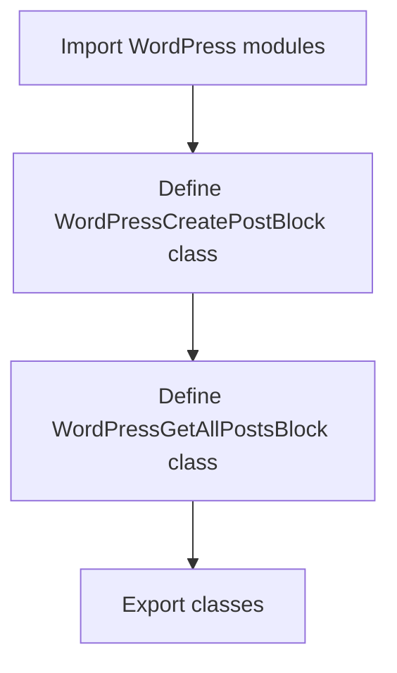

# `.\AutoGPT\autogpt_platform\backend\backend\blocks\wordpress\__init__.py` 详细设计文档

The code provides two classes for interacting with WordPress: one for creating a post and another for retrieving all posts.

## 整体流程



## 类结构

```
WordPressCreatePostBlock
├── WordPressGetAllPostsBlock
```

## 全局变量及字段


### `WordPressCreatePostBlock.WordPressCreatePostBlock`
    
A class representing the block for creating posts in a WordPress environment.

类型：`WordPressCreatePostBlock`
    


### `WordPressGetAllPostsBlock.WordPressGetAllPostsBlock`
    
A class representing the block for retrieving all posts in a WordPress environment.

类型：`WordPressGetAllPostsBlock`
    
    

## 全局函数及方法


## 关键组件


### WordPressCreatePostBlock

用于创建WordPress博客文章的模块。

### WordPressGetAllPostsBlock

用于获取WordPress博客中所有文章的模块。


## 问题及建议


### 已知问题

-   {问题1}：代码中缺少对`WordPressCreatePostBlock`和`WordPressGetAllPostsBlock`类的具体实现细节，无法评估其完整功能和性能。
-   {问题2}：代码没有提供任何关于这两个类的内部逻辑或外部接口的描述，使得其他开发者难以理解和使用这些类。
-   {问题3}：全局变量和函数的使用没有在代码中体现，可能存在潜在的全局状态管理问题。

### 优化建议

-   {建议1}：为`WordPressCreatePostBlock`和`WordPressGetAllPostsBlock`类提供详细的设计文档，包括类的字段、方法、参数和返回值描述。
-   {建议2}：实现这些类并提供示例代码，展示如何使用它们来创建和获取WordPress博客文章。
-   {建议3}：考虑使用面向对象的设计原则，避免全局变量的使用，以减少代码的耦合性和提高可维护性。
-   {建议4}：为代码添加单元测试，确保每个类的方法都能按预期工作，并能够处理异常情况。
-   {建议5}：如果这些类依赖于外部库或API，应确保这些依赖项的版本兼容性和稳定性。


## 其它


### 设计目标与约束

- 设计目标：确保代码模块化，易于维护和扩展。
- 约束条件：遵循Python编程规范，确保代码可读性和可维护性。

### 错误处理与异常设计

- 异常处理：定义自定义异常类，用于处理特定错误情况。
- 错误日志：记录错误信息，便于问题追踪和调试。

### 数据流与状态机

- 数据流：数据从WordPressGetAllPostsBlock流向WordPressCreatePostBlock。
- 状态机：无状态机设计，因为代码块之间无状态转换。

### 外部依赖与接口契约

- 外部依赖：依赖于WordPress API进行博客文章的创建和获取。
- 接口契约：确保WordPress API的调用符合预期，返回正确数据格式。

### 测试与验证

- 单元测试：编写单元测试，确保每个代码块的功能正确。
- 集成测试：进行集成测试，确保代码块之间协同工作。

### 性能优化

- 性能监控：监控代码执行时间，识别性能瓶颈。
- 优化策略：根据监控结果，对代码进行优化。

### 安全性考虑

- 安全漏洞：评估代码可能存在的安全风险。
- 安全措施：实施安全措施，如输入验证和输出编码。

### 代码维护与更新

- 维护策略：制定代码维护策略，确保代码长期可用。
- 更新机制：建立更新机制，确保代码与WordPress API兼容。


    