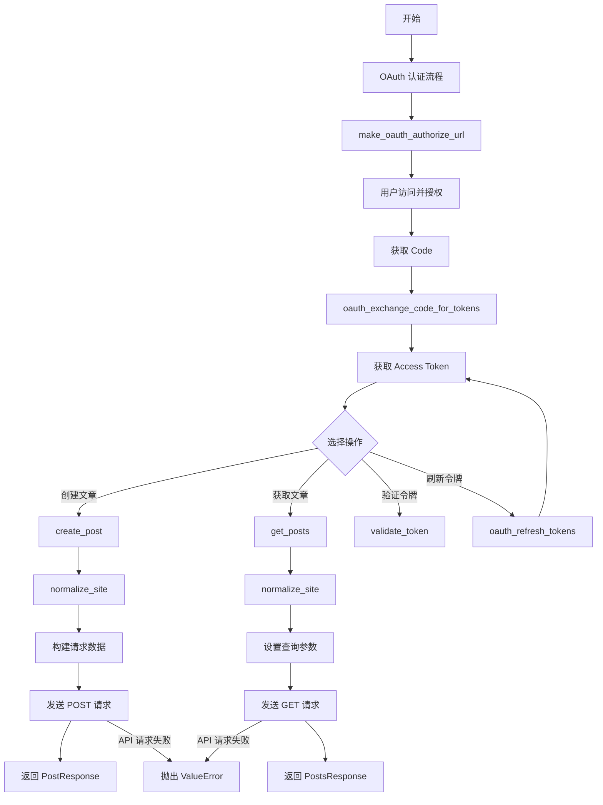
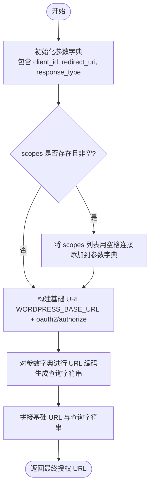
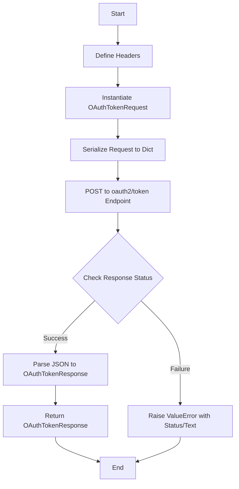
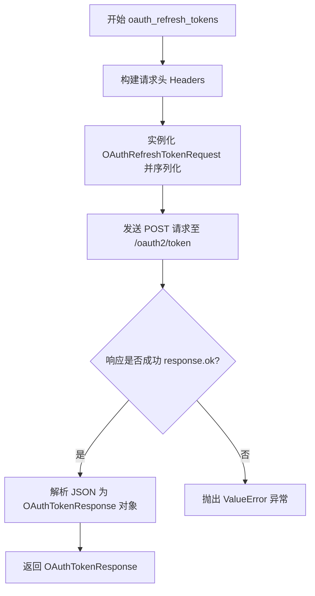
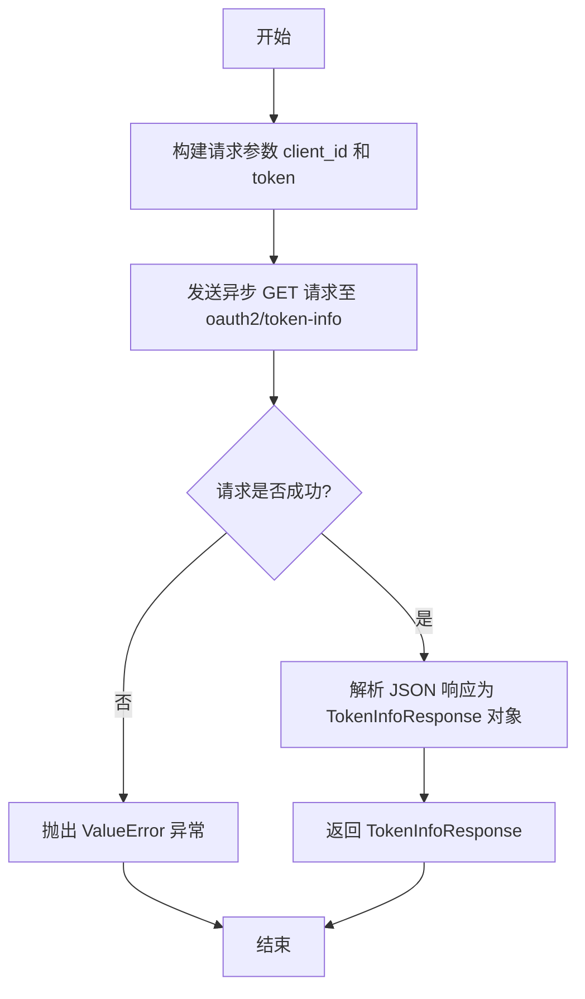
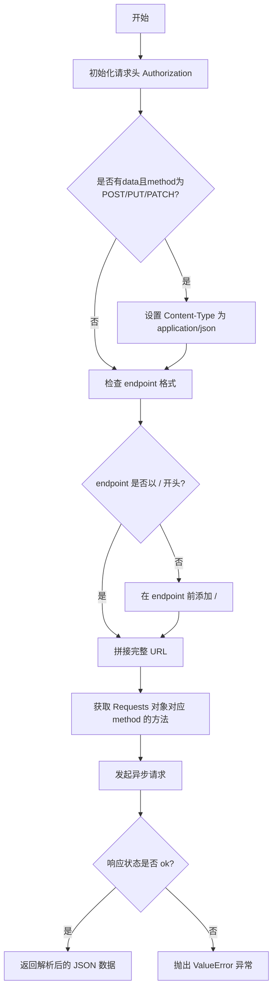
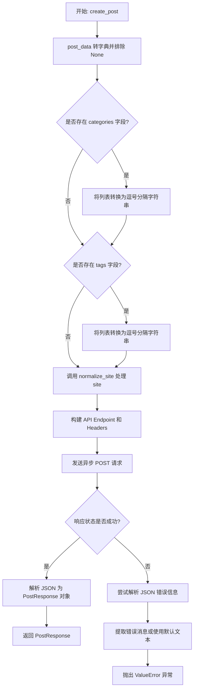
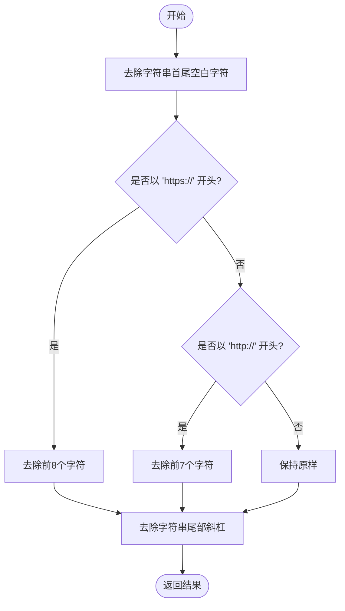
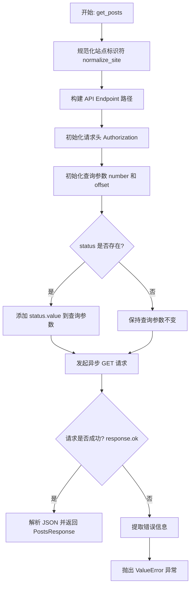
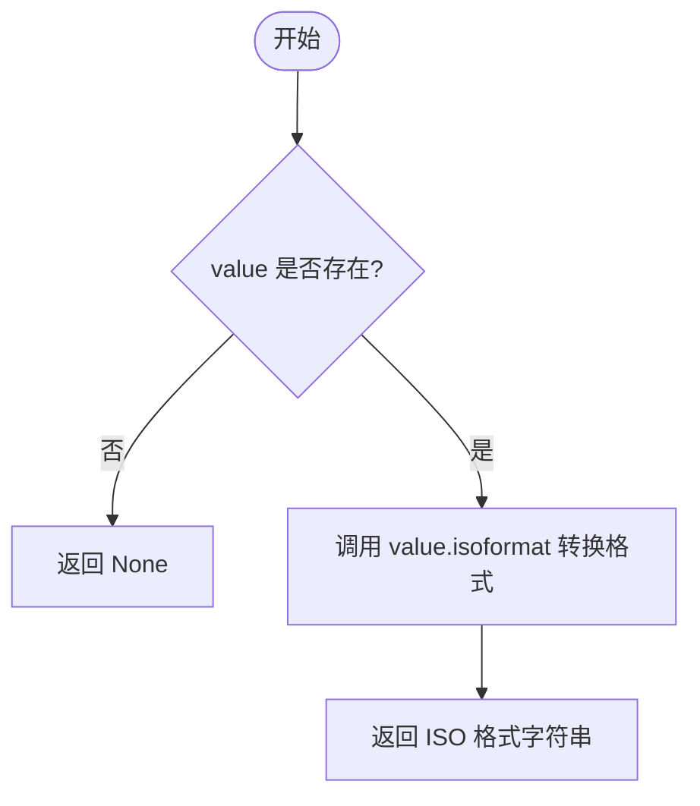

# `AutoGPT\autogpt_platform\backend\backend\blocks\wordpress\_api.py` 详细设计文档

该代码实现了一个用于与 WordPress.com 公共 API 交互的 Python 客户端库，主要功能包括 OAuth 2.0 授权流程（生成授权 URL、交换授权码、刷新令牌、验证令牌）以及博客文章管理（创建文章、获取文章列表），并利用 Pydantic 模型进行数据验证和序列化。

## 整体流程



## 类结构

```
BaseModel (外部导入基类)
├── OAuth 相关模型
│   ├── OAuthAuthorizeRequest
│   ├── OAuthTokenRequest
│   ├── OAuthRefreshTokenRequest
│   ├── OAuthTokenResponse
│   └── TokenInfoResponse
├── 文章枚举
│   ├── PostStatus
│   └── PostFormat
└── 文章相关模型
    ├── CreatePostRequest
    ├── PostAuthor
    ├── PostResponse
    ├── Post
    └── PostsResponse
```

## 全局变量及字段


### `WORDPRESS_BASE_URL`
    
WordPress公共API的基础URL。

类型：`str`
    


### `logger`
    
用于记录模块级别日志的实例。

类型：`Logger`
    


### `OAuthAuthorizeRequest.client_id`
    
应用程序的客户端ID。

类型：`str`
    


### `OAuthAuthorizeRequest.redirect_uri`
    
授权响应重定向的URI。

类型：`str`
    


### `OAuthAuthorizeRequest.response_type`
    
OAuth响应类型，通常为 'code'。

类型：`str`
    


### `OAuthAuthorizeRequest.scope`
    
权限范围列表，用空格分隔。

类型：`str | None`
    


### `OAuthAuthorizeRequest.blog`
    
WordPress博客URL或ID。

类型：`str | None`
    


### `OAuthTokenRequest.code`
    
重定向返回的授权码。

类型：`str`
    


### `OAuthTokenRequest.client_id`
    
应用程序的客户端ID。

类型：`str`
    


### `OAuthTokenRequest.redirect_uri`
    
授权请求中使用的重定向URI。

类型：`str`
    


### `OAuthTokenRequest.client_secret`
    
应用程序的客户端密钥。

类型：`str`
    


### `OAuthTokenRequest.grant_type`
    
授权类型，固定为 'authorization_code'。

类型：`str`
    


### `OAuthRefreshTokenRequest.refresh_token`
    
之前授权颁发的刷新令牌。

类型：`str`
    


### `OAuthRefreshTokenRequest.client_id`
    
应用程序的客户端ID。

类型：`str`
    


### `OAuthRefreshTokenRequest.client_secret`
    
应用程序的客户端密钥。

类型：`str`
    


### `OAuthRefreshTokenRequest.grant_type`
    
授权类型，固定为 'refresh_token'。

类型：`str`
    


### `OAuthTokenResponse.access_token`
    
用于代表用户请求WordPress API的不透明令牌。

类型：`str`
    


### `OAuthTokenResponse.blog_id`
    
授权博客的ID。

类型：`str | None`
    


### `OAuthTokenResponse.blog_url`
    
授权博客的URL。

类型：`str | None`
    


### `OAuthTokenResponse.token_type`
    
令牌类型，通常为 'bearer'。

类型：`str`
    


### `OAuthTokenResponse.scope`
    
授予的权限范围。

类型：`str | None`
    


### `OAuthTokenResponse.refresh_token`
    
刷新令牌。

类型：`str | None`
    


### `OAuthTokenResponse.expires_in`
    
过期时间（秒）。

类型：`int | None`
    


### `TokenInfoResponse.client_id`
    
应用程序的客户端ID。

类型：`str`
    


### `TokenInfoResponse.user_id`
    
WordPress.com用户ID。

类型：`str`
    


### `TokenInfoResponse.blog_id`
    
与令牌关联的博客ID。

类型：`str | None`
    


### `TokenInfoResponse.scope`
    
令牌的权限范围。

类型：`str | None`
    


### `CreatePostRequest.title`
    
文章标题。

类型：`str | None`
    


### `CreatePostRequest.content`
    
文章内容。

类型：`str | None`
    


### `CreatePostRequest.excerpt`
    
文章摘要。

类型：`str | None`
    


### `CreatePostRequest.date`
    
文章发布日期。

类型：`datetime | None`
    


### `CreatePostRequest.slug`
    
文章别名（URL友好名称）。

类型：`str | None`
    


### `CreatePostRequest.author`
    
作者ID或登录名。

类型：`str | None`
    


### `CreatePostRequest.status`
    
文章状态（如发布、草稿）。

类型：`PostStatus | None`
    


### `CreatePostRequest.password`
    
文章访问密码。

类型：`str | None`
    


### `CreatePostRequest.sticky`
    
是否置顶。

类型：`bool | None`
    


### `CreatePostRequest.parent`
    
父文章ID。

类型：`int | None`
    


### `CreatePostRequest.type`
    
文章类型（如 post, page）。

类型：`str | None`
    


### `CreatePostRequest.categories`
    
分类列表。

类型：`List[str] | None`
    


### `CreatePostRequest.tags`
    
标签列表。

类型：`List[str] | None`
    


### `CreatePostRequest.format`
    
文章格式。

类型：`PostFormat | None`
    


### `CreatePostRequest.featured_image`
    
特色图片URL。

类型：`str | None`
    


### `CreatePostRequest.media_urls`
    
媒体URL列表。

类型：`List[str] | None`
    


### `CreatePostRequest.publicize`
    
是否公开推广。

类型：`bool | None`
    


### `CreatePostRequest.publicize_message`
    
公开推广的自定义消息。

类型：`str | None`
    


### `CreatePostRequest.likes_enabled`
    
是否启用点赞功能。

类型：`bool | None`
    


### `CreatePostRequest.sharing_enabled`
    
是否启用分享功能。

类型：`bool | None`
    


### `CreatePostRequest.discussion`
    
讨论设置（评论等）。

类型：`Dict[str, bool] | None`
    


### `CreatePostRequest.menu_order`
    
页面菜单顺序。

类型：`int | None`
    


### `CreatePostRequest.page_template`
    
页面模板文件名。

类型：`str | None`
    


### `CreatePostRequest.metadata`
    
元数据列表。

类型：`List[Dict[str, Any]] | None`
    


### `PostAuthor.ID`
    
作者ID。

类型：`int`
    


### `PostAuthor.login`
    
作者登录名。

类型：`str`
    


### `PostAuthor.email`
    
作者邮箱。

类型：`Union[str, bool, None]`
    


### `PostAuthor.name`
    
作者显示名称。

类型：`str`
    


### `PostAuthor.nice_name`
    
作者昵称（URL友好）。

类型：`str`
    


### `PostAuthor.URL`
    
作者个人资料URL。

类型：`str | None`
    


### `PostAuthor.avatar_URL`
    
作者头像URL。

类型：`str | None`
    


### `PostResponse.ID`
    
文章的唯一标识符。

类型：`int`
    


### `PostResponse.site_ID`
    
站点ID。

类型：`int`
    


### `PostResponse.author`
    
作者信息对象。

类型：`PostAuthor`
    


### `PostResponse.date`
    
文章创建日期。

类型：`datetime`
    


### `PostResponse.modified`
    
文章最后修改日期。

类型：`datetime`
    


### `PostResponse.title`
    
文章标题。

类型：`str`
    


### `PostResponse.URL`
    
文章的完整URL。

类型：`str`
    


### `PostResponse.short_URL`
    
文章的短URL。

类型：`str`
    


### `PostResponse.content`
    
文章HTML内容。

类型：`str`
    


### `PostResponse.excerpt`
    
文章摘要。

类型：`str`
    


### `PostResponse.slug`
    
文章别名。

类型：`str`
    


### `PostResponse.guid`
    
全局唯一标识符。

类型：`str`
    


### `PostResponse.status`
    
文章状态。

类型：`str`
    


### `PostResponse.sticky`
    
是否置顶。

类型：`bool`
    


### `PostResponse.password`
    
文章密码。

类型：`str | None`
    


### `PostResponse.parent`
    
父文章信息。

类型：`Union[Dict[str, Any], bool, None]`
    


### `PostResponse.type`
    
文章类型。

类型：`str`
    


### `PostResponse.discussion`
    
讨论设置。

类型：`Dict[str, Union[str, bool, int]]`
    


### `PostResponse.likes_enabled`
    
是否启用点赞。

类型：`bool`
    


### `PostResponse.sharing_enabled`
    
是否启用分享。

类型：`bool`
    


### `PostResponse.like_count`
    
点赞数。

类型：`int`
    


### `PostResponse.i_like`
    
当前用户是否点赞。

类型：`bool`
    


### `PostResponse.is_reblogged`
    
是否被转载。

类型：`bool`
    


### `PostResponse.is_following`
    
当前用户是否关注该博客。

类型：`bool`
    


### `PostResponse.global_ID`
    
全局ID。

类型：`str`
    


### `PostResponse.featured_image`
    
特色图片URL。

类型：`str | None`
    


### `PostResponse.post_thumbnail`
    
缩略图信息。

类型：`Dict[str, Any] | None`
    


### `PostResponse.format`
    
文章格式。

类型：`str`
    


### `PostResponse.geo`
    
地理位置数据。

类型：`Union[Dict[str, Any], bool, None]`
    


### `PostResponse.menu_order`
    
菜单顺序。

类型：`int | None`
    


### `PostResponse.page_template`
    
页面模板。

类型：`str | None`
    


### `PostResponse.publicize_URLs`
    
公开推广URL列表。

类型：`List[str]`
    


### `PostResponse.terms`
    
分类法信息。

类型：`Dict[str, Dict[str, Any]]`
    


### `PostResponse.tags`
    
标签信息。

类型：`Dict[str, Dict[str, Any]]`
    


### `PostResponse.categories`
    
分类信息。

类型：`Dict[str, Dict[str, Any]]`
    


### `PostResponse.attachments`
    
附件信息。

类型：`Dict[str, Dict[str, Any]]`
    


### `PostResponse.attachment_count`
    
附件数量。

类型：`int`
    


### `PostResponse.metadata`
    
元数据列表。

类型：`List[Dict[str, Any]]`
    


### `PostResponse.meta`
    
元数据。

类型：`Dict[str, Any]`
    


### `PostResponse.capabilities`
    
当前用户对文章的操作权限。

类型：`Dict[str, bool]`
    


### `PostResponse.revisions`
    
修订版本ID列表。

类型：`List[int] | None`
    


### `PostResponse.other_URLs`
    
其他URL。

类型：`Dict[str, Any] | None`
    


### `Post.ID`
    
文章的唯一标识符。

类型：`int`
    


### `Post.site_ID`
    
站点ID。

类型：`int`
    


### `Post.author`
    
作者信息对象。

类型：`PostAuthor`
    


### `Post.date`
    
文章创建日期。

类型：`datetime`
    


### `Post.modified`
    
文章最后修改日期。

类型：`datetime`
    


### `Post.title`
    
文章标题。

类型：`str`
    


### `Post.URL`
    
文章的完整URL。

类型：`str`
    


### `Post.short_URL`
    
文章的短URL。

类型：`str`
    


### `Post.content`
    
文章HTML内容。

类型：`str | None`
    


### `Post.excerpt`
    
文章摘要。

类型：`str | None`
    


### `Post.slug`
    
文章别名。

类型：`str`
    


### `Post.guid`
    
全局唯一标识符。

类型：`str`
    


### `Post.status`
    
文章状态。

类型：`str`
    


### `Post.sticky`
    
是否置顶。

类型：`bool`
    


### `Post.password`
    
文章密码。

类型：`str | None`
    


### `Post.parent`
    
父文章信息。

类型：`Union[Dict[str, Any], bool, None]`
    


### `Post.type`
    
文章类型。

类型：`str`
    


### `Post.discussion`
    
讨论设置。

类型：`Dict[str, Union[str, bool, int]] | None`
    


### `Post.likes_enabled`
    
是否启用点赞。

类型：`bool | None`
    


### `Post.sharing_enabled`
    
是否启用分享。

类型：`bool | None`
    


### `Post.like_count`
    
点赞数。

类型：`int | None`
    


### `Post.i_like`
    
当前用户是否点赞。

类型：`bool | None`
    


### `Post.is_reblogged`
    
是否被转载。

类型：`bool | None`
    


### `Post.is_following`
    
当前用户是否关注该博客。

类型：`bool | None`
    


### `Post.global_ID`
    
全局ID。

类型：`str | None`
    


### `Post.featured_image`
    
特色图片URL。

类型：`str | None`
    


### `Post.post_thumbnail`
    
缩略图信息。

类型：`Dict[str, Any] | None`
    


### `Post.format`
    
文章格式。

类型：`str | None`
    


### `Post.geo`
    
地理位置数据。

类型：`Union[Dict[str, Any], bool, None]`
    


### `Post.menu_order`
    
菜单顺序。

类型：`int | None`
    


### `Post.page_template`
    
页面模板。

类型：`str | None`
    


### `Post.publicize_URLs`
    
公开推广URL列表。

类型：`List[str] | None`
    


### `Post.terms`
    
分类法信息。

类型：`Dict[str, Dict[str, Any]] | None`
    


### `Post.tags`
    
标签信息。

类型：`Dict[str, Dict[str, Any]] | None`
    


### `Post.categories`
    
分类信息。

类型：`Dict[str, Dict[str, Any]] | None`
    


### `Post.attachments`
    
附件信息。

类型：`Dict[str, Dict[str, Any]] | None`
    


### `Post.attachment_count`
    
附件数量。

类型：`int | None`
    


### `Post.metadata`
    
元数据列表。

类型：`List[Dict[str, Any]] | None`
    


### `Post.meta`
    
元数据。

类型：`Dict[str, Any] | None`
    


### `Post.capabilities`
    
当前用户对文章的操作权限。

类型：`Dict[str, bool] | None`
    


### `Post.revisions`
    
修订版本ID列表。

类型：`List[int] | None`
    


### `Post.other_URLs`
    
其他URL。

类型：`Dict[str, Any] | None`
    


### `PostsResponse.found`
    
找到的文章总数。

类型：`int`
    


### `PostsResponse.posts`
    
文章对象列表。

类型：`List[Post]`
    


### `PostsResponse.meta`
    
分页和元信息。

类型：`Dict[str, Any]`
    
    

## 全局函数及方法


### `make_oauth_authorize_url`

生成用于 WordPress 的 OAuth 授权 URL。该函数构建包含必要客户端参数（如 `client_id`、`redirect_uri`）和可选权限范围（`scopes`）的查询字符串，并将其附加到 WordPress OAuth 端点，以创建用于用户授权的可访问 URL。

参数：

- `client_id`：`str`，应用程序在 WordPress.com 注册的客户端 ID。
- `redirect_uri`：`str`，授权响应后重定向的 URI，必须与应用注册的 URI 完全匹配。
- `scopes`：`list[str] | None`，可选的权限范围列表。如果未提供，默认为单个博客访问权限。

返回值：`str`，用户需要访问以进行授权的完整 URL。

#### 流程图



#### 带注释源码

```python
def make_oauth_authorize_url(
    client_id: str,
    redirect_uri: str,
    scopes: list[str] | None = None,
) -> str:
    """
    Generate the OAuth authorization URL for WordPress.

    Args:
        client_id: Your application's client ID from WordPress.com
        redirect_uri: The URI for the authorize response redirect
        scopes: Optional list of scopes. Defaults to single blog access if not provided.
        blog: Optional blog URL or ID for a WordPress.com blog or Jetpack site.

    Returns:
        The authorization URL that the user should visit
    """
    # 构建请求参数字典，包含必要的认证信息
    params = {
        "client_id": client_id,
        "redirect_uri": redirect_uri,
        "response_type": "code",  # 固定使用 code 模式，适用于服务端应用
    }

    # 如果提供了 scopes 列表，将其转换为空格分隔的字符串并加入参数
    if scopes:
        params["scope"] = " ".join(scopes)

    # 构建授权 URL 的基础部分
    base_url = f"{WORDPRESS_BASE_URL}oauth2/authorize"
    # 将参数字典进行 URL 编码以生成查询字符串
    query_string = urlencode(params)

    # 拼接基础 URL 和查询字符串并返回
    return f"{base_url}?{query_string}"
```


### `oauth_exchange_code_for_tokens`

Exchange an authorization code for access token.

参数：

-  `client_id`：`str`，Your application's client ID.
-  `client_secret`：`str`，Your application's client secret.
-  `code`：`str`，The authorization code returned by WordPress.
-  `redirect_uri`：`str`，The redirect URI used during authorization.

返回值：`OAuthTokenResponse`，Parsed JSON response containing the access token, blog info, etc.

#### 流程图



#### 带注释源码

```python
async def oauth_exchange_code_for_tokens(
    client_id: str,
    client_secret: str,
    code: str,
    redirect_uri: str,
) -> OAuthTokenResponse:
    """
    Exchange an authorization code for access token.

    Args:
        client_id: Your application's client ID.
        client_secret: Your application's client secret.
        code: The authorization code returned by WordPress.
        redirect_uri: The redirect URI used during authorization.

    Returns:
        Parsed JSON response containing the access token, blog info, etc.
    """

    # 设置请求头，指定内容类型为表单编码
    headers = {
        "Content-Type": "application/x-www-form-urlencoded",
    }

    # 使用 OAuthTokenRequest 模型构建请求数据
    data = OAuthTokenRequest(
        code=code,
        client_id=client_id,
        client_secret=client_secret,
        redirect_uri=redirect_uri,
        grant_type="authorization_code",
    ).model_dump(exclude_none=True)

    # 发送异步 POST 请求到 WordPress OAuth2 令牌端点
    response = await Requests(raise_for_status=False).post(
        f"{WORDPRESS_BASE_URL}oauth2/token",
        headers=headers,
        data=data,
    )

    # 如果请求成功，解析 JSON 响应为 OAuthTokenResponse 对象并返回
    if response.ok:
        return OAuthTokenResponse.model_validate(response.json())
    
    # 如果请求失败，抛出包含错误状态的 ValueError
    raise ValueError(
        f"Failed to exchange code for tokens: {response.status} {response.text}"
    )
```


### `oauth_refresh_tokens`

刷新过期的访问令牌（主要用于隐式/客户端令牌）。注意：通过“code”流程获取的服务器端应用令牌通常不会过期。

参数：

- `client_id`：`str`，应用程序的客户端 ID。
- `client_secret`：`str`，应用程序的客户端密钥。
- `refresh_token`：`str`，WordPress 之前颁发的刷新令牌。

返回值：`OAuthTokenResponse`，包含新访问令牌的解析后的 JSON 响应对象。

#### 流程图



#### 带注释源码

```python
async def oauth_refresh_tokens(
    client_id: str,
    client_secret: str,
    refresh_token: str,
) -> OAuthTokenResponse:
    """
    Refresh an expired access token (for implicit/client-side tokens only).

    Note: Tokens obtained via the "code" flow for server-side applications do not expire.
    This is primarily used for client-side applications using implicit OAuth.

    Args:
        client_id: Your application's client ID.
        client_secret: Your application's client secret.
        refresh_token: The refresh token previously issued by WordPress.

    Returns:
        Parsed JSON response containing the new access token.
    """

    # 设置请求头，指定内容类型为 application/x-www-form-urlencoded
    headers = {
        "Content-Type": "application/x-www-form-urlencoded",
    }

    # 创建 OAuth 刷新令牌请求模型，并排除 None 值转换为字典
    data = OAuthRefreshTokenRequest(
        refresh_token=refresh_token,
        client_id=client_id,
        client_secret=client_secret,
        grant_type="refresh_token",
    ).model_dump(exclude_none=True)

    # 异步发送 POST 请求到 WordPress OAuth2 令牌端点
    # raise_for_status=False 表示不自动抛出 HTTP 错误状态码异常，由手动处理
    response = await Requests(raise_for_status=False).post(
        f"{WORDPRESS_BASE_URL}oauth2/token",
        headers=headers,
        data=data,
    )

    # 检查响应状态码是否为 2xx
    if response.ok:
        # 如果成功，将 JSON 响应解析为 OAuthTokenResponse 对象并返回
        return OAuthTokenResponse.model_validate(response.json())
    
    # 如果失败，抛出包含状态码和错误信息的 ValueError
    raise ValueError(f"Failed to refresh tokens: {response.status} {response.text}")
```


### `validate_token`

验证访问令牌并从 WordPress 获取关联的元数据（如用户 ID 和博客 ID）。

参数：

-  `client_id`：`str`，应用程序的客户端 ID
-  `token`：`str`，需要验证的访问令牌

返回值：`TokenInfoResponse`，包含用户 ID、博客 ID 和作用域的令牌信息对象

#### 流程图



#### 带注释源码

```python
async def validate_token(
    client_id: str,
    token: str,
) -> TokenInfoResponse:
    """
    Validate an access token and get associated metadata.

    Args:
        client_id: Your application's client ID.
        token: The access token to validate.

    Returns:
        Token info including user ID, blog ID, and scope.
    """

    # 构造查询参数字典，包含客户端ID和待验证的令牌
    params = {
        "client_id": client_id,
        "token": token,
    }

    # 发起异步 GET 请求到 WordPress API 的 token-info 端点
    # raise_for_status=False 表示即使状态码不是 200 也不立即抛出异常，由后续逻辑处理
    response = await Requests(raise_for_status=False).get(
        f"{WORDPRESS_BASE_URL}oauth2/token-info",
        params=params,
    )

    # 检查 HTTP 响应状态码是否表示成功
    if response.ok:
        # 如果成功，将返回的 JSON 数据解析并验证为 TokenInfoResponse 模型实例
        return TokenInfoResponse.model_validate(response.json())
    
    # 如果响应失败（如 401 Unauthorized），抛出 ValueError 并附带状态码和错误信息
    raise ValueError(f"Invalid token: {response.status} {response.text}")
```


### `make_api_request`

向 WordPress API 发起经过身份验证的请求。

参数：

-   `endpoint`：`str`，API 端点（例如 "/rest/v1/me/", "/rest/v1/sites/{site_id}/posts/new"）。
-   `access_token`：`str`，OAuth 访问令牌，用于身份验证。
-   `method`：`str`，HTTP 方法（如 GET, POST 等），默认为 "GET"。
-   `data`：`dict[str, Any] | None`，POST/PUT 请求的请求体数据，默认为 None。
-   `params`：`dict[str, Any] | None`，URL 查询参数，默认为 None。

返回值：`dict[str, Any]`，来自 API 的 JSON 响应数据。

#### 流程图



#### 带注释源码

```python
async def make_api_request(
    endpoint: str,
    access_token: str,
    method: str = "GET",
    data: dict[str, Any] | None = None,
    params: dict[str, Any] | None = None,
) -> dict[str, Any]:
    """
    Make an authenticated API request to WordPress.

    Args:
        endpoint: The API endpoint (e.g., "/rest/v1/me/", "/rest/v1/sites/{site_id}/posts/new")
        access_token: The OAuth access token
        method: HTTP method (GET, POST, etc.)
        data: Request body data for POST/PUT requests
        params: Query parameters

    Returns:
        JSON response from the API
    """

    # 初始化请求头，包含 Bearer 类型的认证令牌
    headers = {
        "Authorization": f"Bearer {access_token}",
    }

    # 如果提供了数据且方法是修改类操作（POST, PUT, PATCH），则设置内容类型为 JSON
    if data and method in ["POST", "PUT", "PATCH"]:
        headers["Content-Type"] = "application/json"

    # 规范化端点格式，确保以斜杠开头
    if not endpoint.startswith("/"):
        endpoint = f"/{endpoint}"

    # 拼接完整的请求 URL
    url = f"{WORDPRESS_BASE_URL.rstrip('/')}{endpoint}"

    # 根据方法名（如 "get", "post"）动态获取 Requests 实例对应的异步方法
    request_method = getattr(Requests(raise_for_status=False), method.lower())
    
    # 发起异步请求，对于特定方法将 data 作为 json 传递，其他情况作为 params 处理
    response = await request_method(
        url,
        headers=headers,
        json=data if method in ["POST", "PUT", "PATCH"] else None,
        params=params,
    )

    # 检查响应状态码
    if response.ok:
        # 成功则返回 JSON 格式的响应体
        return response.json()
    
    # 失败则抛出包含状态码和文本的异常
    raise ValueError(f"API request failed: {response.status} {response.text}")
```


### `create_post`

该函数是一个异步方法，用于通过 WordPress REST API 在指定站点上创建一篇新文章，处理了请求数据的序列化、特定字段的格式转换以及错误处理。

参数：

-  `credentials`：`Credentials`，包含认证信息的凭据对象，用于生成 API 请求所需的 Authorization 头部。
-  `site`：`str`，目标站点的标识符，可以是域名（如 "myblog.wordpress.com"）或站点 ID（如 "123456789"）。
-  `post_data`：`CreatePostRequest`，包含文章内容、标题、状态、分类等信息的 Pydantic 模型对象。

返回值：`PostResponse`，表示服务器返回的已创建文章的详细信息的对象。

#### 流程图



#### 带注释源码

```python
async def create_post(
    credentials: Credentials,
    site: str,
    post_data: CreatePostRequest,
) -> PostResponse:
    """
    Create a new post on a WordPress site.

    Args:
        site: Site ID or domain (e.g., "myblog.wordpress.com" or "123456789")
        access_token: OAuth access token
        post_data: Post data using CreatePostRequest model

    Returns:
        PostResponse with the created post details
    """

    # 将 Pydantic 模型转换为字典，并过滤掉值为 None 的字段，以减少请求体大小
    data = post_data.model_dump(exclude_none=True)

    # 特殊处理：WordPress API 通常要求分类和标签以逗号分隔的字符串形式传输
    # 如果 categories 是列表，则将其转换为逗号连接的字符串
    if "categories" in data and isinstance(data["categories"], list):
        data["categories"] = ",".join(str(c) for c in data["categories"])

    # 特殊处理：如果 tags 是列表，则将其转换为逗号连接的字符串
    if "tags" in data and isinstance(data["tags"], list):
        data["tags"] = ",".join(str(t) for t in data["tags"])

    # 规范化站点标识符（去除协议前缀和尾部斜杠）
    site = normalize_site(site)
    # 构建具体的 API 端点路径
    endpoint = f"/rest/v1.1/sites/{site}/posts/new"

    # 设置请求头，包含认证信息（Bearer Token）和内容类型
    headers = {
        "Authorization": credentials.auth_header(),
        "Content-Type": "application/x-www-form-urlencoded",
    }

    # 发起异步 POST 请求
    response = await Requests(raise_for_status=False).post(
        f"{WORDPRESS_BASE_URL.rstrip('/')}{endpoint}",
        headers=headers,
        data=data,
    )

    # 检查响应状态
    if response.ok:
        # 请求成功，将 JSON 响应解析并验证为 PostResponse 模型
        return PostResponse.model_validate(response.json())

    # 请求失败时的错误处理逻辑
    # 尝试从响应体中解析 JSON 格式的错误详情
    error_data = (
        response.json()
        if response.headers.get("content-type", "").startswith("application/json")
        else {}
    )
    # 获取具体的错误消息，若无则使用原始响应文本
    error_message = error_data.get("message", response.text)
    # 抛出包含状态码和错误信息的异常
    raise ValueError(f"Failed to create post: {response.status} - {error_message}")
```


### `normalize_site`

通过去除协议（http:// 或 https://）和尾部斜杠来规范化站点标识符。

参数：

- `site`：`str`，站点 URL、域名或 ID（例如 "https://myblog.wordpress.com/"、"myblog.wordpress.com"、"123456789"）

返回值：`str`，规范化的站点标识符（仅域名或 ID）

#### 流程图



#### 带注释源码

```python
def normalize_site(site: str) -> str:
    """
    Normalize a site identifier by stripping protocol and trailing slashes.

    Args:
        site: Site URL, domain, or ID (e.g., "https://myblog.wordpress.com/", "myblog.wordpress.com", "123456789")

    Returns:
        Normalized site identifier (domain or ID only)
    """
    # 去除输入字符串首尾的空白字符
    site = site.strip()
    
    # 如果字符串以 'https://' 开头，则截取第8个字符之后的部分
    if site.startswith("https://"):
        site = site[8:]
    # 否则如果以 'http://' 开头，则截取第7个字符之后的部分
    elif site.startswith("http://"):
        site = site[7:]
    
    # 去除字符串末尾的所有斜杠字符并返回
    return site.rstrip("/")
```


### `get_posts`

该函数用于从指定的 WordPress 站点获取文章列表。它通过 OAuth 凭证进行身份验证，支持按状态筛选文章，并可指定分页参数（数量和偏移量）。函数会处理站点标识符的规范化，构建 API 请求，并将响应解析为结构化的 `PostsResponse` 对象。

参数：

-  `credentials`：`Credentials`，用于身份验证的 OAuth 凭证对象，包含访问令牌等信息。
-  `site`：`str`，站点标识符，可以是域名（如 "example.wordpress.com"）或站点 ID（数字字符串）。
-  `status`：`PostStatus | None`，可选参数，用于筛选文章的状态（如 "publish", "draft"），如果为 None 则获取所有状态的文章。
-  `number`：`int`，要获取的文章数量，限制在 1 到 100 之间，默认为 100。
-  `offset`：`int`，分页偏移量，表示跳过前面的多少篇文章，默认为 0。

返回值：`PostsResponse`，包含文章列表、找到的文章总数（found）以及相关元数据的对象。

#### 流程图



#### 带注释源码

```python
async def get_posts(
    credentials: Credentials,
    site: str,
    status: PostStatus | None = None,
    number: int = 100,
    offset: int = 0,
) -> PostsResponse:
    """
    Get posts from a WordPress site.

    Args:
        credentials: OAuth credentials
        site: Site ID or domain (e.g., "myblog.wordpress.com" or "123456789")
        status: Filter by post status using PostStatus enum, or None for all
        number: Number of posts to retrieve (max 100)
        offset: Number of posts to skip (for pagination)

    Returns:
        PostsResponse with the list of posts
    """
    # 规范化站点标识符，去除协议前缀和尾部斜杠
    site = normalize_site(site)
    # 构建 REST API 端点路径
    endpoint = f"/rest/v1.1/sites/{site}/posts"

    # 设置包含认证信息的请求头
    headers = {
        "Authorization": credentials.auth_header(),
    }

    # 准备查询参数，限制每页数量在 1-100 之间
    params: Dict[str, Any] = {
        "number": max(1, min(number, 100)),  # 1–100 posts per request
        "offset": offset,
    }

    # 如果提供了状态参数，则将其添加到查询参数中
    if status:
        params["status"] = status.value
    
    # 发起异步 GET 请求
    response = await Requests(raise_for_status=False).get(
        f"{WORDPRESS_BASE_URL.rstrip('/')}{endpoint}",
        headers=headers,
        params=params,
    )

    # 处理成功响应
    if response.ok:
        return PostsResponse.model_validate(response.json())

    # 处理错误响应，尝试从 JSON 中提取错误消息，否则使用原始文本
    error_data = (
        response.json()
        if response.headers.get("content-type", "").startswith("application/json")
        else {}
    )
    error_message = error_data.get("message", response.text)
    raise ValueError(f"Failed to get posts: {response.status} - {error_message}")
```


### `CreatePostRequest.serialize_date`

这是一个 Pydantic 字段序列化器，用于将 `CreatePostRequest` 模型中的 `date` 字段（Python `datetime` 对象）转换为 ISO 8601 格式的字符串。它确保日期数据在序列化为 JSON 或发送到 API 时符合标准格式，并处理了日期为空的情况。

参数：

- `value`: `datetime | None`，需要被序列化的日期时间对象。

返回值：`str | None`，转换后的 ISO 8601 格式日期字符串（例如 "2023-10-27T10:00:00"），如果输入值为 None 则返回 None。

#### 流程图



#### 带注释源码

```python
    @field_serializer("date")
    def serialize_date(self, value: datetime | None) -> str | None:
        # 如果 value 不为 None，将其转换为 ISO 8601 格式的字符串
        # 否则直接返回 None
        return value.isoformat() if value else None
```


## 关键组件


### OAuth 认证模块
处理 WordPress.com OAuth2 授权流程，包括授权 URL 生成、利用授权码换取访问令牌、刷新令牌以及令牌有效性验证。

### Pydantic 数据模型
利用 Pydantic BaseModel 定义 API 请求和响应的数据结构，确保 OAuth 参数、文章属性及元数据的类型安全、序列化与验证。

### 文章管理逻辑
封装 WordPress 文章的核心业务操作，提供创建新文章（支持设置状态、格式、标签等）和获取文章列表（支持分页与状态筛选）的功能。

### 网络请求封装
提供统一的异步 HTTP 请求处理机制，负责构建 API 端点、注入认证头、标准化站点标识符以及处理通用的 API 错误响应。

### 工具与辅助函数
包含站点标识符标准化（去除协议和斜杠）等辅助逻辑，用于确保 API 路径的正确性。


## 问题及建议


### 已知问题

-   **错误处理机制简陋**：所有网络请求失败（非 `response.ok`）均抛出通用的 `ValueError`，仅包含状态码和文本，未区分网络超时、认证失败、权限不足或服务端错误等不同场景，不利于调用方进行精细化错误处理。
-   **全局配置硬编码**：`WORDPRESS_BASE_URL` 被硬编码为模块级常量，缺乏灵活性。如果需要针对不同环境（如开发、测试、生产）或不同的 WordPress 实例（如 Jetpack 自托管）切换端点，必须修改代码。
-   **日志功能未使用**：虽然导入了 `logging` 模块的 `logger`，但在整个代码中没有任何日志记录语句（如 `logger.info` 或 `logger.error`），导致系统运行时缺乏可观测性，难以排查请求失败的具体原因。
-   **文档与代码签名不一致**：`create_post` 函数的文档字符串（Docstring）中描述的参数包含 `access_token`，但实际函数签名定义的参数是 `credentials: Credentials`，这会对开发者造成误导。
-   **参数序列化逻辑分散**：在 `create_post` 函数中手动处理了 `categories` 和 `tags` 的列表到逗号分隔字符串的转换。这种数据格式转换逻辑散落在业务函数中，而不是统一在 Pydantic 模型或序列化层处理，增加了维护成本且容易出错。
-   **`Requests` 初始化重复且状态控制不一致**：每次调用 API 都通过 `Requests(raise_for_status=False)` 实例化请求对象。虽然 `raise_for_status=False` 是有意为之（为了手动检查），但这种模式在代码中重复出现，且没有利用连接池等潜在的优化机制（取决于 `Requests` 类的实现）。

### 优化建议

-   **引入自定义异常体系**：定义 `WordPressAPIError` 作为基类，并派生出 `AuthenticationError` (401)、`RateLimitError` (429)、`NotFoundError` (404) 等具体异常类，替代通用的 `ValueError`，提升代码的健壮性和可维护性。
-   **封装配置管理**：使用 Pydantic Settings 或配置类来管理 API Base URL、超时时间等配置项，支持通过环境变量或构造函数注入，以提高模块的复用性和环境适应性。
-   **实现自动重试机制**：在网络请求层（`Requests` 调用处）引入重试机制（如 Tenacity 库或自定义装饰器），针对网络抖动或 5xx 服务器错误进行自动重试，并采用指数退避策略，提高系统的容错能力。
-   **增强日志记录**：在关键路径（如 `oauth_exchange_code_for_tokens`、`create_post`、`make_api_request`）添加结构化日志，记录请求入参、URL、HTTP 方法、响应状态码及耗时，便于生产环境的问题排查与监控。
-   **采用类封装设计**：考虑将功能封装为 `WordPressClient` 类，将 `Credentials`（凭证）和 `Base URL` 作为实例属性初始化。这样可以避免在每次函数调用时重复传递凭证信息，并使代码结构更加面向对象，易于扩展（例如切换不同的站点）。
-   **统一序列化逻辑**：利用 Pydantic 的 `field_serializer` 或 `model_validator` 来处理 `CreatePostRequest` 中 `categories` 和 `tags` 的格式转换，将数据格式约束保留在模型层，保持业务逻辑函数的纯粹性。
-   **模型定义去重与优化**：`PostResponse` 和 `Post`（用于列表）存在大量重复字段。建议提取公共基类 `BasePostModel`，或者根据实际使用情况，统一使用一个包含所有字段的完整模型，对于不需要的字段在序列化时忽略，以减少代码冗余。


## 其它


### 设计目标与约束

本模块旨在提供一个类型安全、异步且符合 OAuth 2.0 标准的 Python 接口，用于与 WordPress.com 的公共 API 进行交互。设计目标包括：

1.  **类型安全与数据验证**：利用 `pydantic` 的 `BaseModel` 对所有请求和响应载荷进行严格的数据结构定义和验证，确保运行时的数据完整性与 IDE 友好性。
2.  **异步非阻塞 I/O**：所有的 HTTP 请求函数（如 `oauth_exchange_code_for_tokens`, `create_post` 等）均设计为 `async` 函数，以适应高并发的异步事件循环环境（如 FastAPI 或 asyncio 应用），避免阻塞主线程。
3.  **OAuth 2.0 流程封装**：封装了完整的授权码模式流程，包括生成授权 URL、交换访问令牌、刷新令牌以及令牌验证，简化了认证逻辑的集成。
4.  **RESTful API 抽象**：对底层的 HTTP 请求进行了高层抽象，处理了 URL 拼接、参数序列化（如 `urlencode`）和头部设置（如 `Authorization` 和 `Content-Type`）。

主要约束包括：

*   **外部 SDK 依赖**：强依赖于 `backend.sdk` 中的 `Credentials` 类和 `Requests` 客户端，这要求运行环境必须提供这些特定的依赖注入或实现。
*   **API 版本限制**：代码硬编码了部分端点路径（如 `/rest/v1.1/sites/`），这意味着它与 WordPress.com 特定版本的 API 紧密耦合，如果上游 API 发生破坏性变更，可能需要调整代码。

### 错误处理与异常设计

本模块采用统一的错误处理策略，主要依赖 Python 内置的 `ValueError` 来传递业务逻辑和 API 交互中的错误。

1.  **HTTP 状态码检查**：所有的 API 调用（如 `Requests().post`, `Requests().get`）都设置了 `raise_for_status=False`，并在后续逻辑中显式检查 `response.ok`。这允许函数在失败时捕获响应内容，而不是立即抛出 HTTP 错误库的异常。
2.  **错误信息提取**：当 API 请求失败时（`response.ok` 为 False），函数会尝试解析响应体中的 JSON 错误消息（优先提取 `message` 字段），并将其封装在抛出的 `ValueError` 中。例如：`Failed to create post: 400 - Invalid request`。如果响应不是 JSON 格式，则回退到原始文本 `response.text`。
3.  **数据验证异常**：利用 `pydantic` 的 `model_validate` 方法自动处理反序列化。如果 API 返回的 JSON 数据不符合模型定义（如类型不匹配或缺少必填字段），Pydantic 将抛出 `ValidationError`。本模块未显式捕获此异常，允许其向上传播，以便上层调用者处理数据格式问题。
4.  **参数校验**：通过 Pydantic 模型在函数入口处进行参数校验（例如 `CreatePostRequest`），确保在发送网络请求前数据的合法性。

### 数据流与状态机

模块内的数据流主要围绕 OAuth 2.0 认证状态和资源请求生命周期展开。

**1. 认证状态流：**

*   **初始状态**：应用持有 `client_id` 和 `client_secret`。
*   **授权请求**：调用 `make_oauth_authorize_url` 生成 URL，重定向用户至 WordPress.com。
*   **获取授权码**：用户同意后，WordPress 重定向回应用并附带 `code`。
*   **令牌交换**：应用调用 `oauth_exchange_code_for_tokens`，将 `code`、`client_id`、`client_secret` 发送给服务器。
*   **已认证状态**：成功获取 `OAuthTokenResponse`（包含 `access_token`）。此后，应用持有 `access_token`，可以调用受保护的 API。
*   **令牌刷新**：如果令牌过期（虽然代码注释指出 Code Flow 通常不过期），可调用 `oauth_refresh_tokens` 获取新令牌。
*   **令牌验证**：随时可调用 `validate_token` 检查令牌的有效性及元数据。

**2. API 请求流：**

*   **准备阶段**：构建请求模型（如 `CreatePostRequest`），利用 Pydantic 的 `model_dump(exclude_none=True)` 序列化数据。
*   **数据转换**：针对特定 API 要求，进行自定义格式转换，例如将 `List[str]` 类型的 tags/categories 转换为逗号分隔的字符串，或将 `datetime` 对象转换为 ISO 格式字符串。
*   **请求发送**：通过 `make_api_request` 或特定业务函数（如 `create_post`）发送异步 HTTP 请求，携带 Bearer Token。
*   **响应处理**：接收 JSON 响应，通过 Pydantic 模型（如 `PostResponse`）验证并转换为 Python 对象返回。

### 外部依赖与接口契约

本模块不仅仅是独立的逻辑代码，它构建在特定的外部依赖和契约之上。

1.  **依赖库：`backend.sdk`**
    *   **`BaseModel`**：所有数据模型的基类，提供了数据验证和序列化能力（假设继承自 pydantic）。
    *   **`Requests`**：异步 HTTP 客户端类。模块假设其具有 `get`、`post` 等方法，且这些方法返回一个响应对象，该对象具有 `ok`（布尔状态）、`status`（状态码）、`text`（原始文本）、`json()`（解析 JSON 方法）以及 `headers` 属性。接口契约隐式要求这些方法是 `awaitable` 的。
    *   **`Credentials`**：凭据管理类。模块假设其实例拥有 `auth_header()` 方法，能够返回符合 `Authorization: Bearer <token>` 格式的字符串。

2.  **外部服务：WordPress.com Public API (`https://public-api.wordpress.com/`)**
    *   **OAuth 2.0 端点**：
        *   `oauth2/authorize`：接受 GET 请求，参数包括 `client_id`, `redirect_uri`, `response_type` 等。
        *   `oauth2/token`：接受 POST 请求，Content-Type 为 `application/x-www-form-urlencoded`，返回包含 `access_token` 的 JSON。
        *   `oauth2/token-info`：接受 GET 请求，用于验证令牌。
    *   **REST API 端点**：
        *   `/rest/v1.1/sites/{site}/posts/new`：用于创建文章，接受 POST 请求，支持 `application/x-www-form-urlencoded` 格式数据。
        *   `/rest/v1.1/sites/{site}/posts`：用于获取文章列表，支持分页参数 `number` 和 `offset` 以及状态过滤 `status`。

### 安全性考量

1.  **凭证处理**：
    *   `client_secret` 和 `access_token` 等敏感信息通过 HTTP 请求体（Form-URL-Encoded）或 Header（Bearer Token）传输。虽然代码中使用 `model_dump(exclude_none=True)`，但在日志记录时应确保这些敏感字段不被打印（依赖 Pydantic 的配置或外部日志过滤）。
2.  **HTTPS 通信**：
    *   基础 URL 定义为 `https://public-api.wordpress.com/`，强制使用 HTTPS 加密传输，防止中间人攻击窃取授权码或令牌。
3.  **令牌类型**：
    *   严格遵循 OAuth 2.0 Bearer Token 使用规范，在 `make_api_request` 和 `create_post` 等函数中设置 `Authorization: Bearer {access_token}` 头部。
4.  **输入验证**：
    *   利用 Pydantic 模型对输入数据进行严格的类型检查，防止注入攻击或因格式错误导致的意外行为。例如，`site` 参数通过 `normalize_site` 进行了清洗，去除了可能导致 URL 混淆的协议前缀和尾部斜杠。

    