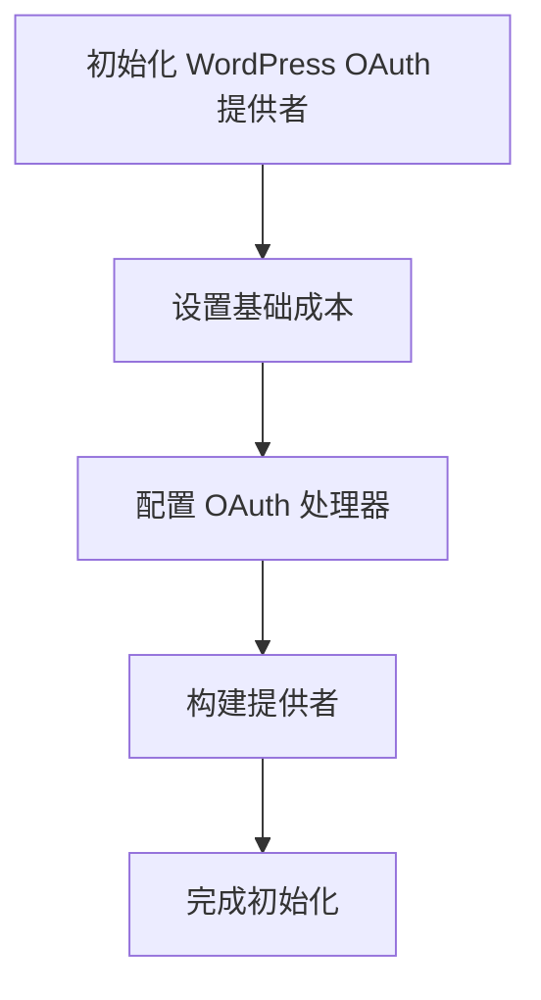
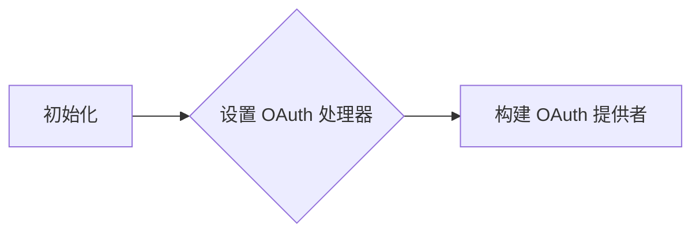
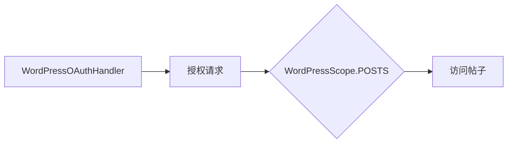
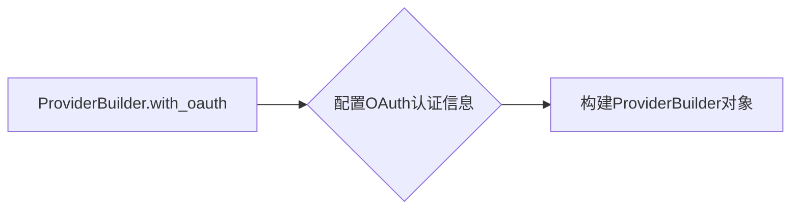
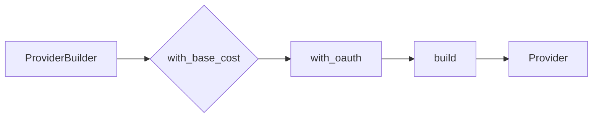
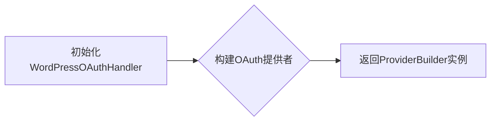
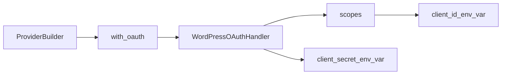
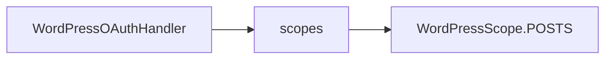

# `.\AutoGPT\autogpt_platform\backend\backend\blocks\wordpress\_config.py` 详细设计文档

This code initializes and configures a WordPress OAuth provider with a specific base cost and OAuth handler for integration with a backend system.

## 整体流程



## 类结构

```
ProviderBuilder (构建器类)
├── WordPressOAuthHandler (OAuth 处理器类)
└── WordPressScope (OAuth 范围枚举)
```

## 全局变量及字段


### `wordpress`
    
An instance of ProviderBuilder configured for WordPress integration.

类型：`ProviderBuilder`
    


### `BlockCostType`
    
A module containing cost types for blocks.

类型：`module`
    


### `ProviderBuilder`
    
A class for building provider configurations.

类型：`class`
    


### `WordPressOAuthHandler`
    
A class for handling OAuth authentication for WordPress.

类型：`class`
    


### `WordPressScope`
    
A class containing predefined scopes for WordPress integration.

类型：`class`
    


### `WordPressScope.POSTS`
    
A predefined scope for WordPress integration, representing access to posts.

类型：`enum`
    


### `ProviderBuilder.base_cost`
    
The base cost for the provider, consisting of a numeric value and a cost type.

类型：`tuple`
    


### `ProviderBuilder.oauth_handler`
    
The OAuth handler for the provider.

类型：`WordPressOAuthHandler`
    


### `ProviderBuilder.scopes`
    
The list of scopes to be used with the OAuth handler.

类型：`list`
    


### `ProviderBuilder.client_id_env_var`
    
The environment variable name for the client ID.

类型：`str`
    


### `ProviderBuilder.client_secret_env_var`
    
The environment variable name for the client secret.

类型：`str`
    


### `WordPressOAuthHandler....`
    
...

类型：`...`
    


### `WordPressScope....`
    
...

类型：`...`
    


### `WordPressScope.POSTS`
    
A predefined scope for WordPress integration, representing access to posts.

类型：`str`
    
    

## 全局函数及方法


### ProviderBuilder("wordpress")

该函数创建并配置了一个WordPress服务提供者实例。

参数：

- `name`: `str`，WordPress服务提供者的名称。
- `with_base_cost`: `tuple`，包含基础成本和成本类型，用于设置基础运行成本。
- `with_oauth`: `tuple`，包含OAuth处理类、作用域列表、客户端ID环境变量和客户端密钥环境变量，用于配置OAuth认证。
- `scopes`: `list`，包含`WordPressScope`枚举值的列表，表示OAuth认证所需的作用域。
- `client_id_env_var`: `str`，客户端ID的环境变量名称。
- `client_secret_env_var`: `str`，客户端密钥的环境变量名称。

返回值：`ProviderBuilder`对象，配置好的WordPress服务提供者实例。

#### 流程图

```mermaid
graph TD
    A[Start] --> B[Create ProviderBuilder with name "wordpress"]
    B --> C[Set base cost (1, BlockCostType.RUN)]
    C --> D[Set OAuth configuration]
    D --> E[Set OAuth handler: WordPressOAuthHandler]
    E --> F[Set OAuth scopes: [POSTS]]
    F --> G[Set client ID environment variable: WORDPRESS_CLIENT_ID]
    G --> H[Set client secret environment variable: WORDPRESS_CLIENT_SECRET]
    H --> I[Build Provider]
    I --> J[End]
```

#### 带注释源码

```python
from backend.sdk import BlockCostType, ProviderBuilder

# 创建WordPress服务提供者实例
wordpress = (
    ProviderBuilder("wordpress")
    .with_base_cost(1, BlockCostType.RUN)
    .with_oauth(
        WordPressOAuthHandler,
        scopes=[
            v.value
            for v in [
                WordPressScope.POSTS,
            ]
        ],
        client_id_env_var="WORDPRESS_CLIENT_ID",
        client_secret_env_var="WORDPRESS_CLIENT_SECRET",
    )
    .build()
)
```


### WordPressOAuthHandler

WordPressOAuthHandler 是一个用于构建 WordPress OAuth 授权处理的类。

参数：

- `scopes`：`list`，包含 WordPress OAuth 范围的列表，用于定义授权的权限。
- `client_id_env_var`：`str`，环境变量名称，用于获取客户端 ID。
- `client_secret_env_var`：`str`，环境变量名称，用于获取客户端密钥。

返回值：`None`，该类不直接返回值，而是用于构建 OAuth 提供者。

#### 流程图



#### 带注释源码

```
from backend.sdk import BlockCostType, ProviderBuilder

# WordPressOAuthHandler 类定义
class WordPressOAuthHandler:
    def __init__(self, scopes, client_id_env_var, client_secret_env_var):
        self.scopes = scopes
        self.client_id_env_var = client_id_env_var
        self.client_secret_env_var = client_secret_env_var

# 使用 WordPressOAuthHandler 构建提供者
wordpress = (
    ProviderBuilder("wordpress")
    .with_base_cost(1, BlockCostType.RUN)
    .with_oauth(
        WordPressOAuthHandler,
        scopes=[
            v.value
            for v in [
                WordPressScope.POSTS,
            ]
        ],
        client_id_env_var="WORDPRESS_CLIENT_ID",
        client_secret_env_var="WORDPRESS_CLIENT_SECRET",
    )
    .build()
)
```


### WordPressScope.POSTS

WordPressScope.POSTS 是 WordPressOAuthHandler 的一个作用域，用于授权访问 WordPress 中的帖子。

参数：

- 无

返回值：无

#### 流程图



#### 带注释源码

```
from backend.sdk import BlockCostType, ProviderBuilder

# WordPressOAuthHandler 和 WordPressScope 是外部导入的类
from ._oauth import WordPressOAuthHandler, WordPressScope

# 创建 WordPress 提供者实例
wordpress = (
    ProviderBuilder("wordpress")
    .with_base_cost(1, BlockCostType.RUN)  # 设置基础成本
    .with_oauth(WordPressOAuthHandler,  # 设置 OAuth 授权
        scopes=[
            v.value
            for v in [
                WordPressScope.POSTS,  # 设置作用域为 POSTS
            ]
        ],
        client_id_env_var="WORDPRESS_CLIENT_ID",
        client_secret_env_var="WORDPRESS_CLIENT_SECRET",
    )
    .build()
)
```


### ProviderBuilder.with_base_cost

This method sets the base cost for a specific block type in the ProviderBuilder context.

参数：

- `cost`：`int`，The base cost value for the block type.
- `block_cost_type`：`BlockCostType`，The type of block for which the base cost is set.

返回值：`None`，This method does not return a value; it modifies the internal state of the ProviderBuilder instance.

#### 流程图

```mermaid
graph TD
    A[Start] --> B[ProviderBuilder.with_base_cost(cost, BlockCostType)]
    B --> C[Set base cost]
    C --> D[Return to ProviderBuilder context]
    D --> E[End]
```

#### 带注释源码

```python
from backend.sdk import BlockCostType, ProviderBuilder

# ... (other imports and code)

wordpress = (
    ProviderBuilder("wordpress")
    .with_base_cost(1, BlockCostType.RUN)  # Set the base cost for the RUN block type
    .with_oauth(
        WordPressOAuthHandler,
        scopes=[
            v.value
            for v in [
                WordPressScope.POSTS,
            ]
        ],
        client_id_env_var="WORDPRESS_CLIENT_ID",
        client_secret_env_var="WORDPRESS_CLIENT_SECRET",
    )
    .build()
)
```


### ProviderBuilder.with_oauth

该函数用于配置OAuth认证信息，以便ProviderBuilder可以与WordPressOAuthHandler进行交互。

参数：

- `WordPressOAuthHandler`：`class`，WordPressOAuthHandler类的实例，用于处理OAuth认证。
- `scopes`：`list`，包含WordPressScope枚举值的列表，指定OAuth认证的权限范围。
- `client_id_env_var`：`str`，环境变量名称，用于获取客户端ID。
- `client_secret_env_var`：`str`，环境变量名称，用于获取客户端密钥。

返回值：`None`，该函数不返回值，而是通过修改ProviderBuilder对象来配置OAuth认证信息。

#### 流程图



#### 带注释源码

```python
from backend.sdk import BlockCostType, ProviderBuilder

from ._oauth import WordPressOAuthHandler, WordPressScope

# 创建ProviderBuilder对象并配置基础费用
wordpress = (
    ProviderBuilder("wordpress")
    .with_base_cost(1, BlockCostType.RUN)
    # 配置OAuth认证信息
    .with_oauth(
        WordPressOAuthHandler,
        scopes=[
            v.value
            for v in [
                WordPressScope.POSTS,
            ]
        ],
        client_id_env_var="WORDPRESS_CLIENT_ID",
        client_secret_env_var="WORDPRESS_CLIENT_SECRET",
    )
    # 构建ProviderBuilder对象
    .build()
)
```


### ProviderBuilder.build

该函数用于构建一个Provider对象，配置了基础费用、OAuth认证信息等。

参数：

- `self`：`ProviderBuilder`对象，表示正在构建的Provider对象。
- `...`：一系列配置参数，包括基础费用、OAuth认证信息等。

返回值：`Provider`对象，包含了所有配置信息。

#### 流程图



#### 带注释源码

```python
from backend.sdk import BlockCostType, ProviderBuilder

# WordPressOAuthHandler 和 WordPressScope 是外部导入的类
from ._oauth import WordPressOAuthHandler, WordPressScope

# 创建一个ProviderBuilder实例，指定Provider类型为"wordpress"
wordpress = ProviderBuilder("wordpress")

# 设置基础费用，1单位运行费用
wordpress.with_base_cost(1, BlockCostType.RUN)

# 设置OAuth认证信息
wordpress.with_oauth(
    WordPressOAuthHandler,
    scopes=[
        v.value
        for v in [
            WordPressScope.POSTS,
        ]
    ],
    client_id_env_var="WORDPRESS_CLIENT_ID",
    client_secret_env_var="WORDPRESS_CLIENT_SECRET",
)

# 构建Provider对象
wordpress = wordpress.build()
```


### WordPressOAuthHandler

WordPressOAuthHandler 是一个用于处理WordPress OAuth认证的类。

参数：

- `ProviderBuilder`: `ProviderBuilder` 类的实例，用于构建OAuth提供者。
- `scopes`: `list`，包含WordPress OAuth作用域的列表。
- `client_id_env_var`: `str`，环境变量名称，用于获取客户端ID。
- `client_secret_env_var`: `str`，环境变量名称，用于获取客户端密钥。

返回值：`None`，该类不直接返回值，而是通过ProviderBuilder构建OAuth提供者。

#### 流程图



#### 带注释源码

```
from backend.sdk import BlockCostType, ProviderBuilder

class WordPressOAuthHandler:
    def __init__(self, ProviderBuilder, scopes, client_id_env_var, client_secret_env_var):
        # 初始化OAuthHandler，设置提供者构建器、作用域和环境变量名称
        self.ProviderBuilder = ProviderBuilder
        self.scopes = scopes
        self.client_id_env_var = client_id_env_var
        self.client_secret_env_var = client_secret_env_var

    def build(self):
        # 构建OAuth提供者
        return self.ProviderBuilder("wordpress") \
            .with_base_cost(1, BlockCostType.RUN) \
            .with_oauth(self, self.scopes, self.client_id_env_var, self.client_secret_env_var) \
            .build()
```


### WordPressOAuthHandler

WordPressOAuthHandler 是一个用于构建 WordPress OAuth 授权处理的类。

参数：

- `ProviderBuilder`: `ProviderBuilder` 对象，用于配置 OAuth 提供者。
- `scopes`: `list`，包含 OAuth 授权范围。
- `client_id_env_var`: `str`，环境变量名称，用于获取客户端 ID。
- `client_secret_env_var`: `str`，环境变量名称，用于获取客户端密钥。

返回值：`None`，该类不直接返回值，而是用于配置 OAuth 提供者。

#### 流程图



#### 带注释源码

```
from backend.sdk import BlockCostType, ProviderBuilder

# WordPressOAuthHandler 类用于配置 OAuth 提供者
class WordPressOAuthHandler:
    def __init__(self, ProviderBuilder, scopes, client_id_env_var, client_secret_env_var):
        # 初始化 OAuth 提供者配置
        pass

# 构建 WordPress OAuth 提供者
wordpress = (
    ProviderBuilder("wordpress")
    .with_base_cost(1, BlockCostType.RUN)
    .with_oauth(
        WordPressOAuthHandler,
        scopes=[
            v.value
            for v in [
                WordPressScope.POSTS,
            ]
        ],
        client_id_env_var="WORDPRESS_CLIENT_ID",
        client_secret_env_var="WORDPRESS_CLIENT_SECRET",
    )
    .build()
)
```


### WordPressScope.POSTS

WordPressScope.POSTS 是 WordPressOAuthHandler 类中的一个枚举值，用于指定 OAuth 授权范围。

参数：

- `v`: `WordPressScope` 枚举值，表示 OAuth 授权范围。

返回值：`str`，表示 OAuth 授权范围的值。

#### 流程图



#### 带注释源码

```
from enum import Enum

# WordPressScope 枚举类，定义 OAuth 授权范围
class WordPressScope(Enum):
    POSTS = "posts"

# WordPressOAuthHandler 类用于配置 OAuth 提供者
class WordPressOAuthHandler:
    def __init__(self, ProviderBuilder, scopes, client_id_env_var, client_secret_env_var):
        # 初始化 OAuth 提供者配置
        pass

# 构建 WordPress OAuth 提供者
wordpress = (
    ProviderBuilder("wordpress")
    .with_base_cost(1, BlockCostType.RUN)
    .with_oauth(
        WordPressOAuthHandler,
        scopes=[
            v.value
            for v in [
                WordPressScope.POSTS,
            ]
        ],
        client_id_env_var="WORDPRESS_CLIENT_ID",
        client_secret_env_var="WORDPRESS_CLIENT_SECRET",
    )
    .build()
)
```

## 关键组件


### WordPressOAuthHandler

处理WordPress OAuth认证的类。

### ProviderBuilder

构建和配置服务提供者实例的类。

### BlockCostType

枚举类型，定义了不同类型的计算成本。

### ProviderBuilder

- with_base_cost
  - 参数名称：base_cost
  - 参数类型：int
  - 参数描述：设置基础计算成本。
  - 返回值类型：None
  - 返回值描述：无返回值。
- with_oauth
  - 参数名称：oauth_handler, scopes, client_id_env_var, client_secret_env_var
  - 参数类型：OAuthHandler, list, str, str
  - 参数描述：配置OAuth认证处理程序、授权范围、客户端ID环境变量和客户端密钥环境变量。
  - 返回值类型：None
  - 返回值描述：无返回值。
- build
  - 参数名称：无
  - 参数类型：无
  - 参数描述：构建并返回配置好的服务提供者实例。
  - 返回值类型：Provider
  - 返回值描述：返回配置好的服务提供者实例。

### WordPressScope

枚举类型，定义了WordPress的授权范围。


## 问题及建议


### 已知问题

-   **全局变量使用**：代码中使用了全局变量 `wordpress`，这可能导致代码的可维护性和可测试性降低，因为全局变量可能会在代码的多个地方被修改，难以追踪。
-   **硬编码配置**：OAuth 配置（如 `client_id_env_var` 和 `client_secret_env_var`）直接硬编码在代码中，这增加了配置错误的风险，并且不利于配置的集中管理。

### 优化建议

-   **移除全局变量**：考虑将 `wordpress` 对象作为参数传递给需要它的函数或类，而不是使用全局变量。
-   **使用配置文件**：将 OAuth 配置移动到配置文件中，这样可以在不修改代码的情况下更改配置，并且可以集中管理所有配置。
-   **增加错误处理**：在 OAuth 流程中增加错误处理逻辑，以便在认证失败或配置错误时能够给出清晰的错误信息。
-   **代码注释**：增加代码注释，特别是对于复杂的逻辑和配置，以提高代码的可读性和可维护性。
-   **单元测试**：为 OAuth 流程编写单元测试，以确保代码在各种情况下都能正常工作，并且配置更改不会破坏现有功能。


## 其它


### 设计目标与约束

- 设计目标：确保代码能够高效、安全地与WordPress平台进行交互，同时保持良好的扩展性和可维护性。
- 约束条件：遵循WordPress OAuth认证流程，确保认证过程的安全性和稳定性。

### 错误处理与异常设计

- 错误处理：在认证过程中，如果发生认证失败或其他异常情况，应捕获异常并返回相应的错误信息。
- 异常设计：定义自定义异常类，用于处理特定的错误情况，如认证失败、网络错误等。

### 数据流与状态机

- 数据流：从客户端发起认证请求，通过OAuth流程获取认证令牌，然后使用令牌进行后续操作。
- 状态机：定义认证过程中的不同状态，如未认证、认证中、已认证等，并定义状态转换规则。

### 外部依赖与接口契约

- 外部依赖：依赖于WordPress OAuth认证流程和ProviderBuilder类。
- 接口契约：ProviderBuilder类应提供统一的接口，用于构建不同类型的认证提供者。

### 安全性与隐私保护

- 安全性：确保认证过程中的数据传输加密，防止中间人攻击。
- 隐私保护：不存储敏感认证信息，如客户端密钥和密钥。

### 测试与验证

- 测试策略：编写单元测试和集成测试，确保代码在各种情况下都能正常工作。
- 验证方法：通过模拟不同认证场景，验证代码的稳定性和可靠性。

### 维护与更新

- 维护策略：定期更新依赖库，修复已知漏洞。
- 更新流程：遵循版本控制，确保代码的稳定性和兼容性。


    