# `.\AutoGPT\autogpt_platform\backend\backend\blocks\wordpress\_oauth.py` 详细设计文档

The code provides an OAuth2 handler for WordPress.com and Jetpack sites, supporting single blog and global access tokens, and handling token exchange, refresh, and validation.

## 整体流程

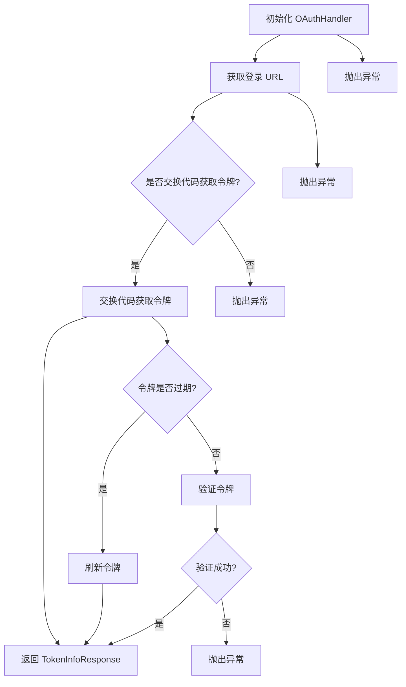

## 类结构

```
WordPressOAuthHandler (类)
├── BaseOAuthHandler (基类)
│   ├── OAuth2Credentials (类)
│   ├── ProviderName (枚举)
│   └── SecretStr (类)
└── _api (模块)
    ├── OAuthTokenResponse (类)
    ├── TokenInfoResponse (类)
    ├── make_oauth_authorize_url (函数)
    ├── oauth_exchange_code_for_tokens (函数)
    ├── oauth_refresh_tokens (函数)
    └── validate_token (函数)
```

## 全局变量及字段


### `logger`
    
Logger instance for logging purposes.

类型：`Logger`
    


### `WordPressScope`
    
Enum representing WordPress OAuth2 scopes.

类型：`Enum`
    


### `OAuth2Credentials`
    
Class representing OAuth2 credentials.

类型：`Class`
    


### `ProviderName`
    
Enum representing OAuth provider names.

类型：`Enum`
    


### `SecretStr`
    
Class representing secret strings.

类型：`Class`
    


### `OAuthTokenResponse`
    
Class representing OAuth token response.

类型：`Class`
    


### `TokenInfoResponse`
    
Class representing token information response.

类型：`Class`
    


### `make_oauth_authorize_url`
    
Function to create OAuth authorize URL.

类型：`Function`
    


### `oauth_exchange_code_for_tokens`
    
Function to exchange authorization code for tokens.

类型：`Function`
    


### `oauth_refresh_tokens`
    
Function to refresh OAuth tokens.

类型：`Function`
    


### `validate_token`
    
Function to validate an access token and get associated metadata.

类型：`Function`
    


### `WordPressScope.POSTS`
    
Scope for accessing posts.

类型：`str`
    


### `WordPressScope.COMMENTS`
    
Scope for accessing comments.

类型：`str`
    


### `WordPressScope.LIKES`
    
Scope for accessing likes.

类型：`str`
    


### `WordPressScope.FOLLOW`
    
Scope for following users.

类型：`str`
    


### `WordPressScope.STATS`
    
Scope for accessing stats.

类型：`str`
    


### `WordPressScope.USERS`
    
Scope for accessing users.

类型：`str`
    


### `WordPressScope.SITES`
    
Scope for accessing sites.

类型：`str`
    


### `WordPressScope.MEDIA`
    
Scope for accessing media.

类型：`str`
    


### `WordPressScope.AUTH`
    
Scope for accessing /me endpoints only.

类型：`str`
    


### `WordPressScope.GLOBAL`
    
Scope for full access to all user's blogs.

类型：`str`
    


### `WordPressOAuthHandler.PROVIDER_NAME`
    
Provider name for WordPress.

类型：`ProviderName`
    


### `WordPressOAuthHandler.DEFAULT_SCOPES`
    
Default scopes for single blog access.

类型：`list[str]`
    


### `WordPressOAuthHandler.client_id`
    
Client ID for OAuth2 authentication.

类型：`str`
    


### `WordPressOAuthHandler.client_secret`
    
Client secret for OAuth2 authentication.

类型：`Optional[str]`
    


### `WordPressOAuthHandler.redirect_uri`
    
Redirect URI for OAuth2 authentication.

类型：`str`
    


### `WordPressOAuthHandler.scopes`
    
Scopes for OAuth2 authentication.

类型：`list[str]`
    
    

## 全局函数及方法


### `make_oauth_authorize_url`

Generate the OAuth2 authorization URL for WordPress.

参数：

- `client_id`：`str`，The client ID provided by the OAuth provider.
- `redirect_uri`：`str`，The URI to which the OAuth provider will redirect after authorization.
- `scopes`：`Optional[str]`，The OAuth2 scopes to request. If not provided, defaults to an empty string.

返回值：`str`，The OAuth2 authorization URL.

#### 流程图

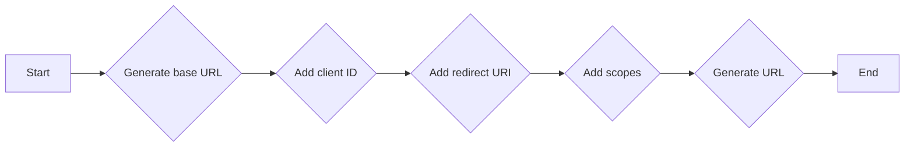

#### 带注释源码

```python
def make_oauth_authorize_url(client_id: str, redirect_uri: str, scopes: Optional[str] = None) -> str:
    """
    Generate the OAuth2 authorization URL for WordPress.

    :param client_id: str, The client ID provided by the OAuth provider.
    :param redirect_uri: str, The URI to which the OAuth provider will redirect after authorization.
    :param scopes: Optional[str], The OAuth2 scopes to request. If not provided, defaults to an empty string.
    :return: str, The OAuth2 authorization URL.
    """
    base_url = "https://public-api.wordpress.com/oauth2/v1/authorize"
    params = {
        "client_id": client_id,
        "redirect_uri": redirect_uri,
        "response_type": "code",
    }
    if scopes:
        params["scope"] = scopes

    return f"{base_url}?{quote(query_string(params))}"
``` 


### oauth_exchange_code_for_tokens

This function exchanges an authorization code for access and refresh tokens.

参数：

- `client_id`：`str`，The client ID provided by the OAuth provider.
- `client_secret`：`str`，The client secret provided by the OAuth provider. It can be an empty string if not provided.
- `code`：`str`，The authorization code received from the OAuth provider.
- `redirect_uri`：`str`，The redirect URI used to receive the authorization code.

返回值：`OAuthTokenResponse`，A response object containing the access token, refresh token, and other information.

#### 流程图

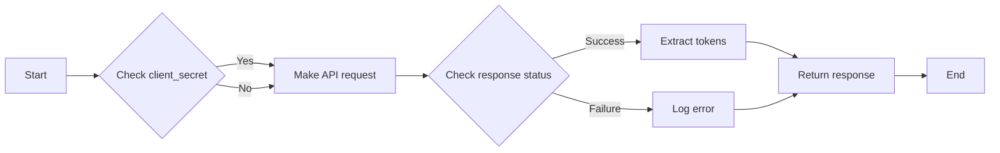

#### 带注释源码

```python
async def oauth_exchange_code_for_tokens(
    client_id: str,
    client_secret: str,
    code: str,
    redirect_uri: str,
) -> OAuthTokenResponse:
    try:
        response: OAuthTokenResponse = await make_api_request(
            client_id=client_id,
            client_secret=client_secret,
            code=code,
            redirect_uri=redirect_uri,
        )
        logger.info("Successfully exchanged code for tokens")
        return response
    except Exception as e:
        logger.error(f"Failed to exchange code for tokens: {str(e)}")
        raise
```


### oauth_refresh_tokens

This function refreshes OAuth tokens for a given client ID, client secret, and refresh token.

参数：

- `client_id`：`str`，The client ID provided by the OAuth provider.
- `client_secret`：`str`，The client secret provided by the OAuth provider.
- `refresh_token`：`str`，The refresh token obtained during the OAuth authorization process.

返回值：`OAuthTokenResponse`，A response object containing the new access token, refresh token, and other relevant information.

#### 流程图

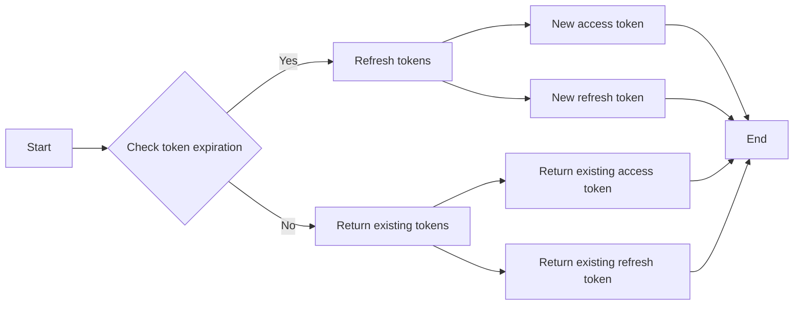

#### 带注释源码

```python
async def oauth_refresh_tokens(client_id: str, client_secret: str, refresh_token: str) -> OAuthTokenResponse:
    """
    Refresh OAuth tokens using the provided client ID, client secret, and refresh token.

    :param client_id: The client ID provided by the OAuth provider.
    :param client_secret: The client secret provided by the OAuth provider.
    :param refresh_token: The refresh token obtained during the OAuth authorization process.
    :return: A response object containing the new access token, refresh token, and other relevant information.
    """
    try:
        response: OAuthTokenResponse = await oauth_exchange_code_for_tokens(
            client_id=client_id,
            client_secret=client_secret if client_secret else "",
            code=refresh_token,
            redirect_uri=self.redirect_uri,
        )
        logger.info("Successfully refreshed tokens")

        return response
    except Exception as e:
        logger.error(f"Failed to refresh tokens: {str(e)}")
        raise
```


### validate_token

Validate an access token and get associated metadata.

参数：

- `client_id`：`str`，The client ID used to identify the application making the request.
- `token`：`str`，The access token to validate.

返回值：`TokenInfoResponse`，A response object containing the token information and associated metadata.

#### 流程图

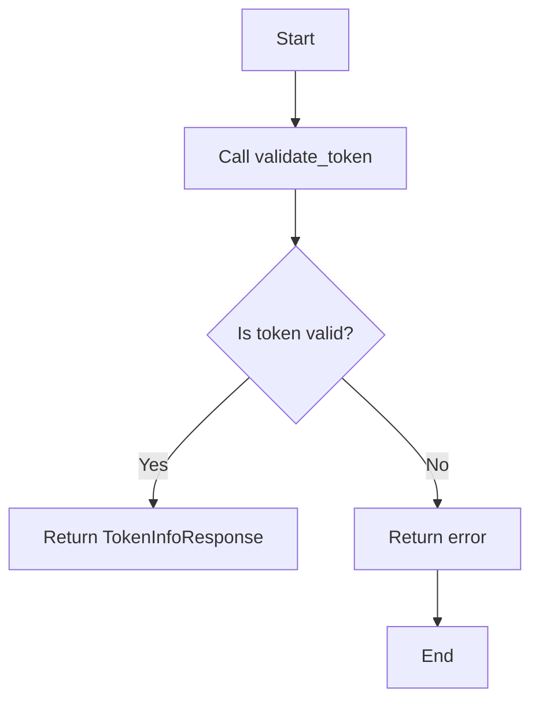

#### 带注释源码

```python
async def validate_token(client_id: str, token: str) -> TokenInfoResponse:
    # ... (Assuming the implementation of validate_token is provided elsewhere)
```


### WordPressOAuthHandler.__init__

This method initializes a new instance of the `WordPressOAuthHandler` class, setting up the necessary credentials and configuration for OAuth2 authentication with WordPress.com and Jetpack sites.

参数：

- `client_id`：`str`，The client ID provided by the OAuth2 provider.
- `client_secret`：`Optional[str]`，The client secret provided by the OAuth2 provider, which may be optional depending on the configuration.
- `redirect_uri`：`str`，The URI to which the OAuth2 provider will redirect after authentication.

返回值：无

#### 流程图

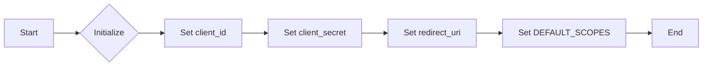

#### 带注释源码

```python
def __init__(self, client_id: str, client_secret: Optional[str], redirect_uri: str):
    self.client_id = client_id  # Set the client ID
    self.client_secret = client_secret  # Set the client secret, if provided
    self.redirect_uri = redirect_uri  # Set the redirect URI
    self.scopes = self.DEFAULT_SCOPES  # Set the default scopes
```


### WordPressOAuthHandler.get_login_url

Generates the OAuth login URL for WordPress.com and Jetpack sites.

参数：

- `scopes`：`list[str]`，A list of OAuth2 scopes to request. If not provided, defaults to single blog access.
- `state`：`str`，A string used to maintain state between the authorization server and the client application.
- `code_challenge`：`Optional[str]`，An optional code challenge for Proof Key for Code Exchange (PKCE), which is not used by WordPress.

返回值：`str`，The generated OAuth login URL.

#### 流程图

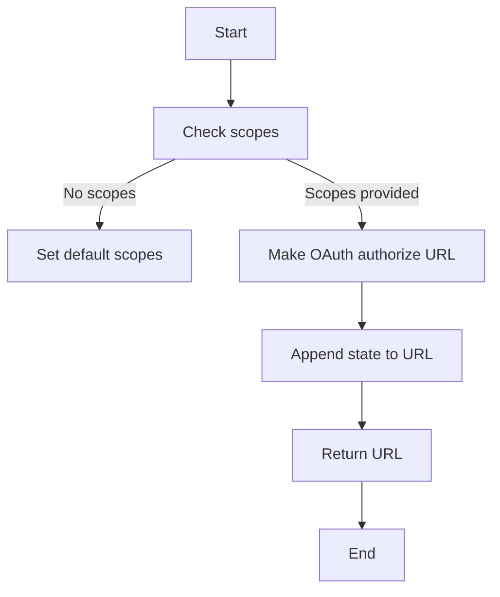

#### 带注释源码

```python
def get_login_url(self, scopes: list[str], state: str, code_challenge: Optional[str] = None) -> str:
    logger.debug("Generating WordPress OAuth login URL")
    # WordPress doesn't require PKCE, so code_challenge is not used
    if not scopes:
        logger.debug("No scopes provided, will default to single blog access")
        scopes = self.scopes

    logger.debug(f"Using scopes: {scopes}")
    logger.debug(f"State: {state}")

    try:
        base_url = make_oauth_authorize_url(
            self.client_id, self.redirect_uri, scopes if scopes else None
        )

        separator = "&" if "?" in base_url else "?"
        url = f"{base_url}{separator}state={quote(state)}"
        logger.debug(f"Generated OAuth URL: {url}")
        return url
    except Exception as e:
        logger.error(f"Failed to generate OAuth URL: {str(e)}")
        raise
```


### `exchange_code_for_tokens`

This method exchanges an authorization code for access and refresh tokens from the WordPress OAuth server.

参数：

- `code`：`str`，The authorization code received from the OAuth server.
- `scopes`：`list[str]`，The list of scopes for the access token.
- `code_verifier`：`Optional[str]`，The code verifier used in the PKCE flow (not used by WordPress).

返回值：`OAuth2Credentials`，An object containing the access and refresh tokens, along with their metadata.

#### 流程图

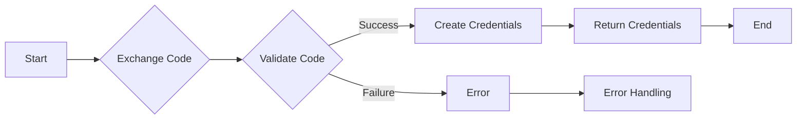

#### 带注释源码

```python
async def exchange_code_for_tokens(
    self, code: str, scopes: list[str], code_verifier: Optional[str] = None
) -> OAuth2Credentials:
    logger.debug("Exchanging authorization code for tokens")
    logger.debug(f"Code: {code[:4]}...")
    logger.debug(f"Scopes: {scopes}")

    # WordPress doesn't use PKCE, so code_verifier is not needed

    try:
        response: OAuthTokenResponse = await oauth_exchange_code_for_tokens(
            client_id=self.client_id,
            client_secret=self.client_secret if self.client_secret else "",
            code=code,
            redirect_uri=self.redirect_uri,
        )
        logger.info("Successfully exchanged code for tokens")

        # Store blog info in metadata
        metadata = {}
        if response.blog_id:
            metadata["blog_id"] = response.blog_id
        if response.blog_url:
            metadata["blog_url"] = response.blog_url

        # WordPress tokens from code flow don't expire
        credentials = OAuth2Credentials(
            access_token=SecretStr(response.access_token),
            refresh_token=(
                SecretStr(response.refresh_token)
                if response.refresh_token
                else None
            ),
            access_token_expires_at=None,
            refresh_token_expires_at=None,
            provider=self.PROVIDER_NAME,
            scopes=scopes if scopes else [],
            metadata=metadata,
        )

        if response.expires_in:
            logger.debug(
                f"Token expires in {response.expires_in} seconds (client-side token)"
            )
        else:
            logger.debug("Token does not expire (server-side token)")

        return credentials

    except Exception as e:
        logger.error(f"Failed to exchange code for tokens: {str(e)}")
        raise
```


### `_refresh_tokens`

This method is used to refresh OAuth tokens for a WordPress OAuth handler. It checks if the token is a server-side token that does not expire. If a refresh token is available, it attempts to refresh the tokens using the provided refresh token.

参数：

- `credentials`：`OAuth2Credentials`，The OAuth2 credentials object containing the access token and refresh token to be refreshed.

返回值：`OAuth2Credentials`，The refreshed OAuth2 credentials object.

#### 流程图

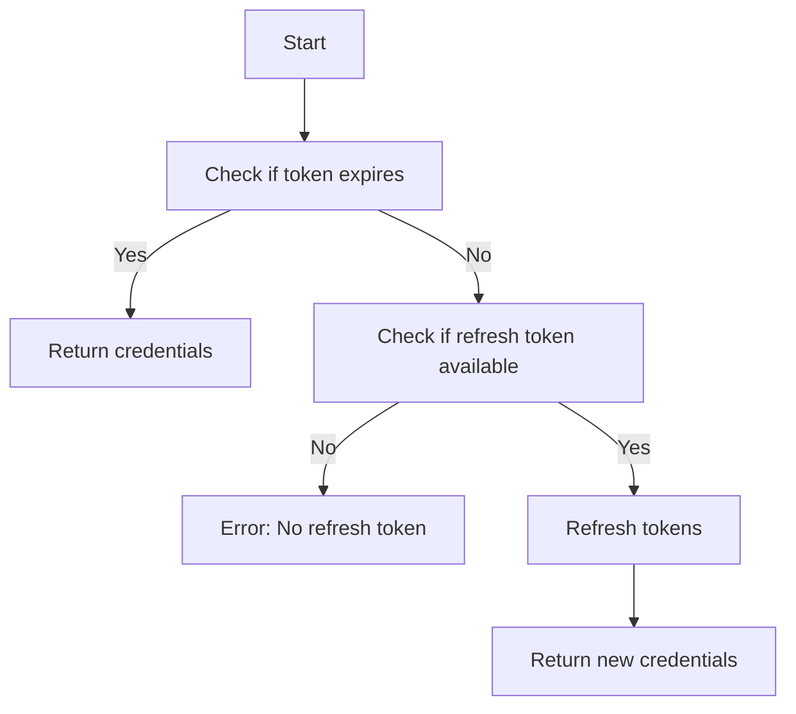

#### 带注释源码

```python
async def _refresh_tokens(self, credentials: OAuth2Credentials) -> OAuth2Credentials:
    """
    Attempt to refresh OAuth tokens.

    :param credentials: OAuth2Credentials object containing the access token and refresh token to be refreshed.
    :return: OAuth2Credentials object with refreshed tokens.
    """

    logger.debug("Attempting to refresh OAuth tokens")

    # Server-side tokens don't expire
    if credentials.access_token_expires_at is None:
        logger.info("Token does not expire (server-side token), no refresh needed")
        return credentials

    if credentials.refresh_token is None:
        logger.error("Cannot refresh tokens - no refresh token available")
        raise ValueError("No refresh token available")

    try:
        response: OAuthTokenResponse = await oauth_refresh_tokens(
            client_id=self.client_id,
            client_secret=self.client_secret if self.client_secret else "",
            refresh_token=credentials.refresh_token.get_secret_value(),
        )
        logger.info("Successfully refreshed tokens")

        # Preserve blog info from original credentials
        metadata = credentials.metadata or {}
        if response.blog_id:
            metadata["blog_id"] = response.blog_id
        if response.blog_url:
            metadata["blog_url"] = response.blog_url

        new_credentials = OAuth2Credentials(
            access_token=SecretStr(response.access_token),
            refresh_token=(
                SecretStr(response.refresh_token)
                if response.refresh_token
                else credentials.refresh_token
            ),
            access_token_expires_at=(
                int(time.time()) + response.expires_in
                if response.expires_in
                else None
            ),
            refresh_token_expires_at=None,
            provider=self.PROVIDER_NAME,
            scopes=credentials.scopes,
            metadata=metadata,
        )

        if response.expires_in:
            logger.debug(f"New access token expires in {response.expires_in} seconds")
        else:
            logger.debug("New token does not expire")

        return new_credentials

    except Exception as e:
        logger.error(f"Failed to refresh tokens: {str(e)}")
        raise
```


### `WordPressOAuthHandler.revoke_tokens`

This method is used to revoke OAuth tokens for a given set of credentials. Since WordPress tokens do not expire and do not provide a token revocation endpoint, this method simply returns `False` to indicate that token revocation is not supported.

参数：

- `credentials`：`OAuth2Credentials`，The credentials object containing the access and refresh tokens to be revoked.

返回值：`bool`，Always returns `False` as WordPress does not support token revocation.

#### 流程图

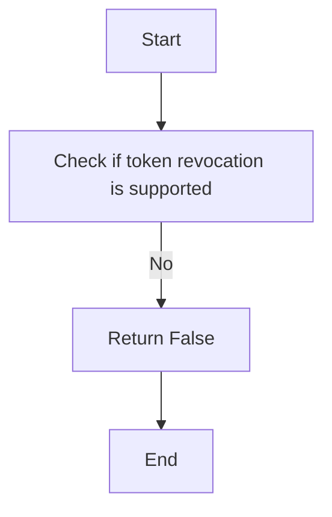

#### 带注释源码

```
async def revoke_tokens(self, credentials: OAuth2Credentials) -> bool:
    logger.debug("Token revocation requested")
    logger.info(
        "WordPress doesn't provide a token revocation endpoint - server-side tokens don't expire"
    )
    return False
```


### `WordPressOAuthHandler.validate_access_token`

Validate an access token and get associated metadata.

参数：

- `token`：`str`，The access token to validate.

返回值：`TokenInfoResponse`，The response containing the token information.

#### 流程图

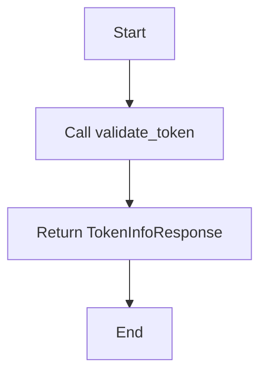

#### 带注释源码

```python
async def validate_access_token(self, token: str) -> TokenInfoResponse:
    """Validate an access token and get associated metadata."""
    return await validate_token(self.client_id, token)
```


## 关键组件


### WordPressScope

WordPress OAuth2 scopes.

### WordPressOAuthHandler

OAuth2 handler for WordPress.com and Jetpack sites.

Supports both single blog and global access tokens.
Server-side tokens (using 'code' response type) do not expire.


## 问题及建议


### 已知问题

-   **代码重复**：`_refresh_tokens` 方法中存在与 `exchange_code_for_tokens` 方法中类似的代码，用于获取新的访问令牌和刷新令牌。这部分代码可以提取为公共函数以减少重复。
-   **日志记录**：日志记录中使用了 `logger.debug` 和 `logger.info`，但没有使用 `logger.warning` 或 `logger.error` 来记录可能的问题或错误。这可能导致重要信息被遗漏。
-   **异常处理**：代码中使用了 `raise` 来抛出异常，但没有提供具体的异常类型。这可能导致调用者难以理解异常的来源。
-   **全局变量**：`logger` 是一个全局变量，这可能导致在多线程环境中出现竞态条件。

### 优化建议

-   **提取公共函数**：将 `exchange_code_for_tokens` 和 `_refresh_tokens` 方法中获取访问令牌和刷新令牌的代码提取为公共函数，以减少代码重复。
-   **增强日志记录**：在代码中添加 `logger.warning` 和 `logger.error` 来记录可能的问题或错误，以便更好地跟踪和调试。
-   **使用具体的异常类型**：在抛出异常时使用具体的异常类型，以便调用者可以更准确地处理异常。
-   **线程安全**：如果 `logger` 在多线程环境中使用，应确保其线程安全，或者使用其他日志记录机制。
-   **代码注释**：在代码中添加适当的注释，以提高代码的可读性和可维护性。
-   **文档**：为代码添加详细的文档，包括类和方法的功能、参数和返回值。
-   **单元测试**：编写单元测试来验证代码的功能和正确性。
-   **代码风格**：遵循一致的代码风格指南，以提高代码的可读性和可维护性。


## 其它


### 设计目标与约束

- 设计目标：
  - 实现一个OAuth2处理器，用于WordPress.com和Jetpack网站的认证。
  - 支持单博客和全局访问令牌。
  - 服务器端令牌（使用'code'响应类型）不失效。
- 约束：
  - 必须遵循WordPress OAuth2协议。
  - 必须处理错误和异常情况。
  - 必须确保安全性，防止未经授权的访问。

### 错误处理与异常设计

- 错误处理：
  - 使用日志记录错误信息。
  - 抛出异常，以便调用者可以处理。
- 异常设计：
  - 定义自定义异常类，以便更清晰地表示错误情况。

### 数据流与状态机

- 数据流：
  - 用户请求登录URL。
  - 用户在WordPress登录页面登录。
  - 用户被重定向回应用程序，并带有授权代码。
  - 应用程序交换授权代码以获取访问令牌。
  - 应用程序使用访问令牌进行API调用。
- 状态机：
  - 定义不同的状态，例如“未认证”、“已认证”和“令牌过期”。
  - 定义状态转换，例如从“未认证”到“已认证”。

### 外部依赖与接口契约

- 外部依赖：
  - `backend.sdk`：用于OAuth2认证。
  - `logging`：用于日志记录。
  - `typing`：用于类型注解。
  - `urllib.parse`：用于URL编码。
- 接口契约：
  - `BaseOAuthHandler`：定义OAuth2处理器的接口。
  - `OAuth2Credentials`：定义OAuth2凭证的接口。
  - `ProviderName`：定义提供者名称的枚举。
  - `SecretStr`：定义用于存储敏感信息的类。
  - `OAuthTokenResponse`：定义OAuth2令牌响应的接口。
  - `TokenInfoResponse`：定义令牌信息的接口。
  - `make_oauth_authorize_url`：用于生成OAuth2授权URL的函数。
  - `oauth_exchange_code_for_tokens`：用于交换授权代码以获取令牌的函数。
  - `oauth_refresh_tokens`：用于刷新令牌的函数。
  - `validate_token`：用于验证令牌的函数。

    