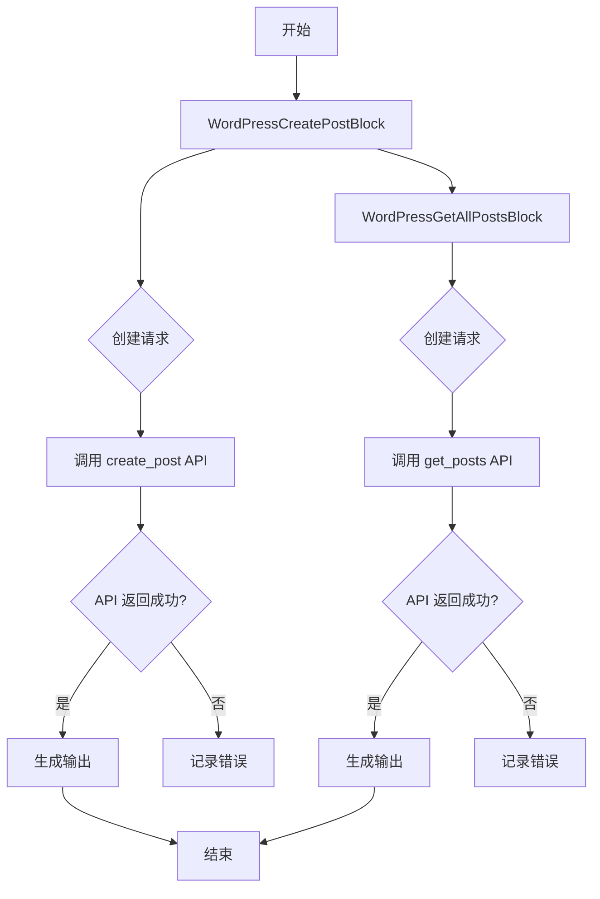
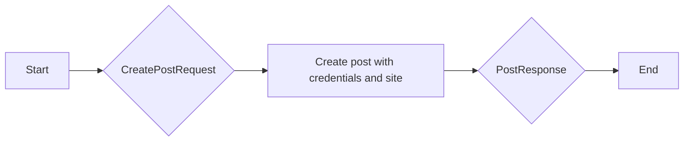
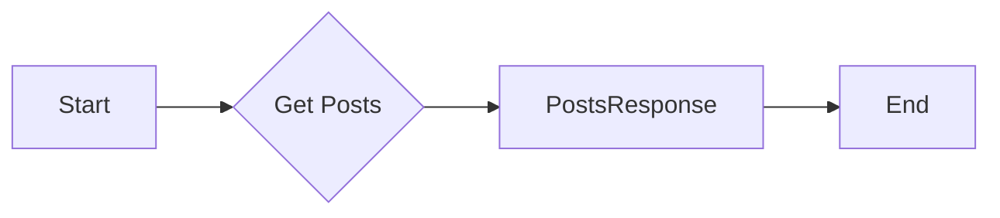
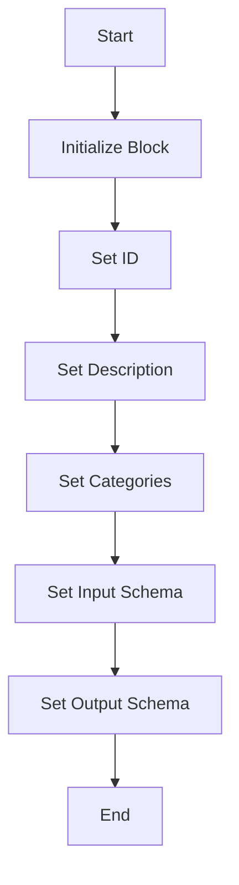
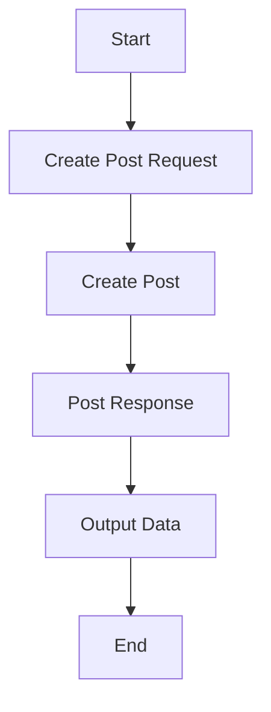
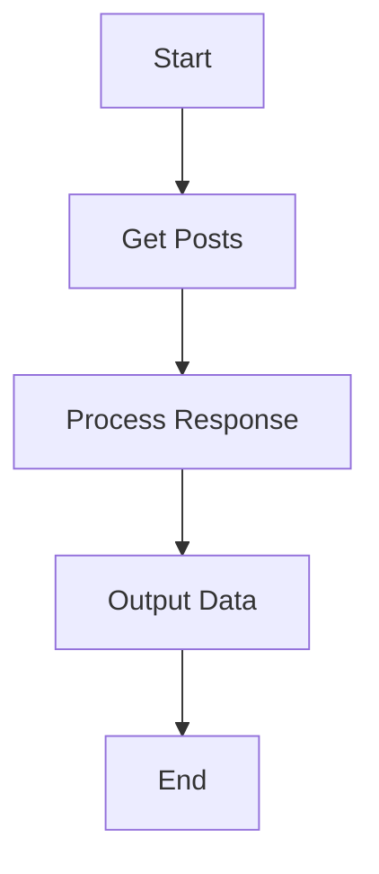

# `.\AutoGPT\autogpt_platform\backend\backend\blocks\wordpress\blog.py` 详细设计文档

This code defines two WordPress blocks for creating and fetching posts from WordPress.com or Jetpack-enabled sites. It uses SDKs for interacting with WordPress APIs and handles input validation, post creation, and fetching with pagination and filtering options.

## 整体流程



## 类结构

```
WordPressCreatePostBlock (WordPress 创建帖子块)
├── Input (输入)
│   ├── credentials (CredentialsMetaInput): 认证信息
│   ├── site (str): 站点 ID 或域名
│   ├── title (str): 帖子标题
│   ├── content (str): 帖子内容
│   ├── excerpt (str | None): 帖子摘要
│   ├── slug (str | None): 帖子 URL
│   ├── author (str | None): 作者
│   ├── categories (list[str]): 分类
│   ├── tags (list[str]): 标签
│   ├── featured_image (str | None): 特色图片
│   ├── media_urls (list[str]): 媒体 URL
│   └── publish_as_draft (bool): 是否发布为草稿
└── Output (输出)
    ├── site (str): 站点 ID 或域名
    ├── post_id (int): 创建的帖子 ID
    ├── post_url (str): 创建的帖子 URL
    ├── short_url (str): 短 URL
    └── post_data (dict): 完整的帖子数据
WordPressGetAllPostsBlock (WordPress 获取所有帖子块)
├── Input (输入)
│   ├── credentials (CredentialsMetaInput): 认证信息
│   ├── site (str): 站点 ID 或域名
│   ├── status (PostStatus | None): 帖子状态
│   ├── number (int): 获取的帖子数量
│   └── offset (int): 跳过的帖子数量
└── Output (输出)
    ├── site (str): 站点 ID 或域名
    ├── found (int): 找到的帖子总数
    ├── posts (list[Post]): 帖子列表
    └── post (Post): 单个帖子对象
```

## 全局变量及字段


### `credentials`
    
Credentials for accessing WordPress API.

类型：`CredentialsMetaInput`
    


### `site`
    
Site ID or domain of the WordPress site.

类型：`str`
    


### `title`
    
Title of the post to be created.

类型：`str`
    


### `content`
    
Content of the post to be created, supporting HTML.

类型：`str`
    


### `excerpt`
    
Optional post excerpt/summary.

类型：`str | None`
    


### `slug`
    
URL slug for the post. Auto-generated if not provided.

类型：`str | None`
    


### `author`
    
Username or ID of the author. Defaults to authenticated user.

类型：`str | None`
    


### `categories`
    
List of category names or IDs for the post.

类型：`list[str]`
    


### `tags`
    
List of tag names or IDs for the post.

类型：`list[str]`
    


### `featured_image`
    
Post ID of an existing attachment to set as featured image.

类型：`str | None`
    


### `media_urls`
    
URLs of images to sideload and attach to the post.

类型：`list[str]`
    


### `publish_as_draft`
    
If True, publishes the post as a draft. If False, publishes it publicly.

类型：`bool`
    


### `status`
    
Filter by post status, or None for all.

类型：`PostStatus | None`
    


### `number`
    
Number of posts to retrieve (max 100 per request).

类型：`int`
    


### `offset`
    
Number of posts to skip (for pagination).

类型：`int`
    


### `WordPressCreatePostBlock.Input`
    
Input schema for creating a WordPress post.

类型：`BlockSchemaInput`
    


### `WordPressCreatePostBlock.Output`
    
Output schema for the WordPress post creation block.

类型：`BlockSchemaOutput`
    


### `WordPressGetAllPostsBlock.Input`
    
Input schema for fetching all posts from a WordPress site.

类型：`BlockSchemaInput`
    


### `WordPressGetAllPostsBlock.Output`
    
Output schema for the WordPress post fetching block.

类型：`BlockSchemaOutput`
    
    

## 全局函数及方法


### create_post

This function creates a new post on a WordPress.com site or Jetpack-enabled site and publishes it.

参数：

- `credentials`：`Credentials`，The credentials used to authenticate with the WordPress API.
- `site`：`str`，The site ID or domain (e.g., 'myblog.wordpress.com' or '123456789').
- `post_data`：`CreatePostRequest`，The data for the new post, including title, content, excerpt, slug, author, categories, tags, featured image, media URLs, and status.

返回值：`PostResponse`，The response from the WordPress API containing the ID, URL, and other details of the created post.

#### 流程图



#### 带注释源码

```python
async def create_post(credentials: Credentials, site: str, post_data: CreatePostRequest) -> PostResponse:
    # Create the post with the provided credentials, site, and post data
    post_response: PostResponse = await self._api_client.create_post(
        credentials=credentials,
        site=site,
        post_data=post_data,
    )
    return post_response
```


### get_posts

Fetches all posts from a WordPress.com site or Jetpack-enabled site. Supports filtering by status and pagination.

参数：

- `credentials`：`Credentials`，The credentials used to authenticate with the WordPress API.
- `site`：`str`，The site ID or domain (e.g., 'myblog.wordpress.com' or '123456789').
- `status`：`PostStatus | None`，Filter by post status, or None for all.
- `number`：`int`，Number of posts to retrieve (max 100 per request).
- `offset`：`int`，Number of posts to skip (for pagination).

返回值：`PostsResponse`，A response object containing the list of posts and other metadata.

#### 流程图



#### 带注释源码

```python
async def get_posts(
    credentials: Credentials,
    site: str,
    status: PostStatus | None = None,
    number: int = 20,
    offset: int = 0,
) -> PostsResponse:
    # Call the API to get posts
    response = await self._api_client.get_posts(
        credentials=credentials,
        site=site,
        status=status,
        number=number,
        offset=offset,
    )
    # Return the response
    return response
``` 


### WordPressCreatePostBlock.__init__

This method initializes the WordPressCreatePostBlock class, setting up its metadata and schema for creating a new post on WordPress.com or Jetpack-enabled sites.

参数：

- `id`: `str`，The unique identifier for the block.
- `description`: `str`，A brief description of the block's functionality.
- `categories`: `set[str]`，A set of categories that the block belongs to.
- `input_schema`: `Input`，The schema for the input data of the block.
- `output_schema`: `Output`，The schema for the output data of the block.

返回值：无

#### 流程图



#### 带注释源码

```python
def __init__(self):
    super().__init__(
        id="ee4fe08c-18f9-442f-a985-235379b932e1",
        description="Create a new post on WordPress.com or Jetpack sites",
        categories={BlockCategory.SOCIAL},
        input_schema=self.Input,
        output_schema=self.Output,
    )
```


### WordPressCreatePostBlock.run

This method creates a new post on a WordPress.com site or Jetpack-enabled site and publishes it.

参数：

- `input_data`：`Input`，The input data for creating a post, including title, content, excerpt, slug, author, categories, tags, featured image, media URLs, and publish status.
- `credentials`：`Credentials`，The credentials used to authenticate with the WordPress API.
- `**kwargs`：`Any`，Additional keyword arguments that may be passed to the method.

返回值：`BlockOutput`，The output data for the created post, including site, post ID, post URL, short URL, and post data.

#### 流程图



#### 带注释源码

```python
async def run(self, input_data: Input, *, credentials: Credentials, **kwargs) -> BlockOutput:
    post_request = CreatePostRequest(
        title=input_data.title,
        content=input_data.content,
        excerpt=input_data.excerpt,
        slug=input_data.slug,
        author=input_data.author,
        categories=input_data.categories,
        tags=input_data.tags,
        featured_image=input_data.featured_image,
        media_urls=input_data.media_urls,
        status=(
            PostStatus.DRAFT if input_data.publish_as_draft else PostStatus.PUBLISH
        ),
    )

    post_response: PostResponse = await create_post(
        credentials=credentials,
        site=input_data.site,
        post_data=post_request,
    )

    yield "site", input_data.site
    yield "post_id", post_response.ID
    yield "post_url", post_response.URL
    yield "short_url", post_response.short_URL
    yield "post_data", post_response.model_dump()
```


### WordPressGetAllPostsBlock.__init__

This method initializes the WordPressGetAllPostsBlock class, setting up its metadata and schema for the block.

参数：

- `self`：`WordPressGetAllPostsBlock`，The instance of the class being initialized.

返回值：无

#### 流程图


#### 带注释源码

```python
def __init__(self):
    super().__init__(
        id="97728fa7-7f6f-4789-ba0c-f2c114119536",
        description="Fetch all posts from WordPress.com or Jetpack sites",
        categories={BlockCategory.SOCIAL},
        input_schema=self.Input,
        output_schema=self.Output,
    )
```


### WordPressGetAllPostsBlock.run

Fetches all posts from a WordPress.com site or Jetpack-enabled site, with support for filtering by status and pagination.

参数：

- `input_data`：`Input`，The input data for the block, containing the site, status, number, and offset for fetching posts.
- `credentials`：`Credentials`，The credentials used to authenticate with the WordPress API.
- `**kwargs`：`Any`，Additional keyword arguments that may be passed to the function.

返回值：`BlockOutput`，The output data for the block, containing the site, found number of posts, list of posts, and individual post objects.

#### 流程图



#### 带注释源码

```python
async def run(self, input_data: Input, *, credentials: Credentials, **kwargs) -> BlockOutput:
    # Fetch all posts from the WordPress API
    posts_response: PostsResponse = await get_posts(
        credentials=credentials,
        site=input_data.site,
        status=input_data.status,
        number=input_data.number,
        offset=input_data.offset,
    )

    # Yield the site information
    yield "site", input_data.site
    # Yield the total number of posts found
    yield "found", posts_response.found
    # Yield the list of all posts
    yield "posts", posts_response.posts
    # Yield individual post objects
    for post in posts_response.posts:
        yield "post", post
```


## 关键组件


### WordPressCreatePostBlock

A block that creates a new post on a WordPress.com site or Jetpack-enabled site and publishes it.

### WordPressGetAllPostsBlock

A block that fetches all posts from a WordPress.com site or Jetpack-enabled site, supporting filtering by status and pagination.


## 问题及建议


### 已知问题

-   **全局变量和函数依赖性**：代码中使用了全局变量 `wordpress` 和全局函数 `create_post`、`get_posts`，这可能导致代码的可维护性和可测试性降低。建议将相关逻辑封装在类中，减少全局变量的使用。
-   **异常处理**：代码中没有显示异常处理逻辑，当API调用失败或数据格式错误时，可能会引发未处理的异常。建议添加异常处理机制，确保程序的健壮性。
-   **代码重复**：`WordPressCreatePostBlock` 和 `WordPressGetAllPostsBlock` 类中存在一些重复的代码，如初始化方法和输出字段。建议提取公共逻辑，减少代码重复。

### 优化建议

-   **封装全局变量和函数**：将 `wordpress` 和 `create_post`、`get_posts` 等逻辑封装在类中，减少全局变量的使用，提高代码的可维护性和可测试性。
-   **添加异常处理**：在调用API和数据处理过程中添加异常处理逻辑，确保程序在遇到错误时能够优雅地处理异常。
-   **提取公共逻辑**：将 `WordPressCreatePostBlock` 和 `WordPressGetAllPostsBlock` 类中的公共逻辑提取出来，创建一个基类或工具类，减少代码重复。
-   **单元测试**：为代码编写单元测试，确保各个功能模块正常工作，并方便后续维护和扩展。
-   **日志记录**：添加日志记录功能，方便调试和问题追踪。
-   **代码格式化**：使用代码格式化工具，确保代码风格一致，提高代码可读性。
-   **文档注释**：为代码添加必要的文档注释，方便其他开发者理解代码逻辑。


## 其它


### 设计目标与约束

- 设计目标：
  - 提供一个模块化的WordPress博客管理解决方案。
  - 支持WordPress.com和Jetpack启用站点。
  - 确保API调用的高效性和安全性。
  - 提供灵活的输入参数，以支持不同的博客管理需求。

- 约束：
  - 必须使用WordPress官方API进行操作。
  - 输入参数必须符合WordPress API的要求。
  - 代码必须遵循Python异步编程的最佳实践。

### 错误处理与异常设计

- 错误处理：
  - 捕获并处理API调用中的异常，如网络错误、认证失败等。
  - 将异常转换为自定义错误消息，以便于用户理解。
  - 记录错误日志，以便于问题追踪和调试。

- 异常设计：
  - 定义自定义异常类，用于处理特定错误情况。
  - 异常类应包含错误代码、错误消息和可能的解决方案。

### 数据流与状态机

- 数据流：
  - 输入数据通过API请求传递到WordPress服务器。
  - WordPress服务器处理请求并返回响应。
  - 响应数据通过API返回给客户端。

- 状态机：
  - 定义博客文章的状态，如草稿、已发布等。
  - 根据用户输入和API响应更新文章状态。

### 外部依赖与接口契约

- 外部依赖：
  - WordPress官方API。
  - Python异步编程库。

- 接口契约：
  - 定义API请求和响应的格式。
  - 确保API调用符合WordPress官方规范。

### 安全性与认证

- 安全性：
  - 使用HTTPS协议保护数据传输安全。
  - 对敏感数据进行加密处理。

- 认证：
  - 使用OAuth或其他认证机制进行用户认证。
  - 确保只有授权用户才能访问API。

### 性能优化

- 性能优化：
  - 使用缓存机制减少API调用次数。
  - 优化代码结构，提高执行效率。

### 可维护性与可扩展性

- 可维护性：
  - 代码结构清晰，易于理解和维护。
  - 使用文档和注释说明代码功能。

- 可扩展性：
  - 设计模块化架构，方便添加新功能。
  - 提供接口供第三方扩展功能。


    