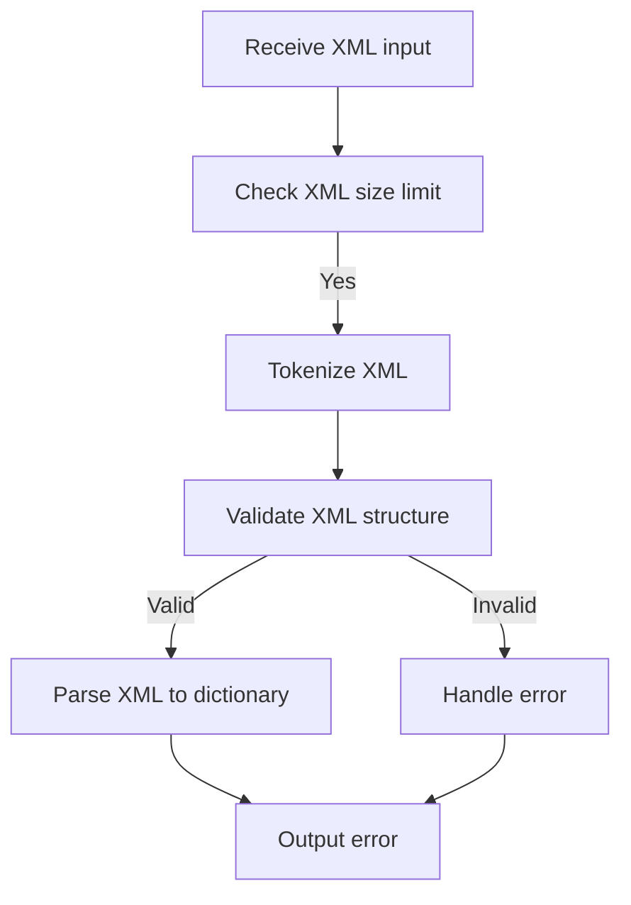
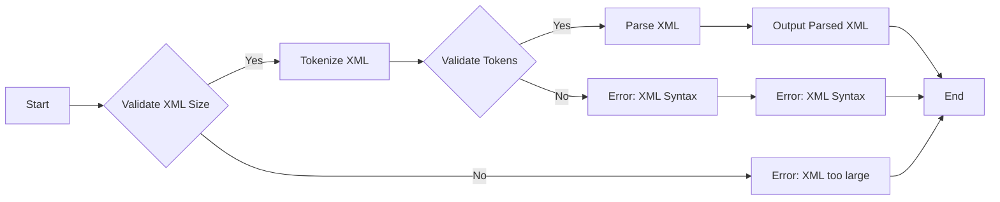
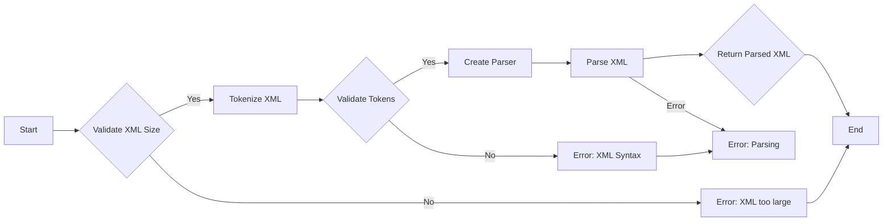
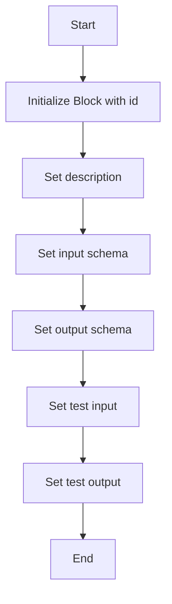
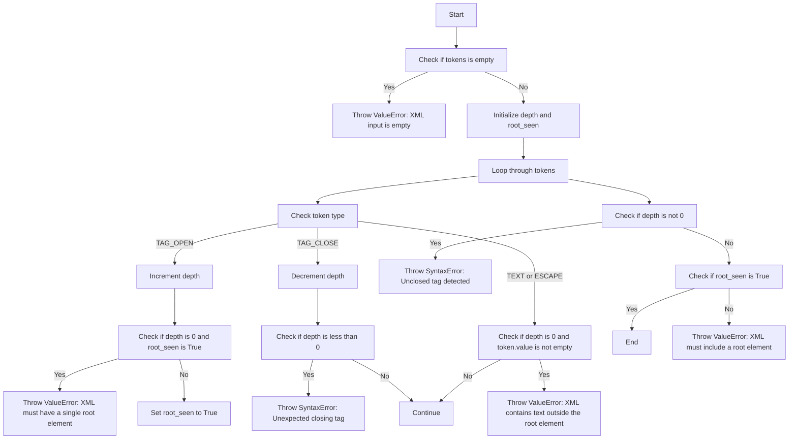
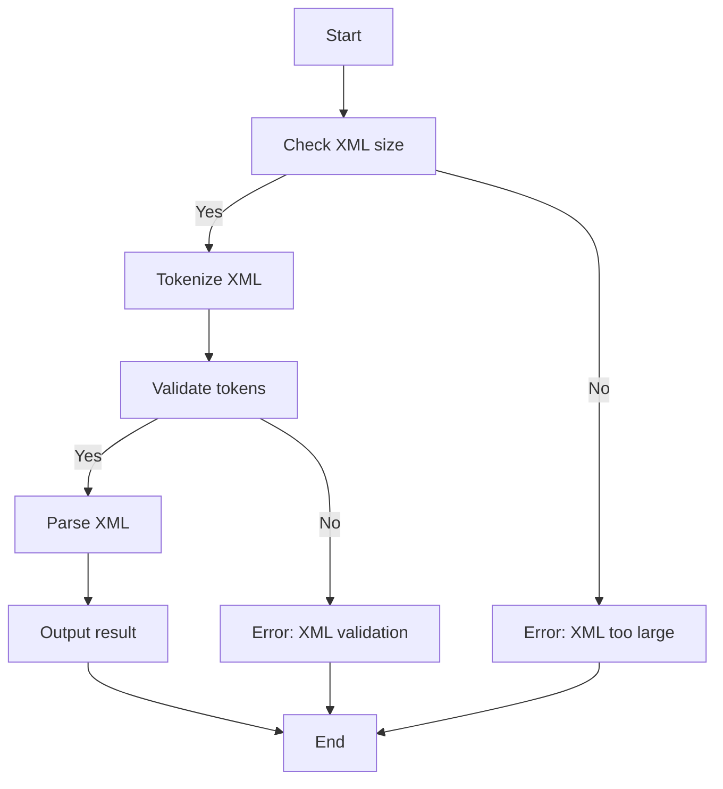

# `.\AutoGPT\autogpt_platform\backend\backend\blocks\xml_parser.py` 详细设计文档

The XMLParserBlock class is designed to parse XML input and convert it into a dictionary format using the gravitasml library. It validates the XML structure and handles potential errors during parsing.

## 整体流程



## 类结构

```
XMLParserBlock (Concrete Block)
├── Input (BlockSchemaInput)
│   ├── input_xml (str): Input XML to be parsed
│   └── error (str): Error in parsing
└── Output (BlockSchemaOutput)
    ├── parsed_xml (dict): Output parsed XML to dict
    └── error (str): Error in parsing
```

## 全局变量及字段


### `MAX_XML_SIZE`
    
Maximum allowed size of the XML input to prevent XML bomb attacks

类型：`int`
    


### `XMLParserBlock.id`
    
Unique identifier for the XMLParserBlock class

类型：`str`
    


### `XMLParserBlock.description`
    
Description of the XMLParserBlock class

类型：`str`
    


### `XMLParserBlock.input_schema`
    
Input schema for the XMLParserBlock class

类型：`BlockSchemaInput`
    


### `XMLParserBlock.output_schema`
    
Output schema for the XMLParserBlock class

类型：`BlockSchemaOutput`
    


### `XMLParserBlock.test_input`
    
Test input data for the XMLParserBlock class

类型：`dict`
    


### `XMLParserBlock.test_output`
    
Test output data for the XMLParserBlock class

类型：`list`
    


### `Input.input_xml`
    
Input XML string to be parsed

类型：`str`
    


### `Input.error`
    
Error message if any during parsing

类型：`str`
    


### `Output.parsed_xml`
    
Parsed XML as a dictionary

类型：`dict`
    


### `Output.error`
    
Error message if any during parsing

类型：`str`
    
    

## 全局函数及方法


### XMLParserBlock.run

This method is responsible for parsing XML input using the gravitasml library and converting it into a dictionary representation.

参数：

- `input_data`：`Input`，The input data containing the XML to be parsed.
- `**kwargs`：`dict`，Additional keyword arguments that may be used by subclasses.

返回值：`BlockOutput`，The output of the block, which includes the parsed XML as a dictionary and any error messages.

#### 流程图



#### 带注释源码

```python
async def run(self, input_data: Input, **kwargs) -> BlockOutput:
    # Security fix: Add size limits to prevent XML bomb attacks
    MAX_XML_SIZE = 10 * 1024 * 1024  # 10MB limit for XML input

    if len(input_data.input_xml) > MAX_XML_SIZE:
        raise ValueError(
            f"XML too large: {len(input_data.input_xml)} bytes > {MAX_XML_SIZE} bytes"
        )

    try:
        tokens = list(tokenize(input_data.input_xml))
        self._validate_tokens(tokens)

        parser = Parser(tokens)
        parsed_result = parser.parse()
        yield "parsed_xml", parsed_result
    except ValueError as val_e:
        raise ValueError(f"Validation error for dict:{val_e}") from val_e
    except SyntaxError as syn_e:
        raise SyntaxError(f"Error in input xml syntax: {syn_e}") from syn_e
```


### XMLParserBlock.run

This method parses an XML string into a dictionary using the `gravitasml` library.

参数：

- `input_data`：`Input`，The input data containing the XML string to be parsed.
- `**kwargs`：Additional keyword arguments that may be used by subclasses.

返回值：`BlockOutput`，The output of the block, which includes the parsed XML as a dictionary and any error messages.

#### 流程图



#### 带注释源码

```python
async def run(self, input_data: Input, **kwargs) -> BlockOutput:
    # Security fix: Add size limits to prevent XML bomb attacks
    MAX_XML_SIZE = 10 * 1024 * 1024  # 10MB limit for XML input

    if len(input_data.input_xml) > MAX_XML_SIZE:
        raise ValueError(
            f"XML too large: {len(input_data.input_xml)} bytes > {MAX_XML_SIZE} bytes"
        )

    try:
        tokens = list(tokenize(input_data.input_xml))
        self._validate_tokens(tokens)

        parser = Parser(tokens)
        parsed_result = parser.parse()
        yield "parsed_xml", parsed_result
    except ValueError as val_e:
        raise ValueError(f"Validation error for dict:{val_e}") from val_e
    except SyntaxError as syn_e:
        raise SyntaxError(f"Error in input xml syntax: {syn_e}") from syn_e
```


### XMLParserBlock.__init__

This method initializes an instance of the XMLParserBlock class, setting up its properties and configurations.

参数：

- `id`: `str`，A unique identifier for the block.
- `description`: `str`，A description of the block's functionality.
- `input_schema`: `XMLParserBlock.Input`，The schema for the input data.
- `output_schema`: `XMLParserBlock.Output`，The schema for the output data.
- `test_input`: `dict`，A sample input for testing the block.
- `test_output`: `list`，A sample output for testing the block.

返回值：`None`，This method does not return a value.

#### 流程图



#### 带注释源码

```python
def __init__(self):
    super().__init__(
        id="286380af-9529-4b55-8be0-1d7c854abdb5",
        description="Parses XML using gravitasml to tokenize and coverts it to dict",
        input_schema=XMLParserBlock.Input,
        output_schema=XMLParserBlock.Output,
        test_input={"input_xml": "<tag1><tag2>content</tag2></tag1>"},
        test_output=[
            ("parsed_xml", {"tag1": {"tag2": "content"}}),
        ],
    )
```


### XMLParserBlock._validate_tokens

This method validates the tokens of an XML input to ensure it has a single root element and no stray text.

参数：

- `tokens`：`list[Token]`，A list of tokens representing the XML input.

返回值：`None`，This method does not return a value.

#### 流程图



#### 带注释源码

```python
@staticmethod
def _validate_tokens(tokens: list[Token]) -> None:
    """Ensure the XML has a single root element and no stray text."""
    if not tokens:
        raise ValueError("XML input is empty.")

    depth = 0
    root_seen = False

    for token in tokens:
        if token.type == "TAG_OPEN":
            if depth == 0 and root_seen:
                raise ValueError("XML must have a single root element.")
            depth += 1
            if depth == 1:
                root_seen = True
        elif token.type == "TAG_CLOSE":
            depth -= 1
            if depth < 0:
                raise SyntaxError("Unexpected closing tag in XML input.")
        elif token.type in {"TEXT", "ESCAPE"}:
            if depth == 0 and token.value:
                raise ValueError(
                    "XML contains text outside the root element; "
                    "wrap content in a single root tag."
                )

    if depth != 0:
        raise SyntaxError("Unclosed tag detected in XML input.")
    if not root_seen:
        raise ValueError("XML must include a root element.")
```


### XMLParserBlock.run

This method is responsible for parsing an XML input string and converting it into a dictionary representation using the gravitasml library.

参数：

- `input_data`：`Input`，The input data containing the XML string to be parsed.
- `**kwargs`：`dict`，Additional keyword arguments that may be used for future extensions.

返回值：`BlockOutput`，The output of the block, which includes the parsed XML as a dictionary and any error messages.

#### 流程图



#### 带注释源码

```python
async def run(self, input_data: Input, **kwargs) -> BlockOutput:
    # Security fix: Add size limits to prevent XML bomb attacks
    MAX_XML_SIZE = 10 * 1024 * 1024  # 10MB limit for XML input

    if len(input_data.input_xml) > MAX_XML_SIZE:
        raise ValueError(
            f"XML too large: {len(input_data.input_xml)} bytes > {MAX_XML_SIZE} bytes"
        )

    try:
        tokens = list(tokenize(input_data.input_xml))
        self._validate_tokens(tokens)

        parser = Parser(tokens)
        parsed_result = parser.parse()
        yield "parsed_xml", parsed_result
    except ValueError as val_e:
        raise ValueError(f"Validation error for dict:{val_e}") from val_e
    except SyntaxError as syn_e:
        raise SyntaxError(f"Error in input xml syntax: {syn_e}") from syn_e
```


## 关键组件


### 张量索引与惰性加载

用于在解析XML时，对张量进行索引和惰性加载，以提高性能和减少内存消耗。

### 反量化支持

提供对反量化操作的支持，允许在解析过程中进行反向量化处理。

### 量化策略

定义了量化策略，用于在解析过程中对数据进行量化处理，以优化性能和资源使用。


## 问题及建议


### 已知问题

-   **代码重复**：`_validate_tokens` 方法中的逻辑在多个地方被重复使用，可以考虑将其抽象为一个独立的函数或类，以减少代码重复并提高可维护性。
-   **异常处理**：异常处理较为简单，可能需要更详细的异常信息来帮助调试和记录错误。
-   **性能优化**：对于大文件的处理，虽然设置了大小限制，但解析和验证过程可能需要进一步优化以提高性能。
-   **代码注释**：代码中缺少详细的注释，这可能会影响其他开发者理解代码逻辑。

### 优化建议

-   **抽象验证逻辑**：将 `_validate_tokens` 方法抽象为一个独立的函数或类，以便在需要验证 XML 结构的地方重用。
-   **增强异常信息**：在抛出异常时，提供更详细的错误信息，包括错误发生的位置和上下文。
-   **性能优化**：考虑使用更高效的解析库或算法来处理大型 XML 文件，或者对现有代码进行优化。
-   **添加代码注释**：在关键代码段添加注释，解释代码的逻辑和目的，以提高代码的可读性和可维护性。
-   **单元测试**：编写单元测试来覆盖代码的关键路径，确保代码在各种情况下都能正常工作。
-   **文档更新**：更新设计文档和用户手册，以反映代码的更改和新的使用方法。


## 其它


### 设计目标与约束

- **设计目标**:
  - 提供一个模块化的XML解析功能，能够将XML内容转换为字典格式。
  - 确保XML解析的健壮性，能够处理异常情况，如无效的XML格式或XML炸弹攻击。
  - 提供清晰的接口和易于使用的API。

- **约束**:
  - 输入XML的大小限制为10MB，以防止XML炸弹攻击。
  - 输入XML必须包含一个根元素，并且不能包含根元素外的文本。

### 错误处理与异常设计

- **错误处理**:
  - 使用`ValueError`来处理输入验证错误，如XML格式错误或大小限制超限。
  - 使用`SyntaxError`来处理XML语法错误。
  - 异常信息应提供足够的信息，以便调用者能够了解错误的原因。

- **异常设计**:
  - 定义自定义异常，如`XMLParsingError`，以提供更具体的错误信息。
  - 异常应遵循PEP 8命名约定。

### 数据流与状态机

- **数据流**:
  - 输入XML字符串通过`tokenize`函数转换为Token列表。
  - Token列表通过`_validate_tokens`函数进行验证。
  - 验证后的Token列表通过`Parser`类进行解析，生成字典格式的输出。

- **状态机**:
  - XML解析过程中涉及的状态包括：等待根元素、处理标签、处理文本等。

### 外部依赖与接口契约

- **外部依赖**:
  - `gravitasml.parser`和`gravitasml.token`模块用于XML解析。
  - `backend.data.block`模块用于定义数据处理块。

- **接口契约**:
  - `Block`类定义了数据处理块的基本接口。
  - `BlockSchemaInput`和`BlockSchemaOutput`定义了输入和输出数据的结构。
  - `SchemaField`用于描述字段属性。


    