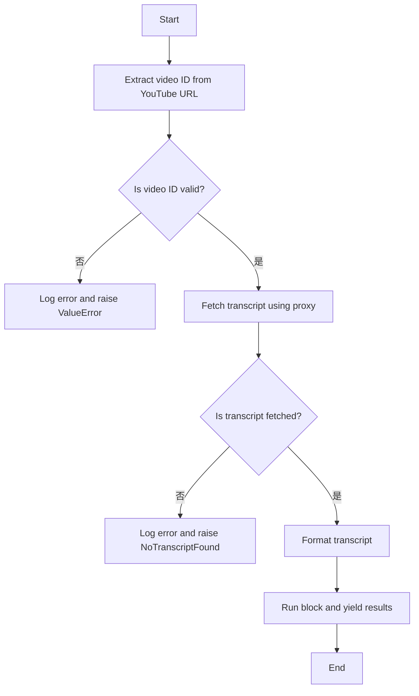
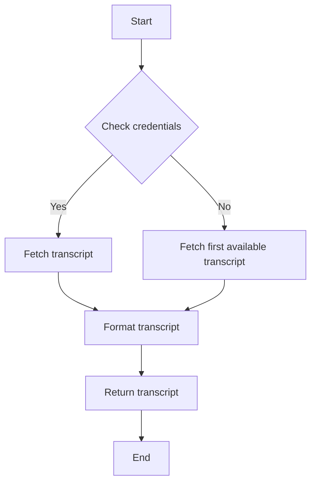
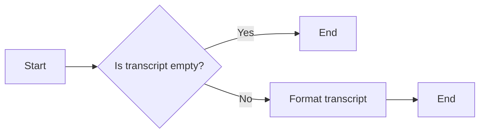
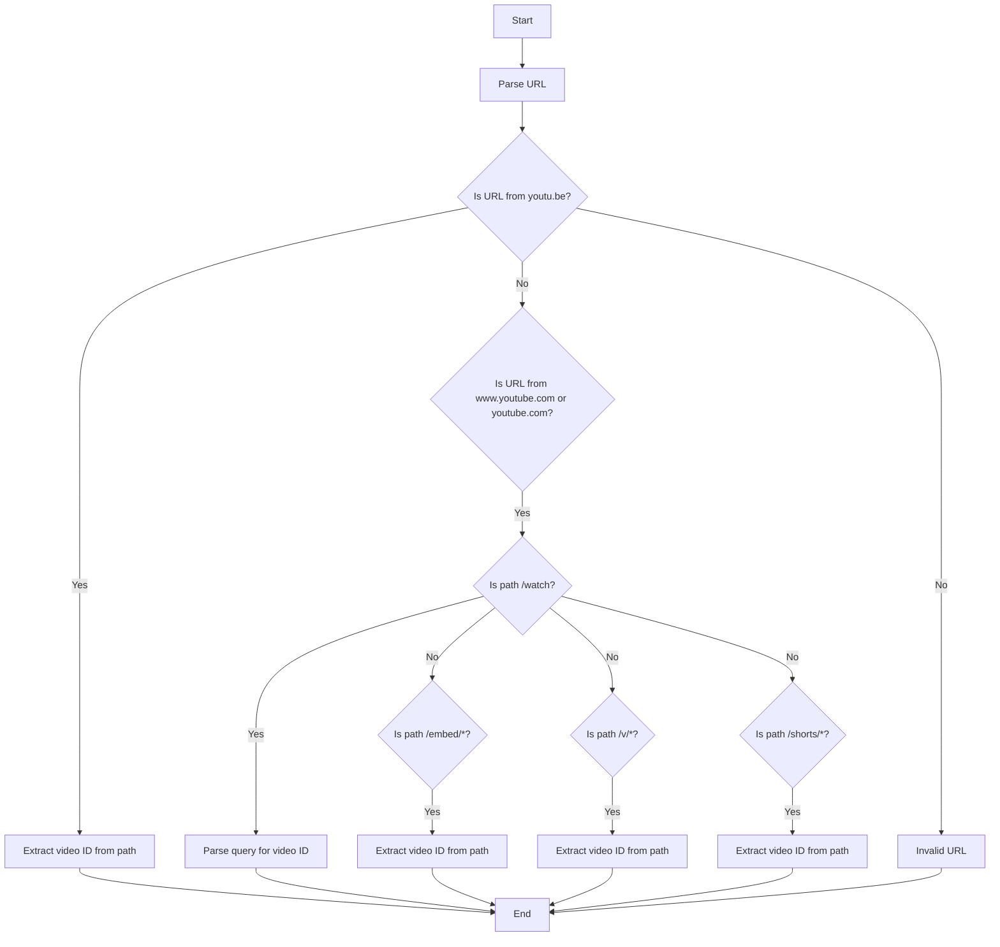
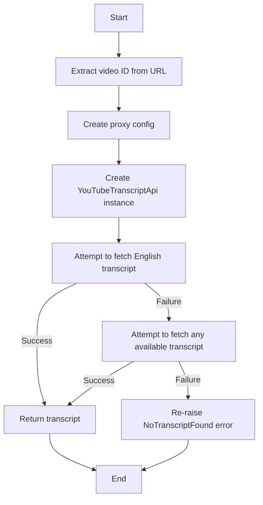
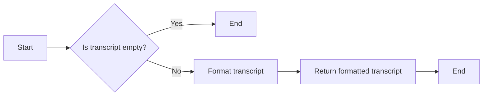
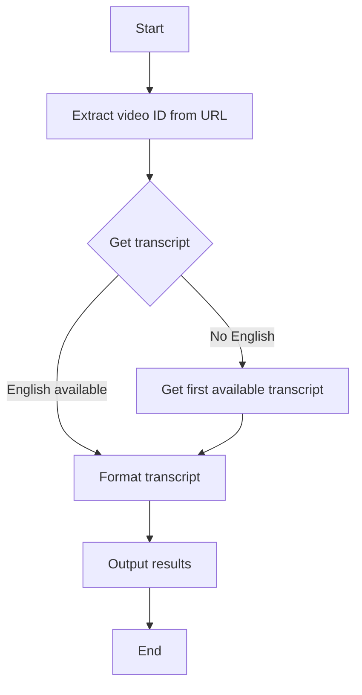

# `.\AutoGPT\autogpt_platform\backend\backend\blocks\youtube.py` 详细设计文档

The code provides a block for transcribing YouTube videos using a proxy, handling video ID extraction, transcript fetching, and formatting.

## 整体流程



## 类结构

```
TranscribeYoutubeVideoBlock (具体类)
├── Block (抽象基类)
│   ├── BlockSchemaInput
│   ├── BlockSchemaOutput
│   └── BlockCategory
└── UserPasswordCredentials (具体类)
```

## 全局变量及字段


### `logger`
    
Logger instance for logging messages.

类型：`logging.Logger`
    


### `TEST_CREDENTIALS`
    
Test credentials for the Webshare proxy.

类型：`UserPasswordCredentials`
    


### `TEST_CREDENTIALS_INPUT`
    
Input dictionary for test credentials.

类型：`dict`
    


### `WebshareProxyCredentials`
    
Class representing Webshare proxy credentials.

类型：`UserPasswordCredentials`
    


### `WebshareProxyCredentialsInput`
    
Input schema for Webshare proxy credentials.

类型：`CredentialsMetaInput`
    


### `ProviderName`
    
Enum representing different provider names.

类型：`Literal[ProviderName]`
    


### `{'name': 'TranscribeYoutubeVideoBlock', 'fields': ['id', 'input_schema', 'output_schema', 'description', 'categories', 'test_input', 'test_output', 'test_credentials', 'test_mock'], 'methods': ['__init__', 'extract_video_id', 'get_transcript', 'format_transcript', 'run']}`
    
ID of the TranscribeYoutubeVideoBlock class.

类型：`str`
    


### `{'name': 'TranscribeYoutubeVideoBlock', 'fields': ['id', 'input_schema', 'output_schema', 'description', 'categories', 'test_input', 'test_output', 'test_credentials', 'test_mock'], 'methods': ['__init__', 'extract_video_id', 'get_transcript', 'format_transcript', 'run']}`
    
Input schema for the TranscribeYoutubeVideoBlock class.

类型：`BlockSchemaInput`
    


### `{'name': 'TranscribeYoutubeVideoBlock', 'fields': ['id', 'input_schema', 'output_schema', 'description', 'categories', 'test_input', 'test_output', 'test_credentials', 'test_mock'], 'methods': ['__init__', 'extract_video_id', 'get_transcript', 'format_transcript', 'run']}`
    
Output schema for the TranscribeYoutubeVideoBlock class.

类型：`BlockSchemaOutput`
    


### `{'name': 'TranscribeYoutubeVideoBlock', 'fields': ['id', 'input_schema', 'output_schema', 'description', 'categories', 'test_input', 'test_output', 'test_credentials', 'test_mock'], 'methods': ['__init__', 'extract_video_id', 'get_transcript', 'format_transcript', 'run']}`
    
Description of the TranscribeYoutubeVideoBlock class.

类型：`str`
    


### `{'name': 'TranscribeYoutubeVideoBlock', 'fields': ['id', 'input_schema', 'output_schema', 'description', 'categories', 'test_input', 'test_output', 'test_credentials', 'test_mock'], 'methods': ['__init__', 'extract_video_id', 'get_transcript', 'format_transcript', 'run']}`
    
Categories to which the TranscribeYoutubeVideoBlock class belongs.

类型：`set`
    


### `{'name': 'TranscribeYoutubeVideoBlock', 'fields': ['id', 'input_schema', 'output_schema', 'description', 'categories', 'test_input', 'test_output', 'test_credentials', 'test_mock'], 'methods': ['__init__', 'extract_video_id', 'get_transcript', 'format_transcript', 'run']}`
    
Test input data for the TranscribeYoutubeVideoBlock class.

类型：`dict`
    


### `{'name': 'TranscribeYoutubeVideoBlock', 'fields': ['id', 'input_schema', 'output_schema', 'description', 'categories', 'test_input', 'test_output', 'test_credentials', 'test_mock'], 'methods': ['__init__', 'extract_video_id', 'get_transcript', 'format_transcript', 'run']}`
    
Test output data for the TranscribeYoutubeVideoBlock class.

类型：`list`
    


### `{'name': 'TranscribeYoutubeVideoBlock', 'fields': ['id', 'input_schema', 'output_schema', 'description', 'categories', 'test_input', 'test_output', 'test_credentials', 'test_mock'], 'methods': ['__init__', 'extract_video_id', 'get_transcript', 'format_transcript', 'run']}`
    
Test credentials for the TranscribeYoutubeVideoBlock class.

类型：`UserPasswordCredentials`
    


### `{'name': 'TranscribeYoutubeVideoBlock', 'fields': ['id', 'input_schema', 'output_schema', 'description', 'categories', 'test_input', 'test_output', 'test_credentials', 'test_mock'], 'methods': ['__init__', 'extract_video_id', 'get_transcript', 'format_transcript', 'run']}`
    
Mock data for the TranscribeYoutubeVideoBlock class.

类型：`dict`
    


### `{'name': 'Block', 'fields': ['id', 'input_schema', 'output_schema', 'description', 'categories', 'test_input', 'test_output', 'test_credentials', 'test_mock'], 'methods': []}`
    
ID of the Block class.

类型：`str`
    


### `{'name': 'Block', 'fields': ['id', 'input_schema', 'output_schema', 'description', 'categories', 'test_input', 'test_output', 'test_credentials', 'test_mock'], 'methods': []}`
    
Input schema for the Block class.

类型：`BlockSchemaInput`
    


### `{'name': 'Block', 'fields': ['id', 'input_schema', 'output_schema', 'description', 'categories', 'test_input', 'test_output', 'test_credentials', 'test_mock'], 'methods': []}`
    
Output schema for the Block class.

类型：`BlockSchemaOutput`
    


### `{'name': 'Block', 'fields': ['id', 'input_schema', 'output_schema', 'description', 'categories', 'test_input', 'test_output', 'test_credentials', 'test_mock'], 'methods': []}`
    
Description of the Block class.

类型：`str`
    


### `{'name': 'Block', 'fields': ['id', 'input_schema', 'output_schema', 'description', 'categories', 'test_input', 'test_output', 'test_credentials', 'test_mock'], 'methods': []}`
    
Categories to which the Block class belongs.

类型：`set`
    


### `{'name': 'Block', 'fields': ['id', 'input_schema', 'output_schema', 'description', 'categories', 'test_input', 'test_output', 'test_credentials', 'test_mock'], 'methods': []}`
    
Test input data for the Block class.

类型：`dict`
    


### `{'name': 'Block', 'fields': ['id', 'input_schema', 'output_schema', 'description', 'categories', 'test_input', 'test_output', 'test_credentials', 'test_mock'], 'methods': []}`
    
Test output data for the Block class.

类型：`list`
    


### `{'name': 'Block', 'fields': ['id', 'input_schema', 'output_schema', 'description', 'categories', 'test_input', 'test_output', 'test_credentials', 'test_mock'], 'methods': []}`
    
Test credentials for the Block class.

类型：`UserPasswordCredentials`
    


### `{'name': 'Block', 'fields': ['id', 'input_schema', 'output_schema', 'description', 'categories', 'test_input', 'test_output', 'test_credentials', 'test_mock'], 'methods': []}`
    
Mock data for the Block class.

类型：`dict`
    


### `{'name': 'UserPasswordCredentials', 'fields': ['id', 'provider', 'username', 'password', 'title'], 'methods': []}`
    
ID of the UserPasswordCredentials class.

类型：`str`
    


### `{'name': 'UserPasswordCredentials', 'fields': ['id', 'provider', 'username', 'password', 'title'], 'methods': []}`
    
Provider of the UserPasswordCredentials class.

类型：`str`
    


### `{'name': 'UserPasswordCredentials', 'fields': ['id', 'provider', 'username', 'password', 'title'], 'methods': []}`
    
Username of the UserPasswordCredentials class.

类型：`SecretStr`
    


### `{'name': 'UserPasswordCredentials', 'fields': ['id', 'provider', 'username', 'password', 'title'], 'methods': []}`
    
Password of the UserPasswordCredentials class.

类型：`SecretStr`
    


### `{'name': 'UserPasswordCredentials', 'fields': ['id', 'provider', 'username', 'password', 'title'], 'methods': []}`
    
Title of the UserPasswordCredentials class.

类型：`str`
    


### `TranscribeYoutubeVideoBlock.id`
    
Unique identifier for the block.

类型：`str`
    


### `TranscribeYoutubeVideoBlock.input_schema`
    
Input schema for the block.

类型：`BlockSchemaInput`
    


### `TranscribeYoutubeVideoBlock.output_schema`
    
Output schema for the block.

类型：`BlockSchemaOutput`
    


### `TranscribeYoutubeVideoBlock.description`
    
Description of the block.

类型：`str`
    


### `TranscribeYoutubeVideoBlock.categories`
    
Categories to which the block belongs.

类型：`set`
    


### `TranscribeYoutubeVideoBlock.test_input`
    
Test input data for the block.

类型：`dict`
    


### `TranscribeYoutubeVideoBlock.test_output`
    
Test output data for the block.

类型：`list`
    


### `TranscribeYoutubeVideoBlock.test_credentials`
    
Test credentials for the block.

类型：`UserPasswordCredentials`
    


### `TranscribeYoutubeVideoBlock.test_mock`
    
Mock data for the block.

类型：`dict`
    


### `Block.id`
    
Unique identifier for the block.

类型：`str`
    


### `Block.input_schema`
    
Input schema for the block.

类型：`BlockSchemaInput`
    


### `Block.output_schema`
    
Output schema for the block.

类型：`BlockSchemaOutput`
    


### `Block.description`
    
Description of the block.

类型：`str`
    


### `Block.categories`
    
Categories to which the block belongs.

类型：`set`
    


### `Block.test_input`
    
Test input data for the block.

类型：`dict`
    


### `Block.test_output`
    
Test output data for the block.

类型：`list`
    


### `Block.test_credentials`
    
Test credentials for the block.

类型：`UserPasswordCredentials`
    


### `Block.test_mock`
    
Mock data for the block.

类型：`dict`
    


### `UserPasswordCredentials.id`
    
Unique identifier for the credentials.

类型：`str`
    


### `UserPasswordCredentials.provider`
    
Provider of the credentials.

类型：`str`
    


### `UserPasswordCredentials.username`
    
Username of the credentials.

类型：`SecretStr`
    


### `UserPasswordCredentials.password`
    
Password of the credentials.

类型：`SecretStr`
    


### `UserPasswordCredentials.title`
    
Title of the credentials.

类型：`str`
    
    

## 全局函数及方法


### WebshareProxyCredentialsField()

This function returns a `CredentialsField` object for Webshare proxy credentials, which is used for fetching YouTube transcripts.

参数：

- 无

返回值：`WebshareProxyCredentialsInput`，A `CredentialsField` object for Webshare proxy credentials.

#### 流程图

```mermaid
graph LR
A[WebshareProxyCredentialsField()] --> B{Return}
B --> C[WebshareProxyCredentialsInput]
```

#### 带注释源码

```python
def WebshareProxyCredentialsField() -> WebshareProxyCredentialsInput:
    return CredentialsField(
        description="Webshare proxy credentials for fetching YouTube transcripts",
    )
```


### `TranscribeYoutubeVideoBlock.extract_video_id`

Extracts the YouTube video ID from a given YouTube URL.

参数：

- `url`：`str`，The URL of the YouTube video to extract the ID from.

返回值：`str`，The extracted YouTube video ID.

#### 流程图

```mermaid
graph TD
    A[Start] --> B[Parse URL]
    B --> C{Is netloc "youtu.be"?}
    C -- Yes --> D[Extract video ID from path]
    C -- No --> E{Is netloc "www.youtube.com" or "youtube.com"?}
    E -- Yes --> F{Is path "/watch"?}
    F -- Yes --> G[Parse query for "v" parameter]
    F -- No --> H{Is path "/embed/"?}
    H -- Yes --> I[Extract video ID from path]
    F -- No --> J{Is path "/v/"?}
    J -- Yes --> K[Extract video ID from path]
    F -- No --> L{Is path "/shorts/"?}
    L -- Yes --> M[Extract video ID from path]
    C -- No --> N[Invalid URL]
    D --> O[Return video ID]
    G --> O
    I --> O
    K --> O
    M --> O
    N --> O
```

#### 带注释源码

```python
@staticmethod
    def extract_video_id(url: str) -> str:
        parsed_url = urlparse(url)
        if parsed_url.netloc == "youtu.be":
            return parsed_url.path[1:]
        if parsed_url.netloc in ("www.youtube.com", "youtube.com"):
            if parsed_url.path == "/watch":
                p = parse_qs(parsed_url.query)
                return p["v"][0]
            if parsed_url.path[:7] == "/embed/":
                return parsed_url.path.split("/")[2]
            if parsed_url.path[:3] == "/v/":
                return parsed_url.path.split("/")[2]
            if parsed_url.path.startswith("/shorts/"):
                return parsed_url.path.split("/")[2]
        raise ValueError(f"Invalid YouTube URL: {url}")
``` 


### `TranscribeYoutubeVideoBlock.get_transcript`

Get transcript for a video, preferring English but falling back to any available language.

参数：

- `video_id`：`str`，The YouTube video ID
- `credentials`：`WebshareProxyCredentials`，The Webshare proxy credentials

返回值：`FetchedTranscript`，The fetched transcript

#### 流程图



#### 带注释源码

```python
def get_transcript(
    self, video_id: str, credentials: WebshareProxyCredentials
) -> FetchedTranscript:
    """
    Get transcript for a video, preferring English but falling back to any available language.

    :param video_id: The YouTube video ID
    :param credentials: The Webshare proxy credentials
    :return: The fetched transcript
    :raises: Any exception except NoTranscriptFound for requested languages
    """
    logger.warning(
        "Using Webshare proxy for YouTube transcript fetch (video_id=%s)",
        video_id,
    )
    proxy_config = WebshareProxyConfig(
        proxy_username=credentials.username.get_secret_value(),
        proxy_password=credentials.password.get_secret_value(),
    )

    api = YouTubeTranscriptApi(proxy_config=proxy_config)
    try:
        # Try to get English transcript first (default behavior)
        return api.fetch(video_id=video_id)
    except NoTranscriptFound:
        # If English is not available, get the first available transcript
        transcript_list = api.list(video_id)
        # Try manually created transcripts first, then generated ones
        available_transcripts = list(
            transcript_list._manually_created_transcripts.values()
        ) + list(transcript_list._generated_transcripts.values()
        )
        if available_transcripts:
            # Fetch the first available transcript
            return available_transcripts[0].fetch()
        # If no transcripts at all, re-raise the original error
        raise
``` 


### format_transcript

This function formats the transcript of a YouTube video into a readable text format.

参数：

- `transcript`：`FetchedTranscript`，The transcript object fetched from the YouTube API.

返回值：`str`，The formatted text of the transcript.

#### 流程图



#### 带注释源码

```python
def format_transcript(transcript: FetchedTranscript) -> str:
    formatter = TextFormatter()
    transcript_text = formatter.format_transcript(transcript)
    return transcript_text
```


### TranscribeYoutubeVideoBlock.__init__

This method initializes the `TranscribeYoutubeVideoBlock` class, setting up its schema, description, categories, test input, test output, test credentials, and test mock functions.

参数：

- `id`: `str`，The unique identifier for the block.
- `input_schema`: `BlockSchemaInput`，The input schema for the block.
- `output_schema`: `BlockSchemaOutput`，The output schema for the block.
- `description`: `str`，A description of the block's functionality.
- `categories`: `set`，A set of categories that the block belongs to.
- `test_input`: `dict`，The test input data for the block.
- `test_output`: `list`，The expected test output data for the block.
- `test_credentials`: `UserPasswordCredentials`，The test credentials for the block.
- `test_mock`: `dict`，Mock functions for testing the block.

返回值：无

#### 流程图

```mermaid
classDiagram
    TranscribeYoutubeVideoBlock <|-- Block
    BlockSchemaInput o-- TranscribeYoutubeVideoBlock
    BlockSchemaOutput o-- TranscribeYoutubeVideoBlock
    UserPasswordCredentials o-- TranscribeYoutubeVideoBlock
    WebshareProxyCredentialsInput o-- TranscribeYoutubeVideoBlock
    YouTubeTranscriptApi o-- TranscribeYoutubeVideoBlock
    FetchedTranscript o-- TranscribeYoutubeVideoBlock
    TextFormatter o-- TranscribeYoutubeVideoBlock
    WebshareProxyConfig o-- TranscribeYoutubeVideoBlock
    TranscribeYoutubeVideoBlock {
        id
        input_schema
        output_schema
        description
        categories
        test_input
        test_output
        test_credentials
        test_mock
    }
```

#### 带注释源码

```python
def __init__(self):
    super().__init__(
        id="f3a8f7e1-4b1d-4e5f-9f2a-7c3d5a2e6b4c",
        input_schema=TranscribeYoutubeVideoBlock.Input,
        output_schema=TranscribeYoutubeVideoBlock.Output,
        description="Transcribes a YouTube video using a proxy.",
        categories={BlockCategory.SOCIAL},
        test_input={
            "youtube_url": "https://www.youtube.com/watch?v=dQw4w9WgXcQ",
            "credentials": TEST_CREDENTIALS_INPUT,
        },
        test_output=[
            ("video_id", "dQw4w9WgXcQ"),
            (
                "transcript",
                "Never gonna give you up\nNever gonna let you down",
            ),
        ],
        test_credentials=TEST_CREDENTIALS,
        test_mock={
            "get_transcript": lambda video_id, credentials: [
                {"text": "Never gonna give you up"},
                {"text": "Never gonna let you down"},
            ],
            "format_transcript": lambda transcript: "Never gonna give you up\nNever gonna let you down",
        },
    )
```


### TranscribeYoutubeVideoBlock.extract_video_id

Extracts the YouTube video ID from a given YouTube URL.

参数：

- `url`：`str`，The URL of the YouTube video to transcribe. This is the YouTube URL from which the video ID needs to be extracted.

返回值：`str`，The extracted YouTube video ID.

#### 流程图



#### 带注释源码

```python
@staticmethod
def extract_video_id(url: str) -> str:
    parsed_url = urlparse(url)
    if parsed_url.netloc == "youtu.be":
        return parsed_url.path[1:]
    if parsed_url.netloc in ("www.youtube.com", "youtube.com"):
        if parsed_url.path == "/watch":
            p = parse_qs(parsed_url.query)
            return p["v"][0]
        if parsed_url.path[:7] == "/embed/":
            return parsed_url.path.split("/")[2]
        if parsed_url.path[:3] == "/v/":
            return parsed_url.path.split("/")[2]
        if parsed_url.path.startswith("/shorts/"):
            return parsed_url.path.split("/")[2]
    raise ValueError(f"Invalid YouTube URL: {url}")
```


### TranscribeYoutubeVideoBlock.get_transcript

Get transcript for a video, preferring English but falling back to any available language.

参数：

- `video_id`：`str`，The YouTube video ID
- `credentials`：`WebshareProxyCredentials`，The Webshare proxy credentials

返回值：`FetchedTranscript`，The fetched transcript

#### 流程图



#### 带注释源码

```python
def get_transcript(
    self, video_id: str, credentials: WebshareProxyCredentials
) -> FetchedTranscript:
    """
    Get transcript for a video, preferring English but falling back to any available language.

    :param video_id: The YouTube video ID
    :param credentials: The Webshare proxy credentials
    :return: The fetched transcript
    :raises: Any exception except NoTranscriptFound for requested languages
    """
    logger.warning(
        "Using Webshare proxy for YouTube transcript fetch (video_id=%s)",
        video_id,
    )
    proxy_config = WebshareProxyConfig(
        proxy_username=credentials.username.get_secret_value(),
        proxy_password=credentials.password.get_secret_value(),
    )

    api = YouTubeTranscriptApi(proxy_config=proxy_config)
    try:
        # Try to get English transcript first (default behavior)
        return api.fetch(video_id=video_id)
    except NoTranscriptFound:
        # If English is not available, get the first available transcript
        transcript_list = api.list(video_id)
        # Try manually created transcripts first, then generated ones
        available_transcripts = list(
            transcript_list._manually_created_transcripts.values()
        ) + list(transcript_list._generated_transcripts.values())
        if available_transcripts:
            # Fetch the first available transcript
            return available_transcripts[0].fetch()
        # If no transcripts at all, re-raise the original error
        raise
``` 


### TranscribeYoutubeVideoBlock.format_transcript

This function formats the transcript of a YouTube video into a readable text format.

参数：

- `transcript`：`FetchedTranscript`，The transcript object fetched from the YouTube API.

返回值：`str`，The formatted text of the transcript.

#### 流程图



#### 带注释源码

```python
def format_transcript(transcript: FetchedTranscript) -> str:
    formatter = TextFormatter()
    transcript_text = formatter.format_transcript(transcript)
    return transcript_text
```


### TranscribeYoutubeVideoBlock.run

This method transcribes a YouTube video using a proxy and yields the video ID, transcribed text, and any error messages if the transcription fails.

参数：

- `input_data`：`Input`，The input data for the block, containing the YouTube URL and credentials.
- `credentials`：`WebshareProxyCredentials`，The Webshare proxy credentials for fetching YouTube transcripts.

返回值：`BlockOutput`，The output of the block, containing the video ID, transcribed text, and any error messages.

#### 流程图



#### 带注释源码

```python
async def run(
    self,
    input_data: Input,
    *,
    credentials: WebshareProxyCredentials,
    **kwargs,
) -> BlockOutput:
    try:
        video_id = self.extract_video_id(input_data.youtube_url)
        transcript = self.get_transcript(video_id, credentials)
        transcript_text = self.format_transcript(transcript=transcript)

        # Only yield after all operations succeed
        yield "video_id", video_id
        yield "transcript", transcript_text
    except Exception as e:
        yield "error", str(e)
```


## 关键组件


### 张量索引与惰性加载

张量索引与惰性加载是处理大规模数据集时常用的技术，用于提高数据访问效率和减少内存消耗。

### 反量化支持

反量化支持是指系统对量化操作的反向操作，即从量化后的数据恢复到原始数据。

### 量化策略

量化策略是指将浮点数数据转换为固定点数表示的方法，以减少计算资源消耗。


## 问题及建议


### 已知问题

-   **全局变量和函数依赖**：代码中使用了全局变量 `logger` 和全局函数 `WebshareProxyCredentialsField`，这可能导致代码的可维护性和可测试性降低，因为全局状态难以控制和管理。
-   **异常处理**：`get_transcript` 方法中捕获了所有异常，除了 `NoTranscriptFound`。这可能隐藏了其他潜在的错误，使得调试变得更加困难。
-   **代码重复**：`extract_video_id` 和 `format_transcript` 方法在 `TranscribeYoutubeVideoBlock` 类中被重复定义，这可能导致维护成本增加。
-   **异步函数的使用**：`run` 方法被声明为异步函数，但并没有使用 `async` 关键字进行异步操作，这可能是一个错误。

### 优化建议

-   **移除全局变量和函数**：将 `logger` 和 `WebshareProxyCredentialsField` 移入类中，作为类的属性或方法，以减少全局状态的使用。
-   **改进异常处理**：在 `get_transcript` 方法中，除了 `NoTranscriptFound` 之外的其他异常应该被记录或抛出，以便于调试。
-   **减少代码重复**：将 `extract_video_id` 和 `format_transcript` 方法提取到类的外部，作为工具函数，以避免在类中重复定义。
-   **修复异步函数的使用**：如果 `run` 方法确实需要异步操作，应该使用 `async` 关键字，并在方法内部使用 `await` 关键字等待异步操作完成。
-   **代码注释**：增加必要的代码注释，以提高代码的可读性和可维护性。
-   **单元测试**：编写单元测试来覆盖关键功能，确保代码的正确性和稳定性。


## 其它


### 设计目标与约束

- 设计目标：
  - 实现一个模块，能够从YouTube视频中提取并转录文本。
  - 使用Webshare代理进行安全地访问YouTube数据。
  - 提供一个可配置的接口，允许用户指定YouTube视频的URL和代理凭据。
  - 确保代码的健壮性和错误处理能力，以应对网络请求失败或数据解析错误。

- 约束：
  - 必须使用YouTubeTranscriptApi库来获取视频转录。
  - 代理凭据必须安全地处理，不应以明文形式存储或传输。
  - 代码应遵循PEP 8编码规范。

### 错误处理与异常设计

- 错误处理：
  - 对于无效的YouTube URL，抛出`ValueError`。
  - 对于无法获取转录的情况，抛出`NoTranscriptFound`异常。
  - 对于其他所有异常，捕获并返回错误信息。

- 异常设计：
  - 使用`try-except`块来捕获和处理可能发生的异常。
  - 在`run`方法中，使用`yield`语句来返回错误信息。

### 数据流与状态机

- 数据流：
  - 输入：YouTube视频URL和代理凭据。
  - 处理：解析视频ID，获取转录，格式化转录文本。
  - 输出：视频ID、转录文本和错误信息（如果有）。

- 状态机：
  - 初始状态：等待输入数据。
  - 处理状态：执行转录和格式化操作。
  - 结束状态：返回结果或错误信息。

### 外部依赖与接口契约

- 外部依赖：
  - `youtube_transcript_api`：用于获取YouTube视频的转录。
  - `pydantic`：用于数据验证和模型定义。
  - `urllib.parse`：用于解析URL。

- 接口契约：
  - `TranscribeYoutubeVideoBlock`类定义了输入和输出契约。
  - `extract_video_id`方法定义了从URL中提取视频ID的契约。
  - `get_transcript`方法定义了获取转录的契约。
  - `format_transcript`方法定义了格式化转录文本的契约。
  - `run`方法定义了执行转录过程的契约。


    