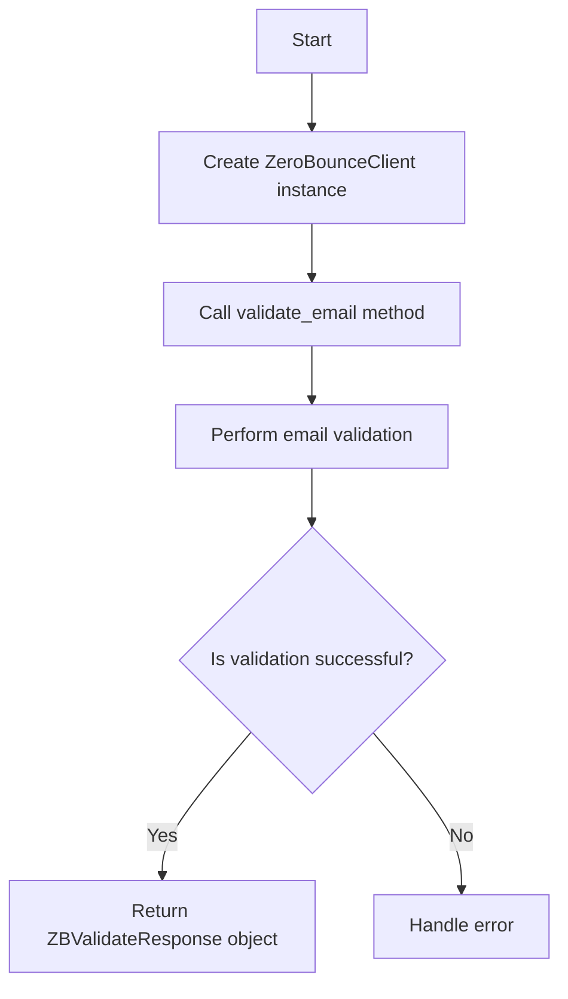
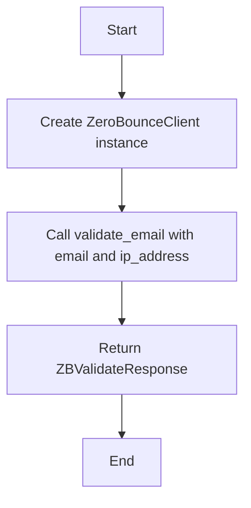

# `.\AutoGPT\autogpt_platform\backend\backend\blocks\zerobounce\_api.py` 详细设计文档

The core functionality of this code is to provide a client interface for validating email addresses using the ZeroBounce API.

## 整体流程



## 类结构

```
ZeroBounceClient (Class)
```

## 全局变量及字段


### `api_key`
    
The API key for the ZeroBounce service.

类型：`str`
    


### `client`
    
The ZeroBounce client instance.

类型：`ZeroBounce`
    


### `ZeroBounceClient.api_key`
    
The API key for the ZeroBounce service.

类型：`str`
    


### `ZeroBounceClient.client`
    
The ZeroBounce client instance.

类型：`ZeroBounce`
    
    

## 全局函数及方法


### validate_email

Validates an email address using the ZeroBounce API.

参数：

- `email`：`str`，The email address to be validated.
- `ip_address`：`str`，The IP address associated with the email address.

返回值：`ZBValidateResponse`，The response object containing the validation result.

#### 流程图



#### 带注释源码

```python
from zerobouncesdk import ZBValidateResponse, ZeroBounce

class ZeroBounceClient:
    def __init__(self, api_key: str):
        # Initialize the ZeroBounceClient with the provided API key
        self.api_key = api_key
        self.client = ZeroBounce(api_key)

    def validate_email(self, email: str, ip_address: str) -> ZBValidateResponse:
        # Validate the email address using the ZeroBounce API
        return self.client.validate(email, ip_address)
```


## 关键组件


### 张量索引与惰性加载

张量索引与惰性加载是深度学习框架中用于高效处理大型数据集的技术，它允许在需要时才加载数据，从而减少内存消耗和提高处理速度。

### 反量化支持

反量化支持是深度学习模型优化中的一种技术，它允许模型在量化过程中保持较高的精度，通过在量化后进行反量化操作来恢复原始的浮点数精度。

### 量化策略

量化策略是深度学习模型压缩中的一种方法，它通过将模型的权重和激活值从浮点数转换为低精度整数来减少模型的存储大小和计算量。


## 问题及建议


### 已知问题

-   {问题1}：代码中使用了`zerobouncesdk`库，但没有提供该库的版本信息，这可能导致兼容性问题。
-   {问题2}：`validate_email`方法没有错误处理机制，如果API调用失败，将不会向调用者报告错误。
-   {问题3}：`ZeroBounceClient`类没有提供任何日志记录功能，这可能会在调试和监控时造成困难。

### 优化建议

-   {建议1}：在初始化`ZeroBounceClient`时，添加对`zerobouncesdk`库版本信息的检查，确保使用兼容的版本。
-   {建议2}：在`validate_email`方法中添加异常处理，捕获可能的错误并返回给调用者。
-   {建议3}：在`ZeroBounceClient`类中添加日志记录功能，以便于跟踪和调试。
-   {建议4}：考虑将`api_key`作为类字段而不是实例字段，如果API密钥对所有实例都是相同的，这样可以减少内存使用。
-   {建议5}：如果`validate_email`方法被频繁调用，可以考虑实现缓存机制，以减少对ZeroBounce API的调用次数。


## 其它


### 设计目标与约束

- 设计目标：实现一个用于验证电子邮件地址有效性的客户端，该客户端能够与ZeroBounce API进行交互。
- 约束：确保所有API调用都使用提供的API密钥，并且遵守ZeroBounce API的使用条款。

### 错误处理与异常设计

- 错误处理：捕获并处理可能发生的网络错误、API限制错误或无效输入。
- 异常设计：定义自定义异常类，如`InvalidEmailException`和`APIException`，以提供清晰的错误信息。

### 数据流与状态机

- 数据流：用户输入电子邮件地址和IP地址，通过`validate_email`方法发送到ZeroBounce API，返回验证结果。
- 状态机：无状态机，因为操作是同步的，没有复杂的状态转换。

### 外部依赖与接口契约

- 外部依赖：ZeroBounce SDK，用于与ZeroBounce API进行交互。
- 接口契约：ZeroBounce SDK提供的API接口，包括`validate`方法。

### 安全性与隐私

- 安全性：确保API密钥的安全存储和传输，避免在日志或错误信息中泄露。
- 隐私：遵守相关隐私法规，不存储或泄露用户数据。

### 测试与验证

- 测试：编写单元测试和集成测试，确保代码质量和功能正确性。
- 验证：通过实际API调用验证功能的有效性。

### 维护与扩展性

- 维护：定期更新ZeroBounce SDK，以适应API变更。
- 扩展性：设计模块化代码，以便于添加新的功能或集成其他服务。

### 性能优化

- 性能优化：监控API调用性能，优化代码以提高响应速度和减少资源消耗。

### 用户文档与帮助

- 用户文档：提供详细的用户指南，包括如何安装和使用ZeroBounceClient。
- 帮助：提供在线帮助或FAQ，以解决常见问题。


    