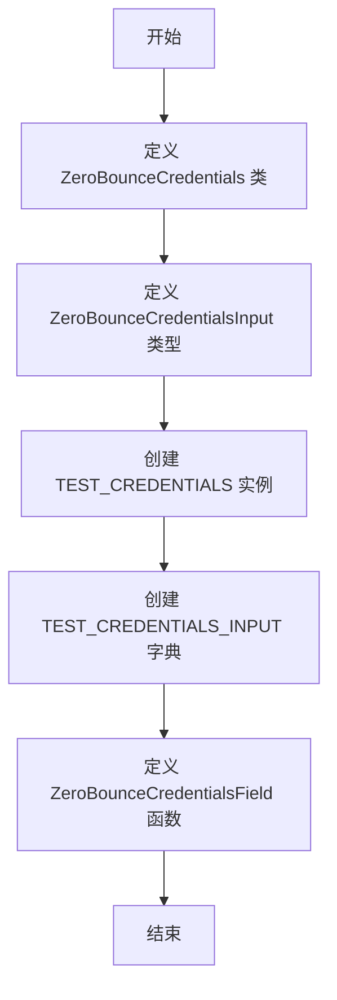
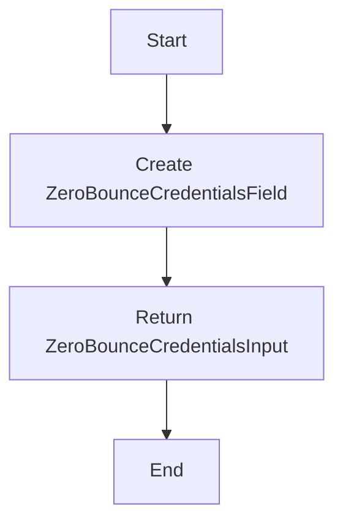

# `.\AutoGPT\autogpt_platform\backend\backend\blocks\zerobounce\_auth.py` 详细设计文档

This code defines a ZeroBounce credentials model and a function to create a credentials input for the ZeroBounce provider.

## 整体流程



## 类结构

```
ZeroBounceCredentials (类)
ZeroBounceCredentialsInput (类型)
CredentialsField (类)
APIKeyCredentials (类)
CredentialsField (类)
CredentialsMetaInput (类型)
```

## 全局变量及字段


### `ZeroBounceCredentials`
    
Represents the credentials for the ZeroBounce provider.

类型：`APIKeyCredentials`
    


### `ZeroBounceCredentialsInput`
    
Input type for ZeroBounce credentials with specific provider and field type.

类型：`CredentialsMetaInput[Literal[ProviderName.ZEROBOUNCE], Literal["api_key"]]`
    


### `TEST_CREDENTIALS`
    
A test instance of ZeroBounce credentials with mock data.

类型：`APIKeyCredentials`
    


### `TEST_CREDENTIALS_INPUT`
    
A dictionary containing the input data for the test ZeroBounce credentials.

类型：`dict`
    


### `ProviderName`
    
A literal type representing the ZeroBounce provider name.

类型：`Literal[ProviderName.ZEROBOUNCE]`
    


### `SecretStr`
    
A type representing a secret string that should not be logged or exposed.

类型：`SecretStr`
    


### `CredentialsField`
    
A class representing a credentials field with a description.

类型：`CredentialsField`
    


### `APIKeyCredentials`
    
A class representing API key credentials with various fields.

类型：`APIKeyCredentials`
    


### `CredentialsMetaInput`
    
A generic class for credentials metadata inputs.

类型：`CredentialsMetaInput`
    


### `id`
    
The unique identifier for the credentials.

类型：`str`
    


### `provider`
    
The provider name for the credentials.

类型：`str`
    


### `api_key`
    
The API key for the credentials, stored securely.

类型：`SecretStr`
    


### `title`
    
The title of the credentials.

类型：`str`
    


### `expires_at`
    
The expiration date for the credentials, if applicable.

类型：`datetime.datetime`
    


### `description`
    
The description of the credentials field or input.

类型：`str`
    


### `type`
    
The type of the credentials or input field.

类型：`str`
    


### `Literal`
    
A type for creating literal types that can be used in type annotations.

类型：`Literal`
    


### `ZeroBounceCredentials.id`
    
The unique identifier for the ZeroBounce credentials.

类型：`str`
    


### `ZeroBounceCredentials.provider`
    
The provider name for the ZeroBounce credentials.

类型：`str`
    


### `ZeroBounceCredentials.api_key`
    
The API key for the ZeroBounce credentials, stored securely.

类型：`SecretStr`
    


### `ZeroBounceCredentials.title`
    
The title of the ZeroBounce credentials.

类型：`str`
    


### `ZeroBounceCredentials.expires_at`
    
The expiration date for the ZeroBounce credentials, if applicable.

类型：`datetime.datetime`
    


### `CredentialsField.description`
    
The description of the ZeroBounce credentials field.

类型：`str`
    


### `ZeroBounceCredentials.type`
    
The type of the ZeroBounce credentials or input field.

类型：`str`
    


### `ZeroBounceCredentials.Literal`
    
A type for creating literal types that can be used in type annotations.

类型：`Literal`
    
    

## 全局函数及方法


### ZeroBounceCredentialsField()

This function creates a ZeroBounce credentials input on a block, which is used to configure the ZeroBounce integration with an API Key.

参数：

- 无参数

返回值：`ZeroBounceCredentialsInput`，A credentials input object for ZeroBounce integration

#### 流程图



#### 带注释源码

```python
def ZeroBounceCredentialsField() -> ZeroBounceCredentialsInput:
    """
    Creates a ZeroBounce credentials input on a block.
    """
    return CredentialsField(
        description="The ZeroBounce integration can be used with an API Key.",
    )
```

## 关键组件


### 张量索引与惰性加载

张量索引与惰性加载是用于高效处理大型数据集的机制，它允许在需要时才加载数据的一部分，从而减少内存消耗和提高性能。

### 反量化支持

反量化支持是针对量化计算的一种技术，它允许在量化过程中恢复原始的浮点数精度，以便进行精确的计算。

### 量化策略

量化策略是用于将浮点数数据转换为低精度表示（如整数）的方法，以减少模型大小和加速计算，同时尽量保持精度。


## 问题及建议


### 已知问题

-   **全局变量使用**：`TEST_CREDENTIALS` 和 `TEST_CREDENTIALS_INPUT` 作为全局变量使用，这可能导致代码难以维护和测试，尤其是在大型项目中。
-   **类型注解的重复**：`ZeroBounceCredentialsInput` 的类型注解中 `Literal` 被重复使用，这可能导致不必要的复杂性。
-   **函数功能描述**：`ZeroBounceCredentialsField` 函数的描述不够具体，没有明确说明其返回值的具体用途。

### 优化建议

-   **移除全局变量**：考虑将 `TEST_CREDENTIALS` 和 `TEST_CREDENTIALS_INPUT` 移至函数内部或作为参数传递，以减少全局变量的使用。
-   **简化类型注解**：合并重复的 `Literal` 使用，简化 `ZeroBounceCredentialsInput` 的类型注解。
-   **增强函数描述**：为 `ZeroBounceCredentialsField` 函数提供更详细的描述，说明其返回值的具体用途和如何使用它。
-   **代码复用**：如果 `ZeroBounceCredentialsField` 函数在其他地方有相似的功能，考虑将其抽象为一个更通用的函数。
-   **异常处理**：在函数中添加异常处理逻辑，以确保在输入数据不正确时能够优雅地处理错误。
-   **文档注释**：为所有函数和类添加详细的文档注释，包括参数、返回值和异常处理。


## 其它


### 设计目标与约束

- 设计目标：
  - 提供一个用于ZeroBounce服务的API密钥认证机制。
  - 确保API密钥的安全存储和传输。
  - 提供一个接口用于创建ZeroBounce认证输入。

- 约束：
  - 必须使用pydantic库进行数据验证。
  - API密钥必须以加密形式存储。
  - 必须遵循ZeroBounce的认证规范。

### 错误处理与异常设计

- 错误处理：
  - 对于无效的API密钥，应抛出异常。
  - 对于认证失败，应返回错误信息。

- 异常设计：
  - 使用自定义异常类来处理认证相关的错误。
  - 异常类应包含错误代码和错误信息。

### 数据流与状态机

- 数据流：
  - 用户输入API密钥。
  - 系统验证API密钥的有效性。
  - 系统存储加密后的API密钥。

- 状态机：
  - 初始状态：未认证。
  - 认证成功：已认证。
  - 认证失败：未认证。

### 外部依赖与接口契约

- 外部依赖：
  - pydantic库用于数据验证。
  - SecretStr用于加密API密钥。

- 接口契约：
  - ZeroBounceCredentialsField函数应返回ZeroBounceCredentialsInput类型。
  - APIKeyCredentials类应遵循APIKeyCredentials协议。
  - CredentialsField类应遵循CredentialsField协议。


    