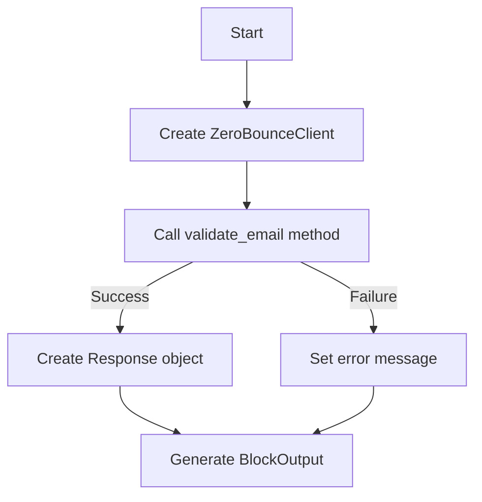
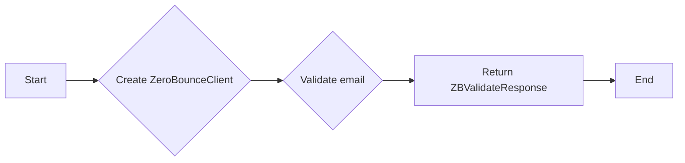
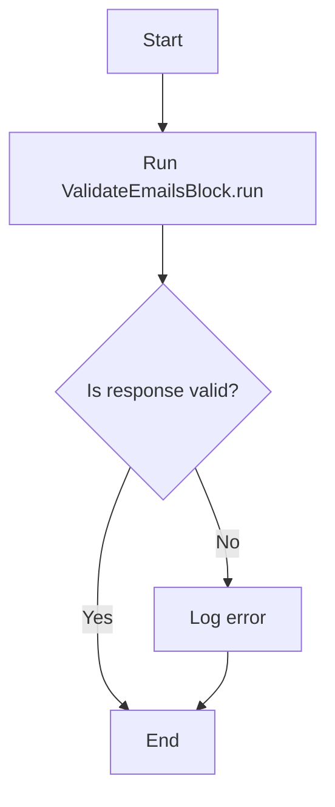

# `.\AutoGPT\autogpt_platform\backend\backend\blocks\zerobounce\validate_emails.py` 详细设计文档

This code defines a block for validating email addresses using the ZeroBounce API. It includes a class to handle the input and output schema, and a method to perform the actual validation.

## 整体流程



## 类结构

```
ValidateEmailsBlock (Block)
├── Input (BlockSchemaInput)
│   ├── email (str)
│   ├── ip_address (str)
│   └── credentials (ZeroBounceCredentialsInput)
└── Output (BlockSchemaOutput)
    ├── response (Response)
    └── error (str)
```

## 全局变量及字段


### `TEST_CREDENTIALS`
    
Test credentials for ZeroBounce API.

类型：`ZeroBounceCredentials`
    


### `TEST_CREDENTIALS_INPUT`
    
Test input for ZeroBounce credentials.

类型：`ZeroBounceCredentialsInput`
    


### `ZeroBounceClient`
    
Client for interacting with the ZeroBounce API.

类型：`ZeroBounceClient`
    


### `ZBValidateResponse`
    
Response object from ZeroBounce API.

类型：`ZBValidateResponse`
    


### `ZBValidateStatus`
    
Status of the email validation.

类型：`ZBValidateStatus`
    


### `ZBValidateSubStatus`
    
Sub-status of the email validation.

类型：`ZBValidateSubStatus`
    


### `Block`
    
Base class for blocks in the system.

类型：`Block`
    


### `BlockCategory`
    
Category of the block.

类型：`BlockCategory`
    


### `BlockSchemaInput`
    
Input schema for the block.

类型：`BlockSchemaInput`
    


### `BlockSchemaOutput`
    
Output schema for the block.

类型：`BlockSchemaOutput`
    


### `CredentialsField`
    
Field for credentials in the block input schema.

类型：`CredentialsField`
    


### `SchemaField`
    
Field in the block schema.

类型：`SchemaField`
    


### `Response`
    
Response model for the email validation.

类型：`Response`
    


### `ValidateEmailsBlock`
    
Block for validating emails using ZeroBounce API.

类型：`ValidateEmailsBlock`
    


### `Response.address`
    
The email address you are validating.

类型：`str`
    


### `Response.status`
    
The status of the email address.

类型：`ZBValidateStatus`
    


### `Response.sub_status`
    
The sub-status of the email address.

类型：`ZBValidateSubStatus`
    


### `Response.account`
    
The portion of the email address before the '@' symbol.

类型：`Optional[str]`
    


### `Response.domain`
    
The portion of the email address after the '@' symbol.

类型：`Optional[str]`
    


### `Response.did_you_mean`
    
Suggestive Fix for an email typo

类型：`Optional[str]`
    


### `Response.domain_age_days`
    
Age of the email domain in days or [null].

类型：`Optional[str]`
    


### `Response.free_email`
    
Whether the email address is a free email provider.

类型：`Optional[bool]`
    


### `Response.mx_found`
    
Whether the MX record was found.

类型：`Optional[bool]`
    


### `Response.mx_record`
    
The MX record of the email address.

类型：`Optional[str]`
    


### `Response.smtp_provider`
    
The SMTP provider of the email address.

类型：`Optional[str]`
    


### `Response.firstname`
    
The first name of the email address.

类型：`Optional[str]`
    


### `Response.lastname`
    
The last name of the email address.

类型：`Optional[str]`
    


### `Response.gender`
    
The gender of the email address.

类型：`Optional[str]`
    


### `Response.city`
    
The city of the email address.

类型：`Optional[str]`
    


### `Response.region`
    
The region of the email address.

类型：`Optional[str]`
    


### `Response.zipcode`
    
The zipcode of the email address.

类型：`Optional[str]`
    


### `Response.country`
    
The country of the email address.

类型：`Optional[str]`
    


### `ValidateEmailsBlock.id`
    
Unique identifier for the block.

类型：`str`
    


### `ValidateEmailsBlock.description`
    
Description of the block.

类型：`str`
    


### `ValidateEmailsBlock.categories`
    
Categories to which the block belongs.

类型：`set`
    


### `ValidateEmailsBlock.input_schema`
    
Input schema for the block.

类型：`BlockSchemaInput`
    


### `ValidateEmailsBlock.output_schema`
    
Output schema for the block.

类型：`BlockSchemaOutput`
    


### `ValidateEmailsBlock.test_credentials`
    
Test credentials for the block.

类型：`ZeroBounceCredentials`
    


### `ValidateEmailsBlock.test_input`
    
Test input data for the block.

类型：`dict`
    


### `ValidateEmailsBlock.test_output`
    
Test output data for the block.

类型：`list`
    


### `ValidateEmailsBlock.test_mock`
    
Mock data for testing the block.

类型：`dict`
    
    

## 全局函数及方法


### `ValidateEmailsBlock.validate_email`

This method validates an email address using the ZeroBounce API.

参数：

- `email`：`str`，The email address to validate.
- `ip_address`：`str`，The IP address to validate. Defaults to an empty string.
- `credentials`：`ZeroBounceCredentials`，The ZeroBounce credentials used for authentication.

返回值：`ZBValidateResponse`，The response from the ZeroBounce API containing the validation results.

#### 流程图



#### 带注释源码

```python
@staticmethod
def validate_email(
    email: str, ip_address: str, credentials: ZeroBounceCredentials
) -> ZBValidateResponse:
    client = ZeroBounceClient(credentials.api_key.get_secret_value())
    return client.validate_email(email, ip_address)
```


### `ValidateEmailsBlock.__init__`

初始化 `ValidateEmailsBlock` 类，设置类的基本属性和配置。

参数：

- `id`：`str`，块的唯一标识符。
- `description`：`str`，块的描述信息。
- `categories`：`set`，块的类别集合。
- `input_schema`：`BlockSchemaInput`，块的输入模式。
- `output_schema`：`BlockSchemaOutput`，块的输出模式。
- `test_credentials`：`ZeroBounceCredentials`，测试时使用的凭证。
- `test_input`：`dict`，测试输入数据。
- `test_output`：`list`，测试输出数据。
- `test_mock`：`dict`，测试模拟数据。

返回值：无

#### 流程图

```mermaid
classDiagram
    ValidateEmailsBlock <|-- Block
    ValidateEmailsBlock {
        id
        description
        categories
        input_schema
        output_schema
        test_credentials
        test_input
        test_output
        test_mock
    }
```

#### 带注释源码

```python
def __init__(self):
    super().__init__(
        id="e3950439-fa0b-40e8-b19f-e0dca0bf5853",
        description="Validate emails",
        categories={BlockCategory.SEARCH},
        input_schema=ValidateEmailsBlock.Input,
        output_schema=ValidateEmailsBlock.Output,
        test_credentials=TEST_CREDENTIALS,
        test_input={
            "credentials": TEST_CREDENTIALS_INPUT,
            "email": "test@test.com",
        },
        test_output=[
            (
                "response",
                Response(
                    address="test@test.com",
                    status=ZBValidateStatus.valid,
                    sub_status=ZBValidateSubStatus.allowed,
                    account="test",
                    domain="test.com",
                    did_you_mean=None,
                    domain_age_days=None,
                    free_email=False,
                    mx_found=False,
                    mx_record=None,
                    smtp_provider=None,
                ),
            )
        ],
        test_mock={
            "validate_email": lambda email, ip_address, credentials: ZBValidateResponse(
                data={
                    "address": email,
                    "status": ZBValidateStatus.valid,
                    "sub_status": ZBValidateSubStatus.allowed,
                    "account": "test",
                    "domain": "test.com",
                    "did_you_mean": None,
                    "domain_age_days": None,
                    "free_email": False,
                    "mx_found": False,
                    "mx_record": None,
                    "smtp_provider": None,
                }
            )
        },
    )
```


### ValidateEmailsBlock.validate_email

This method validates an email address using the ZeroBounce API.

参数：

- `email`：`str`，The email address to validate.
- `ip_address`：`str`，The IP address to validate, defaults to an empty string.
- `credentials`：`ZeroBounceCredentials`，The ZeroBounce credentials for authentication.

返回值：`ZBValidateResponse`，The response from the ZeroBounce API containing validation details.

#### 流程图


#### 带注释源码

```python
@staticmethod
def validate_email(
    email: str, ip_address: str, credentials: ZeroBounceCredentials
) -> ZBValidateResponse:
    client = ZeroBounceClient(credentials.api_key.get_secret_value())
    return client.validate_email(email, ip_address)
```


### ValidateEmailsBlock.run

This method validates an email address using the ZeroBounce API.

参数：

- `input_data`：`Input`，The input data containing the email to validate.
- `credentials`：`ZeroBounceCredentials`，The credentials for the ZeroBounce API.

返回值：`BlockOutput`，The output of the block, containing the response from ZeroBounce and any error message.

#### 流程图



#### 带注释源码

```python
async def run(
    self,
    input_data: Input,
    *,
    credentials: ZeroBounceCredentials,
    **kwargs,
) -> BlockOutput:
    response: ZBValidateResponse = self.validate_email(
        input_data.email, input_data.ip_address, credentials
    )

    response_model = Response(**response.__dict__)

    yield "response", response_model
```


## 关键组件


### 张量索引与惰性加载

张量索引与惰性加载是代码中处理数据的一种方式，它允许在需要时才加载和索引数据，从而提高性能和内存效率。

### 反量化支持

反量化支持是代码中实现的一种功能，它允许对量化后的模型进行反量化处理，以便在需要时恢复原始的浮点数值。

### 量化策略

量化策略是代码中用于模型压缩和加速的一种技术，它通过将模型的权重和激活从浮点数转换为低精度整数来减少模型的存储和计算需求。


## 问题及建议


### 已知问题

-   **全局变量和函数的可见性**：`TEST_CREDENTIALS` 和 `TEST_CREDENTIALS_INPUT` 作为全局变量，其作用域可能超出预期，可能导致潜在的命名冲突或维护困难。
-   **异常处理**：代码中没有显示的异常处理机制，如果 `validate_email` 函数或网络请求失败，可能会导致程序崩溃。
-   **异步函数的使用**：`run` 方法被标记为异步函数，但内部没有使用 `async` 关键字，这可能导致异步功能无法正常工作。
-   **代码重复**：`validate_email` 方法在 `run` 方法中被调用两次，这可能导致不必要的性能开销。

### 优化建议

-   **封装全局变量**：将 `TEST_CREDENTIALS` 和 `TEST_CREDENTIALS_INPUT` 封装在类或模块中，以限制其作用域并提高代码的可维护性。
-   **添加异常处理**：在 `validate_email` 和 `run` 方法中添加异常处理逻辑，以捕获和处理可能发生的错误。
-   **修正异步函数**：确保 `run` 方法中的代码是异步的，以充分利用异步功能。
-   **减少代码重复**：优化 `validate_email` 方法的调用，避免在 `run` 方法中重复调用。
-   **日志记录**：添加日志记录功能，以便于调试和监控程序的运行状态。
-   **单元测试**：编写单元测试来验证 `validate_email` 和 `run` 方法的正确性，确保代码质量。


## 其它


### 设计目标与约束

- 设计目标：
  - 提供一个模块化的电子邮件验证服务。
  - 确保电子邮件验证的准确性和可靠性。
  - 支持异步处理以提高性能。
  - 提供测试环境以方便开发和测试。

- 约束：
  - 必须使用ZeroBounce SDK进行电子邮件验证。
  - 输入数据必须符合预定义的schema。
  - 输出数据必须符合预定义的schema。
  - 必须处理可能的异常和错误。

### 错误处理与异常设计

- 错误处理：
  - 在`validate_email`方法中，如果ZeroBounce SDK返回错误，将捕获异常并将错误信息作为输出。
  - 在`run`方法中，如果`validate_email`方法抛出异常，将捕获异常并将错误信息作为输出。

- 异常设计：
  - 定义自定义异常类，如`ValidationException`，以处理验证过程中的特定错误。
  - 使用try-except块来捕获和处理异常。

### 数据流与状态机

- 数据流：
  - 输入数据通过`run`方法传递给`validate_email`方法。
  - `validate_email`方法返回验证结果。
  - 验证结果被转换为`Response`模型并返回。

- 状态机：
  - 当前状态：等待输入数据。
  - 下一个状态：执行验证。
  - 最终状态：返回验证结果。

### 外部依赖与接口契约

- 外部依赖：
  - ZeroBounce SDK：用于电子邮件验证。
  - Pydantic：用于数据验证和模型定义。

- 接口契约：
  - `ZeroBounceClient`接口：用于与ZeroBounce API交互。
  - `Response`模型：用于定义验证结果的输出格式。
  - `Block`类：用于定义数据处理块。

    