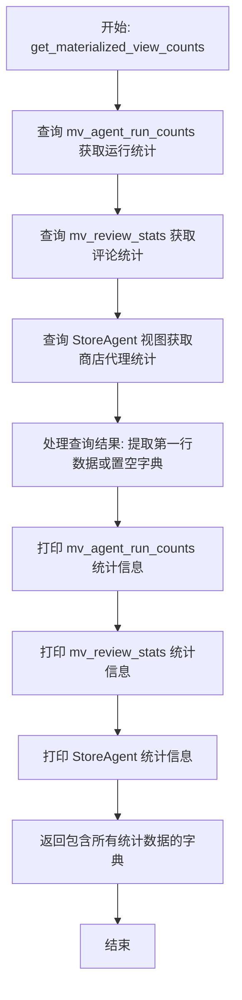
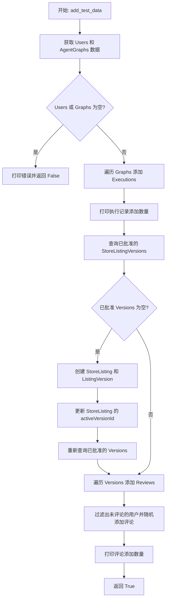
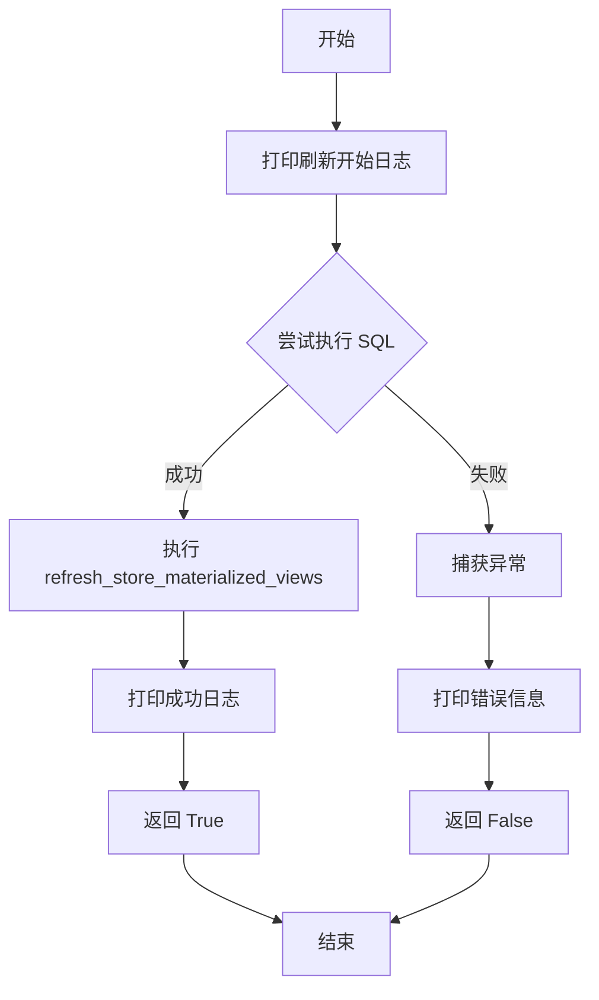
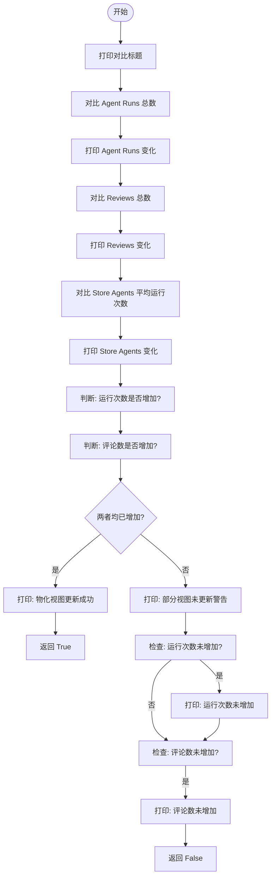
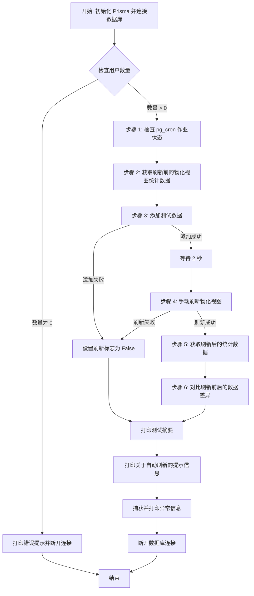

# `AutoGPT\autogpt_platform\backend\backend\check_db.py` 详细设计文档

该脚本是一个用于测试和验证PostgreSQL数据库中物化视图更新机制的异步工具。它通过检查pg_cron扩展及定时任务、查询当前视图统计信息、注入模拟的代理执行与商店评论数据、手动触发视图刷新，并对比刷新前后的数据差异，来验证物化视图是否能正确反映底层数据的变化。

## 整体流程

```mermaid
graph TD
    A[开始: main] --> B[连接数据库]
    B --> C{检查用户数据是否存在}
    C -- 否 --> D[打印错误并断开连接]
    C -- 是 --> E[check_cron_job: 检查扩展和定时任务]
    E --> F[get_materialized_view_counts: 获取刷新前统计]
    F --> G[add_test_data: 添加执行、列表、评论等测试数据]
    G --> H[等待数据提交 (asyncio.sleep)]
    H --> I[refresh_materialized_views: 手动执行刷新函数]
    I --> J{刷新成功?}
    J -- 否 --> K[跳过对比]
    J -- 是 --> L[get_materialized_view_counts: 获取刷新后统计]
    L --> M[compare_counts: 对比前后数据并验证]
    M --> N[输出测试总结报告]
    K & N --> O[断开数据库连接]
    O --> P[结束]
```

## 类结构

```
Module (test_materialized_views.py)
├── check_cron_job
├── get_materialized_view_counts
├── add_test_data
├── refresh_materialized_views
├── compare_counts
└── main
```

## 全局变量及字段


### `faker`
    
Faker库的实例，用于生成测试数据（如短语、段落、图片链接和文本评论）以填充测试数据库记录。

类型：`Faker`
    


    

## 全局函数及方法


### `check_cron_job`

该函数负责检查 PostgreSQL 数据库中是否存在用于刷新物化视图的 `pg_cron` 扩展，并验证名为 `refresh-store-views` 的定时任务是否已正确配置。它通过执行原始 SQL 查询来检查系统表和任务表，并在控制台输出检查结果，最终返回一个布尔值表示任务是否存在。

参数：

-   `db`：`Prisma`（或 `Any`），数据库连接客户端实例，虽然函数内部未直接使用此参数，但它是调用链的一部分，用于维持接口一致性。

返回值：`bool`，如果 `pg_cron` 扩展存在且指定的定时任务找到，返回 `True`；否则（扩展未安装、任务未找到或发生异常）返回 `False`。

#### 流程图

```mermaid
flowchart TD
    A([开始]) --> B[进入 Try 块]
    B --> C[执行 SQL: CREATE EXTENSION pg_cron]
    C --> D[查询 pg_extension 表检查扩展计数]
    D --> E{扩展计数 == 0?}
    E -- 是 --> F[打印警告: pg_cron 未安装]
    F --> G([返回 False])
    E -- 否 --> H[查询 cron.job 表<br/>查找 'refresh-store-views']
    H --> I{找到任务记录?}
    I -- 否 --> J[打印警告: 任务未找到]
    J --> G
    I -- 是 --> K[打印任务详情<br/>(名称, 调度, 命令)]
    K --> L([返回 True])
    B -- 发生异常 --> M[捕获异常并打印错误信息]
    M --> G
```

#### 带注释源码

```python
async def check_cron_job(db):
    """Check if the pg_cron job for refreshing materialized views exists."""
    print("\n1. Checking pg_cron job...")
    print("-" * 40)

    try:
        # 尝试创建 pg_cron 扩展 (如果已存在可能会报错，被下方的 except 捕获)
        extension_check = await query_raw_with_schema("CREATE EXTENSION pg_cron;")
        print(extension_check)
        
        # 查询扩展是否存在
        extension_check = await query_raw_with_schema(
            "SELECT COUNT(*) as count FROM pg_extension WHERE extname = 'pg_cron'"
        )
        # 如果计数为0，说明扩展未安装
        if extension_check[0]["count"] == 0:
            print("⚠️  pg_cron extension is not installed")
            return False

        # 检查名为 'refresh-store-views' 的定时任务是否存在
        job_check = await query_raw_with_schema(
            """
            SELECT jobname, schedule, command 
            FROM cron.job 
            WHERE jobname = 'refresh-store-views'
        """
        )

        # 如果查询结果非空，说明任务存在
        if job_check:
            job = job_check[0]
            print("✅ pg_cron job found:")
            print(f"   Name: {job['jobname']}")
            print(f"   Schedule: {job['schedule']} (every 15 minutes)")
            print(f"   Command: {job['command']}")
            return True
        else:
            print("⚠️  pg_cron job 'refresh-store-views' not found")
            return False

    except Exception as e:
        # 捕获任何数据库操作异常并打印错误
        print(f"❌ Error checking pg_cron: {e}")
        return False
```


### `get_materialized_view_counts`

该函数主要用于从数据库的物化视图（`mv_agent_run_counts`、`mv_review_stats`）以及特定视图（`StoreAgent`）中查询当前的统计数据，包括代理运行总数、评论总数、平均评分等，并将这些数据格式化打印输出，最后将汇总的统计字典返回。

参数：

-   `db`：`Prisma`，Prisma 客户端实例，用于数据库连接（注：虽然函数体内直接调用了全局的 `query_raw_with_schema`，但保留了该参数以保持接口一致性）。

返回值：`dict`，包含代理运行统计（`agent_runs`）、评论统计（`reviews`）和商店代理统计（`store_agents`）的字典。

#### 流程图



#### 带注释源码

```python
async def get_materialized_view_counts(db):
    """Get current counts from materialized views."""
    print("\n2. Getting current materialized view data...")
    print("-" * 40)

    # 从 mv_agent_run_counts 物化视图查询代理运行的统计信息
    # 包括：代理总数、运行总次数、单个代理最大运行次数、最小运行次数
    agent_runs = await query_raw_with_schema(
        """
        SELECT COUNT(*) as total_agents, 
               SUM(run_count) as total_runs,
               MAX(run_count) as max_runs,
               MIN(run_count) as min_runs
        FROM {schema_prefix}mv_agent_run_counts
    """
    )

    # 从 mv_review_stats 物化视图查询评论的统计信息
    # 包括：Listing总数、评论总数、总体平均评分
    review_stats = await query_raw_with_schema(
        """
        SELECT COUNT(*) as total_listings,
               SUM(review_count) as total_reviews,
               AVG(avg_rating) as overall_avg_rating
        FROM {schema_prefix}mv_review_stats
    """
    )

    # 从 StoreAgent 视图查询商店代理的统计信息
    # 包括：代理总数、平均运行次数、平均评分
    store_agents = await query_raw_with_schema(
        """
        SELECT COUNT(*) as total_store_agents,
               AVG(runs) as avg_runs,
               AVG(rating) as avg_rating
        FROM {schema_prefix}"StoreAgent"
    """
    )

    # 安全地提取查询结果的第一行数据，如果结果为空则使用空字典
    agent_run_data = agent_runs[0] if agent_runs else {}
    review_data = review_stats[0] if review_stats else {}
    store_data = store_agents[0] if store_agents else {}

    # 打印代理运行相关的统计数据
    print("📊 mv_agent_run_counts:")
    print(f"   Total agents: {agent_run_data.get('total_agents', 0)}")
    print(f"   Total runs: {agent_run_data.get('total_runs', 0)}")
    print(f"   Max runs per agent: {agent_run_data.get('max_runs', 0)}")
    print(f"   Min runs per agent: {agent_run_data.get('min_runs', 0)}")

    # 打印评论相关的统计数据
    print("\n📊 mv_review_stats:")
    print(f"   Total listings: {review_data.get('total_listings', 0)}")
    print(f"   Total reviews: {review_data.get('total_reviews', 0)}")
    print(f"   Overall avg rating: {review_data.get('overall_avg_rating') or 0:.2f}")

    # 打印商店代理相关的统计数据
    print("\n📊 StoreAgent view:")
    print(f"   Total store agents: {store_data.get('total_store_agents', 0)}")
    print(f"   Average runs: {store_data.get('avg_runs') or 0:.2f}")
    print(f"   Average rating: {store_data.get('avg_rating') or 0:.2f}")

    # 返回包含所有统计数据的字典
    return {
        "agent_runs": agent_run_data,
        "reviews": review_data,
        "store_agents": store_data,
    }
```


### `add_test_data`

向数据库添加测试数据以验证物化视图的更新。该函数会随机创建新的代理图执行记录，如果不存在已批准的商店列表版本，则会创建相应的测试列表和版本，最后为这些列表添加随机评论。

参数：

-  `db`：`Prisma`，用于执行数据库操作的 Prisma 客户端实例。

返回值：`bool`，如果成功添加数据则返回 `True`，如果缺少基础数据（用户或代理图）导致无法操作则返回 `False`。

#### 流程图



#### 带注释源码

```python
async def add_test_data(db):
    """Add some test data to verify materialized view updates."""
    print("\n3. Adding test data...")
    print("-" * 40)

    # 获取一些现有的基础数据（用户和代理图）
    users = await db.user.find_many(take=5)
    graphs = await db.agentgraph.find_many(take=5)

    # 检查是否存在基础数据，若不存在则无法进行测试
    if not users or not graphs:
        print("❌ No existing users or graphs found. Run test_data_creator.py first.")
        return False

    # 添加新的执行记录
    print("Adding new agent graph executions...")
    new_executions = 0
    for graph in graphs:
        # 为每个图随机创建 2 到 5 个执行记录
        for _ in range(random.randint(2, 5)):
            await db.agentgraphexecution.create(
                data={
                    "agentGraphId": graph.id,
                    "agentGraphVersion": graph.version,
                    "userId": random.choice(users).id,
                    "executionStatus": "COMPLETED",
                    "startedAt": datetime.now(),
                }
            )
            new_executions += 1

    print(f"✅ Added {new_executions} new executions")

    # 检查是否存在已批准的商店列表版本，以便添加评论
    store_versions = await db.storelistingversion.find_many(
        where={"submissionStatus": "APPROVED"}, take=5
    )

    # 如果没有已批准的列表，则创建测试用的商店列表数据
    if not store_versions:
        print("\nNo approved store listings found. Creating test store listings...")

        # 为现有的代理图创建商店列表（最多创建3个）
        for i, graph in enumerate(graphs[:3]):
            # 创建商店列表主体
            listing = await db.storelisting.create(
                data={
                    "slug": f"test-agent-{graph.id[:8]}",
                    "agentGraphId": graph.id,
                    "agentGraphVersion": graph.version,
                    "hasApprovedVersion": True,
                    "owningUserId": graph.userId,
                }
            )

            # 创建已批准的版本详情
            version = await db.storelistingversion.create(
                data={
                    "storeListingId": listing.id,
                    "agentGraphId": graph.id,
                    "agentGraphVersion": graph.version,
                    "name": f"Test Agent {i+1}",
                    "subHeading": faker.catch_phrase(),
                    "description": faker.paragraph(nb_sentences=5),
                    "imageUrls": [faker.image_url()],
                    "categories": ["productivity", "automation"],
                    "submissionStatus": "APPROVED",
                    "submittedAt": datetime.now(),
                }
            )

            # 更新列表关联的激活版本ID
            await db.storelisting.update(
                where={"id": listing.id}, data={"activeVersionId": version.id}
            )

        print("✅ Created test store listings")

        # 重新获取已批准的版本，供后续步骤使用
        store_versions = await db.storelistingversion.find_many(
            where={"submissionStatus": "APPROVED"}, take=5
        )

    # 添加新的评论数据
    print("\nAdding new store listing reviews...")
    new_reviews = 0
    for version in store_versions:
        # 查找已经评论过该版本的用户ID
        existing_reviews = await db.storelistingreview.find_many(
            where={"storeListingVersionId": version.id}
        )
        reviewed_user_ids = {r.reviewByUserId for r in existing_reviews}
        # 筛选出尚未评论该版本的用户
        available_users = [u for u in users if u.id not in reviewed_user_ids]

        if available_users:
            user = random.choice(available_users)
            # 为该用户创建一条随机评论（评分3-5分）
            await db.storelistingreview.create(
                data={
                    "storeListingVersionId": version.id,
                    "reviewByUserId": user.id,
                    "score": random.randint(3, 5),
                    "comments": faker.text(max_nb_chars=100),
                }
            )
            new_reviews += 1

    print(f"✅ Added {new_reviews} new reviews")

    return True
```


### `refresh_materialized_views`

手动刷新物化视图。通过调用数据库存储过程 `refresh_store_materialized_views()` 来更新物化视图中的数据。

参数：

- `db`：`Prisma`，数据库客户端实例，用于执行原始 SQL 命令。

返回值：`bool`，操作成功返回 `True`，发生异常时返回 `False`。

#### 流程图



#### 带注释源码

```python
async def refresh_materialized_views(db):
    """Manually refresh the materialized views."""
    # 打印步骤标题，提示开始手动刷新物化视图
    print("\n4. Manually refreshing materialized views...")
    print("-" * 40)

    try:
        # 调用数据库层执行原始 SQL，触发名为 refresh_store_materialized_views 的存储过程
        await db.execute_raw("SELECT refresh_store_materialized_views();")
        # 打印成功提示信息
        print("✅ Materialized views refreshed successfully")
        # 返回 True 表示刷新操作成功完成
        return True
    except Exception as e:
        # 捕获执行过程中可能出现的异常
        print(f"❌ Error refreshing views: {e}")
        # 返回 False 表示刷新操作失败
        return False
```


### `compare_counts`

比较数据刷新前后从物化视图获取的统计数据（如运行次数、评论数等），以验证物化视图是否正确更新了数据。

参数：

-  `before`：`dict`，包含刷新前的物化视图统计数据，通常包括 'agent_runs', 'reviews', 'store_agents' 等键。
-  `after`：`dict`，包含刷新后的物化视图统计数据，结构与 before 相同。

返回值：`bool`，如果关键指标（运行次数和评论数）均增加则返回 True，否则返回 False。

#### 流程图



#### 带注释源码

```python
async def compare_counts(before, after):
    """Compare counts before and after refresh."""
    # 打印对比阶段标题
    print("\n5. Comparing counts before and after refresh...")
    print("-" * 40)

    # Compare agent runs
    # 对比并打印 Agent 运行次数的变化
    print("🔍 Agent run changes:")
    before_runs = before["agent_runs"].get("total_runs") or 0  # 获取刷新前运行总数，默认为0
    after_runs = after["agent_runs"].get("total_runs") or 0    # 获取刷新后运行总数，默认为0
    print(
        f"   Total runs: {before_runs} → {after_runs} " f"(+{after_runs - before_runs})"
    )

    # Compare reviews
    # 对比并打印评论数量的变化
    print("\n🔍 Review changes:")
    before_reviews = before["reviews"].get("total_reviews") or 0 # 获取刷新前评论总数，默认为0
    after_reviews = after["reviews"].get("total_reviews") or 0   # 获取刷新后评论总数，默认为0
    print(
        f"   Total reviews: {before_reviews} → {after_reviews} "
        f"(+{after_reviews - before_reviews})"
    )

    # Compare store agents
    # 对比并打印 Store Agent 平均运行次数的变化
    print("\n🔍 StoreAgent view changes:")
    before_avg_runs = before["store_agents"].get("avg_runs", 0) or 0  # 获取刷新前平均运行次数
    after_avg_runs = after["store_agents"].get("avg_runs", 0) or 0    # 获取刷新后平均运行次数
    print(
        f"   Average runs: {before_avg_runs:.2f} → {after_avg_runs:.2f} "
        f"(+{after_avg_runs - before_avg_runs:.2f})"
    )

    # Verify changes occurred
    # 验证关键数据是否发生了增长
    runs_changed = (after["agent_runs"].get("total_runs") or 0) > (
        before["agent_runs"].get("total_runs") or 0
    )
    reviews_changed = (after["reviews"].get("total_reviews") or 0) > (
        before["reviews"].get("total_reviews") or 0
    )

    # 如果运行次数和评论数都增加了，认为更新成功
    if runs_changed and reviews_changed:
        print("\n✅ Materialized views are updating correctly!")
        return True
    else:
        # 否则打印警告信息
        print("\n⚠️  Some materialized views may not have updated:")
        if not runs_changed:
            print("   - Agent run counts did not increase")
        if not reviews_changed:
            print("   - Review counts did not increase")
        return False
```


### `main`

物化视图测试脚本的主入口点。该函数负责协调整个测试流程，包括数据库连接检查、pg_cron作业状态验证、获取基准数据、注入测试数据、手动触发物化视图刷新、对比刷新前后的数据差异以及输出测试摘要报告。

参数：

- (无)

返回值：`None`，无返回值。

#### 流程图



#### 带注释源码

```python
async def main():
    # 初始化数据库客户端
    db = Prisma()
    await db.connect()

    print("=" * 60)
    print("Materialized Views Test")
    print("=" * 60)

    try:
        # 检查数据库中是否存在基础数据（用户），如果不存在则终止测试
        user_count = await db.user.count()
        if user_count == 0:
            print("❌ No data in database. Please run test_data_creator.py first.")
            await db.disconnect()
            return

        # 1. 检查 pg_cron 定时任务是否存在
        cron_exists = await check_cron_job(db)

        # 2. 获取当前物化视图的数据作为基准
        counts_before = await get_materialized_view_counts(db)

        # 3. 向数据库添加新的测试数据（执行记录和评论）
        data_added = await add_test_data(db)
        refresh_success = False

        if data_added:
            # 等待数据写入提交
            print("\nWaiting for data to be committed...")
            await asyncio.sleep(2)

            # 4. 手动调用存储过程刷新物化视图
            refresh_success = await refresh_materialized_views(db)

            if refresh_success:
                # 5. 获取刷新后的物化视图数据
                counts_after = await get_materialized_view_counts(db)

                # 6. 对比刷新前后的数据，验证视图是否正确更新
                await compare_counts(counts_before, counts_after)

        # 打印测试摘要报告
        print("\n" + "=" * 60)
        print("Test Summary")
        print("=" * 60)
        print(f"✓ pg_cron job exists: {'Yes' if cron_exists else 'No'}")
        print(f"✓ Test data added: {'Yes' if data_added else 'No'}")
        print(f"✓ Manual refresh worked: {'Yes' if refresh_success else 'No'}")
        print(
            f"✓ Views updated correctly: {'Yes' if data_added and refresh_success else 'Cannot verify'}"
        )

        # 根据检查结果提供提示
        if cron_exists:
            print(
                "\n💡 The materialized views will also refresh automatically every 15 minutes via pg_cron."
            )
        else:
            print(
                "\n⚠️  Automatic refresh is not configured. Views must be refreshed manually."
            )

    except Exception as e:
        # 捕获并打印测试过程中的异常
        print(f"\n❌ Test failed with error: {e}")
        import traceback

        traceback.print_exc()

    # 清理资源：断开数据库连接
    await db.disconnect()
```


## 关键组件


### pg_cron 作业验证
检查 pg_cron 扩展是否已安装以及名为 'refresh-store-views' 的定时任务是否存在，用于确认物化视图的自动刷新机制是否配置正确。

### 物化视图数据采集
通过执行 SQL 查询从物化视图（如 mv_agent_run_counts 和 mv_review_stats）中获取当前的统计数据（如代理运行总数、评论总数等），用于后续的对比分析。

### 测试数据注入
利用 Faker 库生成随机数据，并通过 Prisma ORM 创建新的 AgentGraphExecution 和 StoreListingReview 记录，以模拟真实的业务数据增长。

### 手动刷新触发
调用数据库存储过程 refresh_store_materialized_views() 强制手动刷新物化视图，用于在不依赖定时任务的情况下立即同步底层数据的变化。

### 数据一致性校验
对比数据注入前后及视图刷新后的统计指标（如运行次数、平均评分），验证物化视图是否正确反映了底层数据的最新状态。


## 问题及建议


### 已知问题

-   **pg_cron 扩展检查逻辑缺陷**：在 `check_cron_job` 函数中，代码直接尝试执行 `CREATE EXTENSION pg_cron;` 而没有使用 `IF NOT EXISTS` 子句。如果扩展已安装，该语句会抛出异常（通常为 "extension already exists"），导致被 `except` 块捕获并错误地返回 `False`，误报为检查失败。
-   **数据污染风险**：`add_test_data` 函数向数据库插入测试数据（执行记录和评论），但在测试结束后没有回滚或清理机制。多次运行该脚本会导致数据库中积累大量垃圾数据，可能会干扰后续测试或生产环境的统计准确性。
-   **硬编码配置**：SQL 查询中的视图名称（如 `mv_agent_run_counts`）、任务名称（`refresh-store-views`）以及时间间隔等配置信息硬编码在函数内部，降低了代码的可维护性和在不同环境（开发、测试、生产）间的复用性。
-   **不可靠的同步机制**：代码中使用 `await asyncio.sleep(2)` 来等待数据提交完成。这种固定延迟的同步方式在不同负载的数据库环境下不可靠，可能导致视图刷新时数据尚未提交，造成测试结果不稳定。
-   **依赖特定的未展示函数**：代码依赖外部导入的 `query_raw_with_schema` 函数来处理 SQL 查询和 Schema 前缀替换，这种对未知的依赖增加了代码的脆弱性，如果该函数行为变更，当前脚本可能失效。

### 优化建议

-   **修正 SQL 检查逻辑**：建议将 `CREATE EXTENSION pg_cron;` 修改为 `CREATE EXTENSION IF NOT EXISTS pg_cron;`，或者在创建前先查询 `pg_extension` 表确认扩展是否存在，以避免不必要的异常抛出和逻辑错误。
-   **引入测试数据清理机制**：建议在脚本开始时创建事务，在测试验证完成后执行回滚（Rollback）；或者编写专门的清理函数，在测试结束时根据生成的 ID 删除插入的测试数据，确保数据库状态还原。
-   **采用标准日志库**：将代码中的 `print` 语句替换为 Python 标准库 `logging`。通过配置不同的日志级别（INFO, DEBUG, ERROR），可以更灵活地控制输出内容，便于在生产环境或 CI/CD 流水线中集成和排查问题。
-   **转换为标准单元测试**：建议重构代码，使用 `pytest` 等测试框架，利用 `fixture` 管理数据库连接和测试数据，并用 `assert` 替代手动的 `print` 对比，实现自动化测试和报告生成。
-   **配置外部化**：将所有魔法数字（如休眠时间、随机数范围）和数据库对象名称（视图名、任务名）提取到配置文件（如 `config.py` 或环境变量）中，提高代码的可配置性和灵活性。
-   **增强异常处理粒度**：在 `check_cron_job` 和 `refresh_materialized_views` 等关键函数中，针对特定的数据库错误（如连接超时、权限不足、语法错误）进行捕获，而不是笼统地捕获 `Exception`，以便提供更准确的错误反馈。


## 其它


### 设计目标与约束

**设计目标：**
1. **数据验证**：验证数据库物化视图及其更新机制是否正常工作，确保视图能够正确反映基础表的聚合数据变化。
2. **自动化测试模拟**：通过模拟用户行为（Agent执行、评论提交），生成测试数据以驱动物化视图的刷新。
3. **基础设施检查**：检查数据库是否安装了必要的扩展（pg_cron）以及定时任务是否配置正确。
4. **数据一致性校验**：通过对比刷新前后的数据差异，确认物化视图的内容与源数据保持一致。

**约束条件：**
1. **数据前置依赖**：脚本运行前数据库中必须已存在基础用户（User）和 Agent 图谱数据，否则无法创建执行记录或商店列表。
2. **数据库环境**：目标数据库必须为 PostgreSQL，且需支持 `pg_cron` 扩展。
3. **特定 SQL 函数依赖**：依赖数据库中已存在的存储过程 `refresh_store_materialized_views()` 来执行刷新操作。
4. **Schema 前缀兼容性**：依赖 `backend.data.db.query_raw_with_schema` 函数处理 Schema 前缀，因此查询中的表名占位符 `{schema_prefix}` 必须能被正确解析。
5. **幂等性限制**：脚本部分逻辑（如添加测试数据）并非完全幂等，多次运行会持续产生新的测试数据。

### 外部依赖与接口契约

**外部库依赖：**
1. **Prisma (Client)**：
   *   **作用**：作为 ORM 客户端，负责与数据库的连接、断开及数据模型操作。
   *   **接口契约**：提供 `connect()`, `disconnect()`, `find_many()`, `create()`, `update()`, `execute_raw()`, `count()` 等标准异步方法。
2. **Faker**：
   *   **作用**：生成伪随机测试数据（如段落、短语、图片URL）。
   *   **接口契约**：提供 `paragraph()`, `catch_phrase()`, `image_url()`, `text()` 等方法。
3. **Asyncio**：
   *   **作用**：提供异步运行时支持，协程并发控制。
   *   **接口契约**：使用 `asyncio.sleep()` 进行等待，使用 `asyncio.run()` 启动主程序。

**内部模块依赖：**
1. **backend.data.db.query_raw_with_schema**：
   *   **类型**：全局辅助函数。
   *   **输入**：包含 `{schema_prefix}` 占位符的 SQL 查询字符串。
   *   **输出**：`List[Dict]`，包含查询结果行的字典列表。
   *   **契约**：该函数负责自动处理 Schema 前缀替换并执行原生 SQL 查询。

**数据库对象契约：**
1. **表结构**：依赖 `User`, `AgentGraph`, `AgentGraphExecution`, `StoreListing`, `StoreListingVersion`, `StoreListingReview` 表。
2. **物化视图**：依赖 `mv_agent_run_counts`, `mv_review_stats`, `StoreAgent` 视图。
3. **系统表**：依赖 `pg_extension`, `cron.job` 用于检查任务状态。

### 错误处理与异常设计

**处理策略：**
脚本采用“快速失败”与“错误日志记录”相结合的策略，确保在发生异常时能够打印详细的上下文信息，并优雅地断开数据库连接。

**具体设计：**
1. **顶层异常捕获**：
   *   在 `main()` 函数中使用 `try...except Exception as e` 包裹核心逻辑。
   *   捕获异常后，打印错误信息 `print(f"\n❌ Test failed with error: {e}")` 并调用 `traceback.print_exc()` 输出完整堆栈，便于调试。
   *   使用 `finally` 逻辑（虽然此处写在 try 末尾）确保调用 `await db.disconnect()` 释放资源。

2. **局部异常处理**：
   *   **`check_cron_job`**：使用 `try...except` 捕获数据库查询错误。如果出错，打印特定错误信息并返回 `False`，不中断程序流程，允许后续步骤执行（尽管某些依赖项可能缺失）。
   *   **`refresh_materialized_views`**：捕获刷新视图时的异常，打印错误并返回 `False`。

3. **防御性编程**：
   *   **空值检查**：在 `get_materialized_view_counts` 中，对查询结果进行判空处理（如 `agent_runs[0] if agent_runs else {}`），防止因无数据导致的 `IndexError`。
   *   **数据存在性检查**：在 `add_test_data` 中，检查 `users` 和 `graphs` 是否为空，如果为空则打印提示并返回 `False`，避免后续循环报错。
   *   **条件判断**：在 `compare_counts` 中使用 `.get(key, 0)` 或 `or 0` 确保数值计算逻辑在字段缺失时依然有效。

### 数据流与状态机

**数据流：**
1. **读取阶段**：
   *   从 `User`, `AgentGraph` 表读取基础数据。
   *   从物化视图 (`mv_agent_run_counts` 等) 读取当前的聚合统计数据（Before 状态）。
2. **变更阶段**：
   *   向 `AgentGraphExecution` 表写入新的执行记录。
   *   向 `StoreListing` / `StoreListingVersion` 表写入新的商店数据（如果不存在）。
   *   向 `StoreListingReview` 表写入新的评论数据。
   *   此时基础表数据已更新，但物化视图仍是旧数据。
3. **同步触发**：
   *   调用 `refresh_store_materialized_views()` 存储过程。
   *   数据库重新计算聚合逻辑，更新物化视图内容。
4. **验证阶段**：
   *   再次从物化视图读取聚合统计数据（After 状态）。
   *   对比 Before 和 After 的数据差异，验证数据流是否正确通达到视图。

**状态转换：**
脚本虽非典型的状态机，但其执行流程包含明确的线性状态转换：
*   `Idle` -> `Connected` (数据库连接建立)
*   `Connected` -> `Checking` (检查 Cron 任务)
*   `Checking` -> `Counting_Before` (获取基准数据)
*   `Counting_Before` -> `Injecting` (插入测试数据)
*   `Injecting` -> `Refreshing` (执行视图刷新)
*   `Refreshing` -> `Counting_After` (获取更新后数据)
*   `Counting_After` -> `Comparing` (数据对比验证)
*   `Comparing` -> `Disconnected` (清理资源并退出)

任何步骤中的 `False` 返回值或异常都会导致流程提前进入 `Disconnected` 或异常处理状态。

    