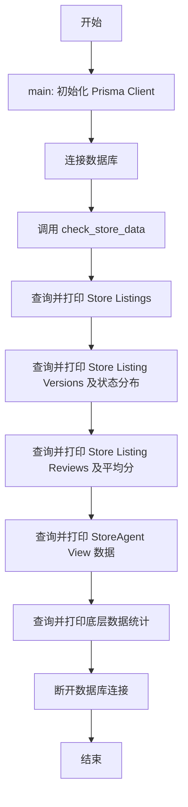
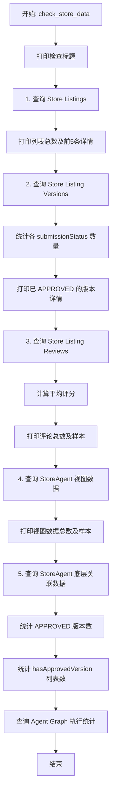
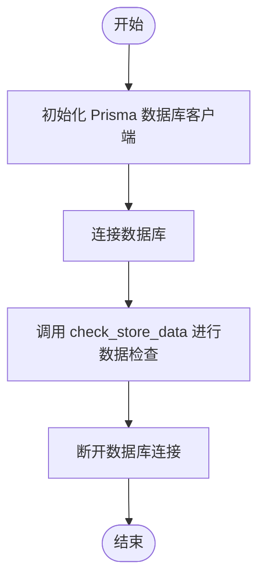

# `AutoGPT\autogpt_platform\backend\backend\check_store_data.py` 详细设计文档

该脚本是一个异步数据库诊断工具，旨在检查和汇总与商店相关的核心数据，包括商店列表、列表版本状态、评论统计、StoreAgent视图内容以及代理图执行记录，通过打印详细的控制台报告来辅助开发者或运维人员验证数据的完整性与状态。

## 整体流程



## 类结构

```
No custom classes defined in this file (无自定义类)
```

## 全局变量及字段


    

## 全局函数及方法


### `check_store_data`

该函数用于异步检查并打印数据库中与商店（Store）相关的各类数据，包括商店列表、版本、评论、视图数据以及相关的统计信息，以验证数据库状态。

参数：

- `db`：`Prisma`，Prisma 数据库客户端实例，用于执行数据库查询操作。

返回值：`None`，无显式返回值，主要作用是向控制台输出格式化的数据检查结果。

#### 流程图



#### 带注释源码

```python
async def check_store_data(db):
    """Check what store data exists in the database."""

    print("============================================================")
    print("Store Data Check")
    print("============================================================")

    # Check store listings
    # 1. 检查商店列表基本信息
    print("\n1. Store Listings:")
    print("-" * 40)
    listings = await db.storelisting.find_many()
    print(f"Total store listings: {len(listings)}")

    if listings:
        # 打印前5个列表的详情
        for listing in listings[:5]:
            print(f"\nListing ID: {listing.id}")
            print(f"  Name: {listing.name}")
            print(f"  Status: {listing.status}")
            print(f"  Slug: {listing.slug}")

    # Check store listing versions
    # 2. 检查商店列表版本信息
    print("\n\n2. Store Listing Versions:")
    print("-" * 40)
    versions = await db.storelistingversion.find_many(include={"StoreListing": True})
    print(f"Total store listing versions: {len(versions)}")

    # Group by submission status
    # 按提交状态分组统计
    status_counts = {}
    for version in versions:
        status = version.submissionStatus
        status_counts[status] = status_counts.get(status, 0) + 1

    print("\nVersions by status:")
    for status, count in status_counts.items():
        print(f"  {status}: {count}")

    # Show approved versions
    # 筛选并打印已批准的版本
    approved_versions = [v for v in versions if v.submissionStatus == "APPROVED"]
    print(f"\nApproved versions: {len(approved_versions)}")
    if approved_versions:
        for version in approved_versions[:5]:
            print(f"\n  Version ID: {version.id}")
            print(f"    Listing: {version.StoreListing.name}")
            print(f"    Version: {version.version}")

    # Check store listing reviews
    # 3. 检查商店列表评论
    print("\n\n3. Store Listing Reviews:")
    print("-" * 40)
    reviews = await db.storelistingreview.find_many(
        include={"StoreListingVersion": {"include": {"StoreListing": True}}}
    )
    print(f"Total reviews: {len(reviews)}")

    if reviews:
        # Calculate average rating
        # 计算平均评分
        total_score = sum(r.score for r in reviews)
        avg_score = total_score / len(reviews) if reviews else 0
        print(f"Average rating: {avg_score:.2f}")

        # Show sample reviews
        # 打印示例评论
        print("\nSample reviews:")
        for review in reviews[:3]:
            print(f"\n  Review for: {review.StoreListingVersion.StoreListing.name}")
            print(f"    Score: {review.score}")
            print(f"    Comments: {review.comments[:100]}...")

    # Check StoreAgent view data
    # 4. 检查 StoreAgent 视图数据（数据库视图）
    print("\n\n4. StoreAgent View Data:")
    print("-" * 40)

    # Query the StoreAgent view
    query = """
    SELECT 
        sa.listing_id,
        sa.slug,
        sa.agent_name,
        sa.description,
        sa.featured,
        sa.runs,
        sa.rating,
        sa.creator_username,
        sa.categories,
        sa.updated_at
    FROM {schema_prefix}"StoreAgent" sa
    LIMIT 10;
    """

    store_agents = await query_raw_with_schema(query)
    print(f"Total store agents in view: {len(store_agents)}")

    if store_agents:
        for agent in store_agents[:5]:
            print(f"\nStore Agent: {agent['agent_name']}")
            print(f"  Slug: {agent['slug']}")
            print(f"  Runs: {agent['runs']}")
            print(f"  Rating: {agent['rating']}")
            print(f"  Creator: {agent['creator_username']}")

    # Check the underlying data that should populate StoreAgent
    # 5. 检查构成 StoreAgent 视图的底层基础数据
    print("\n\n5. Data that should populate StoreAgent view:")
    print("-" * 40)

    # Check for any APPROVED store listing versions
    # 统计已批准的版本数量
    query = """
    SELECT COUNT(*) as count
    FROM {schema_prefix}"StoreListingVersion"
    WHERE "submissionStatus" = 'APPROVED'
    """

    result = await query_raw_with_schema(query)
    approved_count = result[0]["count"] if result else 0
    print(f"Approved store listing versions: {approved_count}")

    # Check for store listings with hasApprovedVersion = true
    # 统计拥有已批准版本的列表数量
    query = """
    SELECT COUNT(*) as count
    FROM {schema_prefix}"StoreListing"
    WHERE "hasApprovedVersion" = true AND "isDeleted" = false
    """

    result = await query_raw_with_schema(query)
    has_approved_count = result[0]["count"] if result else 0
    print(f"Store listings with approved versions: {has_approved_count}")

    # Check agent graph executions
    # 检查 Agent 图执行统计
    query = """
    SELECT COUNT(DISTINCT "agentGraphId") as unique_agents,
           COUNT(*) as total_executions
    FROM {schema_prefix}"AgentGraphExecution"
    """

    result = await query_raw_with_schema(query)
    if result:
        print("\nAgent Graph Executions:")
        print(f"  Unique agents with executions: {result[0]['unique_agents']}")
        print(f"  Total executions: {result[0]['total_executions']}")
```


### `main`

主函数，负责初始化数据库连接，调用商店数据检查逻辑，并确保在执行完毕后断开数据库连接。

参数：

返回值：`None`，无返回值。

#### 流程图



#### 带注释源码

```python
async def main():
    """Main function."""
    # 初始化 Prisma 数据库客户端
    db = Prisma()
    # 建立数据库连接
    await db.connect()

    try:
        # 调用核心函数 check_store_data 检查数据库中的商店相关数据
        await check_store_data(db)
    finally:
        # 无论 try 块中是否发生异常，最后都确保断开数据库连接，释放资源
        await db.disconnect()
```


## 关键组件


### Prisma 异步客户端
负责建立和管理与数据库的异步连接，提供对象关系映射（ORM）接口，用于操作 StoreListing、StoreListingVersion 等实体。

### 商店列表检查模块
负责从数据库中检索 StoreListing 数据，并展示列表的基本信息（如名称、状态和 Slug）。

### 版本状态统计模块
负责分析 StoreListingVersion 数据，统计不同提交状态（如 APPROVED、PENDING）的数量，并筛选出已批准的版本详情。

### 评论数据分析模块
负责处理 StoreListingReview 数据，计算商店列表的平均评分，并展示部分评论样本。

### 数据库视图验证模块
负责查询 StoreAgent 数据库视图，检查视图中的代理数据（如运行次数、评分、创建者）是否符合预期。

### 原生 SQL 查询模块
利用 query_raw_with_schema 工具执行原生 SQL 语句，用于验证底层数据的一致性（如已批准版本计数）以及代理执行图的统计信息。


## 问题及建议


### 已知问题

-   **内存中计算聚合数据导致性能风险**：脚本将所有版本的统计数据和所有评论的评分加载到内存中计算平均值和状态计数（`status_counts`、`total_score`），随着数据量增长，这会导致内存占用过高和响应变慢，应利用数据库的聚合函数（如 `COUNT`、`GROUP BY`、`AVG`）在数据库层面完成计算。
-   **缺乏细粒度的错误处理机制**：在 `check_store_data` 函数中，如果某个查询（例如访问不存在的表或视图）失败，会导致整个脚本异常终止，后续的检查步骤无法执行，无法获取完整的诊断信息。
-   **代码中混合使用 ORM 和原生 SQL**：代码交替使用 Prisma 的 ORM 方法（如 `find_many`）和 `query_raw_with_schema` 执行原生 SQL，这种不一致性增加了代码维护难度，且容易导致数据访问层的逻辑混乱。
-   **使用 `print` 进行日志记录**：直接使用 `print` 输出信息不符合生产级代码的最佳实践，缺乏日志级别控制（如 INFO, DEBUG, ERROR）和日志持久化能力，不利于后续的监控和排查。

### 优化建议

-   **利用数据库聚合能力**：将统计版本状态分布和计算评论平均分的逻辑改为 SQL 查询（例如使用 `GROUP BY submissionStatus` 和 `AVG(score)`），直接从数据库获取聚合结果，显著减少网络传输和内存消耗。
-   **引入结构化日志系统**：使用 Python 标准库的 `logging` 模块替代 `print`，配置不同的日志级别，使脚本能够灵活控制输出详细度，并支持将错误信息写入文件以便追踪。
-   **增强容错性与健壮性**：在各个独立的检查步骤（如检查 List、检查 Versions、检查 View 等）周围添加 `try-except` 块，确保即使某项检查失败（如表不存在或权限问题），脚本也能捕获异常、记录错误并继续执行后续的检查逻辑。
-   **配置化硬编码参数**：将代码中的幻数（如列表显示限制 `[:5]`、`[:3]`、`LIMIT 10`）提取为函数参数或配置常量，提高代码的灵活性和可复用性。
-   **统一数据访问层**：尽量使用 Prisma ORM 的查询能力替代原生 SQL 查询（除非涉及复杂联查或性能优化必须用 SQL），以保持代码风格一致，并利用 ORM 的类型安全特性。


## 其它


### 设计目标与约束

**设计目标**
1.  **数据完整性校验**：验证数据库中 Store 相关的核心表（StoreListing, StoreListingVersion, StoreListingReview）及视图（StoreAgent）的数据存在性和一致性。
2.  **状态概览**：提供当前数据库中商店列表的提交状态（如 APPROVED 数量）、评分统计及执行次数的快照，用于监控或调试。
3.  **非侵入性**：脚本设计为只读操作，不对数据库数据进行任何修改或删除。

**约束条件**
1.  **异步执行环境**：必须运行在 Python `asyncio` 事件循环中，利用异步 I/O 进行数据库操作以提高效率。
2.  **数据库模式依赖**：强依赖于特定的数据库 Schema，包括特定的表名（如 `StoreListing`）、列名（如 `submissionStatus`）及视图（如 `StoreAgent`）。如果 Schema 发生变更，脚本可能失效。
3.  **输出格式**：当前输出为纯文本格式打印到标准输出，主要用于人工阅读，未提供结构化数据（如 JSON）供程序消费。
4.  **库依赖**：必须使用 `Prisma` Python Client 及项目内部封装的 `query_raw_with_schema` 函数。

### 错误处理与异常设计

**当前实现**
1.  **连接管理**：`main` 函数使用了 `try...finally` 结构，确保无论 `check_store_data` 是否发生异常，数据库连接 `db.disconnect()` 都会被调用，防止连接泄漏。
2.  **查询异常**：代码中未显式捕获数据库查询异常（如表不存在、连接超时、SQL 语法错误）。若发生此类错误，程序将抛出未处理的异常并终止。

**设计建议与改进**
1.  **异常捕获**：建议在 `check_store_data` 内部为每个查询步骤添加 `try...except` 块。例如，当 `StoreAgent` 视图不存在时，应捕获异常并打印友好的错误信息，而不是直接崩溃。
2.  **空值处理**：在计算平均评分或处理查询结果时，代码已包含对空列表的判断（如 `if reviews`），这是良好的防御性编程实践。
3.  **重试机制**：对于数据库连接抖动，可以考虑引入简单的重试逻辑，特别是在生产环境巡检场景下。

### 数据流与状态机

**数据流**
1.  **初始化阶段**：脚本启动 -> 初始化 `Prisma` 客户端 -> 建立数据库连接。
2.  **数据获取与处理阶段**（线性串行）：
    *   **流 A**：查询 `StoreListing` 表 -> 格式化输出列表摘要。
    *   **流 B**：查询 `StoreListingVersion` 表 -> 计数并按状态分类 -> 输出 APPROVED 状态详情。
    *   **流 C**：查询 `StoreListingReview` 表 -> 计算平均分 -> 输出样例评论。
    *   **流 D**：执行原生 SQL 查询 `StoreAgent` 视图 -> 输出代理信息。
    *   **流 E**：执行原生 SQL 聚合查询 -> 输出底层数据统计。
3.  **终止阶段**：所有检查完成 -> 断开数据库连接 -> 退出程序。

**状态机**
脚本本身是一个简单的批处理任务，不具备复杂的内部状态机。
*   **状态 1：未连接** -> 动作：`db.connect()` -> 转移至 **状态 2：已连接**。
*   **状态 2：已连接** -> 动作：执行查询逻辑 -> 转移至 **状态 3：执行中**。
*   **状态 3：执行中** -> 动作：完成所有逻辑或发生异常 -> 转移至 **状态 4：清理中**。
*   **状态 4：清理中** -> 动作：`db.disconnect()` -> 转移至 **状态 5：结束**。

### 外部依赖与接口契约

**外部依赖**
1.  **`prisma` 库**：用于类型安全的 ORM 访问，提供 `Prisma` 类及模型客户端。
2.  **`backend.data.db.query_raw_with_schema`**：项目内部函数，用于执行原生 SQL 并自动处理 Schema 前缀。
    *   **契约**：接收 SQL 查询字符串，返回记录列表（List[Dict]）。
3.  **数据库实例**：需支持 PostgreSQL 或 MySQL（取决于 Prisma 配置），且需包含以下表结构：
    *   `StoreListing`: 包含 `id`, `name`, `status`, `slug`, `hasApprovedVersion`, `isDeleted` 字段。
    *   `StoreListingVersion`: 包含 `id`, `submissionStatus`, `version` 字段，关联 `StoreListing`。
    *   `StoreListingReview`: 包含 `score`, `comments` 字段，关联 `StoreListingVersion`。
    *   `StoreAgent` (视图): 包含 `listing_id`, `slug`, `agent_name`, `runs`, `rating` 等字段。
    *   `AgentGraphExecution`: 包含 `agentGraphId` 字段。

**接口契约**
1.  **`check_store_data(db)`**
    *   **输入参数**：`db` (Prisma Client 实例)，必须处于已连接状态。
    *   **副作用**：向标准输出打印格式化文本。
    *   **返回值**：`None`。
    *   **依赖**：依赖传入的 `db` 对象实现 `storelisting`, `storelistingversion`, `storelistingreview` 等 `find_many` 方法。
2.  **`query_raw_with_schema(query)`**
    *   **输入参数**：SQL 查询字符串，其中需包含 `{schema_prefix}` 占位符。
    *   **期望行为**：替换占位符并执行查询，返回字典列表。

    