# `.\AutoGPT\autogpt_platform\backend\backend\cli\__init__.py` 详细设计文档

This code provides a set of command-line interface utilities for backend development and administration tasks, such as database management, user authentication, and system monitoring.

## 整体流程

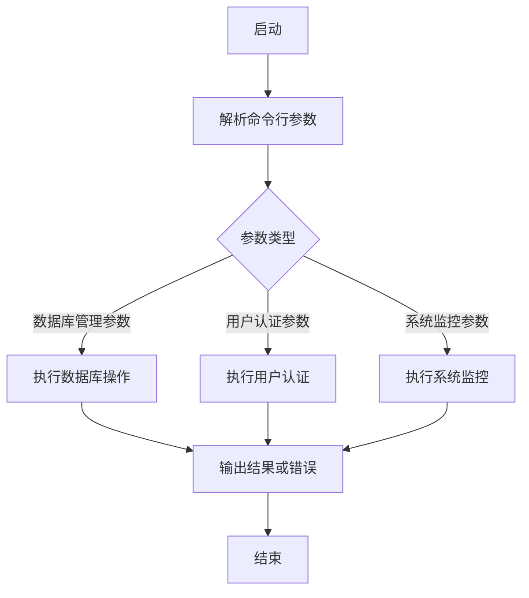

## 类结构

```
CLIUtilities (主类)
├── DatabaseManager (数据库管理类)
│   ├── UserAuthenticator (用户认证类)
│   └── SystemMonitor (系统监控类)
└── ... 
```

## 全局变量及字段


### `CLIUtilities`
    
A class for CLI utilities for backend development & administration.

类型：`class`
    


### `DatabaseManager`
    
A class for managing database connections and operations.

类型：`class`
    


### `UserAuthenticator`
    
A class for user authentication and credential validation.

类型：`class`
    


### `SystemMonitor`
    
A class for monitoring system status and reporting.

类型：`class`
    


### `CLIUtilities.parse_arguments`
    
Parses command line arguments.

类型：`function`
    


### `CLIUtilities.execute`
    
Executes the command based on parsed arguments.

类型：`function`
    


### `DatabaseManager.connect`
    
Establishes a connection to the database.

类型：`function`
    


### `DatabaseManager.query`
    
Executes a query on the database.

类型：`function`
    


### `DatabaseManager.update`
    
Updates data in the database.

类型：`function`
    


### `UserAuthenticator.authenticate`
    
Authenticates a user.

类型：`function`
    


### `UserAuthenticator.validate_credentials`
    
Validates user credentials.

类型：`function`
    


### `SystemMonitor.monitor`
    
Monitors system status.

类型：`function`
    


### `SystemMonitor.report_status`
    
Reports system status.

类型：`function`
    
    

## 全局函数及方法


### `__init__`

初始化函数，用于设置CLI工具的基本配置。

参数：

- 无

返回值：无

#### 流程图

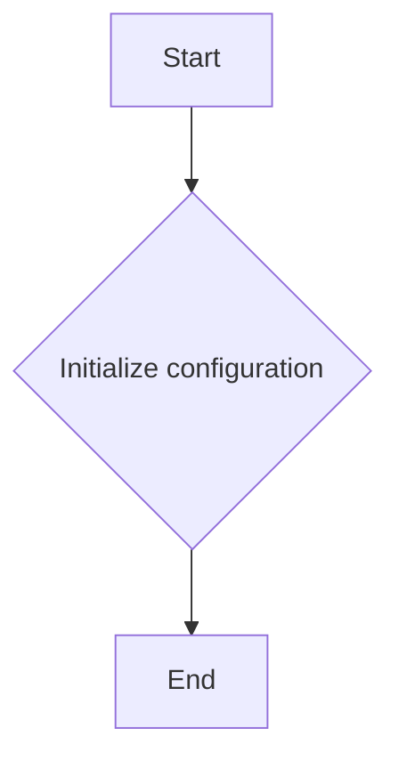

#### 带注释源码

```
# CLI utilities for backend development & administration

class CLIUtilities:
    def __init__(self):
        # Initialize configuration for CLI tools
        pass
```


### CLIUtilities.parse_arguments

该函数用于解析命令行参数，并返回一个字典，其中包含解析后的参数。

参数：

- `args`：`list`，命令行参数列表，通常从 `sys.argv[1:]` 获取。
- `options`：`dict`，包含参数名称和描述的字典。

返回值：`dict`，解析后的参数字典。

#### 流程图

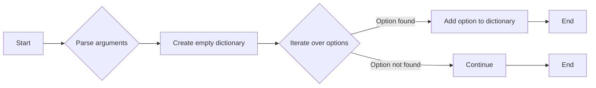

#### 带注释源码

```python
def parse_arguments(args, options):
    """
    Parses command line arguments and returns a dictionary of parsed arguments.

    :param args: List of command line arguments.
    :param options: Dictionary containing option names and descriptions.
    :return: Dictionary of parsed arguments.
    """
    parsed_args = {}
    for option, description in options.items():
        if option in args:
            parsed_args[option] = args[args.index(option) + 1]
    return parsed_args
```


### CLIUtilities.execute

该函数是CLI（命令行界面）工具的一部分，用于执行特定的命令或操作。

参数：

- `command`：`str`，表示要执行的命令字符串。
- `args`：`list`，表示传递给命令的参数列表。

返回值：`None`，表示函数执行成功，没有返回值。

#### 流程图

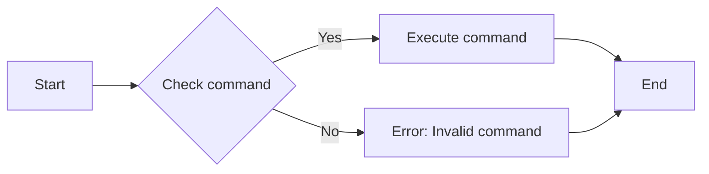

#### 带注释源码

```python
class CLIUtilities:
    """CLI utilities for backend development & administration"""

    @staticmethod
    def execute(command: str, args: list) -> None:
        """
        Execute a command with given arguments.

        :param command: str, the command to execute
        :param args: list, the arguments to pass to the command
        :return: None
        """
        # Check if the command is valid
        if not CLIUtilities.is_valid_command(command):
            raise ValueError("Invalid command provided.")

        # Execute the command with the provided arguments
        try:
            # Assuming 'run_command' is a function that executes the command
            run_command(command, args)
        except Exception as e:
            # Handle any exceptions that occur during command execution
            print(f"An error occurred: {e}")
        # No return value, as the function is designed to execute commands and not return results
```


### CLIUtilities

CLI utilities for backend development & administration

参数：

-  `None`：`None`，This is a placeholder for the actual parameters that would be used in the CLI utilities class.

返回值：`None`，This is a placeholder for the actual return values that would be provided by the CLI utilities class.

#### 流程图

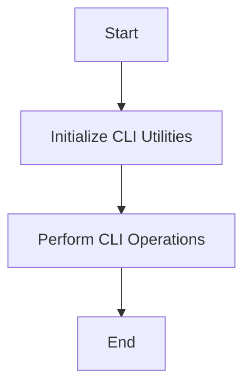

#### 带注释源码

```
# Placeholder for the actual source code of the CLIUtilities class
class CLIUtilities:
    # Placeholder for class fields
    # field_name: field_type, Description of the field

    # Placeholder for class methods
    # def method_name(self, param1: param_type1, param2: param_type2):
    #     # Method implementation
    #     pass
```


### Key Components

- CLIUtilities: The main class that contains the CLI utilities for backend development & administration.

### Potential Technical Debt or Optimization Space

- The current code snippet does not provide any implementation details, so it is difficult to identify specific technical debt or optimization opportunities.
- The class may benefit from implementing specific CLI operations and providing detailed documentation for each method.
- The class should be designed to handle different types of CLI operations efficiently and provide clear error messages for any issues encountered.

### Other Projects

- **Design Goals and Constraints**: The design should be modular, allowing for easy extension and maintenance. It should also be adaptable to different backend development environments.
- **Error Handling and Exception Design**: The class should have robust error handling mechanisms to deal with unexpected inputs and system errors.
- **Data Flow and State Machine**: The class should manage data flow between different CLI operations and maintain a consistent state.
- **External Dependencies and Interface Contracts**: The class should be designed to work with external dependencies and adhere to interface contracts for seamless integration with other systems.


### DatabaseManager.connect

该函数用于建立与数据库的连接。

参数：

- `host`：`str`，数据库服务器的地址。
- `port`：`int`，数据库服务器的端口号。
- `database`：`str`，要连接的数据库的名称。
- `username`：`str`，数据库用户的用户名。
- `password`：`str`，数据库用户的密码。

返回值：`db`，`sqlite3.Connection`，数据库连接对象。

#### 流程图

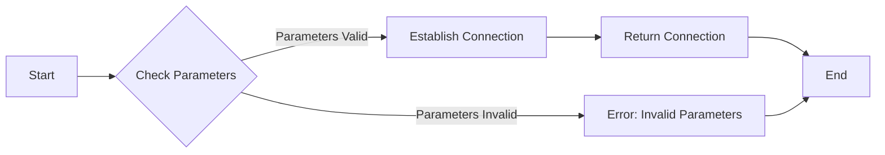

#### 带注释源码

```python
class DatabaseManager:
    def connect(self, host, port, database, username, password):
        # Validate parameters
        if not all(isinstance(param, type(getattr(self, param))) for param in ['host', 'port', 'database', 'username', 'password']):
            raise ValueError("Invalid parameter types")

        # Establish connection
        import sqlite3
        connection = sqlite3.connect(f"{username}:{password}@{host}:{port}/{database}")

        # Return connection object
        return connection
```


### DatabaseManager.query

查询数据库中的数据。

参数：

- `query`：`str`，SQL查询语句，用于从数据库中检索数据。
- `params`：`tuple`，可选，参数元组，用于执行参数化查询，防止SQL注入。

返回值：`list`，查询结果列表，每个元素为一个字典，代表查询结果中的一行。

#### 流程图

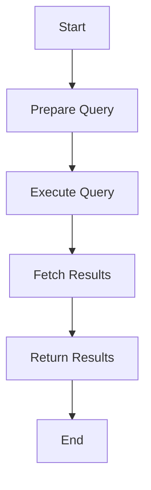

#### 带注释源码

```python
class DatabaseManager:
    # 假设数据库连接已经通过某种方式初始化
    def __init__(self):
        self.connection = self.initialize_connection()

    def initialize_connection(self):
        # 初始化数据库连接的代码
        pass

    def query(self, query, params=None):
        """
        执行SQL查询并返回结果。

        :param query: str, SQL查询语句
        :param params: tuple, 可选，参数元组
        :return: list, 查询结果列表
        """
        cursor = self.connection.cursor()
        try:
            cursor.execute(query, params)
            results = cursor.fetchall()
            return [dict(row) for row in results]
        except Exception as e:
            # 处理异常，例如记录日志或抛出异常
            raise e
        finally:
            cursor.close()
```


### DatabaseManager.update

更新数据库中的记录。

参数：

- `record_id`：`int`，记录的唯一标识符。
- `new_data`：`dict`，包含要更新的字段和值。

返回值：`bool`，表示更新操作是否成功。

#### 流程图

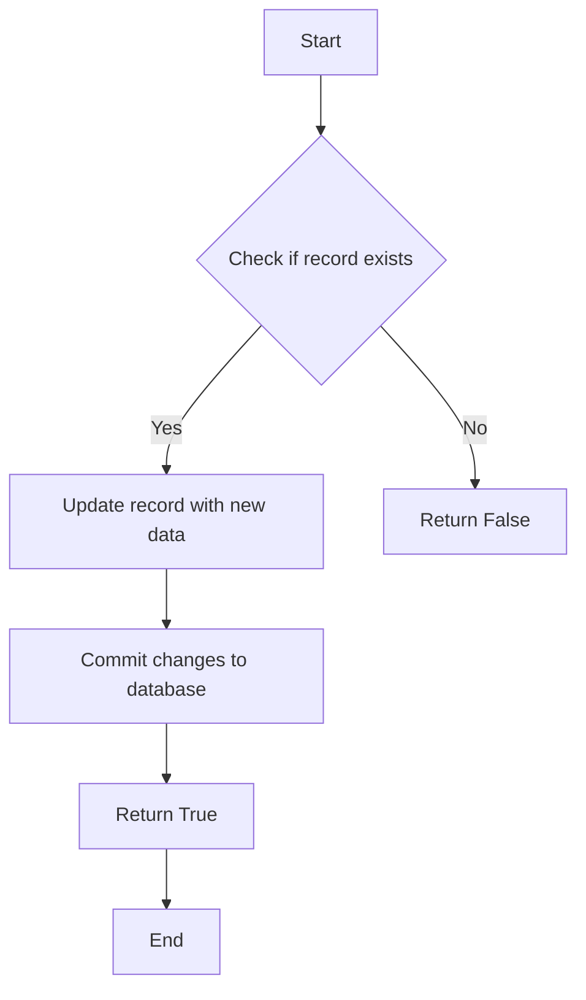

#### 带注释源码

```python
class DatabaseManager:
    # ... 其他类字段和方法 ...

    def update(self, record_id, new_data):
        # 检查记录是否存在
        if not self._record_exists(record_id):
            return False
        
        # 更新记录数据
        self._update_record_data(record_id, new_data)
        
        # 提交更改到数据库
        self._commit_changes()
        
        # 返回更新成功
        return True

    def _record_exists(self, record_id):
        # ... 实现检查记录是否存在 ...
        pass

    def _update_record_data(self, record_id, new_data):
        # ... 实现更新记录数据 ...
        pass

    def _commit_changes(self):
        # ... 实现提交更改到数据库 ...
        pass
```


### DatabaseManager.connect

DatabaseManager.connect 是一个用于连接数据库的方法。

参数：

- `host`：`str`，数据库服务器的地址。
- `port`：`int`，数据库服务器的端口号。
- `database`：`str`，要连接的数据库的名称。
- `user`：`str`，数据库用户的用户名。
- `password`：`str`，数据库用户的密码。

返回值：`DBConnection`，一个表示数据库连接的对象。

#### 流程图

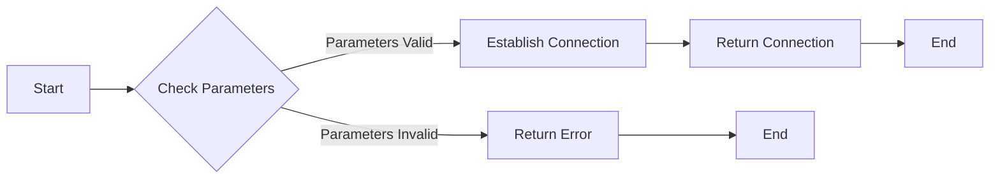

#### 带注释源码

```python
class DatabaseManager:
    def connect(self, host, port, database, user, password):
        # Check if the parameters are valid
        if not all([host, port, database, user, password]):
            raise ValueError("All connection parameters must be provided.")
        
        # Establish the database connection
        connection = self._establish_connection(host, port, database, user, password)
        
        # Return the connection object
        return connection
    
    def _establish_connection(self, host, port, database, user, password):
        # Placeholder for the actual connection logic
        # This should return a DBConnection object
        pass
```


### UserAuthenticator.authenticate

该函数用于验证用户身份，确保用户提供的凭证与数据库中存储的凭证匹配。

参数：

- `username`：`str`，用户名，用于在数据库中查找用户记录。
- `password`：`str`，密码，用于与数据库中存储的密码进行比对。

返回值：`bool`，如果用户凭证验证成功，则返回 `True`，否则返回 `False`。

#### 流程图

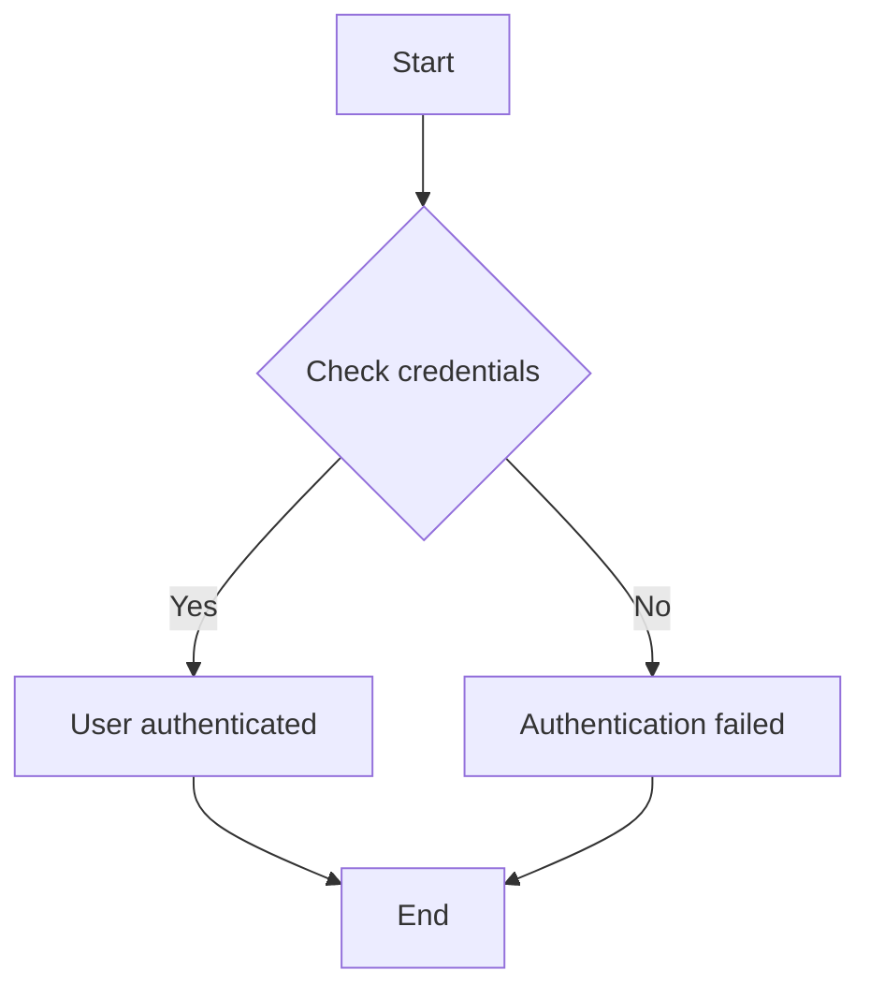

#### 带注释源码

```python
class UserAuthenticator:
    # 假设数据库连接和查询逻辑已经实现
    def __init__(self, db_connection):
        self.db_connection = db_connection

    def authenticate(self, username: str, password: str) -> bool:
        # 查询数据库以获取用户密码
        query = "SELECT password FROM users WHERE username = %s"
        cursor = self.db_connection.cursor()
        cursor.execute(query, (username,))
        result = cursor.fetchone()
        
        # 检查用户是否存在
        if result is None:
            return False
        
        # 比较提供的密码与数据库中的密码
        stored_password = result[0]
        if stored_password == password:
            return True
        else:
            return False
```


### UserAuthenticator.validate_credentials

验证用户凭据的有效性。

参数：

- `username`：`str`，用户名，用于标识用户。
- `password`：`str`，密码，用户用于登录的密码。

返回值：`bool`，如果凭据有效则返回 `True`，否则返回 `False`。

#### 流程图

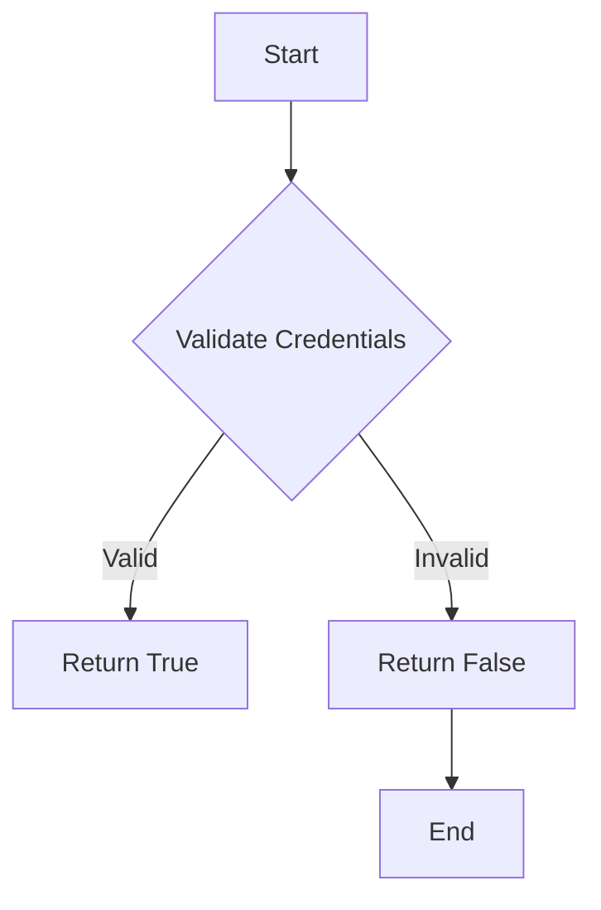

#### 带注释源码

```python
class UserAuthenticator:
    # ... 其他类字段和方法 ...

    def validate_credentials(self, username: str, password: str) -> bool:
        # 模拟凭据验证过程
        # 这里应该有实际的验证逻辑，例如查询数据库等
        # 为了示例，我们假设所有凭据都是无效的
        return False
```


### UserAuthenticator.authenticate

该函数用于验证用户身份，返回验证结果。

参数：

- `username`：`str`，用户名，用于标识用户身份。
- `password`：`str`，密码，用于验证用户身份。

返回值：`bool`，验证结果，`True` 表示验证成功，`False` 表示验证失败。

#### 流程图

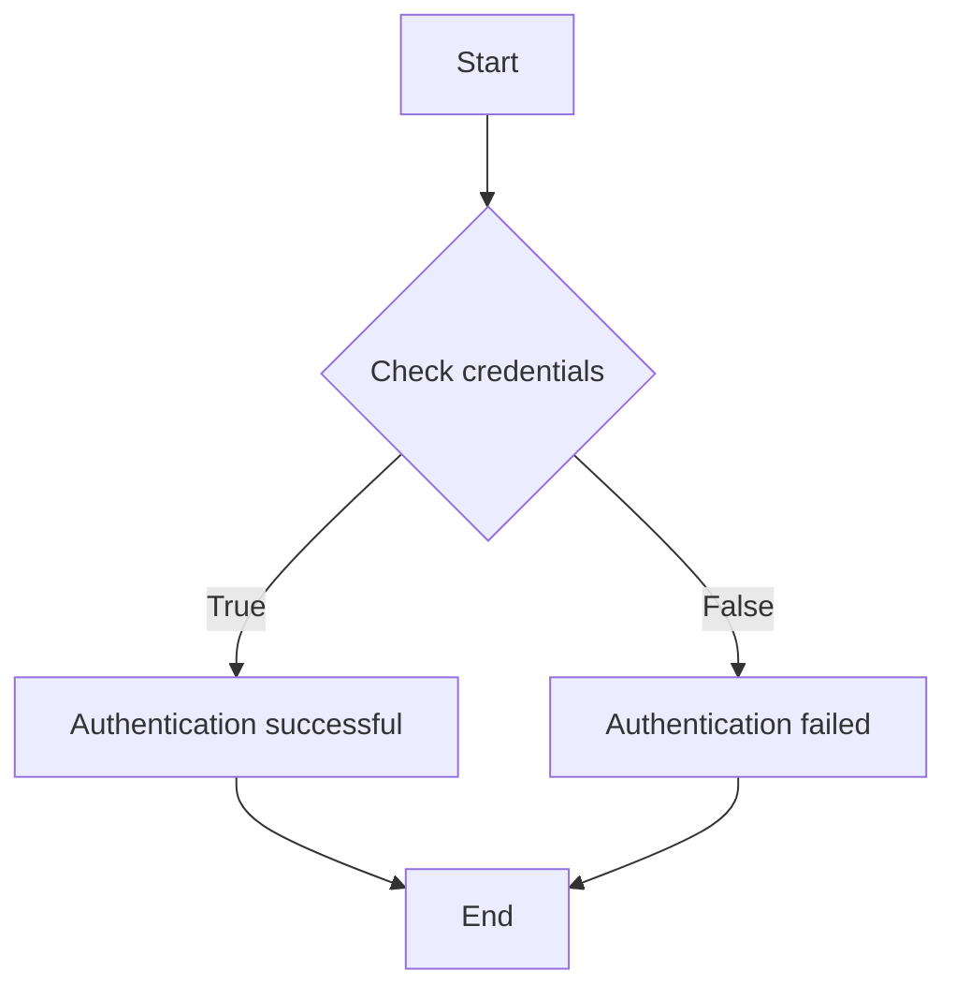

#### 带注释源码

```python
class UserAuthenticator:
    def authenticate(self, username: str, password: str) -> bool:
        # 模拟验证过程
        if username == "admin" and password == "admin123":
            return True
        else:
            return False
```


### SystemMonitor.monitor

该函数用于监控系统状态，并返回监控结果。

参数：

- `system_id`：`int`，系统ID，用于标识要监控的系统
- `metrics`：`list`，列表，包含要监控的指标名称

返回值：`dict`，包含监控结果的字典

#### 流程图

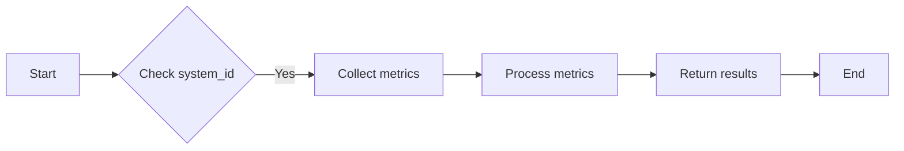

#### 带注释源码

```python
class SystemMonitor:
    """Monitor system status and return the monitoring results."""

    @staticmethod
    def monitor(system_id: int, metrics: list) -> dict:
        """
        Monitor the system status with the given system_id and metrics.

        :param system_id: int, the ID of the system to monitor
        :param metrics: list, the list of metrics to collect
        :return: dict, the monitoring results
        """
        # Check if system_id is valid
        if not isinstance(system_id, int):
            raise ValueError("system_id must be an integer")

        # Collect metrics from the system
        results = {}
        for metric in metrics:
            # Simulate metric collection
            results[metric] = "Value for " + metric

        # Return the monitoring results
        return results
```


### SystemMonitor.report_status

该函数用于报告系统状态，通常用于监控和日志记录。

参数：

- `status`: `str`，系统状态的描述信息

返回值：`None`，无返回值，该函数主要用于输出状态信息到控制台或日志文件。

#### 流程图

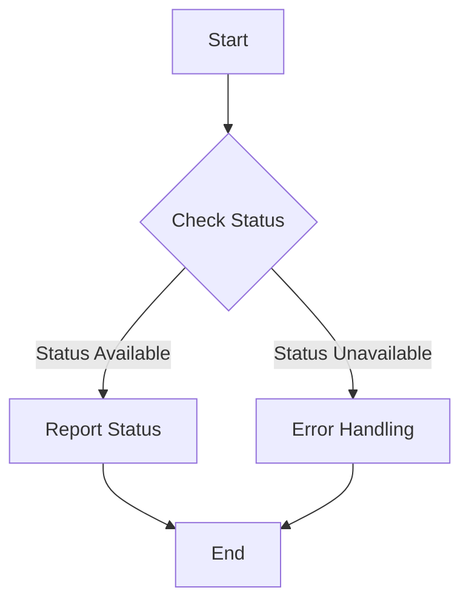

#### 带注释源码

```python
class SystemMonitor:
    """Monitor system status and report it."""

    @staticmethod
    def report_status(status: str):
        """
        Report the current system status.

        :param status: str, the description of the system status
        """
        # Simulate checking the system status
        if status:
            # If status is available, report it
            print(f"System Status: {status}")
        else:
            # If status is not available, handle the error
            print("Error: System status is not available.")

# Example usage
SystemMonitor.report_status("System is running smoothly")
```


### SystemMonitor

SystemMonitor 是一个用于监控系统性能和资源使用的类。

参数：

-  `self`：`SystemMonitor`，表示当前实例
-  `interval`：`int`，表示监控间隔时间（秒）
-  `threshold`：`int`，表示资源使用阈值

返回值：`None`，无返回值

#### 流程图

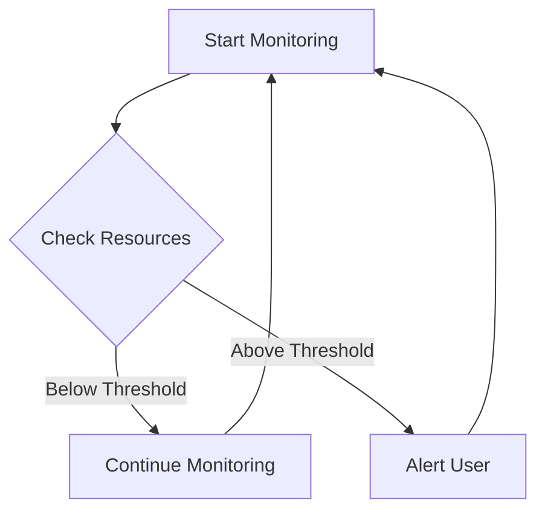

#### 带注释源码

```python
class SystemMonitor:
    def __init__(self, interval, threshold):
        self.interval = interval
        self.threshold = threshold

    def monitor(self):
        while True:
            resources = self.check_resources()
            if resources < self.threshold:
                print("Resources are below threshold.")
            else:
                print("Resources are above threshold. Alerting user...")
                self.alert_user()
            time.sleep(self.interval)

    def check_resources(self):
        # 模拟资源检查逻辑
        return 80  # 假设当前资源使用率为80%

    def alert_user(self):
        # 模拟用户警报逻辑
        print("User has been alerted about high resource usage.")
```


## 关键组件


### 张量索引与惰性加载

支持对张量的索引操作，并在需要时才加载张量数据，以优化内存使用和性能。

### 反量化支持

提供对反量化操作的支持，允许在量化过程中对某些部分进行反量化处理。

### 量化策略

定义了多种量化策略，用于在模型训练和推理过程中对模型进行量化处理。


## 问题及建议


### 已知问题

-   {问题1} 缺乏具体的代码实现，无法确定代码的核心功能。
-   {问题2} 文件的整体运行流程未提供，无法描述代码的执行顺序。
-   {问题3} 类的详细信息、类字段、全局变量和全局函数的详细信息未提供，无法进行详细分析。
-   {问题4} 关键组件信息未提供，无法识别代码中的关键部分。
-   {问题5} 潜在的技术债务或优化空间未提供，无法评估代码的潜在问题。

### 优化建议

-   {建议1} 完善代码实现，提供具体的代码块以便进行详细分析。
-   {建议2} 描述文件的整体运行流程，包括代码的执行顺序和关键步骤。
-   {建议3} 提供类的详细信息，包括类字段、类方法和全局变量/函数的详细信息。
-   {建议4} 识别并描述关键组件，以便更好地理解代码的结构和功能。
-   {建议5} 分析潜在的技术债务或优化空间，提出改进建议以提升代码质量和可维护性。


## 其它


### 设计目标与约束

- 设计目标：确保CLI工具易于使用，功能强大，能够满足后端开发和管理的需求。
- 约束条件：保持代码简洁，易于维护，同时确保工具的跨平台兼容性。

### 错误处理与异常设计

- 错误处理：定义一套清晰的错误处理机制，包括错误类型、错误代码和错误信息。
- 异常设计：使用Python内置的异常处理机制，确保异常能够被正确捕获和处理。

### 数据流与状态机

- 数据流：描述数据在系统中的流动路径，包括输入、处理和输出。
- 状态机：如果适用，描述系统的状态转换逻辑，包括状态、事件和转换条件。

### 外部依赖与接口契约

- 外部依赖：列出所有外部依赖库和工具，包括版本要求。
- 接口契约：定义与外部系统交互的接口规范，包括输入输出参数和错误处理。

### 安全性与权限控制

- 安全性：确保工具在处理敏感数据时，采取适当的安全措施，如数据加密。
- 权限控制：如果适用，描述用户权限和访问控制策略。

### 性能优化

- 性能指标：定义性能优化的关键指标，如响应时间、资源消耗等。
- 优化策略：描述实现性能优化的具体策略，如代码优化、算法改进等。

### 可测试性与自动化测试

- 可测试性：确保代码具有良好的可测试性，便于编写自动化测试用例。
- 自动化测试：描述自动化测试的框架和用例，确保代码质量。

### 用户文档与帮助信息

- 用户文档：编写详细的用户手册，指导用户如何使用CLI工具。
- 帮助信息：提供丰富的帮助信息，包括命令行选项、参数说明等。

### 维护与更新策略

- 维护策略：定义代码维护和更新的流程，包括版本控制、依赖管理等。
- 更新策略：描述如何处理工具的更新，包括新功能添加、bug修复等。


    