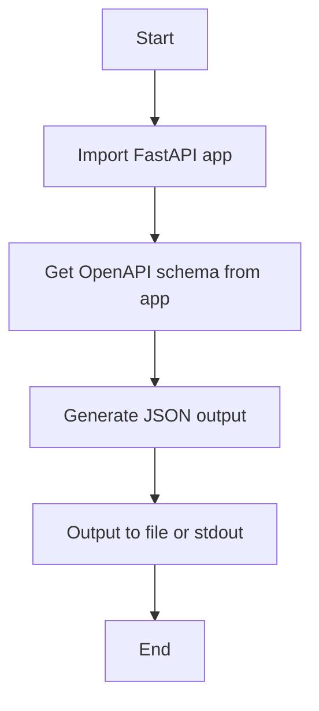
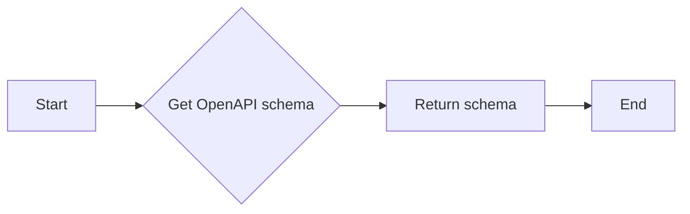
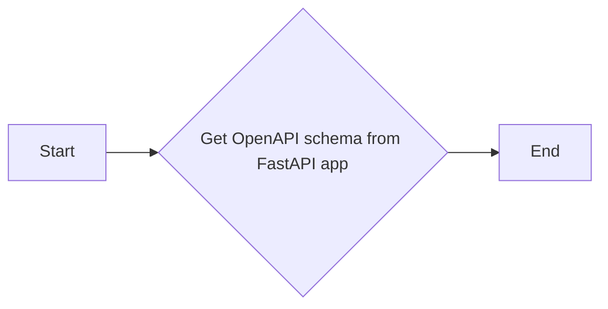

# `.\AutoGPT\autogpt_platform\backend\backend\cli\generate_openapi_json.py` 详细设计文档

This script generates an OpenAPI JSON specification for a FastAPI application, which can be output to a file or stdout with optional pretty-printing.

## 整体流程



## 类结构

```
Main (主程序)
├── click (命令行工具库)
│   ├── main (主函数)
│   └── get_openapi_schema (获取 OpenAPI 规范)
└── os (操作系统接口库)
```

## 全局变量及字段


### `output`
    
Output file path (default: stdout)

类型：`click.Path(dir_okay=False, path_type=Path)`
    


### `pretty`
    
Pretty-print JSON output (indented 2 spaces)

类型：`click.BOOL`
    


### `openapi_schema`
    
The OpenAPI schema from the FastAPI app

类型：`dict`
    


### `json_output`
    
The JSON representation of the OpenAPI schema

类型：`str`
    


### `click.Path.output`
    
The output file path where the OpenAPI specification will be written. If not specified, the output will be written to stdout.

类型：`Path`
    


### `click.BOOL.pretty`
    
Determines whether the JSON output should be pretty-printed with indentation. Defaults to False.

类型：`bool`
    


### `dict.openapi_schema`
    
A dictionary containing the OpenAPI schema that is retrieved from the FastAPI app.

类型：`dict`
    


### `str.json_output`
    
A string that represents the JSON output of the OpenAPI schema. If an output file is specified, this string is written to the file. If no output file is specified, this string is printed to stdout.

类型：`str`
    
    

## 全局函数及方法


### main

Generate and output the OpenAPI JSON specification.

参数：

- `output`：`Path`，The output file path where the OpenAPI specification will be written. If not specified, the output will be written to stdout.
- `pretty`：`bool`，Whether to pretty-print the JSON output with indentation.

返回值：`None`，The function does not return a value.

#### 流程图


#### 带注释源码

```python
@click.command()
@click.option(
    "--output",
    type=click.Path(dir_okay=False, path_type=Path),
    help="Output file path (default: stdout)",
)
@click.option(
    "--pretty",
    type=click.BOOL,
    default=False,
    help="Pretty-print JSON output (indented 2 spaces)",
)
def main(output: Path, pretty: bool):
    """Generate and output the OpenAPI JSON specification."""
    openapi_schema = get_openapi_schema()

    json_output = json.dumps(openapi_schema, indent=2 if pretty else None)

    if output:
        output.write_text(json_output)
        click.echo(f"✅ OpenAPI specification written to {output}\n\nPreview:")
        click.echo(f"\n{json_output[:500]} ...")
    else:
        print(json_output)
```


### `get_openapi_schema`

获取 FastAPI 应用程序的 OpenAPI 规范。

参数：

- 无

返回值：`dict`，包含 OpenAPI 规范的 JSON 数据

#### 流程图



#### 带注释源码

```python
def get_openapi_schema():
    """Get the OpenAPI schema from the FastAPI app"""
    from backend.api.rest_api import app

    return app.openapi()
```


### main

Generate and output the OpenAPI JSON specification.

参数：

- `output`：`click.Path`，The output file path where the OpenAPI specification will be written. If not specified, the output will be written to stdout.
- `pretty`：`click.BOOL`，Whether to pretty-print the JSON output. Defaults to `False`.

返回值：`None`，The function does not return a value. It writes the OpenAPI specification to the specified output or stdout.

#### 流程图


#### 带注释源码

```python
@click.command()
@click.option(
    "--output",
    type=click.Path(dir_okay=False, path_type=Path),
    help="Output file path (default: stdout)",
)
@click.option(
    "--pretty",
    type=click.BOOL,
    default=False,
    help="Pretty-print JSON output (indented 2 spaces)",
)
def main(output: Path, pretty: bool):
    """Generate and output the OpenAPI JSON specification."""
    openapi_schema = get_openapi_schema()

    json_output = json.dumps(openapi_schema, indent=2 if pretty else None)

    if output:
        output.write_text(json_output)
        click.echo(f"✅ OpenAPI specification written to {output}\n\nPreview:")
        click.echo(f"\n{json_output[:500]} ...")
    else:
        print(json_output)
```


### click.get_openapi_schema

该函数从FastAPI应用中获取OpenAPI模式。

参数：

- 无

返回值：`dict`，包含OpenAPI模式的数据结构

#### 流程图



#### 带注释源码

```python
def get_openapi_schema():
    """Get the OpenAPI schema from the FastAPI app"""
    from backend.api.rest_api import app

    return app.openapi()
```


## 关键组件


### 张量索引与惰性加载

支持对张量的索引操作，并在需要时才加载数据，以优化内存使用。

### 反量化支持

提供对反量化操作的支持，允许在量化过程中进行逆量化处理。

### 量化策略

定义了不同的量化策略，用于在模型训练和推理过程中对权重和激活进行量化。


## 问题及建议


### 已知问题

-   **环境变量设置**：代码中在主函数执行前直接设置了环境变量`LOG_LEVEL`，这可能会覆盖其他部分的代码中可能需要的日志级别设置。建议使用配置文件或环境变量管理工具来处理环境变量，以便更好地控制和管理。
-   **代码复用性**：`get_openapi_schema`函数直接从`backend.api.rest_api`模块中导入`app`对象，这可能导致代码在不同环境中难以复用，因为`app`的创建可能依赖于特定的环境配置。
-   **错误处理**：代码中没有明显的错误处理机制，如果`get_openapi_schema`函数或文件写入操作失败，程序可能会崩溃。建议添加异常处理来增强程序的健壮性。
-   **输出格式**：当使用`--output`选项时，如果输出文件已存在，代码不会给出任何提示。建议在写入文件之前检查文件是否存在，并给出相应的提示。

### 优化建议

-   **环境变量管理**：使用配置文件或环境变量管理工具来设置环境变量，而不是在代码中直接设置。
-   **模块化**：将`get_openapi_schema`函数和`app`对象的创建逻辑封装在一个模块中，以便在不同的环境中复用。
-   **错误处理**：在关键操作（如文件写入和API调用）中添加异常处理，确保程序在遇到错误时能够优雅地处理。
-   **用户交互**：在写入文件之前检查文件是否存在，并给出相应的提示，例如提示用户文件已存在或询问是否覆盖。
-   **代码注释**：添加必要的代码注释，以提高代码的可读性和可维护性。
-   **单元测试**：编写单元测试来验证代码的功能，确保代码在修改后仍然能够正常工作。


## 其它


### 设计目标与约束

- 设计目标：
  - 生成符合 OpenAPI 3.0 规范的 JSON 格式的 OpenAPI 规范文件。
  - 支持将生成的 OpenAPI 规范输出到文件或标准输出。
  - 支持格式化输出，以便于阅读和调试。
- 约束条件：
  - 必须使用 FastAPI 框架。
  - 必须使用 click 库来处理命令行参数。
  - 输出文件路径和格式化选项必须通过命令行参数提供。

### 错误处理与异常设计

- 错误处理：
  - 当无法找到指定的输出文件路径时，应抛出 `FileNotFoundError` 异常。
  - 当命令行参数格式不正确时，应抛出 `click.exceptions.ClickException` 异常。
- 异常设计：
  - 使用 try-except 块捕获和处理可能发生的异常。
  - 提供清晰的错误信息，帮助用户理解错误原因。

### 数据流与状态机

- 数据流：
  - 用户通过命令行运行脚本，传入必要的参数。
  - 脚本读取 FastAPI 应用中的 OpenAPI 规范。
  - 脚本将 OpenAPI 规范转换为 JSON 格式。
  - 脚本将 JSON 格式的 OpenAPI 规范输出到文件或标准输出。
- 状态机：
  - 脚本的状态包括：初始化、读取 OpenAPI 规范、格式化输出、写入文件或标准输出。

### 外部依赖与接口契约

- 外部依赖：
  - FastAPI 框架
  - click 库
  - json 库
  - os 库
  - pathlib 库
- 接口契约：
  - `get_openapi_schema` 函数：从 FastAPI 应用中获取 OpenAPI 规范。
  - `main` 函数：处理命令行参数，调用 `get_openapi_schema` 函数，并输出结果。


    