# `AutoGPT\autogpt_platform\backend\backend\cli\oauth_tool.py` 详细设计文档

该代码是一个基于 Click 的命令行工具，用于生成 OAuth 应用的客户端凭据（Client ID 和 Secret）、输出 SQL 插入语句、哈希与验证密钥，并提供一个集成的测试服务器，支持在数据库中创建临时应用并通过本地 Web 界面测试完整的 OAuth 授权与令牌交换流程。

## 整体流程

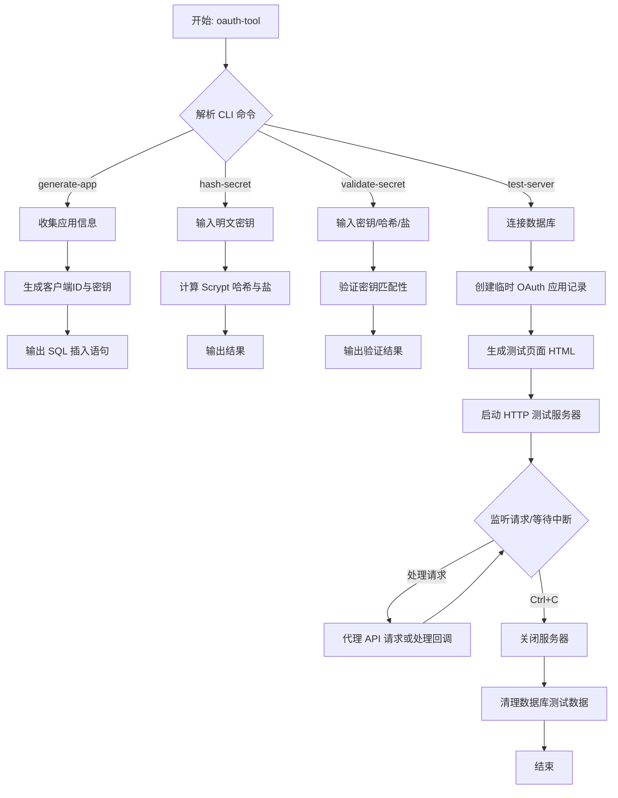

## 类结构

```
Global Scope
├── (No classes defined)
├── Variables
│   ├── keysmith
│   ├── AVAILABLE_SCOPES
│   ├── DEFAULT_GRANT_TYPES
│   ├── TEST_APP_NAME
│   ├── TEST_APP_DESCRIPTION
│   └── TEST_SERVER_PORT
└── Functions
    ├── generate_client_id
    ├── generate_client_secret
    ├── hash_secret
    ├── validate_secret
    ├── generate_app_credentials
    ├── format_sql_insert
    ├── cli
    ├── prompt_for_name
    ├── prompt_for_description
    ├── prompt_for_redirect_uris
    ├── prompt_for_scopes
    ├── prompt_for_grant_types
    ├── generate_app
    ├── hash_secret_command
    ├── validate_secret_command
    ├── generate_pkce
    ├── create_test_html
    ├── create_test_app_in_db
    ├── cleanup_test_app
    ├── run_test_server
    ├── setup_and_cleanup_test_app
    └── test_server_command
```

## 全局变量及字段


### `keysmith`
    
An instance used for generating, hashing, and verifying API keys and client secrets.

类型：`APIKeySmith`
    


### `AVAILABLE_SCOPES`
    
A list containing the valid OAuth permission scope names (e.g., EXECUTE_GRAPH, READ_GRAPH).

类型：`list[str]`
    


### `DEFAULT_GRANT_TYPES`
    
The default list of OAuth grant types used if none are specified (authorization_code and refresh_token).

类型：`list[str]`
    


### `TEST_APP_NAME`
    
The default name assigned to the temporary OAuth application created during testing.

类型：`str`
    


### `TEST_APP_DESCRIPTION`
    
The default description assigned to the temporary OAuth application created during testing.

类型：`str`
    


### `TEST_SERVER_PORT`
    
The default port number on which the local HTTP test server listens.

类型：`int`
    


    

## 全局函数及方法


### `generate_client_id`

该函数用于生成唯一的 OAuth 应用程序客户端 ID，通过组合固定前缀和加密随机的 URL 安全字符串来实现。

参数：

-   `无`：`-`，该函数不接受任何参数。

返回值：`str`，返回格式为 "agpt_client_" 开头，后跟 16 字节随机数据的 URL 安全 base64 编码字符串。

#### 流程图

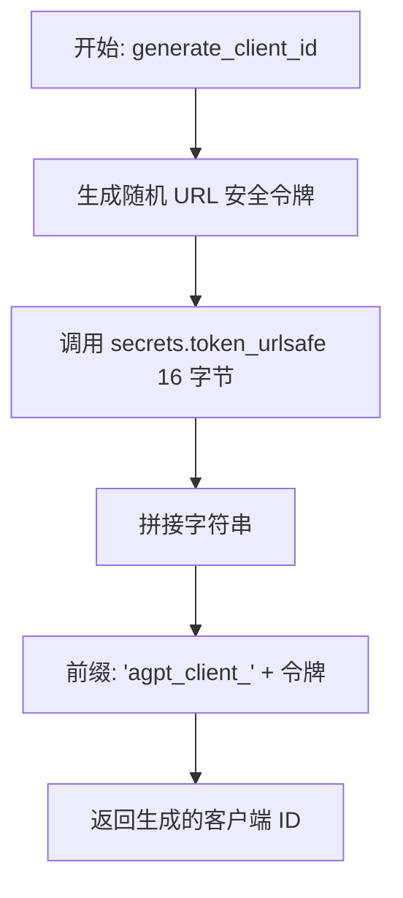

#### 带注释源码

```python
def generate_client_id() -> str:
    """Generate a unique client ID"""
    # 生成一个包含 16 字节随机数据的 URL 安全文本字符串
    # 使用 secrets 模块确保密码学上的安全性，避免碰撞
    # 将生成的随机令牌与前缀 "agpt_client_" 组合，形成最终的客户端 ID
    return f"agpt_client_{secrets.token_urlsafe(16)}"
```


### `generate_client_secret`

生成OAuth客户端密钥，包括明文、哈希值和盐值，采用Scrypt算法确保安全性。

参数：

-   无

返回值：`tuple[str, str, str]`，包含三个元素的元组，分别是明文密钥、哈希后的密钥和用于哈希的盐值。

#### 流程图

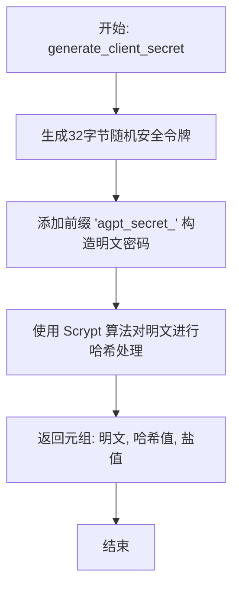

#### 带注释源码

```python
def generate_client_secret() -> tuple[str, str, str]:
    """
    Generate a client secret with its hash and salt.
    Returns (plaintext_secret, hashed_secret, salt)
    """
    # 生成一个安全的随机令牌（32字节 = 256位熵）
    # 并添加前缀 'agpt_secret_' 以形成最终的明文密钥
    plaintext = f"agpt_secret_{secrets.token_urlsafe(32)}"

    # 使用 Scrypt 算法（与 API 密钥相同的方式）对明文进行哈希
    # keysmith 是 APIKeySmith 的实例
    hashed, salt = keysmith.hash_key(plaintext)

    # 返回明文密钥、哈希值和盐值
    return plaintext, hashed, salt
```


### `hash_secret`

使用 Scrypt 算法对明文密钥进行哈希处理，返回哈希值和盐值。

参数：

-  `plaintext`：`str`，需要进行哈希处理的明文密钥字符串。

返回值：`tuple[str, str]`，包含哈希后的密钥（hash）和盐值（salt）的元组。

#### 流程图

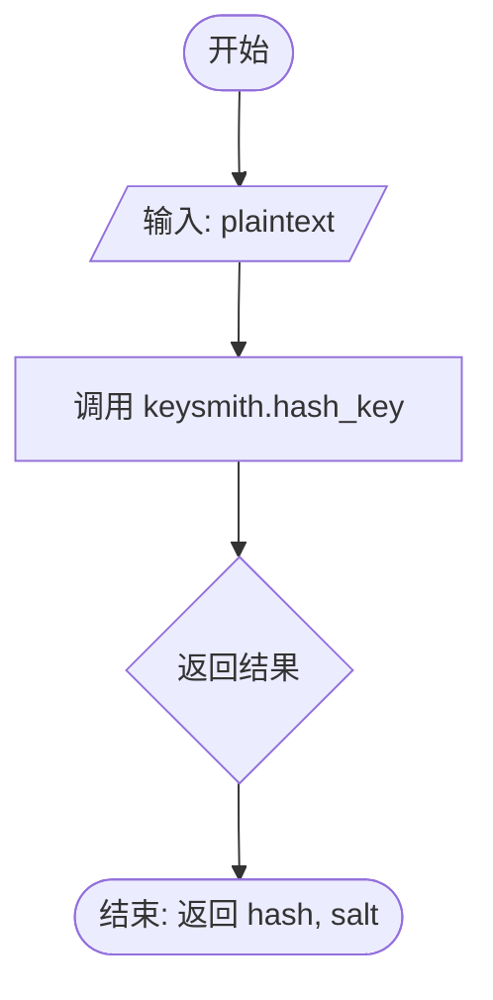

#### 带注释源码

```python
def hash_secret(plaintext: str) -> tuple[str, str]:
    """Hash a plaintext secret using Scrypt. Returns (hash, salt)"""
    # 使用全局 keysmith 实例调用 hash_key 方法对明文进行哈希
    return keysmith.hash_key(plaintext)
```


### `validate_secret`

验证明文密钥是否与存储的哈希值及盐值匹配。该函数是一个包装器，委托给 `keysmith.verify_key` 执行实际的 Scrypt 密钥验证逻辑。

参数：

-   `plaintext`：`str`，待验证的明文密钥。
-   `hash_value`：`str`，存储的哈希值。
-   `salt`：`str`，生成哈希值时使用的盐值。

返回值：`bool`，如果明文密钥验证通过返回 `True`，否则返回 `False`。

#### 流程图

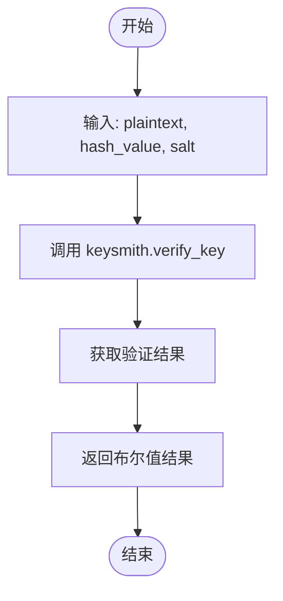

#### 带注释源码

```python
def validate_secret(plaintext: str, hash_value: str, salt: str) -> bool:
    """验证明文密钥是否与存储的哈希值和盐值匹配"""
    # 使用 keysmith 实例的 verify_key 方法进行验证
    # 该方法内部处理了 Scrypt 算法的比对逻辑
    return keysmith.verify_key(plaintext, hash_value, salt)
```


### `generate_app_credentials`

为 OAuth 应用程序生成完整的凭据集合，包括客户端 ID、加密后的密钥、盐值以及应用元数据。该函数负责验证输入的作用域，生成必要的唯一标识符和安全凭证，并将其封装为字典返回。

参数：

-  `name`：`str`，OAuth 应用程序的名称。
-  `redirect_uris`：`list[str]`，授权回调后允许的 URI 列表。
-  `scopes`：`list[str]`，应用程序请求的权限范围列表（字符串形式）。
-  `description`：`str | None`，应用程序的描述信息（可选）。
-  `grant_types`：`list[str] | None`，应用程序允许的授权类型列表（可选，默认为 ["authorization_code", "refresh_token"]）。

返回值：`dict`，包含应用程序 ID、名称、描述、客户端 ID、明文密钥、哈希密钥、盐值、重定向 URI、授权类型和验证后的作用域等信息的字典。

#### 流程图

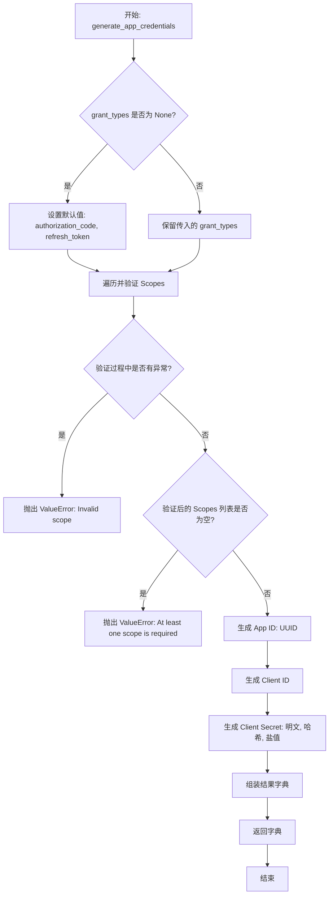

#### 带注释源码

```python
def generate_app_credentials(
    name: str,
    redirect_uris: list[str],
    scopes: list[str],
    description: str | None = None,
    grant_types: list[str] | None = None,
) -> dict:
    """
    Generate complete credentials for an OAuth application.

    Returns dict with:
    - id: UUID for the application
    - name: Application name
    - description: Application description
    - client_id: Client identifier (plaintext)
    - client_secret_plaintext: Client secret (SENSITIVE - show only once)
    - client_secret_hash: Hashed client secret (for database)
    - redirect_uris: List of allowed redirect URIs
    - grant_types: List of allowed grant types
    - scopes: List of allowed scopes
    """
    # 如果未指定授权类型，则使用默认的授权码模式和刷新令牌模式
    if grant_types is None:
        grant_types = ["authorization_code", "refresh_token"]

    # 验证作用域
    try:
        # 去除空白并尝试将字符串转换为 APIKeyPermission 枚举类型
        validated_scopes = [APIKeyPermission(s.strip()) for s in scopes if s.strip()]
    except ValueError as e:
        raise ValueError(f"Invalid scope: {e}")

    # 确保至少配置了一个权限范围
    if not validated_scopes:
        raise ValueError("At least one scope is required")

    # 生成核心凭据
    app_id = str(uuid.uuid4())  # 生成应用唯一标识符
    client_id = generate_client_id()  # 生成客户端 ID
    client_secret_plaintext, client_secret_hash, client_secret_salt = (
        generate_client_secret()  # 生成客户端密钥（明文、哈希、盐值）
    )

    # 返回包含所有凭据信息的字典
    return {
        "id": app_id,
        "name": name,
        "description": description,
        "client_id": client_id,
        "client_secret_plaintext": client_secret_plaintext,
        "client_secret_hash": client_secret_hash,
        "client_secret_salt": client_secret_salt,
        "redirect_uris": redirect_uris,
        "grant_types": grant_types,
        "scopes": [s.value for s in validated_scopes],  # 将枚举转换回字符串值
    }
```


### `format_sql_insert`

该函数负责将生成的 OAuth 应用程序凭证字典格式化为一个完整的 SQL `INSERT` 语句，以便于手动在数据库中创建记录。它处理 PostgreSQL 特定的数组语法，并包含包含敏感信息警告和验证查询的注释。

参数：

-  `creds`：`dict`，包含应用程序详细信息的字典。键值应包括 `id`、`name`、`description`（可选）、`client_id`、`client_secret_hash`、`client_secret_salt`、`redirect_uris`（列表）、`grant_types`（列表）和 `scopes`（列表）。

返回值：`str`，格式化好的 SQL `INSERT` 语句字符串，包含头部注释、插入语句和安全提示。

#### 流程图

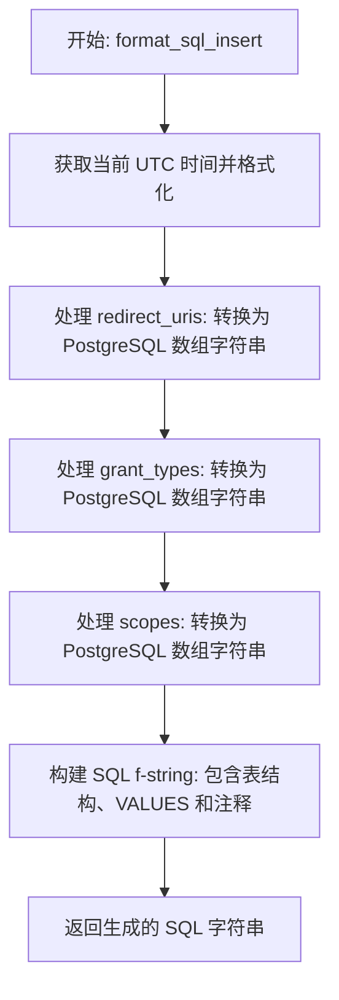

#### 带注释源码

```python
def format_sql_insert(creds: dict) -> str:
    """
    Format credentials as a SQL INSERT statement.

    The statement includes placeholders that must be replaced:
    - YOUR_USER_ID_HERE: Replace with the owner's user ID
    """
    # 获取当前 UTC 时间并格式化为 ISO 字符串，用于注释
    now_iso = datetime.utcnow().isoformat()

    # 将 redirect_uris 列表格式化为 PostgreSQL 数组格式
    # 例如: {"https://example.com", "http://localhost:3000"}
    redirect_uris_pg = (
        "{" + ",".join(f'"{uri}"' for uri in creds["redirect_uris"]) + "}"
    )
    
    # 将 grant_types 列表格式化为 PostgreSQL 数组格式
    # 例如: {"authorization_code","refresh_token"}
    grant_types_pg = "{" + ",".join(f'"{gt}"' for gt in creds["grant_types"]) + "}"
    
    # 将 scopes 列表格式化为 PostgreSQL 数组格式 (枚举类型通常不需要引号，取决于具体 DB 配置，此处无引号)
    scopes_pg = "{" + ",".join(creds["scopes"]) + "}"

    # 使用 f-string 构建完整的 SQL 语句
    sql = f"""
-- ============================================================
-- OAuth Application: {creds['name']}
-- Generated: {now_iso} UTC
-- ============================================================

INSERT INTO "OAuthApplication" (
  id,
  "createdAt",
  "updatedAt",
  name,
  description,
  "clientId",
  "clientSecret",
  "clientSecretSalt",
  "redirectUris",
  "grantTypes",
  scopes,
  "ownerId",
  "isActive"
)
VALUES (
  '{creds['id']}',
  NOW(),
  NOW(),
  '{creds['name']}',
  {f"'{creds['description']}'" if creds['description'] else 'NULL'},  -- 处理可选的 description
  '{creds['client_id']}',
  '{creds['client_secret_hash']}',          -- 存储哈希后的密钥
  '{creds['client_secret_salt']}',          -- 存储盐值
  ARRAY{redirect_uris_pg}::TEXT[],          -- 转换为 TEXT 数组
  ARRAY{grant_types_pg}::TEXT[],            -- 转换为 TEXT 数组
  ARRAY{scopes_pg}::"APIKeyPermission"[],  -- 转换为特定枚举数组
  'YOUR_USER_ID_HERE',  -- ⚠️ REPLACE with actual owner user ID (占位符)
  true
);

-- ============================================================
-- ⚠️ IMPORTANT: Save these credentials securely!
-- ============================================================
--
-- Client ID:     {creds['client_id']}
-- Client Secret: {creds['client_secret_plaintext']}
--
-- ⚠️ The client secret is shown ONLY ONCE!
-- ⚠️ Store it securely and share only with the application developer.
-- ⚠️ Never commit it to version control.
--
-- The client secret has been hashed in the database using Scrypt.
-- The plaintext secret above is needed by the application to authenticate.
-- ============================================================

-- To verify the application was created:
-- SELECT "clientId", name, scopes, "redirectUris", "isActive"
-- FROM "OAuthApplication"
-- WHERE "clientId" = '{creds['client_id']}';
"""
    return sql
```


### `cli`

OAuth Application Credential Generator. Generates client IDs, client secrets, and SQL INSERT statements for OAuth applications. Does NOT directly insert into the database - outputs SQL for manual execution.

参数：

*   无

返回值：`None`，无返回值

#### 流程图

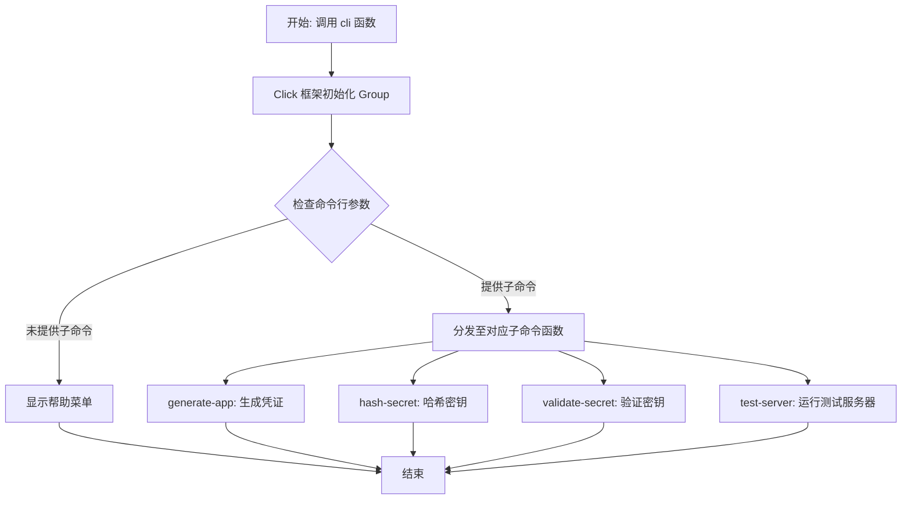

#### 带注释源码

```python
@click.group()
def cli():
    """OAuth Application Credential Generator

    Generates client IDs, client secrets, and SQL INSERT statements for OAuth applications.
    Does NOT directly insert into the database - outputs SQL for manual execution.
    """
    # 使用 pass 语句，因为 @click.group() 装饰器处理了所有逻辑
    # 该函数作为命令组的入口点，Click 会自动将后续使用 @cli.command() 装饰的函数注册为子命令
    pass
```


### `prompt_for_name`

通过命令行界面交互式地询问用户输入应用程序名称。

参数：

无参数。

返回值：`str`，用户输入的应用程序名称字符串。

#### 流程图

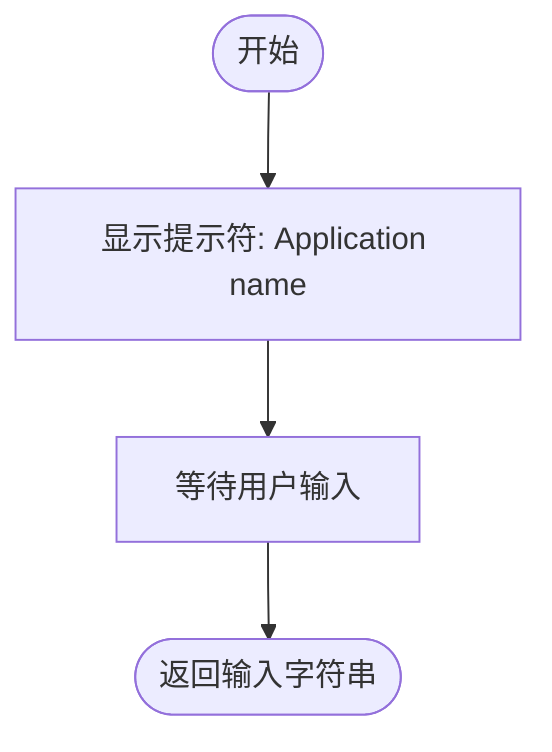

#### 带注释源码

```python
def prompt_for_name() -> str:
    """Prompt for application name"""
    # 调用 click 库的 prompt 方法在终端显示提示信息
    # "Application name" 是向用户展示的提示文本
    # type=str 指定接收的输入类型为字符串
    return click.prompt("Application name", type=str)
```


### `prompt_for_description`

该函数通过命令行交互式地提示用户输入 OAuth 应用程序的描述信息。用户可以选择输入具体内容或直接按回车键跳过。

参数：

-  无

返回值：`str | None`，返回用户输入的描述字符串，如果用户未输入（直接回车），则返回 `None`。

#### 流程图

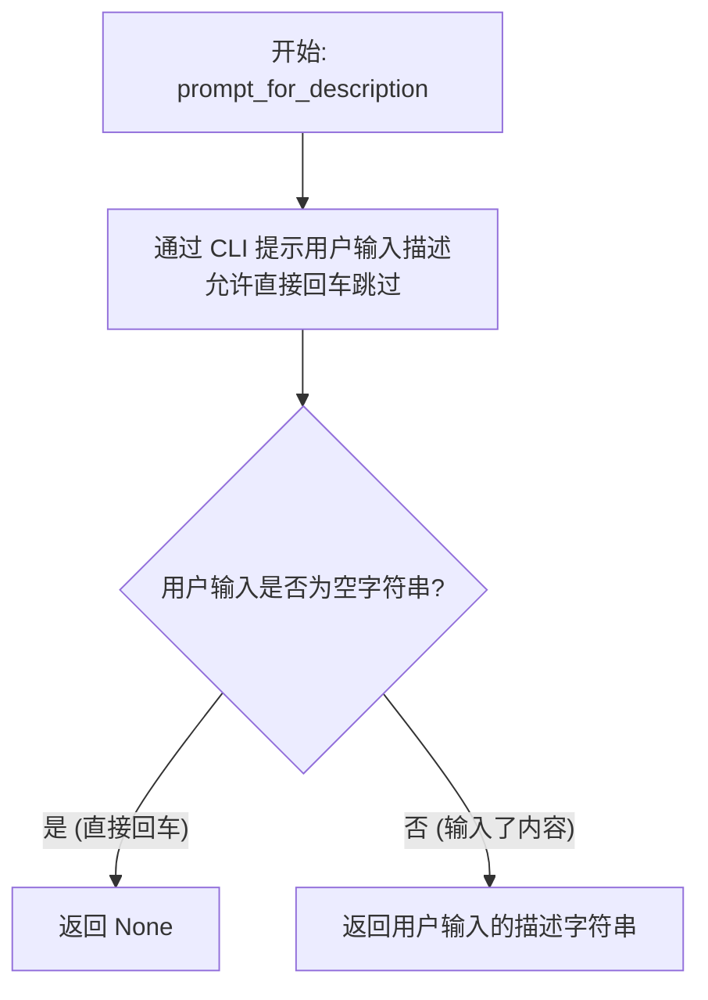

#### 带注释源码

```python
def prompt_for_description() -> str | None:
    """Prompt for application description"""
    # 使用 click 库在命令行提示用户输入
    # type=str: 指定输入类型为字符串
    # default="": 设置默认值为空字符串，这意味着用户按回车等同于输入空字符串
    # show_default=False: 不在提示符中显示默认值，使界面更简洁
    description = click.prompt(
        "Application description (optional, press Enter to skip)",
        type=str,
        default="",
        show_default=False,
    )
    # 如果描述内容不为空，返回该字符串；否则返回 None
    return description if description else None
```


### `prompt_for_redirect_uris`

通过命令行交互式提示用户逐行输入重定向 URI，直到用户输入空行结束。确保至少输入一个有效的 URI。

参数：

无

返回值：`list[str]`，包含用户输入并经过处理的重定向 URI 字符串列表。

#### 流程图

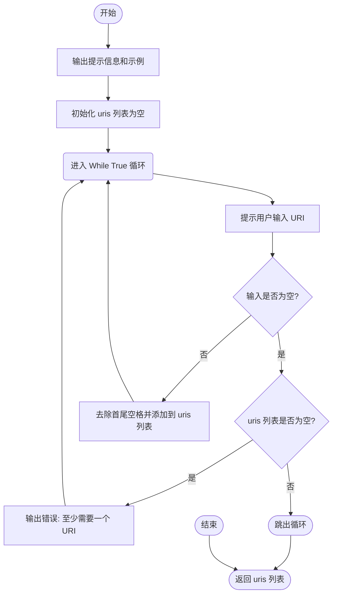

#### 带注释源码

```python
def prompt_for_redirect_uris() -> list[str]:
    """Prompt for redirect URIs interactively"""
    # 打印提示信息，告知用户输入格式（每行一个）并提供示例
    click.echo("\nRedirect URIs (enter one per line, empty line to finish):")
    click.echo("  Example: https://app.example.com/callback")
    
    uris = []
    while True:
        # 循环提示用户输入 URI，默认为空字符串（允许直接回车）
        uri = click.prompt("  URI", type=str, default="", show_default=False)
        
        # 如果输入为空（用户直接回车）
        if not uri:
            # 检查当前列表是否为空，如果是则报错并强制继续输入
            if not uris:
                click.echo("  At least one redirect URI is required.")
                continue
            # 如果列表不为空，说明用户已完成输入，跳出循环
            break
        
        # 去除输入字符串的首尾空格后添加到列表中
        uris.append(uri.strip())
    
    # 返回收集到的 URI 列表
    return uris
```


### `prompt_for_scopes`

该函数通过交互式命令行菜单，提示用户选择 OAuth 应用所需的权限范围。用户可以输入对应的数字或直接输入权限名称，支持多选（逗号分隔）。函数会持续循环直到获取到有效的输入列表。

参数：

*   无

返回值：`list[str]`，包含用户所选有效权限范围名称的列表（大写格式）。

#### 流程图

```mermaid
flowchart TD
    A[开始: prompt_for_scopes] --> B[显示可用作用域列表 AVAILABLE_SCOPES]
    B --> C[显示输入提示与示例]
    C --> D[初始化 while True 循环]
    D --> E[提示用户输入 Selection]
    E --> F[初始化 scopes 列表为空]
    F --> G[遍历 selection 按逗号分割的 items]
    
    G --> H{Item 是否为空?}
    H -- 是 --> G
    H -- 否 --> I{Item 是否为纯数字?}
    
    I -- 是 --> J[转换为索引 idx]
    J --> K{idx 是否在有效范围内?}
    K -- 是 --> L[将 AVAILABLE_SCOPES[idx] 添加到 scopes]
    L --> G
    K -- 否 --> M[输出错误: 无效数字]
    M --> N[清空 scopes 列表]
    N --> O[跳出 for 循环]
    
    I -- 否 --> P{Item 转大写后是否在 AVAILABLE_SCOPES 中?}
    P -- 是 --> Q[将 item.upper() 添加到 scopes]
    Q --> G
    P -- 否 --> R[输出错误: 无效作用域名称]
    R --> N
    
    O --> S{scopes 列表是否非空?}
    S -- 否 (遇到错误或无数据) --> T[输出: 请输入有效数字或名称]
    T --> E
    
    S -- 是 --> U[返回 scopes 列表]
```

#### 带注释源码

```python
def prompt_for_scopes() -> list[str]:
    """Prompt for scopes interactively with a menu"""
    # 1. 打印可用的作用域列表，带编号
    click.echo("\nAvailable scopes:")
    for i, scope in enumerate(AVAILABLE_SCOPES, 1):
        click.echo(f"  {i}. {scope}")

    # 2. 提示用户输入方式（数字或名称）
    click.echo(
        "\nSelect scopes by number (comma-separated) or enter scope names directly:"
    )
    click.echo("  Example: 1,2 or EXECUTE_GRAPH,READ_GRAPH")

    # 3. 循环直到获取有效的输入
    while True:
        # 4. 获取用户输入的字符串
        selection = click.prompt("Scopes", type=str)
        scopes = []

        # 5. 处理逗号分隔的输入
        for item in selection.split(","):
            item = item.strip()
            if not item:
                continue

            # 6. 判断输入是否为数字（菜单选项索引）
            if item.isdigit():
                idx = int(item) - 1
                # 检查索引是否在范围内
                if 0 <= idx < len(AVAILABLE_SCOPES):
                    scopes.append(AVAILABLE_SCOPES[idx])
                else:
                    # 数字越界，报错并重置当前输入
                    click.echo(f"  Invalid number: {item}")
                    scopes = []
                    break  # 跳出 for 循环，重新进入 while 循环
            
            # 7. 判断输入是否为有效的作用域名称（不区分大小写）
            elif item.upper() in AVAILABLE_SCOPES:
                scopes.append(item.upper())
            
            # 8. 既不是有效数字也不是有效名称
            else:
                click.echo(f"  Invalid scope: {item}")
                scopes = []
                break  # 跳出 for 循环，重新进入 while 循环

        # 9. 如果 scopes 列表不为空，说明所有输入项均有效，返回结果
        if scopes:
            return scopes
        
        # 10. 否则提示错误，继续 while 循环
        click.echo("  Please enter valid scope numbers or names.")
```


### `prompt_for_grant_types`

该函数用于在命令行交互式界面中提示用户输入 OAuth 授权类型（Grant Types）。如果用户直接按回车键（未提供输入），则返回 None 以便后续逻辑使用默认值；如果用户输入了内容，则解析逗号分隔的字符串并返回授权类型列表。

参数：

（无）

返回值：`list[str] | None`，如果用户未输入，返回 `None` 表示使用默认配置；否则返回处理后的授权类型字符串列表。

#### 流程图

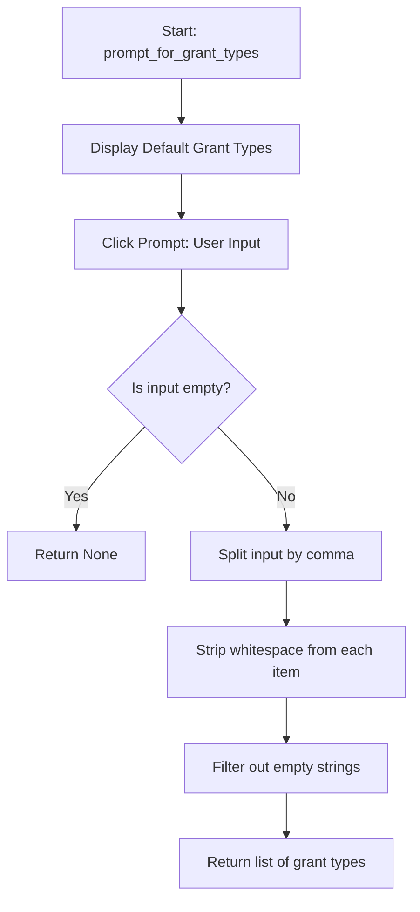

#### 带注释源码

```python
def prompt_for_grant_types() -> list[str] | None:
    """Prompt for grant types interactively"""
    # 显示默认的授权类型，提示用户有哪些默认选项
    click.echo(f"\nGrant types (default: {', '.join(DEFAULT_GRANT_TYPES)})")
    
    # 使用 click 库提示用户输入
    # default="" 表示如果用户直接回车，变量值为空字符串
    # show_default=False 不在提示符中显示默认值，保持界面简洁
    grant_types_input = click.prompt(
        "Grant types (comma-separated, press Enter for default)",
        type=str,
        default="",
        show_default=False,
    )

    # 如果用户输入为空（直接回车），返回 None
    # 调用方通常会检查 None 并回退到 DEFAULT_GRANT_TYPES
    if not grant_types_input:
        return None  # Use default

    # 解析用户输入：
    # 1. split(",") 将字符串按逗号分割
    # 2. .strip() 去除每个元素两端的空白字符
    # 3. if gt.strip() 过滤掉空字符串（处理类似 ",," 或 ", " 的情况）
    return [gt.strip() for gt in grant_types_input.split(",") if gt.strip()]
```


### `generate_app`

生成新的 OAuth 应用的凭据，包括 client ID、client secret 以及对应的 SQL INSERT 语句。如果未通过命令行参数提供必要信息，该命令会通过交互式提示引导用户输入，最终输出包含凭据的 SQL 脚本。

参数：

-   `name`: `str | None`, 应用名称（例如 'My Cool App'）。如果未提供，将通过交互式提示输入。
-   `description`: `str | None`, 应用描述。如果未提供，将通过交互式提示输入（可选）。
-   `redirect_uris`: `str | None`, 逗号分隔的重定向 URI 列表（例如 'https://app.example.com/callback,http://localhost:3000/callback'）。如果未提供，将以交互方式逐行输入。
-   `scopes`: `str | None`, 逗号分隔的权限范围列表（例如 'EXECUTE_GRAPH,READ_GRAPH'）。如果未提供，将通过交互式菜单选择。
-   `grant_types`: `str | None`, 逗号分隔的授权类型列表（默认为 'authorization_code,refresh_token'）。如果未提供，将使用默认值或通过交互方式输入。

返回值：`None`，该函数主要副作用是在标准输出流中打印格式化的 SQL 插入语句，不返回任何值。

#### 流程图

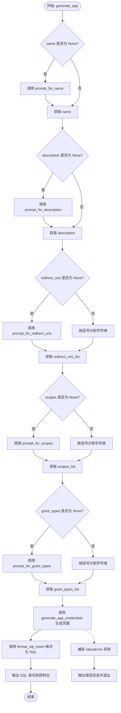

#### 带注释源码

```python
@cli.command(name="generate-app")
@click.option(
    "--name",
    default=None,
    help="Application name (e.g., 'My Cool App')",
)
@click.option(
    "--description",
    default=None,
    help="Application description",
)
@click.option(
    "--redirect-uris",
    default=None,
    help="Comma-separated list of redirect URIs (e.g., 'https://app.example.com/callback,http://localhost:3000/callback')",
)
@click.option(
    "--scopes",
    default=None,
    help="Comma-separated list of scopes (e.g., 'EXECUTE_GRAPH,READ_GRAPH')",
)
@click.option(
    "--grant-types",
    default=None,
    help="Comma-separated list of grant types (default: 'authorization_code,refresh_token')",
)
def generate_app(
    name: str | None,
    description: str | None,
    redirect_uris: str | None,
    scopes: str | None,
    grant_types: str | None,
):
    """Generate credentials for a new OAuth application

    All options are optional. If not provided, you will be prompted interactively.
    """
    # 交互式提示：如果未提供 name，则询问用户
    if name is None:
        name = prompt_for_name()

    # 交互式提示：如果未提供 description，则询问用户
    if description is None:
        description = prompt_for_description()

    # 处理 Redirect URIs
    if redirect_uris is None:
        # 如果未提供，进入多行交互输入模式
        redirect_uris_list = prompt_for_redirect_uris()
    else:
        # 如果已提供，按逗号分割字符串并去除空格
        redirect_uris_list = [uri.strip() for uri in redirect_uris.split(",")]

    # 处理 Scopes
    if scopes is None:
        # 如果未提供，进入交互式选择菜单
        scopes_list = prompt_for_scopes()
    else:
        # 如果已提供，按逗号分割字符串并去除空格
        scopes_list = [scope.strip() for scope in scopes.split(",")]

    # 处理 Grant Types
    if grant_types is None:
        # 如果未提供，进入交互式提示（可使用默认值）
        grant_types_list = prompt_for_grant_types()
    else:
        # 如果已提供，按逗号分割字符串并去除空格
        grant_types_list = [gt.strip() for gt in grant_types.split(",")]

    try:
        # 调用核心逻辑生成凭据字典
        creds = generate_app_credentials(
            name=name,
            description=description,
            redirect_uris=redirect_uris_list,
            scopes=scopes_list,
            grant_types=grant_types_list,
        )

        # 将凭据格式化为 SQL INSERT 语句
        sql = format_sql_insert(creds)
        # 输出 SQL 到控制台
        click.echo(sql)

    except ValueError as e:
        # 捕获并处理生成过程中的验证错误（如无效的 Scope）
        click.echo(f"Error: {e}", err=True)
        sys.exit(1)
```


### `hash_secret_command`

该函数是一个 CLI 命令，用于接收明文密钥，通过 Scrypt 算法对其进行哈希处理，并将生成的哈希值和盐值输出到控制台。

参数：

- `secret`：`str`，需要被哈希处理的明文字符串密钥。

返回值：`None`，该函数没有返回值，而是直接将生成的哈希值和盐值打印到标准输出。

#### 流程图

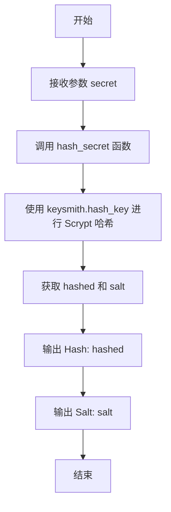

#### 带注释源码

```python
@click.argument("secret")
def hash_secret_command(secret):
    """Hash a plaintext secret using Scrypt"""
    # 调用内部辅助函数 hash_secret，传入明文密钥
    # 该函数使用 Scrypt 算法生成哈希和对应的盐值
    hashed, salt = hash_secret(secret)
    
    # 将计算出的哈希值输出到控制台
    click.echo(f"Hash: {hashed}")
    
    # 将计算出的盐值输出到控制台
    click.echo(f"Salt: {salt}")
```


### `validate_secret_command`

该函数是一个命令行接口命令，用于验证给定的明文密钥是否与存储的哈希值和盐值匹配。

参数：

- `secret`：`str`，待验证的明文密钥。
- `hash`：`str`，存储的哈希值。
- `salt`：`str`，哈希过程中使用的盐值。

返回值：`None`，该函数不直接返回值，而是通过 `sys.exit()` 终止进程。成功时退出码为 0，失败时退出码为 1。

#### 流程图

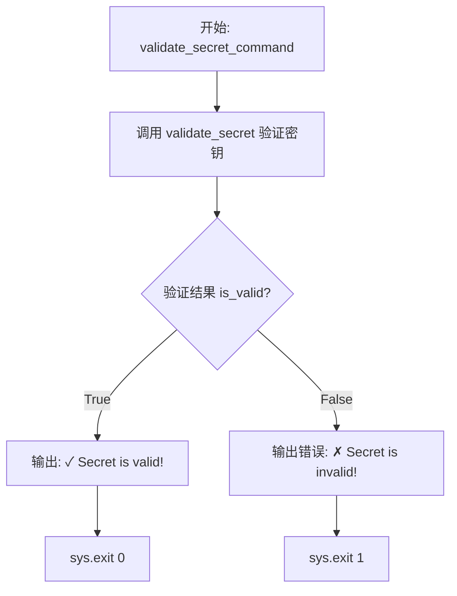

#### 带注释源码

```python
@cli.command(name="validate-secret")
@click.argument("secret")
@click.argument("hash")
@click.argument("salt")
def validate_secret_command(secret, hash, salt):
    """Validate a plaintext secret against a hash and salt"""
    # 调用 validate_secret 函数进行实际的密钥验证逻辑
    is_valid = validate_secret(secret, hash, salt)
    
    # 根据验证结果输出相应信息并退出
    if is_valid:
        # 验证成功，打印成功消息并以状态码 0 退出
        click.echo("✓ Secret is valid!")
        sys.exit(0)
    else:
        # 验证失败，打印错误消息到标准错误流并以状态码 1 退出
        click.echo("✗ Secret is invalid!", err=True)
        sys.exit(1)
```


### `generate_pkce`

生成用于 OAuth 2.0 PKCE（Proof Key for Code Exchange）流程的代码验证器（code_verifier）和代码挑战（code_challenge）。该方法使用 SHA-256 算法（S256 变体）从随机生成的验证器派生出挑战值，以增强授权码流程的安全性，防止授权码拦截攻击。

参数：

返回值：`tuple[str, str]`，包含 code_verifier（代码验证器）和 code_challenge（代码挑战）的元组。

#### 流程图

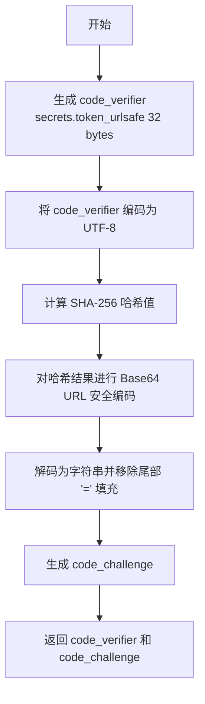

#### 带注释源码

```python
def generate_pkce() -> tuple[str, str]:
    """Generate PKCE code_verifier and code_challenge (S256)"""
    # 生成一个高强度的随机字符串作为 code_verifier (32字节转换为base64约43字符)
    code_verifier = secrets.token_urlsafe(32)
    
    # 计算 code_challenge：
    # 1. 将 code_verifier 编码为 bytes
    # 2. 计算 SHA-256 哈希摘要
    # 3. 将摘要进行 Base64 URL 安全编码
    # 4. 解码为字符串并移除末尾的填充字符 '='
    code_challenge = (
        base64.urlsafe_b64encode(hashlib.sha256(code_verifier.encode()).digest())
        .decode()
        .rstrip("=")
    )
    
    return code_verifier, code_challenge
```


### `create_test_html`

生成用于测试 OAuth 客户端的 HTML 页面。该函数将配置参数（如 URL 和凭证）注入到一个预定义的 HTML 模板中，该模板包含用于执行 OAuth 授权码流程（PKCE）和集成设置向导的前端样式和 JavaScript 逻辑。

参数：

- `platform_url`：`str`，AutoGPT 平台前端的基础 URL，用于构建授权端点。
- `client_id`：`str`，OAuth 客户端标识符。
- `client_secret`：`str`，OAuth 客户端密钥，用于在本地代理交换令牌。
- `redirect_uri`：`str`，OAuth 授权流程完成后的回调地址。
- `backend_url`：`str`，AutoGPT 平台后端 API 的基础 URL，用于代理令牌交换和 API 请求。

返回值：`str`，包含完整 HTML 代码的字符串，可直接写入文件或由 HTTP 服务器返回。

#### 流程图

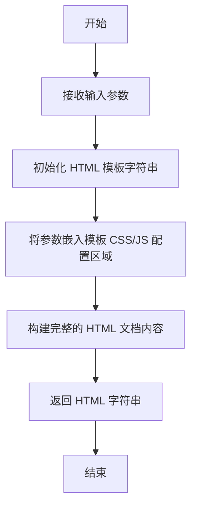

#### 带注释源码

```python
def create_test_html(
    platform_url: str,
    client_id: str,
    client_secret: str,
    redirect_uri: str,
    backend_url: str,
) -> str:
    """Generate HTML page for test OAuth client"""
    # 使用 f-string 将传入的配置参数动态注入到 HTML 模板中
    # 该 HTML 页面包含：
    # 1. 内部 CSS 样式，用于美化测试界面
    # 2. JavaScript 配置对象，存储从参数传入的 URL 和凭证
    # 3. JS 逻辑函数：startOAuthFlow, startIntegrationSetup, exchangeCodeForTokens 等
    # 4. 用于显示日志和测试结果的 UI 元素
    return f"""<!DOCTYPE html>
<html lang="en">
<head>
    <meta charset="UTF-8">
    <meta name="viewport" content="width=device-width, initial-scale=1.0">
    <title>OAuth Test Client</title>
    <!-- 此处省略了具体的 CSS 样式代码，用于定义卡片、按钮、日志显示区的样式 -->
    ...
</head>
<body>
    <!-- 界面主体：包含按钮触发 OAuth 流程和配置信息展示 -->
    ...
    <script>
        // 将 Python 传入的参数映射为前端 JS 的全局配置常量
        const config = {{
            platformUrl: "{platform_url}",
            backendUrl: "{backend_url}",
            clientId: "{client_id}",
            clientSecret: "{client_secret}", // 注意：在实际生产环境中不应在前端暴露密钥，此处仅为测试服务器环境
            redirectUri: "{redirect_uri}",
            scopes: ["EXECUTE_GRAPH", "READ_GRAPH", "READ_BLOCK"]
        }};

        // 此处省略了具体的 JS 逻辑代码，包括：
        // - generatePkce: 生成 PKCE 验证器和挑战码
        // - startOAuthFlow: 拼接授权 URL 并跳转
        // - startIntegrationSetup: 启动集成设置向导
        // - exchangeCodeForTokens: 通过本地代理向后端交换令牌
        // - testAccessToken: 测试获取到的访问令牌是否有效
        ...
    </script>
</body>
</html>
"""
```


### `create_test_app_in_db`

在数据库中创建一个临时的测试 OAuth 应用程序，生成必要的凭据（ID、密钥、哈希等）并将其持久化到数据库中，随后返回关键的应用信息。

参数：

-  `owner_id`：`str`，拥有该测试应用程序的用户 ID。
-  `redirect_uri`：`str`，OAuth 流程允许使用的重定向 URI。

返回值：`dict`，包含应用程序的 `id`、`client_id` 和明文 `client_secret` 的字典。

#### 流程图

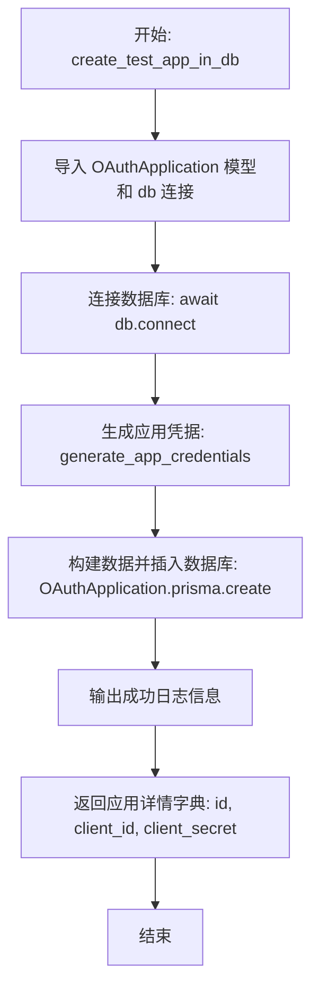

#### 带注释源码

```python
async def create_test_app_in_db(
    owner_id: str,
    redirect_uri: str,
) -> dict:
    """Create a temporary test OAuth application in the database"""
    from prisma.models import OAuthApplication

    from backend.data import db

    # 连接到数据库
    await db.connect()

    # 生成应用程序凭据
    # 使用预定义的测试名称、描述、重定向 URI 和所有可用的作用域
    creds = generate_app_credentials(
        name=TEST_APP_NAME,
        description=TEST_APP_DESCRIPTION,
        redirect_uris=[redirect_uri],
        scopes=AVAILABLE_SCOPES,  # All scopes for testing
    )

    # 将应用程序记录插入到数据库中
    # 注意：存储在数据库中的 clientSecret 是哈希后的值，而非明文
    app = await OAuthApplication.prisma().create(
        data={
            "id": creds["id"],
            "name": creds["name"],
            "description": creds["description"],
            "clientId": creds["client_id"],
            "clientSecret": creds["client_secret_hash"], # 存储哈希值
            "clientSecretSalt": creds["client_secret_salt"],
            "redirectUris": creds["redirect_uris"],
            "grantTypes": creds["grant_types"],
            "scopes": creds["scopes"],
            "ownerId": owner_id,
            "isActive": True,
        }
    )

    # 打印创建成功的提示信息
    click.echo(f"✓ Created test OAuth application: {app.clientId}")

    # 返回包含应用 ID、客户端 ID 和明文客户端密钥的字典
    # 注意：明文密钥仅在此时返回，之后应妥善保管
    return {
        "id": app.id,
        "client_id": app.clientId,
        "client_secret": creds["client_secret_plaintext"],
    }
```


### `cleanup_test_app`

Remove test application and all associated tokens from database.

参数：

-  `app_id`：`str`，要删除的 OAuth 应用程序的唯一标识符。

返回值：`None`，无返回值，该函数执行数据库删除操作并打印清理状态日志。

#### 流程图

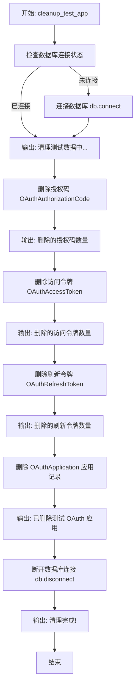

#### 带注释源码

```python
async def cleanup_test_app(app_id: str) -> None:
    """Remove test application and all associated tokens from database"""
    # 导入相关的 Prisma 模型和数据库连接管理
    from prisma.models import (
        OAuthAccessToken,
        OAuthApplication,
        OAuthAuthorizationCode,
        OAuthRefreshToken,
    )

    from backend.data import db

    # 检查数据库是否已连接，如果未连接则建立连接
    if not db.is_connected():
        await db.connect()

    click.echo("\n🧹 Cleaning up test data...")

    # 删除与该应用关联的所有授权码
    deleted_codes = await OAuthAuthorizationCode.prisma().delete_many(
        where={"applicationId": app_id}
    )
    if deleted_codes:
        click.echo(f"   Deleted {deleted_codes} authorization code(s)")

    # 删除与该应用关联的所有访问令牌
    deleted_access = await OAuthAccessToken.prisma().delete_many(
        where={"applicationId": app_id}
    )
    if deleted_access:
        click.echo(f"   Deleted {deleted_access} access token(s)")

    # 删除与该应用关联的所有刷新令牌
    deleted_refresh = await OAuthRefreshToken.prisma().delete_many(
        where={"applicationId": app_id}
    )
    if deleted_refresh:
        click.echo(f"   Deleted {deleted_refresh} refresh token(s)")

    # 最后删除 OAuth 应用程序记录本身
    await OAuthApplication.prisma().delete(where={"id": app_id})
    click.echo("   Deleted test OAuth application")

    # 断开数据库连接
    await db.disconnect()
    click.echo("✓ Cleanup complete!")
```


### `run_test_server`

启动一个简单的本地 HTTP 服务器，用于作为模拟的 OAuth 客户端端点。它提供一个交互式的 HTML 页面用于测试 OAuth 流程，并通过代理将 API 请求转发到后端 URL 以避免跨域资源共享 (CORS) 问题。该函数在守护线程中运行服务器，直到收到中断信号。

参数：

-  `port`：`int`，测试服务器运行的端口号。
-  `platform_url`：`str`，AutoGPT 平台前端的基础 URL。
-  `backend_url`：`str`，AutoGPT 平台后端 API 的基础 URL。
-  `client_id`：`str`，用于 OAuth 测试的客户端 ID。
-  `client_secret`：`str`，用于 OAuth 测试的客户端密钥。

返回值：`None`，该函数会阻塞运行直到服务器关闭，没有返回值。

#### 流程图

```mermaid
flowchart TD
    A[开始: run_test_server] --> B[生成重定向 URI redirect_uri]
    B --> C[调用 create_test_html 生成测试页面 HTML]
    C --> D[定义 TestHandler 类]
    D --> E[实现 do_GET: 处理页面展示和 API 代理]
    D --> F[实现 do_POST: 处理 Token 交换代理]
    E --> G[实例化 HTTPServer]
    F --> G
    G --> H[打印启动日志信息]
    H --> I[在守护线程中启动 server.serve_forever]
    I --> J[主线程循环: 检查线程存活状态]
    J --> K{检测到键盘中断?}
    K -- 否 --> J
    K -- 是 --> L[调用 server.shutdown]
    L --> M[打印停止信息]
    M --> N[结束]
```

#### 带注释源码

```python
def run_test_server(
    port: int,
    platform_url: str,
    backend_url: str,
    client_id: str,
    client_secret: str,
) -> None:
    """Run a simple HTTP server for testing OAuth flows"""
    import json as json_module
    import threading
    from http.server import BaseHTTPRequestHandler, HTTPServer
    from urllib.request import Request, urlopen

    # 根据传入的端口构建回调地址
    redirect_uri = f"http://localhost:{port}/callback"

    # 生成包含测试逻辑和样式的 HTML 页面内容
    html_content = create_test_html(
        platform_url=platform_url,
        client_id=client_id,
        client_secret=client_secret,
        redirect_uri=redirect_uri,
        backend_url=backend_url,
    )

    # 定义自定义的 HTTP 请求处理器
    class TestHandler(BaseHTTPRequestHandler):
        def do_GET(self):
            from urllib.parse import parse_qs

            # 解析请求路径
            parsed = urlparse(self.path)

            # 如果访问根路径或回调路径，返回生成的 HTML 测试页面
            if parsed.path in ["/", "/callback"]:
                self.send_response(200)
                self.send_header("Content-Type", "text/html; charset=utf-8")
                self.end_headers()
                self.wfile.write(html_content.encode())

            # 如果是 /proxy/ 开头的路径，代理请求到后端 API (解决 CORS 问题)
            elif parsed.path.startswith("/proxy/"):
                try:
                    # 提取 API 路径和查询参数中的 token
                    api_path = parsed.path[len("/proxy") :]
                    query_params = parse_qs(parsed.query)
                    token = query_params.get("token", [None])[0]

                    headers = {}
                    if token:
                        headers["Authorization"] = f"Bearer {token}"

                    # 构建转发给后端的请求
                    req = Request(
                        f"{backend_url}{api_path}",
                        headers=headers,
                        method="GET",
                    )

                    # 执行请求并将响应返回给客户端
                    with urlopen(req) as response:
                        response_body = response.read()
                        self.send_response(response.status)
                        self.send_header("Content-Type", "application/json")
                        self.end_headers()
                        self.wfile.write(response_body)

                except Exception as e:
                    # 处理代理过程中的异常
                    error_msg = str(e)
                    status_code = 500
                    if hasattr(e, "code"):
                        status_code = e.code  # type: ignore
                    if hasattr(e, "read"):
                        try:
                            error_body = e.read().decode()  # type: ignore
                            error_data = json_module.loads(error_body)
                            error_msg = error_data.get("detail", error_msg)
                        except Exception:
                            pass

                    self.send_response(status_code)
                    self.send_header("Content-Type", "application/json")
                    self.end_headers()
                    self.wfile.write(json_module.dumps({"detail": error_msg}).encode())

            else:
                # 404 处理
                self.send_response(404)
                self.end_headers()

        def do_POST(self):
            # 解析请求路径
            parsed = urlparse(self.path)

            # 代理 Token 交换请求到后端
            if parsed.path == "/proxy/token":
                try:
                    # 读取请求体
                    content_length = int(self.headers.get("Content-Length", 0))
                    body = self.rfile.read(content_length)

                    # 转发 POST 请求到后端的 /api/oauth/token
                    req = Request(
                        f"{backend_url}/api/oauth/token",
                        data=body,
                        headers={"Content-Type": "application/json"},
                        method="POST",
                    )

                    with urlopen(req) as response:
                        response_body = response.read()
                        self.send_response(response.status)
                        self.send_header("Content-Type", "application/json")
                        self.end_headers()
                        self.wfile.write(response_body)

                except Exception as e:
                    error_msg = str(e)
                    # 尝试从错误中提取详细信息
                    if hasattr(e, "read"):
                        try:
                            error_body = e.read().decode()  # type: ignore
                            error_data = json_module.loads(error_body)
                            error_msg = error_data.get("detail", error_msg)
                        except Exception:
                            pass

                    self.send_response(500)
                    self.send_header("Content-Type", "application/json")
                    self.end_headers()
                    self.wfile.write(json_module.dumps({"detail": error_msg}).encode())
            else:
                self.send_response(404)
                self.end_headers()

        def log_message(self, format, *args):
            # 抑制默认的 HTTP 日志输出，保持控制台整洁
            pass

    # 初始化 HTTP 服务器，绑定到 localhost 和指定端口
    server = HTTPServer(("localhost", port), TestHandler)
    click.echo(f"\n🚀 Test server running at http://localhost:{port}")
    click.echo("   Open this URL in your browser to test the OAuth flows\n")

    # 在守护线程中启动服务器，主线程退出时服务器会自动关闭
    server_thread = threading.Thread(target=server.serve_forever, daemon=True)
    server_thread.start()

    # 使用简单的轮询循环保持主线程运行，直到被中断
    try:
        while server_thread.is_alive():
            server_thread.join(timeout=1.0)
    except KeyboardInterrupt:
        pass

    click.echo("\n\n⏹️  Server stopped")
    server.shutdown()
```


### `setup_and_cleanup_test_app`

一个负责管理测试 OAuth 应用程序生命周期的异步函数。它作为编排器，在数据库中创建临时的测试应用，启动本地测试服务器以模拟客户端行为，并在服务器停止（无论是正常结束还是通过中断信号）后，确保删除数据库中的测试应用及其相关的授权令牌和代码，防止测试数据残留。

参数：

-   `owner_id`：`str`，拥有该临时测试 OAuth 应用程序的用户 ID。
-   `redirect_uri`：`str`，为测试应用程序配置的重定向 URI。
-   `port`：`int`，测试服务器运行的端口号。
-   `platform_url`：`str`，AutoGPT 平台前端的 URL，用于构建 OAuth 授权链接。
-   `backend_url`：`str`，AutoGPT 平台后端的 URL，用于在测试服务器中代理 API 请求。

返回值：`None`，无返回值。

#### 流程图

```mermaid
graph TD
    Start([开始]) --> InitVar[初始化 app_info 为 None]
    InitVar --> TryBlock[进入 Try 代码块]
    TryBlock --> LogCreate[输出日志: 正在创建临时 OAuth 应用]
    LogCreate --> CreateApp[调用 create_test_app_in_db 创建数据库记录]
    CreateApp --> StoreInfo[存储返回的应用信息到 app_info]
    StoreInfo --> LogCreds[输出日志: 显示 Client ID 和 Secret]
    LogCreds --> LogSeparator[输出提示信息: 按 Ctrl+C 停止]
    LogSeparator --> RunServer[调用 run_test_server 启动阻塞式服务器]
    
    RunServer -->|服务器运行结束或中断| FinallyBlock[进入 Finally 代码块]
    FinallyBlock --> CheckInfo{app_info 是否存在?}
    CheckInfo -->|否| End([结束])
    CheckInfo -->|是| TryCleanup[尝试执行清理逻辑]
    TryCleanup --> CleanupFunc[调用 cleanup_test_app 删除数据]
    CleanupFunc --> CatchError[捕获可能的异常]
    CatchError --> LogError[输出清理错误日志及手动删除提示]
    LogError --> End
```

#### 带注释源码

```python
async def setup_and_cleanup_test_app(
    owner_id: str,
    redirect_uri: str,
    port: int,
    platform_url: str,
    backend_url: str,
) -> None:
    """
    Async context manager that handles test app lifecycle.
    Creates the app, yields control to run the server, then cleans up.
    """
    # 初始化变量，用于存储创建的应用信息，以便后续清理使用
    app_info: Optional[dict] = None

    try:
        # 阶段 1: 创建测试应用
        # 在数据库中创建一个临时的 OAuth 应用记录
        click.echo("\n📝 Creating temporary OAuth application...")
        app_info = await create_test_app_in_db(owner_id, redirect_uri)

        # 向用户展示生成的凭证信息，方便进行测试
        click.echo(f"\n  Client ID:     {app_info['client_id']}")
        click.echo(f"  Client Secret: {app_info['client_secret'][:30]}...")

        # 阶段 2: 运行测试服务器
        # 打印用户操作提示
        click.echo("\n" + "-" * 60)
        click.echo("  Press Ctrl+C to stop the server and clean up")
        click.echo("-" * 60)

        # 调用同步函数运行 HTTP 服务器
        # 注意：这是一个阻塞调用，会挂起当前异步函数的执行，直到服务器停止
        run_test_server(
            port=port,
            platform_url=platform_url,
            backend_url=backend_url,
            client_id=app_info["client_id"],
            client_secret=app_info["client_secret"],
        )

    finally:
        # 阶段 3: 资源清理
        # 无论服务器是正常关闭还是因异常中断，都会执行此块代码
        if app_info:
            try:
                # 调用清理函数，从数据库中删除测试应用、Token 和授权码
                await cleanup_test_app(app_info["id"])
            except Exception as e:
                # 如果清理过程中发生错误，记录错误并提示用户手动处理，避免程序崩溃
                click.echo(f"\n⚠️  Cleanup error: {e}", err=True)
                click.echo(
                    f"   You may need to manually delete app with ID: {app_info['id']}"
                )
```


### `test_server_command`

该方法是 `test-server` CLI 命令的入口函数，负责协调测试服务器的生命周期。它会构建必要的配置信息（如重定向 URI），打印连接详情，并启动异步任务以创建测试应用、运行服务器并在退出时清理数据。

参数：

-   `owner_id`：`str`，拥有临时测试 OAuth 应用程序的用户 ID（必填）。
-   `port`：`int`，运行测试服务器的端口号（默认为 9876）。
-   `platform_url`：`str`，AutoGPT 平台前端 URL（默认为 http://localhost:3000）。
-   `backend_url`：`str`，AutoGPT 平台后端 URL（默认为 http://localhost:8006）。

返回值：`None`，该函数主要用于执行流程和输出日志，不返回具体数值。

#### 流程图

```mermaid
graph TD
    Start([Start]) --> ConstructURI[Construct redirect_uri]
    ConstructURI --> PrintHeader[Print Header Info]
    PrintHeader --> TryBlock[Try Block]
    TryBlock --> RunAsync[Run asyncio.run setup_and_cleanup_test_app]
    RunAsync --> CheckInterrupt{KeyboardInterrupt?}
    CheckInterrupt -- Yes --> HandleInterrupt[Pass / Exit Cleanly]
    CheckInterrupt -- No --> End([End])
    RunAsync -- Exception --> CatchException[Catch Exception]
    CatchException --> PrintError[Print Error Message]
    PrintError --> SysExit[Exit with Code 1]
```

#### 带注释源码

```python
@cli.command(name="test-server")
@click.option(
    "--owner-id",
    required=True,
    help="User ID to own the temporary test OAuth application",
)
@click.option(
    "--port",
    default=TEST_SERVER_PORT,
    help=f"Port to run the test server on (default: {TEST_SERVER_PORT})",
)
@click.option(
    "--platform-url",
    default="http://localhost:3000",
    help="AutoGPT Platform frontend URL (default: http://localhost:3000)",
)
@click.option(
    "--backend-url",
    default="http://localhost:8006",
    help="AutoGPT Platform backend URL (default: http://localhost:8006)",
)
def test_server_command(
    owner_id: str,
    port: int,
    platform_url: str,
    backend_url: str,
):
    """Run a test server to test OAuth flows interactively

    This command:
    1. Creates a temporary OAuth application in the database
    2. Starts a minimal web server that acts as a third-party client
    3. Lets you test "Sign in with AutoGPT" and Integration Setup flows
    4. Cleans up all test data (app, tokens, codes) when you stop the server

    Example:
        poetry run oauth-tool test-server --owner-id YOUR_USER_ID

    The test server will be available at http://localhost:9876
    """
    # 根据指定端口构建回调 URI
    redirect_uri = f"http://localhost:{port}/callback"

    # 打印配置信息头部，方便用户确认环境
    click.echo("=" * 60)
    click.echo("  OAuth Test Server")
    click.echo("=" * 60)
    click.echo(f"\n  Owner ID:     {owner_id}")
    click.echo(f"  Platform URL: {platform_url}")
    click.echo(f"  Backend URL:  {backend_url}")
    click.echo(f"  Test Server:  http://localhost:{port}")
    click.echo(f"  Redirect URI: {redirect_uri}")
    click.echo("\n" + "=" * 60)

    try:
        # 运行异步函数 setup_and_cleanup_test_app
        # 该函数负责：创建测试应用 -> 运行服务器 -> 清理应用
        # 使用 asyncio.run 启动事件循环以保持 Prisma 客户端正常工作
        asyncio.run(
            setup_and_cleanup_test_app(
                owner_id=owner_id,
                redirect_uri=redirect_uri,
                port=port,
                platform_url=platform_url,
                backend_url=backend_url,
            )
        )
    except KeyboardInterrupt:
        # 捕获键盘中断信号（Ctrl+C），由于内部逻辑已处理清理，此处仅优雅退出
        pass
    except Exception as e:
        # 捕获其他异常并打印错误信息，最后以错误码退出
        click.echo(f"\n❌ Error: {e}", err=True)
        sys.exit(1)
```


## 关键组件


### Credential Generation & Cryptography

负责生成安全的 OAuth 客户端 ID 和密钥，封装了 Scrypt 哈希算法（通过 `APIKeySmith`）用于密钥的安全存储与验证，以及处理随机令牌的生成。

### SQL Statement Formatter

将生成的应用程序凭证数据结构转换为标准化的 PostgreSQL `INSERT` SQL 语句，处理数组类型（如 redirect_uris, scopes）的格式化，并包含必要的注释和占位符。

### Interactive CLI Interface

基于 Click 框架构建的命令行交互层，负责解析命令行参数，处理交互式输入（如名称、范围选择），并协调凭证生成、哈希计算及 SQL 输出的业务逻辑。

### PKCE Utility

专门用于生成 PKCE（Proof Key for Code Exchange）流程所需的 `code_verifier` 和 `code_challenge`（S256 方法），以增强 OAuth 授权码模式的安全性，主要服务于测试环境。

### OAuth Test Server

一个本地运行的 HTTP 服务器，提供内置的 HTML/JS 测试客户端，模拟第三方应用发起 OAuth 请求。它处理回调、代理后端 API 请求（解决 CORS 问题），并可视化展示令牌获取过程。

### Test Data Lifecycle Manager

管理测试用例的数据库生命周期，负责在测试开始时在数据库中创建临时的 OAuth 应用程序记录，并在测试结束后自动清理相关的授权码、访问令牌、刷新令牌及应用本身，确保环境整洁。

### Scope & Grant Type Validator

负责验证用户提供的 OAuth Scopes 和 Grant Types 是否在预定义的允许列表（`AVAILABLE_SCOPES`）中，确保生成的凭证符合系统的安全策略和枚举定义。


## 问题及建议


### 已知问题

-   **SQL 注入风险**: `format_sql_insert` 函数使用 Python f-string 直接拼接 SQL 语句，未对用户提供的 `name` 和 `description` 进行 SQL 特殊字符（如单引号）转义。这会导致生成的 SQL 脚本可能执行失败或存在安全风险。
-   **前端代码耦合**: `create_test_html` 函数包含数百行内联的 HTML、CSS 和 JavaScript 字符串。这种写法严重降低了测试客户端前端代码的可读性、可维护性和调试难度，且难以利用前端开发工具进行优化。
-   **资源清理依赖进程生命周期**: 虽然代码在 `finally` 块中调用了清理函数，但如果脚本被强制杀掉（SIGKILL）或发生导致 Python 解释器崩溃的严重错误，清理逻辑将无法执行，导致数据库中残留测试用的 OAuth 应用和相关 Token 数据。
-   **硬编码数据库语法限制**: 生成的 SQL 语句硬编码了 PostgreSQL 特定的数组语法（如 `ARRAY{...}::TEXT[]`），这使得该工具无法兼容 MySQL、SQLite 等其他数据库系统，降低了通用性。

### 优化建议

-   **HTML/CSS/JS 模板化**: 将 `create_test_html` 中的前端代码剥离，存入独立的 HTML 模板文件（如 `templates/test_client.html`）。通过 Jinja2 等模板引擎或简单的文件读取进行渲染，实现前后端逻辑分离，便于独立维护和升级测试界面。
-   **引入轻量级 Web 框架**: 建议使用 FastAPI 或 Flask 替代标准库的 `http.server` 来实现测试服务器。这能更优雅地处理路由、异步请求、CORS 代理逻辑以及并发请求，显著提升测试服务器的稳定性和开发体验。
-   **增强输入验证与转义**: 在 `format_sql_insert` 中对用户输入进行严格的 SQL 转义处理（如单引号加倍），并利用 `urlparse` 对 `redirect_uris` 进行格式合法性校验，确保生成的 SQL 语句安全且有效。
-   **配置外部化**: 将硬编码的全局常量（如默认端口、可用作用域列表、平台 URL 等）提取到配置文件（如 `.env` 或 `config.yaml`）中，提高工具在不同部署环境下的灵活性，减少修改代码的需求。
-   **改进代理错误处理**: 当前代理逻辑基于 `urllib`，错误反馈较为简单。建议优化代理层，增加更详细的网络错误日志（如连接超时、DNS 解析失败等），并确保正确转发所有必要的 HTTP 头部，以更准确地模拟真实的第三方客户端行为。


## 其它


### 设计目标与约束

**设计目标：**
1.  **安全性优先**：确保客户端密钥生成的熵足够高（使用 `secrets` 库），并使用 Scrypt 算法进行哈希处理，与系统现有的 API 密钥机制保持一致。
2.  **开发者体验 (DX)**：提供交互式 CLI 工具，简化 OAuth 应用的创建过程，支持命令行参数和交互式提示两种模式。
3.  **测试便利性**：内置测试服务器功能，允许开发者在不编写外部客户端代码的情况下，端到端测试 OAuth 授权码流程（Authorization Code Flow）和 PKCE 扩展。
4.  **数据隔离**：生成的 SQL 语句不直接写入数据库，而是输出给用户手动执行，给予开发者对数据写入的完全控制权（测试服务器模式除外）。

**约束条件：**
1.  **环境依赖**：必须运行在 Python 3.8+ 环境中，依赖 `click`、`prisma-client-py` 和 `autogpt_libs`。
2.  **数据库兼容性**：生成的 SQL 语句针对 PostgreSQL 方言（使用数组语法 `ARRAY[]::type[]`），如需支持其他数据库需修改 `format_sql_insert` 函数。
3.  **端口占用**：测试服务器默认绑定在 `9876` 端口，需确保该端口未被占用或允许自定义。
4.  **权限模型**：应用生成的 Scope 必须严格限定在 `APIKeyPermission` 枚举值范围内。

### 错误处理与异常设计

**输入验证与处理：**
1.  **Scope 验证**：在 `generate_app_credentials` 函数中，将输入的 scope 字符串列表尝试转换为 `APIKeyPermission` 枚举。如果转换失败（值不在枚举中），抛出 `ValueError` 并提示 "Invalid scope"。
2.  **必填项检查**：交互式提示逻辑中强制要求至少输入一个 Redirect URI，否则循环提示直到输入有效数据。
3.  **参数解析**：使用 `click` 库处理命令行参数，自动处理类型转换和缺失参数的错误提示。

**运行时异常处理：**
1.  **数据库操作**：在 `setup_and_cleanup_test_app` 中使用 `try...finally` 结构。无论测试服务器运行期间是否发生异常（如 `KeyboardInterrupt`），最终都会执行 `cleanup_test_app` 以清理数据库中的临时测试数据，防止垃圾残留。
2.  **网络代理错误**：在 `TestHandler` 中，当向后端代理请求（如 Token 交换或 API 调用）时，捕获 `URLError` 或 `HTTPError`，尝试解析响应体中的 JSON 错误详情，并返回给前端；如果解析失败，返回通用的 500 错误。
3.  **状态一致性**：在 OAuth 回调处理中，严格检查 `state` 参数。如果 `state` 不匹配（可能意味着 CSRF 攻击或会话丢失），立即终止流程并显示错误信息，不继续交换 Token。

### 数据流与状态机

**数据流：**
1.  **生成流程**：
    *   输入（App 信息） -> `generate_app_credentials`（生成 ID/Secret/Hash） -> `format_sql_insert`（格式化 SQL 字符串） -> 输出（标准输出/文件）。
2.  **测试服务器认证流程**：
    *   用户浏览器 -> 点击 "Sign in" -> 前端生成 PKCE (`code_verifier`, `code_challenge`) -> 重定向到 Platform (`/auth/authorize?code_challenge=...`)。
    *   Platform 验证 -> 重定向回 Test Server (`/callback?code=...`)。
    *   Test Server 后端 (`TestHandler`) -> 捕获 Code -> 通过 `/proxy/token` 转发请求到 Backend -> Backend 验证并返回 Token -> Test Server 返回 Token 给浏览器 -> 浏览器展示 Token。
3.  **清理流程**：
    *   `KeyboardInterrupt` 或异常 -> 触发 `finally` -> 依次删除 `OAuthAuthorizationCode` -> `OAuthAccessToken` -> `OAuthRefreshToken` -> `OAuthApplication`。

**状态机（Test Server OAuth 流程）：**
*   **State: IDLE**：初始状态，等待用户点击按钮。
*   **State: AUTH_REDIRECT**：用户点击授权，浏览器跳转至 Platform，本地存储 `oauth_state` 和 `oauth_pkce_verifier`。
*   **State: CALLBACK_PROCESSING**：收到 `/callback` 请求，验证 `state` 参数是否匹配。
    *   *不匹配* -> **State: ERROR** (显示 State Mismatch)。
    *   *匹配* -> 继续。
*   **State: TOKEN_EXCHANGE**：使用 `code` 和 `verifier` 请求 Backend Token 接口。
    *   *失败* -> **State: ERROR** (显示 Token Exchange Failed)。
    *   *成功* -> **State: SUCCESS** (显示 Access Token，提供测试 API 按钮) -> **State: IDLE** (清理 sessionStorage)。

### 外部依赖与接口契约

**内部库依赖：**
1.  **`autogpt_libs.api_key.keysmith.APIKeySmith`**
    *   **契约**：提供 Scrypt 哈希算法封装。
    *   **方法**：
        *   `hash_key(plaintext: str) -> tuple[str, str]`：返回 `(hash, salt)`。
        *   `verify_key(plaintext: str, hash: str, salt: str) -> bool`：返回验证结果。

2.  **`prisma.models` (Prisma Client)**
    *   **契约**：ORM 客户端，用于操作数据库表 `OAuthApplication`, `OAuthAuthorizationCode`, `OAuthAccessToken`, `OAuthRefreshToken`。
    *   **操作**：`create`, `delete`, `delete_many`。

**外部系统依赖（测试模式下）：**
1.  **AutoGPT Platform Frontend (`platform_url`)**
    *   **接口**：`GET /auth/authorize`
    *   **参数**：`client_id`, `redirect_uri`, `scope`, `state`, `code_challenge`, `code_challenge_method`, `response_type`。
    *   **行为**：展示授权页面，用户同意后重定向至 `redirect_uri` 并附带 `code`。

2.  **AutoGPT Backend API (`backend_url`)**
    *   **接口 1**：`POST /api/oauth/token`
    *   **参数**：`grant_type`, `code`, `redirect_uri`, `client_id`, `client_secret`, `code_verifier`。
    *   **返回**：JSON 包含 `access_token`, `refresh_token`, `token_type` 等。
    *   **接口 2**：`GET /external-api/v1/blocks` (或其他受保护资源)
    *   **Header**：`Authorization: Bearer {access_token}`。
    *   **行为**：验证令牌有效性并返回业务数据。

**网络协议：**
*   **HTTP Server**：使用 Python 内置 `http.server` 实现简单的静态页面服务和反向代理功能，用于绕过浏览器的 CORS 限制。

    