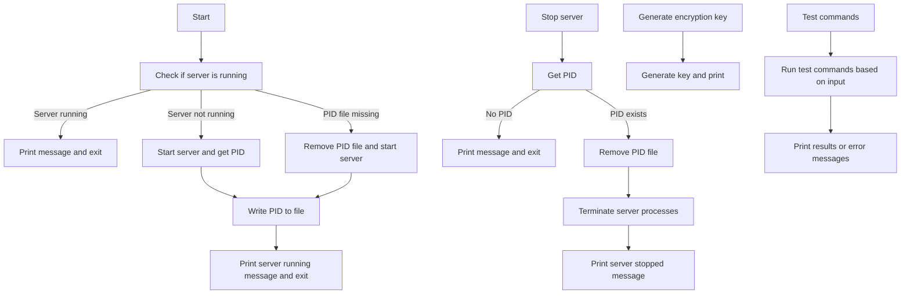
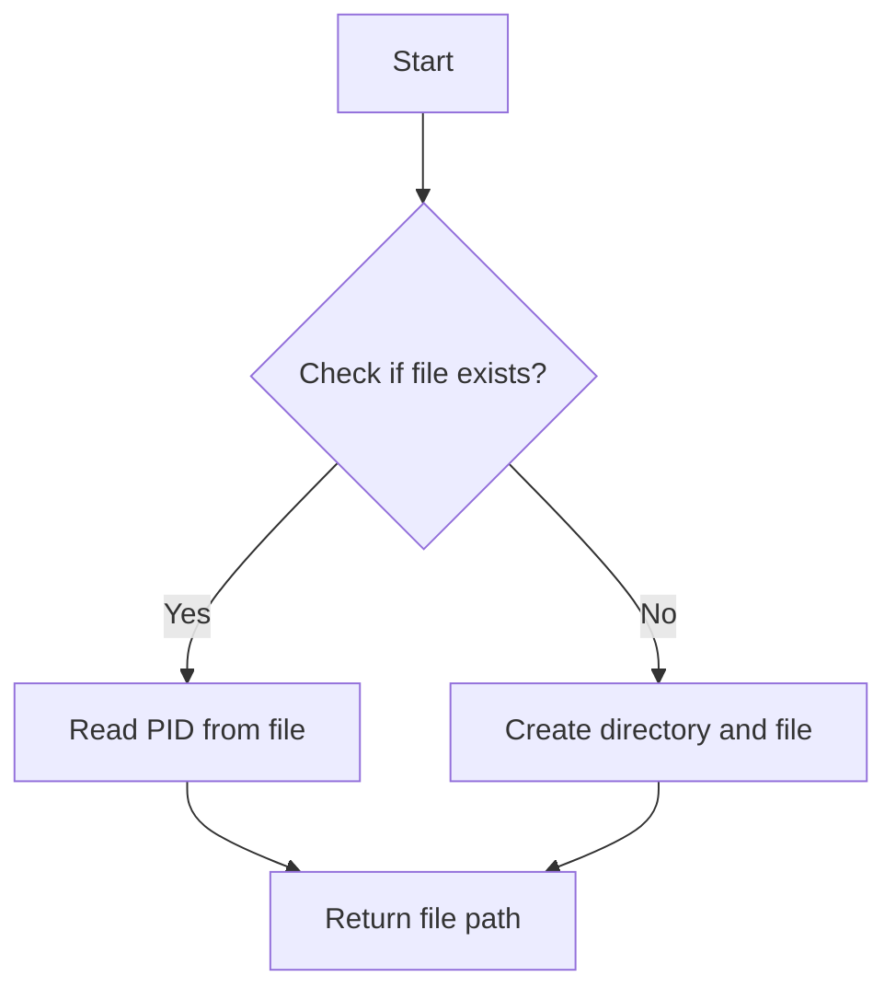
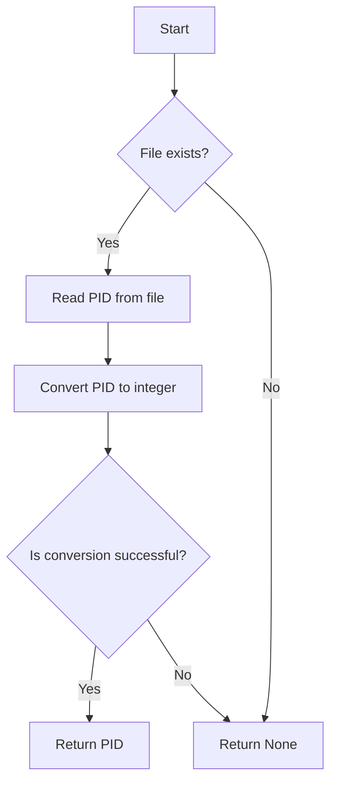
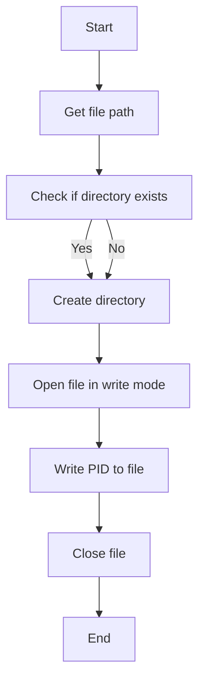
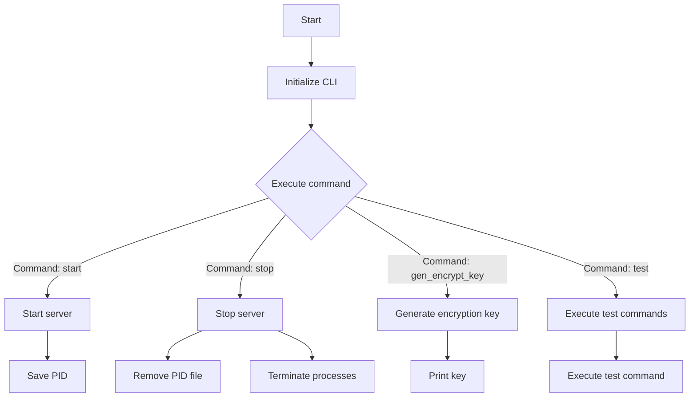
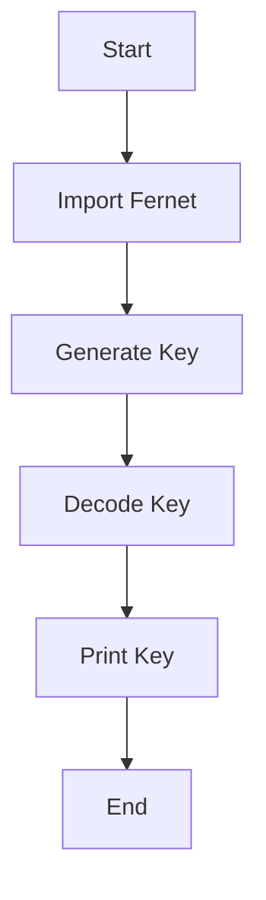
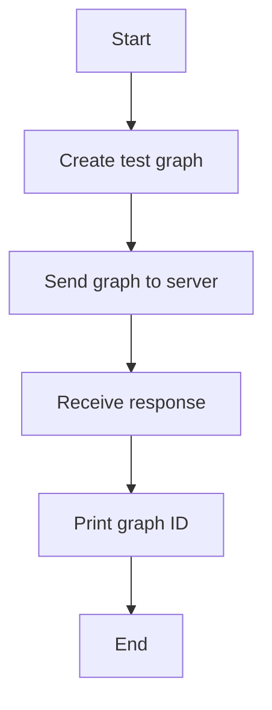
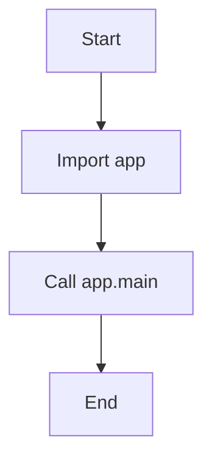

# `.\AutoGPT\autogpt_platform\backend\backend\cli.py` 详细设计文档

This code provides a command-line interface for managing an agent server, including starting, stopping, and generating encryption keys. It also includes test commands for interacting with the server's backend.

## 整体流程



## 类结构

```
MainApp (Class)
├── AppProcess (Base Class)
│   ├── run (Method)
│   └── ...
└── main (Command)
    ├── start (Command)
    ├── stop (Command)
    └── gen_encrypt_key (Command)
```

## 全局变量及字段


### `pid`
    
The process ID of the server process.

类型：`int | None`
    


### `file_path`
    
The file path where the PID is stored.

类型：`pathlib.Path`
    


### `home_dir`
    
The user's home directory path.

类型：`pathlib.Path`
    


### `new_dir`
    
The new directory path for storing the PID file.

类型：`pathlib.Path`
    


    

## 全局函数及方法

### get_pid_path

#### 描述

`get_pid_path` 函数用于获取保存进程 ID 的文件路径。

#### 参数

- 无

#### 返回值

- `pathlib.Path`：返回保存进程 ID 的文件路径。

#### 流程图



#### 带注释源码

```python
def get_pid_path() -> pathlib.Path:
    home_dir = pathlib.Path.home()  # 获取用户主目录
    new_dir = home_dir / ".config" / "agpt"  # 创建配置目录
    file_path = new_dir / "running.tmp"  # 创建保存 PID 的文件
    return file_path
```

### get_pid

**描述**

`get_pid` 函数用于获取当前正在运行的进程的 PID（进程标识符）。如果文件中存在 PID，则返回该 PID；如果文件不存在或文件中的 PID 无效，则返回 `None`。

**参数**

- 无

**返回值**

- `int | None`：返回正在运行的进程的 PID，如果不存在或无效则返回 `None`。

#### 流程图



#### 带注释源码

```python
def get_pid() -> int | None:
    file_path = get_pid_path()
    if not file_path.exists():
        return None

    os.makedirs(file_path.parent, exist_ok=True)
    with open(file_path, "r", encoding="utf-8") as file:
        pid = file.read()
    try:
        return int(pid)
    except ValueError:
        return None
```

### write_pid

**描述**

The `write_pid` function writes the process ID (PID) of the running server to a file. This is used to keep track of the server's PID for later reference.

**参数**

- `pid`：`int`，The process ID of the server to be written to the file.

**返回值**

- 无返回值。

#### 流程图



#### 带注释源码

```python
def write_pid(pid: int):
    file_path = get_pid_path()
    os.makedirs(file_path.parent, exist_ok=True)  # Ensure the directory exists
    with open(file_path, "w", encoding="utf-8") as file:  # Open file in write mode
        file.write(str(pid))  # Write PID to file
    # No return value
```

### main

The `main` function serves as the entry point for the AutoGPT Server CLI Tool. It initializes the command-line interface and handles the execution of different commands based on user input.

#### 参数

- `args`：`click.Context`，The context of the command-line interface.

#### 返回值

- `None`：The function does not return any value.

#### 流程图



#### 带注释源码

```python
@click.group()
def main():
    """AutoGPT Server CLI Tool"""
    pass

if __name__ == "__main__":
    main()
```

### start

This function starts the server in the background and saves the PID.

参数：

- `None`：无参数

返回值：`None`，无返回值

#### 流程图

```mermaid
graph TD
    A[Start] --> B[Check if server is running]
    B -->|Yes| C[Print "Server is already running"]
    B -->|No| D[Remove PID file if exists]
    D --> E[Create MainApp instance]
    E --> F[Start server in background]
    F --> G[Get PID]
    G --> H[Write PID to file]
    H --> I[Print "done"]
    I --> J[Exit]
```

#### 带注释源码

```python
@main.command()
def start():
    """
    Starts the server in the background and saves the PID
    """
    # Define the path for the new directory and file
    pid = get_pid()
    if pid and psutil.pid_exists(pid):
        print("Server is already running")
        exit(1)
    elif pid:
        print("PID does not exist deleting file")
        os.remove(get_pid_path())

    print("Starting server")
    pid = MainApp().start(background=True, silent=True)
    print(f"Server running in process: {pid}")

    write_pid(pid)
    print("done")
    os._exit(status=0)
```

### `{stop}`

Stops the server.

参数：

- `None`：No parameters are required for this function.

返回值：`None`，This function does not return any value.

#### 流程图

```mermaid
graph TD
    A[Start] --> B[Get PID]
    B -->|PID exists| C[Check if process exists]
    B -->|PID does not exist| D[Remove PID file]
    C -->|Process exists| E[Terminate process and children]
    C -->|Process does not exist| F[Remove PID file]
    D --> G[Remove PID file]
    E --> H[Remove PID file]
    F --> H
    H --> I[Print "Server Stopped"]
```

#### 带注释源码

```python
@main.command()
def stop():
    """
    Stops the server
    """
    pid = get_pid()
    if not pid:
        print("Server is not running")
        return

    os.remove(get_pid_path())
    process = psutil.Process(int(pid))
    for child in process.children(recursive=True):
        child.terminate()
    process.terminate()

    print("Server Stopped")
```

### gen_encrypt_key

**描述**

`gen_encrypt_key` 函数用于生成一个新的加密密钥。

**参数**

- 无

**返回值**

- `str`，加密密钥的字符串表示

#### 流程图



#### 带注释源码

```python
@main.command()
def gen_encrypt_key():
    """
    Generate a new encryption key
    """
    from cryptography.fernet import Fernet

    # Generate a new encryption key
    key = Fernet.generate_key()

    # Decode the key to a string
    key_str = key.decode()

    # Print the key
    print(key_str)
```

### `test.reddit`

**描述**

This function creates an event graph using the provided server address.

**参数**

- `server_address`：`str`，The address of the server to send the graph to.

**返回值**

- 无

#### 流程图



#### 带注释源码

```python
@test.command()
@click.argument("server_address")
async def reddit(server_address: str):
    """
    Create an event graph
    """
    from backend.usecases.reddit_marketing import create_test_graph
    from backend.util.request import Requests

    test_graph = create_test_graph()
    url = f"{server_address}/graphs"
    headers = {"Content-Type": "application/json"}
    data = test_graph.model_dump_json()

    response = await Requests(trusted_origins=[server_address]).post(
        url, headers=headers, data=data
    )

    graph_id = response.json()["id"]
    print(f"Graph created with ID: {graph_id}")
```

### MainApp.run

**描述**

`MainApp.run` 方法是 `MainApp` 类的一个实例方法，它负责启动应用程序的主逻辑。

**参数**

- 无

**返回值**

- 无

**流程图**



#### 带注释源码

```python
class MainApp(AppProcess):
    def run(self):
        # 从 backend 模块导入 app
        from backend import app

        # 调用 app 的 main 方法，传入 silent 参数为 True
        app.main(silent=True)
```

### AppProcess.run

#### 描述

`AppProcess.run` 方法是 `MainApp` 类的一个方法，用于启动应用程序的主逻辑。

#### 参数

- `self`：`MainApp` 类的实例

#### 返回值

- `None`：该方法不返回任何值

#### 流程图


#### 带注释源码

```python
class MainApp(AppProcess):
    def run(self):
        from backend import app

        app.main(silent=True)
```

### 关键组件信息

- `MainApp`：继承自 `AppProcess` 的类，负责启动应用程序的主逻辑。
- `app.main`：启动应用程序的主方法。

## 关键组件


### 张量索引与惰性加载

用于高效地处理和索引大型张量数据，支持惰性加载以减少内存消耗。

### 反量化支持

提供对反量化操作的支持，以优化模型性能和资源使用。

### 量化策略

实现量化策略，用于将浮点数模型转换为低精度整数模型，以减少模型大小和提高推理速度。


## 问题及建议


### 已知问题

-   **全局变量和函数依赖性**：代码中存在多个全局变量和函数，如 `get_pid_path`, `get_pid`, `write_pid`, 和 `os._exit`，这些在多个地方被调用，但它们没有明确的封装在类中，这可能导致代码难以维护和理解。
-   **异常处理**：代码中缺少异常处理机制，例如在读取PID文件时，如果文件内容不是有效的整数，会抛出 `ValueError`，但没有相应的异常处理逻辑。
-   **异步代码的异常处理**：在异步函数中，如 `populate_db` 和 `graph`，缺少异常处理逻辑，这可能导致在发生错误时程序崩溃。
-   **代码重复**：在 `populate_db` 和 `graph` 函数中，存在大量的代码重复，这可以通过提取公共逻辑来优化。
-   **测试代码的异步处理**：测试命令如 `reddit` 和 `populate_db` 使用了异步函数，但没有使用 `asyncio` 的 `run_until_complete` 或 `await` 来确保异步操作完成。

### 优化建议

-   **封装全局变量和函数**：将全局变量和函数封装在类中，以提高代码的可读性和可维护性。
-   **添加异常处理**：在可能抛出异常的地方添加异常处理逻辑，例如在读取PID文件时。
-   **使用异步编程的最佳实践**：确保异步代码正确处理异常，并使用 `await` 或 `run_until_complete` 来确保异步操作完成。
-   **减少代码重复**：通过提取公共逻辑来减少代码重复，例如创建图形和执行图形的代码。
-   **使用单元测试**：编写单元测试来测试代码的功能，确保代码的正确性和稳定性。
-   **文档化**：为代码添加文档注释，说明每个函数和类的用途，以及如何使用它们。
-   **代码风格**：遵循一致的代码风格指南，以提高代码的可读性和可维护性。


## 其它


### 设计目标与约束

- 设计目标：
  - 提供一个用户友好的命令行界面来管理AutoGPT服务器。
  - 支持启动、停止和生成加密密钥的服务器操作。
  - 支持测试命令，如创建事件图、数据库填充、执行图和发送事件。
  - 确保服务器操作不会导致数据丢失或不一致。
- 约束：
  - 服务器操作必须在后台进行，以避免阻塞命令行界面。
  - 所有操作都应通过命令行界面进行，不提供图形用户界面。
  - 服务器操作应具有明确的错误消息，以便用户了解操作失败的原因。

### 错误处理与异常设计

- 错误处理：
  - 当服务器已运行时，启动命令将显示错误消息并退出。
  - 当无法找到PID文件时，停止命令将显示错误消息并退出。
  - 当无法删除PID文件时，停止命令将显示错误消息并退出。
  - 当无法生成PID文件时，启动命令将显示错误消息并退出。
  - 当无法连接到服务器时，测试命令将显示错误消息。
- 异常设计：
  - 使用try-except块来捕获和处理可能发生的异常，如文件操作错误、网络错误等。

### 数据流与状态机

- 数据流：
  - 用户输入命令，命令通过命令行界面传递到相应的函数。
  - 函数执行操作，如启动服务器、停止服务器、生成密钥等。
  - 操作的结果通过命令行界面返回给用户。
- 状态机：
  - 服务器可以处于运行、停止或未知状态。
  - 启动命令将服务器置于运行状态。
  - 停止命令将服务器置于停止状态。

### 外部依赖与接口契约

- 外部依赖：
  - `click`：用于创建命令行界面。
  - `psutil`：用于检查进程状态。
  - `cryptography`：用于生成加密密钥。
  - `asyncio`：用于异步操作。
  - `websockets`：用于WebSocket连接测试。
- 接口契约：
  - `AppProcess`类：用于启动和停止服务器。
  - `Requests`类：用于发送HTTP请求。
  - `WSMessage`类：用于WebSocket消息格式。
  - `WSMethod`类：用于WebSocket方法类型。
  - `WSSubscribeGraphExecutionRequest`类：用于WebSocket订阅图执行请求。

    