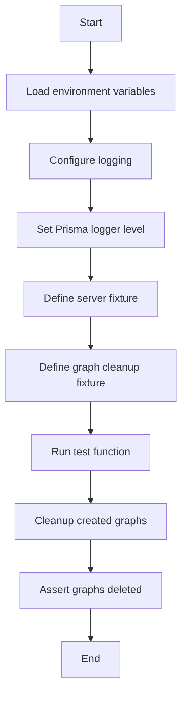
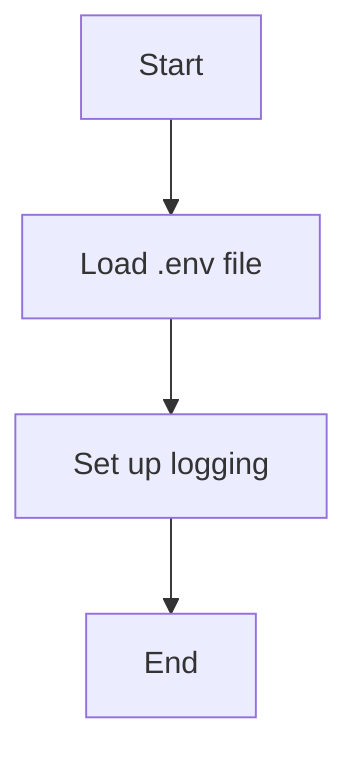
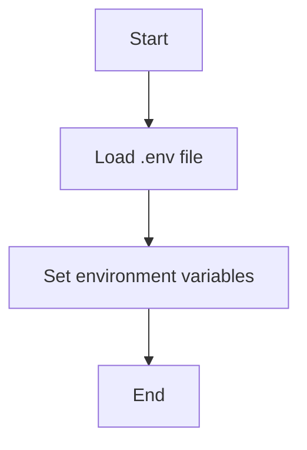
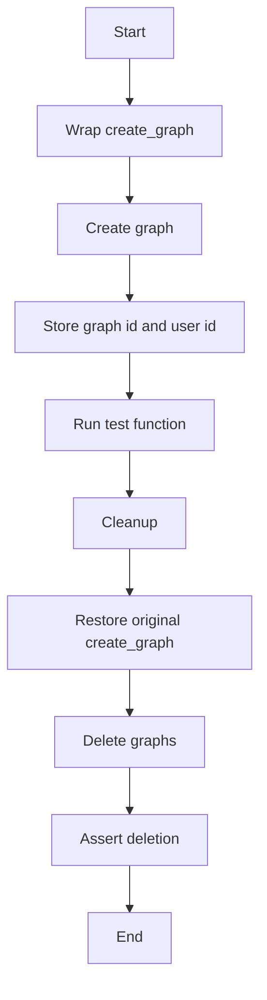
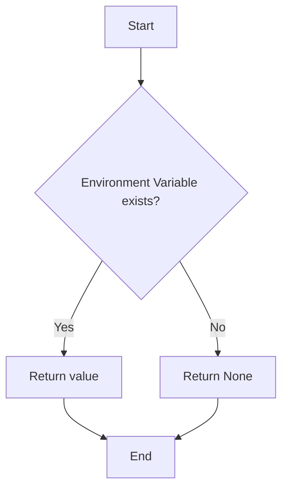
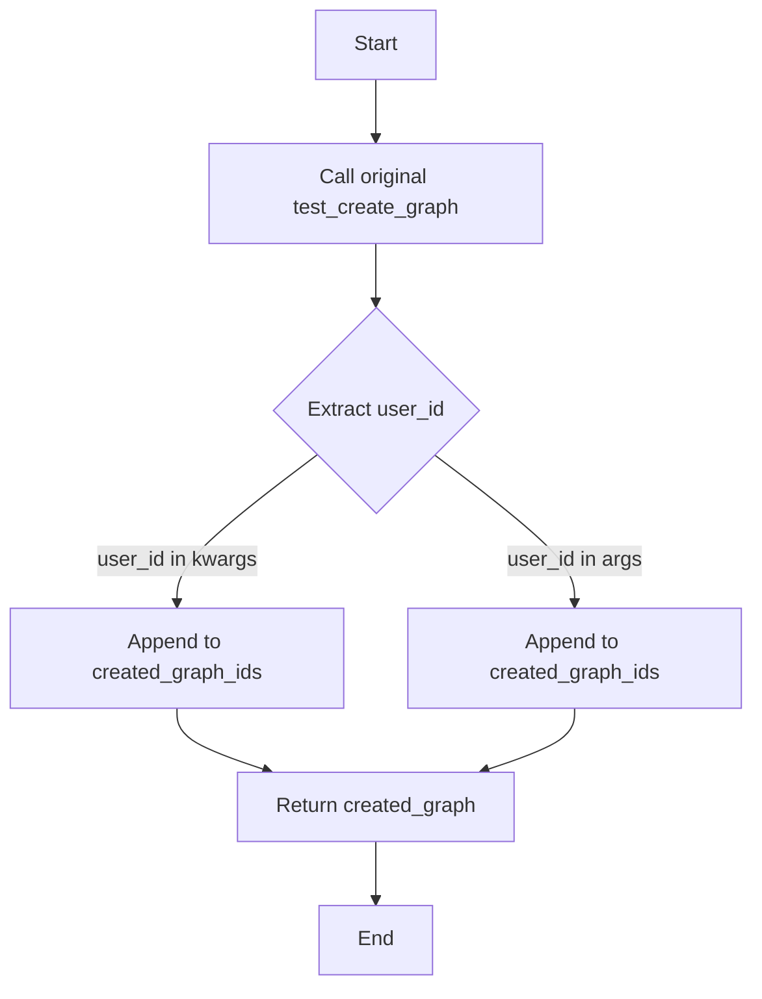

# `.\AutoGPT\autogpt_platform\backend\backend\conftest.py` 详细设计文档

This code sets up a test server environment for testing purposes, including logging configuration, environment variable loading, and fixtures for server operations and graph cleanup.

## 整体流程



## 类结构

```
abstract base class (unnamed)
├── SpinTestServer (class)
│   ├── test_create_graph (method)
│   └── test_delete_graph (method)
└── server (fixture)
```

## 全局变量及字段


### `logger`
    
Logger for the module, used to log messages.

类型：`logging.Logger`
    


### `prisma_logger`
    
Logger for Prisma, used to control Prisma log spam.

类型：`logging.Logger`
    


### `server`
    
Test server instance used for testing purposes.

类型：`SpinTestServer`
    


### `created_graph_ids`
    
List of tuples containing graph IDs and user IDs of created graphs for cleanup.

类型：`list of tuples`
    


### `original_create_graph`
    
Original create_graph function of the server agent server before modification for testing purposes.

类型：`function`
    


### `SpinTestServer.agent_server`
    
Agent server object containing methods for testing.

类型：`object`
    


### `agent_server.test_create_graph`
    
Method to create a graph for testing purposes.

类型：`function`
    


### `agent_server.test_delete_graph`
    
Method to delete a graph for testing purposes.

类型：`function`
    
    

## 全局函数及方法


### configure_logging()

该函数用于配置日志记录系统，设置日志级别和格式。

参数：

- 无

返回值：无

#### 流程图



#### 带注释源码

```python
def configure_logging():
    # Load environment variables from .env file
    load_dotenv()

    # Set up logging configuration
    logging.basicConfig(level=logging.INFO, format='%(asctime)s - %(name)s - %(levelname)s - %(message)s')
```


### `load_dotenv`

`load_dotenv` 是一个全局函数，用于从 `.env` 文件中加载环境变量。

参数：

- 无

返回值：无

#### 流程图



#### 带注释源码

```python
# Importing the required module
from dotenv import load_dotenv

# Loading environment variables from .env file
load_dotenv()
```


### `graph_cleanup`

This fixture is used to clean up the graphs created during the test session. It wraps the `test_create_graph` method to track the created graphs and then deletes them after the test session.

参数：

- `server`：`SpinTestServer`，The test server instance used for testing.

返回值：`None`，No return value, it's an async context manager.

#### 流程图



#### 带注释源码

```python
@pytest_asyncio.fixture(scope="session", loop_scope="session", autouse=True)
async def graph_cleanup(server):
    created_graph_ids = []
    original_create_graph = server.agent_server.test_create_graph

    async def create_graph_wrapper(*args, **kwargs):
        created_graph = await original_create_graph(*args, **kwargs)
        # Extract user_id correctly
        user_id = kwargs.get("user_id", args[2] if len(args) > 2 else None)
        created_graph_ids.append((created_graph.id, user_id))
        return created_graph

    try:
        server.agent_server.test_create_graph = create_graph_wrapper
        yield  # This runs the test function
    finally:
        server.agent_server.test_create_graph = original_create_graph

        # Delete the created graphs and assert they were deleted
        for graph_id, user_id in created_graph_ids:
            if user_id:
                resp = await server.agent_server.test_delete_graph(graph_id, user_id)
                num_deleted = resp["version_counts"]
                assert num_deleted > 0, f"Graph {graph_id} was not deleted."
```


### os.getenv

os.getenv 是一个全局函数，用于获取环境变量的值。

参数：

- `name`：`str`，环境变量的名称，用于查找环境变量的值。

返回值：`str` 或 `None`，如果环境变量存在，则返回其值；如果不存在，则返回 `None`。

#### 流程图



#### 带注释源码

```python
import os

# Get the value of the PRISMA_DEBUG environment variable
if not os.getenv("PRISMA_DEBUG"):
    prisma_logger = logging.getLogger("prisma")
    prisma_logger.setLevel(logging.INFO)
```


### assert

The `assert` function is used to verify that a condition is true. If the condition is false, it raises an AssertionError with the provided message.

参数：

- `num_deleted`：`int`，The number of deleted versions of the graph.
- `f"Graph {graph_id} was not deleted."`：`str`，The message to be displayed if the assertion fails.

返回值：`None`，No return value is expected as the function raises an exception if the condition is not met.

#### 流程图

```mermaid
graph TD
    A[Start] --> B{Condition: num_deleted > 0?}
    B -- Yes --> C[End]
    B -- No --> D[Error: Graph {graph_id} was not deleted.]
```

#### 带注释源码

```python
# Delete the created graphs and assert they were deleted
for graph_id, user_id in created_graph_ids:
    if user_id:
        resp = await server.agent_server.test_delete_graph(graph_id, user_id)
        num_deleted = resp["version_counts"]
        assert num_deleted > 0, f"Graph {graph_id} was not deleted."
```


### SpinTestServer.test_create_graph

This function is a wrapper around the original `test_create_graph` method of the `agent_server` object in the `SpinTestServer` class. It is used to track the creation of graphs during tests.

参数：

- `*args`：`Any`，Variable length argument list passed to the original `test_create_graph` method.
- `**kwargs`：`Any`，Keyword arguments passed to the original `test_create_graph` method.
- `user_id`：`Optional[int]`，The user ID associated with the graph creation. If not provided, it is extracted from the `args` list.

返回值：`Graph`，The graph object created by the original `test_create_graph` method.

#### 流程图



#### 带注释源码

```python
async def create_graph_wrapper(*args, **kwargs):
    created_graph = await original_create_graph(*args, **kwargs)
    # Extract user_id correctly
    user_id = kwargs.get("user_id", args[2] if len(args) > 2 else None)
    created_graph_ids.append((created_graph.id, user_id))
    return created_graph
```


### `test_delete_graph`

该函数用于删除由测试创建的图形，并验证删除操作是否成功。

参数：

- `graph_id`：`int`，图形的唯一标识符。
- `user_id`：`int`，用户ID，用于关联图形和用户。

返回值：`dict`，包含删除操作的版本计数信息。

#### 流程图

```mermaid
graph TD
    A[Start] --> B[Call test_delete_graph(graph_id, user_id)]
    B --> C[Check if num_deleted > 0]
    C -->|Yes| D[End]
    C -->|No| E[Log error and End]
```

#### 带注释源码

```python
# Delete the created graphs and assert they were deleted
for graph_id, user_id in created_graph_ids:
    if user_id:
        resp = await server.agent_server.test_delete_graph(graph_id, user_id)
        num_deleted = resp["version_counts"]
        assert num_deleted > 0, f"Graph {graph_id} was not deleted."
```


## 关键组件


### 张量索引与惰性加载

张量索引与惰性加载是代码中用于高效处理大型数据集的关键组件，通过延迟计算和索引优化，减少内存消耗和提高处理速度。

### 反量化支持

反量化支持是代码中用于处理量化数据的关键组件，它允许模型在量化过程中保持精度，同时减少模型大小和计算需求。

### 量化策略

量化策略是代码中用于优化模型性能的关键组件，它通过调整模型参数的精度来减少模型大小和计算需求，同时保持模型性能。


## 问题及建议


### 已知问题

-   **日志配置重复性**：`configure_logging()` 函数被调用两次，一次在导入模块时，一次在设置 Prisma 日志级别时。这可能导致配置重复或冲突。
-   **环境变量依赖**：代码依赖于环境变量 `PRISMA_DEBUG` 来控制 Prisma 日志级别，这可能会在测试环境中导致不必要的日志输出。
-   **测试清理逻辑**：`graph_cleanup` fixture 中，删除图的操作是通过 `test_delete_graph` 方法完成的，但未提供此方法的实现细节。如果该方法没有适当的错误处理，可能会导致测试失败而不会提供清晰的错误信息。
-   **异常处理**：代码中没有明显的异常处理逻辑，如果测试过程中发生异常，可能会导致测试环境不稳定。

### 优化建议

-   **减少日志配置调用**：确保 `configure_logging()` 只被调用一次，可以在模块级别进行配置，并在需要的地方使用配置好的日志记录器。
-   **环境变量使用**：考虑在测试环境中始终设置 `PRISMA_DEBUG` 为 `False`，以避免不必要的日志输出，或者提供一个更明确的机制来控制日志级别。
-   **测试清理逻辑**：确保 `test_delete_graph` 方法有适当的错误处理，并在删除图失败时提供清晰的错误信息。
-   **异常处理**：在关键操作中添加异常处理逻辑，确保在发生异常时能够捕获并处理，同时提供有用的错误信息。
-   **代码复用**：如果 `test_create_graph` 和 `test_delete_graph` 方法在其他测试中也有使用，考虑将它们提取到单独的类或模块中，以提高代码复用性。
-   **测试覆盖率**：确保测试覆盖率工具能够检测到所有测试用例，包括新的 `create_graph_wrapper` 方法。


## 其它


### 设计目标与约束

- 设计目标：
  - 确保测试环境中的数据一致性，避免测试数据对后续测试的影响。
  - 提供一个可配置的日志系统，以适应不同的调试和日志记录需求。
  - 确保测试服务器能够快速启动和关闭，以节省资源。

- 约束条件：
  - 必须使用Prisma数据库进行数据操作。
  - 测试服务器必须遵循pytest_asyncio的异步测试框架。

### 错误处理与异常设计

- 错误处理：
  - 使用try-except结构捕获和处理可能发生的异常。
  - 对于数据库操作，确保在发生异常时能够回滚操作，以保持数据的一致性。

- 异常设计：
  - 定义自定义异常类，以提供更具体的错误信息。
  - 异常信息应包括错误类型、错误描述和可能的原因。

### 数据流与状态机

- 数据流：
  - 测试数据通过`SpinTestServer`创建，并通过`create_graph_wrapper`函数进行封装。
  - 创建的图数据存储在`created_graph_ids`列表中，以便后续删除。

- 状态机：
  - 测试服务器在测试开始前启动，测试结束后关闭。
  - 图数据在测试过程中创建，测试结束后删除。

### 外部依赖与接口契约

- 外部依赖：
  - `dotenv`：用于加载环境变量。
  - `logging`：用于日志记录。
  - `os`：用于环境变量操作。
  - `pytest_asyncio`：用于异步测试。
  - `prisma`：用于数据库操作。

- 接口契约：
  - `SpinTestServer`：提供测试服务器的启动和关闭接口。
  - `test_create_graph`和`test_delete_graph`：提供创建和删除图数据的接口。
  - `configure_logging`：配置日志系统。


    