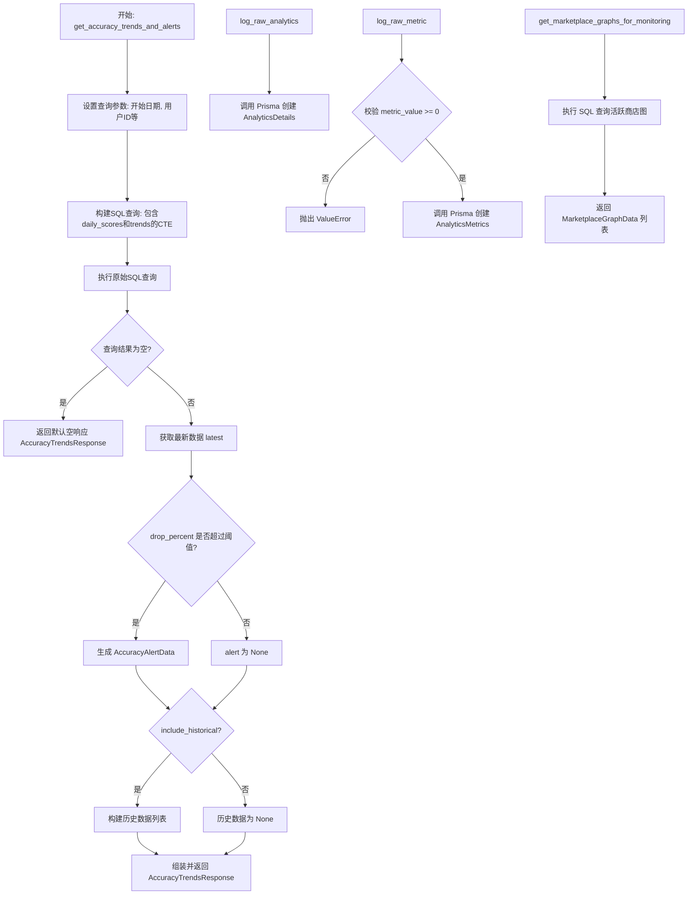
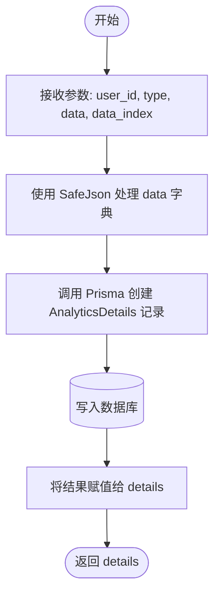
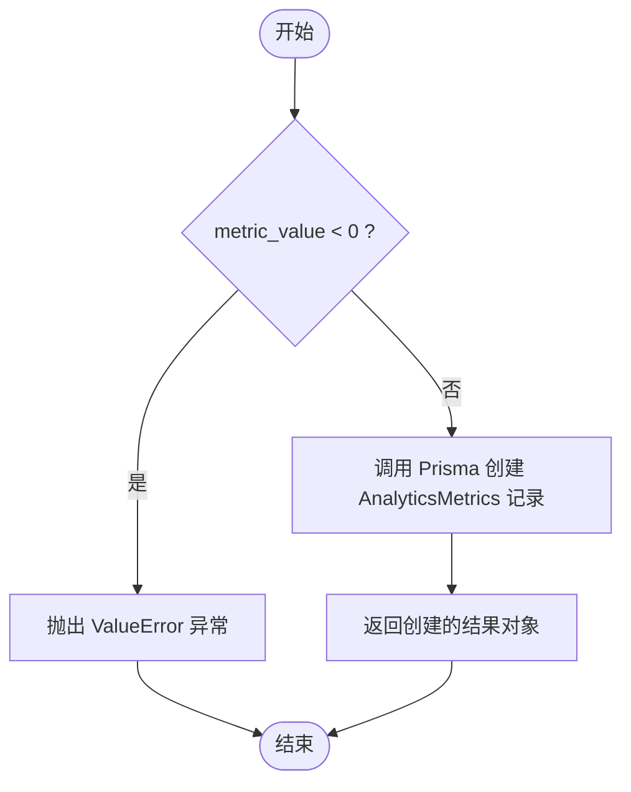
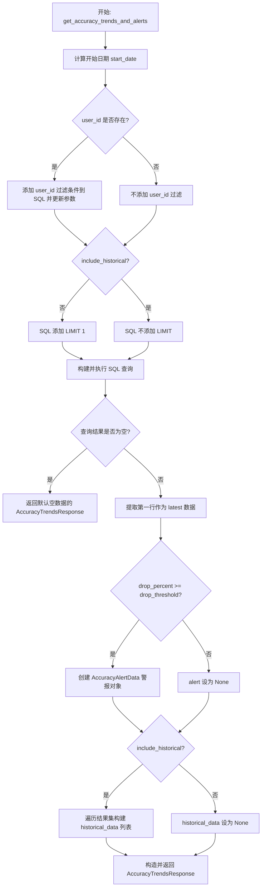
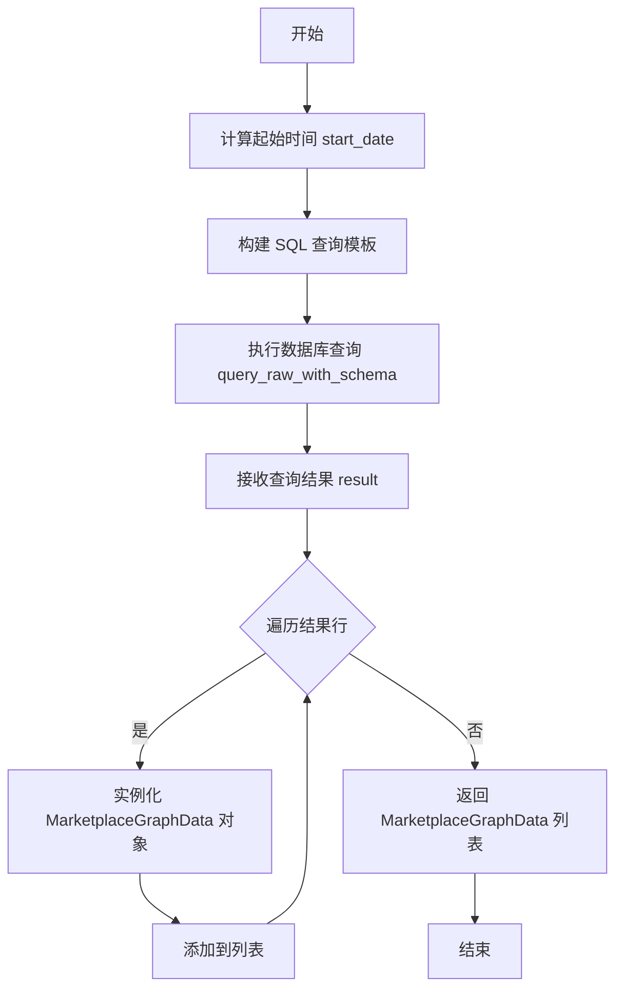

# `AutoGPT\autogpt_platform\backend\backend\data\analytics.py` 详细设计文档

该代码负责处理后台监控与分析逻辑，包括记录原始分析数据和指标、计算Agent图的准确性趋势（包含移动平均值）、检测准确性显著下降的告警，以及查询需要监控的市场发布图。

## 整体流程



## 类结构

```
BaseModel (pydantic)
├── AccuracyAlertData
├── AccuracyLatestData
├── AccuracyTrendsResponse
└── MarketplaceGraphData
```

## 全局变量及字段


### `logger`
    
Logger instance for the module, used for recording runtime information and errors.

类型：`logging.Logger`
    


### `AccuracyAlertData.graph_id`
    
The unique identifier of the graph where the accuracy drop was detected.

类型：`str`
    


### `AccuracyAlertData.user_id`
    
The unique identifier of the user associated with the graph.

类型：`Optional[str]`
    


### `AccuracyAlertData.drop_percent`
    
The percentage decrease in accuracy relative to the seven-day average.

类型：`float`
    


### `AccuracyAlertData.three_day_avg`
    
The average accuracy score calculated over the past three days.

类型：`float`
    


### `AccuracyAlertData.seven_day_avg`
    
The average accuracy score calculated over the past seven days.

类型：`float`
    


### `AccuracyAlertData.detected_at`
    
The timestamp indicating when the accuracy drop alert was detected.

类型：`datetime`
    


### `AccuracyLatestData.date`
    
The date to which the accuracy data point corresponds.

类型：`datetime`
    


### `AccuracyLatestData.daily_score`
    
The daily execution accuracy score, or null if unavailable.

类型：`Optional[float]`
    


### `AccuracyLatestData.three_day_avg`
    
The rolling average accuracy score over the past three days.

类型：`Optional[float]`
    


### `AccuracyLatestData.seven_day_avg`
    
The rolling average accuracy score over the past seven days.

类型：`Optional[float]`
    


### `AccuracyLatestData.fourteen_day_avg`
    
The rolling average accuracy score over the past fourteen days.

类型：`Optional[float]`
    


### `AccuracyTrendsResponse.latest_data`
    
Object containing the most recent accuracy metrics and trends.

类型：`AccuracyLatestData`
    


### `AccuracyTrendsResponse.alert`
    
Alert information if a significant accuracy drop is detected, otherwise null.

类型：`Optional[AccuracyAlertData]`
    


### `AccuracyTrendsResponse.historical_data`
    
A list of historical accuracy data points, if requested.

类型：`Optional[list[AccuracyLatestData]]`
    


### `MarketplaceGraphData.graph_id`
    
The unique identifier of the marketplace graph being monitored.

类型：`str`
    


### `MarketplaceGraphData.user_id`
    
The user ID associated with the graph, typically null for marketplace-wide monitoring.

类型：`Optional[str]`
    


### `MarketplaceGraphData.execution_count`
    
The number of times the graph has been executed within the monitoring period.

类型：`int`
    
    

## 全局函数及方法


### `log_raw_analytics`

该函数的主要功能是将原始分析数据记录到数据库中。它接收用户ID、分析类型、数据字典以及数据索引，利用Prisma ORM在数据库的`AnalyticsDetails`表中创建并保存一条新记录。

参数：

- `user_id`：`str`，关联该分析数据的用户ID
- `type`：`str`，分析数据的类型或类别标识
- `data`：`dict`，包含具体分析内容的原始数据字典
- `data_index`：`str`，用于索引或检索该数据的标识符

返回值：`prisma.models.AnalyticsDetails`，返回创建成功的数据库记录对象

#### 流程图



#### 带注释源码

```python
async def log_raw_analytics(
    user_id: str,
    type: str,
    data: dict,
    data_index: str,
):
    # 使用 Prisma Client 创建一个新的 AnalyticsDetails 记录
    # SafeJson(data) 确保字典数据被安全地序列化为 JSON 格式存储
    details = await prisma.models.AnalyticsDetails.prisma().create(
        data=prisma.types.AnalyticsDetailsCreateInput(
            userId=user_id,
            type=type,
            data=SafeJson(data),
            dataIndex=data_index,
        )
    )
    # 返回创建成功的数据库记录详情对象
    return details
```


### `log_raw_metric`

该函数用于将原始指标数据记录到数据库中。它首先验证指标值必须为非负数，然后通过 Prisma ORM 在 `AnalyticsMetrics` 表中创建一条新记录，存储用户ID、指标名称、数值以及相关的数据字符串。

参数：

- `user_id`：`str`，与该指标关联的用户标识符。
- `metric_name`：`str`，指标的名称或键值。
- `metric_value`：`float`，指标的数值（必须非负）。
- `data_string`：`str`，与该指标事件相关的附加字符串数据。

返回值：`prisma.models.AnalyticsMetrics`，数据库操作成功后创建的 `AnalyticsMetrics` 模型实例。

#### 流程图



#### 带注释源码

```python
async def log_raw_metric(
    user_id: str,
    metric_name: str,
    metric_value: float,
    data_string: str,
):
    # 参数校验：确保指标值不为负数
    if metric_value < 0:
        raise ValueError("metric_value must be non-negative")

    # 使用 Prisma ORM 在数据库中创建新的指标记录
    result = await prisma.models.AnalyticsMetrics.prisma().create(
        data=prisma.types.AnalyticsMetricsCreateInput(
            value=metric_value,           # 设置指标值
            analyticMetric=metric_name,   # 设置指标名称
            userId=user_id,               # 设置关联的用户ID
            dataString=data_string,       # 设置附加数据字符串
        )
    )

    # 返回创建成功的数据库记录对象
    return result
```


### `get_accuracy_trends_and_alerts`

该函数用于获取特定图的准确率趋势数据。它通过计算每日平均得分及不同时间窗口（3天、7天、14天）的移动平均值，来分析执行准确率的变化。同时，它能检测最近短期平均值相对于长期平均值的下降幅度，若下降超过设定阈值则生成警报。根据参数配置，它还可以返回完整的历史数据或仅返回最新数据。

参数：

-  `graph_id`：`str`，需要分析的 Agent Graph 的唯一标识符。
-  `days_back`：`int`，分析数据时向前回溯的天数，默认为30天。
-  `user_id`：`Optional[str]`，可选参数，用于筛选特定用户的执行记录。
-  `drop_threshold`：`float`，触发准确率下降警报的阈值（百分比），默认为10.0。
-  `include_historical`：`bool`，布尔值，决定是否返回所有历史趋势数据，默认为 False（仅返回最新一条）。

返回值：`AccuracyTrendsResponse`，包含最新的准确率数据（含日期、日分值及各周期移动平均）、可选的警报数据（如下降幅严重）以及可选的历史数据列表。

#### 流程图



#### 带注释源码

```python
async def get_accuracy_trends_and_alerts(
    graph_id: str,
    days_back: int = 30,
    user_id: Optional[str] = None,
    drop_threshold: float = 10.0,
    include_historical: bool = False,
) -> AccuracyTrendsResponse:
    """Get accuracy trends and detect alerts for a specific graph."""
    # 定义 SQL 查询模板，使用 CTE (Common Table Expressions) 计算每日得分和移动平均趋势
    query_template = """
    WITH daily_scores AS (
        SELECT 
            DATE(e."createdAt") as execution_date,
            -- 从 JSON stats 字段中提取 correctness_score 并计算每日平均值
            AVG(CASE 
                WHEN e.stats IS NOT NULL 
                AND e.stats::json->>'correctness_score' IS NOT NULL
                AND e.stats::json->>'correctness_score' != 'null'
                THEN (e.stats::json->>'correctness_score')::float * 100
                ELSE NULL 
            END) as daily_score
        FROM {schema_prefix}"AgentGraphExecution" e
        WHERE e."agentGraphId" = $1::text
            AND e."isDeleted" = false
            AND e."createdAt" >= $2::timestamp
            AND e."executionStatus" IN ('COMPLETED', 'FAILED', 'TERMINATED')
            {user_filter}
        GROUP BY DATE(e."createdAt")
        HAVING COUNT(*) >= 1  -- Include all days with at least 1 execution
    ),
    trends AS (
        SELECT 
            execution_date,
            daily_score,
            -- 计算窗口函数：3天移动平均 (前2天 + 当天)
            AVG(daily_score) OVER (
                ORDER BY execution_date 
                ROWS BETWEEN 2 PRECEDING AND CURRENT ROW
            ) as three_day_avg,
            -- 计算窗口函数：7天移动平均 (前6天 + 当天)
            AVG(daily_score) OVER (
                ORDER BY execution_date 
                ROWS BETWEEN 6 PRECEDING AND CURRENT ROW
            ) as seven_day_avg,
            -- 计算窗口函数：14天移动平均 (前13天 + 当天)
            AVG(daily_score) OVER (
                ORDER BY execution_date 
                ROWS BETWEEN 13 PRECEDING AND CURRENT ROW
            ) as fourteen_day_avg
        FROM daily_scores
    )
    SELECT *,
        -- 计算下降百分比: ((7天均值 - 3天均值) / 7天均值) * 100
        CASE 
            WHEN three_day_avg IS NOT NULL AND seven_day_avg IS NOT NULL AND seven_day_avg > 0
            THEN ((seven_day_avg - three_day_avg) / seven_day_avg * 100)
            ELSE NULL
        END as drop_percent
    FROM trends
    ORDER BY execution_date DESC
    {limit_clause}
    """

    # 计算查询的起始日期
    start_date = datetime.now(timezone.utc) - timedelta(days=days_back)
    params = [graph_id, start_date]
    user_filter = ""
    
    # 如果提供了 user_id，动态添加 SQL 过滤条件
    if user_id:
        user_filter = 'AND e."userId" = $3::text'
        params.append(user_id)

    # 根据是否需要历史数据决定 SQL 的 LIMIT 子句
    limit_clause = "" if include_historical else "LIMIT 1"

    # 格式化最终 SQL 语句
    final_query = query_template.format(
        schema_prefix="{schema_prefix}",
        user_filter=user_filter,
        limit_clause=limit_clause,
    )

    # 执行数据库查询
    result = await query_raw_with_schema(final_query, *params)

    # 如果没有结果，返回空数据的响应对象
    if not result:
        return AccuracyTrendsResponse(
            latest_data=AccuracyLatestData(
                date=datetime.now(timezone.utc),
                daily_score=None,
                three_day_avg=None,
                seven_day_avg=None,
                fourteen_day_avg=None,
            ),
            alert=None,
        )

    # 获取最新的一条数据（因为 SQL 按 DESC 排序）
    latest = result[0]

    alert = None
    # 检查是否满足警报条件：下降百分比不为空、超过阈值且均值数据有效
    if (
        latest["drop_percent"] is not None
        and latest["drop_percent"] >= drop_threshold
        and latest["three_day_avg"] is not None
        and latest["seven_day_avg"] is not None
    ):
        alert = AccuracyAlertData(
            graph_id=graph_id,
            user_id=user_id,
            drop_percent=float(latest["drop_percent"]),
            three_day_avg=float(latest["three_day_avg"]),
            seven_day_avg=float(latest["seven_day_avg"]),
            detected_at=datetime.now(timezone.utc),
        )

    # 准备历史数据（如果请求的话）
    historical_data = None
    if include_historical:
        historical_data = []
        for row in result:
            historical_data.append(
                AccuracyLatestData(
                    date=row["execution_date"],
                    daily_score=(
                        float(row["daily_score"])
                        if row["daily_score"] is not None
                        else None
                    ),
                    three_day_avg=(
                        float(row["three_day_avg"])
                        if row["three_day_avg"] is not None
                        else None
                    ),
                    seven_day_avg=(
                        float(row["seven_day_avg"])
                        if row["seven_day_avg"] is not None
                        else None
                    ),
                    fourteen_day_avg=(
                        float(row["fourteen_day_avg"])
                        if row["fourteen_day_avg"] is not None
                        else None
                    ),
                )
            )

    # 返回组装好的响应对象
    return AccuracyTrendsResponse(
        latest_data=AccuracyLatestData(
            date=latest["execution_date"],
            daily_score=(
                float(latest["daily_score"])
                if latest["daily_score"] is not None
                else None
            ),
            three_day_avg=(
                float(latest["three_day_avg"])
                if latest["three_day_avg"] is not None
                else None
            ),
            seven_day_avg=(
                float(latest["seven_day_avg"])
                if latest["seven_day_avg"] is not None
                else None
            ),
            fourteen_day_avg=(
                float(latest["fourteen_day_avg"])
                if latest["fourteen_day_avg"] is not None
                else None
            ),
        ),
        alert=alert,
        historical_data=historical_data,
    )
```


### `get_marketplace_graphs_for_monitoring`

获取已发布的市场图表中，在指定时间内具有一定执行次数的图表列表，用于监控目的。

参数：

- `days_back`：`int`，向前回溯的天数，用于筛选最近的执行记录，默认值为 30。
- `min_executions`：`int`，图表在指定时间段内必须满足的最小执行次数才能被选中，默认值为 10。

返回值：`list[MarketplaceGraphData]`，返回一个列表，其中每个元素包含图表 ID（对于市场图表用户 ID 为空）及其对应的执行次数。

#### 流程图



#### 带注释源码

```python
async def get_marketplace_graphs_for_monitoring(
    days_back: int = 30,
    min_executions: int = 10,
) -> list[MarketplaceGraphData]:
    """Get published marketplace graphs with recent executions for monitoring."""
    # 定义 SQL 查询模板
    # 1. 首先在 CTE (marketplace_graphs) 中查找所有已批准且未删除的商店列表版本对应的图表 ID
    # 2. 然后在主查询中将这些图表与执行记录表关联
    # 3. 筛选指定时间范围内的有效执行记录
    # 4. 按图表 ID 分组并统计执行次数，筛选出执行次数达到阈值的图表
    query_template = """
    WITH marketplace_graphs AS (
        SELECT DISTINCT 
            slv."agentGraphId" as graph_id,
            slv."agentGraphVersion" as graph_version
        FROM {schema_prefix}"StoreListing" sl
        JOIN {schema_prefix}"StoreListingVersion" slv ON sl."activeVersionId" = slv."id"
        WHERE sl."hasApprovedVersion" = true
            AND sl."isDeleted" = false
    )
    SELECT DISTINCT 
        mg.graph_id,
        NULL as user_id,  -- Marketplace graphs don't have a specific user_id for monitoring
        COUNT(*) as execution_count
    FROM marketplace_graphs mg
    JOIN {schema_prefix}"AgentGraphExecution" e ON e."agentGraphId" = mg.graph_id
    WHERE e."createdAt" >= $1::timestamp
        AND e."isDeleted" = false
        AND e."executionStatus" IN ('COMPLETED', 'FAILED', 'TERMINATED')
    GROUP BY mg.graph_id
    HAVING COUNT(*) >= $2
    ORDER BY execution_count DESC
    """
    # 根据传入的天数计算查询的起始时间（UTC 时间）
    start_date = datetime.now(timezone.utc) - timedelta(days=days_back)
    
    # 执行原生 SQL 查询，传入起始时间和最小执行次数作为参数
    result = await query_raw_with_schema(query_template, start_date, min_executions)

    # 将查询结果映射为 MarketplaceGraphData 对象列表
    return [
        MarketplaceGraphData(
            graph_id=row["graph_id"],
            user_id=row["user_id"],
            execution_count=int(row["execution_count"]),
        )
        for row in result
    ]
```


## 关键组件


### 分析数据模型
定义用于传输和存储分析结果的数据结构，包括准确性告警数据、最新趋势数据和市场监控数据，使用 Pydantic 进行数据验证。

### 原始数据记录服务
负责将原始分析详情和数值指标持久化到数据库中，包含对指标值的非负校验逻辑，确保数据录入的完整性和安全性。

### 准确性趋势分析与告警引擎
通过复杂的 SQL 查询执行时间序列分析，计算不同时间窗口（3天、7天、14天）的移动平均值，并根据短期平均分与长期平均分的下降幅度自动生成告警。

### 市场图谱监控查询
负责检索活跃的市场发布图谱，通过筛选已批准版本且近期执行次数达到阈值的图谱，为监控系统提供目标数据。


## 问题及建议


### 已知问题

-   **SQL拼接存在潜在安全风险**：代码中使用 `str.format()` 方法拼接 SQL 语句（如 `schema_prefix`, `user_filter`, `limit_clause`），虽然当前参数由内部逻辑控制，但这种写法违反了参数化查询的最佳实践，存在 SQL 注入的潜在风险且不利于数据库查询计划缓存。
-   **缺乏显式的异常处理机制**：数据库操作（如 `query_raw_with_schema` 和 Prisma 的 `create` 方法）没有包裹在 `try-except` 块中。一旦数据库连接失败、查询超时或数据类型不匹配，将导致未捕获的异常直接抛出，可能导致服务不稳定。
-   **硬编码的业务逻辑**：SQL 查询语句中包含了硬编码的业务逻辑，例如窗口函数的行范围（`ROWS BETWEEN 2 PRECEDING`）和执行状态列表（`'COMPLETED', 'FAILED', 'TERMINATED'`）。这使得修改业务规则（如调整时间窗口或状态定义）需要修改代码并重新部署，缺乏灵活性。
-   **数据映射逻辑冗余且易错**：在 `get_accuracy_trends_and_alerts` 函数中，将数据库查询结果（字典）转换为 Pydantic 模型的逻辑存在大量重复代码（手动检查 `None` 并转换类型）。这不仅降低了代码可读性，还容易在添加新字段时遗漏转换逻辑导致错误。

### 优化建议

-   **数据库索引优化**：针对 `AgentGraphExecution` 表中的查询条件（`agentGraphId`, `createdAt`, `isDeleted`, `executionStatus`, `userId`）建立复合索引，以显著提升聚合查询的性能，特别是在数据量大的情况下。
-   **引入缓存机制**：`get_accuracy_trends_and_alerts` 涉及复杂的聚合计算，资源消耗较大。建议引入 Redis 等缓存层，对计算结果进行短期缓存（如 5-10 分钟），以减少数据库压力并提高响应速度。
-   **SQL 语句外部化管理**：将复杂的 SQL 查询语句提取到配置文件或独立的 `.sql` 模板文件中，通过加载器读取。这样可以实现 SQL 与代码的分离，便于维护和数据库层面的版本管理。
-   **代码复用与通用映射**：封装通用的数据转换工具函数或利用 Pydantic 的 `model_validate` 功能，自动处理数据库行到 Pydantic 模型的映射和类型转换，消除重复代码。
-   **参数配置化**：将函数中的默认值（如 `drop_threshold`, `days_back`, 窗口函数的天数等）提取到应用配置中，使得无需修改代码即可调整监控敏感度和分析范围。


## 其它


### 设计目标与约束

1.  **设计目标**：
    *   **高效的数据聚合**：利用 SQL 窗口函数在数据库层面直接计算移动平均值（3天、7天、14天），减少应用层内存消耗和网络传输数据量。
    *   **灵活的监控机制**：支持动态配置的时间范围（`days_back`）和阈值（`drop_threshold`），以适应不同的监控需求。
    *   **非阻塞IO**：所有数据库操作均采用异步（`async/await`）方式，确保在高并发场景下不会阻塞事件循环。
2.  **约束**：
    *   **时区一致性**：时间计算统一使用 UTC 时区，确保跨地域部署的时间戳一致性。
    *   **数据有效性约束**：指标值（`metric_value`）强制要求非负，防止脏数据入库。
    *   **Schema 前缀适配**：SQL 查询设计需兼容多租户或不同 Schema 前缀（通过 `{schema_prefix}` 占位符实现）。

### 错误处理与异常设计

1.  **输入验证**：
    *   在 `log_raw_metric` 函数中，对 `metric_value` 进行显式检查，若小于 0 则抛出 `ValueError`，阻断非法数据的写入。
    *   使用 Pydantic 模型（`BaseModel`）自动处理请求和响应数据的类型校验与转换。
2.  **数据库交互异常**：
    *   数据库操作（`create`, `query_raw_with_schema`）依赖 Prisma 客户端，潜在的连接失败或查询错误会作为异常向上传播，由上层调用者（如 FastAPI 路由）捕获并处理为标准的 HTTP 错误响应。
3.  **空数据处理策略**：
    *   在 `get_accuracy_trends_and_alerts` 中，如果查询结果为空（无执行记录），不抛出异常，而是返回一个包含 `None` 指标的默认 `AccuracyTrendsResponse` 对象，保证下游调用的稳定性。
4.  **JSON 安全处理**：
    *   使用自定义的 `SafeJson` 工具处理存储到数据库的 JSON 数据，防止序列化异常。

### 数据流与状态机

1.  **数据流**：
    *   **日志记录流**：业务逻辑 -> 验证数据 -> `log_raw_analytics/metric` -> Prisma ORM -> PostgreSQL (`AnalyticsDetails`/`AnalyticsMetrics` 表)。
    *   **趋势分析流**：请求参数 -> 构建 SQL 模板 -> `query_raw_with_schema` -> PostgreSQL 执行聚合计算 (CTE & Window Functions) -> 映射结果集 -> Pydantic 模型 -> 返回响应。
2.  **业务状态逻辑**：
    *   虽然没有复杂的状态机，但在 `get_accuracy_trends_and_alerts` 中存在条件判断逻辑：
        *   **正常状态**：当 `drop_percent` 小于 `drop_threshold` 时，`alert` 字段为 `None`。
        *   **告警状态**：当计算出的下降百分比超过阈值且平均值有效时，实例化 `AccuracyAlertData` 对象，标记当前 Graph 处于性能下降告警状态。

### 外部依赖与接口契约

1.  **数据库依赖**：
    *   **表结构契约**：
        *   `AgentGraphExecution`：需包含 `stats` (JSONB, 内含 `correctness_score`)、`createdAt`、`agentGraphId`、`userId`、`isDeleted`、`executionStatus` 字段。
        *   `AnalyticsDetails` / `AnalyticsMetrics`：用于 Prisma 写入操作。
        *   `StoreListing` / `StoreListingVersion`：用于查询市场发布的 Graph。
2.  **库依赖**：
    *   `prisma`：作为 ORM 和数据库客户端，提供类型安全的数据库访问。
    *   `pydantic`：定义数据模型的严格契约（`AccuracyTrendsResponse` 等），确保 API 接口的数据一致性。
3.  **内部接口契约**：
    *   `backend.data.db.query_raw_with_schema`：接受 SQL 模板字符串和参数，执行查询并返回字典列表。必须支持 `{schema_prefix}` 替换逻辑。
    *   `backend.util.json.SafeJson`：接受 `dict`，返回可用于数据库存储的安全 JSON 对象。


    