# `.\AutoGPT\autogpt_platform\backend\backend\data\auth\api_key.py` 详细设计文档

This file contains the implementation of an API key management system, which handles the creation, validation, revocation, suspension, and listing of API keys.

## 整体流程

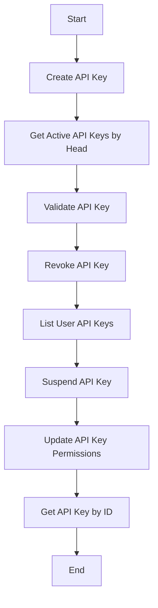

## 类结构

```
APIKeyInfo (API Key Information)
├── APIKeyInfoWithHash (API Key Information with Hash)
│   ├── create_api_key
│   ├── get_active_api_keys_by_head
│   ├── validate_api_key
│   ├── _migrate_key_to_secure_hash
│   ├── revoke_api_key
│   ├── list_user_api_keys
│   ├── suspend_api_key
│   ├── has_permission
│   └── get_api_key_by_id
│   └── update_api_key_permissions
```

## 全局变量及字段


### `logger`
    
Logger instance for logging messages.

类型：`logging.Logger`
    


### `keysmith`
    
APIKeySmith instance for managing API keys.

类型：`autogpt_libs.api_key.keysmith.APIKeySmith`
    


### `MAX_USER_API_KEYS_FETCH`
    
Maximum number of API keys to fetch for a user.

类型：`int`
    


### `NotAuthorizedError`
    
Exception raised when the user is not authorized to perform an action.

类型：`backend.util.exceptions.NotAuthorizedError`
    


### `NotFoundError`
    
Exception raised when a requested resource is not found.

类型：`backend.util.exceptions.NotFoundError`
    


### `APIKeyPermission`
    
Enum representing the permissions of an API key.

类型：`prisma.enums.APIKeyPermission`
    


### `APIKeyStatus`
    
Enum representing the status of an API key.

类型：`prisma.enums.APIKeyStatus`
    


### `PrismaAPIKey`
    
Prisma model representing an API key.

类型：`prisma.models.APIKey`
    


### `APIKeyWhereUniqueInput`
    
Prisma input type for filtering API keys by unique fields.

类型：`prisma.types.APIKeyWhereUniqueInput`
    


### `uuid`
    
UUID module for generating unique identifiers.

类型：`uuid.UUID`
    


### `datetime`
    
Datetime module for handling date and time operations.

类型：`datetime.datetime`
    


### `timezone`
    
Timezone module for handling time zones.

类型：`datetime.timezone`
    


### `Literal`
    
Type hint for literal types.

类型：`typing.Literal`
    


### `Optional`
    
Type hint for optional types.

类型：`typing.Optional`
    


### `Field`
    
Pydantic field decorator for adding metadata to fields.

类型：`pydantic.Field`
    


### `APIKeySmith.HEAD_LENGTH`
    
Length of the head part of an API key.

类型：`int`
    


### `APIKeySmith.TAIL_LENGTH`
    
Length of the tail part of an API key.

类型：`int`
    


### `APIKeySmith.PREFIX`
    
Prefix for API keys.

类型：`str`
    


### `APIKeyInfoWithHash`
    
Subclass of APIKeyInfo with additional hash and salt fields.

类型：`APIKeyInfoWithHash`
    


### `APIKeyInfo`
    
Class representing API key information.

类型：`APIKeyInfo`
    


### `APIKeyInfoWithHash`
    
Class representing API key information with hash and salt fields.

类型：`APIKeyInfoWithHash`
    


### `APIKeyInfo.from_db`
    
Static method to create an APIKeyInfo instance from a PrismaAPIKey instance.

类型：`APIKeyInfo`
    


### `APIKeyInfoWithHash.from_db`
    
Static method to create an APIKeyInfoWithHash instance from a PrismaAPIKey instance.

类型：`APIKeyInfoWithHash`
    


### `APIKeyInfoWithHash.without_hash`
    
Method to create an APIKeyInfo instance from an APIKeyInfoWithHash instance without the hash and salt fields.

类型：`APIKeyInfo`
    


### `create_api_key`
    
Async function to create a new API key and store it in the database.

类型：`tuple[APIKeyInfo, str]`
    


### `get_active_api_keys_by_head`
    
Async function to get active API keys by head.

类型：`list[APIKeyInfoWithHash]`
    


### `validate_api_key`
    
Async function to validate an API key and return the API key object if valid and active.

类型：`Optional[APIKeyInfo]`
    


### `_migrate_key_to_secure_hash`
    
Async function to migrate a legacy API key to a secure hash format.

类型：`APIKeyInfoWithHash`
    


### `revoke_api_key`
    
Async function to revoke an API key.

类型：`APIKeyInfo`
    


### `list_user_api_keys`
    
Async function to list user API keys.

类型：`list[APIKeyInfo]`
    


### `suspend_api_key`
    
Async function to suspend an API key.

类型：`APIKeyInfo`
    


### `has_permission`
    
Function to check if an API key has a specific permission.

类型：`bool`
    


### `get_api_key_by_id`
    
Async function to get an API key by ID.

类型：`Optional[APIKeyInfo]`
    


### `update_api_key_permissions`
    
Async function to update the permissions of an API key.

类型：`APIKeyInfo`
    


### `APIKeyInfo.id`
    
Unique identifier for the API key.

类型：`str`
    


### `APIKeyInfo.name`
    
Name of the API key.

类型：`str`
    


### `APIKeyInfo.head`
    
First part of the API key.

类型：`str`
    


### `APIKeyInfo.tail`
    
Last part of the API key.

类型：`str`
    


### `APIKeyInfo.status`
    
Status of the API key.

类型：`APIKeyStatus`
    


### `APIKeyInfo.description`
    
Description of the API key.

类型：`Optional[str]`
    


### `APIKeyInfo.type`
    
Type of the object, always 'api_key'.

类型：`Literal['api_key']`
    


### `APIKeyInfo.created_at`
    
Creation time of the API key.

类型：`datetime.datetime`
    


### `APIKeyInfo.last_used_at`
    
Last used time of the API key.

类型：`datetime.datetime`
    


### `APIKeyInfo.revoked_at`
    
Revocation time of the API key.

类型：`datetime.datetime`
    


### `APIKeyInfo.user_id`
    
User ID associated with the API key.

类型：`str`
    


### `APIKeyInfoWithHash.hash`
    
Hash of the API key.

类型：`str`
    


### `APIKeyInfoWithHash.salt`
    
Salt used for hashing the API key, None for legacy keys.

类型：`Optional[str]`
    
    

## 全局函数及方法


### `create_api_key`

Generate a new API key and store it in the database. Returns the API key object (without hash) and the plain text key.

参数：

- `name`：`str`，The name of the API key.
- `user_id`：`str`，The ID of the user who owns the API key.
- `permissions`：`list[APIKeyPermission]`，The permissions associated with the API key.
- `description`：`Optional[str]`，An optional description for the API key.

返回值：`tuple[APIKeyInfo, str]`，A tuple containing the API key object (without hash) and the plain text key.

#### 流程图

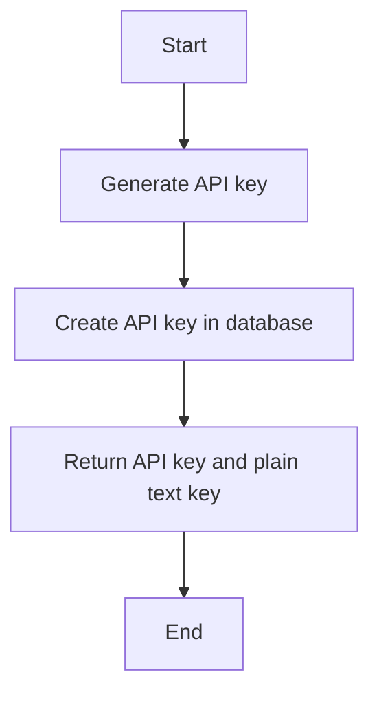

#### 带注释源码

```python
async def create_api_key(
    name: str,
    user_id: str,
    permissions: list[APIKeyPermission],
    description: Optional[str] = None,
) -> tuple[APIKeyInfo, str]:
    """
    Generate a new API key and store it in the database.
    Returns the API key object (without hash) and the plain text key.
    """
    generated_key = keysmith.generate_key()  # Generate a new API key

    saved_key_obj = await PrismaAPIKey.prisma().create(  # Store the API key in the database
        data={
            "id": str(uuid.uuid4()),
            "name": name,
            "head": generated_key.head,
            "tail": generated_key.tail,
            "hash": generated_key.hash,
            "salt": generated_key.salt,
            "permissions": [p for p in permissions],
            "description": description,
            "userId": user_id,
        }
    )

    return APIKeyInfo.from_db(saved_key_obj), generated_key.key  # Return the API key and plain text key
```


### `get_active_api_keys_by_head`

Retrieve a list of active API keys that start with a specific head string.

参数：

- `head`：`str`，The first {APIKeySmith.HEAD_LENGTH} characters of the key. This is used to filter the API keys by their head string.

返回值：`list[APIKeyInfoWithHash]`，A list of API key objects that are active and start with the specified head string.

#### 流程图

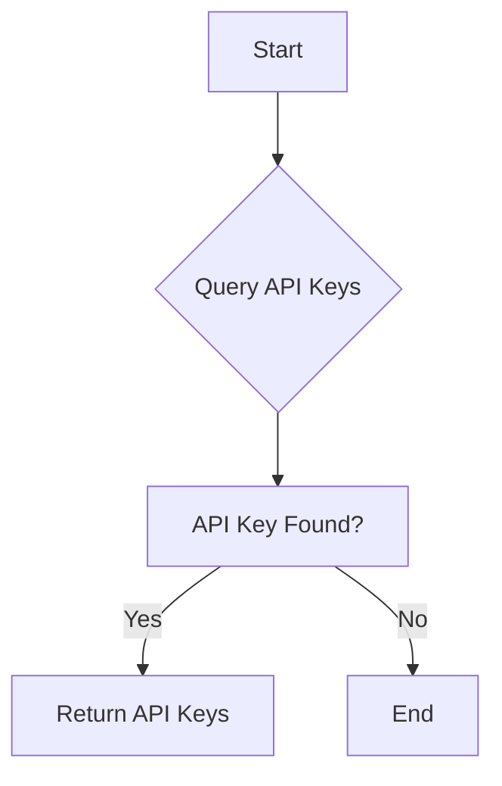

#### 带注释源码

```python
async def get_active_api_keys_by_head(head: str) -> list[APIKeyInfoWithHash]:
    results = await PrismaAPIKey.prisma().find_many(
        where={"head": head, "status": APIKeyStatus.ACTIVE}
    )
    return [APIKeyInfoWithHash.from_db(key) for key in results]
```


### validate_api_key

Validate an API key and return the API key object if valid and active.

参数：

- `plaintext_key`：`str`，The plaintext API key to validate.

返回值：`Optional[APIKeyInfo]`，The API key object if valid and active, otherwise `None`.

#### 流程图

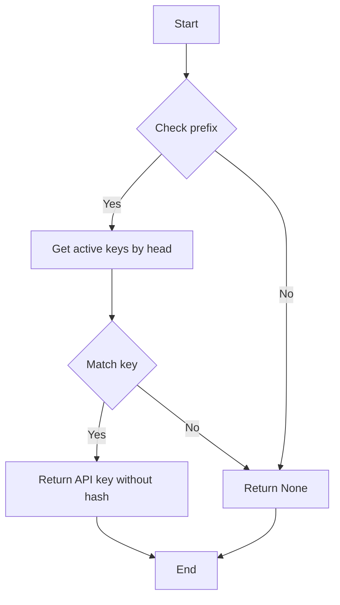

#### 带注释源码

```python
async def validate_api_key(plaintext_key: str) -> Optional[APIKeyInfo]:
    """
    Validate an API key and return the API key object if valid and active.
    """
    try:
        if not plaintext_key.startswith(APIKeySmith.PREFIX):
            logger.warning("Invalid API key format")
            return None

        head = plaintext_key[: APIKeySmith.HEAD_LENGTH]
        potential_matches = await get_active_api_keys_by_head(head)

        matched_api_key = next(
            (pm for pm in potential_matches if pm.match(plaintext_key)),
            None,
        )
        if not matched_api_key:
            # API key not found or invalid
            return None

        # Migrate legacy keys to secure format on successful validation
        if matched_api_key.salt is None:
            matched_api_key = await _migrate_key_to_secure_hash(
                plaintext_key, matched_api_key
            )

        return matched_api_key.without_hash()
    except Exception as e:
        logger.error(f"Error while validating API key: {e}")
        raise RuntimeError("Failed to validate API key") from e
```


### `_migrate_key_to_secure_hash`

Replace the SHA256 hash of a legacy API key with a salted Scrypt hash.

参数：

- `plaintext_key`：`str`，The plaintext API key to be hashed.
- `key_obj`：`APIKeyInfoWithHash`，The API key object containing the legacy hash and salt.

返回值：`APIKeyInfoWithHash`，The updated API key object with the new secure hash and salt.

#### 流程图

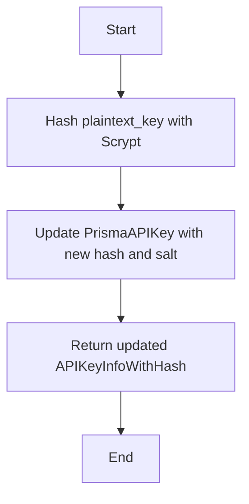

#### 带注释源码

```python
async def _migrate_key_to_secure_hash(
    plaintext_key: str, key_obj: APIKeyInfoWithHash
) -> APIKeyInfoWithHash:
    """Replace the SHA256 hash of a legacy API key with a salted Scrypt hash."""
    try:
        new_hash, new_salt = keysmith.hash_key(plaintext_key)
        await PrismaAPIKey.prisma().update(
            where={"id": key_obj.id}, data={"hash": new_hash, "salt": new_salt}
        )
        logger.info(f"Migrated legacy API key #{key_obj.id} to secure format")
        # Update the API key object with new values for return
        key_obj.hash = new_hash
        key_obj.salt = new_salt
    except Exception as e:
        logger.error(f"Failed to migrate legacy API key #{key_obj.id}: {e}")

    return key_obj
```


### `revoke_api_key`

Revokes an API key by its ID and updates its status to 'REVOKED'.

参数：

- `key_id`：`str`，The unique identifier of the API key to be revoked.
- `user_id`：`str`，The identifier of the user who is revoking the API key.

返回值：`APIKeyInfo`，The API key object with the updated status.

#### 流程图

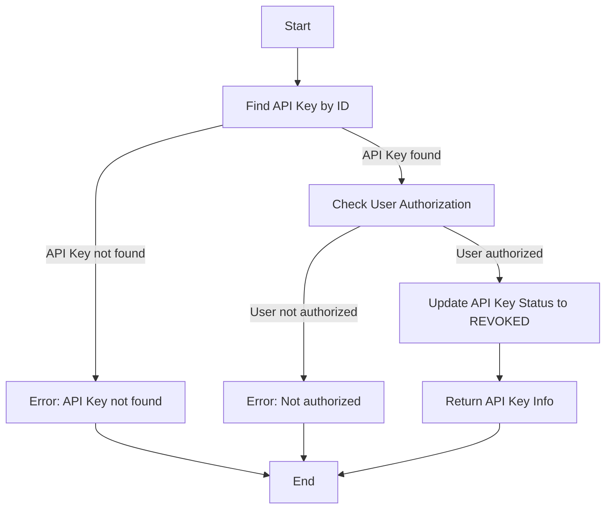

#### 带注释源码

```python
async def revoke_api_key(key_id: str, user_id: str) -> APIKeyInfo:
    api_key = await PrismaAPIKey.prisma().find_unique(where={"id": key_id})

    if not api_key:
        raise NotFoundError(f"API key with id {key_id} not found")

    if api_key.userId != user_id:
        raise NotAuthorizedError("You do not have permission to revoke this API key.")

    updated_api_key = await PrismaAPIKey.prisma().update(
        where={"id": key_id},
        data={
            "status": APIKeyStatus.REVOKED,
            "revokedAt": datetime.now(timezone.utc),
        },
    )
    if not updated_api_key:
        raise NotFoundError(f"API key #{key_id} vanished while trying to revoke.")

    return APIKeyInfo.from_db(updated_api_key)
```


### list_user_api_keys

List user API keys.

参数：

- `user_id`: `str`，The user ID for which to list API keys.
- `limit`: `int`，The maximum number of API keys to return. Defaults to `MAX_USER_API_KEYS_FETCH`.

返回值：`list[APIKeyInfo]`，A list of APIKeyInfo objects representing the user's API keys.

#### 流程图

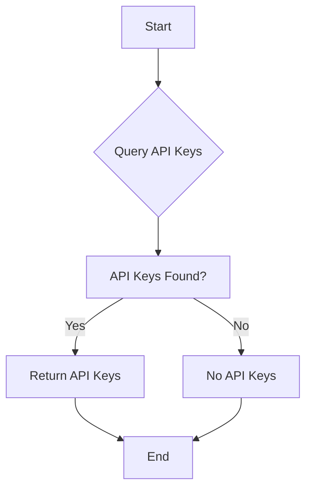

#### 带注释源码

```python
async def list_user_api_keys(
    user_id: str, limit: int = MAX_USER_API_KEYS_FETCH
) -> list[APIKeyInfo]:
    api_keys = await PrismaAPIKey.prisma().find_many(
        where={"userId": user_id},
        order={"createdAt": "desc"},
        take=limit,
    )

    return [APIKeyInfo.from_db(key) for key in api_keys]
```


### `suspend_api_key`

Suspends an API key by updating its status to `SUSPENDED`.

参数：

- `key_id`：`str`，The unique identifier of the API key to be suspended.
- `user_id`：`str`，The identifier of the user who is attempting to suspend the API key.

返回值：`APIKeyInfo`，The API key object with the updated status.

#### 流程图

```mermaid
graph TD
    A[Start] --> B{APIKey.prisma().find_unique(where={key_id})}
    B -->|API key found| C[Update API key status to SUSPENDED]
    B -->|API key not found| D[Throw NotFoundError]
    C --> E[Return APIKeyInfo.from_db(updated_api_key)]
    D --> F[End]
    E --> G[End]
```

#### 带注释源码

```python
async def suspend_api_key(key_id: str, user_id: str) -> APIKeyInfo:
    selector: APIKeyWhereUniqueInput = {"id": key_id}
    api_key = await PrismaAPIKey.prisma().find_unique(where=selector)

    if not api_key:
        raise NotFoundError(f"API key with id {key_id} not found")

    if api_key.userId != user_id:
        raise NotAuthorizedError("You do not have permission to suspend this API key.")

    updated_api_key = await PrismaAPIKey.prisma().update(
        where=selector, data={"status": APIKeyStatus.SUSPENDED}
    )
    if not updated_api_key:
        raise NotFoundError(f"API key #{key_id} vanished while trying to suspend.")

    return APIKeyInfo.from_db(updated_api_key)
```


### `has_permission`

Check if the API key has a specific permission.

参数：

- `api_key`：`APIKeyInfo`，The API key object to check.
- `required_permission`：`APIKeyPermission`，The permission to check for.

返回值：`bool`，`True` if the API key has the required permission, `False` otherwise.

#### 流程图

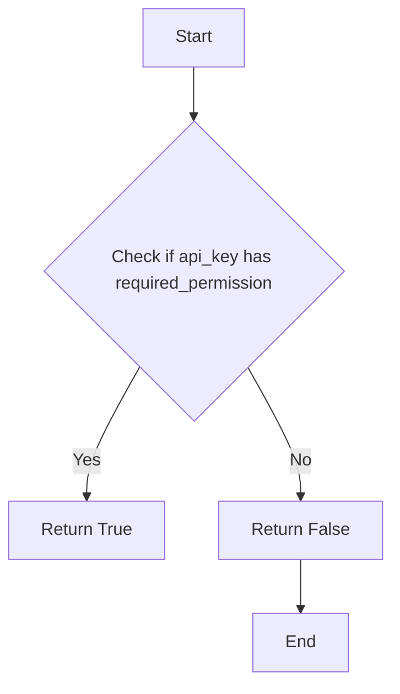

#### 带注释源码

```python
def has_permission(api_key: APIKeyInfo, required_permission: APIKeyPermission) -> bool:
    return required_permission in api_key.scopes
```


### `get_api_key_by_id`

Retrieve an API key by its ID and the user ID associated with it.

参数：

- `key_id`：`str`，The unique identifier of the API key.
- `user_id`：`str`，The unique identifier of the user who owns the API key.

返回值：`Optional[APIKeyInfo]`，The API key information if found, otherwise `None`.

#### 流程图

```mermaid
graph TD
    A[Start] --> B{APIKey.prisma().find_first(where={id: key_id, userId: user_id})}
    B -->|Found| C[APIKeyInfo.from_db(api_key)]
    B -->|Not Found| D[Return None]
    C --> E[End]
    D --> E
```

#### 带注释源码

```python
async def get_api_key_by_id(key_id: str, user_id: str) -> Optional[APIKeyInfo]:
    api_key = await PrismaAPIKey.prisma().find_first(
        where={"id": key_id, "userId": user_id}
    )

    if not api_key:
        return None

    return APIKeyInfo.from_db(api_key)
```


### update_api_key_permissions

Update the permissions of an API key.

参数：

- `key_id`：`str`，The unique identifier of the API key to update.
- `user_id`：`str`，The unique identifier of the user who is updating the API key.
- `permissions`：`list[APIKeyPermission]`，The list of permissions to be assigned to the API key.

返回值：`APIKeyInfo`，The updated API key object.

#### 流程图

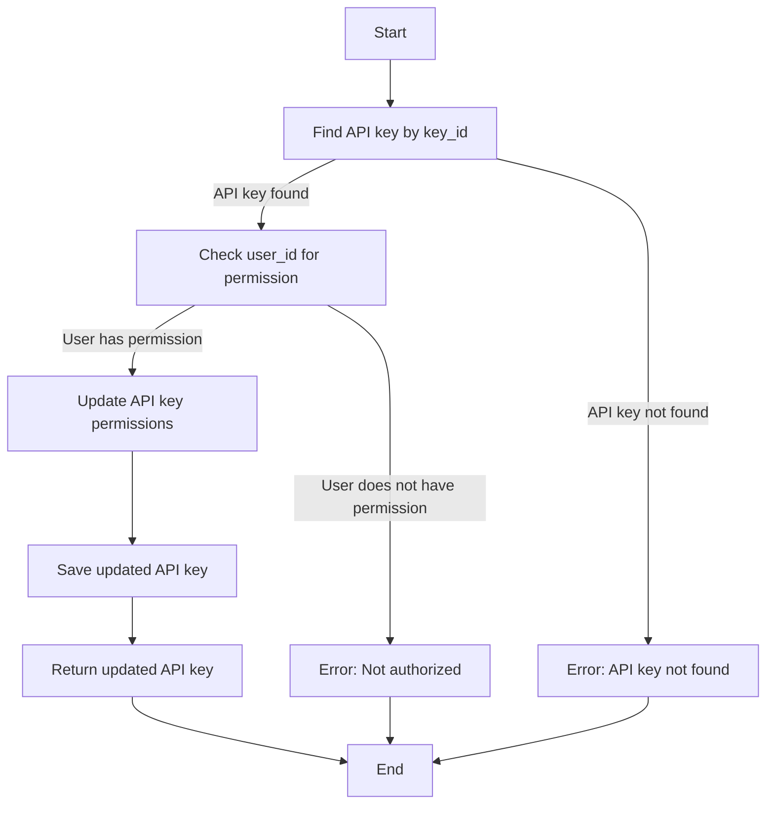

#### 带注释源码

```python
async def update_api_key_permissions(
    key_id: str, user_id: str, permissions: list[APIKeyPermission]
) -> APIKeyInfo:
    """
    Update the permissions of an API key.
    """
    api_key = await PrismaAPIKey.prisma().find_unique(where={"id": key_id})

    if api_key is None:
        raise NotFoundError("No such API key found.")

    if api_key.userId != user_id:
        raise NotAuthorizedError("You do not have permission to update this API key.")

    updated_api_key = await PrismaAPIKey.prisma().update(
        where={"id": key_id},
        data={"permissions": permissions},
    )
    if not updated_api_key:
        raise NotFoundError(f"API key #{key_id} vanished while trying to update.")

    return APIKeyInfo.from_db(updated_api_key)
```


### APIKeyInfo.from_db

This method converts a Prisma APIKey object into an APIKeyInfo object.

参数：

- `api_key`：`PrismaAPIKey`，The Prisma APIKey object to convert.

返回值：`APIKeyInfo`，The converted APIKeyInfo object.

#### 流程图

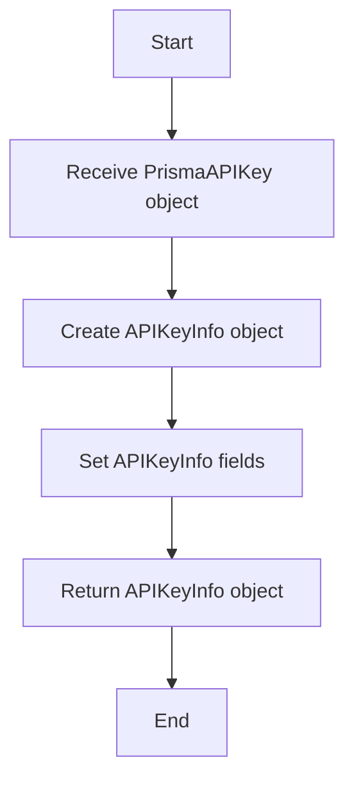

#### 带注释源码

```python
    @staticmethod
    def from_db(api_key: PrismaAPIKey):
        return APIKeyInfo(
            id=api_key.id,
            name=api_key.name,
            head=api_key.head,
            tail=api_key.tail,
            status=APIKeyStatus(api_key.status),
            scopes=[APIKeyPermission(p) for p in api_key.permissions],
            created_at=api_key.createdAt,
            last_used_at=api_key.lastUsedAt,
            revoked_at=api_key.revokedAt,
            description=api_key.description,
            user_id=api_key.userId,
        )
```


### APIKeyInfoWithHash.match

This method checks if the given plaintext key matches the API key object.

参数：

- `plaintext_key`：`str`，The plaintext key to be verified against the API key object.

返回值：`bool`，Returns `True` if the plaintext key matches the API key object, otherwise `False`.

#### 流程图

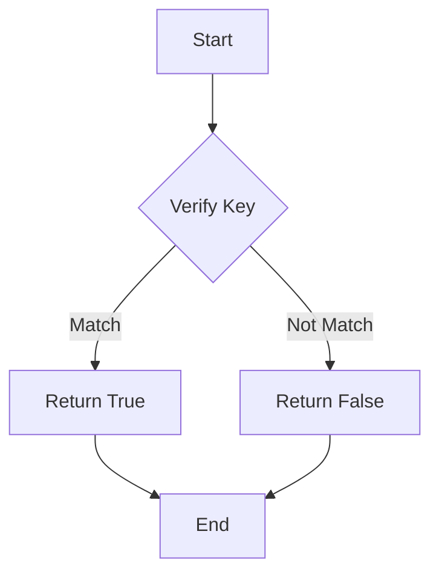

#### 带注释源码

```python
def match(self, plaintext_key: str) -> bool:
    """Returns whether the given key matches this API key object."""
    return keysmith.verify_key(plaintext_key, self.hash, self.salt)
```


### APIKeyInfoWithHash.from_db

This method creates an instance of `APIKeyInfoWithHash` from a `PrismaAPIKey` object.

参数：

- `api_key`：`PrismaAPIKey`，The Prisma database model object representing the API key.

返回值：`APIKeyInfoWithHash`，An instance of `APIKeyInfoWithHash` containing the API key information.

#### 流程图

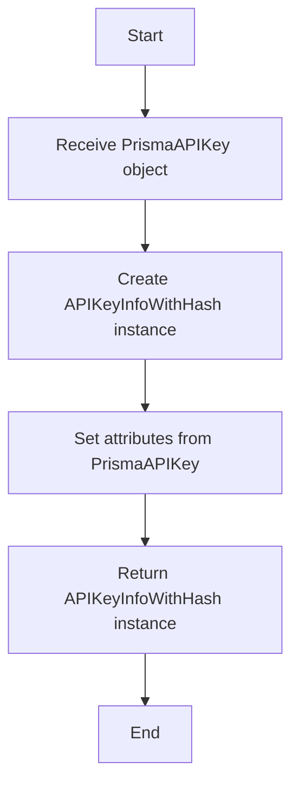

#### 带注释源码

```python
    @staticmethod
    def from_db(api_key: PrismaAPIKey):
        return APIKeyInfoWithHash(
            **APIKeyInfo.from_db(api_key).model_dump(),
            hash=api_key.hash,
            salt=api_key.salt,
        )
```


### APIKeyInfoWithHash.without_hash

This method returns a new instance of `APIKeyInfo` without the `hash` and `salt` fields.

参数：

- 无

返回值：`APIKeyInfo`，A new instance of `APIKeyInfo` without the `hash` and `salt` fields.

#### 流程图

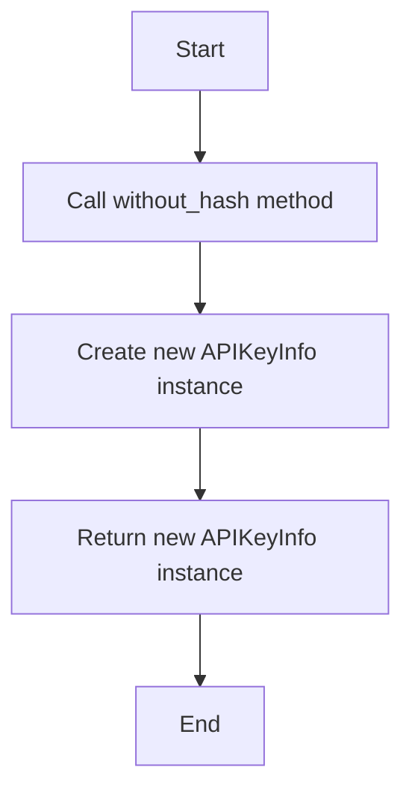

#### 带注释源码

```python
def without_hash(self) -> APIKeyInfo:
    return APIKeyInfo(**self.model_dump(exclude={"hash", "salt"}))
```


## 关键组件


### 张量索引与惰性加载

张量索引与惰性加载是代码中处理数据存储和检索的关键组件，它允许系统在需要时才加载数据，从而提高性能和资源利用率。

### 反量化支持

反量化支持是代码中用于处理量化策略的关键组件，它允许系统根据不同的量化需求调整数据处理的策略。

### 量化策略

量化策略是代码中用于处理数据量化和优化的关键组件，它允许系统根据数据的特点和需求选择合适的量化方法。


## 问题及建议


### 已知问题

-   **全局变量和函数依赖性**：代码中使用了全局变量 `logger` 和 `keysmith`，这可能导致代码的可测试性和可维护性降低。建议将它们作为参数传递给需要它们的函数或方法。
-   **异常处理**：代码中使用了 `raise RuntimeError("Failed to validate API key")` 来处理验证 API 密钥时发生的异常。这可能会导致异常信息不够具体，难以追踪问题。建议提供更详细的异常信息。
-   **代码重复**：`APIKeyInfo` 和 `APIKeyInfoWithHash` 类中存在重复的代码，例如 `from_db` 方法。建议提取重复代码到一个单独的方法中，以减少代码重复并提高可维护性。
-   **数据迁移**：代码中包含了一个数据迁移的步骤，将旧版 API 密钥迁移到新的安全格式。这个过程可能会对现有系统造成影响，建议在实施前进行充分的测试。

### 优化建议

-   **重构全局变量和函数**：将全局变量 `logger` 和 `keysmith` 作为参数传递给需要它们的函数或方法，以提高代码的可测试性和可维护性。
-   **改进异常处理**：在抛出异常时提供更详细的错误信息，以便于问题追踪和调试。
-   **减少代码重复**：提取 `APIKeyInfo` 和 `APIKeyInfoWithHash` 类中重复的代码到一个单独的方法中，以减少代码重复并提高可维护性。
-   **数据迁移测试**：在实施数据迁移之前，进行充分的测试以确保不会对现有系统造成负面影响。
-   **代码注释**：增加必要的代码注释，以提高代码的可读性和可维护性。
-   **单元测试**：编写单元测试来覆盖关键功能，以确保代码的稳定性和可靠性。
-   **性能优化**：评估代码的性能，并针对热点进行优化，以提高系统的响应速度和吞吐量。


## 其它


### 设计目标与约束

- 设计目标：
  - 提供一个安全的API密钥管理系统，包括生成、验证、撤销和更新API密钥。
  - 确保API密钥的存储和传输安全，防止未授权访问。
  - 提供用户友好的接口，方便用户管理自己的API密钥。

- 约束：
  - API密钥必须包含头部、尾部、哈希和盐（对于旧密钥）。
  - API密钥的状态可以是激活、撤销或挂起。
  - 用户只能管理自己的API密钥。

### 错误处理与异常设计

- 错误处理：
  - 使用自定义异常类`NotFoundError`和`NotAuthorizedError`来处理特定的错误情况。
  - 在数据库查询和更新操作中捕获异常，并记录错误日志。

- 异常设计：
  - `NotFoundError`：当请求的API密钥不存在时抛出。
  - `NotAuthorizedError`：当用户没有权限执行操作时抛出。

### 数据流与状态机

- 数据流：
  - 用户请求生成API密钥，系统生成密钥并存储在数据库中。
  - 用户请求验证API密钥，系统验证密钥的有效性和状态。
  - 用户请求撤销或挂起API密钥，系统更新密钥状态。

- 状态机：
  - API密钥状态可以是激活、撤销或挂起。
  - 状态转换：激活 -> 撤销，激活 -> 挂起，挂起 -> 激活。

### 外部依赖与接口契约

- 外部依赖：
  - `prisma`：用于数据库操作。
  - `autogpt_libs.api_key.keysmith`：用于生成和验证API密钥。

- 接口契约：
  - `APIKeySmith`：生成和验证API密钥的接口。
  - `PrismaAPIKey`：数据库模型，用于存储API密钥信息。


    