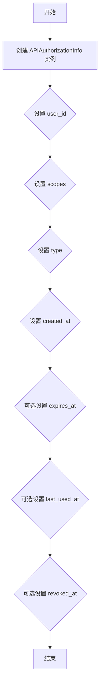

# `.\AutoGPT\autogpt_platform\backend\backend\data\auth\base.py` 详细设计文档

The code defines a Pydantic model for storing API authorization information, including user ID, permissions, and timestamps.

## 整体流程



## 类结构

```
APIAuthorizationInfo (类)
```

## 全局变量及字段


### `APIAuthorizationInfo.user_id`
    
用户ID

类型：`str`
    


### `APIAuthorizationInfo.scopes`
    
权限列表

类型：`list[APIKeyPermission]`
    


### `APIAuthorizationInfo.type`
    
授权类型

类型：`Literal['oauth', 'api_key']`
    


### `APIAuthorizationInfo.created_at`
    
创建时间

类型：`datetime`
    


### `APIAuthorizationInfo.expires_at`
    
过期时间

类型：`Optional[datetime]`
    


### `APIAuthorizationInfo.last_used_at`
    
最后使用时间

类型：`Optional[datetime]`
    


### `APIAuthorizationInfo.revoked_at`
    
撤销时间

类型：`Optional[datetime]`
    
    

## 全局函数及方法


## 关键组件


### 张量索引与惰性加载

张量索引与惰性加载是处理大型数据集时常用的技术，它允许在需要时才加载数据的一部分，从而减少内存消耗和提高效率。

### 反量化支持

反量化支持是指代码能够处理和优化量化数据，通常用于机器学习模型中，以减少模型大小和提高推理速度。

### 量化策略

量化策略是用于将浮点数数据转换为低精度表示的方法，以减少模型大小和加速计算过程。


## 问题及建议


### 已知问题

-   **缺乏错误处理机制**：代码中没有显示的错误处理机制，对于可能的输入错误或异常情况没有相应的处理逻辑。
-   **数据验证不足**：虽然使用了Pydantic进行数据验证，但可能存在一些边界情况或异常输入未被覆盖。
-   **时间戳处理**：`created_at`、`expires_at`、`last_used_at`和`revoked_at`字段都是可选的，但没有明确说明这些时间戳的格式或验证规则。

### 优化建议

-   **实现错误处理**：添加异常处理逻辑，确保在输入数据不符合预期时能够给出明确的错误信息。
-   **增强数据验证**：考虑添加更多的验证规则，确保所有可能的输入都被妥善处理。
-   **规范时间戳格式**：定义一个标准的时间戳格式，并在验证时使用该格式，确保时间戳的一致性和正确性。
-   **考虑使用数据库**：如果APIAuthorizationInfo对象需要在多个地方使用，考虑将其存储在数据库中，以便于持久化和查询。
-   **文档化**：为APIAuthorizationInfo类添加详细的文档说明，包括字段的意义、可能的值、以及如何使用该类。


## 其它


### 设计目标与约束

- 设计目标：确保API授权信息的存储和验证是安全、高效且易于管理的。
- 约束条件：遵循Pydantic的模型验证规则，确保数据的一致性和完整性。

### 错误处理与异常设计

- 错误处理：当输入数据不符合预期时，应抛出Pydantic的验证错误。
- 异常设计：定义自定义异常类，以处理特定的授权错误情况。

### 数据流与状态机

- 数据流：API授权信息从创建到过期或撤销的过程。
- 状态机：定义授权信息的有效、过期、撤销等状态，以及状态之间的转换。

### 外部依赖与接口契约

- 外部依赖：Pydantic库用于数据验证，Prisma库用于数据库操作。
- 接口契约：APIAuthorizationInfo类定义了与数据库交互的接口契约。


    